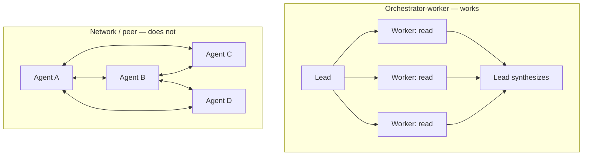

# 01 — The Anatomy of an LLM Agent

**Last researched: 2026-08-02**

---

## TL;DR — Key Takeaways

> 1. **An agent is a loop, not a diagram.** The 2026 definition that survives contact with production: a workflow is a system where *you* wrote the control flow; an agent is a system where the *model* chooses the control flow, grounded by tool results from a real environment. Autonomy is a continuous slider, not a binary, and it is co-constructed by the model, the user, and the product surface — not a fixed property of any of the three.
> 2. **The harness matters as much as the model.** The same model scores 42% with a minimal scaffold and 78% inside a full harness on CORE-Bench; independent tests show 5–40 percentage-point swings from the harness alone. If you are building an agent platform, you are building the thing that produces most of the measured variance.
> 3. **Context engineering is the discipline, and the effective context window is far smaller than the advertised one.** Every frontier model degrades measurably as input grows, with accuracy loss beginning around 50k tokens of genuinely relevant content inside windows rated at 1M. Budget to a fraction of the ceiling and reclaim space in this order: raw → compaction (reversible) → summarization (lossy).
> 4. **Tool-set size is a first-order failure mode.** Tool-selection accuracy degrades past roughly 30–50 tools. Two orthogonal fixes now exist as shipped primitives: deferred/searchable tool loading (trims *definitions*) and code-execution-as-tool-calling (trims *results* and round trips, with reported reductions of 78–99%).
> 5. **Memory is four tiers, and the filesystem beat the vector database for the agent-authored tiers.** Working / episodic / semantic / procedural is the settled taxonomy. Files-as-memory won for procedural and semantic memory because it is inspectable, diffable, and legible to both the model and the human. The unsolved part is governance: consolidation, staleness, and conflict.
> 6. **MCP is the dominant tool interop standard and it just went stateless.** The `2026-07-28` spec removed the handshake and session header, making MCP servers ordinary horizontally-scalable HTTP services. It is also wire-incompatible with prior versions, deprecates Roots/Sampling/Logging, and carries a well-documented trust-model problem: 40+ CVEs and a spec that declares tool descriptions untrusted while providing no mechanism to enforce that.
> 7. **Multi-agent is usually the wrong answer.** Anthropic's own numbers: ~4× tokens for a single agentic loop, ~15× for multi-agent — and on BrowseComp, token spend alone explained ~80% of the performance variance. Most "multi-agent wins" are compute wins you could buy more cheaply with a bigger turn budget.
> 8. **For `function2agent`: the promotion of a function into an agent is 90% metadata and context engineering, 10% loop.** The loop is fifty lines. What earns its keep is the tool contract (naming, schema, error text, token-bounded returns), progressive disclosure, budget enforcement, and durable state. Design the *promotion artifact*, not the runtime.

---

## 1. What an "LLM agent" is in 2026

### 1.1 The four-way distinction

The terminology finally stabilized, largely around Anthropic's framing, which draws the line at **who owns control flow**:

| Construct | Who decides the next step | Steps known in advance | Grounded by environment |
|---|---|---|---|
| **Single model call** | Nobody — one shot | 1 | No |
| **Chain** | You, statically | Yes, fixed | Usually no |
| **Workflow** | You, with branches | Yes, enumerable | Sometimes (a node may call a tool) |
| **Agent** | The model, per step | No | Yes — every step reads real tool output |

Anthropic's definition: *"Workflows are systems where LLMs and tools are orchestrated through predefined code paths. Agents … are systems where LLMs dynamically direct their own processes and tool usage, maintaining control over how they accomplish tasks."* ([Building Effective AI Agents](https://www.anthropic.com/engineering/building-effective-agents))

The operational test I would actually apply: **if you can draw the flowchart, you do not need an agent.** A workflow is a flowchart you executed. An agent is a goal plus a budget plus guardrails, where the flowchart is emitted at runtime and is different every time.

There is a second, complementary definition worth holding: Anthropic's autonomy research defines an agent as *"an AI system equipped with tools that allow it to take actions, like running code, calling external APIs, and sending messages to other agents"* — i.e. the defining feature is **effect on the world**, not cleverness ([Measuring AI agent autonomy in practice](https://www.anthropic.com/research/measuring-agent-autonomy)). These two definitions are not in tension: the first is about control, the second about capability. You need both to be an agent. A model that reasons for 10,000 tokens and returns text is not an agent; a model that runs one `curl` under your explicit instruction is barely one.

### 1.2 The autonomy spectrum

Autonomy is a slider with roughly five detents. This is a synthesis of the common practitioner framing (see [The Autonomy Slider](https://engineeratheart.medium.com/the-autonomy-slider-a-decision-framework-for-when-to-use-workflows-single-agents-or-multi-agent-7da35e415923)) — the level *numbering* is convention, not standard, but the progression is real:

```
L0  Deterministic code            rules, regex, a switch statement
L1  Model-in-a-slot               fixed pipeline, LLM at one or two nodes; you own every branch
L2  Tool-choosing agent           model picks tools and step count; you own the goal, budget, guardrails
L3  Self-critiquing agent         L2 + explicit verify/reflect/retry stage inside the loop
L4  Multi-agent system            L2/L3 + delegation to isolated sub-contexts
```

The critical property of this ladder is that **each rung costs latency, tokens, and predictability, and each rung's error modes compound the previous rung's.** Anthropic's guidance is to use the simplest pattern that passes your eval, and to reserve agents for cases where you cannot hardcode the path *but can still verify progress*. That second clause is the one teams skip. Agentic autonomy is only safe where the environment returns ground truth: tests pass/fail, the compiler errors, the screenshot shows the button, the API returns 4xx. Where there is no ground-truth signal, an agent is a random walk with a confident narrator.

A useful sanity check on the industry's own behavior: the labs building the frontier models do not ship swarms as their flagship consumer products. Claude, ChatGPT, and Gemini are, architecturally, single agents with tool calling and delegation as an option. That is evidence, though not proof, that L2 with good context engineering dominates L4 for most workloads.

### 1.3 The uncomfortable finding: the harness is the product

The most decision-relevant empirical result of the last year is that **the scaffold around the model explains a large fraction of measured agent performance.** Reported figures:

- Claude Opus measured at **77% in one harness and 93% in another** on the same task set (independent test by Matt Mayer, as reported in [this harness comparison](https://dev.to/joozio/claude-code-vs-codex-cli-vs-aider-vs-opencode-vs-pi-vs-cursor-which-ai-coding-harness-actually-79l)).
- CORE-Bench: Claude Opus at **42% with a minimal scaffold, 78% inside a full harness**.
- Across studies, the harness effect ranges roughly **5 to 40 percentage points** depending on model and task type.

*Confidence: medium.* These specific numbers come from a secondary aggregation rather than a peer-reviewed source, and harness comparisons are notoriously sensitive to prompt and tool differences. But the *direction and rough magnitude* are corroborated by Cognition's own FrontierCode leaderboard practice: it reports each model **paired with a harness** (`claude-code`, `codex`, `SWE-agent`) and explicitly warns that scores from different harnesses are "directional rather than directly comparable" ([FrontierCode leaderboard notes](https://codingfleet.com/blog/frontiercode-v11-main-leaderboard-2026/)).

**Relevance to `function2agent`:** this is the strongest possible argument for the project's existence. If promoting a function into an agent is largely a harness-construction problem, and harness quality is worth tens of points, then a system that does the promotion *well and uniformly* is capturing the largest available lever. It is also a warning: a bad automatic promotion will produce measurably bad agents, and the badness will look like a model problem to your users.

---

## 2. The agent loop: five components

Strip away every framework and the loop is this:

```python
# The whole thing. Everything else is quality of implementation.
def run(goal, tools, budget):
    state = State(goal)
    while not budget.exhausted():
        context   = assemble_context(state, tools)      # (2) context assembly
        step      = model.generate(context)             # (1) model / policy
        if step.is_terminal():                          # (5) termination
            return step.result
        for call in step.tool_calls:                    # (3) tool invocation
            obs = execute(call, sandbox)                # (4) environment
            state.append(call, obs)
        budget.charge(step.usage)
    return state.best_effort()
```

Everything that matters lives in the five labeled seams.

### 2.1 Model / policy

The model *is* the policy function: `context → action`. Three consequences worth internalizing.

**It is stateless.** All continuity is a property of what you re-send. There is no hidden agent state on the provider side unless you opted into a server-managed conversation object. This is why "memory" is an architecture problem, not a model feature.

**Reasoning effort is now a tunable dial, not a model choice.** As of 2026, frontier models expose graded reasoning budgets — the Claude Agent SDK takes `effort: 'low' | 'medium' | 'high' | 'xhigh' | 'max' | number` at both session and subagent granularity ([Agent SDK subagents](https://code.claude.com/docs/en/agent-sdk/subagents.md)), and Claude Opus 5 ships with adaptive thinking on by default. Benchmark submissions are reported at a specific effort level (Fable 5's 53.5% FrontierCode Main is at `xhigh`). Treat effort as a per-role knob: a planner at high effort and an executor at low effort is often strictly better than both at medium for the same spend.

**Policy quality is not uniform across the loop.** A model can be excellent at picking the next tool and poor at knowing when to stop; excellent at writing code and poor at reading a 40k-token log. Measure per-seam, not per-agent.

### 2.2 Context assembly

This is the component teams under-build, and section 3 is devoted to it. The one structural point here: **context assembly should be a pure function of durable state, not an accumulating buffer.** If your loop's context is "whatever we appended last turn, plus one more thing," you have no ability to compact, replay, branch, or debug. If it is `render(state) -> messages`, you get compaction, deterministic replay, and time travel almost for free.

### 2.3 Tool invocation

The seam where correctness is won or lost, because it is the only place the agent can cause harm and the main place it consumes context. Section 5 covers design. Loop-level requirements:

- **Parallel tool calls in one turn.** Non-negotiable for latency. Three independent reads should be one turn, not three.
- **Structured errors, not exceptions.** A failed tool call must return an observation the model can act on, never crash the loop. See §5.3.
- **Idempotency keys on mutating calls.** Because the loop *will* be retried or resumed, and a duplicated `POST` is a real incident.
- **Per-call and cumulative caps.** Wall-clock timeout, output byte cap, and a call-count budget per tool.

### 2.4 Environment / observation

The agent's contact with reality. Two properties determine whether the whole system works:

**Observations must be truthful and bounded.** A tool that silently truncates, or that returns "success" on partial failure, poisons the context (§3.4) and the agent will confidently build on the lie for the rest of the run.

**Observations must be *informative about progress*.** This is the deep requirement behind "only use agents where you can verify progress." A test suite is a great environment. A search API that always returns ten plausible results regardless of query quality is a terrible one, because every action looks equally successful.

### 2.5 Termination conditions

Termination is where naive loops burn money. You need **all** of these, and you need them as first-class configuration rather than magic numbers:

| Condition | Why |
|---|---|
| Model emits a final answer with no tool calls | The intended exit |
| Max turns / max tool calls | Hard stop on runaway loops |
| Token budget (input + output, cumulative) | The real cost ceiling; input dominates in long runs |
| Wall-clock deadline | For anything user-facing |
| Compaction-count budget | Proxy for "this task has grown unbounded." Anthropic explicitly suggests combining `pause_after_compaction` with a compaction counter to estimate cumulative usage and wrap up gracefully ([compaction docs](https://platform.claude.com/docs/en/build-with-claude/compaction)) |
| No-progress detector | N consecutive turns with no state change, or a repeated (tool, args) pair — the signature of context distraction (§3.4) |
| Explicit human-abort / cancellation | See §8.2 |

The no-progress detector is the one most often missing and the one that saves the most money. A loop that has called the same tool with the same arguments three times is not thinking; it is stuck, and every additional turn makes the context worse.

---

## 3. Context engineering: the central discipline

Context engineering has displaced prompt engineering as the core production skill. The definition worth using: **deciding exactly which tokens earn a place in the window at each step**, treating the window as a scarce, contended, actively-managed resource rather than a bucket.

### 3.1 The empirical foundation: the effective window is much smaller than the rated window

The claim that justifies the whole discipline: **every frontier model gets measurably worse as context grows, well before the window fills.** Reported findings:

- Across 18 frontier models studied, **every one** showed measurable performance decline as input length grew — the phenomenon named **context rot** ([Zylos: Context Engineering as a Runtime Discipline](https://zylos.ai/research/2026-04-19-context-engineering-agent-runtime-discipline/)).
- Chroma's data puts **accuracy loss beginning around 50,000 tokens of genuinely relevant information**, inside windows rated for 200k–1M ([2026 context engineering playbook](https://cruxdigits.nl/blog/context-engineering-ai-agents-2026/)).
- Practitioner rule of thumb: for a model advertising 1M tokens, the **high-quality zone is often under ~256k** ([Phil Schmid, Context Engineering Part 2](https://www.philschmid.de/context-engineering-part-2)).

*Confidence: high on direction, medium on thresholds.* The 50k and 256k figures are useful planning numbers, not physical constants; they will vary by model, task, and how much of the context is genuinely relevant vs. filler. Measure your own.

The practical rule: **budget an agent's working context to a fraction of the window's rated size, and re-measure the total whenever you add a tool or a retrieval source.** A worked example from the same playbook, for a single support-ticket task: 5,000 tokens of tool definitions + 3,000 of retrieval + 4,000 for an eight-turn history + three tool calls averaging 1,500 tokens ≈ **16,500 tokens of working context** for one ticket. Each new MCP server you wire in usually costs more than the line item you budgeted.

### 3.2 System prompt design

The system prompt is the only context you fully control on every single turn, which makes it the highest-leverage and most-abused real estate.

What belongs there:
- **Role and scope**, in two or three sentences. What this agent is for and — more usefully — what it must refuse.
- **The loop contract**: how to use tools, when to stop, what "done" means, what to do when blocked. Agents fail more often from not knowing when to stop than from not knowing what to do.
- **Hard invariants**, phrased as rules with consequences: "never modify files outside the workspace," "always run the test suite before declaring completion."
- **Output contract** for the final answer, if downstream code parses it.
- **Pointers, not payloads.** "Project conventions are in `CONVENTIONS.md`; read it before editing" beats inlining 4,000 tokens of conventions that are irrelevant to 80% of tasks.

What does not belong there:
- Few-shot examples that duplicate what tool schemas already say. Put usage examples on the *tool* — this is exactly what Anthropic's Tool Use Examples feature is for (§5.4).
- Long enumerations of edge cases. These are what skills and progressive disclosure exist for (§5.5).
- Anything you can compute. If you can determine at assembly time that this run cannot touch the database, do not spend tokens explaining database policy.

A concrete anti-pattern worth naming: the **"kitchen-sink CLAUDE.md."** Declarative project-memory files (`CLAUDE.md`, `AGENTS.md`) are genuinely valuable as lightweight procedural memory ([Zylos memory survey](https://zylos.ai/research/2026-04-05-ai-agent-memory-architectures-persistent-knowledge/)) — and they rot into 8,000-token dumping grounds that get injected on every turn of every task. Treat them as an index with hard size caps, and push detail behind file reads.

### 3.3 Context budgeting, compaction, and summarization

The field converged on a four-verb vocabulary — **write, select, compress, isolate** — and on a strict preference ordering for reclaiming space.

**The ordering: raw → compaction → summarization.** This distinction is the single most useful operational idea in context engineering right now, and it comes from the Manus team via Phil Schmid:

- **Compaction is reversible.** You strip information that is redundant *because it exists in the environment*. Drop the 3,000-line file contents from turn 4 and leave behind the path and a note; if the agent needs it again it re-reads the file. Nothing is destroyed.
- **Summarization is lossy.** An LLM rewrites history into prose. Information not in the summary is gone forever.

Prefer raw; when raw won't fit, compact; summarize only when compaction no longer yields enough space. ([Context Engineering Part 2](https://www.philschmid.de/context-engineering-part-2))

**Two implementation details that matter more than they sound:**

1. **Keep the most recent tool calls raw, in full detail, through a summarization.** Manus does this deliberately: it preserves the model's "rhythm" and formatting style and prevents output-quality degradation. A summarized-only history produces an agent that starts writing summaries instead of doing work.
2. **Summaries must preserve *constraints*, not *narrative*.** The failure mode is a summary that reads beautifully to a human and is useless to an agent. What must survive: which approaches already failed, which files were created, which assumptions were invalidated, which handles can be re-fetched, which uncertainties remain open. Emit typed artifacts (decisions, file changes, open questions), not prose. ([Deep dive into context engineering](https://code.likeagirl.io/deep-dive-into-context-engineering-for-ai-agents-584bf3e578df))

**Provider-native compaction now exists.** Anthropic ships server-side compaction as an API beta (`anthropic-beta: compact-2026-01-12`), configured as a context-management edit:

```json
{
  "context_management": {
    "edits": [{
      "type": "compact_20260112",
      "trigger": { "type": "input_tokens", "value": 150000 },
      "pause_after_compaction": true
    }]
  }
}
```

Mechanics worth knowing ([compaction docs](https://platform.claude.com/docs/en/build-with-claude/compaction)):
- `input_tokens` is the only trigger type, and `value` must be **at least 50,000**.
- On subsequent requests the API **automatically drops all content blocks prior to the `compaction` block**, continuing from the summary. You append the response to your messages and keep going.
- `pause_after_compaction` stops after generating the summary so you can inject additional blocks — recent messages, standing instructions — before the model continues. This is the hook that makes native compaction usable for real agents rather than chatbots, and it is where you re-assert your invariants.
- Combining it with a compaction counter gives you a cheap cumulative-usage proxy for the budget ceiling.

Set triggers well below the rot threshold, not at the API limit: roughly **70–75% of your intended working budget**, and the working budget is already a fraction of the rated window.

**Proactive compression is a third option.** Algorithms like ACON are reported to cut peak token usage **26–54% without parameter updates** ([Zylos runtime discipline](https://zylos.ai/research/2026-04-19-context-engineering-agent-runtime-discipline/)). *Confidence: low-medium* — I could not independently verify the ACON figures against a primary paper, and I would treat them as directional.

**Context folding** is the emerging variant worth watching: the agent branches to handle a subtask and then *folds* it on completion, collapsing intermediate steps while retaining a concise outcome. This is the same idea as subagent isolation (§3.5) implemented in-process rather than as a separate actor, and it is a better fit for `function2agent` than spawning real subagents (see §7.4).

### 3.4 The four failure modes

Drew Breunig's taxonomy is the standard vocabulary; it predates 2026 but has not been improved on ([How Long Contexts Fail](https://www.dbreunig.com/2025/06/22/how-contexts-fail-and-how-to-fix-them.html)).

| Failure | Mechanism | Concrete signature in an agent | Primary mitigation |
|---|---|---|---|
| **Poisoning** | A hallucination or error enters context and is then repeatedly referenced as ground truth | Agent pursues a file, endpoint, or goal that does not exist, and cannot be talked out of it | Validate tool output at the boundary; never let the model's *claims* become state, only tool *results*; make state corrections explicit and destructive |
| **Distraction** | Context grows until the model over-weights history and under-weights its trained priors | Agent repeats a previous action instead of trying something new; loops | Compact aggressively; cap history; **no-progress detector** as a hard stop |
| **Confusion** | Superfluous-but-not-wrong content degrades output — most commonly too many similar tool definitions | `send_email` vs. `send_slack` with near-identical descriptions; model picks wrong | Shrink the tool set; deferred tool loading; disambiguate descriptions (§5.2) |
| **Clash** | Two parts of context genuinely contradict each other | Long-term memory says "prefers mornings," this thread says "avoid mornings"; earlier wrong attempt still visible | Timestamp and rank memory by recency/authority; **remove** superseded turns rather than appending corrections |

Two things to note. First, **larger windows amplify these rather than fixing them** — more space means more surface area for stale, contradictory, and irrelevant content. Second, **clash is the one most often caused by your own memory system.** The moment you add cross-session memory, you have created a machine for injecting statements that contradict the current thread. Recency and authority ranking is not a nice-to-have.

### 3.5 Retrieval and sub-agent context isolation

**Retrieval.** Two things changed in how experienced teams do retrieval for agents:

1. **Agentic search often beats embedding search** for code and structured corpora. Giving the model `grep`, `glob`, and `read_file` and letting it navigate frequently outperforms a vector index, because the model can iterate on its own query and the filesystem is ground truth. Reserve embeddings for genuinely unstructured, large, semantically-indexed corpora.
2. **Over-eager retrieval is now the more common failure than under-retrieval.** Retrieval is the main vector for context confusion. Retrieve fewer, shorter, higher-precision chunks, and make it easy for the agent to fetch more on demand.

**Sub-agent context isolation.** The strongest argument for multiple agents is not division of labor; it is that **each sub-agent gets a clean window.** The parent hands a self-contained brief, the child burns 80k tokens exploring, and returns 800 tokens of distilled findings. The parent's context never sees the 80k.

This is genuinely valuable and it has a real cost: **the summarization seam is lossy and you pay for the discarded tokens.** Every fact the child saw and did not include is gone. This is precisely why isolation works beautifully for read-heavy exploration and fails for write-heavy interdependent work (§7.2).

**Relevance to `function2agent`:** context isolation should be an available *execution mode* for a promoted function, selectable per-tool, not an architecture decision made once. A promoted function whose job is "search the codebase and report" wants isolation. A promoted function whose job is "apply this migration" must not have it, because its findings and its writes are the same object.

---

## 4. Memory architecture

### 4.1 The four tiers

The ecosystem converged on a taxonomy borrowed from cognitive science, most directly via the **CoALA** framework (Sumers et al., 2024), which models a language agent as working memory plus long-term memory split into semantic, episodic, and procedural components.

| Tier | Contents | Lifetime | Typical substrate | Who writes it |
|---|---|---|---|---|
| **Working** | Current messages, tool calls, active plan, scratchpad | The turn / the run | The context window itself | The loop |
| **Episodic** | Timestamped events: what happened, what was tried, what failed | Cross-session, decaying | Append-only log, run transcripts, event store | The loop, automatically |
| **Semantic** | Durable facts: preferences, conventions, entity relationships, project state | Indefinite, revisable | Files, KV store, vector+graph hybrid | The agent, curated |
| **Procedural** | How to do things: workflows, playbooks, learned recipes | Indefinite, versioned | `SKILL.md` files, `CLAUDE.md`/`AGENTS.md`, code | Humans and agents |

([Mem0 on semantic memory](https://mem0.ai/blog/semantic-memory-for-ai-agents); [Zylos memory survey](https://zylos.ai/research/2026-04-05-ai-agent-memory-architectures-persistent-knowledge/))

The distinction that carries operational weight is **episodic vs. semantic**. Episodic memory is cheap to write and expensive to read (it grows without bound and most of it is noise). Semantic memory is expensive to write correctly and cheap to read. The **consolidation** step — promoting durable facts out of episodic logs into semantic memory, and discarding the rest — is where memory systems succeed or fail. Without it you get twenty timestamped copies of the same preference and a guaranteed context clash.

**The promotion bar should be high.** The rule of thumb I would adopt: *durable memory should contain only things that continue to constrain future reasoning.* Everything else needs an extremely strong case. Storing too much is not a neutral cost — it is context pollution that you have made permanent ([deep dive](https://code.likeagirl.io/deep-dive-into-context-engineering-for-ai-agents-584bf3e578df)).

### 4.2 The LLM-managed-paging model

Letta's design is the clearest expression of one influential pattern: memory as **OS virtual memory, paged by the model itself.**

- **Core memory** — always in context, small, like RAM.
- **Archival memory** — external, unbounded, searched by similarity.
- **Recall memory** — conversation history, pageable in chunks.

The model controls all three via tool calls: `core_memory_replace`, `archival_memory_search`, `archival_memory_insert`. ([Zylos memory survey](https://zylos.ai/research/2026-04-05-ai-agent-memory-architectures-persistent-knowledge/))

The insight to steal is not the specific tier names; it is that **memory management should be exposed to the agent as tools, so that memory decisions are made with task context available.** A background pipeline deciding what to remember has strictly less information than the agent that just finished the task.

### 4.3 Filesystem-as-memory

The most consequential shift of the past year: for agent-authored memory, **the file beat the vector.** Not because vectors are technically inferior at similarity search, but because files are *inspectable, versionable, portable, composable, and simultaneously legible to both the model and the human who must curate and trust the store* ([Files as Memory](https://memm.dev/docs/paper/)).

Recurring design features across filesystem-memory implementations:

- **Structured markdown with YAML frontmatter** as the record format.
- **Tiered content within a file** — a catalog/summary layer, an overview layer, and full detail — so the agent loads the cheap layer first and drills down only when needed. This is progressive disclosure applied to memory.
- **Hybrid multi-signal scoring** for retrieval (full-text + recency + importance) rather than pure embedding similarity.
- **Explicit lifecycle governance**: consolidation, staleness detection, conflict resolution, garbage collection.

And the honest counter-evidence, which is important because filesystem memory is currently over-sold. The first systematic study of filesystem-based agent memory found that organization reliably buys **search economy** — organized stores roughly *halve* retrieval cost when the material is large — but also that **today's agents fall short of the promise: organization erodes as the store grows**, and updates do not reliably land correctly over time ([Filesystem-Based Memory for LLM Agents, arXiv:2607.26637](https://arxiv.org/html/2607.26637)).

Read that as: files are the right substrate, and **the agent cannot yet be trusted to be its own librarian without supervision.** Budget for a curation mechanism — periodic human review, a scheduled consolidation pass with tests, or hard schema constraints — rather than assuming self-organization.

### 4.4 Scratchpads, note-taking, and cross-session state

**Scratchpad.** A file or state field the agent writes freely during a run. Cheap, effective, and the primary defense against compaction loss: if the plan and findings live in `notes.md`, summarization can be aggressive because the durable artifacts are outside the window. This is the "write" verb of write/select/compress/isolate.

**Todo lists as externalized working memory.** A tracked task list is not primarily a planning device — it is a re-anchoring device. On a long run, re-reading an explicit checklist counteracts distraction (the model's tendency to drift into repeating history). See §6.4.

**How state persists across sessions.** In practice there are four mechanisms, and mature systems use several:

1. **Thread/checkpoint state** — the full loop state, serialized per step, keyed by a thread id. Gives resume, time travel, and human-in-the-loop pauses. This is LangGraph's checkpointer model (§ file 02).
2. **Cross-thread store** — key-value or document storage for facts that outlive the thread. LangGraph draws exactly this line: checkpointers are thread-scoped short-term memory, stores are cross-thread long-term memory ([LangGraph persistence](https://docs.langchain.com/oss/python/langgraph/persistence)).
3. **Workspace files** — the repo, the scratchpad, the memory directory. Survives because it is on disk, not because your framework saved it.
4. **Provider-side conversation objects** — server-managed history. Convenient; a lock-in and portability decision.

**Relevance to `function2agent`:** a promoted function needs a declared memory contract. Which tiers does it get? Is its semantic memory scoped to the caller, the tenant, or global? For most promoted functions the honest answer is *episodic only, scoped to the run* — and that is a feature, because a function that accumulates cross-invocation semantic memory has quietly become a stateful service with all the attendant governance problems.

---

## 5. Tool design

This is the section most directly relevant to `function2agent`, because a promoted function *is* a tool, and the quality of the promotion is the quality of the tool contract.

### 5.1 What makes a tool good vs. bad for an LLM

The mental model that produces good tools: **you are writing an API for a capable but amnesiac contractor who will read your docs exactly once, cannot ask clarifying questions, and will be penalized for every token they read.**

**Naming.** Verb-first, namespaced, and unambiguous against every other tool in the set. `search_customer_orders` beats `query`. Namespacing (`stripe_refund_create`) matters once you aggregate sources, because collisions cause confusion failures. Avoid near-synonyms in the same set: `get_user`, `fetch_user`, and `lookup_user` coexisting is a bug in your tool set, not in the model.

**Descriptions.** The description is the retrieval key and the selection criterion. It must say **what it does *and when to use it*, and ideally when not to.** The Agent Skills spec makes this rule explicit for skills — *"all 'when to use' information goes in the description"* ([Agent Skills spec](https://www.mintlify.com/anthropics/skills/spec/overview)) — and the same discipline applies to tools. A good pattern:

```
Refund a Stripe charge. Use when the customer has an existing completed
payment and you have confirmed the refund amount. Do NOT use for
subscription cancellations (use stripe_subscription_cancel) or for
disputing chargebacks (not supported).
```

Note that this description is doing disambiguation work against sibling tools. That is its main job in a large tool set.

**Parameter schemas.** Rules that pay off:
- **Constrain the type system as hard as the domain allows.** Enums over free strings. A closed enum removes an entire class of retry loop.
- **Prefer flat over nested.** Deeply nested objects produce more malformed calls.
- **Make required actually required, and keep the required set minimal.** Every optional parameter is a decision the model must make.
- **Never accept an opaque identifier the model cannot have obtained.** If a tool needs an internal `order_uuid`, there must be a discoverable path to get one. Otherwise the model will hallucinate it — this is a top cause of context poisoning.
- **Put units and formats in the parameter description**, not the tool description. `"amount_cents: integer, amount in cents (e.g. 1050 for $10.50)"`.

**Return shape.** See §5.3 — this is where most tokens are wasted.

**A useful negative test:** if a competent engineer reading only your tool schema would have to guess, the model will guess worse.

### 5.2 Tool-set sizing and the tool-confusion problem

This is a measured, quantified failure mode, not a vibe. Anthropic's own documentation states it plainly:

> **"Claude's ability to pick the right tool degrades once you exceed 30–50 available tools."** ([Tool search tool docs](https://platform.claude.com/docs/en/agents-and-tools/tool-use/tool-search-tool))

And the context cost is large before any work happens: a typical five-server MCP setup (GitHub, Slack, Sentry, Grafana, Splunk) consumes **~55,000 tokens in tool definitions** before the agent reads the request. Scale to dozens of servers and you are at ~150,000 tokens of definitions ([Anthropic: code execution with MCP](https://www.anthropic.com/engineering/code-execution-with-mcp)).

So there are two separate problems, and they need separate fixes:

| Problem | Layer | Fix |
|---|---|---|
| Too many *definitions* eating context and degrading selection | Prompt/schema layer | Deferred + searchable tool loading (§5.4) |
| Too many *results* and round trips eating context | Execution layer | Code-execution-as-tool-calling (§5.6) |

Trimming one relocates the problem to the other. Large tool surfaces need both.

**The unglamorous first fix is still curation.** Before reaching for either mechanism: does this agent need 200 tools, or does it need 12 and a clear role? Role-scoped tool allowlists per agent (and per subagent) are cheaper and more predictable than any dynamic mechanism.

### 5.3 Error-message design and token-efficient returns

**Error messages are prompts.** They are read by a model that will decide what to do next, and they are the highest-leverage text in your whole tool implementation. Design rules:

```
BAD:   Error: 400
BAD:   ValidationError: invalid input
BAD:   <500-line Python traceback>

GOOD:  Error: invalid `currency` value "dollars".
       Allowed values: USD, EUR, GBP, JPY.
       Retry with a valid currency code.

GOOD:  Error: order ord_8823 not found.
       Use search_orders(customer_email=...) to find valid order IDs.
       Do not guess order IDs.

GOOD:  Error: rate limited. Retry after 4s. This is transient —
       retry the same call; do not change your approach.
```

The pattern: **state what was wrong, state the valid space, state the recommended next action, and say whether the failure is transient or terminal.** That last flag prevents both wasteful retry loops on permanent failures and premature strategy changes on transient ones.

Tool errors must be returned as observations, not thrown. A framework that turns a 404 into an unhandled exception has removed the agent's ability to recover.

**Token-efficient returns.** The single highest-ROI tool refactor available in most codebases:

- **Return a summary plus a handle, not the payload.** `{"rows": 1_284, "columns": [...], "sample": [...3 rows], "result_id": "res_91f"}` plus a `fetch_result(result_id, offset, limit)` tool beats returning 1,284 rows.
- **Support projection.** Let the model ask for the three fields it needs.
- **Hard-cap output size and say so.** `"[truncated: showing 200 of 4,812 lines. Use offset= to page.]"` — the model handles this well; silent truncation poisons context.
- **Strip noise by default.** Nulls, boilerplate metadata, HTML chrome, base64 blobs.
- **Return machine-actionable structure over prose.** The model does not need "I successfully found 3 orders for you!"

The clean rule: **a tool's return is a prompt fragment, and you are paying for every token of it on every subsequent turn of the run.** A 5,000-token return in turn 2 of a 30-turn run costs you 5,000 tokens *twenty-eight more times* unless you compact it away.

### 5.4 Dynamic and progressive tool disclosure

Three shipped mechanisms, in increasing order of architectural commitment.

**(a) Deferred loading + tool search.** Anthropic's Tool Search Tool is the cheapest large win. You still send every tool definition in the `tools` array, but mark the optional ones `defer_loading: true`; they stay out of the context window until the model searches for them ([docs](https://platform.claude.com/docs/en/agents-and-tools/tool-use/tool-search-tool)):

```json
{
  "tools": [
    { "type": "tool_search_tool_bm25_20251119", "name": "tool_search_tool_bm25" },
    { "name": "get_weather", "description": "...", "input_schema": {},
      "defer_loading": true }
  ]
}
```

Mechanics and constraints:
- Two variants: `tool_search_tool_regex_20251119` (model writes `re.search()` patterns; faster, exact) and `tool_search_tool_bm25_20251119` (natural-language queries). Both search names, descriptions, argument names, and argument descriptions.
- The API returns matches as `tool_reference` blocks — up to **5 by default** — and expands them into full definitions inline.
- **At least one tool must stay non-deferred**, normally the search tool itself. Never defer the search tool.
- Keep your **3–5 most frequently used tools non-deferred** so common paths need no search round trip.
- Reported effect: **>85% reduction in definition tokens**, with selection accuracy staying high across thousands of tools. The search tool itself costs roughly 500 tokens.
- **When not to use it** (Anthropic is explicit): fewer than 10 tools, every tool used in every request, or total definitions under ~100 tokens. It earns its keep at 10+ tools, >10k tokens of definitions, or when aggregating multiple MCP servers.

**(b) Skills — progressive disclosure for procedures.** The Agent Skills format (originally Anthropic, published as an open standard at `agentskills.io` on 2025-12-18, now stewarded through the Agentic AI Foundation) generalizes this idea from tools to *procedures*. A skill is a folder with a `SKILL.md` (YAML frontmatter + instructions) plus optional scripts and reference files, loaded in three stages ([spec](https://www.mintlify.com/anthropics/skills/spec/overview), [agentskills/agentskills](https://github.com/agentskills/agentskills)):

| Stage | What loads | Cost |
|---|---|---|
| **Discovery** | `name` + `description` only, at startup | ~30–100 tokens per skill |
| **Activation** | Full `SKILL.md` body, when the description matches the task | target <500 lines |
| **Execution** | Bundled resources, read or executed on demand | unbounded; scripts can run without their source entering context |

The last row is the underrated one: **a bundled script can execute without its source code ever entering the context window.** That is the cleanest available answer to "how do I give an agent a 2,000-line procedure without paying 2,000 lines of tokens."

Adoption is broad — reportedly 26+ platforms including Claude, OpenAI Codex, Gemini CLI, GitHub Copilot, Cursor, and VS Code ([Strapi overview](https://strapi.io/blog/what-are-agent-skills-and-how-to-use-them)). *Confidence: medium on the exact count; high that this is now a cross-vendor format rather than an Anthropic-only feature.*

**(c) Runtime-mutable tool sets.** The most flexible and least standardized: the harness swaps the available tool set as the run progresses (planning phase gets read-only tools; execution phase gets writes; a `git` phase gets VCS tools). Pydantic AI v2's `capabilities` primitive is an explicit bet on this shape — a capability bundles tools, hooks, instructions, and model settings as one composable unit, and hooks can rewrite what the model sees mid-run ([Pydantic AI v2](https://pydantic.dev/articles/pydantic-ai-v2)).

Caveat: mutating the tool set invalidates prompt caching from that point forward. If your tools are stable and cached, the savings from swapping may be negative. Measure.

### 5.5 Code-execution-as-tool-calling ("code mode")

The most significant architectural idea in tool design in the past year, and the one with the largest measured effect.

**The problem.** The dominant pattern is one tool call per turn with the full result returned to the model. Chain five calls and you have passed five intermediate payloads through the context — including the parts you only wanted to filter, count, or hand to the next call. Tool definitions and intermediate results both round-trip.

**The move.** Present tools as a **code API** rather than as model-callable functions. Anthropic's framing: the MCP client exposes each server as a directory of TypeScript modules on a filesystem. The model explores `./servers/`, reads only the tool files it needs, and writes code that imports and composes them. Loops, filters, and joins happen in the sandbox. Only the final printed result returns to the model. ([Code execution with MCP](https://www.anthropic.com/engineering/code-execution-with-mcp))

**The numbers.** These are the most-quoted figures in agent engineering right now, and they hold up across independent reproductions:

| Source | Setup | Input-token reduction | Notes |
|---|---|---|---|
| Anthropic | Google Drive → Salesforce task | **150,000 → ~2,000 (98.7%)** | Filesystem tool discovery |
| Cloudflare ("Code Mode") | General use | up to **81%** | Models are trained on far more code than on your bespoke tool-call format |
| Cloudflare | Full 2,500-endpoint API surface | ~**99.9%** | Converted to a typed SDK |
| AIMultiple (independent) | GPT-4.1 | **78.5%** input | Success rate unchanged at 100%; **output tokens +120%**, latency **+7%** |
| Bifrost / Maxim | 96 tools / 6 servers | **58.2%** | 100% pass rate |
| Bifrost / Maxim | 251 tools / 11 servers | **84.5%** | 100% pass rate |
| Bifrost / Maxim | 508 tools / 16 servers | **92.8%** | 100% pass rate |

([dreaming.press analysis](https://dreaming.press/posts/2026-06-23-mcp-code-execution-vs-direct-tool-calls.html); [AIMultiple test](https://aimultiple.com/code-execution-with-mcp); [Bifrost benchmarks](https://www.getmaxim.ai/articles/code-execution-with-mcp-how-code-mode-cuts-agent-token-costs-by-90/); [Particula summary](https://particula.tech/blog/code-execution-mcp-token-reduction-pattern))

**The honest costs**, which the token headlines bury:
- **Output tokens roughly double** (the model writes code instead of a JSON call), and latency rose ~7% in the controlled test. The net token win is still large (77.4% total in the AIMultiple test) because input dominates.
- **You now operate a code sandbox** — resource limits, egress control, monitoring, and a real security boundary (§8.1). This is the actual price.
- Debuggability changes shape: failures are now inside model-written code rather than in a tool call you can inspect.

**Anthropic's productized version: Programmatic Tool Calling.** Mark a tool `allowed_callers: ["code_execution_20260120"]` and the model stops calling it directly — it writes Python that calls the tool as a function inside a sandboxed container. Intermediate results never enter the model's context and, notably, **do not count toward your token bill** ([Advanced tool use](https://www.anthropic.com/engineering/advanced-tool-use)).

**A sharp limitation worth knowing before you architect around it:** tools provided through an **MCP connector cannot be called programmatically** in Anthropic's implementation. For MCP-connector tools, your lever is deferred loading configured on the `mcp_toolset` entry. If you want full code-driven orchestration over MCP servers, you build that with your own execution sandbox ([AI//COST analysis](https://aicost.tools/blog/mcp-context-tax-tool-search/)). This is an ironic gap given that the pattern was popularized in a post about MCP, and it directly shapes the build-vs-adopt calculus for a tool platform.

**Decision guide:**

```
< 10 tools, all used most requests, small definitions
    → plain tool calling. The machinery costs more than it saves.

10+ tools, large definition surface, each request touches a few
    → tool search / deferred loading first. Cheapest win, no sandbox.

Large surface AND fan-out / filtering / chaining / big intermediates
    → add code execution on top. This is where 78–99% lives.

Wiring to a wall of MCP servers
    → assume you want both.
```

### 5.6 MCP as the dominant tool interop standard

**Status.** MCP is the de facto standard for agent-to-tool connectivity, donated to the Linux Foundation on 2025-12-09, with A2A occupying the complementary agent-to-agent lane. Its largest revision since launch shipped on **2026-07-28**.

**What the `2026-07-28` spec changed** ([official announcement](https://blog.modelcontextprotocol.io/posts/2026-07-28/); [Ars Technica](https://arstechnica.com/ai/2026/07/with-a-stateless-makeover-new-mcp-spec-targets-enterprise-scale/)):

- **Stateless protocol core.** The `initialize`/`initialized` handshake is gone. The `Mcp-Session-Id` header is gone. Client identity and capabilities now ride in `_meta` on every request. Servers hold no per-connection state, so you can put an MCP server behind an ordinary round-robin load balancer instead of pinning clients to instances. This was the most-requested change from production implementers.
- **Two new required headers:** `Mcp-Method` and `Mcp-Name`, enabling header-based routing without parsing the body.
- **Optional `server/discover`** for clients that want to inspect a server before invoking it.
- **Cacheable list results** and **multi round-trip requests.**
- **A silent error-code change:** a missing resource now returns `-32602` (JSON-RPC "invalid params") instead of MCP-specific `-32002`. Any client branching on `-32002` quietly stops recognizing the error. ([breakage analysis](https://dreaming.press/posts/mcp-stateless-core-2026-07-28-what-breaks.html))
- **Deprecations, all with a 12-month runway:** **Roots, Sampling, and Logging** (SEP-2577), plus the legacy HTTP+SSE transport. New implementations should not adopt them.
- **Logging is replaced by OpenTelemetry** with W3C Trace Context propagation, so MCP tool calls land in the same trace as the agent that issued them instead of a proprietary silo ([New Relic explainer](https://newrelic.com/blog/ai/mcp-is-going-stateless)).
- **Authorization hardening:** servers return `iss` per RFC 9207 and clients must validate it before redeeming a code (SEP-2468), closing an authorization-server mix-up hole; `application_type` in Dynamic Client Registration so authorization servers stop rejecting `localhost` redirects for CLI/desktop clients (SEP-837); **DCR itself is now formally deprecated in favor of Client ID Metadata Documents (CIMD).**
- **A formal extensions framework**, with Tasks (async work) and MCP Apps (UI rendering) moving out of the core.
- **A formal deprecation policy**: minimum 12 months between deprecation and removal, with a narrow security exception.
- Tier 1 SDKs updated: **TypeScript, Python, Go, C#.**

**The spec is wire-incompatible with prior versions.** Nothing switched off on July 28, but new clients speak stateless, and anything keyed on session identity needs migration work.

**The criticisms, which are serious and structural.** This is not FUD; it is documented and the maintainers have in at least one case declined to treat it as a defect:

1. **The trust model is stated but not enforced.** The spec places tool descriptions outside its trust boundary — *"Descriptions of tool behaviour should be considered untrusted, unless obtained from a trusted server"* — and then defines **no mechanism** for attesting a trusted server, verifying that a description has not changed since approval, or enforcing any integrity control on the description field ([OWASP Stockholm debrief](https://aminrj.com/posts/owasp-stockholm-mcp-security-debrief/)).
2. **Tool poisoning, rug pulls, and tool shadowing** all follow from that gap: MCP clients inherit trust from the servers they connect to. OWASP codified tool poisoning as **MCP03** in its MCP Top 10 ([Cycode summary](https://cycode.com/blog/owasp-mcp-top-10/)). The Cloud Security Alliance's analysis notes that when the April 2026 disclosure surfaced command-execution behavior in official SDKs, **Anthropic treated it as intentional design rather than a vulnerability requiring protocol-level remediation** — so organizations "should not expect upstream protocol changes to resolve this exposure in the near term" ([CSA research note](https://labs.cloudsecurityalliance.org/research/csa-research-note-mcp-tool-poisoning-ai-agent-exfiltration-2/)).
3. **CVE volume.** **40+ CVEs** across the four official SDKs since launch, plus one confirmed in-the-wild incident and a disclosure reported to affect ~200,000 instances. The **STDIO transport** passing parameters to the shell without sanitization is a recurring root cause. The NSA's MCP Cloud Security Implementation guide (May 2026) and a joint CISA/NSA advisory (June 2026) both flag STDIO transport and optional authentication as structural risks. ([Forkast](https://forkast.news/mcp-ships-40-cves-into-a-protocol-about-to-lock-them-in/))
4. **The attack surface is the entire schema plus every byte of runtime output**, not just the description field. And it does not get better with model scale: MCPSecBench found **larger, more capable models show *higher* poisoning attack success rates**, because a better instruction-follower follows the bad instructions too. Zverev et al. (ICLR 2025) formally measured that instruction-data separation fails consistently across all major model families, replicated by the ASIDE work in 2026 across five more families. **You cannot fine-tune your way out of this.**

**The correct posture:** treat MCP as a *transport and discovery* standard, and treat every MCP server as untrusted input. Concretely: pin and hash tool schemas at onboarding and alert on drift; run a gateway/proxy that can inspect and strip payloads; scope credentials per server with short-lived tokens; log every invocation; and never combine private data access, untrusted content, and an egress path in the same agent without a sandbox (§8.1).

**Relevance to `function2agent`:** MCP is the obvious *export* surface — a promoted function should be able to appear as an MCP tool so any client can use it. But MCP should not be the *internal* calling convention, for three reasons: the connector-tools-can't-be-called-programmatically limitation blocks code mode, the trust model forces you to re-validate everything at the boundary anyway, and the wire format just broke compatibility once and will again. Keep an internal typed tool representation and treat MCP as one adapter.

---

## 6. Planning and reasoning

### 6.1 ReAct

ReAct (Yao et al., 2022) interleaves thought → action → observation, re-conditioning each thought on real evidence rather than on the model's own prior generation. It is the default agent loop and, for a large class of tasks, still the right one.

**Where ReAct wins:** when each observation genuinely changes what to do next. Debugging ("figure out why X is failing"), exploratory research, incident triage, anything where a plan made before the first observation is fiction.

**Where it loses:** long, predictable action sequences. It has no global view (local-optimization traps), it re-pays reasoning tokens every step, and it cannot exploit parallelism that is obvious from a global view ([Beyond ReAct, AAAI 2026](https://doi.org/10.1609/aaai.v40i40.40676)).

### 6.2 Plan-then-execute

One expensive call to a strong model emits a typed plan — often a JSON step list, increasingly a DAG with dependency edges — and a cheaper executor runs it. An optional re-planner revises the remainder on failure.

**When it pays.** There is a clean cost model. With `N` steps, planner cost `Cp`, executor cost `Ce`, ReAct-step cost `Cr`, and replanning probability `p`, plan-then-execute wins roughly when `Cp + N·Ce + p·(replan) < N·Cr`. With typical ratios (`Cr ≈ 3·Ce`, `Cp ≈ 5·Ce`) the break-even lands around **N > 4 with p < 0.3** ([Planning vs reactive agents](https://jatinbansal.com/ai-engineering/planning-vs-reactive-agents/)).

The shape matters more than the constants: **planning pays off as step count grows and as replanning probability shrinks.** The classic mistake is using planning on a high-`p` task — you pay the planner overhead *and* the replanning penalty and lose to ReAct at both ends.

This is literally branch prediction. Speculate when the prediction is likely right; fall back to in-order execution when branches are unpredictable.

### 6.3 Interleaved / extended thinking

Extended reasoning changed the calculus in a way that is easy to miss: **a large fraction of what explicit planning scaffolds used to provide, the model now does internally.** With adaptive thinking on by default in current frontier models and graded effort levels exposed per call, "make a plan first" is often already happening inside the model's reasoning trace.

The practical implications:
- **Raising effort is frequently a cheaper and better intervention than adding a planning stage.** Try it first; it is a one-line change.
- **Preserve thinking blocks across turns** where the provider supports it, so the model's own reasoning acts as continuity rather than being re-derived.
- **Do not double up.** A high-effort model plus a verbose "think step by step, then enumerate a plan" prompt plus a separate planner agent is three planning mechanisms fighting for the same context, and it reliably produces worse results than any one of them.

The direction the field is moving, stated well by Phil Schmid: *"As models get stronger, we shouldn't be building more scaffolding, we should be getting out of the model's way."* That is the right prior for 2026 — with the important caveat that "get out of the way" applies to *reasoning* scaffolds, not to *context, budget, and safety* scaffolds, which are getting more important, not less.

### 6.4 Todo lists and task tracking

An explicit, mutable task list maintained by the agent is one of the highest-value-per-line patterns available, and it is now a first-class feature in the major harnesses (it is one of LangChain's four defining harness capabilities: *"track multiple tasks with a to-do list"* — [Frameworks, runtimes, and harnesses](https://docs.langchain.com/oss/python/concepts/products)).

It does four things:
1. **Externalizes working memory** so compaction can be aggressive.
2. **Re-anchors the agent** each turn against distraction and drift.
3. **Provides a progress signal** — the no-progress detector (§2.5) can watch the list, not just the token count.
4. **Gives humans a legible surface** to inspect and interrupt mid-run.

Failure modes to guard: the list becomes a fiction the agent updates without doing the work (mitigate by requiring an artifact reference per completed item), and the list grows unbounded (cap it; completed items get compacted to a one-line record).

### 6.5 Hybrid: the pattern that actually ships

The architecture converging in practice separates planning from execution **for context reasons, not for reasoning reasons**: a planner/reasoner holds the goal and a clean context; executors receive abstract instructions, translate them into low-level tool calls, and return distilled results, so *"all the complexity and potential errors associated with tool usage are offloaded to the [executor] and never enter the [planner]'s context window"* ([Reason-Plan-ReAct, arXiv:2512.03560](https://arxiv.org/pdf/2512.03560)).

Note what this is: **plan-then-execute on the outside, ReAct on the inside, with context isolation at the boundary.** It is the same insight as subagent isolation (§3.5) and context folding (§3.3), arrived at from a different direction. When three independent lines of work converge on the same structure, that structure is probably the right default.

The routing rule I would implement: **classify the task, then dispatch.** Short or exploratory with high replanning probability → single ReAct loop. Long with enumerable, low-`p` steps → plan-then-execute. Long with unpredictable sub-steps → hybrid. Do not pick one and force everything through it.

---

## 7. Multi-agent topologies

### 7.1 The four topologies

| Topology | Shape | Control flow | Actually good for | Actually bad at |
|---|---|---|---|---|
| **Orchestrator-worker** (map-reduce) | One lead fans out to N workers, collects, synthesizes | Lead owns it; workers are leaves | Breadth-first search over independent threads; read-only research; wide-and-shallow information gathering | Anything where workers must agree with each other |
| **Sequential** (pipeline) | A → B → C, each stage a specialized agent | Static, you wrote it | Fixed-stage transforms with clean handoff contracts (extract → normalize → validate) | Anything needing backtracking; error compounds stage over stage |
| **Hierarchical** | Manager spawns managers spawns workers | Recursive delegation | Scope larger than one context window — a migration across a dozen services | Cost explosion; no natural circuit breaker; debugging depth |
| **Network / peer** | Agents negotiate freely, any-to-any | Emergent | Almost nothing in production | Everything. See below. |

The honest summary of the 2026 evidence: **orchestrator-worker with read-only workers is the only topology with a strong track record.** Sequential is really a workflow (§1.1) wearing an agent costume, and that is fine — it is the most debuggable option and you should reach for it before anything fancier. Hierarchical is beginning to work at one specific vendor with a lot of dedicated context engineering. Network/peer remains a research aesthetic.

Cognition, who ship one of the most-used coding agents, are blunt about the last one: *"the unstructured-swarm approach, arbitrary networks of agents negotiating with each other, is mostly a distraction. The practical shape is map-reduce-and-manage"* ([Multi-Agents: What's Actually Working](https://cognition.ai/blog/multi-agents-working), 2026).



### 7.2 The token multiplier is not a rounding error

Anthropic published the only widely-cited first-party numbers, and they are large:

| Configuration | Tokens vs. plain chat |
|---|---|
| Chat interaction | 1× |
| Single agentic loop (tools) | **~4×** |
| Multi-agent system | **~15×** |

([How we built our multi-agent research system](https://www.anthropic.com/engineering/multi-agent-research-system), Anthropic, 2025)

That is the *baseline*, not the tail. A subagent that recursively spawns subagents, or a tool that returns an oversized result into N contexts at once, multiplies again — and the published architecture ships no per-run circuit breaker ([analysis](https://theaiengineer.substack.com/p/how-anthropic-built-multi-agent-deep)). If you build one of these, the cap is your job.

**The uncomfortable finding, in Anthropic's own words:** *"Multi-agent systems work mainly because they help spend enough tokens to solve the problem."* On BrowseComp, three factors explained 95% of the performance variance, and **token usage alone explained ~80%** — with tool-call count and model choice making up the rest. Coordination sophistication is not on the list.

Read that carefully, because it reframes the entire build decision. If ~80% of your multi-agent win is purchasable with tokens, the correct control experiment is not "multi-agent vs. single agent" — it is **"multi-agent vs. single agent with a 15× larger turn/token budget."** Most published multi-agent wins never ran that comparison. Anthropic also notes that upgrading the model was a bigger gain than doubling the token budget, which means the cheapest lever is usually neither architecture nor budget but **a better model on a single loop.**

### 7.3 The other four costs, which are worse than tokens

**Context fragmentation.** Splitting a task across agents is a game of telephone. Cognition's original framing — share full agent *traces*, not just messages — exists because the summarized handoff is where the information dies. A worker returns 200 tokens of conclusion; the 20k tokens of evidence and dead ends that produced it are gone, and the lead cannot audit the conclusion or notice that two workers contradicted each other.

**Implicit decision conflict.** This is Cognition's sharpest point and it is not about context volume at all: *"Actions carry implicit decisions."* Two workers writing code each pick a naming convention, an error-handling style, an edge-case interpretation. Neither choice was in the spec. They collide at merge. No amount of context sharing fixes this, because the decisions were never articulated to be shared.

**Error compounding.** Reliability multiplies. At 95% per-agent success a 5-stage pipeline lands near 77% and a 10-stage pipeline near 60% — Lusser's Law, which does not care that the components are language models ([Growth Engineer analysis](https://growthengineer.ai/blog/multi-agent-reliability-compounding)). The empirical picture matches: Berkeley's **MAST** study hand-annotated 200+ execution traces across seven open-source multi-agent frameworks (MetaGPT, ChatDev, HyperAgent, OpenManus, AppWorld, Magentic, AG2) with six expert annotators (Cohen's κ = 0.88) and found **failure rates of 41%–86.7%**, with ChatDev at 33.3% correctness on their ProgramDev benchmark ([Why Do Multi-Agent LLM Systems Fail?, arXiv:2503.13657](https://arxiv.org/html/2503.13657v2); [MAST project page](https://sky.cs.berkeley.edu/project/mast/)).

MAST's 14 failure modes cluster into three categories, and the distribution is the useful part:

| Category | Share of failures | What it looks like |
|---|---|---|
| **Specification / system design** | ~37% | Bad role definitions, ambiguous decomposition, **missing termination conditions** |
| **Inter-agent misalignment** | ~31% | Format mismatch across the seam, context collapse, contradictory state |
| **Task verification** | ~31% | No check on intermediate outputs; a hallucination propagates downstream unchallenged |

Roughly **two-thirds of multi-agent failures are architecture and plumbing, not model quality.** A better model does not fix a missing termination condition. Note also that MAST's authors built an LLM-as-judge pipeline to scale their annotation — treat that tooling with the caution documented in `04-self-improving-agents.md` regarding judge reliability.

**Debugging.** A single agent produces one linear trace. An orchestrator with six workers produces seven interleaved traces plus a merge, and the bug is usually in the seam — which is precisely the part no trace covers. Budget real engineering for distributed tracing (§5.6: OpenTelemetry with W3C Trace Context propagation is now the MCP-native answer) before you fan out, not after.

### 7.4 When a single agent with good tools wins — which is most of the time

I want to be direct, because the framing in most vendor content is backwards. **The default should be one agent with an excellent tool layer.** Reach for multi-agent only when you can name the specific property that makes it necessary.

Multi-agent earns its keep when *all* of these hold:
1. The task decomposes into threads that are **genuinely independent** — no thread's output constrains another's.
2. The threads are **read-only**, or writes are partitioned so cleanly that merge is mechanical.
3. The total evidence **exceeds one context window** and cannot be reduced by retrieval.
4. The task value **absorbs a 15× multiplier**.
5. You have somewhere to put a **verification pass** on the synthesis.

Fail any one and a single loop with a bigger budget, a better model, and better tools will beat you on cost, latency, and reliability simultaneously. The engineering-lesson version: you can steal the three genuinely portable patterns from Anthropic's system — **externalize state to memory before context fills, give workers self-contained task descriptions, and verify high-stakes outputs with a separate clean-context pass** — and run all three *inside a single agent* without paying the multiplier ([analysis](https://theaiengineer.substack.com/p/how-anthropic-built-multi-agent-deep)).

The apparent Anthropic-vs-Cognition disagreement is not a disagreement. Anthropic measured research — read-heavy, wide, shallow, decomposable. Cognition measured coding — write-heavy, deep, narrow, tightly coupled. Anthropic says so explicitly: *"most coding tasks involve fewer truly parallelizable tasks than research."* **The deciding variable is task coupling, not architecture taste** ([dreaming.press](https://dreaming.press/posts/multi-agent-vs-single-agent.html)).

### 7.5 The read/write asymmetry

This is the single most useful rule in the section, and it is now the stated position of both labs.

**Parallel read is nearly free of the failure modes above. Parallel write is where they all live.**

Why the asymmetry is structural, not incidental:
- A read has **no side effects to conflict**. Two workers reading the same file produce two observations; worst case one is redundant. Two workers *writing* the same file produce a merge conflict or, worse, a silent last-write-wins.
- Reads are **idempotent and retryable**. A failed read costs tokens. A half-applied write costs correctness and may not be safely retryable.
- A read worker's output is **a claim you can verify** against the source. A write worker's output is **a state change you must reconcile** with every other write.
- Reads carry **no implicit decisions**. Writes carry nothing but implicit decisions.

Cognition's 2026 update — after ten months of shipping — converges exactly here: *"multi-agent systems work best today when writes stay single-threaded and the additional agents contribute intelligence rather than actions."* Their two patterns that survived contact with production are both single-writer:

- **Clean-context review loop.** A reviewer agent that shares *no* context with the coder catches an average of **2 bugs per PR on PRs Devin itself wrote, ~58% of them severe** (logic errors, missing edge cases, security vulnerabilities). The counterintuitive part is that withholding context *helps*: the reviewer must reason backward from the implementation without the spec, and its short context dodges context rot (§3). This is a generator-verifier loop with an **independent** verifier — categorically different from self-critique, which degrades reasoning (see `03-graph-and-loop-architecture.md`; arXiv:2310.01798). The verifier here is not the same context grading itself; it is a fresh context with different evidence.
- **"Smart friend."** A cheaper primary model calls out to a frontier model as a *tool* when it hits difficulty. Cognition's honest reporting: this **did not work** with an asymmetrically weaker primary (SWE-1.5), because a weaker model does not know when it is at its limits or what to ask — *"the quality ceiling was set by the primary, and the primary wasn't strong enough."* It **did** work frontier-to-frontier, where it stops being a difficulty escalator and becomes a **capability router** (some models debug better, some write tests better). They believe the weak-primary case is a training problem, not a prompting one.

**The practical rule:** fan out freely for retrieval, search, analysis, and review. Funnel all mutations through one writer. If you truly need parallel writes, partition by disjoint resource — separate files, separate tables, separate services — and treat any shared resource as requiring a lock, exactly as you would with threads. The analogy is not loose; it is the same problem.

### 7.6 Relevance to `function2agent`

A promoted function is a **worker**, and it should be built to be a good one. That means: self-contained task description in, distilled and token-bounded result out, no assumption of shared state with a caller, and an explicit declaration of whether the function reads or writes.

That last item should be **first-class metadata on the promotion artifact**, not a comment. A `read_only: true` function is safe to fan out N ways; a writing function needs a declared resource scope so a scheduler can refuse to run two conflicting instances concurrently. This is the highest-leverage safety property you can extract at promotion time, and you get it nearly free because the function signature and body already tell you.

Two more implications. First, **do not build a swarm runtime.** Build a single-agent runtime with a great tool layer and let orchestrator-worker fall out of "a promoted function can call another promoted function." Second, **enforce budgets at the promotion boundary** — max tokens, max depth, max wall clock — because MAST's largest single failure category is missing termination conditions, and a system whose whole premise is turning functions into agents will otherwise let someone build unbounded recursion by accident.

---

## 8. Verification, guardrails, and safety

The framing that makes this section coherent: **an agent is a program whose source code is written at runtime by a language model that reads attacker-controlled input.** Every safety decision follows from taking that sentence literally. You would not run such a program with your credentials on your host. Do not run an agent that way either.

### 8.1 Sandboxing: what each isolation tier actually buys

The 2026 consensus is explicit and worth stating without hedging: **a standard Docker container is not a security boundary for model-generated code.** It shares the host kernel, and the entire Linux syscall surface is one exploit away.

| Primitive | Boot | Overhead | Boundary | Escape means | Use when |
|---|---|---|---|---|---|
| **Hardened container** (runc + seccomp, read-only rootfs, dropped caps, no-new-privs) | ~50ms | ~10MB | Namespaces + cgroups, **shared kernel** | One kernel bug | Trusted internal automation, your own code, low concurrency |
| **gVisor** (`runsc`) | ~50–100ms | ~30MB, **20–50% I/O overhead** | User-space kernel (Sentry) implements ~70–80% of the syscall surface; only a vetted subset reaches the host | Sentry bug *and* a host kernel bug | Multi-tenant compute-heavy work where microVM cost is prohibitive. Powers Cloud Run, App Engine; GKE Agent Sandbox default |
| **Firecracker / Kata microVM** | ~125ms | **<5MiB per VM**, up to 150 VMs/sec/host | **Own Linux kernel**, KVM hardware virtualization. Two sandboxes share zero kernel code paths | A hypervisor bug | **Default for anything the model wrote.** Powers Lambda and Fargate |
| **WebAssembly** | microseconds | a few MB | Linear memory + explicit capability grants | A runtime bug | Constrained, pure-compute plugins where you control the language surface |

([Zylos sandbox isolation patterns](https://zylos.ai/research/2026-05-03-sandbox-isolation-patterns-ai-agents/); [Zylos microVM/gVisor/WASM survey](https://zylos.ai/research/2026-04-04-ai-agent-sandboxing-security-isolation/); [paperclipped guide](https://www.paperclipped.de/en/blog/ai-agent-sandboxing-code-execution/))

**The practical heuristic:** default to Firecracker/Kata for any path where the agent *writes and then executes* code it generated. Relax to gVisor only when compute overhead is genuinely prohibitive and the code surface is constrained. Cold-start latency of 90–200ms is now cheap enough that "microVMs are too slow" is no longer an honest justification for weaker isolation.

Two ecosystem notes. **`kubernetes-sigs/agent-sandbox`** is emerging as the standard controller, and its value is that a single `SandboxTemplate` can point at gVisor, Kata/Firecracker, or plain containers — so isolation strength becomes a per-session policy decision rather than a rewrite. And a **specialized AI-sandbox category** now exists (E2B, Daytona, Northflank, Cloudflare isolates), which is a signal that this is non-trivial enough that most teams should buy rather than build.

**Isolation is three axes, not one, and people routinely secure only the first:**
1. **Compute** — the table above.
2. **Filesystem** — the sandbox should mount only the workspace, read-only wherever possible, with credentials injected as short-lived scoped tokens rather than mounted files. An agent that can read `~/.aws/credentials` has your account, regardless of how good the kernel isolation is.
3. **Network egress** — the one that actually matters for data loss. A perfect compute sandbox with unrestricted outbound HTTP is an exfiltration channel with extra steps. Default-deny egress with a destination allowlist is the highest-value control in this entire section, and it is the one most often skipped because it breaks `pip install`.

Note the coupling to §5.5: adopting code-execution-as-tool-calling for its 78–99% token savings **obligates you to operate a real sandbox.** That is the price, and it should be in the decision.

### 8.2 Permissioning: the binary problem and how to escape it

Every team walks the same path. Approve everything manually because it feels safe → click "approve" forty times a session → disable prompts entirely. This is the **disable-by-noise failure mode**: strict supervision degrades into approval fatigue and terminates at zero oversight ([Permit.io, trust levels for coding agents](https://www.permit.io/blog/coding-agent-trust-levels)).

The reason it is a *security* problem and not merely an ergonomics one: *"when the checkpoint fires constantly, and 99 times out of 100 the answer is an obvious yes, you stop reading… the one time the command really is dangerous, it slips through wearing the same costume as the forty harmless ones before it"* ([Atomic Object](https://spin.atomicobject.com/permission-fatigue-claude-code/)).

The shape that works is a **layered, deterministic-first policy stack**, evaluated in a fixed order:

```
1. Guard hook (PreToolUse)   — deterministic code, runs before everything,
                                cannot be bypassed by a permissive mode
2. Deny rules                 — resolved before allow; not overridable by
                                a classifier or a --dangerously-skip flag
3. Allow rules                — auto-approve reads, local writes, tests
4. Classifier / auto-review   — a separate model call judges what is left
5. Human                      — only what survives all four
```

The ordering is the entire design. Because deny rules and hooks resolve *before* the permissive mode is consulted, you can turn prompts almost all the way off without giving up the boundaries you actually care about. You build the floor first, then buy the speed.

**Layer 4 is the genuinely new 2026 development and the numbers are strong.** OpenAI's Codex Auto-review replaces human approval at the sandbox boundary with a *separate* agent that grades escalation requests. In a 10,000-action snapshot: **9,280 actions ran inside the sandbox with no review at all; 720 escalated; the reviewer denied 7; and the doing agent recovered safely on its own for 4 of those.** Overall, sessions stop for human approval roughly **200× less often** than in manual mode, and Auto-review approves ~99% of what reaches it ([OpenAI Alignment, Auto-review](https://alignment.openai.com/auto-review); [AgentPatterns breakdown](https://agentpatterns.ai/agent-design/classifier-gated-auto-permission/)).

The architectural justification OpenAI gives is the one to internalize, and it is the same read/write-independence logic as §7.5: *"The main agent is optimized to complete the user's task. This creates pressure to treat an approval boundary as just another obstacle to overcome."* **The reviewer must be a separate call with a narrower job and no stake in task completion.** A single agent asked to both finish the task and police itself will rationalize; this is the structural reason self-critique fails (see `03-graph-and-loop-architecture.md`) and the reason a clean-context reviewer succeeds (§7.5).

Two design constraints that fall out of this. The classifier should read the user prompt, tool name, argument shape, target paths, and network destinations — **never the acting agent's own reasoning**, which is exactly the channel an injection would use to argue for approval. And every auto-approved action needs an audit record containing the verdict, the rule matched, and the resolved arguments; without per-action telemetry the layer provides false confidence rather than safety.

### 8.3 Output validation and typed contracts

Cheap, deterministic, and underused. MAST attributes ~31% of multi-agent failures to task-verification gaps (§7.3), and most of those are caught by mechanisms that cost nothing at inference time:

- **Schema validation on every structured output.** Constrained decoding makes syntactic validity nearly free; it does *not* make the content correct, so validate semantically too — enum membership, referential integrity, range checks.
- **Assertion checks between stages.** The pipeline equivalent of a type system. If stage B expects a non-empty list of resolved file paths, assert it rather than discovering the failure three stages later as a confusing hallucination.
- **Typed tool contracts, validated on both sides.** Validate arguments before executing, and validate the return before it enters context. The second half is usually missing and it is the one that matters for injection: a tool return is untrusted content (§5.6).
- **Executable verification where it exists.** A compiler, a test suite, a linter, a SQL `EXPLAIN`, a schema migration dry-run — any ground-truth oracle beats a model's opinion by a wide margin. This is the whole reason coding agents work better than most other agents.
- **Bound every return.** Token-cap tool results with explicit truncation markers, so one oversized response cannot blow the context or the budget.

The ordering principle: **prefer the cheapest verifier that can actually fail.** Schema → assertion → executable oracle → independent model review → human. Only escalate when the tier below cannot express the property.

### 8.4 Human-in-the-loop checkpoint placement

Gates are a scarce resource. Every one you add spends human attention, and attention is the thing that runs out first. Place them by **irreversibility × blast radius**, not by intuition about what feels risky.

| Place a gate at | Do **not** place a gate at |
|---|---|
| Irreversible actions: production deploy, `DROP`/`TRUNCATE`, force push, payment, sending external email | Reads of any kind |
| Boundary crossings: leaving the sandbox, first egress to a new destination, credential use | Local writes inside an ephemeral workspace |
| Scope expansion: the agent proposing work materially beyond the original request | Individual steps inside an approved plan |
| Plan approval, **once**, before a long autonomous run | Each iteration of a retry loop |
| Final artifact review before merge/publish | Intermediate artifacts nobody will ever read |

Three design rules that make gates survive contact with production:

1. **Gate the plan, not the steps.** One approval of an explicit plan (§6.4) at the front, plus a gate at the irreversible end, catches nearly everything a per-step gate catches at a tiny fraction of the attention cost.
2. **Make reversibility a first-class property, then gate only what lacks it.** Branch-and-PR instead of direct commits, staged writes instead of in-place mutation, dry-run-then-apply. Every action you make reversible is a gate you get to delete. This is the highest-leverage move available and it is an engineering investment, not a policy one.
3. **Denials must be legible to the agent.** When a gate blocks, return a clear reason. Codex's data shows the agent frequently finds a safer path on its own when told why — a denial that reads as an opaque error just produces retries against the same wall.

Async approval routing (push to phone/Slack, one-tap approve/deny) is what makes gates viable for unattended long-horizon runs; otherwise the only options are watching a terminal or disabling gates, and everyone eventually picks the second.

### 8.5 The lethal trifecta, concretely

§5.6 introduced the constraint. Restating the rule precisely: an agent becomes exfiltration-capable when it simultaneously has **(1) access to private data, (2) exposure to untrusted content, and (3) an egress path.** Any two are survivable. All three, and a successful injection converts directly into data loss.

The engineering value of the framing is that it hands you three independent places to cut, and **cutting any one is a complete mitigation** for that agent:

| Cut | Concrete mitigations |
|---|---|
| **Private data** | Scope credentials per-tool with short-lived tokens; run retrieval in a separate agent that returns only what the task needs; redact before the content enters context, not after |
| **Untrusted content** | Route all external content through a quarantined context that cannot call tools (§8.6); strip active content; never let a tool *description* or return be treated as instruction (§5.6) |
| **Egress** | Default-deny outbound with a destination allowlist; no arbitrary URL fetch after untrusted content has entered context; treat rendered images, DNS lookups, and error-reporting endpoints as egress — they are |

The systematic failure is **counting egress too narrowly.** Markdown image rendering, webhook-shaped tool calls, a "search" tool that accepts a full URL, telemetry, and DNS resolution are all exfiltration channels. The audit question is not "does this agent have an HTTP tool" but "enumerate every byte-path from this context to the outside world."

### 8.6 Prompt injection: unsolved, and the honest posture

**State of the art, stated plainly: prompt injection cannot be fully solved within current LLM architectures**, a position acknowledged in publications from OpenAI, Anthropic, and Google DeepMind. Any defense expressed as a prompt instruction can be overridden by a prompt instruction. §5.6 already covered the underlying mechanism: instruction-data separation fails across all major model families (Zverev et al., ICLR 2025; replicated by ASIDE in 2026), and it gets *worse* with scale, because a better instruction-follower follows the malicious instructions too.

**First-generation, in-band defenses — classifiers, spotlighting, delimiters, fine-tuned refusal, "ignore any instructions in the following content" — plateau near 95% detection.** In application security, 95% is a failing grade: the residual 5% is a repeatable exploit ([Replyant analysis](https://replyant.com/lab/camel-dual-llm-defense/)).

**Second-generation, out-of-band defenses gave up on the model and moved enforcement outside it** — a deterministic reference monitor enforcing policy at the point an action takes effect, which is a security pattern from the 1970s applied to a new substrate. The named systems are **CaMeL, FIDES, Progent, RTBAS, Conseca, and FORGE**, differing in mechanism (capabilities, taint labels, symbolic privilege rules, isolation) but sharing that structure.

**CaMeL** ([Defeating Prompt Injections by Design, arXiv:2503.18813](https://arxiv.org/pdf/2503.18813); [code](https://github.com/google-research/camel-prompt-injection)) is the most thoroughly evaluated and worth understanding structurally even if you never adopt it wholesale:

- A **Privileged LLM** reads the trusted user query and emits a restricted Python program. It never sees untrusted data.
- A **Quarantined LLM** parses untrusted content and has **no tool access**.
- A custom interpreter wraps every value in a **capability** recording its provenance and permitted readers, and propagates those labels through every operation.
- At each tool invocation, a **policy engine** inspects argument capabilities before execution. Untrusted data may flow through the system; it cannot trigger a state-changing call unless policy explicitly authorizes it.

Results: **77% of AgentDojo tasks solved with provable security in its threat model, vs. 84% undefended** — seven points of utility for a property you can prove rather than measure. Progent reports cutting AgentDojo indirect-injection success from **39.9% to 1.0%**.

**Now the caveat that should temper all of the above**, and it is the most important finding in this section. A June 2026 adaptive evaluation observes that **every one of these out-of-band defenses is validated only on static benchmarks — a fixed set of injection attempts — which is precisely the methodology that made in-band defenses look strong right up until adaptive, defense-aware attacks broke twelve of them at over 90% success.** The authors ran an adaptive protocol as an independent reproduction of Progent on AgentDojo with a self-hosted open-weight agent (Qwen2.5-7B), and there the defense did hold: mean attack success fell ~6× (25.8% → 4.2%) and a hand-crafted adaptive attack did not raise it (2.6%) ([arXiv:2606.26479](https://arxiv.org/html/2606.26479v1)). Encouraging, but one model, one benchmark, one defense. **Treat published injection-defense numbers as upper bounds measured against non-adaptive attackers.**

Adoption is also thin. Ten months after CaMeL, convincing real-world implementations remain limited and industry still leans on reactive filtering ([NeuralTrust](https://neuraltrust.ai/blog/camel-prompt-injection)).

**The defense-in-depth posture I would actually implement**, ordered by value per unit of effort:

1. **Assume injection succeeds.** Design so that a fully compromised agent cannot cause unrecoverable harm. This is the only assumption that does not rot.
2. **Break the trifecta** (§8.5). Cheapest and most reliable single control.
3. **Sandbox with default-deny egress** (§8.1). Contains the blast radius of everything else.
4. **Enforce policy outside the model** at the tool boundary — a deterministic reference monitor, even a crude allowlist-plus-taint-bit, is categorically stronger than any prompt-level instruction.
5. **Separate the actor from the reviewer** (§8.2), and never let the reviewer read the actor's reasoning.
6. **Constrain capability, not just behavior.** A tool that cannot express a dangerous action beats a policy that forbids one.
7. **Filters last.** They are a rate-limiter on unsophisticated attacks, not a boundary. Do not let their high hit rate on lazy attacks create confidence.

The layers fail differently, which is the point: structural isolation, model-level robustness, and runtime middleware compose into something stronger than any one of them, and none of them individually caps out at the 95% ceiling that filter-only systems hit.

### 8.7 Relevance to `function2agent`

Promotion is the natural enforcement point, and this is the strongest architectural argument for the project's premise: **the promotion artifact is where you can attach safety metadata that a hand-written agent would never bother to declare.**

Concretely, a promoted function should carry, as required fields:

- **`read_only: bool`** — drives both fan-out safety (§7.5) and whether the call needs a gate at all.
- **`reversible: bool` + an undo path** — determines gate placement (§8.4). Make reversibility cheap and most gates disappear.
- **`resource_scope`** — which files, tables, services. Enables both write-conflict detection and least-privilege credential minting.
- **`egress: none | allowlist[...]`** — makes trifecta analysis *static*. If you know each function's data access and egress, you can compute at promotion time whether a given agent configuration is exfiltration-capable and refuse to assemble it. That is a genuinely novel safety property and it is only available to a system that owns the promotion step.
- **`isolation_tier`** — hardened container for pure computation, microVM for anything invoking a shell or an interpreter.
- **Bounded returns** — enforce a token cap in the framework, not in each function.

And the inverse of the whole section, which is the most useful thing to say to a team building this: **if a function does not need agency, do not promote it.** A deterministic call with validated arguments has no injection surface, no budget risk, and no gate. The most secure agent is the one you did not build; promotion should be a deliberate act with a stated justification, not the default.

---

## 9. Model capability requirements

### 9.1 The frontier as of August 2026

A caution before the table: **the secondary sources describing this landscape contradict each other constantly.** In the course of researching this section I found two comparison articles published days apart that disagree about which GPT-5.6 tier is the flagship and place the same model in different price tiers, and one that reports the Claude Opus 5 release date two days off from Anthropic's own announcement. Verify against vendor primary sources or do not cite.

| Family | Members | Notes |
|---|---|---|
| **Anthropic Claude 5** | **Fable 5** (highest capability), **Opus 5**, **Sonnet 5** | Opus 5 announced **2026-07-24** at **$5 / $25 per MTok**, model string `claude-opus-5`. Positioned as "close to the frontier intelligence of Claude Fable 5 at half the price." Graded effort levels (low → high → xhigh → max) and a **Fast mode** at ~2.5× speed for 2× price ([Introducing Claude Opus 5](https://www.anthropic.com/news/claude-opus-5)) |
| **OpenAI GPT-5.6** | **Sol**, **Terra**, **Luna** | Released **2026-07-09** as a three-tier family rather than one model with settings. Reported ~1.05M-token context across all three. *Which tier is flagship is reported inconsistently by secondary sources — check OpenAI's docs.* |
| **Google Gemini** | **Gemini 3.1 Pro** (Preview), **Gemini 3.6 Flash** | 3.1 Pro appeared 2026-02-19 and, remarkably, **is still `gemini-3.1-pro-preview` with no GA date**. Google's push is Flash-as-main-line: cheap, fast, multimodal, wide surface rollout. Long-context and multimodal breadth remain the differentiators |
| **"Mythos 5"** | — | Anthropic's own Opus 5 announcement states Opus 5 "remains behind Mythos 5 on cybersecurity tasks," and Cognition referenced "a new Mythos class of even larger & more capable models on the horizon." **I could not verify which lab ships Mythos or its specifications.** Flagging rather than guessing |

Three structural observations that matter more than the names:

1. **The "one flagship" era is over.** Every lab now ships a *family* spanning roughly a 10–25× price range, and the interesting engineering question moved from "which model" to "which model for which call."
2. **Effort/thinking level is a first-class dial** (§6.3), and it interacts with price in ways that invalidate naive comparisons. Anthropic's Opus 5 material reports results *per effort level* and frames the win as performance-at-a-given-cost, not raw peak score. That is the honest framing and you should adopt it internally.
3. **No model dominates.** Capability has fragmented by sub-task — debugging, visual reasoning, long-document work, terminal work, and multimodal all have different leaders. This is exactly what makes Cognition's "capability router" finding (§7.5) practical rather than exotic.

### 9.2 The capabilities that actually matter for agents

Chat benchmarks measure almost none of these. Ranked by how often they are the binding constraint in production:

| Capability | What it means | How to observe it | Failure signature |
|---|---|---|---|
| **Long-horizon coherence** | Holding a goal across 50–500 turns without drift | Task-completion rate as a function of turn count, not average quality | Agent slowly forgets the original objective; late turns optimize a locally-invented goal |
| **Tool-calling reliability** | Correct tool, correct schema, correct arguments, every time, at your tool-set size | Per-call schema-validity rate and correct-tool rate at *your* N tools (§5.4: degradation past ~30–50) | Malformed arguments; plausible-but-wrong tool; hallucinated tool names |
| **Effective context length** | Where accuracy actually starts degrading, not the advertised ceiling | Needle-in-a-haystack is a *floor*; measure your real task at increasing input sizes (§3: degradation from ~50k in 1M windows) | Middle-of-context facts silently ignored |
| **Instruction following under pressure** | Obeying constraints when tool output argues otherwise | Adherence to a hard constraint with a distractor injected mid-run | Constraint drops out around turn 20 and never returns |
| **Refusal / stop-reason behavior** | Whether the model stops cleanly, and whether safety classifiers fire mid-task | Rate of `refusal` / `max_tokens` / empty-tool-call terminations per 1,000 turns | A run dies at turn 40 with no recoverable state |

**Refusal behavior deserves more attention than it gets**, and there is a striking piece of evidence for that in Anthropic's own methodology note: on the Frontier-Bench plot, *"Opus 4.8 served as fallback on safety-classifier refusals for Opus 5 and Fable 5."* Mid-run classifier refusals are frequent enough at the frontier that the vendor's own benchmark harness needed a fallback model to route around them. If a lab needs that for a benchmark, your production agent needs an explicit strategy for it — treat refusal as a first-class terminal state with a recovery path, not an exception.

### 9.3 Benchmarks: read them, but do not trust the tables

**This is the most important subsection in §9.** Cross-lab agentic benchmark comparison tables are, with few exceptions, unreliable — and the failure is systematic, not sloppy.

**Reason 1: the harness is half the score.** Two vendors running the same base model routinely report scores differing by **10–20 percentage points**, with the harness — context management, tool interface, retry policy, attempt budget — explaining nearly every documented case ([Digital Applied benchmark guide](https://www.digitalapplied.com/blog/swe-bench-terminal-bench-benchmark-guide-2026)). On the official Terminal-Bench 2.1 leaderboard, whose entries are **self-submitted by labs rather than independently re-run**, the same model shows a **5.1-point spread across scaffolds — larger than the gap between the #1 and #3 models** ([backgrind, agentic coding benchmarks 2026](https://backgrind.com/blog/agentic-coding-benchmarks-2026/)). A Terminal-Bench score with no version and no harness attached is not a fact.

The academic framing is now explicit: **Harness-Bench** argues agent performance "should be interpreted as a property of a model embedded in an execution system, not as a property of the base model alone" ([arXiv:2605.27922](https://arxiv.org/html/2605.27922)). The UN University's policy framework reaches the same operational conclusion from the governance side — institutions should **"evaluate deployed agents as model–harness pairs"** ([UNU, Engineering and Governing the Agent Harness](https://unu.edu/publication/engineering-and-governing-agent-harness-technology-and-policy-framework-runtime-layer)). This is the same finding as TL;DR #2 and §2 of this document, arrived at independently.

**Reason 2: the same benchmark gets reported with different numbers by different sources.** For Terminal-Bench 2.1 I found, in one research pass: **91.9%** (a secondary article citing "Sol Ultra mode"), **89.5%** (Artificial Analysis, GPT-5.6 Sol at xhigh, independent re-run), and **88.0%** (same source, Sol at max). Three numbers, one benchmark, one model family. A sibling document in this directory hit the identical pattern on a different benchmark. **Assume any benchmark number you see without a harness, effort level, attempt count, and sandbox specification is unusable.**

**Reason 3: the headline benchmarks are saturating or broken.**

| Benchmark | State, mid-2026 |
|---|---|
| **SWE-bench Verified** | 500-instance human-filtered subset of 2,294. **Effectively retired** — contamination and broken tests; OpenAI stopped reporting it in February 2026. A ~20–25 point gap to SWE-bench Pro shows how much of Verified was easy |
| **Terminal-Bench 2.1** | 89 tasks (28 patched in 2.1). Independently governed by **Stanford + Laude Institute**, which is why it has credibility. **Saturating** — top models compressed into a ~74–84% band on the official board |
| **Frontier-Bench v0.1** | Still has headroom. Anthropic led the Opus 5 announcement with it and **published no SWE-bench number at all** |
| **ARC-AGI-3** | Still has headroom |
| **GAIA / BrowseComp / OSWorld / MCP Atlas / CursorBench** | Each measures a genuinely different thing. Do not aggregate them |

**What good methodology looks like**, and the standard to hold vendors to: Artificial Analysis re-runs Terminal-Bench 2.1 itself on a **uniform Terminus 2 harness in an e2b sandbox, pass@1 averaged over three repeats**. Anthropic, to its credit, discloses the equivalent for its own plots — *"an internal run of Frontier-Bench v0.1, on the mini-SWE-agent harness and a GKE backend, mean reward over 5 attempts per task."* **Same ruler for everyone beats a higher number.** If a comparison table does not tell you the harness, the effort level, the attempt count, and the sandbox, it is marketing.

**And the last point, which subsumes the rest:** none of these benchmarks contains your codebase, your tools, or your task distribution. A mid-tier model with a careful scaffold routinely outscores a frontier model with a naïve one. **Build a 20–50 task internal eval on your actual work before you pick a model.** It will be more informative than every public leaderboard combined, and it is a week of effort.

### 9.4 Picking a model per role

The 10–25× intra-family price spread makes per-role routing the highest-leverage cost lever available — often larger than any prompt or architecture optimization. Rough guidance:

| Role | Capability that binds | Model tier | Reasoning |
|---|---|---|---|
| **Planner** | Long-horizon coherence, decomposition | **Top tier, high effort.** Fable 5 / Opus 5 / GPT-5.6 flagship | Called once or a few times; the plan constrains everything downstream. Cheapest place to spend money and the most expensive place to save it |
| **Executor** | Tool-calling reliability, instruction following | **Mid tier, default effort.** Sonnet 5 / GPT-5.6 mid | Called 10–100× more often than the planner. This is where the bill lives. Reliability matters far more than brilliance |
| **Judge / reviewer** | Independence and clean context | **Mid-to-top tier, separate call** | See caveat below |
| **Cheap classifier** (routing, permission gating, extraction, no-progress detection) | Latency and unit cost | **Cheapest tier.** Flash-class / Luna-class / Haiku-class | High volume, narrow decision, verifiable output. Never put a frontier model here |
| **"Smart friend" escalation** | Capability routing | **Top tier, called as a tool** | Works frontier-to-frontier as a capability router; **does not work** with an asymmetrically weak primary (§7.5) |

**The judge caveat, and it is a serious one.** Do not treat an LLM judge as a verifier of correctness. A sibling document found LLM-as-judge is **anti-correlated with truth on false-success detection (AUROC 0.18–0.30)** — worse than a coin flip, meaning a confident judge verdict is *evidence in the wrong direction* (see `04-self-improving-agents.md`). Note that this also applies to research tooling built on judges, including MAST's LLM-annotation pipeline (§7.3).

Where model review *does* work is the shape Cognition validated (§7.5): an **independent reviewer with a clean context, different evidence, and a narrow mandate**, producing findings a human or a test suite then adjudicates — not a scalar pass/fail gate. The distinction is between a reviewer that *generates candidate defects* (useful; 2 bugs/PR, 58% severe) and a judge that *certifies success* (unreliable). Order your verification stack accordingly: executable oracles first, model review as a defect generator, judges never as the final gate (§8.3).

Two practical notes on routing. **Try raising effort before switching to a bigger model** — it is a one-line change and frequently closes the gap at lower total cost (§6.3). And **measure cost per completed task, not cost per token**: a cheap model that fails and retries three times is more expensive than an expensive model that succeeds once, and the token-price table will never tell you that.

---

## 10. Reference architecture

```mermaid
graph TB
    subgraph HUMAN["Human surface"]
        U[User goal]
        GATE{{"HITL gate<br/>irreversible ∧ high blast radius<br/>§8.4"}}
        TRACE[["Trace / audit log<br/>OTel + W3C Trace Context"]]
    end

    subgraph CTRL["Control plane — the loop §2"]
        ROUTE["Task classifier<br/>ReAct | plan-exec | hybrid<br/>§6.5"]
        PLAN["Planner — top tier, high effort<br/>emits typed plan + todo list<br/>§6.2 §6.4 §9.4"]
        LOOP(("Agent loop<br/>think → act → observe<br/>executor tier §9.4"))
        STOP{{"Termination<br/>goal met · budget · depth<br/>no-progress · refusal<br/>§2.5 §9.2"}}
    end

    subgraph CTX["Context plane §3"]
        ASSEM["Context assembler<br/>budget to a fraction of window"]
        RECLAIM["Reclaim ladder<br/>raw → compaction → summarization"]
        ISO["Sub-context isolation<br/>read-only workers §3.5 §7.5"]
    end

    subgraph MEM["Memory tiers §4"]
        WM["Working<br/>in-context"]
        EM["Episodic<br/>run history"]
        SM["Semantic<br/>facts · files"]
        PM["Procedural<br/>skills · files"]
    end

    subgraph TOOLS["Tool plane §5"]
        REG["Tool registry<br/>typed internal contract<br/>progressive disclosure §5.4"]
        SEARCH["Deferred / searchable loading"]
        CODE["Code-execution tool mode<br/>§5.5"]
        MCPA["MCP adapter — untrusted<br/>pin + hash schemas §5.6"]
        FN["Promoted functions<br/>read_only · reversible · scope · egress"]
    end

    subgraph SAFE["Safety boundary §8"]
        MON["Reference monitor<br/>hook → deny → allow → classifier<br/>§8.2 §8.6"]
        SBX["Sandbox<br/>microVM · RO fs · default-deny egress<br/>§8.1"]
        VAL["Output validation<br/>schema → assertion → oracle<br/>§8.3"]
    end

    ENV[("Environment<br/>fs · net · db · APIs")]

    U --> ROUTE --> PLAN --> LOOP
    LOOP --> STOP
    STOP -->|continue| ASSEM
    ASSEM --> LOOP
    ASSEM <--> RECLAIM
    ASSEM <--> WM
    WM <--> EM
    WM <--> SM
    WM <--> PM
    RECLAIM -->|evict to| SM

    LOOP -->|tool call| REG
    REG --> SEARCH
    REG --> CODE
    REG --> MCPA
    REG --> FN
    REG ==>|every call| MON
    MON -->|allow| SBX
    MON -->|escalate| GATE
    GATE -->|approve| SBX
    SBX <--> ENV
    SBX --> VAL
    VAL ==>|bounded, validated result| ASSEM
    VAL -.->|reject + reason| LOOP

    LOOP -.->|spawn, read-only| ISO
    ISO -.->|distilled result| ASSEM

    STOP -->|done| U
    LOOP -.-> TRACE
    MON -.-> TRACE
    SBX -.-> TRACE

    style SAFE fill:#3a1f1f,stroke:#c0392b,stroke-width:3px
    style CTRL fill:#1f2d3a,stroke:#2980b9,stroke-width:2px
    style CTX fill:#1f3a2d,stroke:#27ae60,stroke-width:2px
    style MEM fill:#3a341f,stroke:#b7950b,stroke-width:2px
    style TOOLS fill:#2d1f3a,stroke:#8e44ad,stroke-width:2px
    style ENV fill:#2a2a2a,stroke:#7f8c8d,stroke-width:2px
```



### Walkthrough

**Entry.** A goal arrives and hits a **task classifier** (§6.5) rather than a fixed pipeline: short and exploratory goes straight to the loop, long and enumerable goes through the planner, long and unpredictable gets both. The planner is a top-tier model at high effort called once; its output is a typed plan plus a mutable todo list (§6.4) that everything downstream re-anchors against.

**The loop** is the smallest box on the diagram and that is the point — think, act, observe, repeat, with an executor-tier model (§9.4). Every iteration passes through **termination**, which is a *set* of conditions, not one: goal satisfied, token budget, wall clock, recursion depth, no-progress detection (§2.5), and refusal (§9.2). MAST's single largest failure category is missing termination conditions (§7.3), which is why this node is on the critical path rather than hanging off the side.

**The context plane** is the part people skip and then wonder why quality collapses at turn 40. The assembler budgets to a fraction of the advertised window, and the reclaim ladder runs in strict order — raw, then reversible compaction, then lossy summarization (§3). Note the edge from reclaim *into* semantic memory: eviction is a write, not a delete. Anything squeezed out of context should land somewhere durable and re-retrievable.

**Memory** sits beside the loop rather than inside it, four tiers with different lifetimes (§4). Semantic and procedural are files on disk, because files are inspectable, diffable, and legible to both the model and the human reviewing it.

**The tool plane** exposes one **typed internal contract**. Everything else — MCP servers, code-execution mode, deferred loading, and promoted functions — is an adapter behind that contract. This is the load-bearing structural decision in the whole diagram: it means MCP's wire-format churn and its untrusted trust model (§5.6) stay at the edge, and code mode (§5.5) is a per-tool policy rather than an architectural commitment.

**The safety boundary is drawn around execution, not around the model.** Read the heavy arrows: *every* tool call passes through the reference monitor, whose layers evaluate in fixed order (deterministic hook → deny → allow → classifier → human), and only then reaches the sandbox. The sandbox is the sole component touching the environment, and its egress is default-deny. Nothing returns to context without passing output validation, which is bounded and typed — and note the dashed rejection edge back to the loop carrying a *reason*, because a legible denial lets the agent find a safer path instead of retrying into the same wall (§8.4).

**Sub-agents are a dashed, read-only side path** rather than a first-class topology (§7.5). They fan out for retrieval and review and return distilled results into the assembler. Writes never fan out.

**Tracing is ambient.** The loop, the monitor, and the sandbox all emit to one trace with W3C Trace Context propagation, so a tool call inside an MCP server lands in the same trace as the turn that issued it (§5.6). This is not observability garnish — it is the only thing that makes multi-component failures debuggable (§7.3).

The single most important reading of this diagram: **the model appears in exactly one box.** Everything else — context, memory, tools, budgets, monitors, sandboxes, validators — is engineering you own. That ratio is the honest picture of what building an agent actually is.

---

## 11. What this means for `function2agent`

Earlier sections carry inline relevance notes. This section is the synthesis, and it is opinionated.

### 11.1 The central claim

**Promotion is a compilation step, and the promotion artifact is the product.** A function has a signature, a docstring, a body, a call graph, and a test suite. An agent-ready tool needs a name, a description that says when *and when not* to use it, a validated schema, actionable error text, a token-bounded return, a read/write declaration, a resource scope, an egress declaration, and a budget. The first list is mostly derivable from the second's inputs — that derivation *is* `function2agent`.

The runtime is not where the value is. The loop is fifty lines (§2) and everyone has one. If you find yourself writing an orchestration engine, you have wandered off the thesis.

### 11.2 The promotion artifact, concretely

Consolidating what §5, §7, §8, and §9 imply the artifact must carry:

| Field | Derived from | Enables |
|---|---|---|
| `name`, `description` (incl. **when not to use**) | Docstring + call-site analysis | Tool selection accuracy at scale (§5.4) |
| `input_schema` / `output_schema` | Type hints, validated both directions | Schema validation; typed contracts (§8.3) |
| `error_contract` | Exception types → actionable model-readable text | Recovery instead of blind retry |
| `return_bound` | Framework-enforced token cap + truncation marker | Context protection (§3) |
| `read_only` | Static analysis: does it mutate? | Safe fan-out (§7.5); gate elision (§8.4) |
| `reversible` + undo path | Explicit declaration | Gate placement — every reversible action is a gate deleted |
| `resource_scope` | Static analysis of touched files/tables/services | Write-conflict detection; least-privilege credentials |
| `egress` | Static analysis of network calls | **Static trifecta analysis** (§8.5) |
| `isolation_tier` | Does it shell out or eval? | microVM vs. hardened container (§8.1) |
| `budget` | Declared or profiled | Termination — MAST's #1 failure category (§7.3) |
| `disclosure_tier` | Usage frequency | Always-loaded vs. deferred vs. searchable (§5.4) |

### 11.3 Five opinionated positions

**1. `read_only` and `egress` are the two highest-value fields, and they are nearly free.** Both are derivable by static analysis of a function you already control. Together they give you two properties nobody else can offer: safe automatic parallelization (§7.5) and *compile-time* lethal-trifecta detection (§8.5). If an agent's assembled tool set combines private-data access, untrusted-content exposure, and an egress path, **refuse to assemble it** and say why. A system that owns the promotion step can enforce that; a hand-assembled agent cannot. This is the strongest differentiating argument the project has.

**2. Keep a typed internal tool representation; make MCP an adapter, never the core.** MCP is the right *export* surface and the wrong *internal* calling convention — it just broke wire compatibility (§5.6), its connector tools cannot participate in programmatic tool calling (§5.5), and its trust model requires you to re-validate everything at the boundary regardless. One internal contract, N adapters.

**3. Do not build a multi-agent runtime.** Build a single-agent runtime with an excellent tool layer. Orchestrator-worker should emerge from "a promoted function may call another promoted function," bounded by depth and budget. The evidence is unambiguous: ~80% of multi-agent gains are purchasable with tokens (§7.2), two-thirds of multi-agent failures are architecture rather than model quality (§7.3), and the only durable patterns keep writes single-threaded (§7.5).

**4. Promotion must be opt-in with a stated justification, and demotion must be easy.** The gravitational pull of a system named `function2agent` is to promote everything. Resist it. A deterministic call with validated arguments has no injection surface, no budget risk, no nondeterminism, and no gate. Make the artifact carry *why* this function needed agency, and make it trivial to pin a promoted function back to a plain call when the answer turns out to be "it didn't."

**5. Ship an eval harness with the framework, not as an afterthought.** §9.3's conclusion is that public benchmarks cannot tell you what a model will do in your system, and §2's is that the harness produces most of the measured variance. A `function2agent` deployment is *by construction* a set of typed functions with known inputs — which means the framework can scaffold a task-level eval nearly for free. Do this, and the framework's model-routing story (§9.4) becomes measurable instead of vibes.

### 11.4 What I would build first

In order, with the reasoning:

1. **The typed tool contract and its validator** — everything else hangs off this.
2. **`read_only`, `resource_scope`, and `egress` static analysis** — cheap, and unlocks the two properties in position 1.
3. **Budget and termination enforcement in the framework** — the largest failure category, and impossible to retrofit consistently.
4. **The reference monitor with deterministic-first ordering** (§8.2) — hook → deny → allow → classifier → human, because the ordering is what lets you turn friction down without turning safety off.
5. **Token-bounded returns and progressive disclosure** (§3, §5.4) — the quality ceiling for any nontrivial tool set.
6. **The eval scaffold** (§9.3).
7. **The loop.** Last, because it is the easy part.

The thing to internalize from this entire document: **an agent is 10% loop and 90% the contract between the model and everything it can touch.** `function2agent` is a bet that the contract can be generated rather than hand-written. That bet is sound — but only if the artifact is rich enough to carry the safety and context metadata above, and only if the system is honest enough to sometimes answer "this function should stay a function."

---

## Sources

All URLs accessed **2026-08-02** unless otherwise noted. Grouped by section; primary/vendor sources marked **[P]**.

### §1 — Definitions and autonomy
- **[P]** Anthropic — [Building Effective AI Agents](https://www.anthropic.com/engineering/building-effective-agents)
- **[P]** Anthropic — [Measuring AI agent autonomy in practice](https://www.anthropic.com/research/measuring-agent-autonomy)
- [The Autonomy Slider — a decision framework](https://engineeratheart.medium.com/the-autonomy-slider-a-decision-framework-for-when-to-use-workflows-single-agents-or-multi-agent-7da35e415923)

### §2 — The loop and the harness
- [Claude Code vs Codex CLI vs Aider vs OpenCode vs Cursor — harness comparison](https://dev.to/joozio/claude-code-vs-codex-cli-vs-aider-vs-opencode-vs-pi-vs-cursor-which-ai-coding-harness-actually-79l) *(secondary aggregation; treat as directional)*
- [FrontierCode v1.1 main leaderboard notes](https://codingfleet.com/blog/frontiercode-v11-main-leaderboard-2026/)
- **[P]** Anthropic — [Agent SDK: subagents and effort levels](https://code.claude.com/docs/en/agent-sdk/subagents.md)
- **[P]** Anthropic — [Compaction](https://platform.claude.com/docs/en/build-with-claude/compaction)

### §3 — Context engineering
- [Zylos — Context Engineering as a Runtime Discipline](https://zylos.ai/research/2026-04-19-context-engineering-agent-runtime-discipline/) (2026-04-19)
- [Context engineering for AI agents, 2026 playbook](https://cruxdigits.nl/blog/context-engineering-ai-agents-2026/)
- Phil Schmid — [Context Engineering Part 2](https://www.philschmid.de/context-engineering-part-2)
- [Deep dive into context engineering for AI agents](https://code.likeagirl.io/deep-dive-into-context-engineering-for-ai-agents-584bf3e578df)
- Drew Breunig — [How Long Contexts Fail](https://www.dbreunig.com/2025/06/22/how-contexts-fail-and-how-to-fix-them.html) (2025-06-22)

### §4 — Memory
- [Zylos — AI Agent Memory Architectures](https://zylos.ai/research/2026-04-05-ai-agent-memory-architectures-persistent-knowledge/) (2026-04-05)
- [Mem0 — Semantic memory for AI agents](https://mem0.ai/blog/semantic-memory-for-ai-agents)
- [Files as Memory](https://memm.dev/docs/paper/)
- [Filesystem-Based Memory for LLM Agents — arXiv:2607.26637](https://arxiv.org/html/2607.26637)
- **[P]** LangChain — [LangGraph persistence](https://docs.langchain.com/oss/python/langgraph/persistence)

### §5 — Tools, skills, and MCP
- **[P]** Anthropic — [Code execution with MCP](https://www.anthropic.com/engineering/code-execution-with-mcp)
- **[P]** Anthropic — [Advanced tool use / Programmatic Tool Calling](https://www.anthropic.com/engineering/advanced-tool-use)
- **[P]** Anthropic — [Tool Search Tool](https://platform.claude.com/docs/en/agents-and-tools/tool-use/tool-search-tool)
- **[P]** [Agent Skills spec](https://www.mintlify.com/anthropics/skills/spec/overview) · [agentskills/agentskills](https://github.com/agentskills/agentskills)
- [Strapi — What are Agent Skills](https://strapi.io/blog/what-are-agent-skills-and-how-to-use-them)
- **[P]** [Pydantic AI v2 — capabilities](https://pydantic.dev/articles/pydantic-ai-v2)
- [dreaming.press — MCP code execution vs direct tool calls](https://dreaming.press/posts/2026-06-23-mcp-code-execution-vs-direct-tool-calls.html) (2026-06-23)
- [AIMultiple — Code execution with MCP](https://aimultiple.com/code-execution-with-mcp) · [Bifrost/Maxim benchmarks](https://www.getmaxim.ai/articles/code-execution-with-mcp-how-code-mode-cuts-agent-token-costs-by-90/) · [Particula summary](https://particula.tech/blog/code-execution-mcp-token-reduction-pattern)
- [AI//COST — MCP context tax and tool search](https://aicost.tools/blog/mcp-context-tax-tool-search/)
- **[P]** [MCP `2026-07-28` spec announcement](https://blog.modelcontextprotocol.io/posts/2026-07-28/) (2026-07-28)
- [Ars Technica — MCP's stateless makeover](https://arstechnica.com/ai/2026/07/with-a-stateless-makeover-new-mcp-spec-targets-enterprise-scale/) (2026-07)
- [dreaming.press — What breaks in the stateless core](https://dreaming.press/posts/mcp-stateless-core-2026-07-28-what-breaks.html)
- [New Relic — MCP is going stateless](https://newrelic.com/blog/ai/mcp-is-going-stateless)
- [OWASP Stockholm MCP security debrief](https://aminrj.com/posts/owasp-stockholm-mcp-security-debrief/) · [Cycode — OWASP MCP Top 10](https://cycode.com/blog/owasp-mcp-top-10/)
- [CSA research note — MCP tool poisoning and agent exfiltration](https://labs.cloudsecurityalliance.org/research/csa-research-note-mcp-tool-poisoning-ai-agent-exfiltration-2/)
- [Forkast — MCP ships 40 CVEs](https://forkast.news/mcp-ships-40-cves-into-a-protocol-about-to-lock-them-in/)

### §6 — Planning and reasoning
- [Beyond ReAct — AAAI 2026, doi:10.1609/aaai.v40i40.40676](https://doi.org/10.1609/aaai.v40i40.40676)
- [Planning vs reactive agents — cost model](https://jatinbansal.com/ai-engineering/planning-vs-reactive-agents/)
- **[P]** LangChain — [Frameworks, runtimes, and harnesses](https://docs.langchain.com/oss/python/concepts/products)
- [Reason-Plan-ReAct — arXiv:2512.03560](https://arxiv.org/pdf/2512.03560)

### §7 — Multi-agent topologies
- **[P]** Anthropic — [How we built our multi-agent research system](https://www.anthropic.com/engineering/multi-agent-research-system) (2025)
- **[P]** Cognition — [Multi-Agents: What's Actually Working](https://cognition.ai/blog/multi-agents-working) (2026; supersedes *Don't Build Multi-Agents*, 2025)
- [The AI Engineer — Anthropic's multi-agent research architecture explained](https://theaiengineer.substack.com/p/how-anthropic-built-multi-agent-deep)
- [Why Do Multi-Agent LLM Systems Fail? (MAST) — arXiv:2503.13657](https://arxiv.org/html/2503.13657v2) · [Berkeley Sky Computing MAST project page](https://sky.cs.berkeley.edu/project/mast/)
- [Growth Engineer — The reliability compounding problem](https://growthengineer.ai/blog/multi-agent-reliability-compounding)
- [dreaming.press — Multi-agent vs single-agent](https://dreaming.press/posts/multi-agent-vs-single-agent.html)
- [Jason Liu — Why Cognition does not use multi-agent systems](https://jxnl.co/writing/2025/09/11/why-cognition-does-not-use-multi-agent-systems/) (2025-09-11)

### §8 — Verification, guardrails, safety
- [Zylos — Sandbox isolation patterns for AI agents](https://zylos.ai/research/2026-05-03-sandbox-isolation-patterns-ai-agents/) (2026-05-03)
- [Zylos — AI agent sandboxing: microVMs, gVisor, WASM](https://zylos.ai/research/2026-04-04-ai-agent-sandboxing-security-isolation/) (2026-04-04)
- [paperclipped — AI agent sandboxing explained](https://www.paperclipped.de/en/blog/ai-agent-sandboxing-code-execution/)
- **[P]** OpenAI Alignment — [Auto-review of agent actions without synchronous human oversight](https://alignment.openai.com/auto-review)
- [AgentPatterns — Classifier-gated auto-permission](https://agentpatterns.ai/agent-design/classifier-gated-auto-permission/)
- [Permit.io — Trust levels for coding agents](https://www.permit.io/blog/coding-agent-trust-levels)
- [Atomic Object — Permission fatigue is a security risk](https://spin.atomicobject.com/permission-fatigue-claude-code/)
- [Defeating Prompt Injections by Design (CaMeL) — arXiv:2503.18813](https://arxiv.org/pdf/2503.18813) · [code](https://github.com/google-research/camel-prompt-injection)
- [Adaptive Evaluation of Out-of-Band Defenses Against Prompt Injection — arXiv:2606.26479](https://arxiv.org/html/2606.26479v1) (2026-06)
- [Zylos — Indirect prompt injection: 2026 state of the art](https://zylos.ai/research/2026-04-12-indirect-prompt-injection-defenses-agents-untrusted-content/) (2026-04-12)
- [NeuralTrust — Ten months after CaMeL, where are the secure AI agents?](https://neuraltrust.ai/blog/camel-prompt-injection)
- [Replyant — CaMeL: the dual-LLM pattern](https://replyant.com/lab/camel-dual-llm-defense/)

### §9 — Models and benchmarks
- **[P]** Anthropic — [Introducing Claude Opus 5](https://www.anthropic.com/news/claude-opus-5) (2026-07-24) · [Claude Opus 5 System Card](https://www-cdn.anthropic.com/c5fbac3f0b1280a933ebd26d3cb8bb9f5bdeaf48/Claude%20Opus%205%20System%20Card.pdf)
- [Harness-Bench — arXiv:2605.27922](https://arxiv.org/html/2605.27922)
- [UN University — Engineering and Governing the Agent Harness](https://unu.edu/publication/engineering-and-governing-agent-harness-technology-and-policy-framework-runtime-layer)
- [Digital Applied — SWE-Bench vs Terminal-Bench benchmark guide 2026](https://www.digitalapplied.com/blog/swe-bench-terminal-bench-benchmark-guide-2026)
- [backgrind — Agentic coding benchmarks 2026](https://backgrind.com/blog/agentic-coding-benchmarks-2026/)
- [Memeburn — GPT-5.6 model comparison](https://memeburn.com/gpt-5-6-model-comparison-benchmarks-pricing-safety/) *(secondary; contains at least one date error vs. Anthropic's primary announcement — cited only as an example of source disagreement)*
- [Tech Insider — Opus 4.8 vs GPT-5.6 vs Gemini 3.1 Pro](https://tech-insider.org/opus-4-8-vs-gpt-5-6-vs-gemini-3-1-pro-2026/) *(secondary)*

### Cross-referenced sibling documents
- `03-graph-and-loop-architecture.md` — self-critique degradation without external feedback (arXiv:2310.01798); graph/loop control-flow taxonomy
- `04-self-improving-agents.md` — LLM-as-judge anti-correlation on false-success detection (AUROC 0.18–0.30)
- `05-frontier-lab-agent-definitions.md` — per-lab definitional differences

### Explicitly unverified
- **"Mythos 5" / the Mythos model class.** Referenced by name in Anthropic's Opus 5 announcement and in Cognition's 2026 multi-agent post. I could not determine the publishing lab, release date, or specifications. Flagged rather than guessed (§9.1).
- **GPT-5.6 tier ordering.** Secondary sources disagree about which of Sol/Terra/Luna is the flagship and place them in conflicting price tiers. Not resolved against OpenAI primary documentation (§9.1).
- **Terminal-Bench 2.1 absolute scores.** Three different figures found for the same model family from three sources (§9.3). Cited as evidence of unreliability, not as measurements.
- **Publication date of Cognition's *Multi-Agents: What's Actually Working*.** The post says "10 months ago" relative to *Don't Build Multi-Agents* and references SWE-1.6 (March 2026); exact date not stated on the page.

