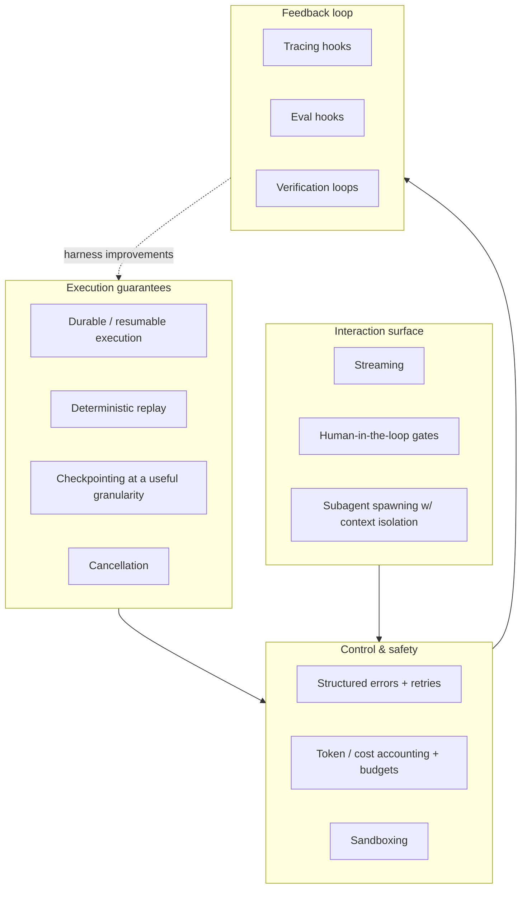

# 02 — Agent Harnesses: The 2026 Landscape

**Last researched: 2026-08-02**

> Companion documents: `01-agent-anatomy.md` (what an agent is made of), `03-graph-and-loop-architecture.md` (when a graph beats a loop), `04-self-improving-agents.md` (optimization/eval loops), `05-frontier-lab-agent-definitions.md` (how the labs themselves define agents, and provider-abstraction strategy).

---

## TL;DR — key takeaways

1. **"Harness" now has a real definition, and it is not "framework."** LangChain's taxonomy — *framework* (LangChain) / *runtime* (LangGraph) / *harness* (DeepAgents) — is the closest thing the field has to consensus, and it is only ~a year old. A harness is **everything that is not the model**: system prompts, tools/skills/MCP, bundled infrastructure (filesystem, sandbox, browser), orchestration logic (subagents, handoffs, routing), and hooks/middleware for deterministic execution. `Agent = Model + Harness`. ([LangChain, "The Anatomy of an Agent Harness"](https://www.langchain.com/blog/the-anatomy-of-an-agent-harness))
2. **The most battle-tested harnesses are coding agents, not agent frameworks.** Claude Code, Codex CLI, Cursor, OpenHands and Aider have collectively logged orders of magnitude more autonomous tool-calling hours than every general-purpose framework combined. They are the reference implementations. Anything they do *not* do (e.g. none of them ship a durable workflow engine) is a signal.
3. **Harness quality is worth more than model quality at the margin.** LangChain reports moving from Top-30 to Top-5 on Terminal Bench 2.0 by changing *only* the harness, and notes Opus 4.6 scores materially differently across harnesses. Harness engineering is not scaffolding you outgrow.
4. **LangGraph's durability is weaker than its reputation.** It checkpoints at **super-step boundaries**, not inside a node. A node that crashes halfway re-runs from the top *including side effects*; `interrupt()` has the same property, so "charge card → confirm" double-charges on resume. See `03-graph-and-loop-architecture.md`. This is the single most commonly mis-stated fact in the ecosystem.
5. **Google ADK superseded its own flagship abstraction.** `SequentialAgent`/`ParallelAgent`/`LoopAgent` — the thing every ADK tutorial teaches — are explicitly superseded by graph-based workflows as of ADK 2.x (currently **2.6.1**, 2026-07-31). Most secondary writing is stale.
6. **OpenAI churns hardest.** Assistants API shuts down **2026-08-26**; Agent Builder shipped Oct 2025 and was deprecated roughly eight months later. The Agents SDK is still **pre-1.0 (0.19.2 Python / 0.14.2 TS)** after ~18 months. Treat OpenAI surface area as a depreciating asset.
7. **Real durability means Temporal/Restate, not a checkpointer.** If you need crash-consistent, exactly-once-effect, resumable-after-deploy agents, the honest answer in 2026 is still a durable execution engine underneath, with the agent loop as a workflow. Every framework's "persistence" is weaker than this and most conflate *conversation persistence* with *execution durability*.
8. **Nothing in this space is stable.** Of the surveyed projects, only Temporal, Restate, LangChain/LangGraph 1.x, CrewAI 1.x, AG2 1.0 and Pydantic AI 2.x have shipped a 1.0+. The two vendor SDKs from the labs with the most agent traffic — Claude Agent SDK (0.2.x/0.3.x) and OpenAI Agents SDK (0.19.x/0.14.x) — are both pre-1.0.
9. **Verdict for `function2agent`: adopt a thin substrate, build the harness.** Do not adopt a general-purpose agent framework. Emit a plain tool + loop by default (consistent with `03-graph-and-loop-architecture.md`), target the Claude Agent SDK / a thin two-tier provider abstraction (consistent with `05-frontier-lab-agent-definitions.md`), and reach for Temporal/Restate only when the generated agent declares a durability constraint. Full analysis in §7.

---

## 1. What an agent harness actually is

### 1.1 The definition

LangChain's formulation is the one to use, because it is the only one that draws a boundary you can actually test:

> A harness is every piece of code, configuration, and execution logic that isn't the model itself. A raw model is not an agent. But it becomes one when a harness gives it things like state, tool execution, feedback loops, and enforceable constraints.
> — [LangChain, *The Anatomy of an Agent Harness*](https://www.langchain.com/blog/the-anatomy-of-an-agent-harness)

The enumerated components:

| Component | Concretely |
|---|---|
| System prompts | The standing instructions, injected memory files (`AGENTS.md`/`CLAUDE.md`), reminders |
| Tools, Skills, MCP servers | Plus their *descriptions*, which are part of the harness, not the model |
| Bundled infrastructure | Filesystem, sandbox, browser, git |
| Orchestration logic | Subagent spawning, handoffs, model routing |
| Hooks / middleware | Compaction, continuation ("Ralph loops"), lint/test gates, approval gates |

The derivation in that post is worth internalising because it is *behaviour-first*: each harness feature exists because there is something we want the agent to do that the model cannot do unaided. Models take tokens in and emit tokens out; they cannot maintain durable state, execute code, access realtime knowledge, or provision an environment. Every one of those gaps is a harness feature.

Two derived primitives are load-bearing and under-appreciated:

- **The filesystem is the foundational primitive.** It is durable storage, context offload, cross-session persistence, *and* the coordination surface between multiple agents and humans. Git adds versioning, rollback and branching on top. Almost every other advanced harness feature (compaction, tool-output offloading, Ralph loops, agent teams) is built on it.
- **Bash/code execution is the general-purpose tool.** Rather than pre-designing a tool for every action, give the model a computer. This is directly relevant to `function2agent`: it is an argument that the *marginal* tool you wrap needs to justify itself against "the agent could have written that in Python."

### 1.2 Harness vs. framework vs. runtime vs. SDK vs. orchestration engine

LangChain's own three-way split, using their own projects as the examples ([*Agent Frameworks, Runtimes, and Harnesses — oh my!*](https://www.langchain.com/blog/agent-frameworks-runtimes-and-harnesses-oh-my)):

- **LangChain → agent framework.** Building blocks. Abstractions over models, tools, messages; a `create_agent` primitive that implements the core loop.
- **LangGraph → agent runtime.** The thing that *executes* the agent: state machine, persistence, streaming, interrupts, resumption.
- **DeepAgents → agent harness.** Batteries included, opinionated: default prompts, planning tools, a filesystem, subagents. Described internally as "a general-purpose version of Claude Code."

Harrison Chase explicitly flags that the lines are blurry (LangGraph is arguably both runtime and framework). Take the taxonomy as useful, not canonical. Here is the version I would defend, with the two categories LangChain's post omits:

| Layer | Job | Owns | Examples |
|---|---|---|---|
| **Provider SDK** | Speak HTTP to one model vendor | Wire format, auth, streaming transport, retries on 429/5xx | `anthropic` 0.120.2, `openai` 2.52.0, `google-genai` |
| **Agent framework** | Give you building blocks to assemble a loop | Message/tool abstractions, model-agnostic types | LangChain 1.3.14, Pydantic AI 2.22.0, Vercel AI SDK 7.0.48 |
| **Agent runtime** | Execute and persist the loop | Step scheduling, state, checkpoints, interrupts, streaming | LangGraph 1.2.10, LlamaIndex Workflows, Mastra |
| **Durable execution engine** | Make execution crash-consistent and resumable | Event-sourced history, deterministic replay, timers, exactly-once effects | Temporal 1.31.0, Restate 1.16.2 |
| **Agent harness** | Turn a model into a worker for a class of tasks | Prompts, tool suite, sandbox, context management, subagents, verification | Claude Code, Codex CLI, DeepAgents, OpenHands, Cursor |

The distinctions that matter operationally:

- **Framework vs. harness is a question of opinionation, not capability.** A framework hands you `Tool`, `Message`, `run()`. A harness hands you a working agent and asks what you want to change. If you find yourself writing the system prompt, choosing the planning representation, and deciding compaction policy — you are building a harness, whether or not you started from a framework.
- **Runtime vs. durable execution engine is a question of *what survives a crash*.** This is the most commonly elided distinction in the entire ecosystem and it is the one that gets people paged. A runtime persists *conversation and graph state*. A durable execution engine persists *the execution itself*, including partial progress inside a unit of work, with exactly-once effect semantics via idempotent activities. LangGraph, LlamaIndex Workflows and Mastra are runtimes. Temporal and Restate are durable execution engines. §5.1 goes into why the difference bites.
- **SDK vs. harness is a question of who owns the loop.** The `openai` and `anthropic` packages give you one turn. The Claude Agent SDK gives you the loop, the tools, and the sandbox — it is a harness distributed as an SDK, which is why its name changed from "Claude Code SDK."

### 1.3 The definitional claim that is doing the most work

`Agent = Model + Harness` implies harness quality is measurable and separable, and the 2026 evidence supports that:

- LangChain reports taking their internal coding agent from Top-30 to Top-5 on **Terminal Bench 2.0** by changing only the harness (same model).
- They also note **Opus 4.6 in Claude Code scores materially below Opus 4.6 in other harnesses** on Terminal Bench 2.0 — i.e. the harness a model was post-trained with is not necessarily the best harness for *your* task.
- Simultaneously, harnesses and models are co-trained: the Codex prompting guide's `apply_patch` tool is the standard example of a model being overfit to a specific harness's tool logic.

Both facts are relevant to `function2agent`. The first says harness design is worth investing in. The second says **do not assume a generic wrapper matches the harness the model was trained in**, and that tool *shape* (naming, argument schema, patch format) has measurable performance consequences — which is exactly the surface `function2agent` generates.

> ⚠️ **Uncertainty flag.** The Terminal Bench 2.0 numbers are LangChain's own reporting about their own product in a marketing post. I did not independently verify the leaderboard positions. Directionally the claim (harness matters, harness ≠ model) is corroborated by the broader literature and by the mere existence of harness-specific post-training; the specific rank deltas should be treated as vendor claims.

---

## 2. Survey

Version and date data below was pulled directly from the PyPI and npm registry JSON APIs on **2026-08-02**. Where a project ships both Python and TS, both are given. "Maturity" is my judgement, not the project's self-description.

### 2.1 Claude Agent SDK (Anthropic)

| | |
|---|---|
| **Version** | Python `claude-agent-sdk` **0.2.128** (2026-07-25); TS `@anthropic-ai/claude-agent-sdk` **0.3.220** (2026-07-24) |
| **License** | Proprietary — "SEE LICENSE IN README.md" on npm; the Python distribution declares MIT. ⚠️ See note below. **[Resolved 2026-08-02: the SDK source is MIT; the bundled Claude Code CLI is not. See [14](./14-architecture-synthesis.md) §5.1 U-01.]** |
| **Languages** | Python, TypeScript |
| **Category** | Agent **harness**, distributed as an SDK |

**What it is.** The Claude Code harness, unbundled and made programmable. Renamed from "Claude Code SDK" precisely because the thing being sold is the harness, not the CLI. You get the same agent loop, the same built-in tools (Read/Write/Edit/Bash/Glob/Grep/WebSearch/WebFetch), the same context-management behaviour, and the same `.claude/` configuration loading (skills, slash commands, `CLAUDE.md` memory, plugins) as Claude Code itself. ([Agent SDK overview](https://code.claude.com/docs/en/agent-sdk/overview.md))

**Core abstraction.** A *query* over a *session*, with tools, hooks and permissions attached. There is no graph, no DSL, and no workflow object. This is deliberate: it is a loop plus a very good tool suite plus context management.

**State/durability model.** Sessions are conversation histories written to disk automatically; you capture a `session_id` and `resume` or `fork` it. Forking copies history and diverges, giving you two independently resumable branches. There is a pluggable `sessionStore` adapter for resuming across hosts. Separately, **file checkpointing** snapshots files before `Write`/`Edit`/`NotebookEdit` and lets you `rewindFiles()` to a checkpoint UUID.

The honest limits, which the docs state plainly and which matter:
- **Sessions persist the conversation, not the filesystem.** Two different mechanisms; forking a session does not fork the working tree.
- **File checkpointing does not cover Bash.** `echo > file.txt`, `sed -i`, `rm` — untracked. Nor are subagent edits tracked (except a `context: fork` skill in the foreground). Directory create/move/delete is not undone. **Use git if you need real rollback.** This is a much narrower guarantee than "checkpointing" suggests.
- There is **no crash-consistent execution durability**. If the process dies mid-tool-call, you resume the conversation, not the in-flight action.

**Human-in-the-loop.** Best-in-class among the SDKs. A permission system decides which tools run automatically vs. require approval, and the hook system gives you real interception points: `PreToolUse` (validate/block), `PostToolUse` (audit), `UserPromptSubmit` (inject context), `Stop`, `SubagentStart`/`SubagentStop`, `PreCompact` (archive before summarising). Hooks are in-process callbacks and can *block* — this is a genuine gate, not a notification.

**Observability & cost.** Token/cost accounting is first-class, including a **budget cap that covers subagent spend**; once the cap is hit, spawning another subagent fails with `Budget limit reached` and background subagents are stopped (requires Claude Code ≥ 2.1.217). This is unusually concrete — most frameworks give you a token counter and call it cost control. Tracing is via hooks + the streamed message log; there is no first-party trace UI equivalent to LangSmith.

**Subagents.** The strongest implementation surveyed. Each subagent gets a **fresh context window**, its own system prompt, its own tool allow/deny list, its own `permissionMode`, its own hooks, its own `maxTurns`, and optionally its own model. Only the subagent's *final response* returns to the parent as a tool result — so the parent's context grows by a summary, not a transcript. This is the context-isolation property everyone else claims and few implement.

**Strengths.** It is the harness with the most real-world autonomous-tool-calling hours behind it. Context management (compaction, tool-output offloading, skills as progressive disclosure) is genuinely ahead of the field. Hooks are the best interception model available. Subagent context isolation is correct.

**Weaknesses.** (1) **Anthropic-first by construction** — it is the Claude harness; using it as a neutral substrate fights the design. (2) **Pre-1.0 with an extremely high release cadence** — 0.3.220 on npm implies hundreds of releases; expect churn. (3) **Licensing is not clean OSS** — the npm package is "SEE LICENSE IN README.md" (i.e. Anthropic's terms), while the PyPI metadata says MIT. ⚠️ **I did not resolve this discrepancy; if the license matters for your compliance story, read the actual LICENSE/README before adopting.** (4) No durable execution, no deterministic replay. (5) Filesystem/bash-centric defaults are a poor fit for a pure API-orchestration agent that never touches a shell.

**Relevance to `function2agent`.** This is the closest existing thing to the target. If `function2agent` emits "a tool + a loop," the Claude Agent SDK is the highest-quality loop to emit *into*, and its tool-definition surface (plus MCP) is the natural compilation target. See §7.

> **Decided against as the default, 2026-08-02, on a ground this survey did not weigh** (`plan.md` OD-02). The quality judgement above stands and is not what was overturned. What was overturned is its suitability as the *default* coding-node executor, for two reasons that arrived after this section was written. The SDK enumerates its providers as `firstParty`, `bedrock`, `vertex`, `foundry`, `anthropicAws`, `anthropicGoogleCloud`, `mantle`, and `gateway` — **every one a different hosting surface for Claude models, not a different model family** ([finding 003](../specs/001-discovery-validation/findings/003-runtime-provider-agnosticism.md)) — so a customer who brings only an OpenAI credential would have no working coding nodes at all, which conflicts with bring-your-own-credentials as a hard product requirement rather than as a trade-off. And its strongest remaining advantage, genuinely enforced budgets (§3.3), stops being a differentiator now that the project is building its own budget enforcement regardless (OD-01). The SDK is retained as an **opt-in fast path for Anthropic customers**, and separately as the deliberately-strong baseline arm in the validation plan, where using anything weaker would be the most common way to fake a positive result.

---

### 2.2 OpenAI Agents SDK + Responses API

| | |
|---|---|
| **Version** | Python `openai-agents` **0.19.2** (2026-08-01); TS `@openai/agents` **0.14.2** (2026-08-01) |
| **License** | MIT |
| **Languages** | Python, TypeScript |
| **Category** | Agent framework (thin), on top of the Responses API |

**What it is.** A deliberately small, code-first framework: `Agent` (instructions + tools + model), `Runner` (the loop), `handoff` (delegate to another agent), `guardrail` (input/output validation), plus built-in tracing. It is provider-agnostic in principle (advertised across 100+ models), though the Responses API is the first-class path.

**The churn problem — this is the headline.** OpenAI's agent surface has had four simultaneous deprecations running as of mid-2026:

| Product | Fate | Date |
|---|---|---|
| **Assistants API** | Shuts down; `/v1/assistants`, `/v1/threads`, `/v1/threads/runs` return errors. **No grace period, no migration tool.** | **2026-08-26** (announced 2025-08-26) |
| **Agent Builder** (AgentKit visual canvas) | Removed from platform | 2026-11-30 (announced 2026-06-03) |
| **Evals platform** | Read-only 2026-10-31, removed | 2026-11-30 |
| **Reusable prompt objects** | Removed | 2026-11-30 |
| Chat Completions | Supported, but **no new agentic features** | — |

([OpenAI Assistants migration guide](https://developers.openai.com/api/docs/assistants/migration); corroborated by multiple secondary sources, see Sources.)

Agent Builder shipped in Oct 2025 and was deprecation-noticed on 2026-06-03 — roughly **eight months of life**. Note also the trap flagged in OpenAI's own migration guide: it recommends migrating Assistants → *Prompts*, while reusable prompt objects are themselves being removed on 2026-11-30. Following the official migration path naively lands you on a second deprecated primitive.

**Core abstraction.** `Agent` + `Runner` + handoffs. Handoffs are a genuinely different multi-agent model from delegation: control *transfers* to the target agent rather than the target returning a result to a parent. That is simpler, but it means the originating agent's context is not preserved as a supervising frame — a real design constraint, not a detail.

**State/durability.** The Responses API is **stateless**: you pass history each call (or a `previous_response_id`), and the separate **Conversations API** stores it if you want server-side persistence. This is an improvement on Assistants' opaque server-managed threads — OpenAI's own stated reasoning was that developers wanted control over history, token budgets and partial-failure handling, and portability to other providers. The Agents SDK has **no checkpointing, no resume-from-crash, no durable execution.** Session/state persistence is yours to build.

**Human-in-the-loop.** Weakest of the major frameworks. Guardrails validate inputs/outputs and can trip a tripwire, but there is no built-in durable "pause here, wait for a human, resume days later" primitive comparable to LangGraph `interrupt()` or Temporal signals. Tool approval is something you implement.

**Observability.** Built-in tracing to the OpenAI traces dashboard is the SDK's best feature, and it works out of the box. But: OpenAI is removing the **Evals** platform in Nov 2026, so the eval half of that story is being withdrawn — plan for code-owned evals (see `04-self-improving-agents.md`). OTel instrumentation exists via third parties (`opentelemetry-instrumentation-openai-agents` 0.62.1).

**Strengths.** Small, readable, few concepts, genuinely low lock-in at the code level; MIT; tracing works; provider-agnostic enough to be useful.

**Weaknesses.** **Platform churn is the dominant risk** — four deprecations in one year, a flagship visual product killed in eight months, and the SDK itself still pre-1.0 (`0.19.2`) after ~18 months. No durability. Thin HITL. If your architecture decision has a 3-year horizon, this vendor's track record should reduce your confidence in *any* abstraction it publishes above the raw model call.

**Relevance to `function2agent`.** As a compilation target: acceptable and low-lock-in. As a foundation to build the product on: the churn record argues against. This directly supports the two-tier provider abstraction recommended in `05-frontier-lab-agent-definitions.md` — abstract the message/tool/turn layer thinly, and do not build on vendor-specific hosted primitives (Assistants, Agent Builder, prompt objects) that have now all been withdrawn.

---

### 2.3 LangGraph (+ LangChain, DeepAgents)

| | |
|---|---|
| **Version** | Python `langgraph` **1.2.10** (2026-07-28); TS `@langchain/langgraph` **1.4.8** (2026-07-15) |
| | `langchain` **1.3.14**, `langchain-core` **1.5.3**, `deepagents` **0.7.1** (2026-07-30) |
| **License** | MIT |
| **Languages** | Python, TypeScript |
| **Category** | Agent **runtime** (LangGraph) + framework (LangChain) + harness (DeepAgents) |

**What it is.** A graph runtime for agents: you declare nodes and edges over a typed shared state, and LangGraph schedules execution in Pregel-style **super-steps**, persisting state to a checkpointer. The 1.x line is mature by this ecosystem's standards, and the three-package split (framework/runtime/harness) is now explicit.

**Core abstraction.** `StateGraph` — nodes are functions `State -> partial State`, edges (including conditional edges) determine scheduling, and a reducer merges partial updates. Above it, `create_agent` implements a plain ReAct loop with **middleware** as the customization primitive (summarization, HITL, PII redaction, call limits, prompt caching). DeepAgents sits above *that* with planning tools, a filesystem, and subagents.

**State/durability model — read this carefully, the reputation overshoots the reality.**

LangGraph checkpoints at **super-step boundaries**, and *only* at super-step boundaries. From the official checkpointers docs: "A super-step is a single 'tick' of the graph where all nodes scheduled for that step execute (potentially in parallel)… you can only resume execution from a checkpoint (i.e., a super-step boundary)." ([LangGraph checkpointers](https://docs.langchain.com/oss/python/langgraph/checkpointers))

The consequences, which are the crux of the whole durability question:

- **A node that crashes halfway re-runs from the top on resume — side effects included.** There is no intra-node checkpoint. If your node does `charge_card(); update_ledger()` and dies after the charge, resume re-charges. LangGraph gives you no primitive to prevent this; you must make node bodies idempotent yourself.
- **`interrupt()` has exactly the same property.** On resume, the node re-executes everything preceding the `interrupt()` call. The canonical "charge card, then ask the human to confirm" shape **double-charges**. The correct pattern is to interrupt *before* any side effect, in a node that does nothing else. See `03-graph-and-loop-architecture.md`, which treats this in depth.
- Partial mitigation: **pending writes**. Completed nodes within a super-step have their writes persisted to `checkpoint_writes`, so if a *sibling* parallel node fails, the successful siblings are not re-run on resume. This helps fan-out; it does nothing for a single long node.

Three **durability modes**, selectable per execution call: `"exit"` (persist only on exit — no mid-execution recovery), `"async"` (persist concurrently with the next step — small risk of a lost checkpoint on crash), `"sync"` (persist before the next step starts — highest durability, real latency cost). ([checkpointers docs](https://docs.langchain.com/oss/python/langgraph/checkpointers))

> ⚠️ **Documentation contradiction, independently corroborated.** The sibling doc flags that the Python `astream` reference documents the default as `"async"` while a persistence guide says `"sync"`. I did not resolve the docs conflict, but I did find the implementing PR: [langgraph#5432](https://github.com/langchain-ai/langgraph/pull/5432) (merged 2025-07-20) states plainly that `"async"` is **the default** (equivalent to the old `checkpoint_during=True`). That is strong evidence `"async"` is the true default and the guide saying `"sync"` is the stale one — **but do not trust either doc; assert it in a test.** The distinction matters: `async` means a crash can lose the last checkpoint entirely.
>
> A further wrinkle reported on that same PR (comment dated 2026-03-01, unresolved): `"async"`/`"sync"` persist when the *next* node starts, so they may not persist changes on an **interrupt-driven graph exit**, while `"exit"` persists on interrupt exit but not otherwise — i.e. there may be no single mode that gives you both. Treat HITL payload persistence as something to verify empirically for your version.

**Human-in-the-loop.** `interrupt()` + `Command(resume=...)` is the most ergonomic HITL API in the survey, and time-travel (resume from any prior checkpoint) is genuinely useful for debugging. The caveats above are about *correctness under side effects*, not ergonomics.

**Observability.** Best in class. LangSmith is a mature, purpose-built trace/eval product with deep native integration; OTel export exists. If observability is your binding constraint, this is the strongest argument for the LangChain stack.

**Streaming & cancellation.** Multi-mode streaming (values, updates, messages, custom, debug) is a real strength — few competitors expose node-level update streams. Cancellation is cooperative.

**Strengths.** Mature 1.x, huge ecosystem, excellent streaming, best-in-class tracing, explicit and legible control flow, real time-travel, TS parity is genuinely good (not an afterthought port).

**Weaknesses.** (1) **Durability is over-claimed by the community**, per above — it is *checkpointed*, not *durable* in the Temporal sense. (2) **Graph-first is the wrong default for most agents** — see `03-graph-and-loop-architecture.md`; most agents are a loop and the graph is ceremony. (3) Abstraction density: `State`, reducers, `Command`, `Send`, middleware, and three packages is a lot of concepts. (4) Historical LangChain churn makes some teams allergic, though 1.x has been more disciplined.

**DeepAgents** (0.7.1) is worth separate mention: it is LangChain's actual *harness* — planning tools, filesystem, subagents, default prompts, described in-house as "a general-purpose version of Claude Code." It is the most direct open-source analogue to the Claude Agent SDK, and at 0.7.x it is young.

---

### 2.4 Pydantic AI

| | |
|---|---|
| **Version** | **2.22.0** (2026-08-01). V2.0.0 released **2026-06-23**; V1 was Sept 2025. |
| **License** | MIT |
| **Languages** | Python |
| **Category** | Agent framework → now explicitly self-described as **harness-first** |

**What it is.** The Pydantic team's agent framework: typed everything, structured outputs enforced by Pydantic models, dependency injection for tools, and first-class Logfire tracing. V2 (2026-06-23) is a significant re-architecture — the release notes describe it as leaning into a **"harness-first design with capabilities as a core primitive — a single composable unit that bundles an agent's tools, hooks, instructions, and model settings."** ([v2.0.0 release](https://github.com/pydantic/pydantic-ai/releases/tag/v2.0.0))

That is notable: an established framework explicitly repositioning around the harness concept, and converging on the same primitive shape (a bundle of tools + hooks + instructions + settings) that LangChain calls middleware and Claude Code calls plugins/skills.

**Core abstraction.** `Agent[Deps, Output]` — generic over its dependency type and its output type. Tools are typed functions with an injected `RunContext`. Output is a Pydantic model, validated and retried on failure. Plus **capabilities** (V2), composable units attached via `capabilities=[...]`.

**State/durability model — the most intellectually honest in the survey.** Pydantic AI does not pretend to implement durable execution. It **delegates to real durable execution engines** via capabilities: `TemporalDurability`, `DBOSDurability`, `PrefectDurability` ([PR #4977](https://github.com/pydantic/pydantic-ai/pull/4977)). The V2 design decision is precise and correct:

> The capability makes the agent *durable-capable*; your workflow/flow decides which runs are durable.

Concretely: you attach the capability, then run the agent inside your own `@workflow.defn` (Temporal), `@DBOS.workflow`, or `@flow` (Prefect). The capability routes model requests, tool calls and MCP I/O through the engine's durable units (activities/steps/tasks). The older auto-wrapping `TemporalAgent`/`DBOSAgent`/`PrefectAgent` classes are **deprecated in V2 and slated for removal in V3**. More engines are on the roadmap — Restate, Inngest, Hatchet, Render Workflows, AWS Lambda Durable Functions, ZenML are named in [issue #5477](https://github.com/pydantic/pydantic-ai/issues/5477).

**The honest caveat the docs publish themselves** — and this is the kind of detail that separates a real durability story from a marketing one: crossing a Temporal activity boundary serializes `RunContext`, so **token/usage mutations inside an activity are lost**. If a tool delegates to a sub-agent with `usage=ctx.usage`, the delegate's tokens never reach the parent's `result.usage` and are **never charged against usage limits**. DBOS/Prefect accrue usage while a step body actually runs but lose it on replay/cache-hit — meaning *the same code accounts differently from run to run*. A cross-engine fix is still under discussion. ([Temporal durability docs](https://pydantic.dev/docs/ai/capabilities/durable_execution/temporal/))

That is a genuinely important finding for `function2agent`: **durability and cost accounting interact badly**, and almost nobody documents it. Pydantic AI does, which is a mark in its favour.

Also note the engine-specific restrictions: Temporal rejects per-run capabilities and per-run toolsets (activities must be worker-registered upfront); DBOS/Prefect reject runtime/override models. Durable agents are *less dynamic* agents.

**Human-in-the-loop.** Not a headline feature. Achievable via deferred tools and by running inside a durable engine (Temporal signals are the real HITL mechanism). Weaker out-of-the-box than LangGraph.

**Observability.** Excellent — Logfire is native and built by the same team, with OTel underneath, so you are not locked into a proprietary trace format.

**Strengths.** Best type safety in the survey by a distance. Structured output with automatic validation-retry is the right default. The V2 durability design is architecturally the most correct approach anyone has taken: *don't reimplement durable execution, integrate with engines that already solved it*. Genuinely honest documentation of limitations.

**Weaknesses.** (1) **Python only.** (2) **V2 is six weeks old** as of writing, and at 2.22.0 the cadence is very fast — 22 minor releases in ~6 weeks. Stability guarantees exist (they held API stability across all of V1) but V2 is new. (3) Durable execution requires you to run and operate Temporal/DBOS/Prefect — the honesty has an ops cost. (4) Smaller ecosystem than LangChain; fewer integrations.

---

### 2.5 Google ADK (Agent Development Kit)

| | |
|---|---|
| **Version** | Python `google-adk` **2.6.1** (2026-07-31); JS `@google/adk` **1.5.0** (2026-07-30). Also Go, Java. |
| **License** | Apache-2.0 |
| **Languages** | Python, Go, Java, JS/TS (feature parity is **not** uniform) |
| **Category** | Agent framework + runtime, with a managed deployment target (Agent Engine / Vertex AI) |

**What it is.** Google's agent framework, deliberately deployment-coupled to Vertex AI Agent Engine but usable standalone. The headline 2026 fact is a self-supersession.

**ADK 2.0 superseded its own flagship abstraction.** ADK 1.x taught `SequentialAgent` / `ParallelAgent` / `LoopAgent` — template workflow agents that compose sub-agents. ADK 2.0 introduces the **Workflow Runtime**, "transitioning ADK from a hierarchical agent executor to a graph-based execution engine," in which `BaseAgent` now subclasses `BaseNode` and agents, tools and functions are all evaluated as *nodes* in a workflow graph. The custom-agents doc carries an explicit warning:

> "Starting in ADK 2.0, agent-based workflows using `BaseAgent` have been superseded by more flexible workflow structures, including graph-based workflows and dynamic workflows. You should evaluate the capabilities of these workflow mechanisms ***before*** building a custom agent."
> — [google/adk-docs, `docs/agents/custom-agents.md`](https://github.com/google/adk-docs/blob/main/docs/agents/custom-agents.md)

Graph-based workflows are **Python and Go**; the Go graph engine "just launched" per Google's own announcement, with Python available since March 2026. ([Why we built ADK 2.0](https://developers.googleblog.com/why-we-built-adk-20/))

**The practical consequence for you: essentially every ADK tutorial, blog post and course written before ~March 2026 teaches a superseded abstraction.** If you evaluate ADK on secondary sources you will evaluate the wrong framework. This is the single biggest stale-information trap in the survey.

**Core abstraction (2.0).** A workflow graph of nodes connected by `edges`, with route conditions (`StringRoute`, int/multi-value, LLM-driven routing). Loops are back-edges. "Dynamic workflows" let you express control flow in native Python instead of a declarative edge list. The design philosophy Google states is exactly the one in `03-graph-and-loop-architecture.md`: *isolate probabilistic LLM behaviour to nodes that need cognition, route deterministically everywhere else.*

**State/durability.** Session/state services with pluggable backends; state is shared across parallel children (Google's docs warn to use distinct keys to avoid race conditions — i.e. **the framework does not prevent parallel-write races for you**). Durable execution in the Temporal sense is not provided by the framework; production durability is expected to come from Agent Engine as a managed runtime.

> **Measured 2026-08-02 against `google-adk` 2.6.1** ([finding 006](../specs/001-discovery-validation/findings/006-graph-loop-primitives.md)).
> The race-condition warning above is not merely a caution, it is the observed behaviour: two
> parallel branches that read a shared state key, did work, and wrote it back left
> `state['log'] == ['B']`. Branch A's write vanished with no error and no warning. There are no
> per-channel reducers anywhere in `workflow/` or `agents/` — `Workflow.state_schema` validates
> only that a `FunctionNode`'s parameter names appear in the schema and says nothing about how
> concurrent writes combine. Resume, by contrast, works better than this row implies: a process
> killed with `SIGKILL` at iteration 3 of 6 was replaced by a fresh process that reopened the same
> SQLite session and finished with state intact, 5 trials out of 5. The mechanism is event-sourced
> replay (`replay_mgr.scan_workflow_events`), not checkpoint-blob loading, and it is at-least-once
> rather than exactly-once: a kill *inside* a node re-ran that node's durable side effect in both
> resumability configurations. ADK's own `ResumabilityConfig` docstring says so plainly.

**HITL.** Callbacks (`BeforeAgentCallback` etc.) provide lifecycle interception; HITL is a first-class composable step in 2.0 workflows. `LoopAgent` termination is via `max_iterations` or an `escalate=True` event.

> **Measured 2026-08-02: `max_iterations` did not survive the supersession.** `LoopAgent` is the
> template tier that ADK 2.0 explicitly supersedes, and the graph tier has no step ceiling of any
> kind. A four-node graph with an unconditional back-edge ran **1,292 iterations in 20 seconds**
> and was still going when the probe's own timeout fired. `LoopAgent.max_iterations` also defaults
> to `None`, which is unbounded. Anyone reading "termination is via `max_iterations`" as a property
> of ADK generally will be reading it about the wrong tier
> ([finding 006](../specs/001-discovery-validation/findings/006-graph-loop-primitives.md) §Primitive 3).

**Observability.** Cloud Trace / Vertex AI integration is the happy path; OTel underneath.

**Strengths.** Genuine multi-language story (Python/Go/Java/JS) which is rare. Apache-2.0. The 2.0 graph model is well-reasoned. Strong if you are already on GCP.

**Weaknesses.** (1) **Just broke its own primary abstraction**, with the ecosystem's documentation now badly out of date. (2) **Language parity is uneven** — graph workflows are Python + Go only; JS is on a separate 1.x version line. (3) Gravitational pull toward Vertex AI. (4) A documented caution that `LlmAgent`s inside graph workflows must be configured single-turn constrains how you mix the two models. (5) Adoption outside GCP shops is modest.

> ⚠️ One doc page I retrieved (a pinned commit) still labels graph workflows "ADK Python v2.0.0 **Alpha**" while the blog and current docs present them as shipped. Version-pinned docs in this repo are unreliable; check the live site for your target version.

---

### 2.6 Mastra

| | |
|---|---|
| **Version** | `@mastra/core` **1.55.0** (2026-07-30); CLI `mastra` **1.21.0** |
| **License** | Apache-2.0 |
| **Languages** | TypeScript only |
| **Category** | Agent framework + runtime, TS-native, batteries-included |

**What it is.** The most complete TypeScript-native agent stack: agents, tools, workflows, memory, RAG, evals, a local dev playground, and a deployment story. Aimed squarely at the Node/Next.js developer that Python-first frameworks underserve.

**Core abstraction.** `Agent` (model + instructions + tools + memory) and `Workflow` (typed, composable steps with `.then()`/`.branch()`/`.parallel()`, Zod schemas on step inputs/outputs). Workflows are the deterministic layer; agents are the probabilistic layer.

**State/durability.** The strongest durability story of the TS-native frameworks, and it got materially better in 2026. Two mechanisms:

- **Workflow snapshots.** `suspend()` captures a full serializable execution snapshot into a `workflow_snapshots` table (libSQL by default; Postgres or Upstash supported), keyed by `runId`. `resume()` rehydrates and continues from the suspended step. Snapshots persist **across deployments and restarts** — a stronger claim than most competitors make. Typed `suspendSchema`/`resumeSchema` make the pause/resume contract explicit, which is a genuinely good design.
- **Durable agents** (added in `@mastra/core` 1.30.0, 2026-04-30). `createDurableAgent()` runs the *agentic loop itself* inside a workflow so each step can be memoized and replayed; events flow over PubSub so **a client can disconnect and reconnect without missing chunks** via `observe(runId, { offset })`. Three factories: `createDurableAgent()` (single process), `createEventedAgent()` (fire-and-forget background), `createInngestAgent()` (production — Inngest supplies step memoization, retries, monitoring). ([Mastra durable agents](https://mastra.ai/docs/long-running-agents/durable-agents))

Note the honest caveat in their own docs: the default event cache for `createDurableAgent`/`createEventedAgent` is **in-memory**, so resumable streams only work within one process unless you supply Redis or similar. And note that the strongest production configuration (`createInngestAgent`) means **your durability guarantee is actually Inngest's**, not Mastra's — the same delegation pattern Pydantic AI chose, less loudly stated.

**HITL.** Well-supported: tool approval suspends the workflow, fires `onSuspended`, and waits for `resume()`. Workflow-level `sleep` (status `waiting`) is distinguished from step-level `suspend` (status `suspended`) — a distinction most frameworks don't bother making.

**Observability.** Built-in tracing plus a local dev playground that is genuinely good for iteration; OTel export; scorers/evals included.

**Strengths.** Best TS-native option by a wide margin. Resumable streaming is a real differentiator and is the correct answer for web UIs. Apache-2.0. Excellent DX. Durability design is thoughtfully layered.

**Weaknesses.** (1) **TypeScript only** — no Python, which rules it out for most ML-adjacent teams. (2) **Very high churn**: `@mastra/core` is at 1.55.0 having shipped 1.30.0 three months earlier — ~25 minor versions per quarter, post-1.0. "1.x" here does not imply the stability it implies elsewhere. (3) Large surface area (agents + workflows + memory + RAG + evals + deploy) means a lot of Mastra-specific API to learn and later unpick. (4) Smaller company; ecosystem risk.

---

### 2.7 CrewAI

| | |
|---|---|
| **Version** | `crewai` **1.15.10** (2026-07-31). OSS 1.0 GA announced 2026. |
| **License** | MIT (OSS core); CrewAI **AMP** is the commercial control plane |
| **Languages** | Python |
| **Category** | Agent framework, role-based multi-agent + event-driven flows |

**What it is.** Role-based multi-agent orchestration. You define agents by `role`/`goal`/`backstory`, give them `Task`s, and assemble a `Crew` that runs them sequentially or hierarchically. **Flows** are the second, lower-level primitive: event-driven, explicitly ordered orchestration with `@start`/`@listen`/`@router` decorators.

The 1.0 GA is the notable 2026 event: CrewAI declares **stable, versioned Crew and Flow APIs** — "the abstractions are now locked" — and claims the core powers "1.4 billion agentic automations." ([CrewAI OSS 1.0](https://blog.crewai.com/crewai-oss-1-0-we-are-going-ga/)) ⚠️ That usage figure is an unverified vendor claim with no stated methodology; treat it as marketing, not evidence.

**Core abstraction.** Crew (autonomous, role-based, emergent) *or* Flow (deterministic, event-driven). CrewAI's own framing — deterministic control where you need reliability, agentic delegation where you need judgement, with a Crew embeddable as a single node in a Flow — is the same conclusion reached in `03-graph-and-loop-architecture.md`. Convergent design across vendors is a decent signal it's right.

**State/durability.** The weakest of the "production" frameworks. Flows have state and support persistence decorators; Crews have short/long-term memory backends. There is **no super-step checkpointing, no deterministic replay, no crash-resume primitive** comparable to LangGraph, let alone Temporal. Durability in practice means AMP (the commercial platform) or your own.

**HITL.** Human input on tasks (`human_input=True`) and human gates in Flows. Functional but shallow — the pause is in-process, not a durable suspension.

**Observability.** OSS gives you basic tracing/logging plus integrations (Arize, Galileo, Langfuse and others are named partners). The rich observability story — traces, cost controls, RBAC, audit trails — is explicitly an **AMP (paid)** feature. This is the clearest open-core split in the survey: the OSS framework is real, but the production operations story is the commercial product.

**Strengths.** Fastest path from idea to a running multi-agent demo, by a distance. The role/goal/backstory metaphor is genuinely intuitive for non-specialists. 1.0 API stability commitment is meaningful. Large community. MIT core.

**Weaknesses.** (1) **The role-play abstraction leaks under load** — "backstory" is prompt engineering with a costume on, and it obscures rather than clarifies what the agent will actually do. (2) **Weakest durability story** among the widely-adopted frameworks. (3) Open-core pressure: the features you need in production (governance, cost control, audit) are the paid ones. (4) Multi-agent-by-default encourages more agents than most problems need — see `03-graph-and-loop-architecture.md` on defaulting to a single loop. (5) Python only.

---

### 2.8 AutoGen → Microsoft Agent Framework, and AG2

**This entry is mostly a status correction. If your information about AutoGen predates 2026, it is wrong.**

| | |
|---|---|
| **AutoGen** | `autogen-agentchat` **0.7.5**, last uploaded **2025-09-30** — ~10 months stale. **Maintenance mode.** MIT. |
| **Microsoft Agent Framework (MAF)** | Python `agent-framework` **1.13.0** (2026-07-30); .NET `Microsoft.Agents.AI` **1.16.0**. **1.0 GA early April 2026.** |
| **AG2** | `ag2` **1.0.1** (2026-07-29). Apache-2.0. Community fork of the AutoGen v0.2 lineage. |

**What happened.** Microsoft merged AutoGen and Semantic Kernel into a single successor, **Microsoft Agent Framework**, which went public preview 2025-10-01, RC 2026-02-19, and **1.0 GA on 2026-04-03** with a long-term-support commitment for .NET and Python. The AutoGen repository README now states it plainly:

> "AutoGen is now in maintenance mode. It will not receive new features or enhancements and is community managed going forward. New users should start with Microsoft Agent Framework."
> — [github.com/microsoft/autogen](https://github.com/microsoft/autogen)

Semantic Kernel is likewise in maintenance mode, with critical fixes committed for at least a year past MAF's GA. The stale PyPI timestamp on `autogen-agentchat` (2025-09-30) is direct corroboration: the package genuinely stopped shipping.

**MAF, briefly.** Merges Semantic Kernel's enterprise primitives (session-based state, type safety, middleware, telemetry) with AutoGen's multi-agent orchestration. MCP and A2A are native rather than adapters. Checkpointing and long-running workflow support are advertised; Azure AI Foundry integration is the intended production path. Python and .NET are the first-class languages — this is **the only serious framework in the survey with a real .NET story**, which matters for enterprise shops.

**AG2** preserves the v0.2 `GroupChat` API for teams that cannot migrate. It reached 1.0.1 in July 2026 and is genuinely maintained, but it is a compatibility path, not a forward-looking choice.

**Take.** Don't start on AutoGen. If you are a Microsoft/.NET shop, MAF is the obvious pick and the Azure lock-in is a conscious trade. If you are not, MAF has little to offer over the alternatives, and its gravitational pull toward Foundry is a cost. The broader lesson for `function2agent`: **AutoGen was among the most-cited agent frameworks of 2024–25 and it is now frozen.** Any framework you bind to tightly can go into maintenance mode inside two years.

> ⚠️ Two secondary sources give the GA date as April 2 and April 3, 2026 respectively. I did not confirm against Microsoft's own announcement. The month is certain; the day is ±1.

---

### 2.9 LlamaIndex Workflows

| | |
|---|---|
| **Version** | `llama-index-core` **0.14.23** (2026-06-24); `llama-agents-dbos` **0.4.1** (2026-06-22); TS `llamaindex` 0.12.1 (2025-12-02) |
| **License** | MIT |
| **Languages** | Python (primary), TypeScript (lagging — TS package last published Dec 2025) |
| **Category** | Event-driven orchestration runtime |

**What it is.** Not a graph and not a loop, but an **event-driven step machine**. Steps are async Python functions annotated with the event type they consume; returning an event triggers whichever step accepts that type. Branches are `if` statements returning different event types; loops are steps returning an event handled by an earlier step; fan-out is returning `list[Event]` and fan-in is accepting `list[Event]`. Shared state lives in `ctx.store`; injected dependencies use `Resource(...)` so clients and models stay *out* of serialized state — a nice separation most frameworks get wrong.

The event graph is **validated before execution** (start/stop reachability, no accidental dead ends), which is a real advantage over runtimes that only fail at runtime.

**State/durability — read the fine print.** LlamaIndex's own docs are refreshingly blunt: *"Workflows are ephemeral by default. Once `run()` returns, the state is gone."* ([Writing durable workflows](https://developers.llamaindex.ai/python/llamaagents/workflows/durable_workflows/))

Two paths to durability, and neither is "flip a flag":

1. **Manual checkpointing.** *"There is no built-in checkpointer to enable."* You subscribe to internal events via `stream_events(expose_internal=True)`, watch for `StepStateChanged` with `StepState.NOT_RUNNING`, and snapshot `Context.to_dict()` yourself; resume with `run(ctx=...)`. Granularity is the step boundary — so, exactly like LangGraph, **a step that dies halfway re-runs from the top**.
2. **DBOS runtime plugin** (`llama-agents-dbos`). Journals step transitions to SQLite or Postgres, giving automatic recovery across restarts and, with Postgres, multiple replicas sharing a database for distributed execution. This is the real durability answer, and — same pattern as Pydantic AI and Mastra — **it is someone else's durable execution engine** (DBOS, currently at 2.29.0).

`WorkflowServer` defaults to `MemoryWorkflowStore`, so **served workflows lose all state on restart unless you configure a store**. That is a sharp default worth knowing before you ship.

**HITL & cancellation.** Better than most, because it is exposed over HTTP: `POST /events/{handler_id}` injects an event into a running workflow (the HITL mechanism), `POST /handlers/{handler_id}/cancel` cancels a run, `GET /events/{handler_id}` streams NDJSON/SSE. Explicit cancellation endpoints are rare and welcome. Caveat: only one reader may stream a given run.

**Observability.** Instrumented by default with one-click integrations. LangChain's competitive comparison alleges a tracing gap; as an interested party that claim needs independent verification, so I am not asserting it.

**Strengths.** The event-driven model is genuinely the most natural fit for fan-out/fan-in and heterogeneous pipelines, and it avoids inventing a DSL — it is plain Python. Pre-execution graph validation is excellent. Step-by-step `run_step()` execution makes debugging tractable. Unbeatable if you are already using LlamaIndex for ingestion/retrieval.

**Weaknesses.** (1) **Still 0.x** (`llama-index-core` 0.14.23) after three years — no stability commitment. (2) **Durability is DIY or DBOS**; the defaults are unsafe for production. (3) **TypeScript is a second-class citizen** — the npm package has not shipped since Dec 2025. (4) Package sprawl is notorious. (5) Outside document-centric use cases the event-driven setup is meaningful boilerplate for little gain.

---

### 2.10 Durable execution engines applied to agents: Temporal, Restate, DBOS

| | |
|---|---|
| **Temporal** | Python `temporalio` **1.31.0** (2026-07-29); TS `@temporalio/workflow` **1.21.1**. MIT. Go/Java/.NET/PHP/Ruby too. |
| **Restate** | Python `restate-sdk` **1.0.3** (2026-07-24); TS `@restatedev/restate-sdk` **1.16.2**. MIT. |
| **DBOS** | Python `dbos` **2.29.0** (2026-07-30). MIT. |

**Why this category exists.** Every framework above persists *state*. These persist *execution*. The distinction is the whole ballgame for any agent that spends money, sends messages, or mutates external systems.

#### The two models

**Temporal — deterministic replay against an event history.** You split the program into deterministic **workflows** (orchestration) and non-deterministic **activities** (I/O, model calls, tool calls). Temporal records an append-only event history. On crash, a restarted worker **replays the workflow code** against that history; completed activities are *not re-executed* — their recorded results are returned instantly. Workflows can wait indefinitely (days, weeks) for a signal, consuming no compute.

**Restate — journal-based, per-invocation.** Every durable step (`ctx.run()`) is journaled *before* execution. On crash, Restate re-invokes and replays the journal, skipping already-completed work. **Virtual objects** key state and serialize handler calls per session ID, which gives **exactly-once tool execution natively — without idempotency keys in application code**. HITL is a durable promise: the handler suspends (via an SDK-thrown error), the server persists the promise, and re-invokes when the approval arrives minutes or days later. You don't pay for waiting. ([Restate, *Resilient serverless agents*](https://www.restate.dev/blog/resilient-serverless-agents))

**DBOS — a library, not a server.** Decorate `@DBOS.workflow()` / `@DBOS.step()` and checkpoints go into **your own Postgres**. No extra infrastructure. Lowest operational cost, correspondingly fewer features.

#### Why this beats a framework checkpointer — precisely

The comparison people get wrong: *both* LangGraph and Temporal checkpoint at a boundary (node / activity), and in both cases a unit that dies halfway restarts from its own beginning. The difference is what happens to **already-completed units**:

- **LangGraph**: on resume the graph restarts the failed node from the top. There is no memoization primitive that lets you decompose a node into recorded sub-steps. Side effects inside the node re-fire.
- **Temporal/Restate**: completed activities/steps are *never re-run* — their results are read from history/journal. So you make each side effect its own activity, and you get effectively-once semantics for it. **The engine gives you a decomposition primitive with memoization; the framework checkpointer does not.**

That is the entire argument, and it is why "we use LangGraph so we're durable" is a category error.

#### Agent-specific integrations are now first-party

This category stopped being "roll your own" in 2026:

- **Temporal ↔ OpenAI Agents SDK**: an official bridge ships inside the Temporal SDKs (`temporalio.contrib.openai_agents` in Python; `TemporalOpenAIRunner` + `OpenAIAgentsPlugin` in TS). You write a normal `Agent`, call the SDK's own `Runner.run()` inside a `@workflow.defn`, and model calls dispatch to activities automatically. `activity_as_tool` converts a Temporal activity into an agent tool, so every tool call is durable and retryable. Reported GA **2026-03-23**. ([Temporal Python contrib README](https://github.com/temporalio/sdk-python/blob/main/temporalio/contrib/openai_agents/README.md))
- **Temporal ↔ OpenAI sandboxes**: built with OpenAI's engineering team; the demo ships **in OpenAI's own repository** (`examples/sandbox/extensions/temporal`). Every sandbox operation — session creation, commands, file I/O, PTY — is an activity, so sandbox state survives worker restarts and a running agent can be forked onto a different sandbox provider. ([Temporal blog](https://temporal.io/blog/introducing-temporal-and-agentic-sandboxes-openai-agents-sdk))
- **Restate ↔ OpenAI Agents**: `DurableModelCalls(restate_ctx)` as the model provider.
- **Pydantic AI** integrates all three as first-class capabilities (§2.4); **LlamaIndex** integrates DBOS (§2.9); **Mastra** integrates Inngest (§2.6).

The pattern is unmistakable: **agent frameworks have stopped trying to build durability and started delegating it.** That is the correct architecture and it should inform `function2agent`'s design.

#### The honest costs — do not skip these

1. **Determinism vs. stochastic models.** Workflow code must be deterministic; LLM output is not. Every model call must be memoized, which means **you are storing model responses forever**. There is a real, unsolved tension between retaining memoized responses (storage cost) and updating models (cache invalidation — a replayed workflow keeps the *old* model's answer). No framework handles this cleanly today. ([Vadim, *Durable Execution for LLM Agents*](https://vadim.blog/durable-execution-llm-agents))
2. **Payload bloat.** Large LLM payloads can saturate Temporal workflow history. Long agent runs with big contexts hit real limits.
3. **Replay-safety traps in the agent layer.** From Temporal's own TS docs: `MemorySession` is **not replay safe**; session history lives on the workflow heap and is rebuilt by replay *within a single run*, and **does not survive `continueAsNew`** — a continued run starts with an empty session unless you re-seed via `initialItems`. This is exactly the kind of sharp edge that only shows up in production.
4. **Cost accounting breaks at boundaries.** See §2.4: usage mutations inside an activity are lost on serialization, so delegate token spend can silently vanish from parent usage limits.
5. **Agents become less dynamic.** Temporal requires activities registered on the worker upfront, which rejects per-run tools/capabilities. Durable agents cannot freely synthesize new tools at runtime — a direct constraint on anything `function2agent` might want to do dynamically.
6. **Ops.** Temporal self-hosted is heavy (Cassandra/Postgres, server on the critical path). Restate is a single binary and supports serverless (Cloudflare Workers, Vercel, Deno Deploy); Restate Cloud has been generally available since 2025-09-30. DBOS is just your Postgres.

#### Selection heuristic

| Situation | Engine |
|---|---|
| Long-running, multi-day, complex retry/timer semantics, polyglot org, already have SRE capacity | **Temporal** |
| Per-session state + exactly-once tool calls as a first-class need; serverless deploys; want low ops | **Restate** |
| Want durability with *zero* new infrastructure and you already run Postgres | **DBOS** |
| Short agent runs, no external side effects | **None** — a framework checkpointer or nothing is fine |

> ⚠️ The Temporal↔OpenAI GA date (2026-03-23) and the Restate Cloud GA date (2025-09-30) come from secondary sources; I did not confirm either against a first-party changelog.

---

### 2.11 smolagents (Hugging Face)

| | |
|---|---|
| **Version** | **1.26.0**, uploaded **2026-05-29** — *no release in ~2 months*, notably slower than every other project surveyed |
| **License** | Apache-2.0 |
| **Languages** | Python |

**What it is.** A deliberately minimal agent library (the pitch has always been "~1,000 lines of core logic") whose distinguishing idea is **`CodeAgent`: the model writes Python code as its action, rather than emitting JSON tool calls.** Tool calls become variables and function calls in a program, so composition, loops and conditionals come free from the host language instead of needing an orchestration DSL.

This is intellectually the most interesting position in the survey and it is directly relevant to `function2agent`: it is the strongest form of the "bash/code is the general-purpose tool" argument from §1.1. If the model can just *write code that calls your function*, the value of generating an elaborate agent wrapper around that function drops.

**State/durability.** Essentially none. In-memory step history. No checkpointing, no resume, no durable HITL. This is a research/prototyping tool.

**Sandboxing.** Its saving grace and a necessity given the design: E2B, Docker, and Pyodide/WASM execution backends, because letting a model execute arbitrary generated Python locally is unacceptable in production.

**Maturity signal — flag this.** 1.26.0 on 2026-05-29 with nothing since is a **~9-week gap** while comparable projects shipped weekly. That may be stability or it may be waning investment; I could not determine which. ⚠️ **Check the repository's recent commit activity before depending on it.**

**Take.** Excellent for prototyping and for the code-as-action idea. Not a production harness, and the release cadence warrants caution.

---

### 2.12 DSPy

| | |
|---|---|
| **Version** | **3.2.1**, uploaded **2026-05-05** (also a ~3-month gap) |
| **License** | MIT |
| **Languages** | Python |

**What it is.** Not an agent harness — a **programming model for LM pipelines with automatic prompt/weight optimization**. You declare `Signature`s (typed input→output contracts), compose `Module`s, define a metric, and an optimizer compiles better prompts/demonstrations against it. `dspy.ReAct` provides an agent loop, but the loop is not the product; the *optimizer* is.

It belongs in this survey because it addresses the one thing no harness in the survey addresses: **the prompts and tool descriptions inside your harness are hand-written and unoptimized.** Since §1.1 establishes that tool descriptions are part of the harness, DSPy is the only mainstream tool that will *optimize the harness itself*.

**The GEPA caveat that matters** (established in `04-self-improving-agents.md`, which covers this in depth): GEPA only beats MIPROv2 when the metric returns `dspy.Prediction(score, feedback)` carrying **specific, teachable critiques**. With a scalar-only metric it is no better, and MIPROv2 may win at equal budget. Do not adopt GEPA expecting a free win — the feedback text is the mechanism.

**State/durability/HITL.** Not applicable; DSPy is a compile-and-run layer, not a runtime. Compiled programs are serializable, which is a genuine asset: **your optimized prompts become a versioned artifact** rather than strings in source.

**Take for `function2agent`.** Complementary, not competing, and potentially *strategically* important. If `function2agent` turns a function into an agent, the quality of the generated tool description and system prompt is its core output — and DSPy is the established way to optimize exactly that against a metric. See `04-self-improving-agents.md`.

⚠️ Both smolagents and DSPy show release gaps of 2–3 months against a field shipping weekly. Neither is abandoned, but neither is in the fast lane.

---

### 2.13 Coding-agent harnesses as reference implementations

These are the most battle-tested harnesses in existence. Harrison Chase's own framing is that "ALL the coding CLIs are in a way agent harnesses" — and they have run more autonomous multi-hour tool-calling sessions than every general-purpose framework combined. Study them for *design*, not necessarily for *adoption*.

| Harness | Version (2026-08-02) | License | Notes |
|---|---|---|---|
| **Claude Code** | `@anthropic-ai/claude-code` **2.1.220** (2026-07-24) | Proprietary | Programmable via Claude Agent SDK (§2.1) |
| **Codex CLI** | `@openai/codex` **0.146.0** (2026-07-29) | Apache-2.0 | Rust core; the most permissively licensed lab CLI |
| **Cursor** | `@cursor/sdk` **1.0.26** (2026-07-28) | Proprietary | IDE-native; now has a **1.0** SDK for programmatic use |
| **OpenHands** | `openhands-ai` **1.11.0** (2026-07-09) | MIT | The one with a peer-reviewed architecture paper |
| **Gemini CLI** | `@google/gemini-cli` **0.53.1** (2026-07-31) | Apache-2.0 | |
| **OpenCode** | `opencode-ai` **1.18.11** (2026-08-01) | MIT | Fully open, model-agnostic |
| **Aider** | `aider-chat` **0.86.2** (**2026-02-12**) | Apache-2.0 | ⚠️ **Effectively dormant** — see below |

#### The lessons worth stealing

**1. The event log is the state model (OpenHands).** OpenHands is the only one of these with a peer-reviewed architecture description ([MLSys 2026 paper](https://proceedings.mlsys.org/paper_files/paper/2026/file/8ae9cf363ea625161f885b798c1f1f78-Paper-Conference.pdf)), and its V1 design is the cleanest in the field:

- A **stateless `Agent`** that emits Actions.
- A **`Conversation`** that runs the loop and owns an **append-only `EventLog`** — `MessageEvent`, `ActionEvent`, `ObservationEvent`, `AgentErrorEvent`, `Condensation`. The log is *the single source of truth*; replaying it reconstructs the entire conversation.
- A **`Workspace`** that executes actions: `LocalWorkspace` (in-process), `DockerWorkspace` (container), `RemoteAPIWorkspace` (HTTP). **Same agent code; swap the workspace.**
- Everything else — memory compression (`Condenser`), skills/microagents, subagent delegation, security review, stuck detection — is an auxiliary service hanging off the event stream.

Two design decisions to copy outright:
- **Event sourcing over mutable state.** An append-only log gives you replay, debugging, audit, and observability for free, and it is what durable execution engines do internally anyway. Compare this to graph frameworks where state is a mutable dict merged by reducers.
- **Sandboxing is a runtime swap, not a build-time decision.** The agent runs in-process by default; you change one argument to get container isolation. Making isolation configurable rather than architectural is why the same code prototypes in a notebook and deploys multi-tenant.

**2. Hooks/middleware are the extension point, not inheritance.** Every mature harness converged on lifecycle interception: Claude Code's `PreToolUse`/`PostToolUse`/`PreCompact`, LangChain's middleware, Pydantic AI's capabilities, ADK's callbacks. Nobody successful exposes "subclass the agent."

**3. Context management is the actual differentiator.** Compaction, tool-output offloading to the filesystem, skills as progressive disclosure, subagents with isolated context. These are the features that make multi-hour runs possible, and they are almost entirely absent from the general-purpose frameworks. If you take one thing from the coding agents, take this.

**4. Verification loops, not just execution.** Test runners, linters, type checkers and browsers exist in these harnesses so the agent can *check its own work*. The `PostToolUse` hook running a test suite and feeding failures back is the single highest-leverage harness pattern for reliability.

**5. Model/harness co-training is real and it constrains you.** Codex's `apply_patch` tool is the canonical example: models post-trained with a specific tool logic degrade when that logic changes. Practically, this means **tool naming and argument schema are performance-relevant, not cosmetic** — which is the central design surface of `function2agent`.

**6. None of them use a durable execution engine.** Not one of the most battle-tested harnesses in the world ships Temporal-style durability. They use append-only logs, session resume, and filesystem/git for recovery. That is strong evidence that **for interactive, human-supervised agents, durable execution is over-engineering** — and equally, that the moment your agent runs unattended and spends money, you are outside the regime these tools validated.

#### The dormancy signal: Aider

`aider-chat` shipped 0.86.1 on **2025-08-13** and 0.86.2 on **2026-02-12** — essentially **one release in twelve months**, against a field shipping weekly. Aider pioneered repo-map context selection and diff-based editing formats, and those ideas propagated everywhere. But as a dependency it looks dormant. ⚠️ **I inferred this from PyPI upload timestamps only; I did not check the GitHub repository for activity on an unreleased branch. Verify before concluding it is abandoned.**

The broader point for a build-vs-adopt decision: in a field this fast, **a widely-cited, genuinely influential tool can go a year without a release.** Citation count is not a maintenance signal.

---

## 3. Comparison

### 3.1 Status, licensing, language

| Project | Version (2026-08-02) | 1.0+? | License | Python | TS | Other | Category |
|---|---|:--:|---|:--:|:--:|---|---|
| Claude Agent SDK | 0.2.128 / 0.3.220 | ✗ | ⚠️ Proprietary (npm) / MIT (PyPI) — conflicting | ✓ | ✓ | — | Harness |
| OpenAI Agents SDK | 0.19.2 / 0.14.2 | ✗ | MIT | ✓ | ✓ | — | Framework |
| LangGraph | 1.2.10 / 1.4.8 | ✓ | MIT | ✓ | ✓ | — | Runtime |
| DeepAgents | 0.7.1 | ✗ | MIT | ✓ | — | — | Harness |
| Pydantic AI | 2.22.0 | ✓ | MIT | ✓ | — | — | Framework (harness-first) |
| Google ADK | 2.6.1 / JS 1.5.0 | ✓ | Apache-2.0 | ✓ | ✓ | Go, Java | Framework + runtime |
| Mastra | 1.55.0 | ✓ | Apache-2.0 | — | ✓ | — | Framework + runtime |
| CrewAI | 1.15.10 | ✓ | MIT (+ AMP paid) | ✓ | — | — | Framework |
| Microsoft Agent Framework | 1.13.0 / .NET 1.16.0 | ✓ | MIT | ✓ | — | **.NET** | Framework + runtime |
| AutoGen | 0.7.5 (2025-09-30) | ✗ | MIT | ✓ | — | — | ⚠️ **Maintenance mode** |
| AG2 | 1.0.1 | ✓ | Apache-2.0 | ✓ | — | — | Compatibility fork |
| LlamaIndex Workflows | core 0.14.23 | ✗ | MIT | ✓ | ⚠️ stale | — | Event runtime |
| Temporal | 1.31.0 / 1.21.1 | ✓ | MIT | ✓ | ✓ | Go, Java, .NET, PHP, Ruby | Durable engine |
| Restate | 1.0.3 / 1.16.2 | ✓ | MIT | ✓ | ✓ | Go, Java, Rust, Kotlin | Durable engine |
| DBOS | 2.29.0 | ✓ | MIT | ✓ | ✓ | — | Durable library |
| smolagents | 1.26.0 (2026-05-29) | ✓ | Apache-2.0 | ✓ | — | — | Minimal framework |
| DSPy | 3.2.1 (2026-05-05) | ✓ | MIT | ✓ | — | — | Optimizer / prog. model |
| OpenHands | 1.11.0 | ✓ | MIT | ✓ | — | — | Coding harness + SDK |

### 3.2 The dimensions that actually decide a selection

Ratings: **A** strong / **B** adequate / **C** weak / **—** absent.

| Project | Durable exec. | Determ. replay | Checkpoint granularity | HITL | Streaming | Cancellation | Cost accounting | Tracing | Sandbox | Subagents |
|---|:--:|:--:|---|:--:|:--:|:--:|:--:|:--:|:--:|:--:|
| **Claude Agent SDK** | C | — | Session (conversation) + file snapshots | **A** | A | B | **A** (budget caps incl. subagents) | B | **A** | **A** |
| **OpenAI Agents SDK** | — | — | None (bring your own) | C | A | B | B | **A** (built-in traces) | B | B (handoffs) |
| **LangGraph** | C→B* | B (time travel) | **Super-step** (not intra-node) | **A** | **A** | B | B | **A** (LangSmith) | — | B |
| **Pydantic AI** | **A** (delegated) | **A** (via engine) | Engine-defined | B | A | B | B ⚠️ lost across activity boundary | **A** (Logfire/OTel) | — | B |
| **Google ADK** | C† | B† (sequential only) | **Node boundary**†, none inside a node | B | A | B† | C† (call count only) | B | B | B |
| **Mastra** | **B+** | B | Step snapshot; loop memoized w/ Inngest | **A** | **A** (resumable) | B | B | B | — | B |
| **CrewAI** | C | — | Flow state persistence | C | B | C | C (AMP) | C (AMP) | — | A (crews) |
| **MS Agent Framework** | B | ? | Checkpointing advertised | B | A | B | B | A (Foundry) | B | A |
| **LlamaIndex Workflows** | C (DIY) / **A** (DBOS) | B | Step boundary, **manual** | **A** (HTTP events) | A | **A** (explicit endpoint) | C | B | — | B |
| **Temporal** | **A** | **A** | Activity boundary, memoized | **A** (signals, ∞ wait) | B | A | — | A | via activities | n/a |
| **Restate** | **A** | **A** | Journaled step; **native exactly-once** | **A** (durable promises) | B | A | — | A | via steps | n/a |
| **DBOS** | **A** | A | Step, into your Postgres | A | B | A | — | B | — | n/a |
| **smolagents** | — | — | None | C | B | C | C | C | **A** (E2B/Docker/WASM) | C |
| **OpenHands** | B (event log replay) | B | **Event** (append-only log) | B | A | B | B | B | **A** (Local/Docker/Remote swap) | A |

\* LangGraph: `C` in the sense that matters (side effects re-fire on intra-node crash); `B` if your nodes are already idempotent and you set `durability="sync"`.

† Google ADK: the only row in this table that has been **measured rather than read**, against
`google-adk` 2.6.1 on 2026-08-02
([finding 006](../specs/001-discovery-validation/findings/006-graph-loop-primitives.md)). Four
cells changed as a result, and the direction is not uniform. *Deterministic replay* was `—` and is
now `B`: four resumes from byte-identical copies of one post-crash snapshot (`sha256=11fa3ec8…`,
49,152 bytes) produced 1 distinct trace and 1 distinct final state, with the model stubbed out.
It stays at `B` rather than `A` because fan-out ordering is completion-time driven — three parallel
branches with overlapping jittered latencies produced **5 distinct orderings across 8 runs**.
*Checkpoint granularity* was "Session service", which is the storage layer rather than the
granularity: checkpoints land at **node boundaries**, and a loop hosted *inside* a node is opaque
to them, losing **4 of 4** completed inner turns on resume. *Cancellation* keeps its `B` but is
not clean — breaking out of the `async for` over `run_async` reliably raised
`ValueError: <Token …> was created in a different Context` during generator teardown, 3 times out
of 3. *Cost accounting* drops from `B` to `C`: ADK enforces exactly one ceiling, `max_llm_calls`
(default 500), and there is no token, cost, wall-clock or graph-step ceiling anywhere in
`agents/`, `runners.py` or `workflow/`. The one ceiling that exists **resets on resume**, because
the counter lives on `_InvocationCostManager`, which hangs off the per-attempt
`InvocationContext` — a ceiling of 3 permitted 6 cycles across two attempts. *Durable execution*
keeps its `C`, now measured rather than inferred.

### 3.3 Reading the table

Three patterns are worth stating explicitly:

1. **The durability column splits the field cleanly into two tiers, and framework marketing does not respect the split.** Only Temporal, Restate and DBOS provide real durable execution; Pydantic AI, Mastra, LlamaIndex and (partly) MAF score well *because they delegate to one of them*. Everything else offers state persistence and calls it durability.
2. **Cost accounting is the most neglected dimension in the entire field.** Only the Claude Agent SDK enforces a budget *denominated in spend* (including subagent spend, with hard failure at the cap). Most frameworks give you a token counter. And per §2.4, durability *degrades* cost accounting — the two features actively conflict and essentially nobody documents that.

   **Sharpened 2026-08-02 by measurement, which narrows the claim rather than overturning it.** Google ADK also enforces a ceiling, and it is real enforcement rather than a warning: `max_llm_calls=3` halted a deliberately non-terminating graph at exactly three cycles with `LlmCallsLimitExceededError`. But it enforces **one dimension of four** — model-call *count*. There is no token ceiling, no cost ceiling, no wall-clock ceiling, and no graph-step ceiling; the same trap with no `max_llm_calls` ran 1,292 iterations in 20 seconds. Call count is a proxy for cost that stops being a good one the moment context sizes differ between nodes, and [finding 003](../specs/001-discovery-validation/findings/003-runtime-provider-agnosticism.md) already measured a 40× spread in input context for identical work between two runtimes. **The ceiling also does not survive a crash**: it lives on the per-invocation context, so resuming an invocation that had already exhausted a ceiling of 3 ran three more cycles, for 6 total. An agent that crashes and retries has no effective ceiling at all. So the accurate comparison is not "one framework enforces and the rest do not" but **"one framework enforces spend, one enforces a proxy for spend that resets on resume, and the rest report."** ([finding 006](../specs/001-discovery-validation/findings/006-graph-loop-primitives.md) §Primitive 3.)
3. **Sandboxing is absent from most general-purpose frameworks.** It is present in every coding harness and in smolagents (which needs it). If your agent executes model-authored code, the general-purpose frameworks give you nothing and you will bolt on E2B/Docker/Modal yourself.

---

## 4. Properties of a good harness

Derived from the survey rather than asserted a priori. For each: what it means, who does it well, and the failure mode when it is missing.



**1. Durable / resumable execution.**
*Means:* the run survives process death, deploys, and multi-day human waits, and completed side effects are not repeated.
*Done well:* Temporal, Restate, DBOS. Delegated well: Pydantic AI, Mastra+Inngest, LlamaIndex+DBOS.
*Failure mode:* the double-charge. An agent charges a card, the pod is rescheduled, and resume re-runs the node. This is not hypothetical — it is the documented behaviour of LangGraph's `interrupt()` when the interrupt sits *after* a side effect (see `03-graph-and-loop-architecture.md`).
*Design rule:* **the unit of checkpointing must be smaller than the unit of side effect.** If it isn't, you need idempotency keys, and you need them by construction rather than by discipline.

**2. Deterministic replay.**
*Means:* re-executing the orchestration against recorded history produces identical control flow, with recorded results substituted for completed effects.
*Done well:* Temporal, Restate.
*The unsolved problem:* LLM calls are non-deterministic, so replay requires memoizing every model response indefinitely. That collides with model upgrades — a replayed run keeps the old model's answer forever — and large payloads saturate workflow history. **Nobody has solved this cleanly.** Flag it as an accepted cost, not a solved problem.

**3. Checkpointing at a useful granularity.**
*Means:* the boundary at which state is durably recorded is fine enough to be actionable.
*The spectrum:* Temporal/Restate (per activity/step, memoized) → OpenHands (per event) → LangGraph (per super-step, **re-executed**) → LlamaIndex (per step, manual) → Claude Agent SDK (per session) → OpenAI Agents SDK (none).
*Design rule:* ask not "does it checkpoint?" but "**on resume, does the completed work re-execute?**" That single question separates the tiers.

**4. Streaming.**
*Means:* incremental output — tokens, tool calls, intermediate state — with the ability to reconnect.
*Done well:* LangGraph (multiple stream modes including node-level updates); **Mastra** (resumable streams over PubSub with `observe(runId, {offset})` — genuinely the best answer for web UIs, where dropped connections are normal).
*Failure mode:* the user's laptop sleeps at minute nine of a twelve-minute run and the work is lost even though the server finished it.

**5. Cancellation.**
*Means:* stopping a run promptly, releasing resources, and leaving consistent state.
*Done well:* LlamaIndex (an explicit `POST /handlers/{id}/cancel` endpoint), the durable engines.
*Notably weak:* most frameworks offer cooperative cancellation at best, and almost none define what happens to an in-flight tool call. **Ask specifically what happens to a half-executed side effect on cancel** — cancellation is durability's mirror image and gets a fraction of the attention.

**6. Structured error handling and retries.**
*Means:* typed failures, per-operation retry policy with backoff, and a distinction between *retry the call*, *feed the error back to the model*, and *fail the run*.
*Done well:* Temporal (per-activity retry policies — a rate-limited model call backs off independently without disturbing the run); Pydantic AI (validation failure → automatic model retry, the right default for structured output).
*Failure mode:* a blanket try/except that turns every failure into a string the model has to interpret. That is the default in most frameworks, and it converts recoverable infrastructure errors into model confusion.

**7. Token/cost accounting and budgets.**
*Means:* attributed spend per run, per subagent, per tool — plus **enforcement**, not just reporting.
*Done well:* only the **Claude Agent SDK**, which caps total spend including subagents and hard-fails at the cap. **Partially:** Google ADK hard-fails on a *model-call count* ceiling (`max_llm_calls`), verified halting a trap at exactly 3 cycles on 2026-08-02, but has no token, cost, wall-clock or step ceiling and the one it has resets on resume ([finding 006](../specs/001-discovery-validation/findings/006-graph-loop-primitives.md) §Primitive 3).
*Failure modes:* (a) a runaway loop bills five figures overnight; (b) the subtler one from §2.4 — durable execution *silently drops* delegate token usage across an activity boundary so your accounting is quietly wrong and usage limits never fire; (c) newly measured, and the one most likely to be missed in review — **a ceiling scoped to a single attempt rather than to the run**, so a crash-and-retry loop multiplies the cap by the number of attempts while every individual attempt looks compliant.
*Design rule:* budget must be enforced at the point of spend, must aggregate across subagents, and **must be persisted where it survives a crash and resume** — in session state or an external counter, not on a per-invocation runtime object. Post-hoc dashboards are not budgets, and neither is a counter that starts over.

**8. Eval and tracing hooks.**
*Means:* structured traces exportable to a system you control, plus the ability to replay a trace as a test case.
*Done well:* LangSmith (deepest), Logfire (OTel-native, so portable), OpenAI traces (zero-config but proprietary).
*The 2026 warning:* **OpenAI is removing its Evals platform** (read-only 2026-10-31, gone 2026-11-30). Owning your evals in code is not a preference any more; it is a hedge against your vendor withdrawing the product. Prefer **OTel-based tracing** so the trace format outlives the vendor. See `04-self-improving-agents.md`.

**9. Sandboxing.**
*Means:* model-authored code executes somewhere it cannot hurt you, with command allow-listing and network isolation, provisionable on demand and disposable.
*Done well:* the coding harnesses; smolagents (E2B/Docker/Pyodide); **OpenHands' `Workspace` abstraction is the best design** — Local/Docker/Remote is a one-argument swap, so isolation is a deployment decision rather than an architectural one.
*Failure mode:* a proof-of-concept that ran the agent in-process quietly ships to production that way.

**10. Subagent spawning with context isolation.**
*Means:* delegate a subtask to an agent with its own fresh context and restricted tools, and return **only a summary** to the parent.
*Done well:* the **Claude Agent SDK** — fresh context window, own system prompt, own tool allow/deny list, own permission mode, own hooks, own `maxTurns`, own model, and only the final response flows back.
*Failure mode:* "multi-agent" implementations that share one message list, so N agents multiply context consumption instead of partitioning it. The entire *point* is context partitioning; if the transcript flows back to the parent you have gained nothing but latency.

**11. Verification loops** *(the one the frameworks miss).*
*Means:* the harness runs a check — tests, linter, type check, schema validation, a critic model — and feeds failures back automatically.
*Done well:* the coding harnesses, via `PostToolUse`-style hooks.
*Almost entirely absent* from the general-purpose frameworks, and it is the single highest-leverage reliability feature in the survey. An agent that can check its own work is qualitatively different from one that cannot.

**12. Context management** *(the other one they miss).*
*Means:* compaction with archival, tool-output offloading to the filesystem, progressive disclosure of tool/skill definitions.
*Done well:* Claude Agent SDK, DeepAgents, OpenHands (`Condenser`).
*Failure mode:* context rot — quality degrades as the window fills, and the run either errors at the limit or silently gets worse. Any agent meant to run longer than a few minutes needs an answer here, and most frameworks have none.

---

## 5. Decision guide

### 5.1 The three questions that actually determine the answer

Most selection matrices are noise. In practice three questions eliminate most of the field:

1. **Does a failed run cost real money or send real messages?** If yes → you need a durable execution engine, and your framework choice is subordinate to that. If no → almost anything works and you should optimise for iteration speed.
2. **What language is the team, really?** This is binding and non-negotiable. TypeScript eliminates Pydantic AI, CrewAI, smolagents, DSPy and DeepAgents. .NET leaves you with Microsoft Agent Framework or a raw SDK. Python has everything.
3. **Is the workflow genuinely constrained, or does it just feel safer to draw a graph?** Per `03-graph-and-loop-architecture.md`: unless you have a *declared* constraint (mandatory ordering, a required step, a human gate, a compensating action), a graph is ceremony. Default to a loop.

### 5.2 By constraint

| Your binding constraint | Pick | Why |
|---|---|---|
| **Lowest latency, simple tool use** | Raw provider SDK (`anthropic` / `openai`) + your own loop | Every framework adds turn-level overhead and indirection for a ~50-line loop. This is a legitimate answer more often than the ecosystem admits. |
| **Lowest cost per run** | Raw SDK or Claude Agent SDK | Cost is dominated by tokens, so what matters is context management + budget enforcement, not framework efficiency. Only the Claude Agent SDK enforces a budget denominated in spend; Google ADK enforces a model-call *count* that resets on resume, and nothing else enforces anything (§3.3, [finding 006](../specs/001-discovery-validation/findings/006-graph-loop-primitives.md)). |
| **Hard determinism / audit / compliance** | **Temporal** or **Restate** + a thin agent layer | Event history *is* the audit log. Restate if you need exactly-once tool calls without idempotency keys; Temporal if you need long timers and complex retry semantics. |
| **Money or irreversible side effects** | **Restate** (native exactly-once via virtual objects) | The only engine where per-session exactly-once is a primitive rather than a discipline. |
| **Long-running, multi-day, human approvals** | **Temporal** (signals + indefinite wait, zero compute while waiting) or Restate durable promises | Framework-level `interrupt()` does not survive a deploy. Temporal does. |
| **Team is TypeScript** | **Mastra**, or Claude Agent SDK (TS), or LangGraph JS | Mastra for batteries-included and resumable streaming; Claude Agent SDK if you want the best loop; LangGraph JS if you want LangSmith. |
| **Team is Python, wants type safety** | **Pydantic AI** | Nothing else is close on typing, and its durability delegation is the most architecturally sound design in the survey. |
| **Team is .NET / Azure shop** | **Microsoft Agent Framework** | It is the only real option, it is 1.0 GA with LTS, and MCP + A2A are native. Accept the Foundry pull. |
| **Team is on GCP** | **Google ADK 2.x** (graph workflows) | But budget time for the 1.x→2.x abstraction shift and ignore all pre-March-2026 tutorials. |
| **Observability is the binding constraint** | **LangGraph + LangSmith**, or **Pydantic AI + Logfire** | LangSmith is deepest; Logfire is OTel-native and therefore portable. Choose depth vs. portability deliberately. |
| **Fastest possible prototype / demo** | **CrewAI** or **smolagents** | Both get to a working multi-step demo in minutes. Neither is where you should end up. |
| **Agent executes model-authored code** | **OpenHands** SDK, or smolagents + E2B, or Claude Agent SDK | Sandboxing is the requirement and general-purpose frameworks do not have it. Copy OpenHands' `Workspace` abstraction if you build it yourself. |
| **Autonomous coding agent** | **Claude Agent SDK** or **OpenHands** | These are the harnesses that have actually done this at scale. |
| **You need to optimize prompts/tool descriptions against a metric** | **DSPy** alongside whatever runtime you chose | Orthogonal to harness selection. See `04-self-improving-agents.md`. |
| **Regulated / air-gapped / on-prem** | **Temporal or Restate self-hosted + OpenHands or a raw SDK** | Avoid anything whose observability or governance story is a hosted SaaS tier (CrewAI AMP, LangSmith, OpenAI traces). Restate's single binary is the lightest self-host. |

### 5.3 Anti-recommendations

- **Do not start anything new on AutoGen or Semantic Kernel.** Both are in maintenance mode.
- **Do not start anything new on the OpenAI Assistants API.** It is dead in 24 days from this document's research date.
- **Do not adopt OpenAI Agent Builder, reusable prompt objects, or the OpenAI Evals platform.** All three are removed 2026-11-30.
- **Do not learn Google ADK from any tutorial written before ~March 2026.** It teaches superseded abstractions.
- **Do not assume LangGraph gives you durable execution.** It gives you super-step checkpointing. Different thing, and the difference is the double-charge.
- **Do not adopt a framework for its multi-agent support before you have a single agent that works.** Per `03-graph-and-loop-architecture.md`, most multi-agent designs are premature decomposition.

---

## 6. Recommendation for `function2agent`

### 6.1 What the survey implies about the product

`function2agent` turns plain functions/tools into agents. The survey has three direct consequences for that premise:

1. **The generated artifact should be a tool + a loop, not a graph.** This is consistent with `03-graph-and-loop-architecture.md` and independently corroborated here: every battle-tested harness (Claude Code, Codex, OpenHands, Cursor) is a loop with good tools and good context management. None is a declarative graph. Google ADK's own 2.0 rationale — isolate probabilistic behaviour to nodes that need cognition, route deterministically elsewhere — is an argument for a graph only *when there is something deterministic to route*. Generate a graph when the user declares a constraint (ordering, mandatory step, human gate, compensator); otherwise emit the loop.
2. **The highest-value output is not the loop — it is the tool surface.** §1.1 establishes that tool descriptions are part of the harness, and §2.13 establishes via the `apply_patch` example that tool naming and argument schema are *performance-relevant*, not cosmetic. A 50-line agent loop is commodity. A well-named, well-described, well-typed, well-erroring tool definition is where the actual value is. `function2agent` should over-invest here and under-invest in orchestration.
3. **The features that separate good harnesses from bad are ones frameworks mostly lack**: context management, verification loops, budget enforcement, subagent context isolation, sandboxing. If `function2agent` generates agents that have these, it beats a generated LangGraph app regardless of what it generates *into*.

### 6.2 Build vs. adopt

**Verdict: adopt a thin substrate, build the harness. Do not adopt a general-purpose agent framework.**

> **✅ ADOPTED FOR v1 2026-08-03 — `specs/001-discovery-validation/plan.md` **OD-15** and **OD-16**, and this note is here because the corpus had been resolving it the other way for a day.** OD-01 (2026-08-02) adopted Google ADK for execution, lifecycle, serving and provider abstraction, which [14](./14-architecture-synthesis.md) §2.12 recorded as *adopt* against this section's *build*. OD-15 reverses that in part: v1 runs on **no agent framework**, and the table below is what it builds against — vendor SDKs at the transport row, a thin message/tool/turn abstraction, our own loop, our own harness features. **OD-16** removes `litellm`, which puts the transport row's *official SDKs* reading into effect literally. **Do not read this as vindication.** The decision was taken on three grounds specific to v1 — a single-agent design leaves graph execution with no subject, the adapter was measured non-compliant with the production spec's opaque-state round-trip, and the serving limb had no measurement behind it — **not on this section's churn argument**, which the owner had already declined once. And it has a price this section does not price: nine capabilities move to build with no estimate anywhere ([14](./14-architecture-synthesis.md) **U-48**), and the four-provider tool-calling result was measured *through* the path being removed, so it becomes a test rather than an inheritance.

The reasoning, layer by layer:

| Layer | Build or adopt | Reasoning |
|---|---|---|
| **HTTP / provider transport** | **Adopt** — `anthropic`, `openai`, etc. | Auth, streaming transport, retries on 429/5xx. Zero strategic value in rebuilding, and the official SDKs are the least-churning part of each vendor's surface. |
| **Message / tool / turn abstraction** | **Build** — thin, ~a few hundred lines | This is the two-tier abstraction from `05-frontier-lab-agent-definitions.md` and I agree with it. It is small, you fully understand it, and it is the layer where vendor churn actually lands. |
| **Agent loop** | **Build** | It is genuinely ~50–150 lines. Every framework's loop is a thin wrapper over the same thing plus opinions you did not choose. |
| **Harness features** (context mgmt, verification, budgets, subagents, hooks) | **Build**, stealing designs | This is the product. Copy the designs catalogued in §4 — OpenHands' event log and `Workspace` swap, Claude Code's hook taxonomy and budget-with-subagents, LangChain's middleware shape. |
| **Sandboxing** | **Adopt** — E2B / Docker / Modal, behind an OpenHands-style `Workspace` interface | Security-critical, well-solved, and not your differentiator. But own the *interface* so it is a runtime swap. |
| **Durable execution** | **Adopt — but only when a constraint demands it** | Temporal / Restate / DBOS. Never build this. See §6.3. |
| **Tracing** | **Adopt OTel**, not a vendor SDK | OpenAI is withdrawing its Evals platform; OTel outlives vendors. Export to LangSmith/Logfire/Phoenix/Braintrust as a backend choice, not a coupling. |
| **Prompt / tool-description optimization** | **Adopt DSPy** if and when you have a metric | Orthogonal; complements rather than competes. See `04-self-improving-agents.md`. |

**Why not adopt a framework.** Four reasons, in order of weight:

1. **`function2agent` *is* a harness generator, so adopting a harness is adopting a competitor's opinions about your core product.** If DeepAgents or the Claude Agent SDK already decides your planning representation, compaction policy, and subagent semantics, there is very little product left.
2. **Churn is the dominant risk and it is empirically severe.** In the ~12 months this survey covers: AutoGen → maintenance mode; Semantic Kernel → maintenance mode; Assistants API → shut down; Agent Builder → killed at eight months; OpenAI Evals → removed; ADK superseded its own flagship abstraction; Pydantic AI shipped a breaking V2; Mastra shipped ~25 minor versions in a quarter. **A generated artifact must outlive its generator's dependencies**, and binding generated code to any of these means every user's generated agent breaks on their schedule.
3. **The two lab SDKs with the most agent traffic are both pre-1.0** (0.19.2 / 0.2.128) after 18+ months. There is no stable framework consensus to bet on.
4. **The abstractions do not agree.** Handoffs (OpenAI) vs. delegation (Anthropic) vs. super-steps (LangGraph) vs. events (LlamaIndex) vs. roles (CrewAI) vs. capabilities (Pydantic AI) are not variations on a theme — they imply different context semantics. Generating into any one of them bakes in that framework's model of what an agent is.

### 6.3 Engaging with the sibling recommendations

**On the two-tier provider abstraction (`05-frontier-lab-agent-definitions.md`): agree, with one refinement.**

Thin and universal at the message/tool/turn layer, opinionated above it, Anthropic primary, and deliberately *not* abstracting hosted tools, sandboxes, multi-agent, or memory — the survey corroborates all of it. The frameworks that tried to abstract hosted tools and memory (CrewAI's memory backends, LangChain's historical integration sprawl) produced the leakiest abstractions in the field. And the Claude Agent SDK earning the top marks in §3.2 on context management, subagents, hooks and budgets supports Anthropic-primary.

**On "avoid third-party middleware": agree as stated, but the boundary needs to be drawn more precisely, or it proves too much.**

The argument — a second churning dependency in front of a churning API doubles your churn exposure — is exactly right *for middleware that sits between you and the model*. LangChain, the OpenAI Agents SDK, CrewAI and Mastra all sit there, and they all churn.

But it does **not** generalise to **durable execution engines**, and this survey's strongest empirical finding is why. Temporal, Restate and DBOS sit *behind* your agent loop, not in front of the model API. They are a fifteen-year-old, well-understood infrastructure category with stable 1.0+ APIs, they are model-agnostic by construction (they never see a prompt), and — decisively — **every serious framework has converged on delegating to them rather than reimplementing**: Pydantic AI (Temporal/DBOS/Prefect capabilities), LlamaIndex (DBOS runtime), Mastra (Inngest), Microsoft Agent Framework. When four independent teams with the resources to build durability instead integrate someone else's, that is a strong signal.

So the refined rule I would adopt:

> **Avoid third-party abstractions in the model-facing path. Adopt mature third-party infrastructure in the execution path.** The test is whether the dependency sees prompts and tokens. If it does, it will churn with the model APIs and you should own it. If it does not, it is ordinary infrastructure and you should not rebuild it.

Durable execution passes that test. Sandboxing passes it. Tracing passes it *if* you use OTel rather than a vendor SDK. Agent frameworks fail it.

**On the graph/loop default (`03-graph-and-loop-architecture.md`): agree, and this survey strengthens it.**

Nothing here argues for graph-by-default. The strongest evidence is negative: **the five most battle-tested harnesses in existence are all loops.** The affirmative case for graphs is narrow and specific — Google ADK 2.0's rationale (deterministic routing between cognitive steps) and CrewAI's Flows both describe the same *constrained* situation, not the general case. Generating a graph only on a declared constraint is right.

### 6.4 Concrete architecture sketch

```
function2agent
  │
  ├── analyze(fn)                  # signature, types, docstring, errors, side effects, idempotency
  │
  ├── emit tool definition         # ★ the highest-value output
  │     ├── name / description     # DSPy-optimizable against a metric
  │     ├── JSON Schema args
  │     └── structured error contract  (retryable | fatal | needs-input)
  │
  ├── emit harness                 # default: LOOP
  │     ├── loop (~150 LOC, owned)
  │     ├── hooks: pre/post-tool, pre-compact, stop
  │     ├── budget enforcement (aggregates subagents)   ← Claude Agent SDK design
  │     ├── context mgmt: compaction + tool-output offload
  │     ├── verification hook (tests/schema/critic)     ← coding-harness design
  │     └── append-only event log                        ← OpenHands design
  │
  ├── [if constraint declared] emit graph edges only
  │
  └── [if durability declared] wrap in Temporal / Restate
        └── each side-effecting tool ⇒ one activity/step   (memoized, effectively-once)
```

Two rules encoded here that fall directly out of the survey:

- **The unit of checkpointing must be smaller than the unit of side effect.** When `function2agent` knows a tool has side effects — and it can often infer this — it should emit that tool as its own durable step and never inline it with another effect.
- **Sandboxing and durability are runtime swaps, not codegen forks.** Following OpenHands: the same generated agent should run in-process for development and containerized/durable in production by changing configuration, not by regenerating.

### 6.5 What would change my mind

- If the **Claude Agent SDK reaches 1.0 with a clean OSS license**, "build the harness" weakens considerably — it would be a stable, best-in-class harness to compile into, and §2.1's advantages are real.
- If **MCP becomes the universal tool interface** (it is at `mcp` 2.0.0 / TS SDK 1.30.0 and moving fast), the tool-emission surface could standardise on MCP servers, which would make the framework question mostly moot — you would emit an MCP server and let the user's harness consume it. **This is the single most likely thing to change the design, and it is worth a dedicated investigation.**
- If a **durable-execution-native agent framework reaches 1.0** with agent-shaped ergonomics *and* solves the memoization-vs-model-upgrade problem, adopting it would beat building.

---

## 7. Uncertainty register

Things I asserted with less than full confidence, or could not verify. Read this before acting on anything above.

| Claim | Status | How to resolve |
|---|---|---|
| Claude Agent SDK license | ✅ **RESOLVED 2026-08-02.** Not conflicting — the two claims describe different layers. SDK source is MIT (verified `LICENSE` + `pyproject.toml`); the **bundled** Claude Code CLI is closed-source under Anthropic Commercial ToS. | Done. Residual constraint: emitted artifacts must declare the SDK as a peer dependency, never vendor it. Full finding in [14](./14-architecture-synthesis.md) §5.1 U-01. |
| LangGraph `durability` default | Docs contradict (`astream` ref says `"async"`, a persistence guide says `"sync"`). PR #5432 says `"async"`. | Assert it in a test against your pinned version. Do not trust either doc. |
| LangGraph interrupt + persistence interaction | An unresolved 2026-03-01 comment on PR #5432 claims no single mode persists both on interrupt-exit and mid-run. | Verify empirically if you rely on HITL payload persistence. |
| Terminal Bench 2.0 rank claims (Top-30→Top-5; Opus 4.6 varies by harness) | Vendor marketing (LangChain, about LangChain). Directionally plausible, specifics unverified. | Check the Terminal Bench 2.0 leaderboard directly. |
| CrewAI "1.4 billion agentic automations" | Vendor claim, no methodology. | Not resolvable; treat as marketing. |
| Microsoft Agent Framework GA date | Sources give **2026-04-02** and **2026-04-03**. Month certain, day ±1. | Microsoft's own devblog announcement. |
| Temporal ↔ OpenAI Agents SDK GA (2026-03-23) | Secondary source only. | Temporal changelog / release notes. |
| Restate Cloud GA (2025-09-30) | Secondary source only. | Restate's own announcement. |
| Aider dormancy | Inferred **only** from PyPI upload timestamps (one release in 12 months). | Check GitHub commit activity — there may be unreleased work on main. |
| smolagents momentum | Inferred from a ~9-week release gap. Could be stability, could be waning investment. | Check repository commit/issue activity. |
| ADK graph workflows "Alpha" label | One version-pinned doc page still says "v2.0.0 Alpha" while the blog presents them as shipped. **Partially resolved 2026-08-02 by exercising the graph tier at 2.6.1** ([finding 006](../specs/001-discovery-validation/findings/006-graph-loop-primitives.md)): graph workflows run, persist, and resume across a `SIGKILL`, so they are not alpha in the sense of unusable. But the resumability machinery specifically — `ResumabilityConfig`, and the `end_of_agent` marker that `Workflow._emit_end_of_agent` gates on it — is decorated `@experimental` and **defaults to off**, and `Workflow._run_impl` still carries the comment `# TODO: resume from checkpoint event.` The stability question is therefore narrower than the label suggests and sharper than "shipped": the surface is stable, the one feature we would have to depend on is not. **✅ MOOT FOR v1 2026-08-03** — `specs/001-discovery-validation/plan.md` **OD-15** drops ADK from v1 entirely, so neither reading of this label bears on anything v1 ships. Kept for the survey and for v2. | ~~Pin the ADK version and re-verify the resumability path on every upgrade.~~ **No longer owed for v1; U-12 closes for v1 in [14](./14-architecture-synthesis.md) §5.2, and the price of closing it that way is U-48.** |
| LlamaIndex tracing gaps | Alleged by LangChain (a direct competitor). **Not asserted in this document.** | Independent testing. |
| Microsoft Agent Framework detail | **Researched shallowly** — versions and consolidation status verified, but I did not evaluate its checkpointing, HITL or observability hands-on. Ratings in §3.2 for MAF are lower-confidence than the rest of the table. | Dedicated evaluation if .NET matters to you. |
| Cursor as a harness | **Not researched in depth.** Verified only that `@cursor/sdk` is at 1.0.26 and proprietary. Its internal architecture is closed. | Not resolvable externally. |
| Aider / Codex / Gemini CLI internals | **Not researched.** Included for version status and as a category, not analysed architecturally. OpenHands was analysed instead because it is the one with published architecture. | Read the OpenHands MLSys paper; the others are less documented. |
| Inngest, Hatchet, Cloudflare Workflows, Azure Durable Tasks | **Not researched.** Named by other sources as durable-execution options; I evaluated only Temporal, Restate and DBOS. | Separate evaluation if serverless-native durability matters. |
| MCP's trajectory as a universal tool interface | **Not researched.** Flagged in §6.5 as the highest-impact open question for `function2agent`. | Dedicated investigation recommended. |

---

## 8. Sources

All URLs retrieved **2026-08-02** unless otherwise noted. Version and release-date data was pulled directly from the PyPI JSON API (`pypi.org/pypi/<pkg>/json`) and the npm registry (`registry.npmjs.org/<pkg>`) on 2026-08-02; those are primary sources and are not individually listed below.

**Definitions and harness concept**
- LangChain — *The Anatomy of an Agent Harness* — https://www.langchain.com/blog/the-anatomy-of-an-agent-harness (Vivek Trivedy; retrieved 2026-08-02)
- LangChain — *Agent Frameworks, Runtimes, and Harnesses — oh my!* — https://www.langchain.com/blog/agent-frameworks-runtimes-and-harnesses-oh-my (Harrison Chase)
- LangChain — *How to Build a Custom Agent Harness* — https://www.langchain.com/blog/how-to-build-a-custom-agent-harness
- Philipp Schmid — *The importance of Agent Harness in 2026* — https://www.philschmid.de/agent-harness-2026
- Firecrawl — *What Is an Agent Harness?* — https://www.firecrawl.dev/blog/what-is-an-agent-harness
- Anthropic — *A harness for every task: dynamic workflows in Claude Code* — https://claude.com/blog/a-harness-for-every-task-dynamic-workflows-in-claude-code (referenced from Anthropic docs; not fetched)

**Claude Agent SDK**
- Agent SDK overview — https://code.claude.com/docs/en/agent-sdk/overview.md
- Sessions — https://code.claude.com/docs/en/agent-sdk/sessions
- File checkpointing — https://code.claude.com/docs/en/agent-sdk/file-checkpointing
- Agent loop (budget caps, hooks table) — https://code.claude.com/docs/en/agent-sdk/agent-loop.md
- Subagents — https://code.claude.com/docs/en/subagents

**OpenAI**
- Assistants migration guide (shutdown 2026-08-26) — https://developers.openai.com/api/docs/assistants/migration
- *4 OpenAI agent APIs in 2026* (Agent Builder / Evals / prompt-object deprecation dates) — https://dev.to/mr_manushukla/4-openai-agent-apis-in-2026-responses-chat-completions-agents-sdk-agentkit-3bln
- *OpenAI's Two-Front Deprecation* — https://chatforest.com/builders-log/openai-assistants-api-agent-builder-deprecation-agentkit-migration-guide/
- *Migrating off the OpenAI Assistants API* — https://dev.to/fernforge/migrating-off-the-openai-assistants-api-before-it-shuts-off-aug-26-2026-mfn

**LangGraph**
- Checkpointers (super-steps, durability modes, pending writes) — https://docs.langchain.com/oss/python/langgraph/checkpointers
- JS checkpointers — https://docs.langchain.com/oss/javascript/langgraph/checkpointers
- PR #5432 *Implement durability mode argument* (merged 2025-07-20; states `"async"` is default) — https://github.com/langchain-ai/langgraph/pull/5432
- Vadim — *Durable Execution in LangGraph* — https://vadim.blog/durable-execution-agents-that-survive-failure-and-resume-where-they-left-off
- LangChain — *Deep Agents v0.7* (2026-07-29) — referenced from the Anatomy post's related content

**Pydantic AI**
- v2.0.0 release (2026-06-23) — https://github.com/pydantic/pydantic-ai/releases/tag/v2.0.0
- Changelog / upgrade guide — https://pydantic.dev/docs/ai/project/changelog
- PR #4977 — Temporal/DBOS/Prefect durability capabilities — https://github.com/pydantic/pydantic-ai/pull/4977
- Issue #5477 — first-class `RuntimeCapability` extension point — https://github.com/pydantic/pydantic-ai/issues/5477
- Temporal durability docs (usage-accounting caveat) — https://pydantic.dev/docs/ai/capabilities/durable_execution/temporal/

**Google ADK**
- ADK 2.0 index (Workflow Runtime, `BaseAgent` → `BaseNode`) — https://github.com/google/adk-docs/blob/main/docs/2.0/index.md
- Custom agents (supersession warning) — https://github.com/google/adk-docs/blob/main/docs/agents/custom-agents.md
- Graph routes — https://github.com/google/adk-docs/blob/main/docs/graphs/routes.md
- Google Developers Blog — *Why we built ADK 2.0* — https://developers.googleblog.com/why-we-built-adk-20/

**Mastra**
- Durable agents — https://mastra.ai/docs/long-running-agents/durable-agents
- `DurableAgent` reference — https://mastra.ai/reference/agents/durable-agent
- Snapshots — https://mastra.ai/docs/workflows/snapshots
- Suspend and resume — https://github.com/mastra-ai/mastra/blob/main/docs/src/content/en/docs/workflows/suspend-and-resume.mdx
- `@mastra/core@1.30.0` release (2026-04-30, DurableAgent introduction) — https://github.com/mastra-ai/mastra/releases/tag/%40mastra%2Fcore%401.30.0

**CrewAI**
- *CrewAI OSS 1.0 — We are going GA* — https://blog.crewai.com/crewai-oss-1-0-we-are-going-ga/
- Repository / AMP description — https://github.com/crewaiinc/crewai
- Crew Studio Flows (2026-07-28) — https://crewai.com/blog/enterprise-agent-building-layer

**AutoGen / Microsoft Agent Framework / AG2**
- microsoft/autogen README (maintenance-mode notice) — https://github.com/microsoft/autogen
- Microsoft DevBlogs — *Semantic Kernel and Microsoft Agent Framework* — https://devblogs.microsoft.com/agent-framework/semantic-kernel-and-microsoft-agent-framework/
- *Semantic Kernel vs AutoGen vs Microsoft Agent Framework* (GA timeline) — https://dreaming.press/posts/semantic-kernel-vs-autogen-vs-microsoft-agent-framework.html
- *Best AI Agent Frameworks 2026* (MAF 1.0 GA 2026-04-03) — https://alicelabs.ai/en/insights/best-ai-agent-frameworks-2026

**LlamaIndex**
- Workflows introduction — https://developers.llamaindex.ai/python/llamaagents/workflows/
- Writing durable workflows ("ephemeral by default", "no built-in checkpointer") — https://developers.llamaindex.ai/python/llamaagents/workflows/durable_workflows/
- Deployment / `WorkflowServer` / DBOS runtime — https://developers.llamaindex.ai/python/llamaagents/workflows/deployment/index.md

**Durable execution**
- Temporal Python `contrib/openai_agents` README — https://github.com/temporalio/sdk-python/blob/main/temporalio/contrib/openai_agents/README.md
- Temporal TS OpenAI Agents integration (replay-safety caveats) — https://docs.temporal.io/develop/typescript/integrations/openai-agents
- Temporal — *Introducing Temporal and agentic sandboxes: the OpenAI Agents SDK* — https://temporal.io/blog/introducing-temporal-and-agentic-sandboxes-openai-agents-sdk
- Restate — *Resilient serverless agents* — https://www.restate.dev/blog/resilient-serverless-agents
- *Durable Execution for AI Agents: Temporal vs Restate vs DBOS* — https://alatirok.com/durable-execution-ai-agents-compared/
- Vadim — *Durable Execution for LLM Agents: The Complete Guide* — https://vadim.blog/durable-execution-llm-agents
- Zylos Research — *Durable Execution for AI Agent Runtimes* (2026-04-24) — https://zylos.ai/research/2026-04-24-durable-execution-agent-runtimes/
- Spheron — *AI agent workflow orchestration: Temporal, Inngest, Restate* — https://www.spheron.network/blog/ai-agent-workflow-orchestration-temporal-inngest-restate-gpu-cloud/

**Coding-agent harnesses**
- *The OpenHands Software Agent SDK: A Composable and Extensible Foundation for Production Agents*, MLSys 2026 — https://proceedings.mlsys.org/paper_files/paper/2026/file/8ae9cf363ea625161f885b798c1f1f78-Paper-Conference.pdf
- OpenHands SDK architecture — https://docs.openhands.dev/sdk/arch/sdk
- OpenHands agent server / Docker sandbox — https://docs.openhands.dev/sdk/guides/agent-server/docker-sandbox
- *OpenHands — Deep Dive & Build-Your-Own Guide* (V1 architecture description) — https://dev.to/truongpx396/openhands-deep-dive-build-your-own-guide-1al0

**Comparative**
- LangChain — *The best AI agent frameworks in 2026* — https://www.langchain.com/resources/ai-agent-frameworks (⚠️ vendor-authored competitive comparison; used only for framing)

---

*End of document. Companion research: `01-agent-anatomy.md`, `03-graph-and-loop-architecture.md`, `04-self-improving-agents.md`, `05-frontier-lab-agent-definitions.md`.*
