# 03 — Graphs and Loops as the Control-Flow Substrate for Agent Protocol

**Last researched: 2026-08-02**

---

## TL;DR — Key takeaways

> 1. **The bare `while` loop is the correct default.** Most agents are a loop over `model → tools → model`. Reach for a graph only when you have a *protocol* — an ordering constraint, a mandatory step, an approval gate, a compensating action — that you cannot afford the model to skip. Graph frameworks are a cost you pay in exchange for enforcement, not a general upgrade.
> 2. **Control flow is the only reliable enforcement mechanism you have.** A prompt that says "always validate before writing" is a suggestion. An edge that routes `write → validate → commit` is a guarantee. This is the central architectural claim of this document: *anything you must not skip belongs in topology, not in the system prompt.*
> 3. **Static skeleton + LLM-decided branches is the winning hybrid.** Pure static graphs are brittle; pure dynamic planning is unauditable. The 2026 consensus across LangGraph, Google ADK 2.x, and LlamaIndex Workflows is the same shape: deterministic structure at the top, model reasoning inside nodes.
> 4. **Framework durability ≠ real durability.** LangGraph checkpoints at *super-step* boundaries; a node that crashes halfway re-runs from the top of the function, side effects and all. If you need exactly-once semantics for external side effects you need idempotency keys, or a real durable-execution engine (Temporal, Restate) *underneath* the agent framework. **Measured on a second framework 2026-08-02**: Google ADK 2.6.1 behaves identically — a `SIGKILL` inside a node re-ran that node's durable side effect in both resumability configurations, and a refine loop hosted inside a node lost **4 of 4** completed inner turns on resume ([finding 006](../specs/001-discovery-validation/findings/006-graph-loop-primitives.md)). This is now a measured property of node-boundary checkpointing rather than a LangGraph-specific caveat, which means **switching agent frameworks does not buy it back; only a durable-execution layer underneath does.**
> 5. **Search-based loops (ToT, LATS, MCTS) are usually not worth the tokens.** ToT itself reports 5–100× the token cost of CoT ([Yao et al., 2305.10601](https://arxiv.org/abs/2305.10601)); a 2025/2026 systems characterization found Reflexion/LATS latency scaling ~31× for the same marginal accuracy gain past saturation ([2506.04301](https://arxiv.org/abs/2506.04301)). Budget-gated branching (only branch when a cheap necessity check fires) recovers 75–85% of the cost with negligible accuracy loss.
> 6. **Reflection loops without an external verifier make things worse, not better.** This is the single most-repeated mistake in agent design. See §7.1.
> 7. **For `function2agent`:** a function signature is already a node contract. Types → typed state channels. Preconditions → guard edges. Postconditions → validator nodes. Exceptions → repair edges. Side effects → saga/compensation. The promotion path from function to agent is precisely the path from *one node* to *a subgraph with a loop and a verifier*. **Measured 2026-08-02 and mostly confirmed, with one word to retract** ([finding 007](../specs/001-discovery-validation/findings/007-contract-extraction.md), §11.1): parameter types map exactly (207 of 207 tuples on 69 FastAPI endpoints), return types agree 53 times and disagree zero times, and exceptions are the weak link at 53.6% coverage with no authority to check them against. The word to retract is *mechanical* — **a type in the source is not the interface**, and one unfollowed alias rule yields 15 of 69 node contracts that compile, validate, and are wrong about every field name on the wire.

---

## Table of contents

1. [Why control flow matters](#1-why-control-flow-matters)
2. [The spectrum: loop → state machine → graph → planner](#2-the-spectrum-loop--state-machine--graph--planner)
3. [The agent loop, formalized](#3-the-agent-loop-formalized)
4. [Loop safety: budgets, thrash, oscillation](#4-loop-safety-budgets-thrash-oscillation)
5. [Graphs as agent protocol](#5-graphs-as-agent-protocol)
6. [Framework survey (verified, 2026-08-02)](#6-framework-survey-verified-2026-08-02)
7. [Loop patterns as first-class primitives](#7-loop-patterns-as-first-class-primitives)
8. [Protocol enforcement patterns](#8-protocol-enforcement-patterns)
9. [Composing graphs and loops](#9-composing-graphs-and-loops)
10. [Observability and durability](#10-observability-and-durability)
11. [Relevance to function2agent](#11-relevance-to-function2agent)
12. [Open questions and things I could not verify](#12-open-questions-and-things-i-could-not-verify)
13. [Sources](#13-sources)

---

## 1. Why control flow matters

An LLM agent is a program whose branch predicate is a language model. That single sentence contains the entire engineering problem.

In ordinary software, control flow is the cheapest thing you have: `if`, `for`, `try`. It is deterministic, testable, and free. In an agent, every decision point you delegate to the model costs tokens, adds latency, and — critically — introduces a *probability of taking the wrong branch* that does not decrease with retries because the error is not random noise, it is a systematic misreading of the situation.

The design question is therefore not "how do I make the model smarter" but **how much of my control flow do I hand to the model, and how much do I keep in code?**

Three consequences follow, and they drive everything else in this document:

**(a) Reliability compounds multiplicatively.** If each step of a 10-step task is 95% reliable and the steps are independent, end-to-end success is 0.95¹⁰ ≈ 60%. Every decision you move from the model into code moves a factor from ~0.95 to ~1.0. This is why the highest-leverage reliability work in agents is almost always *removing* model decisions, not improving them.

**(b) You cannot audit a decision that was never represented.** If routing lives inside a chain-of-thought, your trace shows a paragraph of prose and then a tool call. If routing lives on a conditional edge, your trace shows `router → branch_B` with the predicate's inputs. Only the second is queryable, alertable, and regression-testable. This matters enormously for the self-improvement loop in [04](./04-self-improving-agents.md), which depends entirely on being able to attribute failures to a specific structural location.

**(c) "The prompt says to" is not a control.** The most common production failure I see described is a mandatory step encoded as an instruction ("you must call `check_inventory` before `place_order`") that the model skips under context pressure, or after a long tool-error recovery, or when the user says "just do it." Prompt-level requirements degrade with context length and with adversarial input. Topology-level requirements do not. Google's own ADK documentation makes this argument explicitly as the motivation for its graph API: as instructions grow, "making sure that the agent is following each step and guideline becomes more complicated and less reliable" ([ADK graph workflows](https://adk.dev/graphs/)).

That last point is the thesis the user framed as *"the proper protocol to actually facilitate any requests that are required."* Protocol enforcement is a topology problem.

---

## 2. The spectrum: loop → state machine → graph → planner

There is a real spectrum here, and the honest position is that most teams should sit further left than they do.

| | Bare loop | State machine | Directed graph | Dynamic planner |
|---|---|---|---|---|
| **Shape** | `while not done: act()` | Explicit states + transition table | Nodes, edges, conditional edges, cycles, subgraphs | LLM emits a plan/DAG at runtime |
| **Who decides next step** | Model (via tool choice) | Code, from current state + event | Mix: static edges (code) + conditional edges (model or code) | Model |
| **Determinism** | None beyond tool schemas | High | Tunable per edge | None |
| **Auditability** | Trace = flat list of calls | State transitions are the trace | Node/edge spans; topology is a diagram | Plan is inspectable, execution isn't |
| **Testability** | End-to-end only | Per-transition unit tests | Per-node contract tests + topology tests | Very hard |
| **Enforces ordering** | ❌ | ✅ | ✅ | ❌ (only by luck) |
| **Handles novelty** | ✅ | ❌ | Partial | ✅ |
| **Cost to build** | Hours | Days | Days–weeks | Days (but weeks to trust) |
| **Cost to change** | Trivial | Moderate (transition table churn) | Moderate–high (topology refactors) | Trivial |
| **Failure mode** | Silent skipping, thrash, infinite loop | Can't handle unmodeled situations | Topology sprawl; "graph for a `for` loop" | Plans that look plausible and are wrong |

**The bare loop is often correct, and the industry under-says this.** If your agent's job is "answer questions using these six read-only tools," there is no protocol to enforce; the graph adds ceremony and a second mental model with zero reliability gain. Anthropic's own guidance has long been that workflows (predefined code paths) and agents (model-directed) are different tools and that you should use the simplest thing that works. The tell that you've outgrown the loop is not "it's getting complicated" — it's **"there is a step that must happen and sometimes doesn't."**

**The state machine is underrated.** A large fraction of "agent graph" designs are really finite state machines with a handful of states (`gathering → proposing → awaiting_approval → executing → verifying → done`). If that's what you have, an explicit FSM — even a plain dict of transitions — gives you almost all the auditability benefit of a graph framework at a tiny fraction of the conceptual cost. `pydantic-graph` (v2.22.0, shipped as part of the Pydantic AI line) is explicitly positioned as a "graph and state machine library" and is a reasonable landing spot here.

**The dynamic planner is where the hype outruns the evidence.** Plan-then-execute reads beautifully in demos. In production the failure is characteristic: the plan is generated before the agent has any observations, so it encodes assumptions that the first tool call invalidates, and then the agent either follows the now-wrong plan or abandons it (at which point the plan bought nothing). Dynamic planning earns its keep only with an explicit *replan* edge and a cheap trigger for it — which is to say, only when you've turned it back into a graph with a cycle.

### Where each belongs

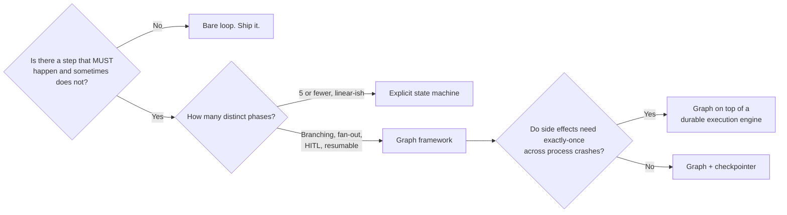

---

## 3. The agent loop, formalized

Strip away framework vocabulary and every agent is this:

```
state ← initialize(request)
repeat:
    obs      ← perceive(state)          # assemble context: history, memory, tool results
    decision ← decide(obs)              # the LLM call; emits action(s) or a terminal answer
    result   ← act(decision)            # tool execution, possibly parallel
    state    ← observe(state, result)   # fold result into state (reducer)
    verdict  ← evaluate(state)          # cheap checks: done? stuck? over budget? invalid?
until terminate(verdict)
```

Five things deserve to be named separately, because collapsing them is where designs go wrong.

**`perceive` is context assembly, and it is a policy, not a buffer.** What you put in the window each turn — full history, summarized history, retrieved memories, tool schemas — is a decision that changes behavior more than most prompt edits. It is also the thing that silently degrades as runs get long. (Covered in depth in the companion harness document.)

**`decide` is the only non-deterministic step.** Everything else can and should be deterministic. If you find non-determinism leaking into `act`, `observe`, or `evaluate`, you have a replay problem later.

**`act` should be transactional-ish.** Parallel tool calls fan out here; this is where idempotency keys, timeouts, and retry policy live.

**`observe` is a *reducer*, not an assignment.** This is the single most useful idea LangGraph exports: state channels have merge functions. `messages` appends; `errors` appends; `current_plan` overwrites; `budget_spent` sums. Making the merge explicit per channel is what makes parallel branches safe.

**`evaluate` is separate from `decide` on purpose.** If the model decides both "what to do" and "am I done," you have coupled the actor and the critic and you will get premature termination and false success. Cheap deterministic checks (did the file get written? did the API return 2xx? does the output parse?) belong here and cost nothing.

### Termination conditions

You need *all* of these, not one:

| Condition | Type | Notes |
|---|---|---|
| Model emits final answer / no tool calls | Semantic | The intended exit. Never the only exit. |
| Goal predicate satisfied | Programmatic | Best kind. `assert invoice.status == "paid"`. Requires a checkable goal. |
| Step budget exhausted | Hard | LangGraph's `recursion_limit`; default is 1000 super-steps as of v1.0.6 ([graph API docs](https://docs.langchain.com/oss/python/langgraph/graph-api)). 1000 is a *safety net*, not a budget — set yours to 10–40. **Do not assume every graph runtime has one.** Google ADK 2.6.1 has no graph-step ceiling at all: a four-node graph with an unconditional back-edge ran 1,292 iterations in 20 seconds and was still going ([finding 006](../specs/001-discovery-validation/findings/006-graph-loop-primitives.md) §Primitive 3). |
| Token/cost budget exhausted | Hard | Must be tracked in state as a summing channel. |
| Wall-clock deadline | Hard | Especially for user-facing turns. |
| No-progress detector fires | Heuristic | See §4. |
| Unrecoverable error | Hard | Distinguish from retryable. |
| Human interrupt | External | The `interrupt()` case. |

**Design rule: every terminal state should be typed and distinguishable.** `Done(result)`, `Failed(reason)`, `BudgetExhausted(partial)`, `NeedsHuman(question)`, `Aborted`. Collapsing these into "returned a string" destroys your ability to measure anything in [04](./04-self-improving-agents.md). A very common and very expensive bug is an agent that returns a confident summary on budget exhaustion, which downstream code treats as success — the "false success" pattern studied on τ²-bench, where LLM judges are *anti-correlated* with truth when distinguishing false success from honest failure (AUROC 0.18–0.30, [2606.09863](https://arxiv.org/abs/2606.09863)). Typed terminals make this a non-issue for the common case.

> **Measured 2026-08-02 — the design rule is confirmed, and the runtime supplies none of it**
> ([finding 006](../specs/001-discovery-validation/findings/006-graph-loop-primitives.md)
> §Primitive 2). This section was written as an argument. Google ADK 2.6.1 is the first runtime it
> has been checked against, and the check reproduced the exact failure shape described above.
> Four scenarios were run through one graph. A node raising is named well, both as an event field
> (`error_code='RuntimeError'`, `error_message='deliberate node failure'`) and as a propagating
> exception. Budget exhaustion is named by exception type (`LlmCallsLimitExceededError`). But a
> clean completion and a run cancelled mid-loop produce **the same observation from the caller's
> side**, because `Workflow._emit_end_of_agent` returns early unless the `@experimental`
> `is_resumable` flag is on, and it defaults to off. That is precisely the false-success shape
> named above, present by default in the runtime this project has adopted.
>
> Of the taxonomy in the table, ADK supplies **no terminal name field at all**, and no notion of
> `goal_satisfied`, `max_steps`, `budget_cost`, `wall_clock`, or `no_progress`. The raw signals to
> derive two of them exist. The taxonomy has to be built — sized at 2–3 days for a wrapper over
> `run_async`. **Do not read "the framework has termination conditions" off any framework's
> feature list**; the four scenarios above take an afternoon to run and the answer was not what the
> documentation implied.

---

## 4. Loop safety: budgets, thrash, oscillation

Infinite loops in agents are rarely literal infinite loops — the step budget catches those. The expensive failures are **productive-looking non-progress**: the agent keeps calling tools, keeps burning tokens, and keeps not advancing.

Four detectors, cheap to implement, in rough order of value:

**1. Repeat-action detector.** Hash `(tool_name, canonicalized_args)`. If the same hash occurs 3× within a window, the agent is stuck. Response: inject the observation ("you have called `search('foo')` three times with the same result") rather than silently failing — this often unsticks it, and it's a much better signal than a bare retry.

**2. Oscillation detector.** Track the sequence of visited nodes / tools. A repeating cycle `A→B→A→B` with no state delta is oscillation. Common cause: two nodes each "fixing" what the other did — a validator that rejects and a generator that regenerates the same thing. Response: break the cycle by escalating (different model, human, or abort), never by simply raising the limit.

**3. State-delta monitor.** Define a `progress` projection of state (files written, fields filled, subgoals closed). If `progress` is unchanged across N iterations, you are thrashing regardless of how busy the trace looks. This is the most general detector and the one most worth building.

**4. Cost-per-progress ratio.** Tokens spent divided by progress delta. Rising sharply → abort. This is also your best online health metric.

```python
# Illustrative, framework-agnostic
@dataclass
class LoopGuard:
    max_steps: int = 25
    max_usd: float = 0.50
    max_repeat: int = 3
    stall_window: int = 4

    def check(self, s: RunState) -> Verdict | None:
        if s.step >= self.max_steps:        return Verdict.BUDGET_STEPS
        if s.usd >= self.max_usd:           return Verdict.BUDGET_COST
        if s.action_hist.most_common_run() >= self.max_repeat:
                                            return Verdict.THRASH
        if s.progress_unchanged_for >= self.stall_window:
                                            return Verdict.STALL
        if s.node_hist.has_cycle_without_delta(): return Verdict.OSCILLATION
        return None
```

**Two anti-patterns to name explicitly.** First, *raising the recursion limit to fix a stuck agent* — this converts a fast failure into a slow expensive one and is never the fix. Second, *retrying the identical call after a failure*. Retry is only correct for transient/infrastructure errors. For semantic failures (the model called the tool wrong), you must change something — inject the error text, switch to a repair prompt, or escalate — or you will simply pay for the same failure again. LangGraph's per-node `retry_policy` is for the former; the latter needs a repair *edge*.

**Bound the whole tree, not each loop.** With nested loops (a critic loop inside a node inside an outer graph loop) per-loop caps multiply: 5 × 5 × 5 = 125 model calls. Carry a single global budget in a summing state channel and check it in every loop. LangGraph exposes `RemainingSteps` for the outer count, but a monetary budget channel is more honest.

> **Measured 2026-08-02 — "carry it in state" turns out to be load-bearing, not stylistic**
> ([finding 006](../specs/001-discovery-validation/findings/006-graph-loop-primitives.md)
> §Primitive 3). The advice above reads as a tidiness preference. It is not. Google ADK's one
> ceiling, `max_llm_calls`, is genuinely enforced within an attempt — a trap graph halted at
> exactly 3 cycles with `LlmCallsLimitExceededError` — but the counter lives on
> `_InvocationCostManager`, which hangs off the `InvocationContext`, which is rebuilt per attempt.
> **Resuming an invocation that had already exhausted a ceiling of 3 ran three more cycles, for 6
> total under a ceiling of 3.** A budget held in runtime context is multiplied by the number of
> crash-and-retry attempts, and every individual attempt looks compliant while it happens. A budget
> held in *session state* survives, which is why the recommendation above is the only one that
> works. Add a third anti-pattern to the two named above: **trusting a ceiling whose lifetime is
> shorter than the run's**.

---

## 5. Graphs as agent protocol

### 5.1 The vocabulary

- **Node** — a unit of work. An LLM call, a tool call, plain code, a validator, or a whole subgraph. The useful mental model is a *function with a contract*: typed input projection, typed output update, declared pre/postconditions.
- **Edge** — an unconditional transition. This is your protocol: `A → B` means B *will* run after A.
- **Conditional edge** — a routing function returning the next node name(s). The predicate may be code (deterministic, preferred) or a model call (general, expensive, unpredictable). **Prefer code predicates over model predicates wherever the decision is expressible in code.**
- **State / channels** — the typed record threaded through the graph, with a **reducer** per channel defining how concurrent updates merge. Without reducers, parallel branches race and clobber.
- **Cycle** — an edge back to an earlier node. This is what makes an *agent* graph rather than a pipeline; the plain ReAct agent is `agent ⇄ tools`.
- **Subgraph** — a graph used as a node. The unit of reuse and the unit of independent testing.
- **Fan-out / fan-in** — dispatch N parallel instances of a node and merge. LangGraph does this with `Send(node, payload)` returned from a conditional edge; results merge through the channel's reducer.
- **Interrupt** — a first-class pause that surfaces a payload to the caller and waits, indefinitely, for a resume.
- **Checkpoint** — a persisted snapshot of state at a step boundary, enabling resume, time-travel, and forking.

### 5.2 Canonical topologies

**ReAct — the loop as a two-node graph.** The floor. If this is all you need, you don't need a graph.

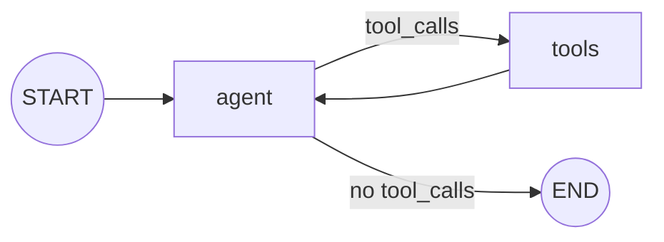

**Mandatory-step gating — the protocol pattern.** The model chooses *what* to write; it does not get a vote on *whether* validation runs.

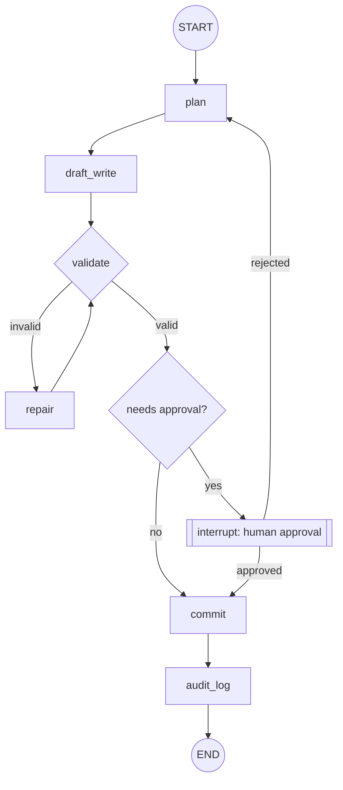

Note what this buys: `commit` is unreachable except through `validate`, and `audit_log` is unreachable-past except through `commit`. Those are *structural* guarantees. No prompt achieves them.

**Fan-out / fan-in (map-reduce).**

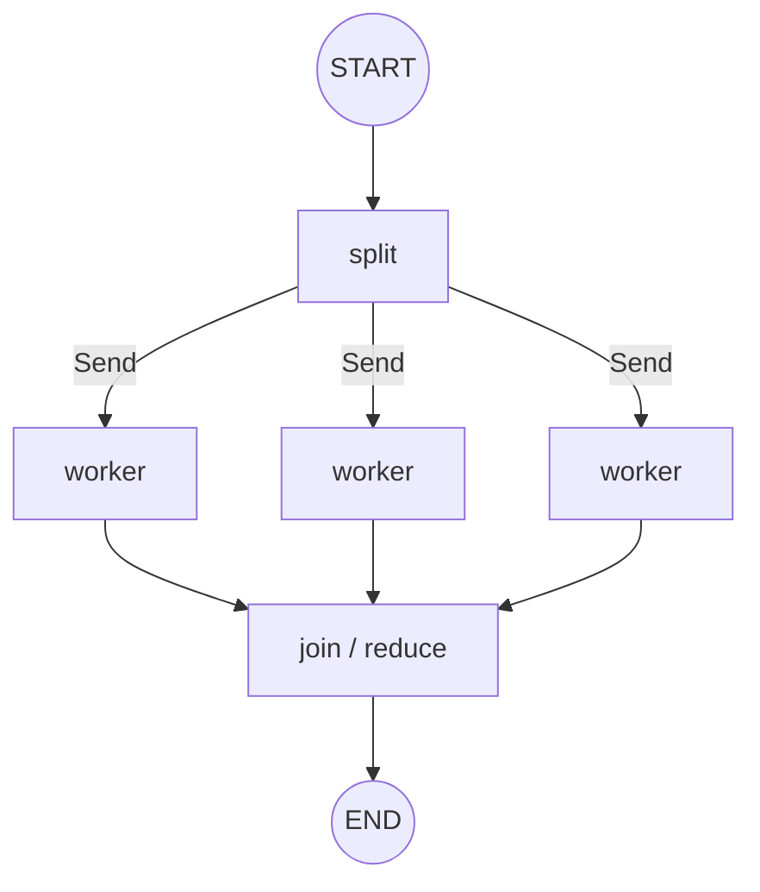

The subtlety: the join node must be *deferred* until all branches land, and the channel reducer must be associative and commutative (append-to-list, sum, set-union), because branch completion order is not guaranteed.

> **Confirmed by measurement 2026-08-02**
> ([finding 006](../specs/001-discovery-validation/findings/006-graph-loop-primitives.md)
> §Primitive 4). "Not guaranteed" understates it for Google ADK 2.6.1, where the scheduler
> dispatches downstream work in *completion* order. Three parallel branches with well-separated
> latencies (0.02s, 0.15s, 0.30s) produced 1 distinct ordering across 5 runs, which looks like
> determinism but is determinism by construction rather than by design. The same three branches
> with overlapping jittered latencies produced **5 distinct orderings across 8 runs**. Real nodes
> make network calls with variable latency, so any fan-out of ours will have a non-reproducible
> node ordering. The associativity-and-commutativity requirement above is therefore a correctness
> requirement, not a hygiene one.

**Supervisor / router with typed handoff.**

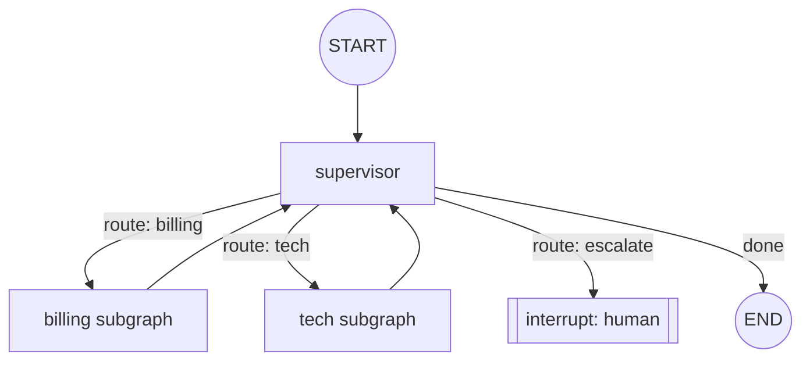

Worth flagging: the supervisor pattern is the most over-applied topology in the ecosystem. It is correct when the sub-domains have genuinely disjoint tools and policies. It is wrong when you have split one coherent task across "agents" that then have to re-explain context to each other — you pay for the handoff in tokens and lose information at every boundary. If your sub-agents need to share most of their context, they should be one agent with more tools.

**Generator–critic loop with a stopping rule.** See §7.

### 5.3 Graph-as-code vs. graph-as-data

| | Graph-as-code (LangGraph, Workflows, Burr) | Graph-as-data / declarative (n8n-style, ADK's edge list, YAML DAGs) |
|---|---|---|
| Expressiveness | Full host language | Limited to the schema |
| Static analysis | Requires compile step / introspection | Trivially inspectable, diffable, lintable |
| Non-engineer editing | No | Yes |
| Runtime mutation | Awkward | Natural (it's just data) |
| Versioning/rollback of topology | Git + deploy | Row in a table; instant rollback |
| Typical failure | Topology hidden inside conditionals | Escape hatches ("run this code") reintroduce all the problems |

The pragmatic answer for a system like `function2agent`: **keep an explicit, serializable topology as the source of truth, and compile it into the framework's code API.** You get diffable, lintable, versionable graphs (which §04's improvement loop needs — you cannot A/B two topologies you cannot serialize) and you keep the mature runtime. ADK 2.x is interesting precisely because its Python `Workflow(edges=[...])` form is *already* close to data — an edge list with route dicts.

---

## 6. Framework survey (verified, 2026-08-02)

Versions checked directly against PyPI/npm on 2026-08-02.

| Framework | Version (2026-08-02) | Model | Durability | HITL | Notes |
|---|---|---|---|---|---|
| **LangGraph (Py)** | `langgraph` **1.2.10** (2026-07-28); `langgraph-checkpoint` 4.1.1 | Pregel-style super-steps over a compiled `StateGraph` | Checkpointers + Stores; `durability` = `sync`/`async`/`exit` | `interrupt()` + `Command(resume=…)` | Most mature. 1.0.0 landed 2025-10-17. |
| **LangGraph (JS)** | `@langchain/langgraph` **1.4.8** | same | same | same | JS line is ahead in minor version; APIs mirror. |
| **Google ADK** | `google-adk` **2.6.1** (2026-07-31) | Graph workflows (v2.0+) *plus* dynamic workflows *plus* legacy template agents | Graph mode: **event-sourced replay, at-least-once, node-boundary** (measured, see §6.2). Automatic checkpointing in dynamic mode (**still unmeasured**) | Human-input nodes | Template `Sequential/Parallel/Loop` agents explicitly **superseded** by graph workflows in ADK 2.0 (Py/Go). Graph mode does **not** support live streaming, and has **no step, token, cost or wall-clock ceiling**. |
| **LlamaIndex Workflows** | `llama-index-workflows` **2.22.2** (2026-06-30); `llama-index-core` 0.14.23 | Event-driven pub/sub; `@step` functions typed by the events they consume/emit | Serializable `Context`; you assemble more of the recovery | Emit/await a human event | Topology is *implicit* — you trace events, not edges. |
| **Pydantic Graph** | `pydantic-graph` **2.22.0** | Typed nodes returning the next node; explicit state machine | Pluggable persistence | Manual | Ships with the Pydantic AI line; lightest weight of the typed options. |
| **Burr** | `apache-burr` **0.42.0** (the old `burr` package now redirects) | Explicit state machine with actions + transitions | Pluggable persisters | Manual | Donated to Apache; strong built-in UI/telemetry. Smaller ecosystem — verify activity before betting on it. |
| **Temporal** | `temporalio` **1.31.0** (2026-07-29) | Deterministic workflow + non-deterministic activities; event-sourced replay | **Real** durable execution | Signals / `wait_condition` | Not an agent framework. The substrate you put *under* one. |
| **Restate** | `restate-sdk` **1.0.3** (2026-07-24) | Journaled invocations; virtual objects keyed per session | Real durable execution, single binary | Durable promises | Explicitly markets "durable AI agents"; deliberately framework-agnostic. |

### 6.1 LangGraph specifics (2026 API surface)

The pieces that matter architecturally, verified against current docs:

**`StateGraph` + reducers.** State is a typed dict; channels carry reducers via `Annotated`.

```python
from typing import Annotated
from operator import add
from langgraph.graph import StateGraph, START, END
from langgraph.graph.message import add_messages

class State(TypedDict):
    messages: Annotated[list[AnyMessage], add_messages]  # ID-aware append/update
    errors:   Annotated[list[str], add]                  # append
    usd:      Annotated[float, lambda a, b: a + b]       # sum — your cost budget
    plan:     str                                        # no reducer ⇒ last write wins
```

`add_messages` is not just `operator.add`: it matches on message IDs so a human-in-the-loop edit *updates* rather than *appends*. That distinction bites people.

**Conditional edges and `Send` fan-out.**

```python
builder.add_conditional_edges("agent", route_fn, {"tools": "tools", "done": END})

def continue_to_workers(state):                     # map step
    return [Send("worker", {"item": x}) for x in state["items"]]
builder.add_conditional_edges("split", continue_to_workers)
```

**`Command` — update-and-goto in one return.** A node can return `Command(update={...}, goto="node_b")`, and `graph=` targets a parent graph from inside a subgraph. This collapses "mutate state" and "route" into one primitive, which is genuinely nicer than separate conditional edges when routing depends on what the node just computed. Note the asymmetry the docs call out: `Command(resume=…)` is the *only* Command form meant as graph *input*; `update`/`goto`/`graph` are for *returning from nodes*.

**`interrupt()` — and its sharp edge.** Calling `interrupt(payload)` inside a node raises a resumable exception, persists state, and surfaces the payload. You resume with `graph.invoke(Command(resume=value), config={"configurable": {"thread_id": ...}})`.

> **The trap:** on resume, **the node re-runs from the top of its function.** Everything before the `interrupt()` call executes again. If your node charges a credit card and then asks for confirmation, you charge twice. Rules: (1) put `interrupt()` as early in the node as possible; (2) make everything before it idempotent; (3) isolate side effects into their own downstream nodes.

**Durability modes.** `sync` (persist before the next step; safest, slowest), `async` (persist concurrently with the next step), `exit` (persist only on exit; fastest, no crash recovery). The Python `astream` reference lists the default as `"async"`, while at least one persistence guide describes `sync` as the default — **I could not fully reconcile this; verify against your installed version before relying on it.** Per-task writes within a super-step are stored separately, so if one node in a parallel super-step fails, the siblings that succeeded don't re-run on resume.

**Checkpointers vs. Stores.** Checkpointer = thread-scoped state snapshots (conversation continuity, HITL, time travel, fault tolerance). Store = cross-thread key-value (user preferences, learned facts). Both, usually. The Store is where the memory-based improvement of [04](./04-self-improving-agents.md) lives.

**Recursion limit.** `config={"recursion_limit": N}` — a top-level config key, *not* inside `configurable`. Default 1000 super-steps since 1.0.6; exceeding raises `GraphRecursionError`. You can read `config["metadata"]["langgraph_step"]` or use the `RemainingSteps` channel to degrade gracefully rather than crashing.

**Functional API.** `@entrypoint` / `@task` gives you durability and checkpointing while writing ordinary imperative code with loops and conditionals — no graph to declare. **When to use it:** your control flow is genuinely dynamic/recursive and the graph is fighting you, but you still want checkpointing. **When not to:** you wanted the graph for *auditability and enforcement*, in which case the functional API gives it all back. An `@entrypoint` compiles to a single node, so the same determinism rules apply on resume: task results are restored from the checkpointer, and **reordering `task`/`interrupt` calls between runs can mismatch cached values.**

### 6.2 Google ADK: the three-tier story

ADK 2.x is worth studying because it offers all three points on the spectrum explicitly:

- **Template workflows** (`SequentialAgent`, `ParallelAgent`, `LoopAgent`) — deterministic orchestration with no LLM in the routing decision. Now positioned as the "prebuilt building blocks" tier and explicitly **superseded** by graphs for new work in Python/Go.
- **Graph workflows** — `Workflow(edges=[...])` with route dicts. Notably close to graph-as-data.
- **Dynamic workflows** — imperative orchestration in your own code with `ctx.run_node()` and automatic checkpointing (the analogue of LangGraph's functional API).

The known limitations are honest and worth noting: graph-based workflows don't support live streaming, and some third-party integrations aren't compatible. ADK's graph API is also newer than LangGraph's; treat the surface as still-moving.

> **Corrected and extended 2026-08-02 by direct measurement of the graph tier**
> ([finding 006](../specs/001-discovery-validation/findings/006-graph-loop-primitives.md)). Two
> things above need adjusting, and a third needs adding.
>
> **The checkpointing attribution was too narrow.** This section credited automatic checkpointing
> to the *dynamic* tier only. The **graph** tier recovers from a crash too, and the mechanism is
> not what the class names suggest: `Workflow._run_impl` carries the comment
> `# TODO: resume from checkpoint event.` and then calls
> `replay_mgr.scan_workflow_events(ctx)`, reconstructing progress by scanning the session's event
> history. Recovery is **event-sourced replay, not checkpoint-blob loading**. It works: a process
> `SIGKILL`ed at iteration 3 of 6 was replaced by a fresh process that reopened the same SQLite
> session and ran through to completion with state intact, 5 trials out of 5. What was *not*
> measured is the dynamic tier, whose granularity may differ; that remains an open item and is
> worth 30 minutes before any schedule depends on it.
>
> **Neither resumability configuration is exactly-once.** `ResumabilityConfig(is_resumable=True)`
> emits checkpoint events and restores to the boundary *before* the interrupted node, so it re-runs
> it (17 persisted events, 7 total `work` executions). The default emits none and reconstructs from
> node-output events, so a node whose output flushed before the crash is skipped (7 events, 6
> executions). The difference is only where the boundary lands. A kill *inside* a node duplicated
> the durable side effect in **both**. ADK's own `ResumabilityConfig` docstring states this
> plainly: *"Tool call to resume needs to be idempotent because we only guarantee an at-least-once
> behavior once resumed."*
>
> **A limitation to add to the list above: there is no state reducer concept anywhere in ADK.**
> LangGraph's most useful export has no analogue; searching `workflow/` and `agents/` for any
> reducer, merge-function or annotated-channel concept returns nothing. The consequence is a silent
> lost update — two parallel branches accumulating into a shared key left only the second branch's
> value, with no error and no warning. See §8.3.
>
> **And one defect worth reporting upstream.** Cancelling the consumer of `run_async` reliably
> raises `ValueError: <Token …> was created in a different Context` from OpenTelemetry during
> generator teardown, 3 times out of 3. State is not corrupted, but clean cancellation is not
> clean, and cancellation is routine in an agent product.

### 6.3 Durable execution engines: the layer below

This is the most important architectural distinction in this section, and it's routinely muddled.

**LangGraph checkpoints at super-step boundaries. It does not checkpoint *inside* a node.** If a node makes three API calls and dies on the third, resume re-runs all three. Temporal/Restate journal *each durable step*, so resume skips the two that completed.

> **Confirmed on a second framework, and now sized 2026-08-02**
> ([finding 006](../specs/001-discovery-validation/findings/006-graph-loop-primitives.md)
> §The largest build item is not ADK's fault). Google ADK checkpoints at node boundaries with the
> same consequence, measured: a kill inside a node duplicated its durable side effect, and a
> five-turn loop hosted inside a node re-executed **4 of 4** completed inner turns on resume. The
> practical significance is that this section's distinction is no longer an argument about two
> vendors' documentation — it is the difference between two measured behaviours, and it has a
> price. Building idempotency keys and inner-loop journaling on top of node-boundary checkpointing
> is estimated at **1–1.5 weeks for one engineer**, which is over half the total build cost of
> adopting ADK. **Switching agent frameworks does not avoid that cost, because the semantics are
> the same in both.** Only a durable-execution layer underneath removes it. Whether that layer is
> in scope is tracked as U-31 in [14](./14-architecture-synthesis.md) §5.2; the answer changes the
> size of the largest build item on the critical path, so it is no longer a question that can be
> deferred indefinitely.

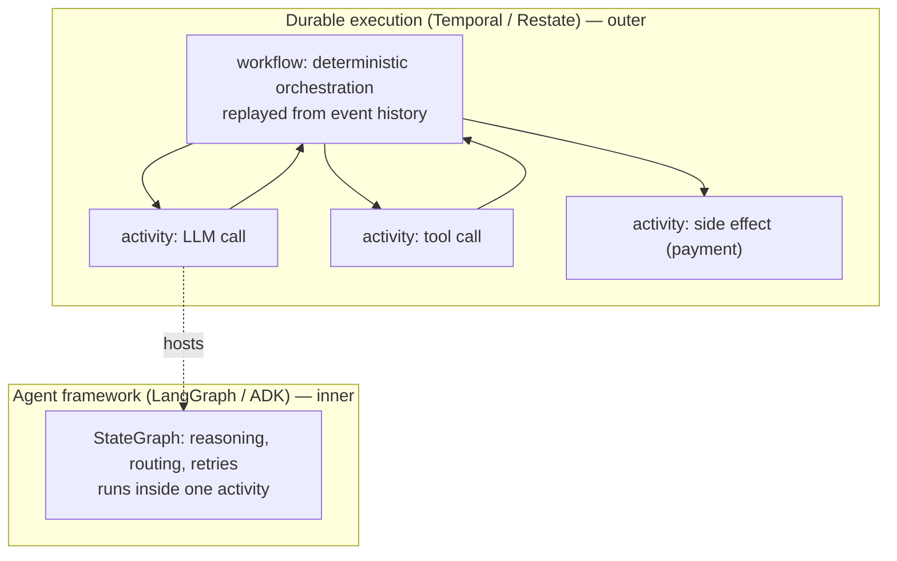

The rule of thumb that has emerged in 2026: **agent framework inside, durable engine outside.** The agent handles reasoning and tool planning; the durable engine handles crash recovery, long timers, and exactly-once side effects. Temporal has leaned into this explicitly (its OpenAI Agents SDK integration went GA in 2026 and it added ADK integration); Restate markets "durable AI agents" as a headline use case and demonstrates durable loops over several agent SDKs without asking you to adopt a Restate-shaped framework.

**When you actually need this:** runs that outlive a process (minutes to days), side effects that must not double-fire (payments, emails, provisioning), or long human-approval waits. **When you don't:** a 30-second chat turn. The determinism discipline Temporal demands (no `Date.now()`, no `random()`, no network I/O in workflow code, every LLM call in an activity) is real work; don't pay it for a request-scoped agent.

---

## 7. Loop patterns as first-class primitives

This is where most token budget gets spent and most of it gets wasted. Ordered by evidence quality, best first.

### 7.1 Generator–critic / reflection — **only with an external signal**

The pattern: generate → critique → revise → repeat until the critic passes or budget runs out.

**The critical caveat, and it is the most important empirical result in this document:** Huang et al., *Large Language Models Cannot Self-Correct Reasoning Yet* (ICLR 2024, [2310.01798](https://arxiv.org/abs/2310.01798)) showed that **intrinsic** self-correction — the model critiquing its own answer with no external signal — *degrades* accuracy across models and benchmarks. Reported gains in earlier self-correction work came from using **oracle labels** to decide when to stop, which is not self-correction but oracle-guided filtering. A 2026 follow-up decomposing the capability found error *detection* rates ranging from 10% to 82% across models and, notably, that detection rate does not predict correction success ([2601.00828](https://arxiv.org/abs/2601.00828)).

The nuance that has aged in: the title should be read as "cannot be *prompted* into self-correction," not "cannot learn to." SCoRe ([2409.12917](https://arxiv.org/abs/2409.12917)) showed RL-trained self-correction achieving genuine intrinsic gains. But that's a training-time intervention, not something you get by adding a critic node.

**Practical rule: a critic node is worth its tokens exactly when the critic has information the generator did not.** Concretely:
- ✅ Compiler / type checker / test suite output
- ✅ Schema validation, API error responses
- ✅ A retrieval step that grounds the critique in source documents
- ✅ A different model, or the same model with genuinely different context
- ❌ "Review your answer and improve it."

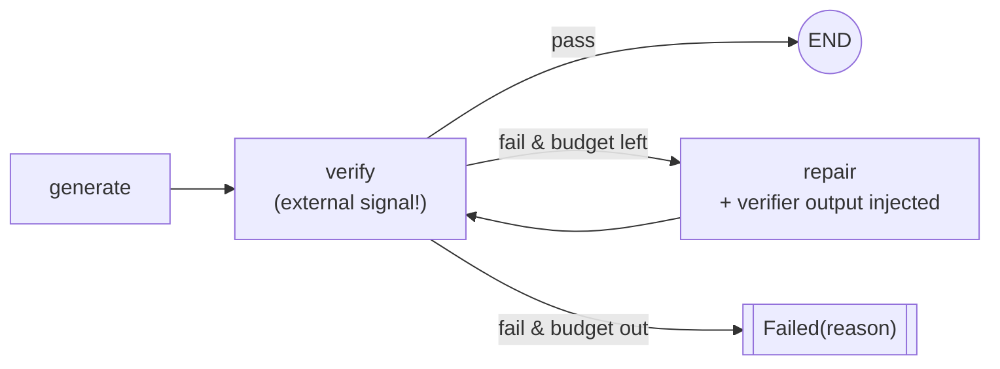

**Cost:** ~2–4× a single pass. **Worth it:** almost always, *when the verifier is real*. This is the highest-ROI loop in agent engineering, and it is also the one most often built wrong (with an LLM self-critique standing in for a verifier).

### 7.2 Plan–execute–replan

Plan up front, execute steps, replan when reality diverges. Buys you: an inspectable artifact (the plan) and a natural place for human approval before expensive work.

**Costs and traps:** the plan is generated with zero observations, so it encodes guesses. Without a *cheap, well-specified replan trigger* the pattern degenerates — either the agent follows a stale plan or silently abandons it. Define the trigger explicitly (a step failed; an assumption in the plan was contradicted; N steps with no progress) and make replanning bounded (max 2–3 replans, and each replan must consume the failure reason).

**Worth it:** long-horizon tasks (>8 steps), tasks needing human approval of intent before execution, tasks with expensive irreversible actions. **Not worth it:** anything under ~5 steps.

### 7.3 Best-of-N with a judge

Sample N candidates, pick one. **Costs N× generation plus judging.**

The catch is the judge. LLM judges carry documented, structural biases — position/order, verbosity, self-preference, authority, bandwagon. A 2026 mechanistic study across seven judges, seven bias types, and nine benchmarks found bias occupies a low-dimensional, type-specific activation subspace that supports *causal* steering in both directions ([2607.11871](https://arxiv.org/abs/2607.11871)). Self-preference bias has been quantified across 20 mainstream LLMs, with the uncomfortable finding that advanced capability is *uncorrelated or negatively correlated* with low self-preference ([2604.22891](https://arxiv.org/abs/2604.22891)).

**Therefore:** prefer a programmatic scorer (tests passed, schema valid, constraints satisfied) over a judge. If you must use a judge, use pairwise comparison with order-swapped double-querying, and don't let a model judge its own family's outputs.

**Worth it:** when generation is cheap, verification is cheap and *programmatic*, and variance is high. **Not worth it:** as a general quality bump with an LLM judge — you're often just selecting for verbosity.

### 7.4 Debate

Multiple model instances critique each other. Huang et al. found multi-agent debate's efficacy "no better than self-consistency" when the number of model calls is held constant ([2310.01798](https://arxiv.org/abs/2310.01798)) — i.e., much of the apparent gain is the extra compute, not the debate. **Verdict: I would not build this in production.** If you're spending 3× compute, spend it on self-consistency (simpler, cheaper) or on a real verifier.

### 7.5 Tree/graph search — ToT, GoT, LATS, MCTS

Branch the reasoning, score partial states, prune, backtrack.

The cost picture is unambiguous. ToT's own paper reports Game-of-24 needing ~5.5k completion tokens per problem — comparable to ~100 CoT trials — and states costs "could require 5–100× more generated tokens than CoT" ([2305.10601](https://arxiv.org/abs/2305.10601)). A systems-level characterization of agentic test-time scaling found that for Reflexion, going from 16.9s → 25.6s latency buys 4% accuracy, while the *same* 4% from a later starting point costs 269.5s — a **31× higher cost for the same marginal gain** ([2506.04301](https://arxiv.org/abs/2506.04301)). A 2026 study of ToT strategies under variable budgets found both MCTS-style and semantic-pruning approaches fail to convert additional compute into proportional accuracy — MCTS via a cold-start bottleneck, pruning via frontier depletion ([2606.20599](https://arxiv.org/abs/2606.20599)).

The genuinely useful 2026 result is **conditional branching**: don't search at every step, decide *whether to branch*. Chain-in-Tree's branching-necessity check reduced token generation, model calls, and runtime by **75–85%** on GSM8K/MATH500 across ToT, ReST-MCTS, and RAP "with often negligible or no accuracy loss" ([ACL Findings 2026](https://aclanthology.org/2026.findings-acl.214.pdf)). Lightweight learned pruning predictors report 26–75% overhead reduction at competitive accuracy ([2603.20267](https://arxiv.org/abs/2603.20267)).

**Verdict:** tree search is a research technique with a narrow production niche — tasks with a *cheap programmatic verifier for partial states* (code that compiles, constraints that check, games with rules). If you can't score a partial state cheaply and correctly, you are paying MCTS prices for a random walk. **If you do build it, gate the branching.**

### 7.6 Summary table

| Pattern | Cost multiple | Needs external verifier? | Production-viable 2026 | When |
|---|---|---|---|---|
| Verifier-in-the-loop (repair) | 1.5–3× | **Yes** | ✅ Strongly | Whenever a programmatic check exists |
| Generator–critic (LLM critic only) | 2–4× | — | ⚠️ Evidence says it hurts reasoning | Style/format, not correctness |
| Plan–execute–replan | 1.2–2× | No | ✅ | >8 steps, or approval-before-work |
| Best-of-N + programmatic scorer | N× | Yes | ✅ | Cheap gen, cheap check, high variance |
| Best-of-N + LLM judge | N×+ | No | ⚠️ Bias-prone | Only with pairwise + order swap |
| Debate | 3–5× | No | ❌ | Not vs. self-consistency at equal compute |
| ToT / GoT / LATS / MCTS | 5–100× ([2305.10601](https://arxiv.org/abs/2305.10601)) | **Yes** | ⚠️ Narrow | Partial states cheaply scorable; gate branching |

---

## 8. Protocol enforcement patterns

This section is the practical core of "encode the required protocol as topology."

### 8.1 Required-step gating

**Pattern:** make the goal node structurally unreachable except through the mandatory step. There is no conditional edge from `draft` to `commit`. Full stop.

**Anti-pattern:** a conditional edge whose predicate is an LLM answering "should we validate?" You've just moved the prompt into the graph and kept all its unreliability.

**Test it:** topology tests are cheap and underused. Assert reachability properties of the compiled graph, not behavior:

```python
def test_commit_requires_validation():
    paths = all_simple_paths(graph, source=START, target="commit")
    assert all("validate" in p for p in paths), "commit reachable without validate"

def test_no_side_effect_before_approval():
    for p in all_simple_paths(graph, START, "charge_card"):
        assert p.index("human_approval") < p.index("charge_card")
```

These run in milliseconds, need no model, and catch the exact class of regression that a topology-editing agent (§04) could introduce.

### 8.2 Precondition / postcondition contracts per node

Every node gets a contract. This is the direct analogue of a function's type signature plus its documented invariants — and it is the bridge to `function2agent`.

```python
@node(
    reads   = ["order_id", "customer"],           # required input channels
    writes  = ["inventory_check"],                # declared output channels
    pre     = [lambda s: s.order_id is not None],
    post    = [lambda s: s.inventory_check in {"ok","short"}],
    retries = RetryPolicy(max=3, on=(TransientError,)),
    idempotency_key = lambda s: f"invcheck:{s.order_id}",
)
def check_inventory(state: State) -> Update: ...
```

Preconditions failing is a *routing* signal (go gather the missing input), not an exception. Postconditions failing is a *repair* signal. Making both explicit turns a class of silent corruption into typed, attributable failures — which is exactly what §04's failure-attribution step needs.

### 8.3 Typed state channels

Two rules that prevent most cross-node bugs:

1. **Declare which channels each node reads and writes.** Then a node cannot accidentally depend on something an upstream node happened to leave behind. This also makes the data-flow graph derivable from the control-flow graph, which is what lets you reason about parallel safety.
2. **Every channel has an explicit reducer.** `last-write-wins` is a *choice*, not a default you fall into. If two parallel branches write the same non-reducer channel in the same super-step, that's a bug you want caught at compile time.

> **Correction 2026-08-02: rule 2 is not enforceable in the runtime this project has adopted, and
> the bug is not caught at all** ([finding 006](../specs/001-discovery-validation/findings/006-graph-loop-primitives.md)
> §ADK's state and session model). Rule 2 was written from LangGraph's `Annotated`-channel model,
> where a reducer is a first-class per-channel declaration. Google ADK 2.6.1 has no such concept —
> searching `workflow/` and `agents/` for any reducer, merge-function or annotated-channel
> construct returns nothing. `Workflow.state_schema` exists, but it validates only that a
> `FunctionNode`'s parameter names appear in the schema; it says nothing about how concurrent
> writes combine. Two parallel branches that each read a shared key, did work, and wrote it back
> left `state['log'] == ['B']`: branch A's write vanished with **no error and no warning**. So on
> ADK the failure mode is not "last-write-wins, which you chose by accident" but "last-write-wins,
> silently, with no mechanism to choose otherwise." Any parallel branch that accumulates into
> shared state needs merge discipline written by hand, above the runtime. Rule 1 becomes more
> important as a result, not less — declared read/write sets are the only place a conflict can be
> detected if the runtime will not detect it.

### 8.4 Validator nodes and repair edges

Split validation into two node types with different downstream semantics:

- **Guard** (precondition): "can we proceed?" → routes to a gather/repair path. Cheap, deterministic.
- **Verifier** (postcondition): "did we get it right?" → routes to repair or forward. Should be programmatic where possible.

The **repair edge** must be distinguishable from a retry edge in your traces, because they mean completely different things: retry = "the world was flaky," repair = "we were wrong." Conflating them destroys your failure attribution.

### 8.5 Compensating actions, rollback, and the saga pattern

Agents do multi-step side effects, and there is no distributed transaction across a payment API, an email service, and your database. The answer is the same as it is in microservices: **sagas** — a sequence of local transactions, each with a compensating action, executed in reverse on failure.

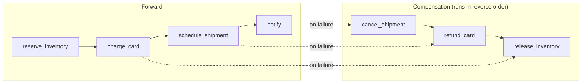

Three non-negotiables:
- **Every side-effecting node declares its compensator**, or declares itself irreversible (in which case it must sit behind a human gate).
- **Idempotency keys derived from stable state**, not from a UUID generated inside the node — because on replay the node re-runs and would generate a new UUID. This is exactly the LangGraph `interrupt()` re-execution trap and the Temporal determinism rule in a different costume.
- **Compensation is itself a graph path** and must be as testable as the forward path. Failed compensation is the worst state your system can be in; it needs its own terminal type and an alert.

### 8.6 Where to put the human

`interrupt()` is the mechanism; the design question is *where*. Four useful placements:

| Placement | Purpose | Cost |
|---|---|---|
| Before first irreversible action | Approval | Latency once per run |
| On low confidence / guard failure | Escalation | Rare; needs a calibrated trigger |
| On budget exhaustion | Continue-or-abort | Rare |
| Post-hoc sampling of completed runs | Eval labels for §04 | Zero latency; highest long-term value |

That last row is the one teams skip and later regret: routing a sampled fraction of *successful* runs to human review is how you build the labeled eval set that everything in [04](./04-self-improving-agents.md) depends on.

---

## 9. Composing graphs and loops

Four composition modes, each with a distinct bounding requirement:

**Loop inside a node.** A node internally runs a bounded refine loop and returns only when converged or capped. Simple, keeps the outer graph readable. **Downside:** invisible to the outer checkpointer — a crash mid-loop replays the whole loop. Use for short, cheap, side-effect-free loops.

> **Confirmed exactly, 2026-08-02, and it is the measurement that matters most for
> `function2agent`** ([finding 006](../specs/001-discovery-validation/findings/006-graph-loop-primitives.md)
> §Primitive 1). "Invisible to the outer checkpointer" was a prediction when this was written. It
> is now a measurement. A Google ADK node running a five-turn internal loop, killed during turn
> four, re-executed **all 4 of 4** completed inner turns on resume:
>
> ```
> completed before the kill : ['inner:1', 'inner:2', 'inner:3', 'inner:4']
> executed after resume     : ['inner:1', 'inner:2', 'inner:3', 'inner:4', 'inner:5', 'after']
> ```
>
> Zero inner-loop granularity, as predicted. The reason this matters more than the other
> compositions is that hosting our own agent loop inside a node **is the intended architecture**,
> so the qualifier attached to this composition mode — "use for short, cheap, side-effect-free
> loops" — is a constraint on the whole design rather than advice about one option. Either the
> hosted loop journals its own turns to session state so a resumed node can skip completed ones, or
> every side-effecting inner turn carries a stable idempotency key. That work is sized at
> **1–1.5 weeks** and it is not avoidable by changing framework (§6.3).

**Graph inside a loop (subgraph as loop body).** The outer graph cycles; each iteration invokes a subgraph. Checkpointed at outer boundaries. This is the standard shape for "attempt → evaluate → attempt again."

**Subgraph as a node.** The unit of reuse and independent testing. Two things to get right: (1) state mapping between parent and child schemas should be explicit, not implicit shared keys; (2) whether the subgraph writes to the parent checkpoint or its own — a known source of "my subgraph state vanished" confusion.

**Recursion.** A graph invoking itself for hierarchical decomposition. Powerful and dangerous; requires an explicit depth channel and a hard depth cap (3 is usually plenty), independent of the step budget.

**Bounding total work — the rule:** carry *one* budget record in state and decrement it everywhere.

```python
class Budget(TypedDict):
    steps_remaining: int
    usd_remaining: float
    depth_remaining: int
    deadline_ts: float
```

Per-loop caps multiply and lie to you. A single shared budget threaded through every level — including into subgraphs — is the only thing that actually bounds a composed system. Check it at every loop head and treat exhaustion as a first-class typed terminal.

---

## 10. Observability and durability

### 10.1 What to trace

Model the trace on the topology, not on the prose. One span per node, nested spans for LLM/tool calls, and edge traversals as span links or attributes. At minimum, per node:

| Field | Why |
|---|---|
| `node_id`, `graph_version`, `run_id`, `thread_id` | Attribution and joins |
| `step_index` / super-step number | Ordering, loop detection |
| Input channel projection (hashed or redacted) | Repro |
| Output update | Diffing |
| Chosen outgoing edge + predicate inputs | **The routing decision, explicitly** |
| Tokens in/out, cost, latency, model+version | Budget attribution, regression detection |
| Retry count and retry *reason* | Distinguish flaky from wrong |
| Precondition/postcondition results | Contract violations |
| Terminal type on exit | False-success detection |

The "chosen outgoing edge + predicate inputs" row is the one that makes §04 possible. Failure attribution ("was it a bad prompt, a bad tool, a missing node, or wrong routing?") is only mechanizable if routing decisions are first-class trace data.

**Cardinality warning:** `node_id` is a good metric label; `run_id` is not. Put high-cardinality identifiers in trace attributes, not metric dimensions.

### 10.2 What to persist

- **Always:** state snapshots at step boundaries, the routing decisions, terminal type, budget consumption, graph version.
- **Usually:** full messages (redacted), tool inputs/outputs (redacted, truncated).
- **Carefully:** anything with PII. Persist a hash + a pointer into a separately-governed store, so you can replay structure without replaying secrets.
- **Cheaply:** raw model responses are the most valuable and most expensive thing to keep. Sample them (100% on failures, 1–5% on successes) rather than dropping them.

### 10.3 Deterministic vs. non-deterministic replay

Three distinct operations, routinely conflated:

| Operation | What's fixed | Use for |
|---|---|---|
| **Resume** | Continue from last checkpoint with real model calls | Crash recovery, post-interrupt |
| **Deterministic replay** | Model + tool outputs served from the recorded trace | Debugging *your code*, regression-testing routing logic, verifying a topology change didn't alter reachable paths |
| **Re-run / fork** | Same inputs, fresh model calls, possibly new prompt or topology | Evaluation, A/B of a change, time-travel exploration |

Deterministic replay is the underused one. Record model responses keyed by `(node_id, step, prompt_hash)`, and you get a cassette-style test suite where you can refactor the graph and prove the routing is unchanged without spending a token. **Limitation to be honest about:** the moment the prompt changes, the cassette misses and you're back to re-run. So deterministic replay tests your *plumbing*, not your *prompts* — which is exactly the division of labor you want, since prompts are tested by evals.

**Time travel** = pick a historical checkpoint, fork the thread, change something, run forward. This is the manual-debugging analogue of the automated improvement loop in §04, and it's the single most useful interactive feature checkpointing gives you.

> **Measured 2026-08-02 — the three operations separate cleanly, but only in the sequential case**
> ([finding 006](../specs/001-discovery-validation/findings/006-graph-loop-primitives.md)
> §Primitive 4). Four resumes from byte-identical copies of one post-crash Google ADK snapshot
> (`sha256=11fa3ec8…`, 49,152 bytes) produced **1 distinct trace out of 4** and 1 distinct final
> state, with the model stubbed out entirely so that model nondeterminism could not contaminate the
> arm. Graph mechanics replay deterministically given fixed node outputs, which is the property the
> "deterministic replay" row above depends on, and it holds.
>
> **The row needs one qualifier this table did not carry: replay is deterministic only for
> sequential mechanics.** ADK's scheduler dispatches downstream work in completion order, so with
> overlapping branch latencies the same fan-out produced 5 distinct orderings across 8 runs (§5.2).
> Recording model and tool outputs keyed by `(node_id, step, prompt_hash)` therefore fixes *what*
> each node returns but not *in what order* parallel nodes run. A cassette-style test that asserts
> a trace equals a recorded trace will be flaky on any graph with a fan-out; one that asserts
> reachability or set-equality of visited nodes will not. Whether that matters is a function of
> whether your joins are order-sensitive — and per §8.3, ADK gives you no reducer to make them
> order-insensitive.

---

## 11. Relevance to `function2agent`

The project's premise — promoting plain functions/tools into agents — makes the mapping between *function contracts* and *graph node contracts* the central design surface. I'd argue the whole system can be organized around one claim:

> **A function is already a node. Promoting it to an agent means wrapping it in the minimum control flow that makes its contract enforceable under a non-deterministic caller.**

### 11.1 The signature → node-contract mapping

| Function concept | Graph concept | What the promotion adds |
|---|---|---|
| Parameter types | Input channel schema | Validation node / guard edge before entry |
| Return type | Output channel + reducer | Postcondition verifier node |
| Docstring | Node description + routing hint | Feeds the router's decision and the eval rubric |
| Raised exceptions | Typed failure edges | Distinct repair vs. retry vs. escalate paths |
| Preconditions (asserts) | Guard predicate | Route to a "gather missing inputs" subgraph |
| Postconditions / invariants | Verifier node | Repair edge back into the body |
| Purity / no side effects | Safe to retry, parallelize, cache, replay | Enables `Send` fan-out and cassette replay |
| Side effects | Saga participant | Requires compensator + idempotency key |
| Idempotency | Idempotency key derivation | Safe under `interrupt()` re-execution and durable replay |
| Cost / latency | Budget annotation | Feeds the shared budget channel and routing cost model |
| Auth scope | Node-level policy | Human gate or capability check as a preceding node |

This table is, I think, the most actionable artifact in this document for `function2agent`. It says the promotion is *mechanical* for everything except the parts a Python signature doesn't carry — and it names exactly those parts as the metadata your decorator/registry must capture.

> **Measured 2026-08-02, and the first four rows now have numbers against them** ([finding 007](../specs/001-discovery-validation/findings/007-contract-extraction.md), 69 FastAPI endpoints scored against the application's own published schema). **The mechanical claim holds where it is strongest and fails where the table is quietest.** Parameter types come out exact — 207 derived against 207 expected, zero mismatches on name, location, required flag, and type — so the *Input channel schema* row is confirmed rather than assumed. Return types agree 53 times and disagree zero times, with 16 endpoints declaring no response shape anywhere in the source *or* the framework, so the *Postcondition verifier node* row is buildable for roughly three quarters of endpoints and, for the rest, no verifier is constructible short of running the endpoint. Raised exceptions are the weak row at **53.6% coverage** from the handler body, rising to 71.0% one call hop down, and there is **no authority anywhere to check their accuracy against** — the framework's own schema declares only `{200, 422}` while 37 endpoints raise codes it never mentions. And the *Docstring* row should be read against [finding 004](../specs/001-discovery-validation/findings/004-recall-against-authoritative-key.md): the indexed docstring field is populated with the wrong text rather than left empty, so feeding it to a router or an eval rubric feeds confident noise.
>
> **The correction this forces is to a word in the sentence above, not to the table.** "Mechanical" implies that reading the signature is sufficient. It is not: **a type in the source is not the interface.** Disabling one derivation rule — following a Pydantic `alias_generator` declared on a base class three files away — leaves **15 of 69 endpoints (21.7%)** with an input channel schema carrying the right field count, locations, types, and required flags, and every field name wrong on the wire. The promotion would succeed, the graph would compile, the guard edge would validate against the wrong names, and every call would 422. The transformation between a source type and its wire form is routinely declared somewhere a naive reader is not looking — a base class, a decorator argument, a serializer configuration — and `serialize_by_alias`, Marshmallow `data_key`, Jackson `@JsonProperty`, and `class-transformer` `@Expose` are the same hazard in other ecosystems. **So the promotion is mechanical *plus a validity check against a description the promotion did not produce*, and where no such description exists the resulting node contract is provisional and must say so.** Scope: one framework whose design premise is that the signature *is* the schema, so these are best-case numbers; with all five of the harness's framework-specific rules disabled the validated rate falls from 0.7681 to 0.5797.

### 11.2 A promotion ladder

Not every function needs to become a full agent. Offer tiers, and make the default cheap:

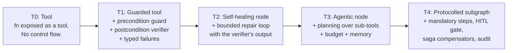

Two opinions about this ladder:

- **T1 should be free and automatic.** If a function has type hints and raises typed exceptions, `function2agent` can generate the guard, the verifier, and the failure edges with no user input. That is the highest-value thing the project can do, and it requires no LLM at runtime.
- **T4 should require explicit declaration.** Mandatory ordering, human gates, and compensators cannot be inferred from a signature. They are policy. Make the user write them, and make them *data* (see §11.4) so they can be diffed and reviewed.

### 11.3 Where the loop goes

The default promotion should be a **verifier-repair loop**, not a ReAct loop:

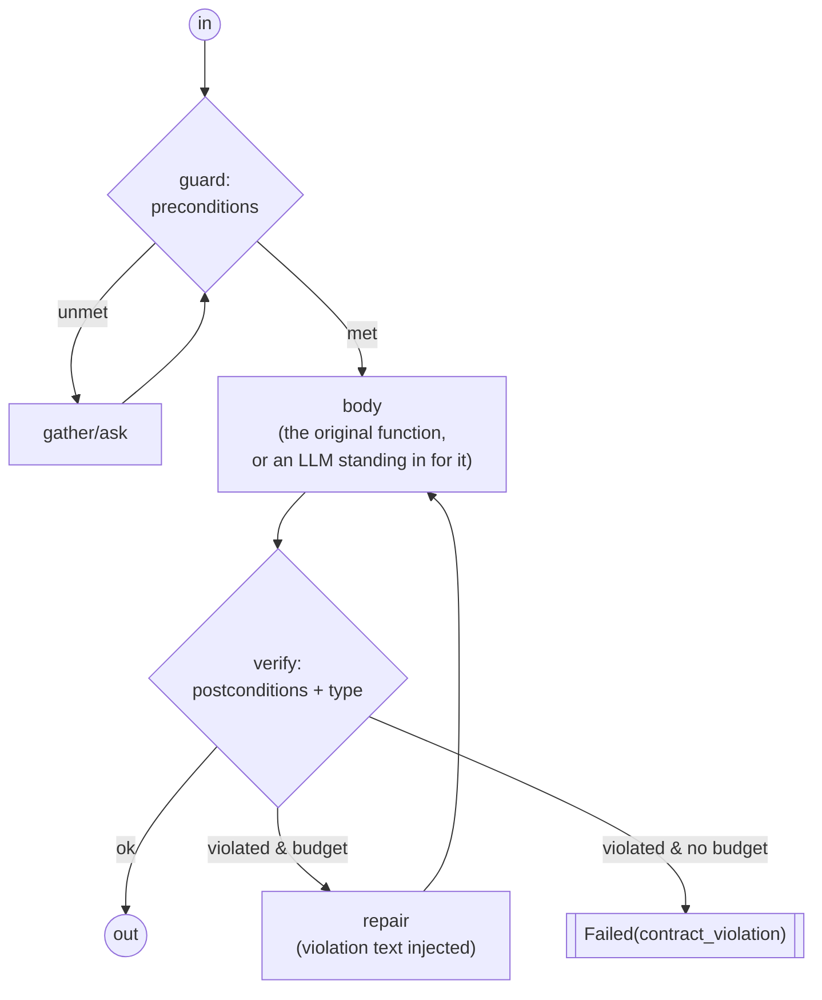

This is the shape that respects §7.1: the repair loop is driven by a *programmatic* verifier derived from the function's own type signature and postconditions, not by an LLM self-critique. That's a genuine structural advantage of the "start from a function" premise — **you get a free external verifier that most agent frameworks have to invent.** I'd lead with that.

> **Confirmed and priced, 2026-08-02.** The claim was written as an argument and it now has a measurement behind it: an input-shape verifier is buildable on this class of target with high confidence, and a response-shape verifier for the roughly three quarters of endpoints where any response shape is declared ([finding 007](../specs/001-discovery-validation/findings/007-contract-extraction.md)). **Two amendments to "free."** The verifier is free only where the derivation is *checked* — the same experiment showed a derived contract can be fluent, plausible, and wrong about every field name with nothing in the output indicating it, so the check against an independent description of the interface is part of the cost, not an optional refinement. And the `Failed(contract_violation)` edge in the diagram above assumes a failure taxonomy the source only half-supplies: exceptions are recoverable for 53.6% of endpoints from the handler body and 71.0% one hop down, and no authority exists to check even those against. **Only 28 of 69 endpoints (40.6%) yielded all three components** — agreeing parameters, an agreeing return type, and at least one identified exception — so the fully-wired shape above is available for two endpoints in five on the best-case target measured so far.

### 11.4 Represent topology as data

For everything in [04](./04-self-improving-agents.md) to work — A/B-ing topologies, rolling back a bad change, letting an optimizer propose a new edge — the graph must be **serializable, diffable, and content-addressed**:

```yaml
graph: order_fulfillment
version: 7
content_hash: sha256:9f2c…
nodes:
  reserve_inventory:
    fn: inventory.reserve
    reads: [order_id, items]
    writes: [reservation_id]
    idempotency_key: "reserve:{order_id}"
    compensator: inventory.release
  charge_card:
    fn: payments.charge
    irreversible: true
    requires_approval_above_usd: 500
edges:
  - [START, validate_order]
  - [validate_order, reserve_inventory, {when: "valid"}]
  - [validate_order, reject, {when: "invalid"}]
invariants:
  - "charge_card is unreachable without validate_order"
  - "every irreversible node is preceded by an approval node"
```

The `invariants` block is the important one. It's a machine-checkable safety property list that runs as a unit test on every topology change — whether that change comes from a human PR or from an optimizer. Without it, automated topology modification is not something you can responsibly ship.

### 11.5 A worked promotion

To make the mapping concrete, take an ordinary function with a real protocol hiding in it:

```python
class InsufficientFunds(Exception): ...
class VendorUnavailable(Exception): ...   # transient

def issue_refund(
    order_id: str,
    amount_usd: Decimal,          # must be > 0 and <= order total
    reason: str,
) -> RefundReceipt:
    """Refund a customer. Requires the order to exist and be refundable.
    Refunds above $500 require supervisor approval.
    Raises InsufficientFunds if the merchant balance is short.
    Raises VendorUnavailable on payment-processor errors (retryable).
    Postcondition: order.refunded_total increases by exactly amount_usd.
    """
```

Everything needed to build the graph is already in that signature and docstring. Nothing is invented:

| Source | Derived artifact |
|---|---|
| `order_id: str`, `amount_usd: Decimal` | Input channel schema; a guard node that fails fast on a malformed request |
| "must be > 0 and <= order total" | Precondition predicate → guard edge to a `gather_order` node |
| "requires the order to be refundable" | Precondition requiring an upstream lookup → **a mandatory ordering constraint** |
| "above $500 require supervisor approval" | A conditional edge into `interrupt()` — a human gate on a threshold |
| `VendorUnavailable` (documented retryable) | Retry edge with backoff; **counts against the shared budget** |
| `InsufficientFunds` (semantic) | Typed terminal `Failed(insufficient_funds)` — *not* a retry |
| `-> RefundReceipt` | Postcondition verifier: does the returned object typecheck? |
| "refunded_total increases by exactly amount_usd" | **State verification** — the strongest check available, and the reason this promotion is worth doing |
| Money moves | Irreversible node ⇒ needs an idempotency key and a compensator declaration |

Which compiles to:

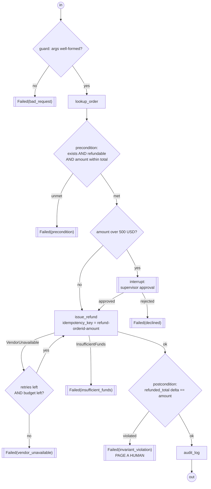

Four things to notice, because they are the whole argument of this document in one picture:

1. **`issue_refund` is unreachable without `lookup_order` and the precondition check.** Not because a prompt says so — because there is no edge.
2. **The $500 approval gate is topology, not policy text.** An LLM caller cannot talk its way past it, because it never gets a vote.
3. **Retry and failure are structurally distinct.** `VendorUnavailable` loops; `InsufficientFunds` terminates. Conflating them (the default behavior of a naive agent loop) would burn budget retrying a condition that will never change.
4. **The postcondition failure path is not a retry — it pages a human.** If money moved and the invariant does not hold, you are in the worst state the system can be in, and the correct response is to stop.

None of this required an LLM to design. It fell out of a type signature and a docstring, mechanically. That is the promotion pipeline `function2agent` should ship.

> **Two qualifications from 2026-08-02, and the worked example above quietly assumes both away.** First, **the docstring half of "a type signature and a docstring" is currently the wrong text**: the index's `docstring` column is populated with section banners and stray comments rather than the function's docstring, and only 1 of 355 populated values is real ([finding 004](../specs/001-discovery-validation/findings/004-recall-against-authoritative-key.md) §7). Second, **the signature half needs a validity check the example does not show.** The `Money` and `RefundResult` types in the worked example are read straight off the annotation, which is exactly the reading that produced 15 of 69 wrong-on-the-wire contracts when one alias-resolution rule was disabled ([finding 007](../specs/001-discovery-validation/findings/007-contract-extraction.md) §4). Neither qualification touches the *shape* of the promotion — the graph the example derives is still the right graph — but "mechanically" should be read as "mechanically, from validated inputs, with a provenance marker on each derived field," and where validation is impossible the emitted contract is provisional.

The comparison worth internalizing: the same function handed to a bare ReAct agent as a tool gives you *none* of it. The model may call `issue_refund` before looking up the order, retry `InsufficientFunds` five times, skip the approval gate when the user is insistent, and report success without checking that the balance actually changed. Every one of those is a real, observed failure class, and every one is eliminated by topology rather than by a better prompt.

### 11.6 Three concrete recommendations

1. **Default to the loop; make the graph opt-in via declared constraints.** Don't make every promoted function a graph. Make `function2agent` generate a graph *only* when the user declares an ordering constraint, a mandatory step, a human gate, or a compensator — i.e., when there's a protocol to enforce. Otherwise emit a tool and a loop.
2. **Derive the verifier from the signature; never ship an LLM self-critique as the default critic.** The evidence in §7.1 is strong enough that shipping a naive reflection loop as a default would make users' agents worse. Types, postconditions, and exception classes are the external signal, and you already have them.
3. **Make topology data from day one, with checkable invariants.** Content-addressed, versioned, diffable topologies with an invariant list. This costs little now and is a prerequisite for everything in the self-improvement document.

---

## 12. Open questions and things I could not verify

Flagging these honestly:

- **LangGraph `durability` default.** The Python `astream` reference documents the default as `"async"`; a separate persistence guide describes `"sync"` as the default at compile time. These may reflect different layers (compile-time vs. per-call) or a docs lag. **Verify against your installed version.**
- **ADK graph-workflow stability.** ADK 2.6.1 is current, and graph workflows landed in 2.0.0 (Python/Go). Third-party commentary from earlier in 2026 described ADK 2.0 as alpha with breaking changes expected; whether that's still true at 2.6.1 I could not establish. The documented limitations (no live streaming) are from current docs and are real. **Partially resolved 2026-08-02** ([finding 006](../specs/001-discovery-validation/findings/006-graph-loop-primitives.md)): the graph tier at 2.6.1 runs, persists and resumes across a real `SIGKILL`, so it is not alpha in the sense of unusable. The sharper finding is narrower — the resumability machinery specifically (`ResumabilityConfig`, and the `end_of_agent` marker gated on it) is decorated `@experimental` and defaults to off, and `Workflow._run_impl` still carries `# TODO: resume from checkpoint event.` So the surface is stable and the one feature a production deployment would have to depend on is not. Pin the version and re-verify the resumability path on every upgrade.
- **ADK dynamic workflows (`ctx.run_node()`).** Described in §6.2 as having automatic checkpointing. **Still unmeasured as of 2026-08-02** — [finding 006](../specs/001-discovery-validation/findings/006-graph-loop-primitives.md) exercised only the graph tier and explicitly declined to claim anything about this one. If the dynamic tier checkpoints at a finer granularity than node boundaries, it would materially change the 1–1.5 week journaling estimate in §6.3, so it is worth a short probe before that estimate is committed to a schedule.
- **Burr's trajectory.** The `burr` PyPI package now redirects to `apache-burr` (0.42.0). I did not verify the health of the Apache incubation or release cadence. Diligence before adopting.
- **HierFlow ([2607.21609](https://arxiv.org/abs/2607.21609))** and other very recent topology-search work are preprints from within the last two months; I have no independent replication of their numbers. Treat as directionally interesting, not as settled.
- **"Agent framework inside, durable engine outside"** is the pattern I see most consistently recommended in 2026 vendor and practitioner writing. It is architecturally sound, but note that most sources arguing for it have a commercial interest in durable execution. The technical claim (LangGraph doesn't checkpoint inside a node) is verifiable from LangGraph's own docs and is not disputed.
- **Multi-agent supervisor topologies.** I have strong priors that these are overused, based on the token-cost and context-loss argument, but I did not find a clean 2026 controlled study isolating supervisor-vs-single-agent on matched compute. Treat §5.2's skepticism as an engineering opinion, not a cited result.

---

## 13. Sources

**Frameworks and documentation** (all accessed 2026-08-02)
- LangGraph graph API — https://docs.langchain.com/oss/python/langgraph/graph-api
- LangGraph interrupts — https://docs.langchain.com/oss/python/langgraph/interrupts
- LangGraph `interrupt` reference — https://reference.langchain.com/python/langgraph/types/interrupt
- LangGraph `Pregel.astream` reference (durability modes) — https://reference.langchain.com/python/langgraph/pregel/main/Pregel/astream
- LangGraph checkpointers / durability modes — https://docs.langchain.com/oss/javascript/langgraph/checkpointers
- Google ADK — graph-based agent workflows — https://adk.dev/graphs/
- Google ADK — template workflow agents (Sequential/Parallel/Loop) — https://github.com/google/adk-docs/blob/main/docs/agents/workflow-agents/index.md
- Google ADK — parallel workflow — https://adk.dev/agents/workflow-agents/parallel-agents/
- LlamaIndex Workflows (PyPI `llama-index-workflows` 2.22.2) — https://pypi.org/project/llama-index-workflows/
- Anthropic Agent Skills / progressive disclosure — https://www.anthropic.com/engineering/equipping-agents-for-the-real-world-with-agent-skills

**Version data** — retrieved from PyPI JSON API and npm registry, 2026-08-02: `langgraph` 1.2.10, `langgraph-checkpoint` 4.1.1, `@langchain/langgraph` 1.4.8, `google-adk` 2.6.1, `llama-index-core` 0.14.23, `llama-index-workflows` 2.22.2, `pydantic-graph` 2.22.0, `apache-burr` 0.42.0, `temporalio` 1.31.0, `restate-sdk` 1.0.3.

**Papers**
- Yao et al., *Tree of Thoughts: Deliberate Problem Solving with Large Language Models*, arXiv:2305.10601 (May 2023) — https://arxiv.org/abs/2305.10601 — token-cost figures in Appendix B.3
- Huang et al., *Large Language Models Cannot Self-Correct Reasoning Yet*, arXiv:2310.01798 (Oct 2023; ICLR 2024) — https://arxiv.org/abs/2310.01798
- *Decomposing LLM Self-Correction: The Accuracy-Correction Paradox and Error Depth Hypothesis*, arXiv:2601.00828 (Jan 2026) — https://arxiv.org/abs/2601.00828
- Kumar et al., *SCoRe: Training Language Models to Self-Correct via Reinforcement Learning*, arXiv:2409.12917 (Sep 2024; ICLR 2025) — https://arxiv.org/abs/2409.12917
- *The Cost of Dynamic Reasoning: Demystifying AI Agents and Test-Time Scaling from an AI Infrastructure Perspective*, arXiv:2506.04301 — https://arxiv.org/abs/2506.04301
- *Beyond Fixed Budgets: Characterizing the Inelasticity and Limitations of Tree-of-Thought Reasoning Strategies*, arXiv:2606.20599 (Jun 2026) — https://arxiv.org/abs/2606.20599
- *Chain-in-Tree: Back to Sequential Reasoning in LLM Tree Search*, ACL Findings 2026 — https://aclanthology.org/2026.findings-acl.214.pdf
- *Domain-Specialized Tree of Thought through Plug-and-Play Predictors*, arXiv:2603.20267 (Mar 2026) — https://arxiv.org/abs/2603.20267
- Xu et al., *Inside the Unfair Judge: A Mechanistic Interpretability Account of LLM-as-Judge Bias*, arXiv:2607.11871 (Jul 2026) — https://arxiv.org/abs/2607.11871
- *Quantifying and Mitigating Self-Preference Bias of LLM Judges*, arXiv:2604.22891 (Apr 2026) — https://arxiv.org/abs/2604.22891
- *From Confident Closing to Silent Failure: Characterizing False Success in LLM Agents*, arXiv:2606.09863 (Jun 2026) — https://arxiv.org/abs/2606.09863
- Zhang et al., *AFlow: Automating Agentic Workflow Generation*, arXiv:2410.10762 (ICLR 2025 Oral) — https://arxiv.org/abs/2410.10762
- *Coupled Hierarchical Search over Topology and Execution for Agentic Workflow Synthesis (HierFlow)*, arXiv:2607.21609 (Jul 2026) — https://arxiv.org/abs/2607.21609

**Practitioner analysis** (lower evidentiary weight; used for ecosystem shape, not for factual claims)
- *Temporal vs Inngest vs Restate: Durable Execution for Long-Running Agents in 2026* — https://dreaming.press/posts/temporal-vs-inngest-vs-restate-durable-agents.html
- *LlamaIndex Workflows vs LangGraph: Event-Driven vs Graph Agent Orchestration* — https://dreaming.press/posts/llamaindex-workflows-vs-langgraph.html
- *ADK 2.0 vs LangGraph vs LlamaIndex Workflows: A Deep Technical Comparison* — https://www.linkedin.com/pulse/adk-20-vs-langgraph-llamaindex-workflows-deep-jin-tan-ruan-x6cie

---

*Companion documents: 01 (agent anatomy) and 02 (harnesses) in this directory; [04 — self-improving agents](./04-self-improving-agents.md).*
