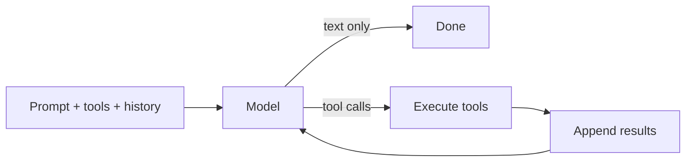

# 05 — Frontier Lab Agent Definitions: Anthropic, OpenAI, Google, xAI

**Last researched: 2026-08-02**

Scope: how each of the four frontier labs defines "agent," how that definition is (or is not) enforced by their shipping API surface, and which of the differences actually constrain a system like `function2agent` that owns its own agent anatomy.

---

## TL;DR — Key takeaways

> 1. **All four labs now agree on the same core loop.** Model → tool call → tool result → model, repeat until no tool call. Nobody disputes this. The definitional arguments are about what sits *around* the loop.
> 2. **The only lab that draws a hard definitional line is Anthropic** (workflows are orchestrated by *your* code; agents are orchestrated by *the model*). OpenAI, Google, and xAI all use "agent" loosely enough to include things Anthropic would call workflows.
> 3. **xAI publishes no formal definition of "agent" at all.** They ship agent *products* (Agent Tools API, Grok Build, Voice Agent Builder) and describe the loop procedurally. Treat any "xAI's definition" claim — including some in this doc's comparison tables — as inference from product behavior, not from a stated position.
> 4. **Interoperability won in 2025–2026.** MCP is under the Linux Foundation's Agentic AI Foundation with maintainers from Anthropic, OpenAI, Google, Microsoft, and AWS. `AGENTS.md` is an AAIF project. The `SKILL.md` Agent Skills format is read by ~40 tools including Codex, Gemini CLI, Copilot, and Grok Build. The *packaging formats* have converged even though the *SDKs* have not.
> 5. **The genuinely load-bearing divergence is not vocabulary, it is the execution locus of tools and state.** Server-side tools (xAI's most aggressively, then OpenAI/Google) execute *inside the provider's turn*. Your harness never sees them, cannot gate them, and in xAI's case cannot even read their outputs. That breaks permission and human-in-the-loop abstractions in a way no amount of adapter code fixes.
> 6. **The second genuinely load-bearing divergence is opaque reasoning state.** Anthropic thinking blocks, Gemini thought signatures, OpenAI reasoning items, xAI `use_encrypted_content`. Every provider requires you to round-trip a blob you cannot inspect. Any provider abstraction must model "opaque continuation state" as a first-class concept or it will silently degrade multi-turn tool use.
> 7. **"Subagent" and "handoff" are not synonyms and this is the one vocabulary difference with teeth.** A subagent forks context and returns a summary. A handoff transfers ownership of the *same* conversation. Different context topology, different cost curve, different failure modes.
> 8. **Definitions track commercial positioning almost perfectly.** Anthropic's definition is terminal-shaped (it is Claude Code's loop, extracted). Google's is enterprise-governance-shaped (Vertex AI was literally renamed "Agent Platform"). OpenAI's is deliberately broad and has already churned once (AgentKit's visual Agent Builder shipped Oct 2025, deprecated Jun 2026). xAI's is cost- and X-data-shaped.
> 9. **Model-level agentic differences are larger than API-level ones, and they are harness-dependent.** The same model scores 64.7% or 77.3% on Terminal-Bench 2.0 depending on which harness runs it — a 12.6-point swing on identical weights. Treat any single benchmark number as a property of the (model, harness, effort) triple.
> 10. **For `function2agent`: ignore the definitional debate, steal Anthropic's conceptual model, and abstract at the message/tool layer only.** Do not try to abstract hosted tools, sandboxes, or multi-agent primitives. Reimplement those; you control your own anatomy anyway.

---

## 0. Framing: what is actually being argued about

By mid-2026 the mechanical definition of an agent is settled and boring. Every lab ships the same loop:



What the labs actually disagree about is four questions layered on top:

| Question | Why it matters |
| --- | --- |
| **Who owns control flow** — your code or the model? | Determines whether the thing is called a "workflow" or an "agent." Almost purely definitional. |
| **Where does the loop run** — your process, or theirs? | Determines whether you can inspect, gate, and resume it. Highly consequential. |
| **Where does state live** — your storage, or theirs? | Determines portability, replay, and audit. Consequential. |
| **Where do tools execute** — your process, or theirs? | Determines whether permissions and HITL are even expressible. Most consequential. |

Anthropic answers question 1 loudly and questions 2–4 flexibly. Google answers 2–4 loudly (enterprise governance) and 1 permissively. OpenAI has answered all four differently at least twice. xAI answers only 2–4, by shipping, and never answers 1.

---

## 1. Each lab's stated definition

### 1.1 Anthropic

**The canonical statement** is *Building Effective AI Agents* (Anthropic Engineering, December 2024, still the linked-to canonical reference in 2026):

> "'Agent' can be defined in several ways... At Anthropic, we categorize all these variations as **agentic systems**, but draw an important architectural distinction between workflows and agents:
> - **Workflows** are systems where LLMs and tools are orchestrated through predefined code paths.
> - **Agents**, on the other hand, are systems where LLMs dynamically direct their own processes and tool usage, maintaining control over how they accomplish tasks."
>
> — <https://www.anthropic.com/engineering/building-effective-agents>

Two things are notable and often missed:

1. **"Agentic system" is the umbrella; "agent" is a strict subset.** Anthropic explicitly refuses to let "agent" mean "anything with an LLM in it."
2. **The post's actual recommendation is to not build agents.** "We recommend finding the simplest solution possible... This might mean not building agentic systems at all." The definitional rigor exists to make *not* building an agent a legible choice.

**Has the definition changed?** The architectural line has held. What has changed is the framing around it:

- A widely reported internal-ish refinement (Barry Zhang, AI Engineer Summit) adds a third tier below workflow — **task** (a single model call) — giving *task → workflow → agent*, with the operative test being "who owns the plumbing." I could only verify this through secondary reporting (Shelly Palmer, April 2026), not an Anthropic-published artifact; treat the trichotomy as directionally accurate rather than officially canonical. <https://shellypalmer.com/2026/04/how-anthropic-thinks-about-agents-workflows-and-tasks/>
- The **product** definition has narrowed and become concrete. The Claude Agent SDK docs say: *"An agent is an application that completes a task by planning its own steps and calling tools that read files, run commands, or edit code."* (<https://code.claude.com/docs/en/agent-sdk/overview>). Note the drift: the 2024 essay's definition is architecture-neutral; the 2026 SDK's definition is *filesystem- and shell-shaped*. That is Claude Code's definition, not a general one.
- A newer, more sophisticated frame appears in *Scaling Managed Agents: Decoupling the brain from the hands* (Anthropic Engineering, 2026): an agent decomposes into **brain** (model), **hands** (sandbox/tools), and **session** (durable event log). The essay's central claim is meta: *"harnesses encode assumptions about what Claude can't do on its own... those assumptions need to be frequently questioned because they can go stale as models improve."* <https://www.anthropic.com/engineering/managed-agents>

**Where they draw the autonomy line.** At control flow, and nowhere else. Anthropic is comfortable calling a two-tool, three-turn loop an agent. They are not comfortable calling a five-stage LLM pipeline an agent, no matter how many models it contains.

**What they explicitly say is *not* an agent:** prompt chaining, routing, parallelization/sectioning, orchestrator-workers with a fixed decomposition, and evaluator-optimizer loops. All five are enumerated in *Building Effective Agents* as **workflow** patterns. This is the most useful negative definition any lab publishes — note that "orchestrator-workers," which most vendors market as multi-agent, is on Anthropic's *workflow* side of the line.

**Philosophical stance:** minimalism, explicitly. "Give the model a good loop, good tools, and a good environment; delete scaffolding as models improve." The harness posts document them *removing* machinery (context resets) once Opus 4.5/4.6 no longer needed it. <https://www.anthropic.com/engineering/harness-design-long-running-apps>

---

### 1.2 OpenAI

**The current canonical statement**, from the restructured developer docs:

> "Agents are applications that plan, call tools, collaborate across specialists, and keep enough state to complete multi-step work."
>
> — <https://developers.openai.com/api/docs/guides/agents>

And at the SDK level:

> "An agent is the core unit of an SDK-based workflow. It packages a model, instructions, and optional runtime behavior such as tools, guardrails, MCP servers, handoffs, and structured outputs."
>
> — <https://developers.openai.com/api/docs/guides/agents/define-agents>

**This is a deliberately broader definition than Anthropic's**, and the giveaway is the phrase "SDK-based *workflow*." OpenAI uses "agent" for the *node* and "workflow" for the *composition*. That is the exact inverse of Anthropic's usage, where "workflow" names the whole system and implies the model is *not* in control. Same two words, opposite assignments.

**Has the definition changed? Substantially, and more than once.**

| Era | Primitive | Definition emphasis |
| --- | --- | --- |
| Assistants API (beta, 2023–2026) | `Assistant` + `Thread` + `Run` | A persistent, server-side configured assistant with attached tools and files. Never reached GA. **Shuts down 2026-08-26.** |
| Responses API (Mar 2025 →) | `Response` (input items → output items) | "A model response." Loop is explicitly yours. |
| Agents SDK (Mar 2025 →) | `Agent` + `Runner` | An LLM configured with instructions/tools; the SDK runs the loop. |
| AgentKit / Agent Builder (Oct 2025 – Nov 2026) | Visual workflow graph | An agent is a node in a drag-and-drop canvas. **Deprecated Jun 2026; shuts down 2026-11-30.** |
| Sandbox agents (2026, beta) | `SandboxAgent` + `Manifest` | An agent that owns a Unix-like workspace. |

The Agent Builder episode is worth stating plainly: OpenAI shipped a visual multi-agent workflow canvas at DevDay 2025, and announced on **June 3, 2026** that it and Evals would be withdrawn, steering users back to the code-first Agents SDK or to natural-language "Workspace Agents in ChatGPT." <https://openai.com/index/introducing-agentkit/> That is roughly eight months from launch to deprecation notice for a product whose whole premise was that agents are graphs you draw. Whatever OpenAI's definition of an agent is, "a visual workflow graph" is no longer it.

**Where they draw the autonomy line.** They largely do not. The docs draw an *ergonomics* line instead: *"Use the Responses API when you want to own the loop. Use the Agents SDK when you want the SDK to run it."* The Responses-vs-SDK comparison table names the core abstraction of each as "a model response" vs "an agent run" — that is the closest thing to a definitional boundary OpenAI publishes, and it is about who calls the loop, not about who decides the next step.

**What they say is not an agent:** effectively, single-shot completions. Their guidance is "if your workflow only needs a short model response and no persistent workspace, call the Responses API directly." That is a build-advice line, not a taxonomic one.

**Philosophical stance:** "very small set of primitives," per the SDK homepage — Agents, handoffs/agents-as-tools, guardrails, sessions, tracing. In practice OpenAI ships *more* scaffolding than Anthropic (typed guardrails, resumable approval flows, first-class tracing, a manifest-driven sandbox contract) while claiming fewer abstractions. The claim and the surface area disagree.

---

### 1.3 Google

Google publishes the most definitions and the least consistency, because four different orgs are defining the word.

**Classical/academic (Google Cloud generative AI glossary):**

> "In the context of generative AI, an agent is software that autonomously plans and executes a series of actions in pursuit of a goal, potentially in novel situations."
>
> — <https://docs.cloud.google.com/gemini-enterprise-agent-platform/resources/glossary>

**The Agents whitepaper (Google, widely circulated):**

> "In its most fundamental form, a Generative AI agent can be defined as an application that attempts to achieve a goal by observing the world and acting upon it using the tools that it has at its disposal. Agents are autonomous and can act independently of human intervention."
>
> — <https://ia600601.us.archive.org/15/items/google-ai-agents-whitepaper/Newwhitepaper_Agents.pdf>

**The enterprise/marketing definition (Cloud AI Agent Trends 2026 report)** — note the hedge:

> "Agents are systems that combine the intelligence of advanced AI models with access to tools so they can take actions on your behalf, **under your control**." ... "An agentic system is a digital assembly line—a **human-guided**, multi-step workflow that orchestrates multiple agents to run a business process end to end."
>
> — <https://services.google.com/fh/files/misc/google_cloud_ai_agent_trends_2026_report.pdf>

The whitepaper says "independently of human intervention." The trends report says "under your control" and "human-guided." Those are the same company, roughly the same year, drawing the autonomy line in opposite places. The difference is audience: researchers vs. buyers.

**The engineering definition (ADK):**

> "In Agent Development Kit (ADK), an **agent** is a self-contained execution unit designed to act autonomously to achieve specific goals."
>
> — <https://github.com/google/adk-docs/blob/main/docs/agents/index.md>

ADK then splits agents into three kinds, and this is the crucial structural point: **in Google's taxonomy, a deterministic workflow *is* an agent.**

| ADK agent type | Core engine | Determinism |
| --- | --- | --- |
| `LlmAgent` / `Agent` | LLM | Non-deterministic |
| Workflow agents (`SequentialAgent`, `ParallelAgent`, `LoopAgent`) | Predefined logic, **no LLM in the control flow** | Deterministic |
| Custom (`BaseAgent` subclass) | Your code | Either |

Anthropic would call the second row "not an agent." Google calls it `SequentialAgent`. This is the single sharpest definitional collision in the field — and, as argued in §3, it is almost entirely cosmetic.

**Where they draw the autonomy line.** They don't draw one; they subsume it. Everything with a `run()` is an agent, and autonomy is a *property* an agent may or may not have rather than a membership criterion.

**Philosophical stance:** governance-first composition. ADK 2.0 makes the graph the substrate (`BaseAgent` now subclasses `BaseNode`, per the 2.0 migration notes), and the Gemini Enterprise Agent Platform wraps everything in Agent Identity, Agent Gateway, Agent Registry, Agent Observability, Agent Simulation, and Agent Evaluation. Google's implied position: an agent is a *managed enterprise workload*, and the interesting engineering is the control plane, not the loop.

---

### 1.4 xAI

**xAI does not publish a definition of "agent."** I searched their docs, model pages, and news posts and could not find one. This is a verified absence, not an oversight in my research — and the honest characterization is that xAI's position on what an agent *is* must be inferred from what they ship.

What they do publish is procedural. The Agent Tools API launch describes tools that "allow Grok 4.1 Fast to operate as a fully autonomous agent," and the tools overview describes the loop as steps rather than a category:

> "1. **Analyzes the query**... 2. **Decides what to do next**: Make a tool call, or provide a final answer. 3. **Executes the tool**... 4. **Processes results** and continues until sufficient information is gathered. 5. **Returns the final response** with citations."
>
> — <https://docs.x.ai/developers/tools/overview>

The nearest thing to a positional statement is the framing that server-side tools mean "developers no longer need to manage API keys, rate limits, sandboxes, or retrieval pipelines. Grok decides when and how to use them." <https://x.ai/news/grok-4-1-fast>

**Inferred stance:** an agent is Grok plus xAI-hosted tools, running turns until done, billed per tool invocation. The unit of value is the *tool*, not the loop and not the orchestration. Consistent with this, xAI is the only lab that meters agents by tool call ($5/1k web searches, $5/1k code executions, $2.50/1k collections searches) rather than purely by token. <https://docs.x.ai/developers/pricing>

**Where they draw the autonomy line.** Nowhere, publicly.

**What they say is not an agent.** Nothing, publicly.

**Caveat, stated up front:** every xAI row in the comparison tables below is inference from product surface. Do not cite this document as "xAI's definition."

---

### 1.5 Vocabulary mapping

The same concept has four names. This table is the most immediately practical artifact in the document.

| Concept | Anthropic | OpenAI | Google | xAI |
| --- | --- | --- | --- | --- |
| Umbrella category | Agentic system | Agentic workflow / agent application | Agentic system | *(none published)* |
| Model-driven control flow | **Agent** | Agent | `LlmAgent` | *(implicit)* |
| Code-driven control flow | **Workflow** *(explicitly not an agent)* | Workflow *(composition of agents)* | Workflow agent / `Workflow` graph | *(n/a)* |
| The runtime that hosts the loop | **Harness** | **Harness** *(same word, Sandbox agents docs)* | Agent Runtime / Antigravity runtime | *(none named)* |
| One model↔tool round trip | Turn | Turn | Step (Interactions API) | Turn |
| Delegate to a fresh context | **Subagent** (`Agent` tool) | Agent-as-tool; also `ultra` mode subagents | `sub_agents`, `RemoteA2aAgent` | Sub-agent (multi-agent model); Grok Build subagents |
| Transfer conversation ownership | *(no equivalent)* | **Handoff** | Coordinator/transfer patterns | *(no equivalent)* |
| Packaged procedural knowledge | **Skill** (`SKILL.md`) | Skill (`.agents/skills`) | Skill (Gemini CLI); ADK tools | Skill (`.grok/skills`, Claude-compatible) |
| Runtime tool connection | MCP | MCP (local + hosted) | MCP; A2A for agent↔agent | MCP (remote only) |
| Input/output validation | Hooks + permissions | **Guardrails** + approvals | Callbacks; Model Armor; Agent Gateway | Guardrails *(Voice Agent Builder only)* |
| Durable conversation object | **Session** (Managed Agents) | Conversation / `RunState` | Interaction chain (`previous_interaction_id`); Memory Bank | Stored messages (`store_messages`) |
| Isolated compute | Environment (Managed Agents) | Sandbox (`SandboxAgent` + `Manifest`) | Agent Runtime | Code interpreter *(tool only)* |
| Project instruction file | `CLAUDE.md` | `AGENTS.md` | `GEMINI.md` / `AGENTS.md` | `AGENTS.md` + `CLAUDE.md` *(both)* |

Two collisions worth flagging:

- **"Workflow" is inverted** between Anthropic and OpenAI/Google. Anthropic: workflow = the model is *not* in charge. OpenAI: workflow = a composition of agents. Google: workflow = a deterministic graph that is itself an agent. If you write internal docs, pick one and define it.
- **"Managed Agents" now names two different products.** Anthropic's Managed Agents is a hosted sandbox + session runtime (beta header `managed-agents-2026-04-01`). Google's "Managed Agents" are first-class agent IDs in the Gemini Interactions API (e.g. `antigravity-preview-05-2026`). Unrelated.

---

## 2. How the definition shows up in the product surface

This section is weighted heaviest because it is where a definition either binds or doesn't.

### 2.1 Anthropic

**Surfaces (2026):**

| Surface | What it is | Status |
| --- | --- | --- |
| Messages API | Stateless request/response with tool use | GA |
| Claude Agent SDK (Python/TS) | Claude Code's loop as a library, in *your* process | GA |
| Claude Code | The reference harness / CLI | GA |
| Agent Skills | `SKILL.md` filesystem convention | Open standard, Dec 18 2025 |
| MCP | Tool/data connection protocol | Donated to AAIF/Linux Foundation, Dec 2025 |
| **Managed Agents** | Hosted agent + environment + session runtime | **Beta** (`managed-agents-2026-04-01`) |

**Fundamental primitive: the loop, and increasingly the session.**

The Agent SDK's definition of a turn is precise and worth quoting because it differs subtly from everyone else's:

> "A turn is one round trip inside the loop: Claude produces output that includes tool calls, the SDK executes those tools, and the results feed back to Claude automatically. This happens **without yielding control back to your code**. Turns continue until Claude produces output with no tool calls."
>
> — <https://code.claude.com/docs/en/agent-sdk/agent-loop>

Termination is `max_turns` (counts tool-use turns) or `max_budget_usd`. The budget cap is enforced across subagents, which is a small detail with real operational value.

Managed Agents adds a second primitive on top: **agent** (`POST /v1/agents`, persisted and versioned: model, system prompt, tools, MCP servers, skills) and **session** (`POST /v1/sessions`, references a pre-created agent + environment, produces an event stream). Sessions cannot exist without an agent — model/system/tools live on the agent object, never on the session. Mid-session `sessions.update` can override tools/MCP/vaults as a *session-local* change that does not create a new agent version.

**State model:** dual. Messages API and Agent SDK are client-owned (you hold the transcript). Managed Agents is server-owned, with `getEvents()` exposing positional slices of the session event log — described in the engineering post as letting "the brain interrogate context by selecting positional slices of the event stream."

**Tool semantics:** parallel tool calls, client-executed by default. Built-in SDK tools: `Read`, `Edit`, `Write`, `Glob`, `Grep`, `Bash`, `WebSearch`, `WebFetch`, `ToolSearch` (dynamic tool discovery instead of preloading), plus orchestration tools `Agent`, `Skill`, `AskUserQuestion`, `TaskCreate`, `TaskUpdate`. MCP support is the deepest of the four — they wrote it.

**Multi-agent: subagents only.** Each subagent gets a fresh context window; it does not see the parent's turns; only its final response returns to the parent as a tool result. There is no handoff primitive — Anthropic does not have a concept of transferring conversation ownership.

**Long-horizon / durability:** the strongest first-party toolkit of the four.

| Feature | Identifier | Notes |
| --- | --- | --- |
| Server-side compaction | `compact_20260112` | Beta header `compact-2026-01-12`; default trigger 150K input tokens, min 50K; `pause_after_compaction`, custom `instructions` |
| Tool-result clearing | `clear_tool_uses_20250919` | Default trigger 100K; `keep` (default 3), `exclude_tools`, `clear_tool_inputs` |
| Thinking clearing | `clear_thinking_20251015` | — |
| Memory tool | `memory_20250818` | **Client-implemented** file ops in a `/memories` dir |
| Sessions | Managed Agents | Run for hours; survive client disconnect; SSE replay |

Anthropic reports internal agentic-search evals where memory + context editing improved performance 39% over baseline, context editing alone 29%. <https://claude.com/blog/context-management>

**Safety/control framing:** mechanism, not policy. Permissions (`allowedTools`), lifecycle hooks (`PreToolUse`, `PostToolUse`, `Stop`, `SessionStart`, `SessionEnd`, `UserPromptSubmit`) that can intercept/modify/block tool calls in-process, sandboxed environments in Managed Agents, credential vaults, and budget caps. The stance is environment-layer containment over model-layer steering.

**Where the marketing and the API disagree:** the essay says "give the model a loop and good tools." The 2026 API ships versioned agent objects, environments, vaults, memory stores, deployments, deployment runs, and a session state machine. Anthropic's *rhetoric* is minimalist; their *platform* is now roughly as heavy as Google's, just with better-chosen primitives.

---

### 2.2 OpenAI

**Surfaces (2026):**

| Surface | What it is | Status |
| --- | --- | --- |
| Responses API | Input items → output items; you own the loop | GA, the strategic center |
| Conversations API | Server-side conversation state | GA (Aug 2025) |
| Agents SDK (Python/TS) | Runs the loop for you | GA |
| Sandbox agents | `SandboxAgent`, `Manifest`, capabilities | **Beta** |
| ChatKit | Embeddable agent chat UI | GA |
| Agent Builder | Visual workflow canvas | **Deprecated — shuts down 2026-11-30** |
| Assistants API | Legacy | **Shuts down 2026-08-26** |

**Fundamental primitive: contested — the *response* at the API layer, the *run* at the SDK layer.** OpenAI's own comparison table names them exactly that. This bifurcation is the defining characteristic of their surface: two coherent, non-overlapping mental models shipped side by side, with docs that tell you to pick one.

```python
# Responses API — you own the loop
resp = client.responses.create(
    model="gpt-5.6",
    input=[{"role": "user", "content": "..."}],
    tools=[...],
    previous_response_id=prior.id,   # or a conversation id
)
# you inspect resp.output, execute function calls, call again

# Agents SDK — the runner owns the loop
from agents import Agent, Runner
agent = Agent(name="Assistant", instructions="...", tools=[...], handoffs=[...])
result = Runner.run_sync(agent, "...")
print(result.final_output)
```

**State model: the most options, and therefore the most decisions.** Three strategies — manual history, `previous_response_id` chaining, or the Conversations API — plus SDK sessions and serializable `RunState` for resumable approvals. The Assistants migration is a clean map of the model shift: `Assistants → Prompts`, `Threads → Conversations`, `Runs → Responses`, `Run steps → Items`. Note that OpenAI provides **no automated Thread→Conversation migration tool**; you backfill.

**Tool semantics:** parallel calls, strict structured outputs, hosted platform tools, function tools, local and remote MCP, and `agents-as-tools`. The Sandbox agents docs draw the cleanest architectural boundary any lab has published:

> "The harness is the control plane around the model: it owns the agent loop, model calls, tool routing, handoffs, approvals, tracing, recovery, and run state. Compute is the sandbox execution plane... Keeping those boundaries separate lets your application keep sensitive control plane work in trusted infrastructure while the sandbox stays focused on provider-specific execution."
>
> — <https://developers.openai.com/api/docs/guides/agents/sandboxes>

That is the same brain/hands split Anthropic describes in *Scaling Managed Agents*, written independently, in the same year, with the same conclusion. Strong convergence signal.

Sandbox agents compose: `SandboxAgent` (agent + sandbox defaults), `Manifest` (fresh-workspace contract: files, dirs, git repos, S3/GCS/R2/Azure/Box mounts, env, users/groups), capabilities (`Shell`, `Filesystem`, `Skills`, `Memory`, `Compaction` — the first, second and last are on by default), a pluggable sandbox client (Unix-local, Docker, or hosted), and saved state (`RunState`, serialized session, snapshots).

**Multi-agent: the richest vocabulary, and the only lab with handoffs.**

- **Handoff** — delegate ownership of the conversation to a specialist. The reply comes from the new agent.
- **Agents-as-tools** — manager pattern; the caller stays in control and gets a tool result back. Functionally equivalent to an Anthropic subagent.
- `ultra` reasoning mode on GPT-5.6 runs four agents in parallel *at the model level*, which is a third, non-SDK form of multi-agent.

**Long-horizon:** `Compaction` capability, `Memory` capability (requires `Shell`), sandbox snapshots and resumable sessions, `RunState` serialization across approval pauses, and background/async patterns.

**Safety/control framing: typed and structural.** Input guardrails, output guardrails, tool guardrails, and *resumable* approval flows — the run pauses, serializes, and continues after a human decision. This is the best-designed HITL primitive of the four.

**Where marketing and API disagree:** "very few abstractions" is the SDK's headline claim. The current SDK surface includes agents, runners, sessions, handoffs, agents-as-tools, three guardrail classes, hooks, dynamic instructions, prompt objects, MCP configs, sandbox agents, manifests, capabilities, sandbox clients, run configs, run state, and snapshots. It is not a small surface. It is a *well-typed* one, which is a different virtue.

**Also worth stating:** OpenAI's churn rate is the highest of the four. Assistants (deprecated), Agent Builder (deprecated eight months after launch), reusable prompt objects (deprecating, per their own migration guide), Chat Completions (superseded by Responses). If you build on OpenAI, budget for migration work as a standing cost.

---

### 2.3 Google

**Surfaces (2026):**

| Surface | What it is | Status |
| --- | --- | --- |
| Gemini API `generateContent` | Stateless generation | GA, now described as legacy |
| **Gemini Interactions API** | Unified stateful endpoint for models *and* agents | **GA, June 2026 — the primary API** |
| ADK (Python, Go, TS, Java) | Code-first agent + workflow framework | ADK 2.0 |
| Antigravity SDK | Pre-built agent runtime you govern | Preview, pre-1.0 |
| Gemini Enterprise Agent Platform | The former Vertex AI, renamed and re-scoped | GA, announced 2026-04-22 |
| Agent Runtime | Managed deployment, multi-day agents, Memory Bank | GA |
| A2A | Agent-to-agent interop protocol | Open standard |

Google is the only lab offering **three distinct levels of loop ownership**, and they say so:

> "The Gemini API is stateless. You make an API call and get a response. You manage the entire loop. The Agent Development Kit sits one level up. With the ADK, you design the event loops... The Antigravity SDK is a pre-packaged runtime tightly integrated with Gemini. You don't build the agentic loop; you're given one. Your role is to govern it."
>
> — <https://dev.to/googleai/google-antigravity-sdk-the-developer-guide-4o8m> (Google-authored DEV post)

**Fundamental primitive: the graph, at the ADK layer; the interaction, at the API layer.**

ADK 2.0's migration notes state the change bluntly: *"In ADK 1.x, Agents were standalone executors. In ADK 2.0, the `BaseAgent` class now subclasses `BaseNode`. Agents are now evaluated as individual nodes within the new Workflow Graph engine."* Agents, tools, and functions are all nodes. Templated `SequentialAgent`/`ParallelAgent`/`LoopAgent` are superseded by declarative graph workflows and imperative dynamic workflows (`ctx.run_node`).

```python
from google.adk import Agent, Workflow

generate_fruit_agent  = Agent(name="generate_fruit_agent",  instruction="...")
generate_benefit_agent = Agent(name="generate_benefit_agent", instruction="...")

root_agent = Workflow(
    name="root_agent",
    edges=[("START", generate_fruit_agent, generate_benefit_agent)],
)
```

That is a materially different mental model from `Runner.run_sync(agent, prompt)` or `query(prompt=...)`. **Google is the only lab whose primary framework makes the graph, not the loop, the substrate.**

**State model: server-side by default — the biggest single API-level divergence.**

The Interactions API stores interactions by default (`store=true`) and continues conversations via `previous_interaction_id`. You can opt out with `store=false`, but doing so disables background execution *and* `previous_interaction_id`. Background execution (`background=true`) returns an interaction ID immediately and runs asynchronously through `in_progress → requires_action → completed | failed | cancelled`. <https://ai.google.dev/gemini-api/docs/background-execution>

Everyone else defaults to client-owned state and offers server-side as an opt-in. Google inverted it.

**Tool semantics:** parallel calls, structured output, server-side tools with **typed execution steps** (`google_search_call` / `google_search_result` appear in the step timeline rather than being collapsed into a `groundingMetadata` blob). This is the best observability story for hosted tools among the four — Google shows you what the server-side tool actually retrieved. MCP is supported across ADK, Antigravity, and Gemini CLI.

**Multi-agent: the only lab with a wire protocol.** A2A publishes an Agent Card at `/.well-known/agent-card.json` and exchanges JSON-RPC `message/send` / `tasks/get` with typed `TextPart` / `DataPart` message parts. ADK wraps a remote A2A service as a local sub-agent:

```python
from google.adk.agents import RemoteA2aAgent

remote_agent = RemoteA2aAgent(
    name="my_remote_agent",
    agent_card="http://example.com/agent/.well-known/agent-card.json",
    description="Handles specialized tasks.",
)
```

ADK 2.0 also adds a **Task API** for structured agent-to-agent delegation (multi-turn task mode, single-turn controlled output, HITL, task agents as workflow nodes) and a `Mode` field (`ModeChat` / `ModeSingleTurn` / `ModeTask`) controlling how an LLM agent behaves inside a graph.

**Long-horizon:** Agent Runtime supports agents that "run autonomously for days at a time," backed by Memory Bank for persistent long-term context, with sub-second cold starts. Background execution at the API layer. This is the strongest *managed* durability story of the four.

**Safety/control framing: enterprise governance, and it is not close.** Agent Identity (unique identity per agent for auditing), Agent Gateway ("air traffic control" for agent↔data interactions), Model Armor (prompt injection, tool poisoning, data leakage), Agent Registry, Agent Observability, Agent Simulation, Agent Evaluation. Antigravity adds a declarative safety-policy engine and read-only-by-default capabilities.

**Where marketing and API disagree:** the whitepaper says agents "act independently of human intervention"; the enterprise messaging says "under your control" and "human-guided"; and the platform's flagship features are identity, gateway, policy, and audit — i.e. the entire product is built on the premise that agents should *not* act independently. The engineering is honest; the whitepaper is aspirational.

---

### 2.4 xAI

**Surfaces (2026):**

| Surface | What it is | Status |
| --- | --- | --- |
| Chat Completions + Responses API | OpenAI-wire-compatible; `base_url=https://api.x.ai/v1` | GA |
| xAI SDK (Python, gRPC) | Native SDK | GA |
| **Agent Tools API** | Server-side hosted tools | GA |
| `grok-4.20-multi-agent` | Model-level multi-agent orchestration | Beta |
| Grok Build | Terminal coding agent (TUI / headless / ACP) | Early beta |
| Voice Agent Builder | No-code voice agents | GA |

**Fundamental primitive: the hosted tool.** xAI's agent story is the tool catalog, and the pricing page proves it — they are the only lab that bills per tool invocation:

| Tool | Cost / 1k calls |
| --- | --- |
| `web_search`, `x_search`, `code_execution` | $5 |
| `attachment_search` | $10 |
| `collections_search` / `file_search` | $2.50 |
| `view_image`, `view_x_video`, remote MCP | Token-based |

<https://docs.x.ai/developers/pricing>

**State model: two explicit options, both provider-shaped.**

- `store_messages=True` on the first request, then `previous_response_id` — full history (reasoning, server-side tool calls, tool responses) stored on xAI servers.
- `use_encrypted_content=True` — the same history returned to the client, with reasoning and tool responses **encrypted**. You hold it; you cannot read it.

There is no third option where you hold plaintext agentic state. This is the sharpest version of the opaque-state problem in the field.

**Tool semantics — and the critical asymmetry:**

> "Only the tool call invocations are shown — **server-side tool call outputs are not returned** in the API response. The agent uses these outputs internally to formulate its final response."
>
> — <https://docs.x.ai/developers/tools/tool-usage-details>

Billing distinguishes `server_side_tools_used` (all attempts) from `server_side_tool_usage` (successful, billable). `max_turns` caps **assistant turns, not individual tool calls** — the model may fire many tools in parallel within one turn. That differs from Anthropic's `max_turns` (tool-use turns) in ways that will bite you if you assume they are the same knob.

Client-side function calling works alongside server-side tools in hybrid mode — **except on the multi-agent model**, which supports built-in and remote MCP tools only.

**Multi-agent: model-level, not SDK-level.** `grok-4.20-multi-agent` launches a leader agent plus 4 sub-agents (low/medium reasoning effort) or 16 (high/xhigh). Only the leader's tool calls and final output are returned; all sub-agent state is encrypted and only surfaced via `use_encrypted_content`. There is no orchestration API — you cannot inspect, steer, or budget the sub-agents. This is the most opaque multi-agent implementation of the four, and also the least code you have to write.

**Long-horizon:** context compaction is documented for Grok 4.5; stateful conversation via `store_messages`. No sandbox-as-a-service, no session/environment objects, no memory API. Grok Build is a CLI, not a hosted runtime.

**Safety/control framing: thinnest of the four.** Guardrails exist in the Voice Agent Builder. Code execution runs in an xAI sandbox. There is no permission system, hook system, approval flow, or agent identity primitive in the API. If you need HITL, you build it — and server-side tools mean there are decision points you structurally cannot intercept.

**The most interesting fact about xAI's agent surface** is Grok Build's compatibility posture:

> "Grok is fully compatible with Claude Code with zero configuration needed. Grok automatically reads Claude Code marketplaces, plugins, skills, MCPs, agents, hooks, and instruction files (`CLAUDE.md`, `Claude.md`, `CLAUDE.local.md`, and `.claude/rules/`) alongside `.grok/`."
>
> — <https://docs.x.ai/build/features/skills-plugins-marketplaces>

It also reads the `AGENTS.md` family and `~/.agents/skills/`, `~/.agents/commands/`. xAI's harness conventions are not xAI's — they are Anthropic's and OpenAI's, adopted wholesale. That is the strongest single piece of evidence that the definitional debate is over in practice.

---

## 3. The delta analysis

### 3.1 Master comparison

| Dimension | Anthropic | OpenAI | Google | xAI |
| --- | --- | --- | --- | --- |
| Publishes a definition? | Yes, sharp | Yes, broad | Yes — several, inconsistent | **No** |
| Is a deterministic pipeline an "agent"? | **No** | Sort of (it's a workflow *of* agents) | **Yes** (`SequentialAgent`) | Unstated |
| Fundamental primitive | Loop; increasingly session | Response (API) / run (SDK) | Graph node (ADK) / interaction (API) | Hosted tool + turn |
| Loop location | Your process (SDK) or theirs (Managed Agents) | Yours (Responses) or theirs (SDK runner) | Yours (Gemini API) / yours-designed (ADK) / theirs (Antigravity) | Theirs, always |
| Default state ownership | Client | Client (server opt-in) | **Server (`store=true`)** | Either, both provider-shaped |
| Opaque continuation state | Thinking blocks | Reasoning items | Thought signatures | **Encrypted content** |
| Server-side tools | Web search, code exec, Managed Agents sandbox | Hosted platform tools | Server-side tools with typed steps | **Most extensive; outputs never returned** |
| Client tools | Yes | Yes | Yes | Yes — **except multi-agent model** |
| MCP | Author; deepest | Local + remote + hosted | ADK, Antigravity, CLI | Remote only |
| Multi-agent model | Subagents (fresh context) | **Handoffs** + agents-as-tools | `sub_agents`, Task API, **A2A wire protocol** | Model-internal leader + 4/16 |
| Cross-vendor agent interop | No | No | **A2A** | No |
| Compaction | First-party API (`compact_20260112`) | SDK capability | Server-managed | Model-level (Grok 4.5) |
| Memory | Memory tool (client-implemented) + memory stores | `Memory` capability | **Memory Bank** (managed) | None |
| Background / async | Sessions survive disconnect (SSE replay) | Resumable `RunState` | **`background=true` on any call** | No |
| Sandbox as a primitive | Environments (beta) | `SandboxAgent` + `Manifest` (beta) | Agent Runtime | No (code interpreter only) |
| HITL | Hooks + permissions | **Guardrails + resumable approvals** | Callbacks + Task API HITL | Roll your own |
| Enterprise governance | Vaults, budgets | Connector Registry, tracing | **Identity, Gateway, Registry, Armor, Simulation** | Minimal |
| Billing shape | Tokens | Tokens | Tokens | **Tokens + per-tool-invocation** |
| Wire compatibility | Own | Own (de facto standard) | Own + OpenAI-compat layer | **OpenAI-compatible** |

### 3.2 Where they genuinely agree — and it is most of it

State this plainly, because it is the more important half of the answer:

1. **The loop is identical.** Four labs, same five steps, same termination condition (no tool calls → done), same turn concept.
2. **Tool = function with a JSON Schema.** Universal. This is the atom, and it is the atom `function2agent` is named after.
3. **MCP is the tool-connection standard.** Anthropic created it (Nov 2024), donated it to the **Agentic AI Foundation** under the Linux Foundation (Dec 2025), and the core maintainer group now spans Anthropic, Microsoft, OpenAI, Google, and Amazon. The 2026-07-28 spec made it fully stateless. All four labs support it. <https://blog.modelcontextprotocol.io/posts/2026-07-28/>
4. **`SKILL.md` is the procedural-knowledge standard.** Published by Anthropic as an open standard on Dec 18, 2025; adopted within ~12 weeks by Codex, Gemini CLI, Copilot, VS Code, Cursor, and others; `~/.agents/skills` and `.agents/skills` have emerged as the vendor-neutral location. Grok Build reads both `.grok/`, `.agents/`, and `.claude/`.
5. **`AGENTS.md` is the project-instruction standard.** OpenAI's, donated to AAIF, adopted by 60,000+ repos and by every major agent CLI including Anthropic-adjacent tooling.
6. **Brain / hands / session is the emerging architecture.** Anthropic ("decoupling the brain from the hands") and OpenAI ("the harness is the control plane... compute is the sandbox execution plane") published the same decomposition independently in the same year. Google's Antigravity three-layer architecture (`Agent` / `Conversation` / `Connection`) is the same idea with different names.
7. **Context management is a first-class API concern.** Compaction, tool-result clearing, and memory are now shipped features at Anthropic (API), OpenAI (capability), and Google (Memory Bank), and a model feature at xAI.
8. **Sandboxing beats prompting for containment.** All four run untrusted code in isolated environments rather than trying to instruct the model out of misbehaving.
9. **Nobody thinks fully autonomous multi-agent swarms are production-ready.** Every lab's guidance is "start with one agent, add complexity only when a simpler thing fails."

The convergence is real and it is accelerating. Two years ago each lab had a proprietary tool-calling format and no shared conventions. Today they share a tool protocol, a skills format, an instruction file, a harness architecture, and — in xAI's case — literally each other's config directories.

### 3.3 Where they genuinely diverge — classified

Classification key:
**(a)** pure vocabulary/marketing · **(b)** API ergonomics, cheap to abstract · **(c)** real architectural commitment that leaks into your design

---

**D1. "Is a deterministic pipeline an agent?" — (a) pure vocabulary.**

Anthropic says no, Google ships a class called `SequentialAgent`. This is the most-discussed difference and the least consequential one. Both labs build the same artifact; they disagree only about the noun. Nothing in either API changes based on the answer. The *useful* residue is Anthropic's negative list (prompt chaining, routing, parallelization, orchestrator-workers, evaluator-optimizer are all workflows), which is a good design checklist regardless of nomenclature.

**D2. "Workflow" means opposite things at Anthropic vs OpenAI/Google — (a), with a documentation hazard.**

Costs nothing architecturally. Costs real confusion in code review and internal docs. Pick a definition, write it down once.

**D3. Loop-runner ownership (SDK runs it vs you run it) — (b).**

Every lab now offers both. Anthropic: Messages API vs Agent SDK vs Managed Agents. OpenAI: Responses vs Agents SDK. Google: `generateContent`/Interactions vs ADK vs Antigravity. Adapters are straightforward because the underlying loop is identical. Cheap.

**D4. Handoffs vs subagents — (c), and this is the vocabulary difference that is actually architecture.**

- **Subagent / agent-as-tool:** fork a *fresh* context, run to completion, return a summary as a tool result. Parent context grows by the summary only. Anthropic and OpenAI-as-tools.
- **Handoff:** transfer ownership of the *existing* conversation to a different agent. The conversation continues; the new agent replies to the user. OpenAI only.

These have different context-growth curves, different failure modes (a bad subagent returns a bad summary; a bad handoff strands the conversation with the wrong specialist), and different observability requirements. Anthropic has no handoff concept at all. If your design assumes handoffs, you cannot port it to Anthropic primitives without restructuring; you have to rebuild it as routing in your own harness.

**D5. Default state ownership: Google's `store=true` inversion — (b) at the surface, (c) at the edges.**

Setting `store=false` on Gemini is one line, so the *default* is (b). But `store=false` also disables `background=true` and `previous_interaction_id`, so if you want Google's long-running-agent features you must accept server-side state. That coupling makes it (c) for any design that wants both provider-portable state *and* Google's background execution.

**D6. Opaque continuation state (thinking blocks / reasoning items / thought signatures / encrypted content) — (c), and this is the #1 abstraction leak.**

All four require you to round-trip an opaque blob to preserve reasoning across turns. They are all differently shaped, none are inspectable, none are portable, and dropping them silently degrades multi-turn tool use rather than erroring. Any provider abstraction must model "provider-opaque continuation state" as a first-class field attached to each turn, or it will produce subtly worse agents with no visible failure.

**D7. Hosted/server-side tool execution — (c), the hardest one.**

When a tool executes inside the provider's turn:
- your permission system cannot gate it,
- your HITL approval cannot pause before it,
- your tracing does not see it,
- your retry/timeout policy does not apply,
- and at xAI, **you cannot even read its output.**

xAI is the extreme case (server-side tool *outputs are not returned*), Google the most transparent (typed `google_search_call` / `google_search_result` steps in the timeline), OpenAI and Anthropic in between. This is not an ergonomics difference. It is a difference in *what class of system you can build*. If your product requires that every external action be auditable and approvable, hosted tools are off the table for at least one provider, and you must reimplement web search / code execution as client-side tools to get parity.

**D8. Google's graph substrate (ADK 2.0 `BaseAgent : BaseNode`) — (c) if you adopt ADK, (a) if you don't.**

ADK 2.0 turned agents, tools, and functions into graph nodes. That is a genuine architectural commitment with real migration cost from ADK 1.x — and it is entirely avoidable by using the Gemini API directly. Adopting ADK is choosing to model your system as a graph; that decision leaks everywhere.

**D9. A2A as cross-org agent interop — (b) today, potentially (c) later.**

Only Google ships an agent-to-agent wire protocol (Agent Cards, JSON-RPC). MCP maintainers describe MCP and A2A as complementary rather than competing, with "future convergence possible but not certain." If you never expose or consume third-party agents across an org boundary, A2A is irrelevant and ignoring it is free. If you do, Google is currently the only viable path and that becomes a real commitment.

**D10. Multi-agent as a *model* feature (xAI, and OpenAI's `ultra`) — (c) in a subtle way.**

`grok-4.20-multi-agent` and GPT-5.6 `ultra` both spawn parallel agents *inside the model call*. You get parallelism for free and lose all control: no per-subagent budget, no per-subagent tools, no inspection. It is genuinely cheaper to use and genuinely impossible to steer. Whether that is a feature depends entirely on whether your product needs to explain what happened.

**D11. Enterprise governance depth — (b) for most builders, (c) for regulated ones.**

Google's Agent Identity / Gateway / Registry / Armor stack has no equivalent at the other three. If you need per-agent identity for audit, this is a real reason to build on Google and an expensive thing to replicate. If you don't, it is a cost you avoid.

**D12. Turn-counting semantics — (b), but a footgun.**

Anthropic's `max_turns` counts tool-use turns. xAI's `max_turns` counts assistant turns and explicitly does *not* limit tool calls (parallel calls inside one turn are unbounded). Same parameter name, different units. Trivially abstractable once you know; a production incident if you don't.

**D13. Billing shape — (b), but it changes design pressure.**

xAI's per-invocation tool pricing ($5/1k web searches) makes "let the model search freely" a line item rather than a rounding error. Everyone else buries tool cost in tokens. This does not change your architecture, but it changes which architecture is affordable.

---

### 3.4 Is this downstream of commercial positioning?

Yes, almost mechanically.

| Lab | Positioning | How the definition reflects it |
| --- | --- | --- |
| **Anthropic** | Developer-tool-first. Claude Code is the flagship; the Agent SDK is literally its loop extracted. | The 2026 product definition is terminal-shaped: *"reads files, runs commands, or edits code."* The rigorous workflow/agent distinction is a **developer-education** artifact — it exists to stop you overbuilding, which is advice a tools company gives and a platform company doesn't. |
| **OpenAI** | Platform-first, with an enterprise excursion and retreat. | Broadest definition ("applications that plan, call tools, collaborate across specialists") because the widest definition captures the widest market. AgentKit was the enterprise/low-code play; its withdrawal after eight months is a retreat to the developer-tool position. Their surface has the most *typed* primitives because platforms sell contracts. |
| **Google** | Enterprise-cloud-first. | Vertex AI was **renamed to Agent Platform**. The org chart became the definition. Their agent concepts are governance concepts: identity, gateway, registry, observability, evaluation, simulation. The autonomy hedge ("under your control," "human-guided") is a CIO-comfort statement, not a technical one. |
| **xAI** | Consumer/X-integrated, cost-led. | No definition, because definitions are for developer-education and xAI's pitch is price/performance. `x_search` is a first-class tool no competitor has — the moat is proprietary data, not conceptual clarity. Per-invocation billing is a data-business pricing model wearing an agent-API costume. Grok Build adopting Claude Code's config wholesale is a fast-follower move that also happens to be correct. |

### 3.5 Model-level agentic capability — kept separate

**Read this section with the caveats first, because the numbers are less meaningful than they look.**

**Caveat 1 — scores are properties of (model, harness, effort), not of models.** From Google's own Gemini 3.1 Pro model card, Terminal-Bench 2.0:

| Model | Terminus-2 harness | Best self-reported harness |
| --- | --- | --- |
| GPT-5.3-Codex (xhigh) | 64.7% | **77.3%** (Codex) |
| GPT-5.2 (xhigh) | 54.0% | **62.2%** (Codex) |

Identical weights, +12.6 and +8.2 points from harness alone. Any comparison that does not name the harness is not a comparison. <https://deepmind.google/models/model-cards/gemini-3-1-pro/>

**Caveat 2 — labs report the benchmarks they win.** OpenAI's GPT-5.6 launch (July 9, 2026) did not report SWE-bench Verified; it reported SWE-bench Pro, where Sol scores 64.6% against Claude Fable 5's ~80% — and OpenAI simultaneously published an argument that ~30% of SWE-bench Pro tasks are broken. xAI's Grok 4.5 launch published four coding evals and nothing outside coding: no GPQA, no ARC-AGI-2, no MMLU-Pro.

**Caveat 3 — cross-lab numbers for the same model disagree.** Claude Fable 5 on Terminal-Bench 2.1 is reported at 83.1% (OpenAI's table), 84.3% (xAI's comparison table), and 86.0% (Anthropic self-reported, per secondary coverage). Pick a source and stick to it; do not mix tables.

**Caveat 4 — I did not verify contamination status for any 2026 benchmark**, and SWE-bench-family contamination remains an open concern. Senior SWE-Bench (Snorkel) keeps 50 of 100 tasks private specifically to mitigate this.

With those stated:

**Anthropic — Claude Opus 4.6 system card (Feb 5, 2026), Anthropic-run harness:**

| Eval | Opus 4.6 |
| --- | --- |
| SWE-bench Verified | 80.8% (25-trial avg; 81.42% with prompt modification) |
| Terminal-Bench 2.0 (Terminus-2) | 65.4% |
| τ²-bench Retail / Telecom | 91.9% / 99.3% |
| MCP-Atlas | 59.5% (62.7% at high effort) |
| OSWorld-Verified | 72.7% |
| ARC-AGI-2 (Verified) | 68.8% |

<https://www.anthropic.com/news/claude-opus-4-6> · system card PDF

Anthropic's current top model is **Claude Fable 5** (June 9, 2026), a "Mythos-class" tier above Opus, with **Claude Mythos 5** the same weights with cyber/bio safeguards lifted, restricted to Project Glasswing partners. Fable 5 runs safety classifiers that can decline benign cybersecurity and life-sciences work and emit a `refusal` stop reason, with documented fallback to Opus 4.8 — **an operational quirk with no equivalent at the other three labs, and one you must handle in code.** <https://www.anthropic.com/news/claude-fable-5-mythos-5>

**OpenAI — GPT-5.6 family (Sol / Terra / Luna), GA July 9, 2026:**

| Eval | Sol | Sol `ultra` | Fable 5 | Opus 4.8 | Gemini 3.1 Pro Preview |
| --- | --- | --- | --- | --- | --- |
| AA Coding Agent Index v1.1 | **80** | — | 77.2 | 72.5 | 42.7 |
| SWE-bench Pro | 64.6% | — | **80.0%** | 69.2% | 54.2% |
| DeepSWE v1.1 | **72.7%** | — | 69.7% | 59.0% | 11.8% |
| Terminal-Bench 2.1 | 88.8% | **91.9%** | 83.1% | 78.9% | 70.7% |

Plus BrowseComp 90.4% (92.2% ultra) and OSWorld 2.0 62.6%. New `max` reasoning effort; `ultra` runs four agents in parallel by default. <https://openai.com/index/gpt-5-6/>

**Google — Gemini 3.1 Pro (Feb 19, 2026), Terminus-2 harness where applicable:**

| Eval | Gemini 3.1 Pro (High) |
| --- | --- |
| SWE-bench Verified (single attempt) | 80.6% |
| Terminal-Bench 2.0 | 68.5% |
| SWE-bench Pro (Public) | 54.2% |
| ARC-AGI-2 (ARC Prize Verified) | 77.1% |
| GPQA Diamond | 94.3% |
| LiveCodeBench Pro (Elo) | 2887 |

<https://deepmind.google/models/model-cards/gemini-3-1-pro/>

**xAI — Grok 4.5 (July 8, 2026):**

| Eval | Grok 4.5 | Fable 5 (max) | GPT-5.5 (xhigh) | Opus 4.8 (max) |
| --- | --- | --- | --- | --- |
| Terminal-Bench 2.1 | 83.3% | 84.3% | 83.4% | 78.9% |
| SWE-bench Pro | 64.7% | 80.4% | 58.6% | 69.2% |
| DeepSWE 1.1 | 53% | 70% | 67% | 59% |
| SWE Marathon | 29.0% | — | — | — |

The headline is efficiency, not accuracy: **15,954 average output tokens per SWE-bench-Pro task vs 67,020 for Opus 4.8 (max)** — a 4.2× gap — at ~80 tokens/sec and $2/$6 per million. Artificial Analysis reportedly scored Grok 4.5 in Grok Build at 76 on the Coding Agent Index at **$2.49/task**, versus GPT-5.5 in Codex at 76 for $5.07 and Fable 5 in Claude Code at 77 for $11.80. <https://x.ai/news/grok-4-5> · <https://the-decoder.com/grok-4-5-is-so-cheap-compared-to-fable-5-and-gpt-5-5-that-benchmark-gaps-may-not-matter-much/>

**The honest summary of model-level differences:**

- **Repo-level code generation:** Claude Fable 5 leads by a wide, consistent margin (SWE-bench Pro ~80% vs 64–65% for Sol and Grok 4.5).
- **Terminal/agentic multi-step + browsing + computer use:** GPT-5.6 Sol leads.
- **Abstract reasoning and science:** Gemini 3.1 Pro leads (ARC-AGI-2 77.1%, GPQA 94.3%).
- **Cost per completed agentic task:** Grok 4.5 leads, by roughly 2–5× depending on the comparison.
- **Long-horizon coherence:** improving fast and hard to measure. Anthropic engineers have described a METR-style horizon going from roughly an hour (Opus 3.7) to roughly twelve hours (Opus 4.6) at 50% task success with minimal scaffold — I could verify this only through a workshop transcript, not a primary Anthropic publication, so treat it as directional.
- **Context:** Opus 4.6 1M (beta); Gemini 3.1 Pro 1M; Grok 4.5 500K (grok-4.3 and grok-4.20 variants 1M per xAI's pricing page).

Note the shape of this: **the capability differences between models are larger and more decision-relevant than the definitional differences between APIs.** Routing by task type is worth real money. Routing by whose blog post you agree with is not.

---

## 4. Closing: does it matter for `function2agent`?

### 4.1 Direct answer to the framing

Your instinct — *"it doesn't really matter because ultimately we control the anatomy of an agent"* — is **correct about the definitions and wrong about the API surfaces**, and the split is clean:

- **The definitional differences are ~90% ignorable.** Whether `SequentialAgent` "counts" as an agent has zero bearing on anything you build. The workflow/agent line is a design heuristic you can adopt or not.
- **A specific, enumerable set of API-level differences is *not* ignorable**, and they cluster in three places: opaque continuation state, server-side tool execution, and default state ownership. These leak into your core types, not just your adapters.

What actually constrains `function2agent`:

| Constraint | Why it binds |
| --- | --- |
| **Opaque continuation state (D6)** | Your turn/message type must carry an un-inspectable, provider-specific blob. This is a core type, not an adapter detail. |
| **Server-side tools (D7)** | If your value proposition includes "every tool call is gated and auditable," you must either forbid hosted tools or accept per-provider capability tiers. |
| **Subagent vs handoff (D4)** | Pick one context topology for your own anatomy. Do not model both. |
| **Turn-counting units (D12)** | Your budget/limit semantics must be defined in your own units and translated per provider. |
| **Refusal/fallback (Anthropic Fable 5)** | A `refusal` stop reason that requires routing to a different model is a real error-handling branch. |

What is safely ignorable:

- The workflow/agent taxonomy debate.
- A2A, unless you plan cross-org agent interop.
- ADK's graph substrate, unless you adopt ADK.
- Google's governance stack, unless you are selling into regulated enterprise.
- Agent Builder, ChatKit, and every other UI-layer product.

### 4.2 What a provider-abstraction layer must normalize

If you build one, this is the checklist. Items marked **⚠︎** are where it leaks.

| # | Must normalize | Difficulty |
| --- | --- | --- |
| 1 | System prompt vs `instructions` vs developer message | Trivial |
| 2 | Message/content-block shapes (text, tool_use, tool_result, image) | Easy |
| 3 | Tool schema dialect — JSON Schema subsets, strict mode, `additionalProperties` | Moderate; per-provider schema sanitization is unavoidable |
| 4 | Tool call IDs and parallel-call semantics | Easy |
| 5 | Streaming event taxonomy | Moderate, tedious |
| 6 | Loop termination + turn-counting units | Easy once documented |
| 7 | Error/refusal/stop-reason taxonomy, incl. Anthropic `refusal` + fallback | Moderate |
| 8 | Token accounting and cache-hit reporting | Moderate |
| 9 | **⚠︎ Opaque continuation state** (thinking / reasoning items / thought signatures / encrypted content) | **Leaks.** Model it explicitly as `provider_state: opaque`. Never drop it. Never try to merge it across providers. |
| 10 | **⚠︎ State locus** — client vs server, and Google's `store=false` ↔ `background` coupling | **Leaks.** Standardize on client-owned; accept that you forfeit Gemini background execution and xAI's cheapest path. |
| 11 | **⚠︎ Hosted tool execution** | **Leaks hard.** Cannot be normalized. Expose it as a per-provider capability flag; do not pretend it is a tool. |
| 12 | **⚠︎ Sandbox/compute** | **Leaks.** Anthropic Environments, OpenAI `Manifest`, Google Agent Runtime, and xAI's nothing have no common shape. Own your own sandbox. |
| 13 | **⚠︎ Multi-agent primitives** | **Leaks.** Handoffs, subagents, A2A, and model-internal swarms are four different things. Build your own; do not adapt theirs. |
| 14 | **⚠︎ Compaction/memory** | **Leaks.** Anthropic's is a server-side context edit; OpenAI's is a sandbox capability; Google's is a managed service; xAI's is a model behavior. Implement your own compaction over your own transcript. |

The pattern: **items 1–8 are a weekend of tedium. Items 9–14 are architecture.** The good news is that 11–14 are exactly the things you were going to own anyway, given `function2agent`'s premise.

### 4.3 Recommendation on multi-provider strategy

**Recommendation: a two-tier abstraction — thin and universal at the bottom, yours and opinionated at the top — with one primary provider and adapters written on demand.**

Reasoning, not verdict:

1. **Abstract only where the cost is low and the benefit is high: the message/tool/turn layer.** A driver interface of roughly `send(messages, tools, opaque_state) -> {text, tool_calls, opaque_state, usage, stop_reason}` is implementable for all four providers in a few hundred lines each. Everything below §4.2 item 9 fits in it.

2. **Do not abstract hosted tools, sandboxes, multi-agent, or memory.** Every attempt produces a lowest-common-denominator interface that is worse than any of the four originals and that breaks the moment a provider ships something new. Since you control your own anatomy, reimplement these as *your* primitives over *your* infrastructure and use providers only as inference engines. This also happens to be the direction all four labs' own architecture posts point (brain / hands / session).

3. **Do not target one provider exclusively.** Not for portability piety — for routing economics. The 2026 numbers show a >2× cost spread and a >15-point capability spread on the *same task class* depending on which model you pick. A repo-level refactor should go to Fable 5; a long terminal loop to GPT-5.6 Sol; a high-volume cheap agentic pass to Grok 4.5. That routing is only possible if the provider is swappable, which requires the thin abstraction from (1).

4. **Do not use a third-party middleware framework as the abstraction.** The four labs' SDKs are each ~1 year old and have already churned hard (Assistants→Responses, ADK 1.x→2.0 graph engine, AgentKit→deprecated). A middleware layer adds a *second* churning dependency between you and a churning API, and it will be the last to support each provider's newest capability. Write ~800 lines of adapter you fully understand instead.

5. **Pick a primary and let it set the default shape.** Reasoning: your defaults, prompts, tool schemas, and eval baselines will over-fit to whichever provider you use most, whether you intend it or not. Better to choose deliberately. Given `function2agent`'s premise (functions → agents, tool-centric, likely code/filesystem adjacent), **Anthropic is the reasonable default** — deepest MCP support, first-party context-management APIs, the `SKILL.md` standard, the best-documented harness reasoning, and Fable 5's lead on repo-level code work. Budget for the `refusal`-and-fallback branch.

### 4.4 Whose conceptual model to borrow

**Borrow Anthropic's conceptual model. Borrow OpenAI's interface shapes. Ignore Google's and xAI's, for this project.**

**From Anthropic — three ideas, all load-bearing:**

1. **Task / workflow / agent as a forcing function.** For `function2agent` specifically, this maps directly onto the product question: *which functions deserve promotion to agents?* Most don't. A function that needs three deterministic model calls is a workflow and should stay one. The framework's job is to make promotion a deliberate, labeled decision rather than a default. This is the single most useful borrowed idea.
2. **"Every harness component encodes an assumption about what the model can't do on its own."** Adopt this as a maintenance discipline. Tag every piece of scaffolding with the model deficiency it compensates for, and re-test those tags on every model upgrade. Anthropic deleted their entire context-reset machinery when Opus 4.5/4.6 stopped needing it; the tags are what made that deletion safe.
3. **Brain / hands / session.** The cleanest decomposition anyone has published, and the right one for a system that wants to swap brains. Sessions are durable event logs you own; hands are sandboxes you own; brains are interchangeable.

**From OpenAI — two interface shapes:**

1. **The typed, serializable run result with resumable state.** `RunState` + resumable approvals is the best-designed HITL primitive of the four and the right shape for "pause, ask a human, continue."
2. **The explicit harness/compute boundary from the Sandbox agents docs.** Same idea as Anthropic's brain/hands, but written as an engineering contract with a `Manifest` — worth reading before designing your own workspace contract.

**Why not Google's:** the graph substrate is a genuine commitment that buys determinism and observability at the cost of expressiveness, and it is aimed at a governance problem (`who ran what, on whose behalf, auditably`) that `function2agent` does not currently have. Revisit if you ever sell into regulated enterprise; A2A and Agent Identity have no equivalents elsewhere and would be expensive to build.

**Why not xAI's:** there is nothing to borrow. They have no published conceptual model. What they *do* have that is worth copying is a posture: Grok Build reads `CLAUDE.md`, `AGENTS.md`, `.claude/skills/`, `.agents/skills/`, and MCP configs out of the box. `function2agent` should do the same. Compatibility with the emerging conventions is free capability, and in 2026 those conventions are settled enough to just adopt.

---

## Uncertainties and things I could not verify

Stated explicitly, per the brief.

**xAI (the thinnest record, as expected):**
- **No published definition of "agent" exists** in xAI's docs, model pages, or news posts as far as I could find. Every xAI row in this document's comparison tables is inference from product behavior.
- `grok-4.20-multi-agent` release date is reported inconsistently across third parties: March 9, March 10, and March 31, 2026. I found no xAI-published launch post for it.
- Its context window is reported as 1M (xAI's own pricing page) and 2M (multiple third parties). Unreconciled.
- Whether xAI has any internal notion of workflow-vs-agent, permissions, or HITL beyond the Voice Agent Builder's guardrails: unknown.
- Grok Build's status as "early beta" and its exact subagent semantics: I could not fetch `docs.x.ai/build/features/subagents` (timeouts) and relied on the overview and skills/plugins pages.

**Anthropic:**
- The task/workflow/agent trichotomy attributed to Barry Zhang is from secondary reporting (Shelly Palmer, April 2026), not an Anthropic-published artifact.
- The METR-style time-horizon figures (~1 hour for Opus 3.7 → ~12 hours for Opus 4.6) come from a third-party workshop transcript, not a primary Anthropic publication.
- The Opus 4.6 system card PDF extracted with garbled table headers (a "Gemini 4.5 Pro" column that is almost certainly a mis-parse). I did not rely on that table's competitor columns; the Anthropic-model figures were cross-checked against the news post.
- Managed Agents is **beta** and its API shape may move. Some of my detail came from Anthropic's public `skills` repo rather than the docs site.

**OpenAI:**
- Sandbox agents are **beta**; the docs explicitly warn that "API details, defaults, and supported capabilities may change."
- I did not verify the current status of "Workspace Agents in ChatGPT," which the Agent Builder deprecation notice recommends as a migration target.
- Claude Fable 5's Terminal-Bench 2.1 score appears as 83.1% in OpenAI's table, 84.3% in xAI's, and 86.0% per Anthropic (via secondary coverage). Unreconciled.

**Google:**
- Gemini's current flagship model naming is in flux; I saw references to `gemini-3.1-pro`, `gemini-3.5-flash`, and `gemini-3.6-flash` across docs of different vintages. Gemini 3.1 Pro (Feb 19, 2026) is the most recent model I could find a full first-party benchmark card for.
- The Antigravity SDK is pre-1.0 preview; its own docs warn the API surface is unstable.
- I did not verify whether ADK 2.0's graph engine is GA across all four languages (Python, Go, TypeScript, Java) or only Python and Go.

**General:**
- Benchmark contamination status for every 2026 eval cited: unverified.
- No independent third-party replication of the Grok 4.5 launch numbers existed at the time of the sources I read.
- Several benchmark numbers come from aggregator sites rather than lab publications and are labeled as such inline.

---

## Sources

**Anthropic**
- Building Effective AI Agents — <https://www.anthropic.com/engineering/building-effective-agents> (Dec 2024, still canonical 2026)
- Harness design for long-running application development — <https://www.anthropic.com/engineering/harness-design-long-running-apps> (2026)
- Scaling Managed Agents: Decoupling the brain from the hands — <https://www.anthropic.com/engineering/managed-agents> (2026)
- Equipping agents for the real world with Agent Skills — <https://www.anthropic.com/engineering/equipping-agents-for-the-real-world-with-agent-skills> (open standard update Dec 18, 2025)
- Agent SDK overview — <https://code.claude.com/docs/en/agent-sdk/overview>
- How the agent loop works — <https://code.claude.com/docs/en/agent-sdk/agent-loop>
- Agent Skills in the SDK — <https://code.claude.com/docs/en/agent-sdk/skills>
- Managed Agents — sessions — <https://platform.claude.com/docs/en/managed-agents/sessions>
- Managed Agents API reference (anthropics/skills) — <https://github.com/anthropics/skills/blob/main/skills/claude-api/shared/managed-agents-api-reference.md>
- Server-side compaction — <https://platform.claude.com/docs/en/build-with-claude/compaction>
- Context engineering cookbook: memory, compaction, tool clearing — <https://platform.claude.com/cookbook/tool-use-context-engineering-context-engineering-tools>
- Managing context on the Claude Developer Platform — <https://claude.com/blog/context-management>
- Claude Opus 4.6 — <https://www.anthropic.com/news/claude-opus-4-6> (Feb 5, 2026)
- Claude Fable 5 and Claude Mythos 5 — <https://www.anthropic.com/news/claude-fable-5-mythos-5> (Jun 9, 2026)
- Introducing Claude Fable 5 / Mythos 5 (platform docs) — <https://platform.claude.com/docs/en/about-claude/models/introducing-claude-fable-5-and-claude-mythos-5>
- Prompting Claude Fable 5 (refusals/fallback) — <https://platform.claude.com/docs/en/build-with-claude/prompt-engineering/prompting-claude-fable-5>
- *(secondary)* How Anthropic Thinks About Agents, Workflows, and Tasks — <https://shellypalmer.com/2026/04/how-anthropic-thinks-about-agents-workflows-and-tasks/> (Apr 2026)

**OpenAI**
- Agents guide (definition; Responses vs Agents SDK) — <https://developers.openai.com/api/docs/guides/agents>
- Agent definitions — <https://developers.openai.com/api/docs/guides/agents/define-agents>
- Sandbox agents — <https://developers.openai.com/api/docs/guides/agents/sandboxes>
- Agents SDK (Python) — <https://openai.github.io/openai-agents-python/> · Agents page — <https://openai.github.io/openai-agents-python/agents/>
- Agents SDK (TypeScript) — <https://openai.github.io/openai-agents-js/guides/agents/>
- Introducing AgentKit (incl. Jun 3, 2026 wind-down notice) — <https://openai.com/index/introducing-agentkit/>
- Agent Builder (deprecation) — <https://developers.openai.com/api/docs/guides/agent-builder>
- Deprecations (Assistants API sunset 2026-08-26) — <https://developers.openai.com/api/docs/deprecations>
- Assistants → Responses migration guide — <https://developers.openai.com/api/docs/assistants/migration>
- GPT-5.6 — <https://openai.com/index/gpt-5-6/> (GA Jul 9, 2026)
- Previewing GPT-5.6 Sol (`max` / `ultra`) — <https://openai.com/index/previewing-gpt-5-6-sol/>

**Google**
- Generative AI glossary (agent definition) — <https://docs.cloud.google.com/gemini-enterprise-agent-platform/resources/glossary>
- Agents whitepaper — <https://ia600601.us.archive.org/15/items/google-ai-agents-whitepaper/Newwhitepaper_Agents.pdf>
- Cloud AI Agent Trends 2026 — <https://services.google.com/fh/files/misc/google_cloud_ai_agent_trends_2026_report.pdf>
- Introducing Gemini Enterprise Agent Platform — <https://cloud.google.com/blog/products/ai-machine-learning/introducing-gemini-enterprise-agent-platform> (Apr 22, 2026)
- The new Gemini Enterprise: one platform for agent development — <https://cloud.google.com/blog/products/ai-machine-learning/the-new-gemini-enterprise-one-platform-for-agent-development>
- Agent Runtime — <https://docs.cloud.google.com/gemini-enterprise-agent-platform/build/runtime>
- ADK agents index (definition, LlmAgent vs Workflow) — <https://github.com/google/adk-docs/blob/498c2f6f/docs/agents/index.md>
- ADK 2.0 (graph engine, `BaseAgent : BaseNode`) — <https://github.com/google/adk-docs/blob/main/docs/2.0/index.md>
- ADK Python repo (Agent + Workflow, Task API) — <https://github.com/google/adk-python>
- Interactions API overview — <https://ai.google.dev/gemini-api/docs/interactions/interactions-overview>
- Migrating to the Interactions API — <https://ai.google.dev/gemini-api/docs/migrate-to-interactions>
- Interactions API GA announcement — <https://blog.google/innovation-and-ai/technology/developers-tools/interactions-api-general-availability/>
- Background execution — <https://ai.google.dev/gemini-api/docs/background-execution>
- Antigravity SDK announcement — <https://antigravity.google/blog/introducing-google-antigravity-sdk>
- Antigravity SDK developer guide (Google-authored) — <https://dev.to/googleai/google-antigravity-sdk-the-developer-guide-4o8m>
- Antigravity SDK repo — <https://github.com/google-antigravity/antigravity-sdk-python>
- Cross-language multi-agent with ADK and A2A — <https://developers.googleblog.com/en/build-cross-language-multi-agent-team-with-google-agent-development-kit-and-a2a/>
- Gemini 3.1 Pro model card — <https://deepmind.google/models/model-cards/gemini-3-1-pro/> (Feb 19, 2026)
- Gemini 3.1 Pro announcement — <https://blog.google/innovation-and-ai/models-and-research/gemini-models/gemini-3-1-pro/>

**xAI**
- Tools overview — <https://docs.x.ai/developers/tools/overview>
- Tool usage details (`max_turns`, outputs not returned) — <https://docs.x.ai/developers/tools/tool-usage-details>
- Advanced usage (`store_messages`, `use_encrypted_content`) — <https://docs.x.ai/developers/tools/advanced-usage>
- Pricing (per-invocation tool costs) — <https://docs.x.ai/developers/pricing>
- Models — <https://docs.x.ai/developers/models>
- Realtime Multi-agent Research — <https://docs.x.ai/developers/model-capabilities/text/multi-agent>
- Grok Build overview — <https://docs.x.ai/build/overview>
- Skills, Plugins & Marketplaces (Claude Code compatibility) — <https://docs.x.ai/build/features/skills-plugins-marketplaces>
- Grok 4.1 Fast and Agent Tools API — <https://x.ai/news/grok-4-1-fast>
- Introducing Grok Build — <https://x.ai/news/grok-build-cli>
- Introducing Grok 4.5 — <https://x.ai/news/grok-4-5> (Jul 8, 2026)
- Voice Agent Builder — <https://x.ai/news/grok-voice-agent-builder>

**Cross-vendor standards**
- Linux Foundation forms Agentic AI Foundation (MCP, goose, AGENTS.md) — <https://www.linuxfoundation.org/press/linux-foundation-announces-the-formation-of-the-agentic-ai-foundation> (Dec 2025)
- MCP 2026-07-28 specification (stateless core, Tasks, MCP Apps) — <https://blog.modelcontextprotocol.io/posts/2026-07-28/>
- MCP maintainers roundtable (governance, MCP vs A2A) — <https://thenewstack.io/mcp-maintainers-enterprise-roadmap/>
- Everything your team needs to know about MCP in 2026 — <https://workos.com/blog/everything-your-team-needs-to-know-about-mcp-in-2026>
- MCP biggest update — <https://venturebeat.com/infrastructure/mcp-just-got-its-biggest-update-ever-heres-what-changes-for-ai-agents>
- Agent Skills open standard adoption — <https://agentscamp.com/guides/skills/agent-skills-open-standard> · <https://geodocs.dev/ai-agents/agent-skill-manifest-specification>

**Benchmark aggregation (secondary — flagged as such inline)**
- GPT-5.6 statistics and comparison tables — <https://axis-intelligence.com/gpt-5-6-statistics/>
- GPT-5.6 benchmarks explained (harness caveats, SWE-bench Pro dispute) — <https://www.vellum.ai/blog/gpt-5-6-benchmarks-explained>
- Grok 4.5 benchmarks, what was and wasn't published — <https://apidog.com/blog/grok-4-5-benchmarks/>
- Grok 4.5 cost-per-task comparison — <https://the-decoder.com/grok-4-5-is-so-cheap-compared-to-fable-5-and-gpt-5-5-that-benchmark-gaps-may-not-matter-much/>
- Grok 4.5 on GDPval+ (Snorkel, independent) — <https://snorkel.ai/blog/grok-4-5-testing-results-how-spacexais-new-model-performs-on-real-professional-work/>
- The Harness: The Moat for AI Model Providers? — <https://www.uncoveralpha.com/p/the-harness-the-moat-for-ai-model>
