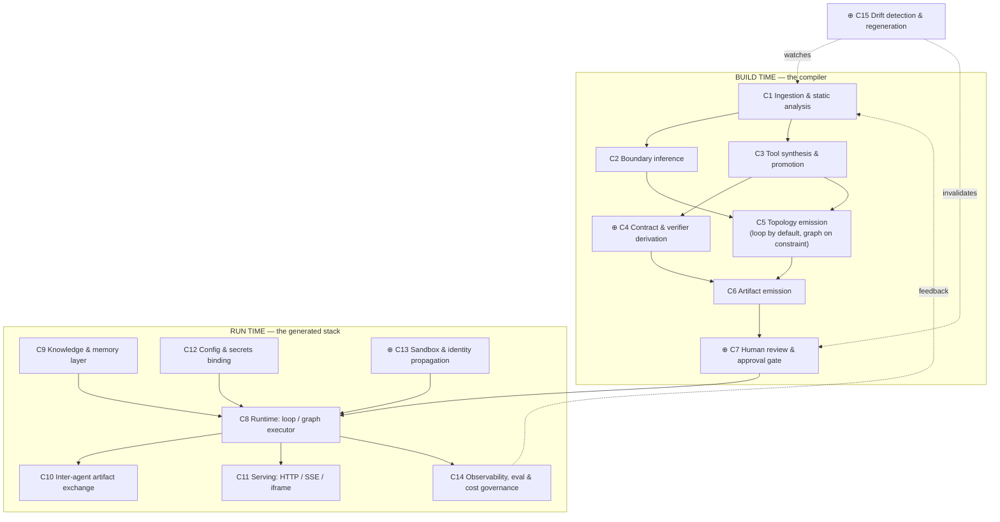

# 07 — Product Vision and Requirements Brief

**Last researched: 2026-08-02**

> Companion documents: `01-agent-anatomy.md` (tool contracts, context budgets, tool-set sizing, memory tiers), `02-agent-harnesses.md` (harness landscape and adoption verdict), `03-graph-and-loop-architecture.md` (loop-vs-graph discipline, contract-derived verifiers), `04-self-improving-agents.md` (eval and optimization loops), `05-frontier-lab-agent-definitions.md` (provider abstraction strategy), `06-examples-inventory.md` (vendored reference material).
>
> **This is a vision and requirements brief, not an architecture and not a spec.** Its job is to make the vision precise, decompose it, name what is genuinely hard, and enumerate the decisions the owner must make before a GitHub Spec Kit spec can be written. Architecture comes later.

---

## TL;DR

> ### ⚠️ Scope banner, 2026-08-02 — **most of this document now describes v2.**
>
> `specs/001-discovery-validation/plan.md` **OD-09** re-scopes the product to roughly a tenth of what is described below. A criterion pre-registered in [11](./11-validation-plan.md) §7, before any experiment ran, fired: a baseline holding shell, `curl` and the target's own OpenAPI schema **matched or beat ~20 hand-written ideal domain tools in all three measured families**. **v1 is a spec-aware runtime, a contract-derived verifier, and drift detection.** Tool synthesis, promotion selection, effect classification and decomposition-into-agents **leave v1**.
>
> **Nothing below is deleted, because a vision document's job is to be checkable against what happened, and most of it holds.** Read it with three fates in mind, because collapsing them is the recurring error here:
>
> | Fate | What it applies to in this document |
> |---|---|
> | **Wrong** | §1.1's one-sentence value proposition and the "compiler … whose output is a running multi-agent system" definition; TL;DR 7's recommended v1 scope cut, and §6.1 with it; TL;DR 3's *"selection and verification are not [commoditized]"* as a v1 claim, since only the second half is v1 |
> | **Narrowed** | §3.5 (correctness) and §3.7 (drift), both **promoted** from supporting concerns to the product itself; §3.3, whose framework-adapter matrix now sizes a verifier rather than a synthesizer; §2's capability decomposition, most of whose rows are v2 |
> | **Deferred** | §3.1 (boundary inference) and §3.2 (tool synthesis) in full — both still correct about v2, both **never measured**, since the experiments that would have tested them (P-04, P-06) never ran |
>
> **Two things are worth flagging up front because they read as vindication and are not.** TL;DR 8 called the shell-plus-search comparison "the killer benchmark … uncomfortable and should be run early." **It was run early, and it fired** — this document named the experiment that re-scoped the product, which is the strongest thing a vision brief can do. And TL;DR 2's *"one agent until a forcing function says otherwise"* is what v1 ships — **but by scope decision rather than by the measurement it asked for**, so it is unconfirmed rather than confirmed. **One clause of OD-09 is *not* propagated as written:** *effect classification defers with synthesis* is right about the differentiator and wrong about the obligation, because constitution Principle IV binds every emitted tool and v1 emits a shell and an HTTP client that can issue `DELETE`. See [14](./14-architecture-synthesis.md) **D-22** and **C-16**.

> 1. **The vision contains two different products wearing one name.** *Class A* agents operate **on the codebase** (shell, file edit, search — a Claude Code equivalent). *Class B* agents operate **through the running application** (synthesized CRUD/domain tools). Different users, different runtime, different blast radius. Fusing them into one agent is not a feature — it is a textbook instantiation of the lethal trifecta. **Deciding which product v1 is, is the single highest-leverage decision on the list.** (§1.2, §3.4)
> 2. **Agent boundary inference is the crux and it is not statically solvable in general.** Layer decomposition (UI/API/data) is the owner's default and is probably the wrong axis: every user request crosses all three layers, so layered agents own no outcome and communicate constantly. Bounded-context decomposition is better but is not recoverable from source with reliability. The disciplined answer is the same one `03` reaches one level down: **default to the simplest topology; escalate only on a declared constraint.** One agent until a forcing function says otherwise. (§3.1)
> 3. **Tool synthesis from code is already commoditized; selection and verification are not.** `mcp-forge`, `super-mcp`, AutoMCP, Speakeasy, Stainless, TrueFoundry and Synapse all ship OpenAPI/codebase → MCP generation today. Generating tools is table stakes. The defensible work is deciding *which* functions deserve promotion (a 300-endpoint app must yield ~20 tools, not 300 — see `01` on degradation past ~30–50 tools), classifying their effects, and shipping a verifier with them. (§3.2, §8)
> 4. **The contract-derived verifier is the strongest differentiator the project has.** Signatures, response models, status codes and exception classes give external ground truth for free. This matters because self-critique without external feedback measurably *degrades* performance ([arXiv:2310.01798](https://arxiv.org/abs/2310.01798)) and LLM-as-judge is anti-correlated with truth on false-success detection. See `03`. A generated tool that ships without a generated test is a liability, not an asset. (§3.5, §7)
> 5. **"Any language, any stack" is true for reading and false for acting.** Generic parsing across 30+ languages is solved (`codegraph`). Knowing that `@app.post("/orders")` is an invocable, authenticated, transactional entrypoint is *per-framework*, not per-language. The real scope unit is a **framework adapter matrix**, and it is small. (§3.3)
> 6. **Synthesize tools at the trust boundary, not the function boundary.** An application function expects a request context — authenticated principal, DB session, tenant scope, feature flags. Calling it in-process as a "tool" bypasses every middleware that makes it safe. Where the app already has an external boundary (HTTP route, GraphQL resolver, RPC method), that is where tools belong. (§3.2.4)
> 7. **Recommended v1: one agent, read-only, FastAPI-first, tools from route handlers, contract-derived verifiers in CI, mandatory human review, HTTP/SSE only, no iframe.** Narrow and deep. It exercises every novel piece end-to-end while betting on nothing unsolved. (§6)
> 8. **The killer benchmark is uncomfortable and should be run early:** does the generated stack beat a plain Claude-Code-style agent that has only shell + `codegraph` search on the same task suite? If not, the product has no reason to exist. Make this a v1 gate, not a v2 discovery. (§7)

---

## Table of contents

1. [Vision statement](#1-vision-statement)
2. [Capability decomposition](#2-capability-decomposition)
3. [The hard problems](#3-the-hard-problems)
4. [Constraints and non-goals](#4-constraints-and-non-goals)
5. [Open questions requiring a decision before spec](#5-open-questions-requiring-a-decision-before-spec)
6. [Proposed v1 scope cut](#6-proposed-v1-scope-cut)
7. [Success criteria](#7-success-criteria)
8. [Prior art](#8-prior-art)
9. [Sources](#9-sources)

---

## 1. Vision statement

### 1.1 The product

~~**`function2agent` is a compiler whose input is a codebase and whose output is a reviewable, versioned, running multi-agent system that can operate that application.**~~

> **Superseded for v1 on 2026-08-02 by `plan.md` OD-09. Retained as the v2 statement.** **The v1 sentence:** *`function2agent` points an agent at your running application's own specification, verifies what it did against contracts derived from your code, and fails closed when either one moves.* **Three of the sentence's five load-bearing words changed and it is worth being specific about which.** *Compiler* → **runtime**: nothing is compiled in v1, and the offline stage shrinks to contract derivation plus reachability. *Multi-agent* → **one agent**, by decision rather than by evidence (§3.1 was never measured). *Operate that application* survives intact — the agent still acts through the running app over its own boundary — but it does so with general tools plus a specification rather than with a synthesized surface. **What is new and is not a subtraction:** *fails closed when either one moves* is drift detection, promoted from the fourth-ranked differentiator to half the product, and *either one* is load-bearing because the source and the deployment move on two separate clocks ([14](./14-architecture-synthesis.md) O-04, D-18).

Restated faithfully from the owner, with the ambition intact:

You point the program at a codebase — a web app with a UI, an API layer, a data access layer, whatever the architecture happens to be. It analyzes the whole thing, organizes it, and emits a series of graph-loop-style agents. Those agents come up with Claude-Code-equivalent tooling (file operations, shell, search, edit) *and* with tools synthesized from the application's own functionality — the CRUD surface, the domain operations, get the data, read the data, do something with the data. A knowledge layer and a memory layer sit underneath, knowledge-graph-shaped. Agents enter the graph loop to service user requests, generate files using the CLI tools they hold, and trade artifacts between one another using the graph loop as the exchange protocol. You consume the result over HTTP or SSE, or you paste an iframe snippet into your web app and it starts talking to your backend. Because a generated stack needs configuration, there is a first-class mechanism for binding environment variables. End state: a full-blown multi-agent system on top of any codebase, anywhere, any stack.

~~**One-sentence value proposition:** *Turn an existing application into an agent-operable system in an afternoon, without writing the agent, the tools, or the glue — and with enough generated verification that you can actually trust what came out.*~~

> **Wrong for v1 as of 2026-08-02 (`plan.md` OD-09), and wrong in an instructive way rather than merely outdated.** *"Without writing the tools"* was the promise, and the ceiling test found that a competent engineer's afternoon — shell, `curl`, the app's schema — **already matches ~20 hand-written ideal tools** ([finding 012](../specs/001-discovery-validation/findings/012-ceiling-test-per-family.md)). So the clause the value proposition leads with is the one the market can most easily self-serve, and the clause it ends with — *enough generated verification that you can actually trust what came out* — is the one nobody self-serves and the one v1 keeps. **The v1 proposition inverts the emphasis of this sentence rather than shortening it:** *your agent can already reach your application; what it cannot do is prove that what it did was right, or notice when your code moved out from under it.*

**Who it is for.** The buyer is a team that already has a working application and wants an agentic surface on it, but does not want to hand-write and hand-maintain forty tool definitions, a loop, an auth story and an eval harness. Concretely, three candidate users — and they are *not* the same person:

| # | User | What they want an agent to do | Environment | Blast radius if wrong |
|---|---|---|---|---|
| U1 | Platform / staff engineer | Give internal operators a natural-language surface over admin/ops functionality | Staging → prod, authenticated | Real data mutation |
| U2 | Product engineer | Ship an in-app assistant that can *do things*, not just answer questions (the iframe path) | Prod, **anonymous or end-user authenticated** | Data mutation + untrusted input |
| U3 | Developer on the repo | An agent that understands and modifies this specific codebase better than a generic coding agent | Local / CI | Bad code, contained by git |

U3 is a *developer tool* competing with Claude Code, Cursor and Augment. U1/U2 are an *application capability* competing with nothing directly comparable. §5 Q1 forces this choice.

### 1.2 The framing problem the vision has not yet resolved

The owner's description contains two distinct agent classes, and the document should name them because nearly every hard problem downstream turns on the distinction:

| | **Class A — codebase-operating** | **Class B — application-operating** |
|---|---|---|
| Subject | The source code | The running application's data and behavior |
| Tools | Read, Write, Edit, Bash, Grep, Glob | `list_orders`, `refund_payment`, `search_customers` |
| Analogue | Claude Code | An MCP server over your product |
| Consumer | Developer | Operator or end user |
| Runs against | A checkout, a sandbox | A live environment with real credentials |
| Failure mode | Bad diff | Bad `DELETE` |
| Contained by | Git, review, CI | Nothing, unless you build it |

The vision as stated gives *the same agents* both tool sets. That is the crux of §3.4: an agent holding shell access **and** production data access **and** an untrusted input channel (the iframe) is the lethal trifecta with all three legs present by construction. This brief takes the position that **Class A and Class B must be separate agents with separate credentials, separate processes and non-overlapping tool namespaces**, and that a v1 which ships both is a v1 that ships an incident.

### 1.3 The tension with sibling research, stated plainly

The owner's framing is *graph-loop-everything*. `03-graph-and-loop-architecture.md` concludes the opposite: **the bare loop is the correct default, and a graph is a cost you pay in exchange for enforcement.** Reach for topology only when there is a real declared constraint — an ordering requirement, a mandatory step, a human gate, a compensating action.

This is not a small disagreement and it should not be papered over. If the generator emits a graph per promoted function, it produces hundreds of single-node graphs: all of the ceremony, none of the enforcement, plus a maintenance surface nobody asked for. The synthesis that preserves the owner's intent while respecting the finding:

> **The graph is the protocol, and the protocol is only worth emitting where there is something to enforce.** Emit a plain loop by default. Emit graph topology exactly where the analysis discovers or the developer declares a constraint: a transaction boundary, an idempotency requirement, an approval gate, a destructive operation, a compensating action. Those topologies must be serializable, content-addressed, versioned, and carry a machine-checkable invariants block (per `03`).

This is the same discipline applied at three levels, and stating it as one rule makes the product coherent:

| Level | Default | Escalate only on |
|---|---|---|
| Control flow | One loop | A declared ordering / gate / compensation constraint |
| Agent count | One agent | Tool-count pressure, trust-boundary difference, isolation requirement |
| Tool exposure | Small curated set | Measured coverage gap (then progressive disclosure, not a bigger set) |

---

## 2. Capability decomposition

Twelve capability areas. Six are named by the owner; six are implied and unnamed but load-bearing (marked ⊕).

> **Re-scoped 2026-08-02 by `plan.md` OD-09, and this is the single most useful place in the document to see the size of the change: of fifteen capabilities, v1 builds six.**
>
> | v1 | v2 |
> |---|---|
> | **C1** ingestion and static analysis (narrowed — it feeds contracts and drift, not synthesis) · **C4** ⊕ contract and verifier derivation (**promoted: this is the product**) · **C7** ⊕ human review, over different objects (see below) · **C8** graph-loop runtime (unchanged and now the largest build) · **C12** config and secrets · **C13** ⊕ sandbox and identity, **plus the D-22 interception point that C3's effect class was going to feed** · **C14** observability · **C15** ⊕ drift detection (**promoted: this is the other half of the product**) | **C2** boundary inference · **C3** tool synthesis and promotion · **C5** topology emission (a single agent needs a much smaller IR) · **C6** artifact emission (there is no artifact set to emit) · **C10** inter-agent artifact exchange (no second agent) · **C11**'s iframe leg, already deferred with the hosted tier (D-20) |
>
> **Three things this split makes visible that the prose below does not.** ① **C4 is marked ⊕ — implied and unnamed by the owner — and it is now the product.** The capability nobody thought to name is the one that survived, which is worth sitting with. ② **C3's removal breaks a dependency nothing else supplies.** C13's identity propagation takes *tool effect class* as an input, and C3 was the only producer of it; that gap is exactly what D-22 fills, per call rather than per tool, and it is why effect classification cannot defer cleanly with synthesis ([14](./14-architecture-synthesis.md) C-16). ③ **C7's objects change but the gate does not weaken** — there is no tool inventory or effect classification to review, so v1 reviews derived contracts and their provenance, the reachability annotation, credential bindings, and the runtime gate decisions ([14](./14-architecture-synthesis.md) D-15). **The two "shape of the business" claims below survive the pivot and one of them is strengthened:** C15's *a generator you run once is a script; a generator that keeps the stack honest as the repo moves is a product* was written about a generated catalogue, and under OD-09 it is the load-bearing sentence of the whole document. C7's *the primary artifact is a pull request, not a running server* is the one that weakens — v1's primary artifact is closer to a running verifier.

| # | Capability | Inputs | Outputs |
|---|---|---|---|
| **C1** | **Ingestion & static analysis.** Parse the repo into a symbol/call/import graph; resolve cross-file references; detect language, frameworks, entrypoints, routes, ORM models, config surface. `codegraph` covers most of this generically. | Repo (git URL or path), optional build/config files, optional OpenAPI/GraphQL/proto schemas | Code graph; framework fingerprint; entrypoint inventory; route table; data-model inventory; config/env inventory |
| **C2** | **Architectural decomposition into agent boundaries.** Propose where one agent ends and another begins, with a rationale and a confidence score per boundary. See §3.1 — this is the hardest capability. | Code graph; framework fingerprint; optional developer-declared boundaries | Proposed agent set with owned tools, owned data scope, and per-boundary rationale + confidence |
| **C3** | **Tool synthesis and promotion.** Decide which functions/endpoints/queries become tools; generate names, descriptions and JSON Schema parameters; classify effects (read / write / destructive / external / financial). | Entrypoint inventory; type info; docstrings; tests; call sites | Tool manifest: name, description, schema, effect class, source binding (path + content hash), invocation strategy |
| **C4** ⊕ | **Contract and verifier derivation.** Convert signatures, response models, status codes, exception classes and existing tests into executable checks for each tool and each graph node. *The differentiator.* | Type signatures; response/DTO models; exception handlers; existing test suite | Per-tool contract tests; per-node pre/postconditions; a machine-checkable invariants block per emitted graph |
| **C5** | **Topology emission.** Emit a plain loop by default; emit graph topology only where a constraint is discovered or declared. | Tool manifest; declared constraints; transaction/idempotency signals | Serializable, content-addressed, versioned topology + invariants |
| **C6** | **Artifact emission.** Materialize the stack: agent definitions, tool bindings, prompts, config schema, tests, and a repo map. | All of the above | A reviewable artifact set (files or a signed bundle) |
| **C7** ⊕ | **Human review and approval gate.** Present the tool inventory, effect classification, descriptions, boundaries and secret bindings for approval. Nothing runs unapproved. | Emitted artifacts | Signed approval manifest (content-addressed); a diff when regenerated |
| **C8** | **Graph-loop runtime.** Execute the agent(s): model turn → tool calls → observation, with budgets, gates and compensation where topology demands. | Approved artifacts; user request; session state | Tool calls, streamed output, final response, trace |
| **C9** | **Knowledge and memory layer.** Repo map, architectural summary, retrieval over the code graph; plus working/episodic/semantic/procedural memory. `01` finds the **filesystem beat the vector DB** for agent-authored tiers. | Code graph; run traces; user corrections | Retrievable context; durable memory files; provenance |
| **C10** | **Inter-agent artifact exchange.** Structured hand-off of typed artifacts (a plan, a diff, a query result, a report) between agents, with the topology as the protocol. | Producing agent's output; artifact schema | Typed, addressable artifact + a hand-off record in the trace |
| **C11** | **Serving and integration.** HTTP endpoint, SSE stream, embeddable iframe widget. | Approved stack; deployment target | Running service; auth-scoped session; embeddable snippet |
| **C12** | **Configuration and secrets.** Declared env-var schema; binding at deploy; secrets resolved server-side and **never** placed in model context. | Config inventory from C1; operator-supplied values | Validated config; a startup failure when required values are missing |
| **C13** ⊕ | **Sandbox and identity propagation.** Isolate shell/file execution; carry the *end user's* identity into application tool calls rather than a single service principal. | Session principal; tool effect class | Scoped credentials per call; isolated execution environment |
| **C14** | **Observability, eval and cost governance.** Traces at node/edge/tool granularity; a task suite; per-session token and turn budgets. | Runtime traces; eval task suite | Success rate, failure attribution, cost per resolved task, budget enforcement |
| **C15** ⊕ | **Drift detection and regeneration.** Watch the target repo; detect when a promoted symbol's contract changed; invalidate the affected tool and its approval. | New commits; stored content hashes | Drift report; failed CI check; disabled tools; regeneration diff |

Three implied capabilities worth calling out because they change the *shape of the business*, not just the architecture:

- **C7 (review)** means the product's primary artifact is a **pull request**, not a running server.
- **C15 (drift)** means the product must live in the customer's **CI**, not be a one-shot generator. A generator you run once is a script; a generator that keeps the stack honest as the repo moves is a product.
- **C13 (identity)** means the product cannot ship a Class B agent until it has answered "as whom does this tool call execute?" — which is an authorization design problem, not an agent problem.

---

## 3. The hard problems

### 3.1 Agent boundary inference

> **DEFERRED TO v2 in full, 2026-08-02 (`plan.md` OD-09) — and deferred *undecided*, which is the point worth recording.** Decomposition-into-agents leaves v1, so §3.1 describes no v1 capability. **Every argument in it remains standing and none of it was ever tested.** §3.1.1's conclusion — layers are the wrong axis, bounded contexts are the right one — is an argument, not a finding; §3.1.2's reliability ordering was never validated against a labelled set; §3.1.4's forcing functions were never exercised because v1 never had a second agent to escalate to. [14](./14-architecture-synthesis.md) records the same thing as D-11 *resolved by scope rather than by evidence*, and its P-04 arm needed a generator that was never built. **Read the sentence below — "this is the crux of the product" — as the clearest single measure of how far the product moved:** the capability the vision called its crux is now entirely out of v1, and the capability the vision left unnamed (C4, contract derivation) is what shipped in its place.

This is the crux of the product and the place where it is most likely to fail quietly — by producing a decomposition that looks plausible in a diagram and performs badly in practice.

**3.1.1 Layer decomposition is probably the wrong axis.** The owner's framing — UI agent, API agent, data agent — mirrors how the code is organized. But agents should be organized around **what a user wants done**, and every user request crosses all three layers. A "data access agent" cannot complete a single user-facing task on its own; it can only serve requests from an API agent, which can only serve requests from a UI agent. You have built a call stack out of language models: three times the tokens, three chances to garble the intent, and no agent that owns an outcome. `01` notes Anthropic's own numbers — roughly 4× tokens for a single agentic loop and ~15× for multi-agent, with token spend alone explaining ~80% of the performance variance on BrowseComp. Paying 15× to reproduce a function call is a bad trade.

**Vertical slices — bounded contexts — are the right axis.** "Orders", "Billing", "Identity", "Inventory": each owns a coherent set of operations, a coherent data scope, and can complete a user request end to end.

**3.1.2 But bounded contexts are not reliably recoverable from source.** Domain boundaries live in the heads of the people who wrote the system. What is recoverable statically, in descending order of reliability:

| Signal | Reliability | Notes |
|---|---|---|
| Developer-declared boundaries (a config file) | Highest | Requires the developer to do work; defeats "point it at a repo" |
| Deployment topology (services, containers, separate DBs) | High | Free on microservices; absent on monoliths |
| Route/module namespacing (`/api/orders/*`, `app/billing/`) | Medium-high | Conventional but very common; cheap to extract |
| `CODEOWNERS`, package boundaries, OpenAPI tags | Medium | Encodes team structure, which correlates with domain (Conway) |
| Community detection on the import/call graph | Low-medium | Produces *plausible* clusters, not *correct* ones. Classic modularization research; useful as a hint, unsafe as a decision |
| LLM reading the code and proposing domains | Unknown, unverifiable | Confident, fluent, and untestable. Needs a review gate |

**3.1.3 The pathological cases**, honestly:

| Codebase shape | What happens | Fallback |
|---|---|---|
| Clean layered monolith | Layer signal is strong, domain signal is weak — the *worst* case, because the wrong axis is the legible one | Prefer route-prefix clustering over directory layers; flag low confidence |
| Microservices | Boundaries are given for free by deployment | One agent per service, then ask whether you need agents at all |
| Monorepo | Package graph is a good prior; but packages ≠ domains (shared libs, generated clients) | Filter to packages with entrypoints; ignore leaf libraries |
| Big ball of mud | Clustering returns one giant component or noise | **Do not guess.** One agent, curated tool set, surface the mess in the report |
| Framework-generated scaffolding (Rails, Django admin) | Hundreds of near-identical CRUD endpoints | Collapse to parameterized tools; do not promote per-model |
| Polyglot (TS frontend + Go API + Python jobs) | Language boundary ≈ deployment boundary, usually | Use it, but verify against the route table |

**3.1.4 The disciplined answer.** Boundary inference should be **advisory in v1 and load-bearing only in v2+**. Ship the decomposition as a *report* — proposed boundaries with rationale and confidence — while the runtime defaults to a single agent. That way you collect ground truth on whether your inference is any good, from real users, before betting the runtime on it. Escalate to multiple agents only on a **forcing function**, not an aesthetic one:

1. Promoted tool count for a single agent exceeds the selection budget even after progressive disclosure (`01`: degradation past ~30–50 tools).
2. Two tool groups sit on different **trust boundaries** (Class A vs Class B; PII vs non-PII; read vs destructive).
3. Two tool groups have genuinely different isolation, latency or availability requirements.
4. The developer declares a boundary explicitly.

Note that (2) is the only reason that is a *safety* reason, and it is therefore the only one that is non-negotiable.

### 3.2 Tool synthesis from arbitrary code

> **DEFERRED TO v2 as a capability, 2026-08-02 (`plan.md` OD-09) — with two clauses that do not defer, and one measured result that changes what v2 should build.**
>
> **What defers:** §3.2.1's promotion function, §3.2.2's promotion criteria, §3.2.3's description-quality work, and §3.2.5's *derivation* of a static effect class. All correct about v2; none of it is v1.
>
> **What does not defer — §3.2.4, and it survives as the reason the pivot works rather than as a casualty of it.** *Synthesize tools at the trust boundary, not at the function boundary* pointed at routes and handlers because that is where authorization, validation and audit already live. **v1 takes that argument to its limit: it does not synthesize at the boundary, it hands the agent the boundary itself** — the app's own HTTP surface, its published schema, and a socket. The paragraph's warning about in-process invocation bypassing middleware is *more* satisfied by v1 than by the design it was written for.
>
> **What does not defer — §3.2.5's three rules, which are runtime rules wearing synthesis clothing.** Rule 1 (read-only by default), rule 2 (destructive operations require an out-of-band confirmation that is *not* a tool the model can call), and rule 3 (compensation needs a graph) all describe **enforcement**, and enforcement is v1. The sentence *"every tool needs an effect class"* is where OD-09 and constitution Principle IV collide: v1 emits a shell and an HTTP client, both of which can issue `DELETE`, and neither of which has a meaningful tool-level effect class. v1 therefore classifies **per call at a runtime interception point** rather than per tool at generation time, using the published schema's HTTP verb as the crude-but-real proxy this section already names ([14](./14-architecture-synthesis.md) D-22, C-16). **§3.2.5's own default-deny rule is what makes that tractable** — an unresolvable call is gated, not guessed. **Updated 2026-08-03 by `plan.md` OD-10, and this paragraph's own rule 1 is what v1 now ships.** *Read-only by default* is no longer a default but the whole policy: resolved read → allow, everything else → **deny**, with no runtime approval path. Rule 2 (destructive operations require an out-of-band confirmation that is not a tool the model can call) is **satisfied vacuously and deferred with writes** — there are no destructive operations to confirm — and rule 3 (compensation needs a graph) **defers with them**, since there is nothing to compensate. **So of the three rules this section calls runtime rules wearing synthesis clothing, one is v1 and two go dormant** — which is a smaller v1 obligation than the sentence above implied, and worth recording as such rather than leaving the reader to infer three live rules.
>
> **And one number belongs here rather than in a register.** §3.2.1 asserts the 300 → ~20 reduction as the whole problem. It was never measured, because the promotion arm needed a generator. What *was* measured is adjacent and inconvenient: a 20-tool surface returning **records** lost a whole task family to a competent `jq` pipeline, while a single tool returning an **answer** moved a task by 35× ([14](./14-architecture-synthesis.md) D-19). So the v2 question this section poses is not *how few tools* but *how far up the abstraction each one sits*, and this section asks the first question rather than the second.

**3.2.1 The counting problem is the whole problem.** A mid-sized web application has 5,000–50,000 functions and 100–500 HTTP endpoints. `01` finds tool-selection accuracy degrades past roughly 30–50 tools. So the promotion function must be **aggressively lossy by design**: the target is not "expose the application" but "expose the smallest tool set that spans the space of things users actually ask for." A 300-endpoint app should yield on the order of 20 tools plus a search/dispatch tool — a ~15:1 reduction. A generator that emits 300 tools has not solved the problem; it has moved it into the model's context and made it worse. The two shipped mitigations from `01` — deferred/searchable tool loading (trims *definitions*) and code-execution-as-tool-calling (trims *results* and round trips, with reported 78–99% reductions) — are the escape valves, and both should be design inputs from day one rather than v2 optimizations.

**3.2.2 Which functions deserve promotion.** A candidate should clear all of these:

- It is reachable from an **external entrypoint** (HTTP route, CLI command, job handler, GraphQL resolver, exported public API) — not an internal helper.
- Its signature is **stable and typed** enough to produce a parameter schema without guessing.
- It corresponds to something a **user would name**. "Refund an order" is a tool; `_normalizeAddressLine2` is not.
- Its effect class is **determinable**, or it is defaulted to the most dangerous class and gated.
- It is not a thin wrapper, re-export, or framework-generated duplicate of another candidate.

And a strong negative signal that is easy to compute and rarely used: **if no test and no docstring and no call site outside its own module reference it, it is almost certainly not a user-facing capability.**

**3.2.3 Description quality is the failure point.** Four evidence sources, in ascending order of value: the function name (weak, often lies), the signature/types (structural, reliable, incomplete), the docstring (helpful when present, stale when not), and **the tests (best — they demonstrate intent, valid inputs, and error conditions simultaneously)**. Tool descriptions are part of the harness, not the model (`02`), which means description quality is directly measurable and directly optimizable — and must be evaluated, not assumed. Bad descriptions produce tool confusion, which is a known and expensive failure mode.

**3.2.4 The insight that reframes this capability: an application function is not an API.** A function inside a web app expects to run inside a request context — an authenticated principal, an open DB session or transaction, a tenant scope, feature flags, rate limits, audit logging. Every one of those things is supplied by middleware the function never sees. Invoking that function **in-process** as a "tool" bypasses all of it. You get a callable that works in the happy path and silently violates authorization in every other path.

> **Synthesize tools at the trust boundary, not at the function boundary.** Where the application already exposes an external boundary — an HTTP route, a GraphQL resolver, an RPC method, a CLI command — that boundary is where authorization, validation, and audit already live. Generate tools that *call it*, not tools that reach behind it.

This has a large and clarifying consequence for scope: for web applications, the tool surface should be derived from **routes and handlers**, not from arbitrary functions. It makes the problem smaller, safer, and much more tractable — and it aligns the product with the (already commoditized, see §8) OpenAPI→MCP mapping while adding the parts that are missing from it.

**3.2.5 Effects, transactions, and destructive operations.** Every tool needs an effect class, derived statically where possible (HTTP verb; SQL verb; ORM method; known-destructive API calls; presence of a transaction decorator) and defaulted to the *most dangerous* class when undeterminable. Default-deny for unclassifiable candidates. Three rules that should be non-negotiable in the spec:

1. **Read-only by default.** Write tools require explicit per-tool, per-environment opt-in during review.
2. **Destructive operations require out-of-band confirmation** — and the confirmation must *not* be a tool the model can call. It is a runtime interrupt, enforced by topology (`03`: anything the agent must not skip belongs in topology, not the prompt).
3. **Multi-step operations that must not partially apply need compensation**, which means they need a graph. This is exactly the "declared constraint" that justifies emitting topology, and it is the honest reconciliation with the owner's graph-loop framing.

### 3.3 "Any language, any stack"

Decompose the claim into three separable layers, because they have wildly different difficulty:

| Layer | What it needs | Difficulty | Status |
|---|---|---|---|
| **Parse & symbol graph** | Tree-sitter-class parsing, cross-file resolution | Solved generically | `codegraph` covers 30+ languages including TS/JS, Python, Go, Rust, Java, C#, PHP, Ruby, Swift, Kotlin, Scala, Dart, and long-tail cases like COBOL and Solidity — with no per-language setup |
| **Framework semantics** | Know that this decorator is a route, this class is an ORM model, this is middleware, this is a background job | **Per-framework, not per-language** | This is where the actual work is |
| **Invocation** | Actually call the thing, in the right environment, as the right principal | Per-framework + per-deployment | Hardest; requires a running target |

So the honest restatement: **"any language" is true for reading; "any stack" is false for acting.** The unit of scope is a **framework adapter**, and the count is manageable — roughly a dozen frameworks cover the overwhelming majority of web applications.

A strong simplifying signal: **codebases that already expose a machine-readable interface contract collapse most of the difficulty.** OpenAPI, GraphQL SDL, protobuf/gRPC, tRPC, JSON-RPC schemas — each hands you names, parameters, types, and often descriptions. Contract density should therefore drive scope order:

| Tier | Stacks | Why |
|---|---|---|
| **T1 — highest contract density** | Python/FastAPI (Pydantic → JSON Schema → OpenAPI, free), TypeScript/tRPC, NestJS (decorators + DTOs), anything with a checked-in OpenAPI spec or `.proto` | Parameter schemas and response contracts exist already; the verifier has real material to work with |
| **T2 — inferable** | Django REST, Flask + marshmallow, Express + zod, Spring Boot, Rails, Laravel, Go + chi/gin with struct tags | Routes are discoverable; schemas need inference; contracts are partial |
| **T3 — hard** | Untyped Express/Flask with no schemas, PHP without a framework, monoliths with no HTTP surface, desktop/embedded, COBOL | Reading works; acting requires guessing; the verifier has nothing to check against |

The strategic reading: **T1 is not just the easiest tier, it is the only tier where the differentiator (contract-derived verification) actually functions.** That should determine v1 scope, and it does — see §6.

> **Sharpened rather than superseded 2026-08-02 by `plan.md` OD-09 — and this section reads *better* after the pivot than before it.** Two of its three layers change standing. **Parse & symbol graph** stays, narrowed: it feeds contract derivation and drift detection rather than synthesis. **Invocation** — the row this section calls hardest, "requires a running target" — **stops being the product's problem**, because v1 does not synthesize an invocation; the agent invokes the running target directly over its own boundary. **Framework semantics** is the row that splits: v1 needs enough of it to derive contracts and to detect that a handler moved, and it needs none of it to decide what should become a tool.
>
> **The strategic reading above gets stronger and narrower at the same time.** Stronger, because contract-derived verification went from one differentiator among four to half the product, so *the only tier where the differentiator functions* is now the only tier where **the product** functions. Narrower, because [14](./14-architecture-synthesis.md) P-08 records the inversion this creates: T1's defining property is a **published, machine-readable contract**, and v1's agent reads a published specification. The T1/T2/T3 ordering was drawn to rank *how much material the synthesizer has*; under OD-09 it ranks *how much the agent can already do without us* — which is the same ordering pointed at a different question, and the ceiling test found the answer at the top of that ordering is "quite a lot" ([finding 012](../specs/001-discovery-validation/findings/012-ceiling-test-per-family.md)).

### 3.4 Safety — the lethal trifecta, present by construction

The [lethal trifecta](https://simonwillison.net/2025/Jun/16/the-lethal-trifecta/) is the combination of **private data access + exposure to untrusted content + the ability to externally communicate**. Any two are manageable. All three means an attacker who controls the untrusted content can exfiltrate the private data, and no amount of prompting fixes it.

The vision as described assembles all three deliberately:

| Trifecta leg | Where the vision supplies it |
|---|---|
| Private data | Class B tools that read and mutate the application's production data |
| Untrusted content | The iframe: arbitrary end-user text, in a public web page, reaching the agent |
| External communication | Class A tools: `Bash`, file write, network access — arbitrary egress by definition |

This is not a risk to be mitigated with a filter. **It is a composition that must not be built.** The product-level requirements that follow:

1. **Class A and Class B agents must not share a process, a credential set, or a tool namespace.** An agent serving untrusted input never holds shell or file-write. An agent holding shell never receives untrusted end-user text. This should be asserted by an automated test in the generated stack, not by a policy document.
2. **The iframe is the highest-risk surface in the product and should not ship in v1.** It is also the most demo-able, which is precisely why it will be tempting. Its prerequisites are: end-user identity propagation into tool calls (C13), per-session budget enforcement, egress control, and a completed authorization story. Ship HTTP/SSE with authenticated callers first.
3. **Secrets never enter model context.** The runtime holds credentials; the tool executes server-side; the model sees results, never keys. Environment binding (C12) must be designed around this from the start, because retrofitting it is impossible.
4. **Prompt injection through the codebase itself is a vector specific to this product and is badly underrated.** The analyzer reads docstrings, comments, README files, and dependency source — attacker-influenceable text in any repo with third-party code or outside contributors — and *promotes that text into tool descriptions and system prompts*. A malicious docstring becomes a standing instruction to every agent generated from that repo. All extracted text must be treated as **data, not instruction**: delimited, sanitized, provenance-tracked, and surfaced in the human review gate. Note that MCP has a documented version of this same trust problem (`01`: the spec declares tool descriptions untrusted while providing no mechanism to enforce it).
5. **Egress control is a runtime requirement, not a deployment detail.** An agent with shell in a container with open outbound network is an exfiltration channel regardless of what its tools do.

> **This item was right, it describes v1 exactly, and it has never been implemented — noted 2026-08-03** ([14](./14-architecture-synthesis.md) **C-17**, **U-44**, §7.6; `plan.md` **OD-12**, proposed). *An agent with shell in a container with open outbound network* is a literal description of what OD-09 left v1 emitting, and this sentence predates the pivot by months. It is also the third independent statement of the same requirement — constitution Principle IV's first bullet (*network allowlisted to named hosts*) and [08](./08-auth-identity-and-secrets.md) §8.1 item 4 (*default-deny egress at the host*, in the **hard requirements**) say it too — and **none of the three was cited when OD-10 asked whether read-only defuses the trifecta.** Every Principle IV argument in the corpus is about the permission-tier bullet. **Two qualifications this item earns rather than loses.** Its *"regardless of what its tools do"* is the strongest clause in it and is exactly what read-only does not change: OD-10 removes writes and leaves egress, which is why C-16 narrowed instead of closing. And its own scope has one hole worth naming — an egress allowlist confines the agent to the target's API, and **the target's API may itself fetch URLs on the agent's behalf**, so the guarantee is conditional on a per-target property that is unmeasured (U-44).
>
> **✅ IMPLEMENTED AS A REQUIREMENT 2026-08-03, later the same day — `plan.md` **OD-12** ratified, **OD-13** amends the constitution to v1.2.0. The status changes from *never implemented* to *decided and specified, not yet built*, and those are different things.** ~~`plan.md` **OD-12**, proposed~~ — decided. **This item's own words picked the layer correctly and the decision goes one step further than they do.** *A runtime requirement, not a deployment detail* is now a **single mandatory egress proxy** that every outbound byte from the sandbox traverses, enforcing the destination allowlist and the HTTP method allowlist at the same layer. The reason that is stronger than the item's phrasing is the clause the item is proudest of: *regardless of what its tools do* only holds if the control cannot be walked past by a subprocess, and an in-process check on `argv` can be — a proxy cannot ([14](./14-architecture-synthesis.md) **C-17**, now closed). **Both qualifications above survive intact.** Read-only still does not close the egress leg, which is why C-16 narrowed a third time rather than closing; and U-44 — the target's API fetching URLs on the agent's behalf — is untouched by the proxy for a structural reason, since permitting the target's API permits every operation of it. **What must not be read into this: the item is satisfied when the proxy exists in a deployment, not when it is written down.**
6. **Anonymous traffic against a per-token-billed backend is a billing DoS.** Per-session turn caps and token budgets are product primitives, not tuning knobs.

### 3.5 Correctness and trust

**No competent engineer will put a generated agent in front of customers or production data without reading what was generated.** That single sentence should shape the product more than any technical consideration in this document, and it has two consequences:

**(a) The artifact must be optimized for review, not for cleverness.** Small, diffable, human-legible, in the customer's own repo, arriving as a pull request. This weighs heavily on Q2 in §5 (emitted code vs. runtime-interpreted config): a config blob a service interprets is harder to review, harder to diff, and harder to trust than files a developer can read. It also weighs against over-generation — 300 tools is not reviewable at any level of quality, which is an *independent* argument for the aggressive promotion filter in §3.2.1.

**(b) Verification must come from outside the model.** This is where `03`'s central finding becomes a product requirement rather than an implementation detail. Self-critique without external feedback measurably degrades performance ([arXiv:2310.01798](https://arxiv.org/abs/2310.01798)), and LLM-as-judge is anti-correlated with truth on false-success detection — an agent asked "did that work?" will confidently tell you yes. The escape is that **the codebase already contains ground truth**: return types, response models, status codes, exception classes, and an existing test suite. A function signature is already most of a node contract.

> **Design principle: every generated tool ships with a generated check, or it does not ship.** The verifier is not a nice-to-have quality feature; per `03` it is the project's single strongest differentiator, and it is the thing every commoditized OpenAPI→MCP generator lacks (§8).

**What must be human-reviewed before anything goes live** — this should be an explicit, enumerated gate in the spec:

| Review item | Why it cannot be automated |
|---|---|
| Tool inventory (what got promoted, what got excluded) | Only a human knows what is missing and what should never have been exposed |
| Effect classification per tool | A misclassified destructive tool is the worst single failure in the system |
| Tool descriptions | Injection surface (§3.4.4) and the primary driver of tool-selection accuracy |
| Agent boundaries and tool ownership | Low-confidence inference (§3.1) |
| Graph invariants for emitted topologies | These *are* the enforced guarantees; unreviewed guarantees are not guarantees |
| Secret and env-var bindings | Wrong binding = wrong environment = production incident |
| Which environment each tool targets | The difference between staging and prod |

Approval should produce a **signed, content-addressed manifest**. Any change to a reviewed input invalidates the approval — which is exactly the hook drift detection (§3.7) needs.

> **Narrowed, not weakened, 2026-08-02 by `plan.md` OD-09 — and §3.5 is the section the pivot vindicates most.** Its opening sentence — *no competent engineer will put a generated agent in front of customers or production data without reading what was generated* — is arguably what OD-09 acted on: the ceiling test found the generated half was matchable by an afternoon of shell and `curl`, and the unmatched half was exactly (b), *verification must come from outside the model*. **(b) is now the product.** The design principle box — *every generated tool ships with a generated check, or it does not ship* — needs its subject swapped rather than its rule relaxed: there are no generated tools in v1, so the v1 form is **every emitted contract ships with its provenance and a validated/provisional flag, or it does not ship** ([14](./14-architecture-synthesis.md) D-17, D-09).
>
> **(a) is the clause that weakens.** *The artifact must be optimized for review… arriving as a pull request* assumed a generated artifact set; v1's primary artifact is closer to a running verifier than a PR. Its second argument — that 300 tools is unreviewable at any quality — remains correct and is now an argument about v2.
>
> **The review table loses three rows and keeps four, and losing rows does not mean losing the gate.** *Tool inventory*, *effect classification per tool*, and *tool descriptions* have no v1 object — nothing is promoted, nothing is labelled at generation time, nothing is described. *Agent boundaries and tool ownership* goes with decomposition (§3.1). What v1 reviews instead: **derived contracts and their validated/provisional flags** (new, and the most important row), the **reachability annotation**, **secret and env-var bindings** (unchanged), **which environment each tool targets** (unchanged and arguably more urgent, since the agent now reaches the app directly), and **the runtime gate's deny rules and tier resolution** (new — the per-call replacement for the effect-classification row, [14](./14-architecture-synthesis.md) D-22). **Note what the third row's justification survives as:** *a misclassified destructive tool is the worst single failure in the system* was an argument for reviewing a static label; under v1 it is an argument for reviewing the **gate**, because the gate is the only thing standing between the model and a `DELETE`. **Amended 2026-08-03 by `plan.md` OD-10, and the amendment thins the newest row rather than adding one.** *The runtime gate's deny rules and tier resolution* narrows from **gate decisions** to **gate configuration**: under read-only nothing escalates, so there are no per-call decisions to review, and what a human reviews is the safe-method rule set and the side-effecting-read deny list that define what counts as a read. The `DELETE` is no longer the case that needs review — it is denied unconditionally — and **the case that does is a `GET` that writes** (U-43).

### 3.6 Multi-tenancy, isolation, and cost

Two separate isolation problems, often conflated:

- **Analysis-time isolation.** Customer source code in your infrastructure. If the product is hosted, this is a security review, a data-retention policy, and probably a compliance certification before any enterprise will run it. If the analyzer runs locally and only metadata leaves, that entire class of objection disappears. This is a strong argument for a **local-analysis / hosted-runtime** hybrid (Q3 in §5), and it is worth noting that `codegraph` is already 100% local. **Resolved 2026-08-02 by owner decision OD-08 (`specs/001-discovery-validation/plan.md`, recorded as D-20 in `14-architecture-synthesis.md`): self-hosted ships, so the whole class of objection disappears and it disappears for the runtime too, not only the analyzer.** The hybrid this bullet argues for remains the reachable destination rather than the v1 shape.
- **Runtime isolation.** Generated agents execute shell commands and hold credentials to a customer's application. Tenant A's agent must not reach tenant B's anything. This needs real sandboxing (container or microVM per session), not process separation. **Amended 2026-08-02 by OD-08: the cross-tenant sentence is deferred and the sandboxing sentence is not.** With one tenant per deployment there is no tenant B, so the *tenancy* requirement becomes a design constraint rather than a runtime obligation (`08` §6.2). Real sandboxing survives as a v1 requirement on its own argument: cross-*session* state within one tenant is still a leak channel, and OD-07 requires the emitted agent to hold a general fallback path — shell — inside the customer's network, where co-location with the production database is now the default rather than a mistake.

**Cost is a design constraint, not an operational detail.** From `01`: ~4× tokens for a single agentic loop, ~15× for multi-agent, and token spend alone explaining ~80% of performance variance on BrowseComp. Multi-agent by default is therefore a *pricing decision* dressed as an architecture decision. Three cost surfaces the spec must budget:

1. **Analysis cost.** LLM-enriching descriptions for thousands of symbols is expensive and mostly wasted, since promotion discards ~95% of candidates. **Filter structurally first, then enrich only survivors** — a large, easy win.
2. **Runtime cost per resolved task.** Must be measured per task, not per token, and must be a headline metric.
3. **Abuse cost.** Anonymous iframe traffic, per §3.4.6.

### 3.7 Staleness and drift

The generated stack is a snapshot. The repo is a stream. Four distinct drift modes, in ascending order of nastiness:

| Mode | Example | Detectability |
|---|---|---|
| **Signature drift** | A parameter is added or renamed | Trivial — compare content hash / resolved schema |
| **Semantic drift** | The function still exists and still type-checks, but now means something different | Hard — needs behavioral tests, which is another argument for C4 |
| **Boundary drift** | A new module appears that no agent owns | Medium — detectable by re-running C2 and diffing |
| **Verifier drift** | The contract changed, so the generated test now asserts the wrong thing | Medium — detectable, dangerous if missed, because it produces *false confidence* |

**Mechanism.** Each generated tool records the **content hash of its source symbol and its resolved interface contract**. A CI check re-resolves and compares. This is cheap, mechanical, and needs no LLM.

**Policy is a product decision with real tradeoffs**, and the owner must pick:

| Policy | Behavior | Cost |
|---|---|---|
| Block | Fail CI until regenerated and re-reviewed | Annoying; safest |
| Auto-regenerate + re-review | Open a PR with the diff | Best UX; needs high-quality diffs |
| **Fail closed (recommended)** | Disable the drifted tool, keep the rest running, surface it loudly | Degraded capability beats silent wrongness |
| Ignore | Tool 500s at runtime | Unacceptable |

The recommendation is **fail closed**: a silently wrong tool is strictly worse than a missing one, because the agent will confidently use it and report success.

The strategic consequence is worth stating plainly: **drift handling requires the product to live inside the customer's CI.** A one-shot generator produces an artifact that begins rotting the day it is created. That is a different product, a different integration surface, and a different pricing model than "run this command once."

> **PROMOTED 2026-08-02 by `plan.md` OD-09 — this section went from a maintenance concern to half the product, and it is the *least* measured thing v1 ships.** [11](./11-validation-plan.md) §8 scheduled drift for Phase 5 (H6); Phase 5 never ran. So the section that is now load-bearing has no experimental support at all, which is a real risk and is recorded as such ([14](./14-architecture-synthesis.md) §1.2's differentiator table and §6.1's Monday item 3, with the promotion itself at D-21).
>
> **Three corrections the promotion forces, and one of them is a genuine hole.**
>
> ① **The four modes are four modes of *source* drift, and there is a fifth on a different clock.** [14](./14-architecture-synthesis.md) O-04 and D-18 establish that the codebase moves under commits while the deployment moves under configuration, rollout and its own installed package set — an operation can vanish because a handler changed *or* because the deployment stopped serving it, and re-running analysis sees only the first. **`plan.md` E13 tests drift by mutating the codebase and has no arm in which the source is unchanged and the deployment stops serving an operation.** That is the hole; it is flagged here and not closed here.
>
> ② **"Each generated tool records the content hash of its source symbol" needs re-anchoring, because v1 generates no tools.** What carries a hash in v1 is the derived contract, the reachability annotation, and the specification the runtime reads. The mechanism is unchanged and still needs no LLM; only the object it hangs off changes. **This makes the diff smaller and easier**, which is one of the few places the pivot makes something strictly simpler.
>
> ③ **"Fail closed" survives verbatim and gets sharper teeth.** The recommendation's justification — *a silently wrong tool is strictly worse than a missing one, because the agent will confidently use it and report success* — is now the v1 product sentence rather than a policy preference, and it is what the tin-line *fails closed when either one moves* refers to. **Semantic drift, the row this table marks "Hard," is also the row the contract-derived verifier is best positioned to catch**, so the two promoted halves of v1 are load-bearing for each other: the verifier is what makes drift detectable beyond signature comparison, and drift is what keeps the verifier honest as the target moves.

---

## 4. Constraints and non-goals

**What this product is not:**

1. **Not an autonomous software factory.** It does not take an idea and build an application. That is a crowded, differently-shaped category (§8: ZeroBuild, Agentnetes, Forge). `function2agent` starts from working code.
2. **Not a general-purpose agent framework.** Per `02`'s verdict: adopt a thin substrate, build the harness. Competing with LangGraph or ADK is not the business.
3. **Not a code-understanding chat product.** "Ask questions about your codebase" is served by Augment, Cursor, and `codegraph` itself. The product's claim is *acting*, not *explaining*.
4. **Not an observability or APM product**, though it must emit traces good enough to debug and to feed the eval loop (`04`).
5. **Not a hosting provider.** The owner's "assuming ports are open and DNS is set up" is doing real work in that sentence and deserves to be named: deployment, TLS, DNS, and network reachability are unowned dependencies today. Either take them on deliberately or require the customer to own them explicitly. **Resolved 2026-08-02 by OD-08 (Q3, `14` D-20) and resolved toward the second limb: the customer owns them explicitly, because the customer runs the stack.** Two consequences the sentence's own framing predicted: this is the cost recorded as "harder support" and "support matrix hell" (`08` §6.1), and **network reachability stops being an unowned dependency and becomes a design constraint in the opposite direction** — the architecture must keep the boundary between pipeline, runtime and target explicit even when all three sit on `localhost`, or the hosted tier is foreclosed (D-20 discipline 1).
6. **Not a model provider or a fine-tuning play.** Per `05`, use a thin two-tier provider abstraction with opaque reasoning state as a first-class type.

**Out of scope for v1** (each of these is *deferred*, not rejected):

| Deferred | Reason |
|---|---|
| The iframe / anonymous end-user surface | Highest-risk surface; prerequisites unmet (§3.4) |
| Multi-agent decomposition as a *runtime* feature | Boundary inference unvalidated (§3.1); ship it as a report instead |
| A knowledge-graph database | `01`: filesystem beat vector DB for agent-authored memory. Start with files + `codegraph` retrieval |
| Autonomous production writes | Read-only default; write tools require explicit review and non-prod targets |
| Inter-agent artifact exchange | There is only one agent in v1; the protocol has nothing to carry yet |
| Cross-repo / polyglot / microservice fleets | One repo, one framework, first |
| Self-improvement loops (`04`) | Requires an eval suite and a traffic baseline that will not exist yet |
| Class A (shell/file) agents in the generated stack | Claude Code already exists and is better at this; Class B is the differentiated half |

That last one deserves emphasis because it contradicts the vision as stated: **shipping a Claude Code equivalent inside the generated stack is competing with Claude Code, using Claude Code's own SDK, and losing.** The novel claim is Class B — agents that operate the *application*. Deferring Class A both sharpens the product and removes one leg of the trifecta.

> **The non-goals survive almost intact — and the one that does not is the last one, which OD-09 pushes against hard.**
>
> **Non-goals 1–4 and 6 are unchanged.** Non-goal 2 (*not a general-purpose agent framework — adopt a thin substrate, build the harness*) is **more** binding after the pivot, not less, because the harness is now most of what v1 builds ([14](./14-architecture-synthesis.md) OD-01's 2.5–3.5 weeks of loop-safety work is unchanged by OD-09 and is the largest item on the critical path). Non-goal 3 (*the claim is acting, not explaining*) survives with a wrinkle worth naming: v1's claim narrows to **acting, verifying, and noticing when the ground moves**, and the verifying half is what distinguishes it from the afternoon of shell that the ceiling test showed already works.
>
> **The deferral table: five rows unchanged, three now redundant or contradicted.** *The iframe surface*, *a knowledge-graph database*, *cross-repo fleets*, and *self-improvement loops* all still defer for their original reasons. *Multi-agent decomposition as a runtime feature* defers **harder** — OD-09 removes even the "ship it as a report" consolation, since there is no analysis pass producing the report. *Inter-agent artifact exchange* is redundant with that. **The row that changes character is *autonomous production writes*.** Its stated mechanism — *write tools require explicit review and non-prod targets* — presumed identifiable write tools; v1 has none, so the rule re-lands as a **per-call gate at a runtime interception point** rather than a per-tool review outcome (D-22). The *intent* — read-only default, writes are deliberate — is preserved exactly; only the enforcement unit moves. **Hardened 2026-08-03 by `plan.md` OD-10: this row stops being a deferral of *autonomous* production writes and becomes a deferral of production writes full stop.** Nothing is deliberate enough to ship, because the gate that would judge deliberateness has never been measured (U-43).
>
> **And the last row is now false as a description of v1.** *Class A (shell/file) agents in the generated stack* was deferred on the grounds that Claude Code already does it better — but OD-07 requires the emitted agent to hold a general fallback path, and OD-09 makes that path **the entire tool surface**. So v1 ships something Class-A-shaped, and the paragraph's own reasoning becomes the sharpest available statement of the strategic risk rather than a settled deferral: if the general path is the whole product surface, *what stops this from being Claude Code with a specification attached?* The answer v1 bets on is the verifier and the drift detector — the two things Claude Code does not do against your application's contracts. **That bet is stated, not demonstrated**; it is tracked at [14](./14-architecture-synthesis.md) C-15 and §7.2, and the trifecta consequence — deferring Class A no longer removes a leg — is tracked at §7.6.

---

## 5. Open questions requiring a decision before spec

Each is a real decision with real options. Ordered roughly by how much downstream design they unblock.

> **Re-scoped 2026-08-02 by `plan.md` OD-09. Of thirteen questions, one is answered by evidence, four are answered by scope, two defer with synthesis, and one is re-aimed at a different object. The rest stand.**
>
> | Question | Standing after OD-09 |
> |---|---|
> | **Q1** agent class | **Answered by scope, and answered *against* the recommendation's clean form.** The lean was (a) Class B only. v1 ships an agent holding general tools plus a specification (OD-07, OD-09), which is Class-B *in purpose* and Class-A *in tool shape*. Q1's own warning that (c) "is the trifecta" is why this is tracked as a live contradiction rather than a resolution ([14](./14-architecture-synthesis.md) C-15) |
> | **Q2** code vs. config | **Re-aimed.** The lean split the artifact: (a) emitted files for *the tool manifest, contracts and tests*; (b) an interpreted runtime. There is no tool manifest in v1, so the (a) half reduces to **contracts and tests** — which is exactly the surviving product. The Q3 narrowing below already applies |
> | **Q4** harness | **Unchanged, and its own sub-question flips.** Q4 reduces the choice to *do we need durable execution in v1?* and answers "for a read-only v1, no." ~~v1 is not read-only — D-22 gates writes rather than forbidding them — so the sub-question is live again.~~ **Corrected 2026-08-03 by `plan.md` OD-10: v1 *is* read-only, and D-22's gate now denies every non-read rather than gating it, so this sub-question closes again on Q4's own original answer — no durable execution needed for v1.** The reversal is worth noticing rather than quietly absorbing: the sub-question was live for one day, and it re-closes on the branch Q4 wrote for it rather than on a new argument. OD-01's 2.5–3.5 weeks of loop-safety build is unchanged by OD-09 and is now the largest item on the critical path |
> | **Q6** review depth | **Narrowed to different objects.** (a)'s enumerated list — tool inventory, effects, descriptions, secret bindings — is half-empty in v1. (c) risk-tiering "requires the effect classifier to be trustworthy, which is itself unvalidated," and that sentence is now about the **runtime gate** rather than a static classifier ([14](./14-architecture-synthesis.md) U-43) |
> | **Q7** language/framework scope | **Inverted rather than answered** ([14](./14-architecture-synthesis.md) P-08). The recommendation was (a) one framework deep, on contract-density grounds. v1 reads a *published specification*, which is option (c)'s premise — the option Q7 calls "the widest reach and the weakest differentiation… precisely the commoditized slice." v1's answer is that the differentiation moved to the verifier and the drift detector, not the reach |
> | **Q8** invocation boundary | **Answered by scope, in the direction it recommended.** *Over the boundary*, and the deployment dependency is accepted twice over — reachability is an input to analysis (D-18) and the runtime needs the same reach at execution |
> | **Q9** graph vs. loop | **Narrowed.** The lean — (b) for the runtime, (c) for the artifact format — survives, but a single agent needs a far smaller IR than (c) assumed, and there is no emitted artifact set for the format to unify |
> | **Q10** write policy | **This is the question OD-09 forces and does not answer.** *Read-only, write-with-approval, or full* — ~~v1 lands on **write-with-approval, enforced per call at a runtime interception point**~~ **ANSWERED 2026-08-03 by `plan.md` OD-10: v1 lands on the first option — read-only, enforced per call at a runtime interception point that denies everything it cannot resolve as a read** (D-22 amended, constitution Principle IV). There is still no synthesized tool to attach a per-tool policy to; the difference is that the per-call policy is now an allowlist rather than an approval queue. **Q10's second sentence — *read-only is not automatically safe… reads can be the exfiltration itself* — is not merely unaffected, it is now the governing sentence of this row**, and [14](./14-architecture-synthesis.md) C-16 cites it as the reason read-only narrows the safety regression without closing it |
> | **Q11** inter-agent protocol | **Deferred with decomposition.** Its non-deferrable half — the artifact *format* for tools and contracts — reduces to the contract format alone |
> | **Q12** one-shot vs. CI | **Answered by scope: continuous.** §3.7 argued it; OD-09 makes it structural, since drift detection is half of v1. The business-model consequence this question flags is no longer optional |
> | **Q13** artifact location | **Mostly moot.** Q13 presumes emitted artifacts to place; v1 emits contracts and a gate configuration. Q3's resolution (self-hosted, D-20) already puts them on the customer's box |
> | **Q3, Q5** | **Unchanged.** Q3 is answered independently (OD-08/D-20, below). Q5's sub-question — *does the agent write to durable memory in v1?* — leans **no** for the same injection-surface reason, unaffected by the pivot |

**Q1. Who is the user, and therefore which agent class is v1 — Class A (codebase-operating) or Class B (application-operating)?**
*Options:* (a) Class B only — an agent surface over the running application, for operators and eventually end users; (b) Class A only — a repo-specialized coding agent; (c) both, separated by hard isolation.
*Tradeoffs:* (b) competes directly with Claude Code/Cursor/Augment on their turf with their tooling. (c) is the vision as stated and is the trifecta (§3.4). (a) is the differentiated claim, but requires solving authorization and identity propagation, which (b) does not.
*Recommendation: (a).* Everything downstream in this brief assumes it. **If the owner disagrees with this one, most of §6 changes.**

**Q2. Emit code artifacts, or interpret a declarative config at runtime?**
*Options:* (a) generate files into the customer's repo (agent definitions, tool bindings, tests, prompts) and run them; (b) generate a declarative spec that a hosted runtime interprets; (c) hybrid — declarative core, escape hatches as code.
*Tradeoffs:* (a) is reviewable, diffable, forkable, git-native, and aligns with the mandatory review gate (§3.5) — but every generated line becomes a support surface, and upgrades become migrations. (b) upgrades centrally and keeps the surface small, but is opaque exactly where trust is scarcest, and customers cannot patch a bug themselves. (c) is the usual answer and the usual mess.
*Lean: (a) for the tool manifest, contracts and tests — the things humans must review — with (b) for the loop/runtime, which nobody wants to own.*
*Narrowed 2026-08-02 by OD-08 (Q3 below): option (b) as written — "a **hosted** runtime interprets" — defers with the hosted tier, so the live options are (a) and (c), and the lean survives with the interpreter running on the customer's box.* **One constraint arrives with it that a single-tenant deployment makes easy to skip: D-20 forbids a customer-specific path, hostname, or credential in any emitted artifact, so whichever half is declarative must be environment-parameterised even though exactly one environment exists.** Tracked as P-10 in `14-architecture-synthesis.md`.

**Q3. ~~Self-hosted, hosted service, or local-analysis / hosted-runtime hybrid?~~ — ✅ ANSWERED 2026-08-02 by owner decision OD-08 (`specs/001-discovery-validation/plan.md`; `14-architecture-synthesis.md` D-20, closing O-01): ship self-hosted, and design so that fully hosted remains reachable later without a rewrite.**
*Tradeoffs:* hosted is a faster iteration loop and a cleaner business, but "upload your entire source tree" is a hard enterprise sell. Self-hosted removes the objection and removes your telemetry. The hybrid — analysis local (`codegraph` is already 100% local), runtime hosted — is the only option where the sensitive artifact never leaves and you still see usage.
*This decision also determines the answer to multi-tenancy (§3.6), so it cannot be deferred.*
*The trade-offs above are retained unedited because the decision accepted them rather than disputing them* — **the lost telemetry is recorded as an accepted cost, along with harder monetization, slower iteration, and harder support.** **Two things this question did not anticipate decided it, and both are results from 2026-08-02 rather than preferences.** Reachability turned out to be needed *twice* — a running deployment is an input to *analysis* (E14/E15, `14` D-18) and the runtime needs the same reach again at *execution* time — so co-location is worth more than this question's framing allows. And the ceiling test made a **general fallback path** mandatory in the emitted stack (OD-07, `14` D-19), which means shell, and shell inside the customer's trust boundary is a categorically different risk from shell inside ours. **The hybrid is not rejected; it is the reachable destination**, which is why OD-08's binding half is four disciplines rather than a choice: never assume co-location, tenant and deployment identity first-class from day one, no customer-specific value in an emitted artifact, and storage namespaceable while one namespace exists. **The last sentence above was right and its consequence is not what it sounds like: multi-tenancy is *deferred*, not absent** (§3.6, `08` §6.2).

**Q4. Harness: build thin, or adopt Google ADK / Claude Agent SDK / LangGraph?** — ✅ **ANSWERED 2026-08-03: build thin. `specs/001-discovery-validation/plan.md` OD-15 drops the framework entirely for v1 and OD-16 drops `litellm` for its undeclared license.** This question was answered *adopt* on 2026-08-02 (OD-01) and reversed the next day, and the paragraph below is the reason it reversed rather than a reason it should not have been asked: **for a read-only single-agent v1, no** — a plain loop plus a thin provider abstraction is sufficient. **The cost the paragraph does not carry:** nine capabilities moved to build with no estimate anywhere ([14](./14-architecture-synthesis.md) **U-48**), and the four-provider tool-calling result was measured through the removed path, so SC-010 becomes a test rather than an inheritance.
*Context:* `02`'s verdict is **adopt a thin substrate, build the harness** — do not adopt a general-purpose framework. Relevant facts from `02`: ADK 2.x explicitly superseded its own `SequentialAgent`/`ParallelAgent`/`LoopAgent` abstractions in favor of graph workflows, so most secondary ADK material is stale; LangGraph checkpoints at super-step boundaries, so its durability is weaker than its reputation; Claude Agent SDK and OpenAI Agents SDK are both pre-1.0.
*The real question is narrower than "which framework":* **do we need durable execution in v1?** If yes, the honest answer is Temporal/Restate underneath, not a framework checkpointer. If no — and for a read-only v1, no — a plain loop plus a thin provider abstraction (`05`) is sufficient and cheapest to reverse.

**Q5. Is the knowledge layer built once, incrementally, or continuously?**
*Options:* (a) one-shot at generation; (b) incremental on commit; (c) continuous, including runtime-learned memory.
*Tradeoffs:* (a) is cheap and immediately stale. (c) raises governance problems `01` flags as unsolved — consolidation, staleness, conflict resolution — and creates a system whose behavior changes without a diff, which collides head-on with the review gate. (b) is the pragmatic middle.
*Sub-question that must be answered with it: does the agent get to write to durable memory in v1?* If yes, memory becomes an unreviewed instruction channel and therefore an injection surface. Lean **no** for v1.

**Q6. How much human review is mandatory, and can it ever reach zero?**
*Options:* (a) always mandatory for tool inventory, effects, descriptions and secret bindings; (b) mandatory for the first generation, then auto-approve low-risk diffs; (c) risk-tiered — read-only tools auto-approve, write/destructive always gated.
*Tradeoffs:* (a) is safest and caps how magical the product can feel. (c) is the likely end state but requires the effect classifier to be trustworthy, which is itself unvalidated.
*Lean: (a) for v1, instrumented so you can measure whether (c) is earnable* — specifically, measure how often reviewers *change* a low-risk classification.

**Q7. What is the v1 language/framework scope?**
*Options:* (a) one framework, deep (FastAPI, or NestJS/tRPC); (b) one language, several frameworks; (c) any codebase with a checked-in OpenAPI spec, framework-agnostic.
*Tradeoffs:* (c) is the widest reach and the weakest differentiation — it is precisely the commoditized slice (§8). (a) is the narrowest and the only one where you can generate genuinely good contracts and verifiers.
*Recommendation: (a), FastAPI first* — see §6 for the reasoning, which is about contract density, not popularity.

**Q8. At what boundary do synthesized tools invoke the application — in-process, or over its existing external interface?**
*Tradeoffs:* in-process is more capable and bypasses authorization, validation, rate limiting and audit (§3.2.4). Over-the-boundary is safer, honest about the trust model, and requires a *running* target environment — which means the product now has a deployment dependency and cannot work from source alone.
*This is a bigger decision than it looks:* it determines whether the product is a static-analysis tool or a tool that needs a live environment. **Recommendation: over the boundary**, and accept the deployment dependency.

**Q9. Graph-everywhere, or loop-by-default with graphs on declared constraints?**
*Context:* the direct tension between the owner's framing and `03`'s finding (§1.3).
*Options:* (a) emit a graph per agent regardless; (b) loop by default, graph only on a discovered/declared constraint; (c) always emit topology but let it be a single node when trivial.
*Tradeoffs:* (a) produces hundreds of one-node graphs — full ceremony, zero enforcement. (c) is a reasonable compromise if the representation is cheap, and preserves a single uniform artifact format.
*Lean: (b) for the runtime, (c) for the artifact format* — always represent topology, only execute a graph engine when the topology is non-trivial.

**Q10. What is the write-access policy in v1 — read-only, write-with-approval, or full?**
Read-only makes the safety story tractable and makes the product noticeably less exciting. Note that read-only is *not* automatically safe: read tools over PII plus any egress path is still two-thirds of the trifecta, and reads can be the exfiltration itself.

**Q11. What protocol carries inter-agent artifact exchange — MCP, A2A, in-process typed channels, or the filesystem?**
Deferred in the recommended v1 (one agent), but the artifact *format* decision cannot be deferred, because tools and contracts must be serialized either way. Note from `01` that MCP's `2026-07-28` spec went stateless and is wire-incompatible with prior versions — a moving target worth tracking but not worth coupling to prematurely.

**Q12. Is the product a one-shot generator or a continuous CI presence?**
§3.7 argues drift forces the latter. This is a business-model question as much as a technical one — it determines whether the product is a tool you run or a service you subscribe to — and it should be decided deliberately rather than discovered.

**Q13. Where do emitted artifacts live — the customer's repo (as a PR) or a vendor-side registry?**
Interacts with Q2, Q3 and Q6. A PR into the customer's repo is the most reviewable and the most trusted; a registry is the most upgradable.

---

## 6. Proposed v1 scope cut

~~**Recommendation: narrow and deep. One framework, one agent, read-only, verified, reviewed.**~~

> ~~**v1 = "Point it at a FastAPI application and get a single, read-only operator agent whose tools are synthesized from route handlers, whose every tool ships with a generated contract test that runs in your CI, and which nothing puts into production without a human approving a pull request."**~~
>
> **Superseded 2026-08-02 by `plan.md` OD-09. The v1 sentence is now:**
>
> > **v1 = "Point an agent at your running application's own specification, verify what it did against contracts derived from your code, gate every write at a runtime interception point, and fail closed when either the code or the deployment moves."**
>
> **Four of the old sentence's five clauses changed and it is worth reading them one at a time, because three different things happened to them.** *Tools synthesized from route handlers* — **deferred** to v2 with synthesis. *A single agent* — **survives, but by decision rather than by the §3.1 argument** that was meant to earn it. *Read-only* — ~~**narrowed rather than kept**: writes are permitted and gated per call (D-22), because the old sentence's read-only default was enforceable at generation time and v1 has no generation time.~~ **Corrected 2026-08-03 by `plan.md` OD-10 — this clause is *kept*, not narrowed, and it is the third fate rather than a fourth.** The observation that survives is the mechanism, not the outcome: the old sentence's read-only default was enforceable at generation time and v1 has none, so v1 enforces the same default **at a runtime interception point that denies every unresolved call** (D-22 amended). Same promise, different enforcement point. *Every tool ships with a generated contract test that runs in your CI* — **survives as the product**, with "every tool" re-anchored to every derived contract. *Nothing goes to production without a human approving a pull request* — **narrowed**: the gate stays mandatory (D-15) and its objects change (§3.5).
>
> **The recommendation line itself is still right about its shape and wrong about its axis.** "Narrow and deep" held; what narrowed was not the framework list but the *pipeline*. **The rest of §6 below is retained as the v2 scope cut** — with the specific corrections marked in §6.1 and §6.3.

### 6.1 What is in

> **Six of these fifteen rows are no longer v1 (`plan.md` OD-09), and the rest survive with one narrowing each.** **Leaving v1:** *Boundary inference* (deferred with decomposition — even the read-only report goes, since nothing produces it), *Tool source*, *Tool count*, and the *generation-time* half of *Effect classification*; *Review*'s pull-request-of-a-tool-manifest form; and *Target stack*'s framework-specific premise, which inverts to "any application with a published specification" (P-08). **Surviving, narrowed:** *Agent class* is Class B in purpose and Class A in tool shape (C-15); *Agent count* stays one, by scope rather than by §3.1; *Effect classification* re-lands per call at a runtime interception point (D-22); *Drift*'s content-hash binding attaches to derived contracts rather than tools, and gains a second clock for the deployment (O-04). **Untouched: *Verifier* — still non-negotiable, now the product — plus *Topology*, *Knowledge layer*, *Serving*, *Config*, and *Observability*.**

| Area | v1 decision | Why |
|---|---|---|
| **Target stack** | Python + FastAPI, single repo | Highest contract density in existence: Pydantic models give JSON Schema for free, which is *literally* a tool parameter schema; response models and status codes give the verifier real material; OpenAPI is generated automatically. The differentiator only functions where contracts exist (§3.3) |
| **Agent class** | Class B only (application-operating) | The differentiated half; removes a trifecta leg (§3.4, §4) |
| **Agent count** | **One** | Boundary inference is the least-validated capability (§3.1); multi-agent costs ~15× |
| **Boundary inference** | Ships as a **read-only report**, not a runtime feature | Collects ground truth on inference quality without betting the runtime on it |
| **Tool source** | Route handlers only, invoked **over HTTP** against a non-production environment | Tools at the trust boundary (§3.2.4); preserves auth, validation, audit |
| **Tool count** | Hard budget (~25), enforced by the promotion filter | `01`: degradation past ~30–50 tools. A budget is a forcing function for good selection |
| **Effect classification** | Every tool classified; read-only default; writes require explicit review opt-in | §3.2.5 |
| **Verifier** | **Non-negotiable.** Every tool ships with a generated contract test derived from response models, status codes and exception handlers; runs in CI | The differentiator (§3.5); the thing §8's competitors do not have |
| **Topology** | Plain loop. Graph emitted only where a constraint is *declared* by annotation | `03`; §1.3. Ship the graph emitter, gate it behind explicit declaration |
| **Knowledge layer** | Files: a generated repo map + `codegraph` exposed as a search tool. No graph DB, no agent-writable memory | `01`: filesystem beat vector DB; agent-writable memory is an unreviewed instruction channel |
| **Serving** | HTTP + SSE, authenticated callers only | §3.4.2 |
| **Config** | Declared env-var schema, validated at startup, secrets resolved server-side and never in model context | §3.4.3 |
| **Review** | Mandatory. Output is a **pull request** into the customer's repo containing the tool manifest, effect classification, descriptions, contracts and tests | §3.5 |
| **Drift** | Content-hash binding per tool + a CI check that **fails closed** | §3.7 |
| **Observability** | Node/tool-level traces; a task-suite harness; per-session turn and token caps | §3.6, §7 |

### 6.2 What is deliberately omitted, and why

| Omitted | Reasoning |
|---|---|
| **The iframe** | Highest-risk surface in the product (§3.4.2) and its prerequisites — identity propagation, egress control, budget enforcement — are all unbuilt. Also the most demo-able, which is why it needs an explicit "not yet" |
| **Multi-agent runtime** | The hardest unvalidated problem at ~15× the cost. Learn from the report first |
| **Class A / shell tools** | Competing with Claude Code using Claude Code's SDK. And it is a trifecta leg |
| **Knowledge graph database** | Unjustified complexity before there is evidence files are insufficient |
| **Write/destructive tools by default** | Enabled per-tool by review, not by generation |
| **Inter-agent artifact protocol** | One agent has nobody to trade with |
| **Multi-language / polyglot / monorepo** | Each is an adapter, and adapters are cheap *after* the pipeline is proven |
| **Self-improvement loops** | `04` requires an eval baseline and traffic that will not exist |

### 6.3 The honest objection to this scope

**"One agent, read-only, over HTTP, from FastAPI routes" is uncomfortably close to `mcp-forge` plus a loop** — and `mcp-forge` is free, already does codebases in 20+ languages, and already does LLM enrichment (§8). The owner should hear this plainly.

Four things separate it, and the spec must make all four explicit, because they *are* the product:

1. **Promotion selection.** Competitors expose everything; a 300-endpoint app becomes 300 tools and the agent gets worse. Emitting ~25 well-chosen tools is a harder and more valuable problem than emitting 300.
2. **Effect classification and default-deny.** Nobody in the commoditized tier distinguishes a read from a destructive write, which means nobody in that tier can be safely pointed at a real environment.
3. **Contract-derived verification.** No OpenAPI→MCP generator ships tests that prove the generated tool still matches the code. This is the durable differentiator.
4. **Drift detection with fail-closed semantics.** Competitors generate once. The generated artifact starts rotting immediately, and nobody handles it.

If v1 ships (1)–(4) and only (1)–(4), it is a different product from the commoditized tier even though the demo looks similar. If it ships only the generation step, it is a worse version of a free tool. **That distinction should be the spec's north star.**

> **Split down the middle 2026-08-02 by `plan.md` OD-09 — this list is the same four differentiators the architecture synthesis ranks in its §1.2 table, and the pivot cuts it exactly in half. (1) promotion selection and (2) effect classification defer with synthesis; (3) contract-derived verification and (4) drift detection are v1 and are now the whole product.**
>
> **The objection this section was written to answer got *worse*, and the section should say so rather than absorb the good half quietly.** The stated objection was that v1 is "uncomfortably close to `mcp-forge` plus a loop." The ceiling test replaced that with a sharper one: **a competent engineer with shell, `curl` and the app's schema matched ~20 hand-written ideal tools** — in one family within 3.7 points, in two families ahead by 10 and 50 ([finding 012](../specs/001-discovery-validation/findings/012-ceiling-test-per-family.md), [14](./14-architecture-synthesis.md) §7.1). So the competitor is not a free generator; it is **the absence of a generator**, and that is a harder thing to beat because it costs nothing and ships today.
>
> **What that does to the four items, precisely.** (1) *"Emitting ~25 well-chosen tools is a harder and more valuable problem than emitting 300"* — the *harder* half is unchallenged and the *more valuable* half is now the open v2 question, since the measured 20-tool surface lost a family to a `jq` pipeline while a single answer-shaped tool moved a task 35× (D-19). (2) *"Nobody in the commoditized tier distinguishes a read from a destructive write, which means nobody in that tier can be safely pointed at a real environment"* — **the sentence is still true and v1 must satisfy it without the mechanism this section assumed**, which is exactly why D-22 exists; the *claim* stays v1 even though the *differentiator* defers. (3) and (4) are promoted from two-of-four to the whole answer, and the load-bearing consequence is that **v1's entire case now rests on the two items this section listed third and fourth** — the two the vision itself ranked last.
>
> **The last line survives verbatim and means something stricter than when it was written.** *If it ships only the generation step, it is a worse version of a free tool* — v1 ships **no** generation step, so there is no way to fail in that particular direction. The corresponding v1 failure mode is different and is stated at [14](./14-architecture-synthesis.md) §7.2: shipping a runtime whose verifier is thin enough that the customer keeps the shell and drops the product.

---

## 7. Success criteria

Observable outcomes. Each has a measurement method, not a vibe.

**7.1 The gating benchmark (run this first, before building most of v1).**

> **Does the generated stack beat a plain Claude-Code-style agent that has only shell access and `codegraph` search, on the same held-out task suite against the same application?**

Build a suite of 50–100 realistic operator tasks against 3–5 reference FastAPI applications. Measure task success and tokens-per-resolved-task for: (a) baseline agent with shell + code search; (b) generated stack. **If (b) does not beat (a) by a wide margin on success rate *or* by a large margin on cost, the product thesis is wrong** and it is far cheaper to learn that in week 3 than in month 9. Nothing else on this list matters if this one fails.

> **✅ THIS RAN, AND IT IS THE REASON THE PRODUCT CHANGED. 2026-08-02.** It ran smaller than specified — one application, one family-stratified battery, n = 4 per family, not 50–100 tasks across 3–5 apps — and the baseline arm was **shell plus the app's published specification** rather than shell plus code search, which is the harder baseline. **The result: on success rate, (b) did not beat (a) anywhere.** Lookups 3.7 points apart; joins the baseline **+10**; per-record the baseline **+50** ([finding 012](../specs/001-discovery-validation/findings/012-ceiling-test-per-family.md), `plan.md` OD-09).
>
> **On cost, (b) won and the margin is real: ~~2.8×–9.3×~~ ~~2.2×–9.3×~~ **2.20×–4.366× within session** cheaper wherever it succeeds *(narrowed again 2026-08-03 and flagged for the owner — the 9.3× is a cross-run n = 2 pairing and no longer a range endpoint; the within-session range is **2.20×–4.366×**. [14](../research/14-architecture-synthesis.md) §3.1 OWNER FLAG, U-46)* *(lower bound corrected 2026-08-03; the join ratio is 2.20×, not 2.8× — [finding 009](../specs/001-discovery-validation/findings/009-ceiling-test.md) §Limb 1)*.** So this criterion's *or* clause is doing exactly the work it was written to do — the thesis is not wrong, it is **differently shaped**, and synthesis survives as a measured efficiency layer for v2 rather than as v1 scope. **Its liability travels with the number and must not be quoted without it:** outside its surface the tool arm burns its whole budget and returns nothing (OD-07).
>
> **What followed is the pre-registered pivot rule in [11](./11-validation-plan.md) §7**, which said in advance that a baseline landing within 5 points meant *"the product is a spec-aware runtime plus a verifier plus drift detection — real, but ~10× smaller than the current plan."* It fired, and OD-09 honors it as written. **Two honesty conditions attach.** A second pre-registered rule — tool arm above 85% means the task set is mis-calibrated, draw no conclusion — **fired on both tied families**, so only per-record supports a conclusion, and **the re-scope rests on one properly calibrated family at n = 4**. And the honest reading of the tied families is *no difference detectable at this difficulty*, not *no difference*.
>
> **This paragraph's own claim — "it is far cheaper to learn that in week 3 than in month 9" — is the one thing here that was fully vindicated, and it is worth saying so plainly:** the criterion was pre-registered, it fired against the interest of the people who wrote it, and it was honored.

**7.2 Tool synthesis quality.** — **DEFERRED TO v2 in full (`plan.md` OD-09), with one row that does not defer.** There is no promoted tool set in v1, so *tool count*, *task coverage*, *tool-selection accuracy* and *reviewer edit rate* have nothing to measure. **The last row survives, re-aimed:** *zero destructive-classified-as-read* is a constitution Principle IV obligation, not a synthesis metric, and v1 must satisfy it against **per-call tier resolution at a runtime interception point** rather than against a static label ([14](./14-architecture-synthesis.md) D-22, U-43). Its framing — *this is a correctness bug, not a metric* — is exactly right and is the sharpest statement of the standard in either document. **And after `plan.md` OD-10 (2026-08-03) it is the *only* surviving row of this section with anything to measure**: with v1 read-only and default-deny, every other misclassification costs availability rather than integrity, so *zero destructive-classified-as-read* is both the whole of U-43 and the pre-registered exit condition from read-only.

| Metric | Target |
|---|---|
| Promoted tool count per application | ≤ 25 |
| Task coverage — % of held-out tasks completable with the promoted set | ≥ 85% |
| Tool-selection accuracy — correct tool chosen on first attempt | ≥ 90% on the suite |
| Reviewer edit rate — % of generated descriptions materially rewritten before approval | **< 20%.** Above 30%, generation is not good enough to ship and the review gate is doing the real work |
| Effect misclassification | **Zero** destructive-classified-as-read across the reference set. This is a correctness bug, not a metric |

**7.3 Verifier efficacy — ~~the differentiator~~ *half the product*, measured directly.** — **PROMOTED (`plan.md` OD-09), and this is now the most important table in the document.** All three rows survive with their targets intact and their subject re-anchored from *generated test per tool* to *derived contract per operation*. **The empirical case for the verifier is stronger than the corpus generally records, and it comes from the experiment that killed synthesis:** the one case where the curated surface beat the baseline was **an API that failed open** — the baseline held the correct identifiers, queried by display name rather than slug, and was silently handed 60 records where 7 were right (OD-09). **A verifier is precisely the thing that catches that**, which means the pivot attacks the one mechanism the experiment actually found rather than the benefit the thesis assumed. Row 1 (injected-fault detection ≥ 95%) is the closest thing to a measured target v1 has, at [finding 007](../specs/001-discovery-validation/findings/007-contract-extraction.md); its literal 0.8696 clears the pre-registered ≥ 0.80 while its validated 0.7681 misses, and **both must always be quoted** ([14](./14-architecture-synthesis.md) D-09).

> **⚠️ AMENDED 2026-08-03 — `plan.md` **OD-14**, and row 2 of the table below is the row that moved.**
> **Row 2 — *false-success detection rate vs. an LLM-as-judge baseline* — is now formally UNMEASURED and deferred to production traffic.** It was pre-registered as experiment E8, built, self-tested and dry-run at **$0.00**, and then **not executed**: the surviving discriminative sample is 2 traces, three pre-registered riders cap the verdict independently, and the eligibility rule costs four of seven task families. Its target ("materially better") travels unchanged into production instrumentation. **No judge call was ever billed, so nothing in this document may cite a measured margin over a judge.** **UNMEASURED is not the same state as answered**, and the row should not be read as a negative result: E8 is a null on *power*, not on the hypothesis ([finding 015](../specs/001-discovery-validation/findings/015-verifier-vs-judge-not-run.md)). Note also that the harness's own **`D_c2`** is a *detection* rate over everything the oracle failed, while the target quantity is *marginal* detection over the traces **a judge passed** — so with no judge verdict, **nothing here clears the bar and nothing fails it**, and any surviving sentence in this document implying a comparison is wrong rather than merely unqualified.
>
> **Rows 1 and 3 are in better shape than row 2 and must not be dragged down with it.** On the E8 corpus the postcondition verifier detects **all 9 numeric value errors including all 3 sub-1% near-misses, with zero false alarms across 220 clean positives** — the **offline full-corpus sweep**, which is a different and larger population than the `FPR_c2 = 0/60` quoted in run reports; both are zero, the denominators differ — ~~by roughly 3.7×~~ **220 against 60**, *corrected 2026-08-03: the multiplier was derived in the consuming document and appears in no finding; the denominators themselves are sourced* — and [11](./11-validation-plan.md) §8 carries the labelling note — which speaks to rows 1 and 3 directly — through a six-rung precision ladder committed before any derivation was written that **contains no numeric constant**, so it was not fitted.
>
> **And the paragraph above overstates the *safety* case as of the same day.** The fail-open story it leans on traces to **a human declining to use the API's own filter**, not to the tool abstraction ([14](./14-architecture-synthesis.md) **C-18**) — **a synthesized tool would inherit the defect.** The verifier claim survives that (a verifier catches the wrong answer however the tool was built); the *curated surface is safer* claim does not, and must be read as scoped to hand-written surfaces wherever it appears.
>
> **One design constraint E8 produced at zero cost, and it belongs in this section:** the failure that matters is **schema-conformant end to end** — request valid, response valid, answer equal to the application's own reported total, and wrong. A schema-derived verifier is structurally blind to it (**0 of 9** numeric errors detected; `unverifiable` on 92% of traces). **Specify the verifier as recomputation against an independent source, not as schema-conformance checking.**

| Metric | Target |
|---|---|
| Injected-fault detection: mutate a handler's contract, does the generated test catch it? | ≥ 95% |
| False-success detection rate vs. an LLM-as-judge baseline | Materially better. `03` finds LLM-as-judge is anti-correlated with truth here, so the bar is "beats a coin flip in the right direction," and the comparison should be published internally either way |
| Generated tests that pass against an unmodified codebase (false-positive rate) | ≥ 99%. A flaky generated test destroys trust faster than no test |

**7.4 Safety — asserted by test, not by policy.** — **Two rows survive unchanged, one is unsatisfiable as written, and one changes its enforcement point (`plan.md` OD-09).** *Secret material in model context: zero* and *writes reaching production without an approval record: zero* are unchanged, and the second is now enforced by the D-22 gate rather than by a per-tool review outcome. **Sharpened 2026-08-03 by `plan.md` OD-10: the second row becomes *writes reaching production: zero*, which is a stronger assertion and a much easier one to test** — it needs no approval-record audit, only a gate that denies. **And it converts the row from a metric into an invariant**, which is the form §7.4's own title asks for. **The injection-corpus row has no v1 object** — nothing promotes docstring text into a tool description, because nothing generates tool descriptions; the underlying vector (§3.4.4) is deferred with synthesis and must return with it. **The first row is the uncomfortable one: *Class A tool reachable from a Class B session: zero* cannot be asserted in v1**, because OD-07 requires the emitted agent to hold a general fallback path and OD-09 makes that path the entire tool surface. The requirement is not dropped — it is the open contradiction at [14](./14-architecture-synthesis.md) C-15, and §7.6's trifecta analysis is where it is adjudicated.

| Metric | Target |
|---|---|
| Class A tool reachable from a Class B session | **Zero**, enforced by an automated test in every generated stack |
| Secret material appearing in model context, in any trace | **Zero**, enforced by a scanner over traces |
| Injection corpus: malicious docstrings/comments in the target repo that survive into a tool description without being flagged in review | **Zero** on a purpose-built adversarial corpus |
| Writes reaching a production target without an explicit approval record | **Zero** |

**7.5 Drift.** — **PROMOTED to half the product (`plan.md` OD-09) and *entirely unmeasured*: [11](./11-validation-plan.md) §8 scheduled drift for Phase 5 (H6) and Phase 5 never ran.** All three rows stand, and all three describe **source** drift only. §3.7's amendment applies here in full: the deployment moves on a second clock, so this table needs a fourth row it does not have — *operations that stopped being served by the deployment while the source was unchanged, detected before an agent calls one* — and `plan.md` E13 has no arm that tests it ([14](./14-architecture-synthesis.md) O-04, D-18).

| Metric | Target |
|---|---|
| Breaking signature changes detected in CI | 100% on a synthetic drift corpus |
| Silent tool failures in production (tool 500s that were not pre-detected) | Zero |
| Time from a breaking commit to a failing CI check | Same CI run |

**7.6 Cost and latency.**

Median and p95 tokens per resolved task, tracked per reference application and per release; end-to-end p95 latency for a single-tool task; per-session hard caps demonstrably enforced under an abuse-simulation load test.

**7.7 Adoption — the criteria that decide whether it is a product.** — **Two rows survive, two lose their subject, and the survivors get *more* decisive after OD-09.** *Time to first working agent answer* and *external applications that generate successfully* both presume a generation step v1 does not have; the first re-lands as **time from pointing at a running app to a first verified answer**, the second as **applications whose contracts derive cleanly enough to be non-provisional** ([14](./14-architecture-synthesis.md) D-17). **The two that survive are the two that matter more now.** *First-generation approval rate* becomes first-review approval over contracts and gate rules. And **week-4 retention — already flagged here as "the metric that matters most" — is now the metric that decides the pivot**, because the ceiling test established the customer can reach their application without us; retention measures whether the verifier and the drift detector are worth keeping once the novelty of the reach is gone ([14](./14-architecture-synthesis.md) §7.2).

| Metric | Target |
|---|---|
| Time from `git clone` to first working agent answer | < 15 minutes, unattended, on a reference app |
| First-generation approval rate — % of generated stacks a reviewer approves without a *structural* change | ≥ 60% |
| **Week-4 retention of generated stacks** | The metric that matters most. A stack that is generated, demoed, and abandoned proves the demo, not the product |
| External applications (not written by the team) that generate successfully on the first attempt | ≥ 8 of 10 in the target framework |

---

## 8. Prior art

Light survey (verified 2026-08-02). Enough to locate the product; not a literature review. The strategic conclusion is in §6.3.

| Category | Examples | What they do | Implication |
|---|---|---|---|
| **Code/API → MCP server generators** | [`mcp-forge`](https://pypi.org/project/vulcai-mcp-forge-cli/) (OpenAPI, GraphQL, codebase in 20+ languages, CLI, website → MCP server, with optional LLM enrichment); [`super-mcp`](https://registry.npmjs.org/super-mcp-cli); [AutoMCP](https://github.com/ming-h/auto-mcp); [Synapse](https://synaps3.ai/) (AST analysis + Qdrant indexing → ranked MCP tool candidates); Speakeasy, Stainless, FastMCP, [TrueFoundry's gateway generator](https://www.truefoundry.com/blog/openapi-to-mcp-server-conversion) | Mechanically map endpoints/functions to MCP tools | **The generation step is commoditized and largely free.** It is table stakes, not a moat. Notably, none of them ship *verification*, *effect classification*, or *drift detection* — see §6.3 |
| **Auto-designed agent swarms** | [Forge](https://github.com/ndpvt-web/forge) (analyzes project complexity, auto-designs a swarm, enforces a shared interface contract); [Agentnetes](https://superagenticai.github.io/agentnetes/) (root agent researches the codebase and invents specialist roles; each agent gets exactly two tools — `search()` and `execute()` — in a Firecracker microVM) | Generate a *team of coding agents* to build software | Adjacent but different: their agents operate **on** the code (Class A). Agentnetes' two-tool design is a direct and interesting counter-argument to tool synthesis — worth engaging with when setting the tool budget in §6 |
| **Autonomous software factories** | [ZeroBuild](https://github.com/PotLock/zerobuild) (hierarchical Orchestrator/BA/UI/Dev/Tester/DevOps team from a natural-language idea) | Idea → application | Explicitly a non-goal (§4.1). Starts from nothing; `function2agent` starts from working code |
| **Enterprise context engines + multi-agent orchestration** | [Augment Code](https://www.augmentcode.com/) Context Engine and *Intent* (Coordinator decomposes a spec; Implementors run in parallel git worktrees; a **Verifier agent validates against the spec** before human review) | Codebase-wide semantic analysis driving coordinated coding agents | The closest well-funded neighbor, and its Verifier stage validates the emphasis on verification in §3.5 — though it verifies against a *spec*, whereas the proposal here verifies against *contracts extracted from the code*, which is stronger because it does not depend on the spec being right |
| **Code graph substrate** | [`codegraph`](https://github.com/colbymchenry/codegraph) (vendored) — Rust kernel, 30+ languages, framework-aware route extraction, 100% local, exposes MCP tools | Structural extraction and cross-file resolution into a single graph | Substrate for C1, and materially de-risks the "any language" claim for *reading* (§3.3). Its local-only property is also an argument for the hybrid deployment model in Q3 |

**Reading of the landscape:** the market has converged on "generate tools from code" as a solved commodity and on "swarms of coding agents" as the exciting frontier. The gap nobody is standing in is **generated tools that come with proof they are correct, a classification of what they can break, and a mechanism that notices when they stop matching the code.** That gap is exactly where the sibling research says this project's strength lies. It is also, not coincidentally, the least demo-able part of the vision — which is a risk to manage, not a reason to skip it.

> **Substantially right, and the pivot lands inside its own sentence (`plan.md` OD-09).** Of the three things this paragraph names as the gap, **the first and third are v1 and the second defers with synthesis** — proof they are correct (the verifier) and noticing when they stop matching the code (drift) are the product; *a classification of what they can break* survives as an obligation rather than a differentiator (D-22). What the paragraph got wrong is the noun: the gap is not *generated tools* that come with proof, because the ceiling test showed the generation half is the part the customer can already do themselves in an afternoon. **The gap is the proof, standing alone, attached to whatever reaches the application.** Two entries in the table above read differently in that light. **`mcp-forge`** stops being the competitor and **the absence of a generator** takes its place — free, immediate, and measured as competitive ([finding 012](../specs/001-discovery-validation/findings/012-ceiling-test-per-family.md)). And **Agentnetes' two-tool design** — `search()` and `execute()`, described above as "a direct and interesting counter-argument to tool synthesis" — turns out to be the counter-argument that won; v1's shape is closer to Agentnetes' than to `mcp-forge`'s. **The last sentence is unchanged and now carries more weight:** the surviving product is the least demo-able part of the vision, and that is a go-to-market risk to manage rather than a reason to doubt it.

---

## 9. Sources

**Sibling research (this repository):**
- `01-agent-anatomy.md` — tool-set sizing and degradation past ~30–50 tools; deferred/searchable tool loading and code-execution-as-tool-calling; four-tier memory and the filesystem-over-vector-DB finding; multi-agent token multiples (~4× / ~15×) and the BrowseComp variance figure; MCP `2026-07-28` stateless spec and its trust-model problem
- `02-agent-harnesses.md` — harness definition and the "adopt a thin substrate, build the harness" verdict; ADK 2.x superseding its own workflow-agent abstractions; LangGraph super-step checkpointing; pre-1.0 status of the vendor SDKs
- `03-graph-and-loop-architecture.md` — loop-by-default and graph-on-declared-constraint; "anything you must not skip belongs in topology, not the system prompt"; function signature as node contract; contract-derived verifiers as the differentiator; serializable, content-addressed, versioned topologies with invariants blocks
- `04-self-improving-agents.md` — eval and optimization loops
- `05-frontier-lab-agent-definitions.md` — two-tier provider abstraction; opaque reasoning state as a first-class type
- `06-examples-inventory.md` — vendored reference material

**External:**
- Huang et al., *Large Language Models Cannot Self-Correct Reasoning Yet* — [arXiv:2310.01798](https://arxiv.org/abs/2310.01798)
- Simon Willison, *The Lethal Trifecta* — [simonwillison.net](https://simonwillison.net/2025/Jun/16/the-lethal-trifecta/)
- Anthropic, *Building Effective AI Agents* — [anthropic.com](https://www.anthropic.com/engineering/building-effective-agents)
- TrueFoundry, *OpenAPI to MCP Server: Automatic Conversion Architecture, Tool Naming, and Auth Injection* — [truefoundry.com](https://www.truefoundry.com/blog/openapi-to-mcp-server-conversion)
- Prior-art projects as linked inline in §8 (verified reachable 2026-08-02): `mcp-forge`, `super-mcp`, AutoMCP, Synapse, Forge, Agentnetes, ZeroBuild, Augment Code Intent, `codegraph`

**Process:** the team will author the formal specification with [GitHub Spec Kit](https://github.com/github/spec-kit) (vendored in `examples/`) before any implementation code. This brief is an input to that spec, not a substitute for it. §5 is the list of decisions the spec cannot be written without.
