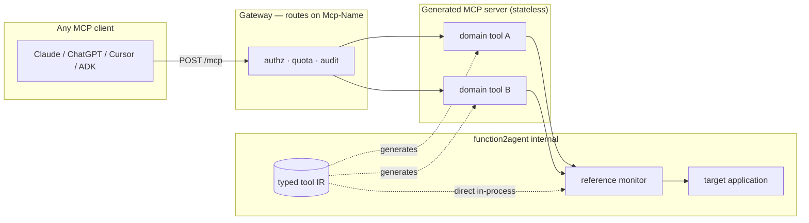

# 09 — MCP as the Tool Surface

**Last researched: 2026-08-02**

## TL;DR

> - **MCP should be an export adapter, not the internal calling convention.** This confirms and sharpens the position taken in `01-agent-anatomy.md` §5.6 — with one refinement: the *generated MCP server* is a legitimate first-class product artifact and probably a headline feature. It is the *runtime calling path for `function2agent`'s own agents* that should stay internal and typed.
> - **The spec broke compatibility again five days ago.** `2026-07-28` removed the `initialize` handshake, `Mcp-Session-Id`, `ping`, `logging/setLevel`, SSE resumability, and all server-initiated requests. By MCP's own versioning policy — the version bumps *only* for backwards-incompatible changes — that is the **fourth** break in ~20 months, not the first. A protocol churning this fast is a bad load-bearing internal abstraction and a fine export target.
> - **A hard engineering constraint falls out of that:** the spec's own compatibility matrix says *legacy client + modern server = fails*, and "legacy clients have no fall-forward mechanism." Every deployed client is legacy today. **Generated servers must be dual-era** for at least a year.
> - **Code mode is still blocked over MCP connectors.** Verified against Anthropic's live docs (2026-08-02): "The following tools cannot be called programmatically: Tools provided by an MCP connector." Unchanged since `01-agent-anatomy.md` §5.5 recorded it. If you want code mode over MCP tools, you build the sandbox yourself.
> - **Progressive disclosure is not in the protocol.** `defer_loading`, tool search, and programmatic calling are *client/API-vendor* features (Anthropic, OpenAI), not MCP spec features. A generated server exposing 300 tools has no protocol-level way to hide them.
> - **The loudest lesson from prior art is anti-auto-generation.** The author of FastMCP — the library behind a large share of all MCP servers — publicly argues that mechanically converting an API surface into tools produces servers that "technically work but fail in practice." `function2agent`'s defensible value is *curation and consolidation*, not conversion. If the product ships a 1:1 endpoint→tool mapper, it ships the known anti-pattern.
> - **Competitive gap found.** Plenty of tools do OpenAPI→MCP. Plenty of tools do codebase→MCP *for code navigation*. I found **nothing** doing codebase→MCP for the target application's own *domain operations*. That is the actual white space.
> - **Transport aligns.** The product wants HTTP/SSE. MCP's current transport is Streamable HTTP, which is HTTP POST with an optional SSE-framed response body. Legacy HTTP+SSE is formally deprecated. No conflict, but do not build on the deprecated transport.

---

## 1. MCP's current state, verified

### 1.1 Version and timing

The current specification revision is **`2026-07-28`**, released **2026-07-28** — five days before this document's research date. Revision history:

| Revision | Notable for |
|---|---|
| `2024-11-05` | Initial release. stdio + HTTP+SSE. |
| `2025-03-26` | **Streamable HTTP** introduced; HTTP+SSE deprecated. OAuth 2.1. |
| `2025-06-18` | Authorization split into resource/authorization server roles. |
| `2025-11-25` | Elicitation, tasks (experimental), URL-mode elicitation. |
| `2026-07-28` | **Stateless core.** Handshake and sessions removed. |

Note the cadence — and note what the version string *means*. Per the [versioning policy](https://modelcontextprotocol.io/specification/versioning), the identifier is `YYYY-MM-DD` indicating "the last date backwards incompatible changes were made," and the version is explicitly **not** incremented for backwards-compatible updates. By the project's own definition, therefore, **every one of those four revisions after the initial release marks a backwards-incompatible change** — four breaks in roughly 20 months, of which `2026-07-28` is by far the largest.

This is the single most important fact for a product deciding whether to make MCP load-bearing. `01-agent-anatomy.md` §5.6's claim that the wire format "broke compatibility at least once" is correct but understates it substantially.

### 1.2 What `2026-07-28` changed (breaking)

From the official changelog ([modelcontextprotocol.io](https://modelcontextprotocol.io/specification/2026-07-28/changelog)):

1. **`initialize` / `notifications/initialized` removed.** Every request now self-describes, carrying `io.modelcontextprotocol/protocolVersion` and `io.modelcontextprotocol/clientCapabilities` in `_meta` (SEP-2575). Version mismatches return `UnsupportedProtocolVersionError`.
2. **`Mcp-Session-Id` removed** from Streamable HTTP (SEP-2567). List endpoints no longer vary per connection. Servers needing cross-call state must "mint an explicit handle from a tool and have the model pass it back as an argument."
3. **`server/discover` added.** Servers **MUST** implement it; clients **MAY** call it. Optional up-front capability negotiation replaces mandatory handshake.
4. **Server-initiated requests replaced by Multi Round-Trip Requests (MRTR)** (SEP-2322). Instead of the server calling back to the client mid-request, it returns `resultType: "input_required"` with `inputRequests`; the client retries the original call with `inputResponses` attached. This kills `sampling/createMessage`, `elicitation/create`, and `roots/list` as server-initiated calls.
5. **All results carry a required `resultType`** field (`"complete"` | `"input_required"`).
6. **SSE stream resumability removed** — `Last-Event-ID` and SSE event IDs are gone. A broken stream loses the in-flight request; the client must re-issue with a new request ID.
7. **`ping`, `logging/setLevel`, `notifications/roots/list_changed` removed.**
8. **`resources/subscribe`/`unsubscribe` and the HTTP GET endpoint replaced** by a single `subscriptions/listen` long-lived POST stream with per-type opt-in.

Deprecated (12-month minimum window under the new lifecycle policy): **Roots, Sampling, and Logging** (SEP-2577); the legacy **HTTP+SSE transport** (SEP-2596); **OAuth Dynamic Client Registration** in favor of Client ID Metadata Documents.

Two changes cut *in favor* of this product:

- **SEP-2106 loosened `inputSchema`/`outputSchema`** to allow any JSON Schema 2020-12 keywords, added `$ref` resolution requirements and composition-keyword resource bounds. This materially improves the schema-expressiveness story (§4.3).
- **SEP-2549 added `ttlMs` and `cacheScope`** to list results, plus a **SHOULD** that `tools/list` return tools in deterministic order to keep upstream prompt caches stable. Relevant if you generate large catalogs.

### 1.3 Governance — verified

The sibling doc's report is correct. MCP was donated by Anthropic to the **Agentic AI Foundation (AAIF)**, a Linux Foundation directed fund, in **December 2025** ([GitHub Blog](https://github.blog/open-source/maintainers/mcp-joins-the-linux-foundation-what-this-means-for-developers-building-the-next-era-of-ai-tools-and-agents/)).

Important nuance: **the foundation move changed stewardship, not technical control.** Per the [governance page](https://modelcontextprotocol.io/community/governance), decision-making remains a BDFL model — **Lead Maintainers David Soria Parra and Den Delimarsky hold final authority and veto**. Core Maintainers (Peter Alexander, Caitie McCaffrey, Kurtis Van Gent, Clare Liguori, Paul Carleton, Nick Cooper, Nick Aldridge, Che Liu) steer direction and can veto Maintainers by majority. Membership is held by *individuals*, not employers, with no term limits.

Maintainers do span the major labs — at the MCP Dev Summit, maintainers from **Anthropic, AWS, Microsoft, and OpenAI** appeared jointly ([The New Stack](https://thenewstack.io/mcp-maintainers-enterprise-roadmap/)). So the multi-lab claim is true at the *maintainer* level.

**Read this correctly for risk purposes.** Linux Foundation stewardship gives you trademark neutrality, a CLA regime, and a 12-month deprecation policy. It does *not* give you a slow-moving, consensus-bound standards body. Two people can still land a breaking change, and in July 2026 they did. Treat "it's a Linux Foundation project" as a durability signal, not a stability signal.

> **Notable positioning quote**, from OpenAI's Nick Cooper, an MCP Core Maintainer: *"MCP itself should stay narrow: Connecting AI to data sources. Identity, observability, and governance should come in as other projects."* If you were hoping the protocol would eventually solve tool curation, policy, or provenance for you — the maintainers are saying it will not.

### 1.4 The compatibility story — and the one fact that dictates an engineering requirement

The spec now formally distinguishes **modern** implementations (`2026-07-28`+, per-request metadata) from **legacy** ones (`2025-11-25` and earlier, `initialize` handshake), and defines a **dual-era** implementation supporting both. The [compatibility matrix](https://modelcontextprotocol.io/specification/2026-07-28/basic/versioning) is unambiguous:

| Client | Server | Outcome |
|---|---|---|
| Modern | Modern | Works |
| Modern | Legacy | **Fails** |
| Dual-era | Modern | Works |
| Dual-era | Legacy | Works |
| **Legacy** | **Modern** | **Fails — "legacy clients have no fall-forward mechanism"** |
| Legacy | Dual-era | Works |

Read the bolded row carefully, because it is a hard product constraint. **Every MCP client shipping today is legacy.** The spec is five days old; SDKs support it, deployed clients do not yet. A generated server that speaks only `2026-07-28` fails against Claude, ChatGPT, Cursor, and Gemini *right now* — and fails badly: on HTTP the legacy client's request is rejected with a bare `400`, on stdio with an implementation-defined error, and the legacy client has no mechanism to retry downward.

**Therefore: `function2agent`'s generated servers must be dual-era**, serving legacy `initialize` and modern per-request `_meta` concurrently on the same endpoint (which the spec explicitly permits). This is not optional for at least a year. It is also a nontrivial amount of generated machinery — session handling for the legacy path, statelessness for the modern one — and it is exactly the kind of protocol-churn absorption that belongs in *one* generator backend rather than smeared across a runtime.

The one genuinely reassuring development: the new **feature lifecycle policy** guarantees a **twelve-month minimum** deprecation window (with a ninety-day expedited exception) and a public [deprecated features registry](https://modelcontextprotocol.io/specification/2026-07-28/deprecated). That constrains *removals* going forward. It did not constrain the `2026-07-28` core changes, which were not deprecations — they were removals executed in the same revision that introduced the policy.

---

## 2. Adoption reality check

**MCP is genuinely the universal standard for *announcing* tool support, and unevenly implemented beneath that.** Both halves matter.

The strongest evidence for real adoption: Tier 1 SDK downloads are near **half a billion per month**, with TypeScript and Python each past a billion cumulative ([MCP blog, 2026-07-28](https://blog.modelcontextprotocol.io/posts/2026-07-28/)). The `2026-07-28` launch shipped with same-day support statements from AWS (Bedrock AgentCore), Microsoft (Foundry), Google Cloud, Cloudflare, Netlify, Figma, Supabase, Sentry, and Linear. That is not a paper standard.

The evidence for unevenness is equally concrete. The best author-verified cross-vendor audit I found ([hidekazu-konishi.com, snapshot 2026-05](https://hidekazu-konishi.com/entry/mcp_server_implementation_reference.html), pinned to spec `2025-11-25`):

| Primitive | Anthropic | OpenAI | Google | Cloudflare | AWS |
|---|---|---|---|---|---|
| **Tools** | Full | Full | Full | Full | Full |
| Resources | Partial | Partial (ChatGPT only, not Responses API) | Full | Full | Partial |
| Prompts | Partial | Partial (ChatGPT only) | Full | Full | Partial |
| Sampling | Full | Partial (ChatGPT Ent/Edu) | Full | N/A | Partial |
| Roots | Full | Partial | Full | Partial | Partial |
| Elicitation | Beta | N/A | Beta | N/A | N/A |

Read the top row and the rest separately. **Tools are universally, fully implemented. Everything else is a coin flip.** Specifically:

- **Anthropic's own Messages API MCP Connector calls only `tools/list` and `tools/call`** — resources, prompts, and sampling are not exposed even when the server implements them. Anthropic describes this as deliberate beta scoping with no public ship date for full coverage.
- **OpenAI's Responses API likewise drives only `tools/list` and `tools/call`.** ChatGPT (the consumer product) supports all three server primitives; the API does not. Same vendor, different answer.
- **OpenAI is remote-only** — Streamable HTTP, no stdio, no local servers. Anthropic and the IDEs support both.
- **Google** is the most complete client-side implementation via ADK's `MCPToolset`, but Gemini's third-party server support lagged its first-party servers through 2026, and it renders structured output rather than interactive UI.
- **Elicitation** — the newest primitive at the time of that audit — was Beta or absent everywhere. It has now been *redesigned* into MRTR before ever getting a flagship implementation.

**xAI:** I could not verify first-party MCP client support for Grok from a primary source. Treat xAI as unverified rather than absent.

**The actionable conclusion for `function2agent`:** if you generate an MCP server, **generate tools and nothing else.** Resources and prompts are a portability trap — you will build them, and Anthropic's and OpenAI's APIs will ignore them. Tools are the only primitive with universal, complete support, and conveniently tools are exactly what this product produces.

---

## 3. Transport and serving

### 3.1 Current state

| Transport | Status (as of `2026-07-28`) |
|---|---|
| **stdio** | Active. Local subprocess, JSON-RPC over stdin/stdout. |
| **Streamable HTTP** | Active, the remote transport. |
| **HTTP+SSE (legacy)** | **Deprecated** since `2025-03-26`; formally reclassified Deprecated under the lifecycle policy in `2026-07-28` (SEP-2596), 12-month offramp. |

"Streamable HTTP" is frequently misunderstood as a separate thing from SSE. It is not. It is a single endpoint that accepts HTTP `POST` of a JSON-RPC message and returns **either** `application/json` **or** a `text/event-stream` (SSE-framed) response body when the server wants to stream. As of `2026-07-28` the separate `GET`-for-notifications endpoint is gone, replaced by `subscriptions/listen` — itself a long-lived POST response stream.

A conforming request now looks like this:

```http
POST /mcp HTTP/1.1
MCP-Protocol-Version: 2026-07-28
Mcp-Method: tools/call
Mcp-Name: search
Content-Type: application/json

{"jsonrpc":"2.0","id":1,"method":"tools/call",
 "params":{"name":"search","arguments":{"q":"otters"},
   "_meta":{"io.modelcontextprotocol/protocolVersion":"2026-07-28",
            "io.modelcontextprotocol/clientInfo":{"name":"my-app","version":"1.0"}}}}
```

`Mcp-Method` and `Mcp-Name` are now **required** on Streamable HTTP POSTs (SEP-2243) so gateways, rate limiters, and WAFs can route and meter without parsing bodies.

### 3.2 Does this align with the product's HTTP/SSE requirement?

**Yes, and the `2026-07-28` changes actively help.** The product's stated integration surface is HTTP/SSE plus an embeddable iframe. Three points of alignment:

1. **Stateless servers are trivially deployable.** No session store, no sticky sessions, no drain logic. Any generated server can sit behind round-robin load balancing or run on serverless. For a product that generates and hosts many servers per customer, this removes the single worst operational tax MCP previously imposed.
2. **Header-based routing is a gift for a multi-tenant generator.** You can route, authorize, quota, and audit per-tool at the gateway on `Mcp-Name` without deserializing the body. If you generate hundreds of tools across tenants, this is how you keep policy out of the tool implementations.
3. **The generated server is a plain HTTP service.** It composes with the existing product surface rather than competing with it.

One real conflict to design around: **stream resumability is gone.** If a long-running generated tool (a migration, a batch job, a build) streams progress and the connection drops, the request is lost and must be re-issued with a new ID. For anything long-running, use the **`io.modelcontextprotocol/tasks` extension** (poll-based `tasks/get` / `tasks/update`) rather than a held-open stream. Note this is now an *extension*, not core — so client support will be partial for a while.



The diagram encodes the recommendation: one typed intermediate representation, from which the MCP server is *emitted*, while the product's own agents call through the same reference monitor without paying the protocol tax.

---

## 4. Limitations that bear on this product

### 4.1 Code mode is still blocked over MCP connectors — verified 2026-08-02

`01-agent-anatomy.md` §5.6 flagged this. **It is still true.** From Anthropic's live programmatic-tool-calling documentation, under "Tool restrictions":

> The following tools cannot be called programmatically:
> * Tools provided by an [MCP connector](https://docs.claude.com/en/docs/agents-and-tools/mcp-connector)

Corroborated independently by LiteLLM's provider docs, which list the same restriction alongside web search and web fetch.

This matters more than it first appears, because of a second finding: **progressive disclosure and programmatic calling are not MCP features at all.** `defer_loading`, the tool search tool, and `allowed_callers` are **Anthropic Messages API** constructs. OpenAI shipped an analogous `defer_loading` on MCP server definitions in the Responses API. The concept has cross-vendor convergence *through parallel proprietary implementation, not through the protocol.* The MCP specification has no concept of deferred loading, tool search, or programmatic invocation — and after `2026-07-28` it still does not.

So the honest framing of the code-mode question:

| If you… | Code mode available? |
|---|---|
| Call tools you define directly in the Messages API | **Yes** — set `allowed_callers: ["code_execution_20260120"]` |
| Call tools via Anthropic's MCP connector | **No** — explicitly excluded |
| Call MCP tools through **your own** client + sandbox | **Yes** — you are the client; you can expose MCP tools as a code API yourself |

That third row is the escape hatch and it is the one Anthropic's own famous demo used: the "MCP servers as a directory of TypeScript modules" pattern in [Code execution with MCP](https://www.anthropic.com/engineering/code-execution-with-mcp) is implemented *by the client*, not by the protocol. The 98.7% (150k → 2k tokens) figure came from a client-side filesystem abstraction over MCP servers, not from anything MCP provides.

**Implication:** MCP does not forbid code mode. It just gives you nothing to help, and the most convenient managed path (Anthropic's connector) forecloses it. If `function2agent` wants code mode's 58–99% token savings (`01-agent-anatomy.md` §5.5 table), it must own the execution sandbox regardless. Which means it must own an internal tool representation regardless. **This is the strongest single argument against MCP-as-internal-convention, and it survives verification.**

### 4.2 Tool count and context cost — the protocol offers essentially nothing

This is the sharpest limitation for a product whose stated behavior is generating tools from an entire application's CRUD and domain surface.

Cross-referencing `01-agent-anatomy.md` §5.2: tool selection degrades past **30–50 tools**, and a five-server MCP setup costs **~55,000 tokens** in definitions before the agent reads the request. A generated server over a large application will blow through both numbers immediately.

What the protocol gives you:

| Mechanism | In MCP spec? | Notes |
|---|---|---|
| Cursor pagination on `tools/list` | Yes | Paginates transport, not context. Clients fetch all pages anyway. |
| `listChanged` notification / `subscriptions/listen` | Yes | Server can *change* the list; can't know what the agent needs. |
| `ttlMs` / `cacheScope` / deterministic ordering | Yes (`2026-07-28`) | Helps prompt-cache stability. Does not reduce the catalog. |
| Namespacing | **No** | Convention only (`server__tool`), applied by clients. |
| Tool search / semantic discovery | **No** | Vendor features (Anthropic, OpenAI, AWS AgentCore Gateway). |
| `defer_loading` | **No** | Anthropic/OpenAI API-level. |
| Server-declared tool subsets / profiles | **No** | Not in spec. |

**There is no protocol-level progressive disclosure.** A generated MCP server's only real levers are (a) expose fewer tools, and (b) name and describe them well. Both are *design* decisions made at generation time, in `function2agent`'s own IR — not protocol features.

This inverts a naive reading of the product question. Making MCP the output does not solve the tool-count problem; it *removes your tools from the layer where the problem is solvable*. Once tools are behind `tools/list`, you have handed control of disclosure to a client you do not own, whose disclosure features are proprietary and differ per vendor.

### 4.3 Schema expressiveness

Better than it used to be. **SEP-2106** (`2026-07-28`) loosened `inputSchema`/`outputSchema` to permit **any JSON Schema 2020-12 keywords**, allow `structuredContent` to be any JSON value, and added `$ref` resolution requirements plus bounds on composition keywords. Before this, servers were constrained to a narrow subset.

Mapping real typed signatures across languages onto JSON Schema 2020-12, the impedance is:

| Source-language construct | JSON Schema 2020-12 | Verdict |
|---|---|---|
| Primitives, records/structs, arrays, maps | Native | Clean |
| Optional / nullable | `anyOf` + `null`, or omit from `required` | Clean |
| Enums, literal unions | `enum`, `const` | Clean |
| Tagged unions / sum types (Rust `enum`, TS discriminated union, Scala ADT) | `oneOf` + discriminator | Workable, verbose |
| Generics / parametric polymorphism | Must be monomorphized at generation time | **Lossy** |
| Recursive types | `$ref` — now spec-supported | Workable, but see below |
| Newtypes / branded types / value objects (`UserId` vs `string`) | Erased to base type + `description` | **Lossy — and consequential** |
| Ownership, lifetimes, effects, nullability contracts | No representation | **Lost** |
| Interface/trait polymorphism, callbacks, closures | No representation | **Not expressible** |

Two of these bite specifically:

1. **Newtype erasure.** `transfer(from: AccountId, to: AccountId, amount: Money)` degenerates to three strings-and-a-number. The type system's protection against argument transposition — exactly the mistake an LLM makes — is erased at the boundary. Mitigation is prose in `description` and runtime validation on the server side, both of which you must generate.
2. **Recursive schemas interact badly with code mode.** Anthropic's docs note that cyclic schemas force a tool to be direct-only; the workaround is unrolling to fixed depth or degrading to `{"type": "object"}` with a prose description. If you auto-generate from recursive domain types (trees, ASTs, nested comment threads), plan for this.

**Net:** JSON Schema is an adequate lowest common denominator and `2026-07-28` made it meaningfully better. But it is strictly less expressive than the typed signatures you extract. That is an argument for keeping a richer internal IR and *projecting down* to JSON Schema at the MCP boundary — not for making the lossy form your canonical representation.

### 4.4 Statefulness, sessions, streaming, progress, cancellation

`2026-07-28` changed all of this at once:

- **Sessions:** gone at the protocol level. The prescribed replacement is server-minted handles passed as ordinary tool arguments. The maintainers argue this is better: *"the model can see the handle and thread it between tools."* For a generated server over an application with transactions, cursors, or multi-step workflows, **you must design handle-passing explicitly.** It will not come free from a mechanical translation of the target codebase.
- **Streaming:** available via SSE-framed response bodies, but **not resumable**. A dropped connection loses the request.
- **Progress:** `notifications/progress` still flows on the response stream of its originating request.
- **Cancellation:** `notifications/cancelled` remains.
- **Long-running work:** use the `io.modelcontextprotocol/tasks` extension (poll-based). Being an extension, expect partial client support.
- **Mid-call user input:** MRTR. The server returns `input_required`; the client re-issues with answers. Supabase specifically called this out as unblocking confirm-before-destructive-action prompts on a stateless server — directly relevant if generated tools touch production data.

### 4.5 Latency and overhead vs. in-process calls

I found no rigorous published benchmark isolating MCP protocol overhead against equivalent in-process calls, so treat this as **reasoned estimate, not measured fact**.

Structurally, per MCP tool call over Streamable HTTP you pay: JSON-RPC serialization, an HTTP round trip (TLS + network), gateway hops, JSON deserialization, then the actual work. In-process you pay a function call. For a millisecond-scale domain operation, the protocol dominates. For anything touching a database or network, it is noise.

The overhead that actually matters is not per-call latency — it is **model round-trips**. Each direct tool call is a full reasoning cycle. The measured code-mode results (`01-agent-anatomy.md` §5.5: 58% at 96 tools, 92.8% at 508 tools, ~7% latency increase per call) show that collapsing many calls into one sandboxed program dwarfs any transport savings. One data point worth noting on cost accounting: with Anthropic's programmatic tool calling, intermediate results **do not count toward the token bill** — a real economic difference, and one unavailable through the MCP connector path (§4.1).

---

## 5. Prior art on generating MCP servers from code

### 5.1 What exists

| Tool | Input | Output | Notes |
|---|---|---|---|
| **FastMCP** `from_openapi()` / `from_fastapi()` | OpenAPI 3.x, FastAPI app | Live server | The dominant library. `RouteMap` rules match on method/pattern/tags → `TOOL`/`RESOURCE`/`RESOURCE_TEMPLATE`/`EXCLUDE`. |
| **Stainless** | OpenAPI | Generated TS server + SDK | Managed. Per-resource/endpoint opt-in; end-user `--tool`/`--resource`/`--operation` filters. |
| **AWS Bedrock AgentCore Gateway** | OpenAPI, Lambda, Smithy | Managed MCP gateway | Built-in **semantic tool search**. The most production-grade of the set. |
| `openapi-mcp-generator` | OpenAPI | Typed Node project | Multi-transport. |
| `mcpgen` | OpenAPI, Postman | Owned Python source | Emits code you own; no runtime dep. |
| `mcp-gen` | OpenAPI 3 | TS or Python project | Incremental regeneration preserving custom code. |
| `mcpify` | OpenAPI | Runtime proxy | Single binary, no codegen. |
| Higress `openapi-to-mcp` | OpenAPI (bulk) | MCP configs | Gateway-oriented. |

Adjacent and instructive: **Cloudflare's Code Mode** collapsed a 2,500-endpoint API to ~1,000 tokens by exposing exactly two tools — `search()` and `execute()` — backed by a V8 isolate, rather than 2,500 MCP tools. That is a ~99.9% reduction and it is the strongest existence proof that *the right answer to a huge surface is not more tools.*

### 5.2 The codebase→MCP gap

I searched specifically for products doing "codebase → MCP server." What exists is a large, crowded category of MCP servers that **expose code navigation**: `tree-sitter-analyzer`, `mcp-codebase-index`, `mcp-codebase-intelligence`, `code-intelligence-mcp`, `codebase-synapse`. These parse a repo with tree-sitter into a SQLite/graph index and expose tools like `get_callers`, `impact_analysis`, `find_symbol`, `architecture_diagram`.

**These are not competitors. They are the wrong axis.** They give an agent tools to *read your code*. `function2agent` proposes to give an agent tools to *invoke your application's domain operations*. I found no product doing the latter from arbitrary source.

The nearest neighbors are the OpenAPI converters (§5.1) — which require you to already have an HTTP API with a spec, and therefore cannot serve the "any codebase in any language" case, including internal service layers, batch jobs, and domain logic never exposed over HTTP. **That is the white space, and it is real.** Flagging one uncertainty: absence of evidence in web search is weak evidence of absence, particularly for stealth or enterprise-only products.

### 5.3 The lesson prior art actually teaches — and it is a warning

The most important finding in this entire section is that **the people who built the auto-generation tooling are publicly telling people to stop using it that way.**

Jeremiah Lowin, author of FastMCP — a library he estimates powers ~70% of MCP servers across all languages — published [*Stop Converting Your REST APIs to MCP*](https://jlowin.dev/blog/stop-converting-rest-apis-to-mcp):

> "An API built for a human will poison your AI agent… LLMs achieve significantly better performance with well-designed, tailored MCP servers than with auto-converted ones."

His two mechanisms are precisely the ones in `01-agent-anatomy.md` §5.2: **context pollution** (every tool's schema is processed on every reasoning turn) and **atomicity as an agent anti-pattern** (each call is a full reasoning cycle, so forcing an agent to chain atomic calls is "slow, error-prone, and burns through tokens"). FastMCP's *own documentation* now carries this warning inline on the OpenAPI integration page.

Christian Posta frames the fix concretely: instead of exposing `check_inventory`, `reserve_inventory`, `get_packaging`, `find_shipper`, `verify_address`, `request_shipping`, `get_tracking` — expose **`fulfill_order(12345)`** returning *"Order #12345 shipped via carrier X, tracking ABC123."* The multi-step orchestration belongs in the tool, not in the model.

**This is the most consequential finding for `function2agent`'s product design, independent of the MCP question.** The product's pitch — static analysis decomposes a codebase, tools are synthesized from its functionality — describes a mechanical mapping. Mechanical mapping is the documented anti-pattern. The defensible product is the one that does what the blog posts say humans should do by hand:

- **Consolidate** call-graph clusters into outcome-named tools (`fulfill_order`, not seven CRUD calls). The static analysis that finds architectural layers is exactly the analysis that can find these clusters — this is a genuine technical advantage over a spec-based converter, which sees only endpoints.
- **Exclude** aggressively. Pagination plumbing, internal helpers, read-your-own-writes endpoints.
- **Write descriptions for a reader who has never seen the codebase**, since identifier names alone are semantically thin.
- **Measure** first-try tool-selection accuracy against the smallest catalog that covers the job.

If `function2agent` ships 1:1 function→tool mapping, it ships a known-bad artifact at scale. If it ships curation-by-analysis, the anti-pattern literature becomes its marketing.

---

## 6. Alternatives to MCP for the same job

| Approach | Expressiveness | Portability | Token efficiency | Ecosystem reach |
|---|---|---|---|---|
| **MCP tools** | JSON Schema 2020-12; no effects/policy metadata | Highest — one server, all major clients | Poor by default; no protocol-level disclosure | Largest; 10k+ servers, ~0.5B SDK downloads/mo |
| **Provider-native schemas** (Anthropic `tools`, OpenAI functions, Gemini declarations) | Best — access to `allowed_callers`, `defer_loading`, `strict`, cache control | Low; rebuild per provider | **Best** — the only path to managed code mode + tool search | Per-provider |
| **OpenAPI / JSON Schema** | Rich HTTP semantics; same type-erasure limits | High as an artifact; needs an adapter per consumer | Poor — same tool-count problem | Enormous outside AI |
| **Code mode / code-execution-as-tool-calling** | Full host-language expressiveness — real types, control flow, composition | Medium; needs a sandbox, but the *API surface* is portable source | **Best measured** — 58–99% input reduction | Growing; Cloudflare, Anthropic, Cursor |
| **Language-native introspection** (reflection, type providers, LSP) | **Highest** — the actual type system, effects, visibility | Lowest; per-language | N/A (an extraction technique) | N/A |

The right reading of this table is that these operate at **different layers and are not substitutes**:

- **Language-native introspection is the input** — it is how you derive a faithful IR from arbitrary source.
- **The typed internal IR is the canonical form** — the only representation that can carry `read_only`, `egress`, and idempotence metadata, which `01-agent-anatomy.md` §8.5 identifies as load-bearing for compile-time lethal-trifecta detection. **Neither MCP nor OpenAPI has anywhere to put those fields**, which is by itself close to decisive.
- **Code mode is a calling convention** projected from the IR, where the token wins live.
- **MCP and provider-native schemas are export targets** projected from the same IR.

One important non-obvious point: code mode and MCP are **complementary, not competing**. Anthropic's code-mode demo was *about MCP servers* — presenting them as a filesystem of TypeScript modules. The generated MCP server can be both a standalone product artifact *and* the thing your own sandbox imports as a code API.

---

## 7. Security posture — deltas only

Trust model, tool poisoning, schema-drift pinning, and the finding that larger models show *higher* poisoning attack success rates are covered in **`01-agent-anatomy.md` §5.6**. The MCP authorization spec (OAuth 2.1, PRM, resource indicators, and the `2026-07-28` changes: RFC 9207 `iss` validation, DCR → Client ID Metadata Documents, issuer-bound credentials) is covered in depth in **`research/08-auth-identity-and-secrets.md`**. Do not re-derive either here.

What is genuinely new when you **auto-generate** servers over a target application:

1. **Generation inverts the trust direction, and this is underappreciated.** The existing literature treats the MCP server as untrusted input to your agent. When `function2agent` *emits* the server, the customer's users become clients of a surface **you generated but did not review**. Nobody read those tools. A mis-derived tool that exposes an internal admin path is a vulnerability you shipped, at machine scale, across every customer. The mitigation is the same static analysis that generates the tools: derive `read_only` and `egress` per tool, refuse to expose anything that fails policy, and make destructive tools require MRTR confirmation.

2. **Blast radius is multiplied by templating.** A hand-written server's bug affects one server. A generation bug affects every server the product ever emitted. This argues for versioned, pinned generator templates and the ability to identify and re-emit affected servers — closer to a compiler's security posture than an application's.

3. **Provenance and attestation: nothing in the protocol.** MCP has no signing, attestation, or provenance mechanism for tool definitions. `server/discover` returns identity but it is self-asserted. The `_meta` extension mechanism (`io.modelcontextprotocol/` for official, vendor prefixes for third-party) is the only place to attach a signed manifest, and no client would validate it today. If provenance matters — "this tool was generated from commit `abc123` of repo X by generator v2.1, and here is the signature" — **you must define it as a vendor `_meta` extension and validate it in your own client.** That is a differentiator available to a product that owns both ends, and it is unavailable to anyone consuming your server through a third-party client.

4. **Schema-drift pinning cuts both ways here.** §5.6 recommends pinning and hashing tool schemas at onboarding and alerting on drift. A *generated* server's schemas change every time the target codebase changes. You need a deliberate story for "the code changed, so the tools changed" that does not read as an attack to a drift detector. Content-address tools by source commit.

---

## 8. Recommendation

### 8.1 The call

**MCP is an export adapter and a first-class product artifact. It is not the internal calling convention.**

Concretely, four layers:

| Layer | Choice |
|---|---|
| **Extraction** | Language-native introspection (LSP/AST/type providers) → typed internal IR carrying `read_only`, `egress`, idempotence, cost, auth scope. |
| **Canonical form** | The typed IR. Single source of truth. All policy and safety analysis happens here. |
| **Internal calling** | Direct, in-process, through the reference monitor. Code mode as a *per-tool policy* projected from the IR. |
| **Export** | MCP server (tools only) as a headline artifact; provider-native schemas and OpenAPI as additional adapters from the same IR. |

Made concrete — an IR entry for a consolidated tool, and what survives the projection to MCP:

```jsonc
// Internal IR — canonical. Derived from static analysis of the target codebase.
{
  "name": "fulfill_order",
  "consolidates": ["reserveInventory", "computePackaging", "selectCarrier",
                   "verifyAddress", "createShipment"],   // §5.3 consolidation
  "source": { "repo": "acme/orders", "commit": "abc123", "symbol": "OrderService.fulfill" },
  "params": { "orderId": { "newtype": "OrderId", "base": "string" } },
  "effects": {
    "read_only": false,        // ← drives parallelization safety      (§8.5)
    "egress": ["carrier-api"], // ← drives lethal-trifecta detection   (§8.5)
    "idempotent": false,
    "destructive": true,       // ← drives MRTR confirm-before-act
    "auth_scope": "orders:write"
  }
}
```

```jsonc
// Projected MCP tool. Note what is gone.
{
  "name": "fulfill_order",
  "description": "Reserve inventory, package, select a carrier, and ship an order. \
Destructive: creates a real shipment. `orderId` is an OrderId, not a customer or SKU id.",
  "inputSchema": {                       // JSON Schema 2020-12 (SEP-2106)
    "type": "object",
    "properties": { "orderId": { "type": "string" } },   // ← newtype ERASED (§4.3)
    "required": ["orderId"]
  }
  // read_only, egress, idempotent, destructive, auth_scope: NO SLOT EXISTS.
  // Provenance (repo/commit/generator signature): NO SLOT EXISTS — §7.3.
}
```

Everything load-bearing for safety survives only as English prose in `description`, enforced by nothing. That is the argument of §8.2 refinement 2 in one diff.

### 8.2 Engaging with `01-agent-anatomy.md` §5.6

That section argues MCP should be an export surface but not the internal calling convention, for three reasons. Verified, one at a time:

| §5.6 reason | Verdict |
|---|---|
| Connector tools can't be called programmatically, blocking code mode | **Confirmed, verbatim, in Anthropic's live docs as of 2026-08-02.** Strengthened by the further finding that progressive disclosure and programmatic calling are *entirely absent from the protocol* — they are proprietary client features. So MCP-as-internal wouldn't just block Anthropic's managed code mode; it gives you no disclosure mechanism at all. |
| The trust model forces re-validation at the boundary anyway | **Confirmed and extended.** Generation inverts trust direction (§7.1) and multiplies blast radius (§7.2). MCP still offers no provenance primitive. |
| The wire format broke once and will again | **Confirmed and then some.** It broke again on 2026-07-28 — handshake, sessions, `ping`, logging, SSE resumability, and all server-initiated requests, in one revision. The new 12-month deprecation policy softens *removals* but the `2026-07-28` core changes were not deprecations. |

**I agree with the position and refine it in two ways.**

**Refinement 1 — "export surface" undersells it.** §5.6's framing ("a promoted function should be able to appear as an MCP tool") reads as an interop nicety. Given the §5.2 competitive gap — nobody generates domain-operation MCP servers from arbitrary source — the generated MCP server is plausibly the *most legible thing the product produces*. "Point it at your repo, get an MCP server your whole company can use from Claude, ChatGPT, Cursor, and Gemini" is a sharper pitch than the multi-agent system. Export in *architecture*, headline in *product*.

**Refinement 2 — add a fourth reason, which may be the strongest.** MCP tool schemas have **nowhere to put the metadata the safety story depends on.** `01-agent-anatomy.md` §8.5 makes compile-time lethal-trifecta detection the project's strongest differentiator, and it requires `read_only` and `egress` per tool. JSON Schema has no slot for them; MCP has no convention for them. You could smuggle them through `_meta`, but no client would enforce them. **If MCP were the canonical representation, the differentiating safety property would be unrepresentable.** That is an architectural disqualification, not a preference.

### 8.3 Migration and versioning risk

| Risk | Severity | Mitigation |
|---|---|---|
| Another breaking revision | **High** — two breaks in 20 months, most recent 5 days ago | Confine MCP to a generator backend behind the IR. Emit for a pinned revision; support N and N-1. |
| Client lag behind spec | **High** — every deployed client is legacy; a modern-only server fails against all of them (§1.4) | **Emit dual-era servers.** Non-negotiable for ~12 months. One generator absorbs both eras. |
| Extensions fragment | Medium — tasks, MCP Apps, EMA all now extensions | Depend on core tools only. Treat tasks as optional enhancement. |
| Vendor primitive gaps persist | Medium — resources/prompts/sampling uneven for 18 months | **Generate tools only.** |
| Governance concentration | Low–Medium — BDFL model persists under LF | Accept. Multi-lab maintainers cap the risk. |

**Cost of being wrong is asymmetric and that is the whole argument.** If MCP is an adapter and MCP wins, you lose nothing. If MCP is the core and MCP breaks again, every generated artifact and the runtime need migration simultaneously. Adapter-shaped bets are cheap to be wrong about.

### 8.4 What would flip this

Ordered by likelihood:

1. **MCP adds progressive disclosure to the protocol.** A spec-level tool-search or capability-scoping primitive — server-declared tool subsets, semantic discovery, deferred loading — removes §4.2, the largest technical objection. AWS AgentCore already ships semantic tool search proprietarily, so there is an obvious donation path. *Watch: SEPs from the Tool Discovery working group.*
2. **Anthropic lifts the connector restriction on programmatic tool calling.** Removes §4.1 and makes MCP-native code mode viable without owning a sandbox. Cheapest change on this list for Anthropic to make. *Watch: the "Tool restrictions" section of the programmatic-tool-calling docs — a one-line deletion flips it.*
3. **A tool-metadata convention emerges for effects/permissions.** A standard `_meta` vocabulary for `read_only`/`egress` that clients actually enforce would remove §8.2's fourth reason.
4. **The spec goes ≥18 months without a breaking change.** Would convert MCP from a moving target into an infrastructure-grade dependency. Earliest possible evidence: early 2028.
5. **A credible competing standard fragments the ecosystem.** Would *strengthen* the recommendation, not flip it — adapter architecture is exactly what survives a standards war.

Items 1 and 2 together would justify revisiting MCP as the internal convention. Either alone would not.

### 8.5 What to build first

1. **Typed IR with effects metadata.** Everything depends on it. `read_only` and `egress` are derivable by static analysis and are the safety differentiator.
2. **Consolidation pass, not a mapping pass.** Cluster call graphs into outcome-named tools (§5.3). This is the product, and it is where static analysis beats every spec-based converter that exists.
3. **MCP generator as the first adapter** — tools only, Streamable HTTP, **dual-era** (§1.4), stateless on the modern path, explicit handles instead of sessions, `Mcp-Name` routing. Ship it early; it is the most demonstrable artifact.
4. **Own the client and the sandbox** for internal agents, so code mode is a per-tool policy rather than a vendor's permission.
5. **Provenance as a vendor `_meta` extension** — source commit, generator version, signature. Nobody else can offer it, and it is nearly free once you own generation.

---

## Sources

All URLs accessed **2026-08-02** unless noted. **[P]** = primary source.

### MCP specification and governance
- **[P]** [MCP `2026-07-28` changelog](https://modelcontextprotocol.io/specification/2026-07-28/changelog) — authoritative list of breaking changes, deprecations, SEP references
- **[P]** [MCP blog — The `2026-07-28` Specification](https://blog.modelcontextprotocol.io/posts/2026-07-28/) (2026-07-28) — stateless core, MRTR, header routing, SDK status, ecosystem quotes
- **[P]** [MCP `2026-07-28` basic spec](https://modelcontextprotocol.io/specification/2026-07-28/basic) — `_meta` field table, error codes, extension prefixes
- **[P]** [MCP versioning policy](https://modelcontextprotocol.io/specification/versioning) — version string bumps *only* on backwards-incompatible change; current version confirmed `2026-07-28`; 12-month / 90-day-expedited deprecation windows
- **[P]** [MCP `2026-07-28` versioning and compatibility](https://modelcontextprotocol.io/specification/2026-07-28/basic/versioning) — modern/legacy/dual-era terminology; **compatibility matrix**; extension negotiation
- **[P]** [GitHub release `2026-07-28`](https://github.com/modelcontextprotocol/modelcontextprotocol/releases/tag/2026-07-28) (2026-07-28)
- **[P]** [MCP governance](https://modelcontextprotocol.io/community/governance) — Lead/Core Maintainer roles and roster
- **[P]** [GitHub Blog — MCP joins the Linux Foundation](https://github.blog/open-source/maintainers/mcp-joins-the-linux-foundation-what-this-means-for-developers-building-the-next-era-of-ai-tools-and-agents/) — AAIF donation
- [The New Stack — MCP maintainers lay out enterprise security roadmap](https://thenewstack.io/mcp-maintainers-enterprise-roadmap/) — Anthropic/AWS/Microsoft/OpenAI maintainer panel; Nick Cooper scope quote
- [MCP.Directory — MCP Foundation 2026 explained](https://mcp.directory/blog/mcp-foundation-linux-foundation-aaif-2026-explained) — maintainer roster corroboration, 2026-04-08 expansion
- [New Relic — MCP is going stateless](https://newrelic.com/blog/ai/mcp-is-going-stateless) (2026-07-28) — OpenTelemetry trace context
- [CometAPI — MCP `2026-07-28` migration guide](https://www.cometapi.com/mcp-2026-07-28-migration-guide/) — before/after migration table

### Code mode and programmatic tool calling
- **[P]** [Anthropic — Programmatic tool calling](https://platform.claude.com/docs/en/agents-and-tools/tool-use/programmatic-tool-calling) — **"Tool restrictions: The following tools cannot be called programmatically: Tools provided by an MCP connector"**; `allowed_callers`; cyclic-schema limitation; explicit note that `allowed_callers` is not a security boundary
- **[P]** [Anthropic — Code execution with MCP](https://www.anthropic.com/engineering/code-execution-with-mcp) — 150k → 2k tokens (98.7%); filesystem-as-tool-API pattern
- [LiteLLM — Anthropic programmatic tool calling](https://docs.litellm.ai/docs/providers/anthropic_programmatic_tool_calling) — independent corroboration of MCP-connector restriction; provider availability matrix
- [Bifrost/Maxim — Code Mode architecture](https://www.getmaxim.ai/bifrost/blog/code-mode-and-the-architecture-of-token-efficient-mcp-agentscode-mode) — 58% @ 96 tools → 92.8% @ 508 tools; Cloudflare 2,500 endpoints → ~1,000 tokens
- [Particula — Code execution with MCP](https://particula.tech/blog/code-execution-mcp-token-reduction-pattern) — independent reproductions; ~7% latency cost
- ["I built a remote MCP server"](https://medium.com/@danielschwartzer/i-built-a-remote-mcp-server-heres-what-i-found-2725c77171d5) — key observation that `defer_loading`/`allowed_callers` are Claude API constructs absent from the MCP spec; OpenAI's parallel implementation

### Adoption
- [MCP Server Implementation Reference — Anthropic, OpenAI, Google, Cloudflare, AWS](https://hidekazu-konishi.com/entry/mcp_server_implementation_reference.html) (snapshot 2026-05, pinned to spec `2025-11-25`) — author-verified primitive matrix; tool-only Messages API Connector and Responses API
- [WorkOS — Everything your team needs to know about MCP in 2026](https://workos.com/blog/everything-your-team-needs-to-know-about-mcp-in-2026) — client list; enumerated gaps (observability, config portability, gateway behavior)
- [Launch Day Advisors — MCP client comparison](https://launchdayadvisors.com/guides/mcp-client-comparison) (mid-2026) — distribution/auth per client; Gemini third-party lag caveat
- [DEV — How Claude, ChatGPT, and Gemini each built MCP differently](https://dev.to/zehranur/how-claude-chatgpt-and-gemini-each-built-mcp-differently-3kd) — ChatGPT remote-only; Gemini Enterprise Agent Platform (2026-06-30); 100-action cap per custom server
- [APIScout — Anthropic MCP vs OpenAI Plugins vs Gemini 2026](https://apiscout.dev/guides/anthropic-mcp-vs-openai-plugins-vs-gemini-extensions-2026) — ecosystem scale figures (treat as vendor-adjacent)

### Generating MCP servers
- **[P]** [FastMCP — OpenAPI integration](https://gofastmcp.com/v2/integrations/openapi) and [FastAPI integration](https://gofastmcp.com/v2/integrations/fastapi) — `RouteMap`, `MCPType.EXCLUDE`, tag filtering; carries the anti-auto-conversion warning inline
- **[P]** [Jeremiah Lowin — Stop Converting Your REST APIs to MCP](https://jlowin.dev/blog/stop-converting-rest-apis-to-mcp) — context pollution; atomicity as anti-pattern
- [Stainless — Generate MCP servers from OpenAPI specs](https://www.stainless.com/blog/generate-mcp-servers-from-openapi-specs/) — per-endpoint opt-in; end-user tool filtering
- [Hackteam — Stop converting OpenAPI specs into MCP servers](https://hackteam.io/blog/stop-converting-openapi-specs-mcp-servers/) — workflow consolidation argument
- [dreaming.press — Why auto-generating a tool per endpoint breaks your agent](https://dreaming.press/posts/openapi-to-mcp-tool-per-endpoint.html) — EXCLUDE-then-consolidate methodology
- [Christian Posta on OpenAPI→MCP](https://www.linkedin.com/posts/ceposta_s-activity-7394144600602574848-H-U1) — `fulfill_order()` consolidation example
- Generators surveyed: [mcpgen](https://github.com/JnanaSrota/mcpgen), [mcp-gen](https://github.com/ChristopherDond/MCP-Generator), [mcpify](https://github.com/Amanbig/mcpify)
- Codebase-*navigation* MCP servers (the wrong axis, §5.2): [tree-sitter-analyzer](https://pypi.org/project/tree-sitter-analyzer/), [mcp-codebase-index](https://github.com/mikerecognex/mcp-codebase-index), [mcp-codebase-intelligence](https://github.com/g-tiwari/mcp-codebase-intelligence), [code-intelligence-mcp](https://github.com/sscba/code-intelligence-mcp), [codebase-synapse](https://github.com/iwiels/codebase-synapse)

### Cross-references (do not duplicate)
- `research/01-agent-anatomy.md` §5.2 (tool confusion, 30–50 tool ceiling, ~55k-token definitions), §5.5 (code mode, measured savings), §5.6 (MCP trust model, tool poisoning, schema-drift pinning, the export-not-internal position), §8.5 (lethal-trifecta detection, `read_only`/`egress`)
- `research/02-agent-harnesses.md` — framework survey that raised this question
- `research/08-auth-identity-and-secrets.md` — MCP authorization spec in depth

### Explicitly unverified
- **xAI/Grok first-party MCP client support** — no primary source located.
- **Quantitative MCP-vs-in-process latency benchmarks** (§4.5) — no rigorous published study found; that section is reasoned estimate.
- **Real-world client uptake of `2026-07-28`** — spec is 5 days old; SDK support is announced, client support is not yet observable. All client-behavior claims are pinned to `2025-11-25`.
- **Absence of a codebase→domain-operation MCP generator** (§5.2) — negative result from search; cannot rule out stealth or enterprise-only products.
