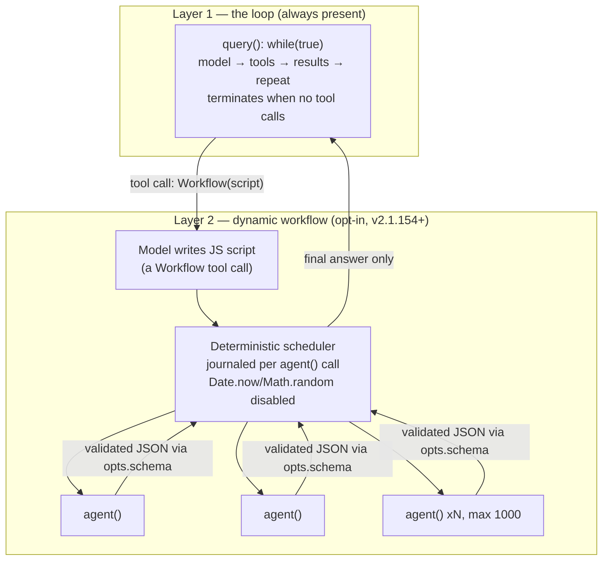
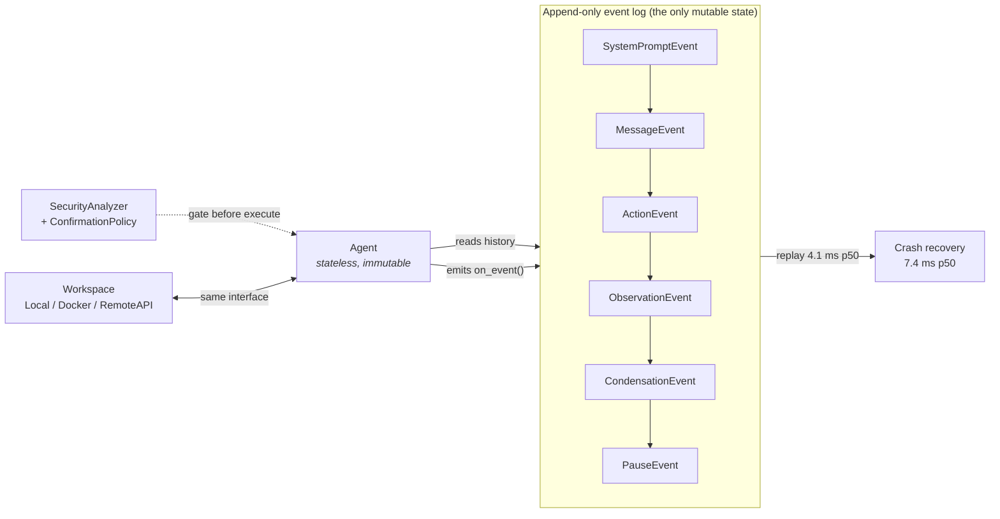
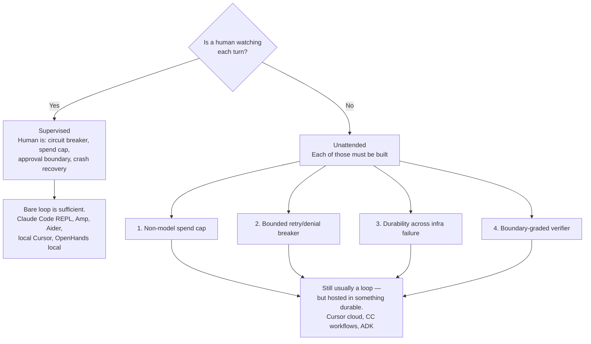

# 10 — Topology in Practice: What Shipping Agent Systems Actually Do

**Last researched: 2026-08-02**

---

## TL;DR — Key takeaways

> 1. **The "everything is a loop" finding survives at the base layer but is now wrong as a whole-system description.** Claude Code's core is still a single `while(true)` async generator that every interaction — REPL, SDK, subagent — flows through ([code.claude.com agent-loop docs](https://code.claude.com/docs/en/agent-sdk/agent-loop.md)). But since **v2.1.154 (28 May 2026)** it also ships **dynamic workflows**: a *generated JavaScript orchestration script* executed by a deterministic, journaled, replay-capable scheduler ([code.claude.com/docs/en/workflows](https://code.claude.com/docs/en/workflows)). The loop did not get replaced. A second execution mode got added *above* it.
>
> 2. **The most successful agent product in existence now generates its own topology as a code artifact.** This is not analogous to what `function2agent` proposes — it is the same thing. Claude writes a script whose only real primitive is `agent(prompt, opts)`; `parallel`, `pipeline`, `phase` and JSON-Schema-validated returns are glue around it. **Determinism is enforced by the runtime**: `Date.now()` and `Math.random()` are disabled because they would break resumability ([docs](https://code.claude.com/docs/en/workflows), corroborated by [independent teardown](https://www.akshayparkhi.net/2026/May/29/claude-code-dynamic-workflows-inside-out/)).
>
> 3. **"None of them uses a durable execution engine" is no longer true — two of the three Tier-1 systems do, and both built it on an append-only event log rather than on Temporal.** OpenHands persists every event and recovers from crash in **under 20 ms at p50 7.4 ms** with sub-millisecond persist latency ([arXiv:2511.03690](https://arxiv.org/abs/2511.03690), MLSys 2026). Google ADK 2.6.1 reconstructs node state by *replaying session events* — `ReplayManager`, `ReplaySequenceBarrier`, `_rehydration_utils` — verified in source at `examples/adk-python/src/google/adk/workflow/utils/`.
>
> 4. **Google ADK deprecated its own template workflows in favour of a graph, and `BaseAgent` is now a graph node.** Verified in the vendored source: `class BaseAgent(BaseNode, abc.ABC)` (`examples/adk-python/src/google/adk/agents/base_agent.py:93`), and `SequentialAgent`/`ParallelAgent`/`LoopAgent` each carry `@deprecated('... in favor of Workflow ...')`. The stated reason is generality, not durability — but the durability came along with it.
>
> 5. **Every system that fans out enforces the same rule: many readers, one writer.** Cognition's 2026 follow-up states it explicitly — "multi-agent systems work best today when writes stay single-threaded and the additional agents contribute intelligence rather than actions" ([cognition.ai/blog/multi-agents-working](https://cognition.ai/blog/multi-agents-working)). Amp's oracle has no filesystem access. Codex's Auto-review reviewer is locked to a read-only sandbox. Claude Code isolates writing subagents into git worktrees. This is the single strongest convergence in the survey.
>
> 6. **The supervised/unattended hypothesis is confirmed, and the mechanism is more specific than "more structure."** What changes when the human leaves is not the control-flow primitive — it is that **four things become mandatory: a hard spend cap, a bounded retry/denial circuit breaker, a non-model termination condition, and a second model graded against a boundary rather than against the task.** Codex's Auto-review adds a circuit breaker at *3 consecutive denials or 10 in a rolling 50* ([Codex docs](https://developers.openai.com/codex/concepts/sandboxing/auto-review)); Claude Code caps at 1,000 agents/run, 16 concurrent, and halts background subagents at `--max-budget-usd`.
>
> 7. **"Graph" means three unrelated things and the systems are consistent once you separate them.** Nobody hand-authors a static graph per unit of work. Graph-as-*representation* is universal (event log, DAG of spawns, script AST). Graph-as-*execution-engine* appears only where fan-out exceeds ~10 concurrent units. Graph-as-*planning-artifact* is what Claude Code, Manus (`todo.md`), and Devin all use, and it is a **text file the model rewrites**, not a data structure.
>
> 8. **For `function2agent`:** the represent-always / execute-conditionally proposal is **correct and now has a direct existence proof** in Claude Code's workflow runtime — but the sibling framing is one step off. The right split is not "trivial vs. non-trivial topology," it is **"who holds the plan."** Emit a loop when the model can hold the plan in context; emit an executed topology when the plan must survive the model's context window, a crash, or a budget cap. Concretely: **one node → loop; fan-out ≤ ~10 and supervised → loop with subagents-as-tools; fan-out > 10, or unattended, or spending money → executed artifact.**

---

## Table of contents

1. [Evidence ledger and how to read the grades](#1-evidence-ledger-and-how-to-read-the-grades)
2. [Claude Code: a loop, and then a compiler](#2-claude-code-a-loop-and-then-a-compiler)
3. [OpenHands: the stateless agent over an append-only log](#3-openhands-the-stateless-agent-over-an-append-only-log)
4. [Google ADK: the one system that went all-in on graphs](#4-google-adk-the-one-system-that-went-all-in-on-graphs)
5. [Tier 2: Cognition/Devin, Manus, Codex, Amp, Cursor, Aider](#5-tier-2-cognitiondevin-manus-codex-amp-cursor-aider)
6. [The comparison table](#6-the-comparison-table)
7. [Convergence and divergence](#7-convergence-and-divergence)
8. [The supervised/unattended split](#8-the-supervisedunattended-split)
9. [What "graph" means when systems use one](#9-what-graph-means-when-systems-use-one)
10. [The generation angle: does mechanical emission change the calculus?](#10-the-generation-angle-does-mechanical-emission-change-the-calculus)
11. [Claims I found poorly supported](#11-claims-i-found-poorly-supported)
12. [Recommendation on represent-vs-execute](#12-recommendation-on-represent-vs-execute)
13. [Relevance to `function2agent`](#13-relevance-to-function2agent)
14. [Open questions and things I could not verify](#14-open-questions-and-things-i-could-not-verify)
15. [Sources](#15-sources)

---

## 1. Evidence ledger and how to read the grades

Several of these systems are closed. I grade every claim in this document on one of five levels, and I use the labels literally.

| Grade | Meaning | Example in this doc |
| :-- | :-- | :-- |
| **SOURCE** | I read the code in this repository's `examples/` tree or in a public repo, and cite the file path | ADK `BaseAgent(BaseNode)` |
| **PAPER** | Peer-reviewed or arXiv architecture paper by the builders | OpenHands MLSys 2026 |
| **VENDOR** | The vendor's own docs, changelog, or engineering blog about their own system | Claude Code workflow docs |
| **THIRD-PARTY** | Reverse engineering or teardown by someone outside the team | `query.ts` line counts |
| **INFERRED** | My reading of behavior, release notes, or absence of evidence | Cursor's loop shape |

Two vendor sources deserve an explicit conflict-of-interest note. Anthropic's docs describe a paid feature and understandably frame workflows favourably; Cognition sells Devin and its "what's actually working" post doubles as a product announcement. I have tried to use both only for *mechanism* claims (what the thing does), not *efficacy* claims (how well it works), and I flag where I have used them for efficacy anyway.

A note on the primary sources I could **not** get: Claude Code, Cursor, Devin, and Manus are all closed-source. The vendored `examples/claude-code` is Anthropic's public issue-tracker and distribution repo — it contains a 477 KB `CHANGELOG.md`, plugin definitions, and gateway examples, but **no agent source**. The vendored `examples/claude-agent-sdk-python` (v0.2.128) is likewise not the loop: `src/claude_agent_sdk/_internal/transport/subprocess_cli.py` spawns the `claude` binary and speaks newline-delimited JSON to it, and `_internal/query.py` is a control-request multiplexer, not an agent loop. That is itself a finding, and I treat it as one in §2.

---

## 2. Claude Code: a loop, and then a compiler

### 2.1 What the vendored copies actually contain

*Grade: SOURCE.* Two things worth stating plainly before any architecture claim, because they bound what can be verified:

- `examples/claude-code/` has no agent implementation. Its contents are `CHANGELOG.md`, `plugins/` (14 plugin bundles including `code-review`, `pr-review-toolkit`, `feature-dev`, and a `ralph-wiggum` loop plugin), `examples/gateway/{aws,gcp}` Terraform, `.claude/commands/`, and `feed.xml`. The changelog is the most information-dense primary source in the repo and I lean on it heavily below.
- `examples/claude-agent-sdk-python/` v0.2.128 is a **transport and control-plane library**, not a harness. `Query` in `src/claude_agent_sdk/_internal/query.py:78` opens a subprocess, sends an `initialize` control request (line 228–246), and thereafter multiplexes `control_request` / `control_response` frames — `interrupt()`, `set_permission_mode()`, `get_context_usage()`, `mcp_status`. The agent loop is on the other side of a pipe, inside the closed CLI.

**The architectural implication is bigger than the inconvenience.** Anthropic's shipped extensibility surface is not "subclass the loop." It is *hooks, tool permissions, and declarative agent definitions* over an opaque loop. `src/claude_agent_sdk/types.py:260` defines the full hook set: `PreToolUse`, `PostToolUse`, `PostToolUseFailure`, `UserPromptSubmit`, `Stop`, `SubagentStop`, `SubagentStart`, `PreCompact`, `Notification`, `PermissionRequest`. An `AgentDefinition` (`types.py:84`) is a dataclass of `description`, `prompt`, `tools`, `disallowedTools`, `model`, `skills`, `memory`, `mcpServers`, `maxTurns`, `background`, `effort`, `permissionMode` — **a declarative record, not a subclass.** If you are generating agents, that is the shape to generate.

### 2.2 The core loop

*Grade: VENDOR for the shape, THIRD-PARTY for the internals.* Anthropic's own documentation describes it minimally:

> Claude evaluates your prompt, calls tools to take action, receives the results, and repeats until the task is complete. […] Turns continue until Claude produces output with no tool calls, at which point the loop ends.
> — [code.claude.com/docs/en/agent-sdk/agent-loop.md](https://code.claude.com/docs/en/agent-sdk/agent-loop.md)

That is a bare ReAct loop with a model-decided terminal condition. Independent teardowns of the shipped bundle agree on the specifics and agree with each other, which raises my confidence: a single async generator `query()` in `query.ts`, roughly 1,730 lines, whose inner `queryLoop()` is a `while (true)`, and which is the *only* code path — REPL, headless `--print`, SDK, and subagents all enter through it ([Bharath teardown](https://sidbharath.com/blog/the-anatomy-of-claude-code/); [`claude-code-from-source` ch.5](https://github.com/alejandrobalderas/claude-code-from-source/blob/main/book/ch05-agent-loop.md); [Inside Claude Code](https://y-agent.github.io/inside-claude-code/02-agent-loop-query-engine.html)).

*Confidence: high on "one `while(true)` generator shared by all entry points"; medium on the line counts, which are bundle-version-specific and will drift.*

The choice of an **async generator** rather than a callback loop is the load-bearing design decision, and it is the one I would copy. One producer, many consumers (terminal renderer, SDK collector, parent agent forwarding a subagent's events), backpressure for free, and `yield*` delegation so that sub-generators — stop hooks, compaction — compose without event-forwarding boilerplate. It also makes "subagent" a non-special case: a subagent is the same generator with a different tool set and a fresh message list, and its result returns to the parent **as an ordinary tool result**.

### 2.3 Subagents: tools, not peers

*Grade: VENDOR.* The contract is narrow and worth quoting because it is the whole reason the pattern scales:

> Each subagent starts with a fresh conversation (no prior message history…). It does not see the parent's turns, and only its final response returns to the parent as a tool result. The main agent's context grows by that summary, not by the full subtask transcript.
> — [agent-loop.md](https://code.claude.com/docs/en/agent-sdk/agent-loop.md)

The governors around this have been tightened repeatedly, and the direction of travel is the interesting part. From `examples/claude-code/CHANGELOG.md`:

| Governor | Value | Changelog line |
| :-- | :-- | :-- |
| Concurrent subagents | 20 default, `CLAUDE_CODE_MAX_CONCURRENT_SUBAGENTS` | `:92` — "so one message can't fan out unbounded background agents" |
| Per-session spawns | 200 default, `CLAUDE_CODE_MAX_SUBAGENTS_PER_SESSION` | `:198` — "to stop runaway delegation loops; `/clear` resets the budget" |
| Nesting depth | 3 default as of v2.1.219; was 5, then 1, now 3 | `:32`, `:93`, `:806` |
| Spend | `--max-budget-usd` denies new spawns *and halts running background agents* | `:94` |
| Write isolation | `isolation: 'worktree'` — three separate bugfixes for escapes via `git -C`, `--git-dir`, `GIT_DIR` | `:105`, `:288`, `:472`, `:1212` |

Two things to read out of that table. First, **the depth cap oscillated (5 → 1 → 3)**, which tells you Anthropic does not have a principled answer either and is tuning empirically. Second, the *four separate CVE-shaped bugfixes for worktree escape* say that isolating a writing subagent is genuinely hard, and that they consider it important enough to keep fixing. That is the "single-threaded writes" rule showing up as an implementation problem rather than a design slogan.

There is also a behavioural note that reads like a scar: `:492` — "Improved subagent behavior: agents are now less likely to re-delegate their entire task to another subagent." Delegation degenerates into pass-the-parcel unless you push against it.

### 2.4 Termination and recovery

*Grade: VENDOR.* Termination is **model-decided by default, with non-model overrides layered on**:

- Base case: model emits no tool calls → loop ends.
- `Stop` and `SubagentStop` hooks can return `hookSpecificOutput.additionalContext` to "give Claude feedback and keep the turn going without being labeled a hook error" (`CHANGELOG.md:1029`). This is an *external* re-entry into a loop the model tried to exit — the closest thing in the system to a verifier gate.
- `maxTurns` on an `AgentDefinition`; `--max-budget-usd` globally; `TaskBudget` in the SDK (`types.py:64`) sends `output_config.task_budget` with the `task-budgets-2026-03-13` beta header so **the model is told its remaining token budget and paces itself.** That is a novel third category: not a hard cap and not a prompt, but budget-as-context.

Recovery is compaction plus session persistence, and the failure modes are documented in the changelog with unusual candour. Auto-compact, reactive compaction seeded from the overflow size (`:1513`), a `PreCompact` hook that can *block* compaction by exiting 2 (`:2277`), and — my favourite entry — `:2588`: "Fixed autocompact thrash loop — now detects when context refills to the limit immediately after compacting three times in a row and stops with an actionable error instead of burning API calls." **Three strikes and stop.** That is a hand-tuned constant guarding against an unbounded-spend failure mode, and it is exactly the kind of thing a generated system will not invent for itself.

### 2.5 Dynamic workflows: the finding that changes the argument

*Grade: VENDOR (mechanism), THIRD-PARTY (internals).* Introduced in **v2.1.154, 28 May 2026** (`CHANGELOG.md:1186`: "Introducing dynamic workflows: ask Claude to create a workflow and it orchestrates work across tens to hundreds of agents in the background"). This is a second execution mode, and Anthropic's own comparison table is the single most useful artifact I found in this survey:

| | Subagents | Skills | Agent teams | Workflows |
| :-- | :-- | :-- | :-- | :-- |
| What it is | A worker Claude spawns | Instructions Claude follows | A lead agent supervising peer sessions | **A script the runtime executes** |
| Who decides what runs next | Claude, turn by turn | Claude, following the prompt | The lead agent, turn by turn | **The script** |
| Where intermediate results live | Claude's context window | Claude's context window | A shared task list | **Script variables** |
| What's repeatable | The worker definition | The instructions | The team definition | **The orchestration itself** |
| Scale | A few delegated tasks per turn | Same as subagents | A handful of long-running peers | **Dozens to hundreds of agents per run** |
| Interruption | Restarts the turn | Restarts the turn | Teammates keep running | **Resumable in the same session** |

— [code.claude.com/docs/en/workflows](https://code.claude.com/docs/en/workflows)

> A workflow moves the plan into code. […] A workflow script holds the loop, the branching, and the intermediate results itself, so Claude's context holds only the final answer.

**The axis Anthropic chose is "who holds the plan."** Not "is the topology complex." Not "is it a DAG." Who holds the plan. I think that is the correct axis and I use it for the recommendation in §12.

Mechanics, all VENDOR unless noted:

- The script is **plain JavaScript with top-level `await`**, written by the model as ordinary tokens and passed as the `script` argument of a `Workflow` tool. There is no template engine and no planner DSL (THIRD-PARTY: [teardown](https://www.akshayparkhi.net/2026/May/29/claude-code-dynamic-workflows-inside-out/); corroborated by `CHANGELOG.md:511`, which mentions "workflow parse errors now show the offending line instead of always blaming TypeScript" — i.e. the runtime is JS and TS annotations are a common failure).
- Primitives: `agent(prompt, opts)` is the only one that does work. `parallel(thunks)` is a barrier; `pipeline(items, ...stages)` is barrier-free streaming; `phase(title)` and `log(msg)` are UI-only; `workflow(name, args)` nests exactly one level.
- **`opts.schema` forces the subagent to call a `StructuredOutput` tool and returns a validated object.** The docs' own example passes a JSON Schema and then iterates `found.files`. This is the mechanism that makes deterministic control flow over non-deterministic agents possible — the script branches on validated data, never on parsed prose. `CHANGELOG.md:753` records the guard: subagents "looping forever on repeated schema validation failures" now abort after 5 attempts.
- **Determinism is enforced, not requested.** `Date.now()`, `Math.random()`, and argless `new Date()` are disabled because they break resumability; `CHANGELOG.md:938` records a bug where validation was *over*-eager and rejected scripts that merely mentioned `Date.now()` in a comment.
- Resume is **journal-and-replay**: each `agent()` call is keyed by `(prompt, opts)` and journaled, and resume re-executes the script from the top consulting the journal. The docs spell out the consequence precisely: "Replay follows the order agents started. Cached results stop at the first agent that didn't finish, and every agent that started after that one runs again, even if it completed." Hence: "A workflow that fans work out across many small agents therefore preserves more progress than one long agent." That is a **direct argument for finer-grained nodes**, and it comes from the vendor's own replay semantics.
- Hard limits: **16 concurrent agents** (fewer on low-core machines), **1,000 agents total per run** ("Prevents runaway loops"), **no mid-run user input** ("For sign-off between stages, run each stage as its own workflow"), and **no filesystem or shell access from the script itself** — "Agents read, write, and run commands. The script coordinates the agents."
- Advisory sizing: a `workflowSizeGuideline` setting, defaulting to **medium = "aim for fewer than 15 agents"** (`CHANGELOG.md:26`), sent to the model as advice rather than an enforced cap.
- Observability: `workflow.run_id` and `workflow.name` OpenTelemetry attributes on every workflow-spawned agent (`CHANGELOG.md:503`), and every run's script is written to a file under `~/.claude/projects/` so you can read it, diff it against a previous run, edit it, and relaunch.

That last bullet is worth dwelling on. **The generated topology is a durable, diffable, re-runnable artifact whose path is handed back to the model.** The vendor built exactly the "uniform versioned artifact" that the sibling doc proposed, for exactly the reason the sibling doc gave.



---

## 3. OpenHands: the stateless agent over an append-only log

*Grade: PAPER throughout.* [The OpenHands Software Agent SDK](https://arxiv.org/abs/2511.03690), MLSys 2026, is the only peer-reviewed architecture paper in this survey and the only source that reports **measured** numbers for the design choices. It is also explicitly a post-mortem: V1 is a rewrite of V0, and the paper says what V0 got wrong.

### 3.1 The control-flow primitive

A loop, unambiguously. But the paper's framing matters more than the label:

> Agents execute through an event-driven loop that processes conversation state step-by-step. Rather than directly returning results, agents emit structured events (e.g., messages, actions, observations) through callbacks, i.e. `on_event(event: Event) -> None`, **separating event generation from execution control.**

Three capabilities are claimed to fall out of that separation, and each maps onto a topology concern:

1. **Security interleaving** — actions can be reviewed or blocked before execution. This is a gate inside a loop, achieved without a graph.
2. **Incremental execution** — "the agent advances one step at a time, supporting pause/resume, recovery from context overflows, and condensation."
3. **Event streaming** — the same producer feeds UI, monitoring, and callers.

That is the same insight as Claude Code's async generator, arrived at independently and stated more precisely. **The unit of composition is the event, not the function call.** If you want gates, resumption, and observability in a loop, emitting events instead of returning values is the enabling move.

### 3.2 The one design principle

> **Stateless by default, one source of truth for state.** V1 treats all agents and their components — tools, LLMs, etc — as immutable and serializable Pydantic models validated at construction. The only mutable entity is the conversation state.

The V0 failure this fixes is worth quoting because it is a *configuration* failure that manifested as a *reliability* failure: V0's config sprawled to "140+ fields, 15 classes, and 2.8K lines of configuration code" across four parallel hierarchies (CLI, Web UI, GitHub App, SaaS), such that "two runs with identical parameters could still diverge subtly."

*This is the single most transferable warning in the paper for a system that generates agents.* A generator that emits config across several partially-overlapping surfaces will reproduce V0 exactly, and will reproduce it at scale.

### 3.3 Event sourcing is measurably cheap

The paper puts real numbers on the durability question, replaying 39,870 events from 433 SWE-Bench Verified conversations through the production `LocalFileStore`:

| Operation | p50 | p95 | max |
| :-- | --: | --: | --: |
| Per-event persist | 0.20 ms | 0.31 ms | — |
| Action cycle persist (Action + Obs) | 0.40 ms | 0.56 ms | — |
| Full state replay | 4.1 ms | 9.7 ms | 18.9 ms |
| Crash recovery (replay + unmatched-action scan) | 7.4 ms | 14.9 ms | 32.1 ms |

> All persist and recovery latencies are negligible relative to LLM round-trip times (typically 1–30 s).

**This retires the "durability is too expensive / too complex" objection on the cost axis.** Crash recovery in 7.4 ms against LLM calls measured in seconds is four orders of magnitude of headroom. Whatever the argument against durable execution is, it is not overhead. *Confidence: high — this is a measured result on a real production workload, though the storage backend is a local filesystem and a networked store would be slower.*

The architectural reason they chose it over a database is also stated, and it is a generation-relevant reason: a DB "would couple the SDK to a specific storage backend and make offline replay difficult; event sourcing was chosen for its reproducibility and storage-agnostic design."

The reliability payoff is the headline result: **a 15-day production comparison shows a 61% reduction in system-attributable failures, 78.0 → 30.0 errors per 1k conversations.** Importantly, the paper attributes that to *co-locating execution and removing inter-pod HTTP*, not to event sourcing itself — the eliminated errors were 401s between pods (43.0/1k) and runtime-readiness races (18.8/1k). I would not cite the 61% as evidence for event sourcing. I would cite it as evidence that **process boundaries between an agent and its sandbox are where reliability goes to die**, which is a distinct and useful finding.

### 3.4 Subagents: a tool, deliberately

> Sub-agents operate as independent conversations that inherit the parent's model configuration and workspace context […] The current implementation provides **blocking parallel execution, implemented as a standard tool** in the `openhands.tools` package, where the parent agent spawns and monitors sub-agents until all tasks complete. This pattern exemplifies how complex coordination behaviors — such as asynchronous delegation, dynamic scheduling, or fault-tolerant recovery — **can be implemented entirely as user-defined tools, reinforcing the SDK's design principle for extensibility that advanced agent orchestration requires no modification to the core framework.**

That is a strong architectural claim stated as a design principle: **orchestration is a tool concern, not a core concern.** Same conclusion as Claude Code (subagent returns as a tool result) and Amp (`oracle` is a tool), reached through a different door.

And the limitation is stated honestly in the paper's own limitations section: "The current implementation focuses on single-agent conversations. While the event-sourced architecture naturally supports interleaving events from multiple agents, **coordination mechanisms for multi-agent collaboration require further design.**" The team that built the best-documented agent architecture in the field says multi-agent coordination is unsolved. That is worth more than a dozen framework READMEs claiming otherwise.

### 3.5 Termination, gating, and the one feature nobody else has

- **Condenser.** History compression stored *as events in the log* (`CondensationEvent`, `CondensationSummaryEvent`), applied at read time by removing forgotten events and inserting summaries. "This strategy lets the SDK preserve the entirety of the event log, regardless of condensation, while also keeping the condenser implementations stateless." The default `LLMSummarizingCondenser` is reported to "reduce API costs by up to 2× with no degradation in agent performance." *This is a better design than in-place compaction: the log is immutable and compaction is a view.*
- **Gating.** A `SecurityAnalyzer` rates each tool call `low|medium|high|unknown`; a `ConfirmationPolicy` decides whether approval is needed; the agent then "pauses in a special `WAITING_FOR_CONFIRMATION` state until the user explicitly approves or rejects." **An explicit named state inside a loop** — you do not need a state machine to have states, you need a state variable and a place to park.
- **Agent Stuck Detection.** In the paper's cross-SDK feature comparison (Table 6, assessed October 2025), OpenHands is the *only* one of five SDKs — OpenAI Agents, Claude Agent SDK, Google ADK, LangChain/LangGraph, OpenHands — with a ✓ for "Agent Stuck Detection." Every other cell is ✗. *This is a vendor-authored comparison table and I discount it accordingly for the other four systems' capabilities; but the fact that they considered it a differentiator worth a row tells you they hit the failure mode hard enough to build a detector.*



---

## 4. Google ADK: the one system that went all-in on graphs

*Grade: SOURCE throughout.* All claims here are verified against the vendored copy at `examples/adk-python`, **version 2.6.1** (`src/google/adk/version.py`). This is the strongest counter-evidence to "the best systems are all loops," and it deserves a fair hearing before it gets discounted.

### 4.1 The claim, verified

`examples/adk-python/src/google/adk/agents/base_agent.py:49` imports `from ..workflow import BaseNode`, and line 93 declares:

```python
class BaseAgent(BaseNode, abc.ABC):
```

**Every ADK agent is a graph node.** And all three template workflow agents are deprecated in favour of the graph, with identical wording (`sequential_agent.py:49`, `parallel_agent.py:167`, `loop_agent.py:53`):

```python
@deprecated(
    'SequentialAgent is deprecated in favor of Workflow and will be removed'
    ' in a future version. Workflow cannot yet be used as an LlmAgent'
    ' sub-agent.'
)
```

Note the trailing caveat, which is doing real work: **`Workflow` cannot yet be used as an `LlmAgent` sub-agent.** The replacement is incomplete. Google deprecated the old thing before the new thing composed. *That is a fact about migration risk, not about the design being wrong, but it should temper any read of "ADK has settled on graphs."*

The sibling doc's report is therefore confirmed on both counts. The remaining question is **why**, and what the graph actually buys.

### 4.2 What the graph model is

The `workflow/` package is 6,086 lines across 25 files. The model:

- **`Graph`** (`_graph.py:95`) is nodes + `Edge`s, where **nodes are inferred from edges** and setting them explicitly raises. Edges carry an optional `route: RouteValue | list[RouteValue] | None` where `RouteValue = bool | int | str`. An edge with `route=None` always fires; a routed edge fires when the emitted route matches; a `DEFAULT_ROUTE` edge is the fallthrough. Fan-out is a tuple of destinations.
- **`NodeStatus`** (`_node_status.py`) is a 7-state enum: `INACTIVE, PENDING, RUNNING, COMPLETED, WAITING, FAILED, CANCELLED`. This is a state machine per node, composed into a graph.
- **`JoinNode`** (`_join_node.py:41`) sets `_requires_all_predecessors = True` and passes through aggregated inputs — an explicit barrier primitive.
- **`RetryConfig`** (`_retry_config.py`) is per-node: `max_attempts` (default 5), `initial_delay` (1.0 s), `max_delay` (60.0 s), `backoff_factor` (2.0), `jitter` (1.0), and an `exceptions` allowlist. **Exponential backoff with jitter, declared per node.**
- **HITL** is a first-class interrupt: `utils/_workflow_hitl_utils.py` defines `adk_request_input` and `adk_request_credential` function calls, and `RequestInput` carries a `response_schema`. A node can suspend the graph pending typed human input *or a credential*.

### 4.3 The property a loop cannot give you

This is the most interesting single thing I found in the ADK source. `utils/_graph_validation.py` runs `_detect_unconditional_cycles` at graph-construction time and raises:

> `Graph validation failed. Unconditional cycle detected: {path}. Cycles must include at least one conditional (routed) edge to avoid infinite loops.`

**ADK statically rejects a topology that cannot terminate.** Loops are permitted — ADK is a cyclic graph engine, not a DAG engine — but every cycle must contain at least one conditional edge, i.e. a decision point at which the cycle can be exited.

That is a *structural* termination guarantee, checked before anything runs and without invoking a model. No `while(true)` harness has an analogue: a bare loop's termination is a runtime property enforced by a turn cap, a budget, or the model's judgement. This is the clearest concrete answer to "what does a graph engine actually buy you," and it is exactly the class of property that matters when nobody is watching.

*Caveat, and it is a real one: the guarantee is weak. A conditional edge that never evaluates false still loops forever. ADK proves the topology has an exit, not that the exit is reachable. It rules out the trivially-broken case, which is nonetheless the case a generator is most likely to emit.*

### 4.4 Durable execution by replay, not by Temporal

The sibling finding that "none uses a durable execution engine" is false for ADK, though the disagreement is partly definitional. ADK does not use Temporal or Restate. It implements **replay-based durability on top of the session event log**, which is the same technique those systems use.

`_workflow.py:73–83` states it directly:

> Scoped to a single `_run_impl` invocation. **Not persisted** — static node state is reconstructed from session events on resume; dynamic node state is lazily scanned on demand. Discarded when `_run_impl` returns.

The supporting machinery is substantial: `ReplayManager` ("unified orchestrator for event rehydration, interception, and sequence barriers"), `_replay_interceptor.check_interception` / `create_mock_context`, `ReplaySequenceBarrier` "for deterministic replay ordering", and `_rehydration_utils._reconstruct_node_states`. The `ScheduleDynamicNode` protocol (`_schedule_dynamic_node.py`) documents the three cases explicitly: **fresh execution, deduplication** ("returning cached output if the node already completed in a prior turn, based on event history"), **and resumption** ("rehydrating state from session events when execution is resumed after an interrupt").

That is Temporal's execution model — deterministic replay against a durable history, with side effects intercepted and mocked on the replay path — reimplemented over an agent session log.

And note where it lands relative to §3: **OpenHands (paper) and ADK (source) independently converged on an append-only event log as the single source of truth, with replay as the recovery mechanism.** Claude Code's workflow runtime journals `agent()` calls and resumes by re-executing the script from the top against the journal — the same pattern a third time. *This is the strongest convergence in the survey after single-threaded writes, and I did not expect it.*

### 4.5 Dynamic nodes: the graph is not static

The final piece that undermines a naive graph-vs-loop framing. ADK's `ctx.run_node()` schedules nodes **that are not in the declared graph**, tracked in `DynamicNodeState` alongside the static nodes (`_dynamic_node_scheduler.py`). So an ADK workflow is a declared static topology plus a runtime-extensible set of dynamic nodes, sharing one replay/dedup mechanism.

Which means the honest characterization of ADK is not "graph instead of loop." It is: **a graph engine whose nodes may themselves loop, whose cycles are statically checked for an exit, and which can grow new nodes at runtime.** The graph is the durability and gating substrate. The intelligence still happens in loops inside the nodes.

### 4.6 Why did they move? My read

*Grade: INFERRED.* Google has not, as far as I can find, published a design rationale for the 2.x workflow migration; the deprecation strings say only "in favor of Workflow." My inference from the source:

1. `SequentialAgent`/`ParallelAgent`/`LoopAgent` are three special cases of one general thing. A graph with routed edges expresses all three, plus conditionals, joins, and diamonds, with one engine and one set of semantics.
2. Retry, timeout, HITL interrupt, and replay each had to be implemented **once per template agent** under the old model. Under the graph they are node-level properties implemented once.
3. ADK's deployment target is Vertex AI / Agent Engine — *managed, server-side, frequently unattended*. Pause/resume across process boundaries and credential-request interrupts are table stakes there in a way they are not for a terminal REPL.

Point 3 is the one I would put weight on, and it feeds directly into §8: **ADK is the most graph-committed system in the survey and also the most unattended-by-default system in the survey.** That is not a coincidence I want to explain away.

---

## 5. Tier 2: Cognition/Devin, Manus, Codex, Amp, Cursor, Aider

### 5.1 Cursor — the cleanest natural experiment in the survey

*Grade: VENDOR, and unusually specific for a vendor post.* Cursor is the most valuable Tier-2 entry because **the same company runs the same product in both the supervised and unattended regimes and published what differed.** [What we've learned building cloud agents](https://cursor.com/blog/cloud-agent-lessons) (2026) is worth quoting at length because it settles a question the sibling docs left open:

> We started building cloud agents with a work-stealing architecture, where worker nodes could pick up agents and loop them to completion. **It transplanted what works locally to a server and it was a fragile setup — our early beta of cloud agents often operated at one 9 of reliability.**
>
> As cloud agents matured, we found ourselves on the verge of rebuilding a lot of the durable execution primitives that **Temporal** already solves (e.g., retry mechanisms, scheduling work across machines, durability across node failures), so instead we migrated there.
>
> Our current agent loop on Temporal can survive blips in inference reliability, pod hibernation and resumption, and runs that stretch across days or even weeks. **That migration alone took us past two 9s of reliability** and today, Temporal handles more than **50 million actions per day across more than 7 million unique workflows.** Internally, more than 40% of our PRs come from cloud agents.

**"None of the best systems uses a durable execution engine" is simply false.** Cursor uses Temporal, in production, at 50M actions/day, and reports a full order of magnitude of reliability improvement (90% → >99%) from the migration. They tried the loop first, on the explicit theory that it transplants, and it did not.

Three follow-on lessons, each of which is directly actionable for a system that emits topologies:

1. **Short workflows beat eternal ones.** "We've moved from 'eternal' agent workflows to multiple shorter ones that exit after completing a single task, **which makes version upgrades easier.**" Durable execution pins you to a code version for the workflow's lifetime; long workflows make deployment hard. *A generator that emits one long-lived workflow per repo is emitting a deployment problem.*
2. **Decouple the loop from the machine from the conversation.** "Because the agent loop lives in Temporal rather than on the VM itself, we can manage pod lifecycles independently." Conversation state is a **separate append-only stream** with rewind-on-retry semantics for clients.
3. **Move logic out of the harness as models improve.** "Early on, we didn't trust the agent very much, so the harness would double-check its work after every task, force a commit, and push. As models got smarter, we started moving logic out of the harness and into tools the agent controls." **The harness shrinks over time.** Structure you hard-code today is structure you delete in a year — an argument for emitting *less* structure, held in tension with everything else here.

And the sentence that names the supervised/unattended split outright:

> Cloud agents also need different kinds of prompts in the harness than local agents do. **We encourage them to be more autonomous, because the cost of blocking is much higher.** Locally, you know when an agent has stopped and is waiting for permission, but in the cloud, it could sit there for hours before you go back and check on it.

Separately, [Agent swarms and the new model economics](https://cursor.com/blog/agent-swarm-model-economics) (20 Jul 2026) and [Scaling long-running autonomous coding](https://cursor.com/blog/scaling-agents) describe the extreme end: **planner agents** (frontier models) recursively decompose a goal into a task tree and **worker agents** (cheaper models) execute leaves. Coordination is not achieved by agents negotiating — it is achieved by **infrastructure**: a purpose-built VCS ("every change in the system passes through the VCS, so it is where collisions first become visible"), shared design docs with **compile-checked references** from dependent code, a **reconciler** agent that merges contradictory docs, a **neutral third-party merge-conflict resolver** modelled on a merge queue, and a **judge agent at the end of each cycle that decides whether to continue** before the next iteration starts fresh.

Their own summary is the best one-line articulation of the generation problem I found anywhere:

> Seen this way, the swarm starts to resemble a compiler. […] Planners parse a goal into task trees, then lower it step by step into executable work. **The difference is that a compiler preserves meaning at every step while the swarm is probabilistic at every one. Everything described in this post exists to close that gap.**

### 5.2 Cognition / Devin — many readers, one writer

*Grade: VENDOR, with a commercial interest in the conclusion.* [Multi-Agents: What's Actually Working](https://cognition.ai/blog/multi-agents-working) (Walden Yan, 22 Apr 2026) is the follow-up to *Don't Build Multi-Agents*, and it is a partial retraction with a precisely drawn boundary:

> Our original observations still hold today for parallel-writer swarms […] But we've found a narrower class of patterns that do [work]: **setups where multiple agents contribute intelligence to a task while writes stay single-threaded.**

Three named patterns:

- **Code-Review-Loop.** Devin Review catches "an average of 2 bugs per PR, of which roughly 58% are severe." The counterintuitive finding: it works **best when the coding and review agents share no context beforehand.** The reasoning is mechanical rather than philosophical — the reviewer "is forced to reason backward from the implementation without the spec," and a shorter context means better attention allocation. *This is the strongest published argument for clean-context verification and it lines up with [04](./04-self-improving-agents.md)'s finding that self-critique without external signal fails: the reviewer here has an external signal (the diff) and no shared prior.*
- **"Smart Friend."** A stronger model exposed to a weaker primary **as a tool**, not as a supervisor. Cognition is unusually honest that it did not work: "SWE 1.5 was not good enough at being the primary model for this setup to really work. […] the quality ceiling was set by the primary, and the primary wasn't strong enough." It worked across *frontier* models, where "the delegation logic becomes a capability router rather than a difficulty escalator."
- **Map-reduce-and-manage.** A manager Devin spawns child Devins (each a full Devin on its own VM) and coordinates via an internal MCP. On the alternative: "**the unstructured-swarm approach, arbitrary networks of agents negotiating with each other, is mostly a distraction.**"

And the failure modes they list are precisely the ones a generator would walk into:

> Managers trained on small-scoped delegation default to being overly prescriptive, which backfires when the manager lacks deep codebase context. **Agents assume they share state with their children when they don't.** Cross-agent communication […] doesn't happen by default.

The `2 bugs/PR, 58% severe` figure is self-reported with no methodology given; I would not build a business case on it, but the *direction* is corroborated independently by Codex Auto-review and Amp's oracle.

### 5.3 OpenAI Codex — the reviewer as a boundary, not a judge

*Grade: VENDOR + SOURCE (the implementation PR is public).* [Auto-review](https://developers.openai.com/codex/concepts/sandboxing/auto-review) is the most precisely specified pattern in the entire survey, and it is a *different* pattern from Cognition's reviewer despite superficial similarity.

The flow: main agent runs in `read-only` or `workspace-write`; when it needs to cross the sandbox boundary it requests approval; with `approvals_reviewer = "auto_review"` that request routes to a **separate Codex agent** instead of to a human; the reviewer returns approve/deny plus a rationale; on deny the main agent "is instructed to find a materially safer path or stop and ask the user."

The design rationale, from [OpenAI's alignment write-up](https://alignment.openai.com/auto-review), is the sharpest statement of why you separate the verifier:

> The main agent is optimized to complete the user's task. **This creates pressure to treat an approval boundary as just another obstacle to overcome.** Auto-review has a narrower job […] Keeping that decision in a separate model call makes the approval policy easier to evaluate, monitor, and improve.

Implementation specifics from the [guardian approval PR](https://github.com/openai/codex/pull/13692/files) (SOURCE — this is the open-source Codex repo):

- The reviewer "runs as a normal subagent and reuses the existing subagent/thread machinery" — **no new orchestration primitive was introduced.**
- It is "locked to a read-only sandbox and `approval_policy = never`", does not inherit user/project exec-policy rules, and **fail-closes** on timeout, startup failure, malformed output, or any other review error.
- It prefers a specific stronger model (`gpt-5.4`) and falls back to the parent's model.
- It auto-approves only when `risk_score < 80`.
- The review prompt includes **bounded** recent transcript plus recent tool call/result evidence, truncated with explicit `<guardian_truncated …/>` markers.
- **Circuit breaker:** the turn is interrupted after **3 consecutive denials, or 10 denials within a rolling window of the last 50 reviews in the same turn.**

Two of those are the load-bearing ones for unattended operation and I would copy both verbatim: **fail-closed on any reviewer error**, and **a denial circuit breaker**. Without the latter, a main agent that keeps proposing a blocked action and a reviewer that keeps denying it is an infinite paid loop.

Crucially: **Auto-review grades a *boundary crossing*, not task quality.** "Auto-review is a reviewer swap, not a permission grant. It does not expand `writable_roots`, enable network access, or weaken protected paths." That is a much narrower and much more verifiable job than "is this code good," which is why I trust it more than a generic LLM-as-judge. It is the contract-derived-verification principle applied to permissions rather than to output: grade against something checkable. See [04](./04-self-improving-agents.md) for why the ungrounded version fails.

### 5.4 Manus — a loop with a masked action space and a file for memory

*Grade: VENDOR.* [Context Engineering for AI Agents](https://manus.im/en/blog/Context-Engineering-for-AI-Agents-Lessons-from-Building-Manus) is a loop-side document, and its topology decisions are all about *not* changing the loop:

- **The action space is constrained by logit masking, not by changing the tool list.** "Rather than removing tools, it masks the token logits during decoding to prevent (or enforce) the selection of certain actions based on the current context." Manus calls the controller a **"context-aware state machine"** — but it is a state machine over *tool availability*, not over control flow. The loop is unchanged; only what the model may emit at each step varies. *This is the single most under-copied idea in the survey: you can get state-machine-like constraint without a state-machine executor, and without breaking the KV cache.*
- **The reason is cache economics.** Removing tools mid-run invalidates the prefix and therefore the KV cache. Manus reports a ~100:1 input:output token ratio and roughly 10× cost difference between cached and uncached input. **Append-only context is a cost decision before it is an architecture decision.**
- **The plan lives in a file the model rewrites.** `todo.md`, recited into the end of the context each step, to bias attention toward the global goal and counter "lost in the middle." This is graph-as-planning-artifact in its most primitive and most widely-copied form.
- **The filesystem is the memory tier**, with compression required to be *restorable* — drop a page's content but keep its URL.
- The post's closing section header is `Less structure, more intelligence.`

Manus says it "rebuilt our agent framework four times." That is a team that tried structure and removed it. Weight it accordingly against ADK, which is a team that tried templates and generalized them.

### 5.5 Amp — subagents as tools, and one deliberate asymmetry

*Grade: VENDOR.* Amp's [Owner's Manual](https://ampcode.com/manual) and [Agents for the Agent](https://ampcode.com/notes/agents-for-the-agent) describe a main-agent loop plus a small set of typed subagents. Three details are worth stealing:

- **The `oracle` is a different model on purpose.** "In `high` mode, where GPT-5.6 Sol is the main agent's model, **the oracle is Claude Fable 5 instead — the second opinion always comes from a different frontier model.**" Cross-vendor by construction, so the second opinion is not correlated with the first. Cognition found the same thing across frontier models; Amp encoded it as an invariant.
- **The oracle cannot act.** It is a reasoning tool with no filesystem access. Single-threaded writes again, enforced by capability rather than by prompt.
- **Invocation is model-discretionary, deliberately.** "We intentionally do not force the main agent to always use the oracle, due to higher costs and slower inference speed." An always-on verifier is a fixed cost multiplier; Amp accepts variance to avoid it. Cognition made the opposite call for Devin Review (always-on). *The divergence is explained by who pays and how bad a miss is — Amp is interactive and user-paid; Devin Review gates a PR a human will read.*

Amp also documents `/handoff`: start a new thread carrying the current one's context but a new objective. That is context-window management by **restart with a summary**, the same move as Claude Code's `/fork` and Cognition's context compressor.

### 5.6 Aider — the honest baseline

*Grade: SOURCE (public repo) + VENDOR.* Aider is worth including precisely because it is the least agentic of the set and still competitive. Two structural choices:

- **Architect/Editor is a fixed two-node pipeline**, not a loop and not a graph. `ArchitectCoder` (extending `AskCoder`) takes a reasoning model's natural-language plan and passes it verbatim as the input message to a second `Coder` instance created via `Coder.create()` with a different edit format ([aider.chat/2024/09/26/architect.html](https://aider.chat/2024/09/26/architect.html)). **Separation of "decide what to do" from "emit a valid diff" was worth SOTA on their edit benchmark** — because the failure being fixed is *format compliance*, not reasoning.
- **The repo map is a graph used as retrieval, not as control flow.** Tree-sitter parses the repo, symbols are ranked by a PageRank-style score over the reference graph, and roughly 1k tokens of the top-ranked surface goes into the prompt.

That second point matters for `function2agent` more than the first. **Aider builds a call graph over a codebase and uses it to decide what the model sees — not to decide what runs.** Given that `function2agent`'s input is a codebase graph, this is the closest published precedent for what to do with it, and it argues for using the graph as a *context-selection* structure before using it as an *execution* structure.

---

## 6. The comparison table

Read the **Evidence** column first; several rows are inferences.

| System | Control-flow primitive | Subagent model | Termination strategy | State / recovery model | Evidence |
| :-- | :-- | :-- | :-- | :-- | :-- |
| **Claude Code** (core) | Single `while(true)` async generator; every entry point shares it | `Agent`/`Task` tool → same generator, fresh context, restricted tools; returns as a tool result. Depth 3, 20 concurrent, 200/session | Model emits no tool calls. Overrides: `Stop`/`SubagentStop` hooks can re-enter; `maxTurns`; `--max-budget-usd`; `TaskBudget` told to the model | In-context + compaction (auto, reactive, `PreCompact` hook); session resume; thrash detector stops after 3 refills | VENDOR (shape) + THIRD-PARTY (internals) + SOURCE (`CHANGELOG.md`) |
| **Claude Code** (dynamic workflows) | **Generated JS script** run by a deterministic scheduler | `agent(prompt, {schema})` is the only real primitive; `parallel` = barrier, `pipeline` = streaming; nesting 1 deep | Script returns. Hard caps: 16 concurrent, **1,000 agents/run**; schema-retry aborts at 5 | **Journal-and-replay** keyed on `(prompt, opts)`; `Date.now`/`Math.random` disabled; script persisted to `~/.claude/projects/` | VENDOR |
| **OpenHands** | Event-driven loop; agent is a stateless function over an append-only log | Delegation tool; sub-agents are independent conversations; **blocking parallel**, implemented entirely as a user tool | Model-decided + `SecurityAnalyzer`/`ConfirmationPolicy` park in `WAITING_FOR_CONFIRMATION`; **agent stuck detection** | **Event sourcing.** Persist 0.20 ms p50; full replay 4.1 ms p50; crash recovery 7.4 ms p50 / 32.1 ms max. Condensation stored *as events* | PAPER ([arXiv:2511.03690](https://arxiv.org/abs/2511.03690)) |
| **Google ADK 2.6.1** | **Cyclic graph engine.** `BaseAgent(BaseNode)`; routed edges; 7-state `NodeStatus`; `JoinNode` barrier | Nodes; plus **dynamic nodes** scheduled at runtime via `ctx.run_node()` with dedup + resume | Graph terminates at nodes with no outgoing edges. **Unconditional cycles rejected at construction time.** Per-node `RetryConfig` (5 attempts, 2× backoff, jitter) | **Replay from session events.** `ReplayManager`, `ReplaySequenceBarrier`, rehydration; node state explicitly *not* persisted | SOURCE (`examples/adk-python/src/google/adk/workflow/`) |
| **Cursor** (local) | Loop | Subagents; dedicated computer-use subagent type | Model-decided; interactive | In-memory + conversation history | INFERRED from vendor posts |
| **Cursor** (cloud) | **Loop hosted in Temporal.** Loop, machine, and conversation state fully decoupled | Async subagents across machines; a subagent may outlive its parent | Short workflows that "exit after completing a single task"; swarm cycles end with a **judge agent** deciding continue/stop | **Temporal durable execution** (>50M actions/day, >7M workflows) + separate append-only conversation stream with rewind-on-retry. 1 nine → >2 nines | VENDOR, specific ([cloud-agent-lessons](https://cursor.com/blog/cloud-agent-lessons)) |
| **Cursor** (swarm) | Planner/worker **task tree**, recursive | Planners spawn sub-planners; workers take leaves and don't coordinate | Per-cycle judge agent | Custom VCS as the coordination substrate; design docs w/ compile-checked refs; reconciler + merge-resolver agents | VENDOR ([agent-swarm](https://cursor.com/blog/agent-swarm-model-economics)) |
| **Devin** | Single-threaded writer loop + read-only fan-out | Manager Devin spawns child Devins (full VMs) coordinated over internal MCP; clean-context reviewer | Review loop iterates until findings are resolved/filtered; manager synthesizes | Per-child VM isolation; trained context compressor | VENDOR, commercially interested |
| **Codex** | Loop + a second agent at the **sandbox boundary** | Reviewer is "a normal subagent […] reuses the existing subagent/thread machinery", read-only, `approval_policy = never`, fail-closed | **Circuit breaker: 3 consecutive denials or 10 in a rolling 50** interrupts the turn | Sandbox + approval policy; bounded, explicitly truncated review context | VENDOR + SOURCE ([PR #13692](https://github.com/openai/codex/pull/13692/files)) |
| **Manus** | Loop with a **logit-masked action space** ("context-aware state machine" over tool availability) | Functional sub-agents on clean minimal context, agent-as-tool | Model-decided; `todo.md` recitation to prevent drift | Append-only context for KV-cache reuse (~10× cost); filesystem as restorable memory | VENDOR |
| **Amp** | Loop over a persistent **thread** | `oracle` (different frontier vendor, no filesystem), `librarian`, generic mini-Amps; model-discretionary invocation | Model-decided; `/handoff` restarts a thread with carried context | Threads are persistent, shareable, forkable by ID | VENDOR |
| **Aider** | **Fixed two-node pipeline** (Architect → Editor); no agent loop in the modern sense | None. `ArchitectCoder` creates one `Coder` instance for the edit pass | Human, every turn | Git is the state model: auto-commit, `/undo`. Repo map (tree-sitter + PageRank) as context selection | SOURCE + VENDOR |

---

## 7. Convergence and divergence

### 7.1 Where the best systems agree

**1. Subagents are tools, not peers.** Universal, across every system that has them, including the two that wrote papers about it. Claude Code returns a subagent as a tool result; OpenHands implements delegation "entirely as user-defined tools […] advanced agent orchestration requires no modification to the core framework"; Amp's `oracle` is a tool; Codex's reviewer "reuses the existing subagent/thread machinery." **Nobody built a peer-to-peer agent protocol into the core.** *Confidence: very high. This is the most uniform finding in the survey.*

**2. Many readers, one writer.** Also universal, and enforced by *capability* rather than by prompt wherever the stakes are real: Amp's oracle has no filesystem; Codex's reviewer is read-only-sandboxed with `approval_policy = never`; Claude Code isolates writing subagents into git worktrees (and has patched escape bugs four times); Cursor's swarm routes every write through a purpose-built VCS with an impartial conflict resolver. Cognition states it as the thesis.

**3. Clean context for the verifier.** Cognition found reviewers work *better* with no shared context. Amp mandates a different vendor's model. Codex gives the reviewer a bounded, truncated slice rather than the full transcript. Claude Code's subagents start fresh by construction. **The convergent claim is not "add a critic" — it is "the critic must not inherit the actor's context."**

**4. An append-only log is the state model.** OpenHands (event sourcing), ADK (session events + replay), Claude Code workflows (agent journal), Cursor (separate append-only conversation stream), Manus (append-only context for cache reuse). Five systems, five independent derivations, and at least three different motivations (recovery, replay, cost). *I did not expect this and I now consider it the second-strongest finding.*

**5. Hard non-model caps on spend and fan-out.** Every system that lets an agent spawn agents has numeric limits: 1,000/run and 16 concurrent (Claude Code workflows); 20 concurrent / 200 per session / depth 3 (Claude Code subagents); 3-and-10 denial circuit breaker (Codex); 3-strike compaction thrash detector (Claude Code); 5 attempts with 2× backoff per node (ADK). **None of these is model-decided.**

### 7.2 Where they diverge, and why

| Divergence | Positions | What explains it |
| :-- | :-- | :-- |
| **Graph engine or not** | ADK: yes, all-in. Claude Code: only above ~15 agents. OpenHands/Amp/Manus/Aider: no | **Deployment target.** ADK ships to Vertex/Agent Engine (managed, unattended, cross-process resume). OpenHands and Amp ship a loop you run yourself |
| **Durable execution** | Cursor cloud (Temporal), ADK (replay), OpenHands (event sourcing), Claude Code workflows (journal) all yes; local Claude Code, Amp, Aider no | **Run duration and blast radius.** Cursor's split is internal to one product: local = no, cloud = Temporal. Duration in hours-to-weeks forces it |
| **Always-on verifier** | Devin Review: always. Amp oracle: model's discretion. Codex: only at a boundary | **Who pays, and what's being graded.** Grading a boundary crossing is cheap and objective; grading task quality is expensive and subjective |
| **More structure vs. less** | ADK generalized templates *into* a graph. Manus rebuilt four times toward *less* structure. Cursor is actively deleting harness logic | **Model capability trajectory vs. operational requirements.** These pull in opposite directions and both parties are right about their own constraint |
| **Static plan vs. turn-by-turn** | Claude Code offers both and makes you choose. Cursor's swarm plans recursively. Manus rewrites `todo.md` continuously | **Whether the plan fits in the context window.** See §12 |

The last row of that table is the whole decision, compressed.

---

## 8. The supervised/unattended split

**The hypothesis holds.** But the evidence supports a sharper version than "loops work because a human is watching."

### 8.1 The natural experiment

Cursor is the cleanest test available anywhere, because the same team ran the same agent in both regimes and published the delta. Local Cursor: a loop, no durable execution. Cloud Cursor: they *started* by transplanting the loop ("work-stealing architecture, where worker nodes could pick up agents and loop them to completion"), measured **one nine of reliability**, and migrated to Temporal, reaching **more than two nines**. The stated failure modes are all environmental, not cognitive: "inference provider outages, pods needing to be replaced, and EC2 nodes going down."

Claude Code shows the same split *within* one product from the other direction. The interactive path has no durability; the workflow path — the one that "runs in the background while your session stays responsive" and can spawn 1,000 agents — has journaling, replay, hard caps, and an explicit **"No mid-run user input"** constraint whose stated remedy is "For sign-off between stages, run each stage as its own workflow." Anthropic did not add a human-in-the-loop primitive to workflows. They told you to split the workflow instead.

ADK is the third data point and the most graph-committed system in the survey; its deployment target is managed, server-side, and unattended.

### 8.2 What actually changes — the corrected mechanism

The naive version of the hypothesis is that unattended operation requires a graph. **The evidence does not support that.** Cursor's unattended path is *still a loop* — it is a loop hosted inside a durable executor. ADK is the only system where unattended operation coincided with adopting a graph, and even there the graph nodes contain loops.

What actually changes is a specific list of four things, and none of them is the control-flow primitive:

1. **A hard spend cap that is not model-decided.** Interactive: the human notices the bill. Unattended: `--max-budget-usd` must halt running background agents, 1,000 agents is the ceiling, 16 run at once.
2. **A bounded retry/denial circuit breaker.** Interactive: the human sees the agent flailing and hits Escape. Unattended: 3 consecutive denials, or 10 in a rolling 50, or 3 compaction refills, or 5 schema failures. **Every one of these constants exists because a human's attention used to be the circuit breaker.**
3. **Durability across infrastructure failure.** Interactive: a crash is a retype. Unattended over hours-to-weeks: a crash is the whole task, and the crash *will* happen (EC2 nodes, pod replacement, provider outages).
4. **A verifier graded against a boundary rather than against the task.** Interactive: the human is the approval boundary. Unattended: something has to be, and Codex's design note explains why it cannot be the main agent — "the main agent is optimized to complete the user's task. This creates pressure to treat an approval boundary as just another obstacle to overcome."

Cursor names the fifth-order effect too, and it is a prompt-level change rather than a structural one: unattended agents must be prompted to be *more* autonomous, "because the cost of blocking is much higher" — an agent parked on a permission prompt at 3 a.m. has burned a night.



*Confidence: high on the direction, medium on the completeness of the list of four. It is assembled from what four teams independently built, not from a controlled study, and there may be a fifth item nobody has published about yet.*

### 8.3 The one place the hypothesis is too generous to loops

There is a failure that supervision does *not* catch and that a loop cannot structurally prevent: **a cycle with no exit.** ADK's `_detect_unconditional_cycles` rejects that topology before anything runs. A supervised loop survives it because the human hits Escape; an unattended loop survives it because a turn cap or budget eventually fires — which is to say, it burns the entire budget first and then reports failure. That is the one concrete case where the graph is doing work a loop plus a cap genuinely cannot do, and it is the case a *generator* is most likely to produce.

---

## 9. What "graph" means when systems use one

These get conflated constantly. Separated, the systems are consistent.

| Sense | Definition | Who does it | What it costs | What it buys |
| :-- | :-- | :-- | :-- | :-- |
| **Graph-as-representation** | A structure describing what ran or may run: an event log, a spawn tree, a script's AST, a call graph | **Everyone**, including the pure-loop systems | Near zero | Observability, replay, diffing, versioning, audit |
| **Graph-as-execution-engine** | A scheduler that owns control flow: node states, edges, joins, retries, resumption | ADK (fully), Claude Code workflows (a scheduler over `agent()`), Cursor cloud (Temporal, not a graph but the same category) | An engine, a state model, replay determinism constraints, a versioning problem | Static termination checks, per-node retry, cross-process resume, fan-out beyond context |
| **Graph-as-planning-artifact** | A plan the model writes and rereads | Manus (`todo.md`), Claude Code (todo/task tools, and the workflow script itself), Devin (planning phase), Cursor (task tree + design docs) | Prompt tokens | Goal persistence across a long context; a human-readable plan |

Three consequences:

**Nobody hand-authors a static graph per unit of work.** ADK comes closest, and even there the graph is extensible at runtime via `ctx.run_node()` and the nodes contain loops. The sibling doc's objection — that emitting one graph per promoted function yields hundreds of one-node graphs, all ceremony — is correct **for graph-as-execution-engine** and simply does not apply to graph-as-representation, where a one-node graph is a perfectly reasonable degenerate case that costs nothing and keeps the artifact format uniform.

**Claude Code's workflow is the interesting hybrid, and it is not a graph at all.** The topology is a *JavaScript program*. Sequence is statement order, fan-out is `parallel()`, streaming is `pipeline()`, conditionals are `if`, iteration is `for`. There is no node table and no edge list. What makes it *behave* like a graph engine is the pair of properties layered underneath: **enforced determinism** (`Date.now`/`Math.random` disabled) and **journaled replay** per `agent()` call. That is the real lesson: *you get resumable orchestration from determinism plus a journal, not from a node-and-edge data structure.* A DAG is one way to guarantee determinism. A JS program with the clock removed is another, and it is a far more expressive one.

**Cursor's Temporal usage is the same insight taken further.** Temporal workflows are also imperative code made deterministic and replayed against a journal. Cursor's agent loop is a loop, written as a loop, that happens to be durable. **Loop-vs-graph turns out to be the wrong axis for the durability question entirely.** The right axis is *deterministic-and-journaled vs. not*.

---

## 10. The generation angle: does mechanical emission change the calculus?

Every system in §2–§5 was hand-built by engineers who iterated against production traffic. Manus rebuilt four times. OpenHands rewrote V0 → V1 and published the failure taxonomy. Cursor tried work-stealing, measured one nine, and migrated. **`function2agent` gets none of that loop.** It emits a topology once, from static analysis, and a human may never review it.

Both directions of the argument are real. Here they are at their strongest.

### 10.1 The case that generated systems need *more* structure

1. **The constants nobody would invent.** Every governor in §7.1 is a scar: 3 consecutive denials, 3 compaction refills, 5 schema retries, 20 concurrent subagents, depth 3 (after trying 5 and 1), 1,000 agents per run. **A generator has no scars.** If those limits are not in the emitted artifact's *runtime*, they are absent, and their absence is invisible until a bill arrives. Anthropic's phrasing for the 1,000-agent cap is literally "Prevents runaway loops."
2. **The one thing a graph checks that nothing else does.** ADK rejects unconditional cycles at construction. A generator emitting control flow from a call graph — which may contain cycles — is exactly the actor most likely to emit a non-terminating topology, and least likely to notice.
3. **A generated artifact must be reviewable.** Anthropic writes every workflow script to a file "so you can open that file to read the orchestration Claude wrote, **diff it against a previous run's script**, or edit it and ask Claude to relaunch from the edited version." That affordance exists because the orchestration was machine-written. `function2agent`'s output has the same property and needs the same affordance.
4. **Unattended is the default here.** Per §8, generated stacks that run unattended need four things that supervision otherwise provides. A generator that emits a bare loop emits none of them.
5. **Cursor's compiler analogy, in their words:** "a compiler preserves meaning at every step while the swarm is probabilistic at every one. **Everything described in this post exists to close that gap.**" The gap-closing machinery — VCS as coordination substrate, compile-checked doc references, reconciler, judge — is not incidental. It is what makes mechanical decomposition survive contact with a real codebase.

### 10.2 The case that generated systems should be *simpler*

1. **Structure encodes judgement the generator does not have.** ADK's graph is valuable because a human decided which nodes exist and where the conditional edges go. A generator deriving edges from a call graph is encoding *the call graph*, not *the task decomposition*. **A wrong graph is worse than no graph**, because it is confidently wrong and the model cannot route around it.
2. **The harness is shrinking.** Cursor: "As models got smarter, we started moving logic out of the harness and into tools the agent controls." Manus: "Less structure, more intelligence." Structure emitted today is structure someone deletes in a year — and unlike a hand-built harness, nobody is maintaining the generated one.
3. **Nobody hand-authors a graph per function, and neither should a machine.** Anthropic's own default guideline is **"aim for fewer than 15 agents"** — advisory, model-facing, and set at *medium*. The vendor with the largest fan-out capability in the survey defaults to small.
4. **The failure modes Cognition lists are decomposition failures, not execution failures.** "Managers trained on small-scoped delegation default to being overly prescriptive, which backfires when the manager lacks deep codebase context." A generator is *definitionally* an over-prescriptive manager with no codebase context beyond static analysis. Adding an execution engine does not fix a bad decomposition; it makes it rigid.

### 10.3 Where I come down

**The two cases are not in conflict once you separate representation from execution, and once you notice they are arguments about different things.**

The "more structure" case is entirely about **guardrails, durability, and reviewability** — spend caps, circuit breakers, replay, a diffable artifact, a static termination check. Not one of its five points argues for *a richer decomposition*.

The "simpler" case is entirely about **decomposition** — don't invent nodes, don't hard-code edges the model could figure out, don't emit ceremony. Not one of its four points argues against *guardrails*.

So: **emit a simple decomposition wrapped in strong guardrails.** Be conservative about how many nodes you invent and generous about what the runtime enforces. Concretely — few agents, wide tool access, model-decided flow *inside* each node; hard caps, journaling, and a boundary-graded reviewer *around* them.

There is one asymmetry that decides the residual cases. **A generator's errors are systematic, not random.** A human architect who mis-decomposes one service mis-decomposes one service. A generator with a bad heuristic mis-decomposes every repository it touches, identically. That argues for two things the hand-built systems do not need: **(a) the emitted topology must be a first-class artifact you can diff across generator versions**, so a bad heuristic shows up as a diff across a fleet rather than as one bad deploy; and **(b) the runtime enforcement must live in the runtime, not in the generated artifact**, because you cannot ship a fix to a thousand already-emitted stacks but you can ship one to the engine they call.

---

## 11. Claims I found poorly supported

**"The five most battle-tested harnesses are all loops, not graphs."** *True of the core loop, materially incomplete as a system description in mid-2026.* Claude Code shipped a script-based orchestration runtime in v2.1.154 (28 May 2026). ADK deprecated its template agents in favour of a graph. Cursor's cloud path runs the loop inside Temporal. The claim was accurate about the base layer and is now missing the layer above it. **The correct version: every one of these systems has a loop at the bottom, and three of five have added a deterministic, journaled execution layer above it for unattended or high-fan-out work.**

**"None of them uses a durable execution engine."** *False.* Cursor uses Temporal in production at >50M actions/day and reports the migration alone took them from ~1 nine to >2 nines ([cloud-agent-lessons](https://cursor.com/blog/cloud-agent-lessons)). ADK implements replay-based durability with a `ReplayManager` and sequence barriers. OpenHands is event-sourced with measured 7.4 ms p50 crash recovery. Claude Code's workflow runtime journals and replays. The steel-manned version of the original claim — "none of them uses a *graph framework's* durable checkpointing, e.g. LangGraph's" — is still true and still interesting, but that is a claim about LangGraph's adoption, not about durability.

**"Durable execution is too heavyweight for agent workloads."** *Refuted on the cost axis by the only measurement available.* OpenHands: 0.20 ms p50 per-event persist, 4.1 ms p50 full replay, against 1–30 s LLM round trips. Four orders of magnitude. The real costs of durable execution are **determinism constraints** (Claude Code disables `Date.now()`; Temporal has the same restriction) and **workflow versioning** (Cursor's reason for moving from eternal to short workflows). Those are the objections worth making. Overhead is not.

**"Multi-agent systems beat single agents."** *Only for read-heavy, loosely-coupled decomposition, and every practitioner source says so.* Cognition's boundary is explicit and they sell the multi-agent product. The genuinely open question they name — "How does a child agent surface a discovery that should change its siblings' work?" — is unsolved, and OpenHands' paper says coordination "requires further design." **Treat any framework claiming to have solved multi-agent coordination as making a claim no shipping system supports.**

**"You need a graph to get gates, retries, and human-in-the-loop."** *False, and the counter-examples are load-bearing.* OpenHands gets gating from a named `WAITING_FOR_CONFIRMATION` state inside a loop plus a pluggable `SecurityAnalyzer`. Codex gets an approval boundary from an ordinary subagent. Manus gets state-machine-like constraint from logit masking with no executor at all. **A state variable and a place to park are enough for gates.** What a graph uniquely gave, in everything I read, is the *static* unconditional-cycle check (§4.3).

**"Agent teams / swarms are the frontier."** *The vendors closest to it are the most negative.* Cognition: "the unstructured-swarm approach, arbitrary networks of agents negotiating with each other, is mostly a distraction." Cursor's swarm works, but the published post is mostly about the *non-agentic* infrastructure — a custom VCS, compile-checked doc references, a merge-conflict resolver — required to make it cohere. The agents are the easy part.

---

## 12. Recommendation on represent-vs-execute

**Adopt represent-always / execute-conditionally. It is correct, and Claude Code's workflow runtime is a direct existence proof rather than an analogy.** But change the trigger, and change what "execute" means.

### 12.1 The trigger is "who holds the plan," not "is the topology non-trivial"

Anthropic's own decision table asks exactly one question — *who decides what runs next: Claude turn-by-turn, or the script?* — and the answer follows from whether the plan and its intermediate results can live in a context window. That is a **measurable** property. "Non-trivial topology" is not.

Restated as a ladder, with the threshold from the vendor with the most production data:

```text
EMIT A LOOP when:
  - one unit of work, or
  - fan-out ≤ ~10 concurrent units, AND
  - intermediate results fit in context, AND
  - a human is watching, AND
  - the run is minutes, not hours
  → subagents as tools; the model holds the plan.
  → Reference: Claude Code REPL, Amp, OpenHands local.
  → Anthropic's own default guideline: aim for < 15 agents.

EMIT AN EXECUTED TOPOLOGY when ANY of:
  - fan-out > ~10-15 concurrent units, OR
  - intermediate results would not fit in context, OR
  - the run is unattended, OR
  - the run spends money without a human present, OR
  - the run must survive a crash / span > 1 hour, OR
  - a specific step MUST run (a gate you cannot let the model skip)
  → the artifact holds the plan; the model holds only the final answer.
  → Reference: Claude Code dynamic workflows, Cursor cloud, ADK.
```

Note what is *not* on the list: "the call graph has more than one node." A twelve-function module whose agent can hold all twelve in context and finish in four minutes under human supervision is a loop, and emitting a twelve-node graph for it is the ceremony the sibling doc warned about.

### 12.2 "Execute" should mean deterministic-and-journaled, not node-and-edge

This is the recommendation I would push back hardest on if the project defaults to a graph library. §9 concluded that **loop-vs-graph is the wrong axis for durability; deterministic-and-journaled vs. not is the right one.** Both of the most credible unattended systems chose imperative code over a node/edge structure:

- Claude Code: JavaScript, clock and RNG removed, one journaled primitive (`agent()`).
- Cursor: a loop, written as a loop, hosted in Temporal — the same determinism-plus-journal contract.

The advantages over a node/edge DSL are concrete: the model already writes JavaScript/Python fluently and does not write your DSL; ordinary language constructs (`map`, `filter`, `if`, `for`) express fan-out and branching without inventing edge semantics; and a script diffs meaningfully across generator versions in a way a serialized graph does not.

**What "executed" must therefore mean in the emitted artifact:**

| Requirement | Precedent | Why |
| :-- | :-- | :-- |
| Enforced determinism (no wall clock, no RNG, no ambient I/O in the orchestrator) | Claude Code disables `Date.now`/`Math.random`; Temporal same | Replay is unsound without it |
| A journal keyed on `(step-identity, inputs)` | Claude Code journals `(prompt, opts)`; ADK keys on `node_name@run_id` | Resume without re-spending |
| **Typed, schema-validated returns from every agent step** | `agent(prompt, {schema})` forcing `StructuredOutput` | **Branch on validated data, never on parsed prose.** This is the enabling mechanism, not a nicety |
| No filesystem or shell from the orchestrator; agents do all I/O | Claude Code workflow constraint, stated verbatim | Keeps the orchestrator replayable and the blast radius in the nodes |
| Hard caps: concurrency, total steps, spend | 16 / 1,000 / `--max-budget-usd` | The generator has no scars (§10.1) |
| Fine-grained steps over coarse ones | "A workflow that fans work out across many small agents preserves more progress than one long agent" | Replay salvage is prefix-ordered |
| Short-lived, not eternal | Cursor moved off eternal workflows for version upgrades | You will need to ship a fix |

### 12.3 What to represent, always

Uniform, versioned, one schema, emitted for every stack regardless of execution mode — including the degenerate single-node case, because uniformity is the entire point and a one-node artifact costs nothing:

- Nodes with identity, the agent definition backing each (Anthropic's `AgentDefinition` shape is the right one to copy: `description`, `prompt`, `tools`, `disallowedTools`, `model`, `skills`, `mcpServers`, `maxTurns`, `permissionMode`), and the **contract each node satisfies** — its input and output JSON Schema.
- Edges, including the degenerate zero-edge case, with routes where conditional.
- **A static check for unconditional cycles**, borrowed straight from ADK. Cheap, and it catches the one class of generated bug that no runtime cap catches cheaply.
- Provenance: generator version, source commit, and the analysis that justified each node — so a bad heuristic is visible as a fleet-wide diff (§10.3).
- Budgets and caps as declared fields, so they are reviewable rather than buried.

**Then: `execution_mode: loop | executed` is one field in that artifact.** Same schema, same review surface, same diff. That is what makes represent-always cheap enough to be unconditional.

### 12.4 The three things I would enforce regardless of mode

Independent of the ladder, because §8 says supervision is what they replace and generated stacks will not have it:

1. **A spend cap enforced by the runtime, not the artifact** — so it can be fixed after emission (§10.3b).
2. **A denial/retry circuit breaker.** Codex's constants are the only published ones: 3 consecutive, or 10 in a rolling 50. Use them until you have your own.
3. **Fail-closed on verifier error.** From the Codex guardian PR: timeout, startup failure, malformed output, and any other review error all deny. A verifier that fails open is worse than no verifier, because it is credited in the design.

---

## 13. Relevance to `function2agent`

The premise of this product — analyze a codebase, emit a multi-agent system over it — turns out to be less exotic than it looked at the start of this survey. Anthropic ships a model that writes orchestration scripts. Cursor ships planners that lower goals into task trees and calls the result a compiler. **The generation premise is validated by the market. The open question was only ever the shape of what gets emitted, and the evidence now answers it.**

Where that lands:

1. **Emit loops by default.** Every hand-built system's base layer is a loop, and the two teams closest to the models (Manus, Cursor) are actively removing structure. The default emission for a promoted function, or a small cohesive module, is a single agent with a good tool set and no orchestration layer at all.

2. **Emit a uniform topology artifact always, including for one node.** Justified not by execution but by **review, diffing, and provenance** — the properties a machine-written artifact needs and a hand-written one doesn't. Anthropic persists every workflow script for exactly this reason. A one-node artifact is not ceremony if the artifact is the review surface.

3. **Switch to an executed artifact on "who holds the plan," per the ladder in §12.1** — fan-out beyond ~10–15, results that won't fit in context, unattended operation, spend without supervision, or a step that must not be skipped. Not on node count.

4. **When you execute, emit deterministic imperative code with a journal, not a node/edge graph.** Follow Claude Code and Temporal, not LangGraph. The model writes the host language; it does not write your DSL.

5. **Make every generated agent's return schema-validated.** `agent(prompt, {schema})` forcing structured output is what lets deterministic control flow sit over non-deterministic agents. `function2agent` has an advantage here that none of the surveyed systems has: **it derives node contracts from real type signatures.** Every other system had to ask a model to invent a JSON Schema. Use the types.

6. **Enforce single-threaded writes structurally.** The most uniform finding in the survey. Concretely: at most one write-capable agent per unit of work; every fan-out agent read-only by *capability*, not by prompt; worktree or equivalent isolation if a second writer is unavoidable — and note Claude Code has patched worktree escape four times, so treat isolation as adversarial.

7. **Emit a clean-context reviewer for anything that writes, and grade it against a boundary.** Different model where possible (Amp's cross-vendor invariant), no shared context with the writer (Cognition's finding), graded against a *checkable* contract rather than against "is this good." `function2agent`'s types, assertions, and existing tests are that contract — this is where the project's premise pays off for free.

8. **Put the caps in the runtime and the topology in the artifact.** Spend cap, concurrency cap, total-step cap, denial circuit breaker, fail-closed verifier. In the runtime, so they are patchable across an already-emitted fleet.

9. **Run ADK's unconditional-cycle check on every emitted topology.** Ten lines of DFS. The one static guarantee a graph provides that a loop plus a budget cannot, and precisely the bug a call-graph-derived generator will produce.

10. **Refuse to emit agent-to-agent negotiation, shared mutable state between siblings, or an unstructured swarm.** Cognition calls it "mostly a distraction"; OpenHands' paper says coordination "requires further design"; Cursor made it work only by building a custom VCS underneath it. If a decomposition seems to need sibling coordination, it is the wrong decomposition — re-cut it so the manager holds the shared state.

---

## 14. Open questions and things I could not verify

- **Claude Code's actual loop source.** `examples/claude-code` contains no agent code and `examples/claude-agent-sdk-python` is a transport layer. Everything about `query.ts`, the 1,730-line figure, and `queryLoop()` is THIRD-PARTY reverse engineering of a minified bundle. Three independent teardowns agree, which is why I state the shape with confidence — but the internals are unverified and version-specific, and I would not build on any specific line count or internal name.
- **The dynamic-workflow runtime internals.** Anthropic's docs state the primitives, the caps, and the resume semantics. The claim that `agent()` calls are journaled to a per-run `agent-*.jsonl` keyed on `(prompt, opts)` is THIRD-PARTY ([teardown](https://www.akshayparkhi.net/2026/May/29/claude-code-dynamic-workflows-inside-out/)); the vendor says only "the runtime tracks each agent's result." The *behavioural* consequence — prefix-ordered cache invalidation on resume — is documented by Anthropic and is the part I rely on.
- **Why Google moved ADK to graphs.** I found no design doc or blog post. §4.6 is labelled INFERRED and is my reading of the source plus the deployment target. Someone at Google could refute it in a sentence.
- **ADK version churn.** 2.6.1 as vendored on 2026-08-02. The `workflow/` package is entirely underscore-private (`_workflow.py`, `_graph.py`) with a lazy public façade, and `SequentialAgent` is deprecated but not removed. **This is a moving target; re-verify before depending on any of it.**
- **Cursor's local architecture** is INFERRED. They publish extensively about cloud agents and almost nothing about the local loop.
- **Devin's internals** are entirely vendor-described. The "2 bugs per PR, 58% severe" figure has no published methodology, and Cognition sells the product.
- **No controlled comparison exists.** Nobody has published loop-vs-graph on a matched task distribution with matched budgets. Every efficacy number here is either a vendor's self-report or a benchmark of a whole system. **The §12 recommendation is an engineering judgement from convergent design evidence, not a cited result** — treat it as such.
- **Whether the ~10–15 fan-out threshold generalizes.** It comes from Anthropic's `medium` size guideline ("aim for fewer than 15 agents") and their 16-concurrent runtime cap, which is described as bounding *local CPU*, not cognition. The number may be an artifact of running on a laptop. Measure your own.
- **Tier 3 was not reached.** I did not survey non-coding production agents (customer support, deep research beyond Claude Code's bundled `/deep-research`, computer-use) with any depth. If those diverge, the convergence claims in §7 are narrower than stated — they may be findings about *software-engineering* agents specifically, where a filesystem, a VCS, and a test suite provide external verification that other domains lack. **I think this is the most likely way §7 is wrong.**
- **Amp's current subagent story is in flux.** One third-party source says generic subagents are "likely to be phased out in favor of `/handoff`". I could not confirm that from Amp's own manual and have not relied on it.

---

## 15. Sources

### Tier 1 — read from source in this repository (read-only)

- `examples/adk-python/src/google/adk/version.py` — ADK 2.6.1
- `examples/adk-python/src/google/adk/agents/base_agent.py:49,93` — `BaseAgent(BaseNode)`
- `examples/adk-python/src/google/adk/agents/{sequential,parallel,loop}_agent.py` — `@deprecated(... in favor of Workflow ...)`
- `examples/adk-python/src/google/adk/workflow/_graph.py`, `_workflow.py`, `_node_status.py`, `_join_node.py`, `_retry_config.py`, `_dynamic_node_scheduler.py`, `_schedule_dynamic_node.py`
- `examples/adk-python/src/google/adk/workflow/utils/_graph_validation.py` — unconditional-cycle rejection
- `examples/adk-python/src/google/adk/workflow/utils/_replay_manager.py`, `_replay_interceptor.py`, `_replay_sequence_barrier.py`, `_rehydration_utils.py`, `_workflow_hitl_utils.py`
- `examples/claude-code/CHANGELOG.md` — v2.1.220; lines cited inline throughout §2
- `examples/claude-agent-sdk-python/src/claude_agent_sdk/types.py:64,84,260` and `_internal/query.py:78,198,228`, `_internal/transport/subprocess_cli.py`

### §2 — Claude Code

- [Agent loop — Claude Agent SDK docs](https://code.claude.com/docs/en/agent-sdk/agent-loop.md) (VENDOR)
- [Orchestrate subagents at scale with dynamic workflows](https://code.claude.com/docs/en/workflows) (VENDOR) — the decision table, primitives, caps, resume semantics
- [The Anatomy of Claude Code, Sid Bharath](https://sidbharath.com/blog/the-anatomy-of-claude-code/) (THIRD-PARTY)
- [Inside Claude Code — The Agent Loop & QueryEngine](https://y-agent.github.io/inside-claude-code/02-agent-loop-query-engine.html) (THIRD-PARTY)
- [claude-code-from-source, ch.5](https://github.com/alejandrobalderas/claude-code-from-source/blob/main/book/ch05-agent-loop.md) (THIRD-PARTY)
- [Claude Code Dynamic Workflows: Inside Out](https://www.akshayparkhi.net/2026/May/29/claude-code-dynamic-workflows-inside-out/) (THIRD-PARTY)

### §3 — OpenHands

- Wang et al., [*The OpenHands Software Agent SDK: A Composable and Extensible Foundation for Production Agents*](https://arxiv.org/abs/2511.03690), MLSys 2026 ([proceedings PDF](https://proceedings.mlsys.org/paper_files/paper/2026/file/8ae9cf363ea625161f885b798c1f1f78-Paper-Conference.pdf)) (PAPER)
- [OpenHands SDK architecture — events](https://docs.openhands.dev/sdk/arch/events.md) (VENDOR)

### §5 — Tier 2

- Cursor, [What we've learned building cloud agents](https://cursor.com/blog/cloud-agent-lessons) (VENDOR) — Temporal migration, 1 nine → 2 nines, 50M actions/day
- Cursor, [Agent swarms and the new model economics](https://cursor.com/blog/agent-swarm-model-economics), 20 Jul 2026 (VENDOR)
- Cursor, [Scaling long-running autonomous coding](https://cursor.com/blog/scaling-agents) (VENDOR)
- Walden Yan / Cognition, [Multi-Agents: What's Actually Working](https://cognition.ai/blog/multi-agents-working), 22 Apr 2026 (VENDOR, commercially interested)
- Jason Liu, [Why Cognition does not use multi-agent systems](https://jxnl.co/writing/2025/09/11/why-cognition-does-not-use-multi-agent-systems/) (THIRD-PARTY interview)
- OpenAI, [Auto-review — Codex docs](https://developers.openai.com/codex/concepts/sandboxing/auto-review) (VENDOR)
- OpenAI Alignment, [Auto-review of agent actions without synchronous human oversight](https://alignment.openai.com/auto-review) (VENDOR)
- [openai/codex PR #13692 — Add guardian approval MVP](https://github.com/openai/codex/pull/13692/files) (SOURCE)
- OpenAI, [Running Codex safely at OpenAI](https://openai.com/index/running-codex-safely/) (VENDOR)
- Manus, [Context Engineering for AI Agents: Lessons from Building Manus](https://manus.im/en/blog/Context-Engineering-for-AI-Agents-Lessons-from-Building-Manus) (VENDOR)
- Amp, [Owner's Manual](https://ampcode.com/manual) and [Agents for the Agent](https://ampcode.com/notes/agents-for-the-agent) (VENDOR)
- Aider, [Separating code reasoning and editing](https://aider.chat/2024/09/26/architect.html) (VENDOR); [Architect Mode — DeepWiki](https://deepwiki.com/Aider-AI/aider/5.5-architect-mode) (THIRD-PARTY on `ArchitectCoder`)

### Sibling documents

- [02 — Agent harnesses](./02-agent-harnesses.md) — framework survey this document deliberately does not repeat
- [03 — Graph and loop architecture](./03-graph-and-loop-architecture.md) — the conceptual space; §9 here refines its taxonomy
- [04 — Self-improving agents](./04-self-improving-agents.md) — why §5.2's clean-context reviewer works and naive self-critique does not

