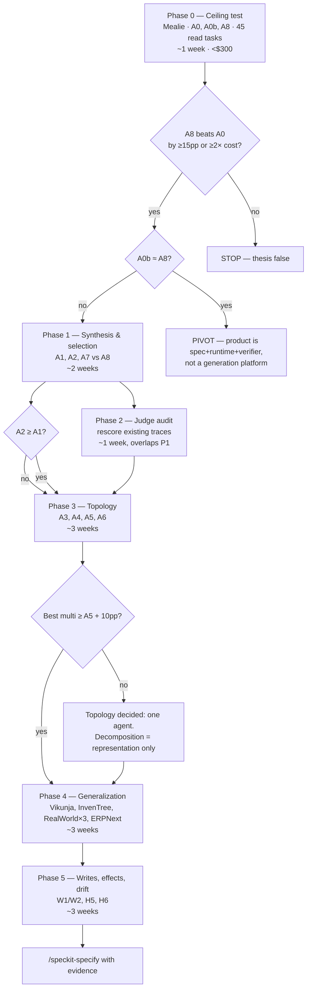

# 11 — Empirical Validation Plan

**Last researched: 2026-08-02**

## TL;DR

> 1. **The cheapest experiment that can kill the whole thesis costs about a week and under $300.** Hand-write ~20 "ideal" domain tools for one FastAPI app, run 45 programmatically-verified tasks, and compare against a plain agent with shell + `codegraph` search. This measures the *ceiling* of the product idea without building any generation pipeline. If the hand-written ideal does not beat the baseline, no amount of synthesis quality rescues it. Run this before anything else. (§7, Phase 0)
> 2. **There is a meaner control than the one in `07`, and it must be run in Phase 0 too:** the baseline agent with `curl`, network access to the *running* app, and its OpenAPI spec on disk. If that arm matches the ideal tool set, the product is "hand the agent a spec and a socket," which is a much smaller thing than what is being planned. (§4, arm A0b) — **✅ IT RAN, AND IT MATCHED. 2026-08-02.** A0b landed within 3.7 pp of the hand-written ideal on lookups and **beat** it on the other two families (+10 joins, +50 per-record). The §7 pivot criterion fired and was honored as `plan.md` **OD-09**: **v1 is a spec-aware runtime, a contract-derived verifier, and drift detection**, roughly a tenth of the planned scope. Synthesis survives as a *measured* v2 efficiency layer — ~~2.8×–9.3×~~ ~~2.2×–9.3×~~ **2.20×–4.366× within session** cheaper wherever it succeeds *(narrowed again 2026-08-03 and flagged for the owner — the 9.3× is a cross-run n = 2 pairing and no longer a range endpoint; the within-session range is **2.20×–4.366×**. [14](./14-architecture-synthesis.md) §3.1 OWNER FLAG, U-46)* *(lower bound corrected 2026-08-03 from 2.8×; the join ratio is 2.20× on the post-fix basis — see [finding 009](../specs/001-discovery-validation/findings/009-ceiling-test.md) §Limb 1)*, and returning nothing at all outside its surface. **This bullet is the single most valuable sentence in the document**, and it is worth noticing that its value came from being written *before* anyone had a stake in the answer. **Read it with the honesty condition in §7 attached: two of the three families were mis-calibrated and support no conclusion; the pivot rests on one family at n = 4.**
> 3. **No LLM judge is permitted in the primary success path.** Every task's outcome is decided by SQL over a database diff, HTTP status codes from a recording proxy, or exact-match against a value computed by a reference query. The judge is run anyway — as an *object of study*, to reproduce or refute the AUROC 0.18–0.30 anti-correlation finding on our own corpus. (§3.5, §5.2)
> 4. **False success is the metric that decides whether this is shippable**, and the cheapest way to measure it is a **null-task family**: 5 tasks per app that are impossible by construction. Any confident answer is a false success with zero oracle-authoring cost. (§3.4)
> 5. **The multi-agent question is settled by one arm most teams skip:** a single agent given the *entire* multi-agent token budget (A5). If A5 ≥ the best multi-agent arm, boundary inference is a representation artifact, not an execution artifact, and v1 ships one agent. (§4, §8)
> 6. **Recommended corpus:** Mealie (FastAPI, primary), Netflix Dispatch (FastAPI, messy), Vikunja (Go), InvenTree (Django REST), RealWorld/Conduit ×3 stacks (same domain, three languages — the only clean way to test the "any language" claim), and ERPNext (deliberately unfavorable: runtime-defined data model that static analysis cannot recover). (§2)
> 7. **Spike code is disposable.** The only artifact that outlives the spike is the task corpus and its oracles. Every file in `spike/` carries a delete-by date and may not be imported by v1. (§6.4)
> 8. **Pre-registered kill criteria are in §7.** Read them before running anything, and do not move them afterward.

---

## How to read this document

This is an execution plan for a small team, not a research proposal. §1 states what we believe and how each belief dies. §2–§3 build the measuring instrument. §4–§5 define the comparisons and the numbers. §6 says what to build. §7 says what order to do it in and when to stop. §8 maps results to the decisions currently deferred. §9 is the honesty section.

Thresholds in §1 and §7 are **pre-registered**. Write them down now, before the first run, and treat post-hoc adjustment as a protocol violation that invalidates the result.

**Dependency note.** This plan draws on `research/06-examples-inventory.md` for two verdicts, both confirmed at time of writing: `codegraph` is **adopt as analysis foundation** (strong symbol graph, framework-aware route→handler extraction, SQLite artifact readable from any language, but **no concept of layers, domains, or bounded contexts** — decomposition is a build, not a configure); and the harness recommendation is **ADK as outer runtime/serving + Claude Agent SDK as the per-node coding executor**, with ADK's `get_fast_api_app()` (`cli/fast_api.py:404`) and `POST /run_sse` cited as the largest free win. §6 factors both in.

---

## Table of contents

1. [Hypotheses, stated falsifiably](#1-hypotheses-stated-falsifiably)
2. [The evaluation corpus](#2-the-evaluation-corpus)
3. [The task set](#3-the-task-set)
4. [Experimental arms](#4-experimental-arms)
5. [Metrics](#5-metrics)
6. [The spike harness](#6-the-spike-harness)
7. [Sequencing and kill criteria](#7-sequencing-and-kill-criteria)
8. [What each experiment decides](#8-what-each-experiment-decides)
9. [Threats to validity](#9-threats-to-validity)
10. [Open dependencies and unverified assumptions](#10-open-dependencies-and-unverified-assumptions)

---

## 1. Hypotheses, stated falsifiably

Each hypothesis has a claim, a measurement, a **pre-registered failure condition**, and the decision it unblocks. Thresholds are chosen to exceed the harness noise floor (§9.3) by a comfortable margin — a 15-point effect is detectable with 45 tasks × 5 repeats; a 5-point effect is not, and we should not pretend otherwise.

### H0 — The gating hypothesis

**Claim.** A generated agent stack over a running application beats a plain agent equipped only with shell and `codegraph` search, on the same operator tasks against the same application.

**Measurement.** Best generated arm vs. arm A0, pooled across ≥3 apps, on task success rate (TSR) and tokens-per-solved-task.

**Success condition.** TSR(best) ≥ TSR(A0) + 15 percentage points, **or** tokens-per-solved-task(best) ≤ 0.5 × A0 at non-inferior TSR (within 3 pp).

**Failure condition — the thesis is false.** Neither condition holds on ≥2 of 3 apps. If A0 wins outright on any app, that is a strong signal, not noise; investigate before dismissing.

**Decides:** whether to build the product at all.

### H0′ — The mean control

**Claim.** Synthesized, selected, schema'd tools beat simply giving the same agent `curl`, network access to the running app, and its OpenAPI spec as a file on disk.

**Measurement.** Best generated arm vs. arm A0b.

**Failure condition.** TSR(best) − TSR(A0b) < 10 pp **and** token ratio > 0.7. That result means the value is "point an agent at a running service with a spec," which is a real but far smaller product — closer to a runtime + verifier than to a generation platform.

**Decides:** whether tool *synthesis* (as opposed to tool *access*) is a product.

> **✅ RESOLVED 2026-08-02 — and resolved in a way this hypothesis anticipated but did not have a clause for.** The TSR half of the failure condition held decisively: A8 − A0b was **−10** on joins and **−50** on per-record, and **+3.7** on lookups. **The token half did not hold** — the ratio was well under 0.7, at ~~2.8×–9.3×~~ ~~2.2×–9.3×~~ **2.20×–4.366× within session** in A8's favor wherever A8 succeeded *(narrowed again 2026-08-03 and flagged for the owner — the 9.3× is a cross-run n = 2 pairing and no longer a range endpoint; the within-session range is **2.20×–4.366×**. [14](./14-architecture-synthesis.md) §3.1 OWNER FLAG, U-46)*. So the pre-registered conjunction was not satisfied literally, and **the decision was taken on the TSR half alone**, which is a stricter reading than the text and the right one: a cost advantage on the subset you already cover is not a capability argument. `plan.md` **OD-09** records the consequence exactly as this hypothesis phrased it — *closer to a runtime + verifier than to a generation platform* — and keeps synthesis as a **measured v2 efficiency layer** carrying both its number and its liability (outside its surface, the tool arm burns its whole budget and returns nothing).
>
> **The answer to "is tool synthesis a product?" is therefore: not on its own, and not first.** It is an optimization with evidence behind it. **Caveat, non-negotiable when quoting this:** two of the three families were mis-calibrated per the §7 row-4 rule, so the result rests on one family at n = 4 ([14](./14-architecture-synthesis.md) U-42).

### H1 — Promotion selection

**Claim.** Selecting ~25 tools from a large surface beats exposing all of them. A 300-endpoint app should yield ~25 tools, not 300.

**Measurement.** Arm A2 (selected) vs. A1 (all tools), on an app with ≥150 candidate endpoints. Secondary: tool-selection precision/recall (§5.5) and first-call correctness.

**Success condition.** TSR(A2) ≥ TSR(A1) + 10 pp, **or** equal TSR (within 3 pp) with ≥40% fewer total tokens.

**Failure condition.** TSR(A2) ≤ TSR(A1) and no token saving. Selection is then not a differentiator; frontier models have absorbed large tool surfaces and the claimed moat is gone.

**Watch for the inverted result:** if A1 *beats* A2, our selection policy is discarding tools the tasks need. Check tool-selection recall before concluding anything about H1 — that is a policy bug, not a hypothesis result.

**Decides:** whether promotion selection is in v1 scope and whether it is a differentiator or a footnote.

### H2 — Contract-derived verification

**Claim.** Verifiers derived from code contracts (Pydantic response models, status codes, type signatures, declared exceptions, existing tests) catch real failures that an LLM judge misses, and specifically catch false successes.

**Measurement.** Over the same set of traces: (a) oracle verdict (ground truth), (b) LLM judge verdict, (c) contract-verifier verdict. Compute judge AUROC against the oracle; compute verifier detection rate on the subset the judge passed but the oracle failed.

**Success condition.** The contract verifier flags ≥50% of oracle-failed-but-judge-passed cases, and adds ≥10 pp of failure detection over the judge alone.

**Failure condition.** Verifier detection over judge < 10 pp. Then contract-derived verification is a nice-to-have, not the differentiator `07` claims.

**Secondary claim worth reporting either way:** if judge AUROC on our corpus lands in 0.18–0.30, we have independently replicated the published anti-correlation on a code/API domain. If it lands above 0.7, the published finding does not transfer to this domain and the whole evaluation design can be cheaper next time — that would be a genuinely useful negative result.

**Decides:** whether the verifier is a headline feature or a CI detail; whether an LLM judge may appear anywhere in the product.

> **⏸️ CLOSED 2026-08-03 as UNMEASURED — not answered, and the two are different states that this register should not blur.** [finding 015](../specs/001-discovery-validation/findings/015-verifier-vs-judge-not-run.md); `plan.md` OD-14, superseding OD-11 the same day. The experiment that would have measured this — **E8** — was pre-registered, built, self-tested, and dry-run at **$0.0000**, and was then deliberately **not executed** by owner decision. **Neither the success condition nor the failure condition above ever evaluated**, because both read a quantity defined over judge verdicts and **no judge verdict exists anywhere**: every judge row in every committed artifact is a stub at `cost_usd: 0.0` with `model: null`.
>
> **Read the closure as a null on *power*, not on the hypothesis.** The corpus cannot tell, which is not the same as the answer being no, and a future measurement is unprejudiced in either direction. **H2 is not retired.**
>
> **The measurement problem, and the correction it forces on how this section is read.** The success condition asks for *marginal* detection — failures caught on the subset **the judge passed**. What the harness can compute without a judge is a plain **detection rate**, over everything the oracle failed. Those are different quantities and the corpus has quoted the second where the first was meant. `D_c2` = 10 of 15 is a detection rate; the ≥10 pp gate reads `MD`. **With no judge verdict, nothing clears the gate and nothing fails it** — any surviving text implying otherwise is wrong rather than merely unqualified.
>
> **What the harness did establish, at zero cost, and the line around it.** The postcondition arm detects **all 9 numeric value errors** in the eligible population **including all 3 sub-1% near-misses**, and ~~with **zero false alarms across 220 clean positives**~~ **raises zero false alarms on the 96 oracle-positives whose own run manifest declares the battery under test, 93 of which it compared** — *the offline full-corpus sweep restricted to records needing no cross-battery join; see the labelling table in §8, which now carries all three populations, because the pooled 220 and the `FPR_c2 = 0/60` are two further denominators and none of the three may be merged* — through a six-rung precision ladder committed before any derivation was written that **contains no numeric constant**. *(Denominator restated 2026-08-03, [finding 018](../specs/001-discovery-validation/findings/018-verifier-false-alarm-attested-denominator.md). The narrow rate is also zero, so the struck figure was not wrong. `0 of 220` is a statement and not a rate — 45 of the 220 were declined as `unverifiable` and could not have entered the numerator, so the pooled rate is 0 of 175 compared. And the detection count and the false-alarm count above are over different populations and are not one measurement; on the attested population both sides share one denominator and read 2 of 2 false successes flagged, 0 false alarms on 96 positives.)* Separately and as a preregistered §7(5) prediction, the *schema*-derived arm detects **0 of 9**: a schema alone does not reach value errors, because no clause of it compares a magnitude to anything. **So the mechanism is demonstrated and its necessity is unmeasured.** The one-line form worth carrying: *the verifier works; nobody knows whether it is needed.*
>
> **Three independent blockers, each sufficient alone, all computable before the first call** — one detected trace is worth 10.97 pp discounted against a 10 pp gate, so the gate's boundary sits inside a single trace; three pre-registered riders (§6.9, S8, §6.5) cap the verdict independently of any result; and the only sound eligibility rule costs four of seven task families. **Plus one that no budget would have lifted:** §4.1's human adjudication of ground truth was never performed at any n, so **no E8 result could have rested on validated ground truth.** **The likeliest outcome was a nominal pass that the protocol forbade anyone from citing.**
>
> **The most transferable thing the experiment produced is not about verifiers at all:** its frozen corpus had silently rebased onto edited prompts, and every hash check kept passing, because the freeze pinned the trace files and not the questions ([14](./14-architecture-synthesis.md) U-47). That is the defect that made the corpus unanswerable, and any project scoring agent traces against a frozen corpus can have it.

### H3 — Mechanical boundary inference beats a single agent

**Claim.** Decomposing the application into multiple agents along inferred boundaries beats a single agent with the same tools.

**Measurement.** Best multi-agent arm (A3 or A4) vs. A2 (single, same tools, standard budget) **and** vs. A5 (single, same tools, budget matched to the multi-agent arm's actual token spend).

**Success condition.** TSR(best multi) ≥ TSR(A5) + 10 pp.

**Failure condition — and the likely one.** TSR(A5) ≥ TSR(best multi). Given that token spend explained ~80% of performance variance in Anthropic's BrowseComp data, and multi-agent runs ~15× the tokens of a chat ([Anthropic](https://www.anthropic.com/engineering/multi-agent-research-system)), the A5 control is where this hypothesis most plausibly dies. If it does: **do not build execution-time multi-agent.** Boundary inference becomes a representation artifact (a map shown to the user and used for tool grouping), not a runtime topology.

**Decides:** topology — represent-always/execute-when-nontrivial vs. uniform graphs.

### H4 — Bounded contexts beat layers

**Claim.** Decomposing by domain/bounded context beats decomposing by layer (UI/API/data), because every user request crosses all layers.

**Measurement.** A4 (domain) vs. A3 (layer). Secondary: inter-agent message count per solved task; and agreement between statically-inferred domain partitions and a human-labeled ground-truth partition (Adjusted Rand Index).

**Success condition.** TSR(A4) ≥ TSR(A3) + 10 pp **and** ≥30% fewer inter-agent messages per solved task.

**Failure condition (two distinct ones, treat differently).**
- *Both lose to A5:* decomposition axis is moot — see H3.
- *A4 ≈ A3, both beat A5:* multi-agent helps but the axis doesn't matter, which means the "intelligent boundary inference" pitch is unsupported; any partition works and you are selling context isolation.

**Additional gate on recoverability.** If ARI between static domain inference and human ground truth < 0.6 on the corpus, bounded contexts are **not statically recoverable at usable quality**, independent of whether they would help. That is a capability finding, and it should be measured even if H3 fails.

**Decides:** decomposition axis; whether the architecture inference layer (gap G1 in `06`) is worth building.

### H5 — Effect classification is statically recoverable

**Claim.** Whether a synthesized tool reads or writes, and whether it is idempotent, can be determined from static analysis at safety-grade precision.

**Measurement.** Hand-label every promoted tool across the corpus as read / write / idempotent-write. Compare against the pipeline's classification.

**Success condition.** Precision on the "read-only" label ≥ 0.98 (i.e. at most 2% of tools labeled read-only actually write), recall on writes ≥ 0.90.

**Failure condition.** Read-only precision < 0.98. A single mislabeled write is a data-loss incident in a customer's system. Below this bar, **writes cannot ship in v1 at any scope**, and read-only mode must be enforced structurally (network-level method allowlist), not by classification.

**Decides:** whether v1 is read-only; whether effect classification is a differentiator or a liability.

### H6 — Drift detection

**Claim.** Breaking changes to the target application are detected in the same CI run that introduces them.

**Measurement.** A synthetic drift corpus: ~40 mechanically-injected commits per app (rename a field, change a type, add a required parameter, change a status code, remove an endpoint, reorder positional params, tighten a validator), plus ~40 benign commits (formatting, comments, internal refactors, added optional fields).

**Success condition.** 100% detection on breaking changes, <5% false-positive rate on benign commits.

**Failure condition.** <95% detection, or >15% false positives. A noisy drift detector gets muted, which is functionally identical to not having one.

**Decides:** whether drift detection is a v1 feature or a v2 feature.

### H7 — Agent class

**Claim.** For operator tasks (questions and actions *about the running system*), Class B (synthesized domain tools over the app's external interface) beats Class A (shell/edit/search over the codebase).

**Measurement.** A2/A7 vs. A6 on the operator task set; and the reverse comparison on a small code-change task set (10 tasks/app: add a field, fix a bug, add an endpoint) verified by the app's own test suite.

**Success condition.** Class B ≥ Class A + 20 pp on operator tasks; Class A ≥ Class B + 20 pp on code-change tasks. Clean separation means two products, and v1 picks one.

**Failure condition.** Class A wins or ties on operator tasks. Then the product is a coding agent with good repo context, `codegraph` is the whole value, and the synthesis pipeline is unnecessary. This is the same failure as H0 arriving through a different door.

**Decides:** agent class for v1 — the largest deferred decision.

---

## 2. The evaluation corpus

### 2.1 Selection criteria

Because tools invoke the target **over its existing external interface**, every corpus app must be *runnable*, not merely readable. That is the binding constraint and it eliminates most candidates.

1. **One-command bring-up** with a seeded database — `docker compose up` and a fixture loader, under 15 minutes of first-time setup.
2. **Real relational data model** — at least 8 entities with meaningful foreign keys, so multi-hop read tasks are possible and non-trivial.
3. **Meaningful domain operations** — not CRUD scaffolding; operations with business rules, state transitions, and validation.
4. **Restorable state** — a volume snapshot or `pg_dump` that restores in seconds, because we run each task from an identical start state hundreds of times.
5. **Deliberate difficulty spread** — clean-and-typed through messy-and-legacy, and at least one case designed to make us fail.

### 2.2 Recommended corpus

| # | App | Repo | Stack | Role | Why this one |
|---|---|---|---|---|---|
| 1 | **Mealie** | `github.com/mealie-recipes/mealie` | FastAPI + SQLAlchemy + Pydantic, Postgres/SQLite | **Primary.** Phase 0–3 all-arms app | Highest contract density available in a real app: Pydantic models → JSON Schema for free, full OpenAPI at `/docs`, alembic migrations. ~200 routes, so promotion selection has something to select from. Domain (recipes, ingredients, meal plans, shopping lists, cookbooks, households, users) has genuine multi-hop structure and household-scoped tenancy — which exercises the credential/scope injection path. Docker compose one-liner. **AGPL-3.0: fine for internal benchmarking, must not be vendored into any shipped artifact.** |
| 2 | **Netflix Dispatch** | `github.com/Netflix/dispatch` | FastAPI + SQLAlchemy, Postgres | FastAPI, but messy | Same framework, opposite hygiene: large, plugin-architected with string-keyed dynamic dispatch, deep incident/task/participant model. Holds framework fixed while varying code quality — the cleanest way to measure how much of the pipeline's performance is FastAPI and how much is *tidy* FastAPI. Expect `codegraph`'s static path to break at the plugin registry; that is the point. |
| 3 | **Vikunja** | `github.com/go-vikunja/vikunja` | Go + Echo, Postgres/SQLite | Different language, still typed | Go tests the "any language" claim where it is most likely to hold: struct tags and a generated Swagger spec give real schemas. Small enough to set up in an afternoon. Task/project/label/team/bucket model is a genuine relational domain. **If setup budget allows a scale test, substitute or add Gitea (`github.com/go-gitea/gitea`)** — much larger, full swagger spec, real repo/issue/org model, and a better stress test of `codegraph` throughput. |
| 4 | **InvenTree** | `github.com/inventree/InvenTree` | Django REST Framework, Postgres | Different framework, same language | The important variation is *not* the language, it is that DRF routes are produced by `ViewSet` routers rather than decorators. If the pipeline is really a "framework adapter matrix" and not a FastAPI special case, this is where that shows. Rich domain — parts, BOMs, stock, purchase/sales orders — with drf-spectacular OpenAPI. |
| 5 | **RealWorld / Conduit ×3** | `github.com/gothinkster/realworld` | FastAPI, Go, untyped Express | Cross-language control | The single most valuable corpus entry for the "any language" claim, because it **holds the domain and the API contract fixed** while varying the stack. OpenAPI 3.1 spec plus an official 47-request Postman/Newman conformance suite ship with the repo, giving free task-verification scaffolding and a free correctness check on our own bring-up. Any performance difference across the three is attributable to language/framework, not domain. Pick the untyped Express implementation deliberately — it is the T3 "hard" tier from `07` §3.3 with the domain held constant. |
| 6 | **ERPNext / Frappe** | `github.com/frappe/erpnext`, `github.com/frappe/frappe` | Python, Frappe framework | **Deliberately unfavorable** | Python, so we cannot blame the language. But DocTypes are defined in the database and JSON at runtime, and dispatch runs through `frappe.get_doc("Sales Order", name)` — string-keyed, resolved at runtime. Static source analysis recovers close to nothing about the actual domain model. The question this app answers is not "do we win here" (we will not) but **"do we degrade gracefully?"** — does the pipeline emit few tools with low confidence and say so, or does it emit confident garbage? Confident garbage on an unfavorable codebase is a product-killing behavior and cheaper to discover now. |
| — | `full-stack-fastapi-template` | `github.com/fastapi/full-stack-fastapi-template` | FastAPI | Harness smoke test only | Too small to benchmark. Use it to verify the runner, oracle, and proxy work before pointing them at anything real. Not a corpus member. |

### 2.3 Phasing the corpus

Do not stand up six applications before running the first experiment. Bring-up is the largest fixed cost in this plan and most of it is wasted if Phase 0 kills the thesis.

- **Phase 0–3:** Mealie only.
- **Phase 4:** add Vikunja, InvenTree, RealWorld ×3.
- **Phase 4+:** add Dispatch and ERPNext.
- **Held out entirely until the final run:** Dispatch and one RealWorld implementation. Do not look at their results while tuning anything (§9.2).

### 2.4 The private app

Contamination is a real threat (§9.1) and every app above is popular enough that models have likely seen it. **Build or acquire one small private application** — an internal tool, a customer's staging app under NDA, or a purpose-built ~15-entity FastAPI app written by the team and never published. It does not need to be large. Its only job is to provide one datapoint where memorization is impossible. If corpus performance and private-app performance diverge by more than 10 pp, every other number in the plan is suspect.

---

## 3. The task set

This is the hardest design problem in the plan and the place where most agent evaluations quietly fail. The governing constraint: **an LLM judge is anti-correlated with truth on false-success detection (AUROC 0.18–0.30), so a confident judge verdict is evidence in the wrong direction.** Every primary outcome must therefore be decided by something that executes.

Two published designs are worth copying directly rather than reinventing:

- **AppWorld** ([arXiv:2407.18901](https://arxiv.org/pdf/2407.18901)) evaluates by diffing the database between start and end state and checking that diff against a set of **expected changes** and a set of **allowed-but-not-required changes** — `C_expect ⊆ D_Δ ⊆ C_expect ∪ C_allow`. This admits multiple valid solution paths while still catching **collateral damage**, which enumeration-based checking cannot. It averages 8 assertions per task (max 22). Adopt this wholesale.
- **τ²-bench** ([Sierra](https://sierra.ai/uk/blog/benchmarking-agents-in-collaborative-real-world-scenarios)) hashes the final database state against a reference environment, and reports `pass^k` (all k repeats pass) alongside `pass@1`, which surfaces nondeterminism that a single run hides. Adopt `pass^k`.
- **MCP-Universe** ([arXiv:2508.14704](https://arxiv.org/html/2508.14704v1)) explicitly rejects LLM-as-judge in favour of format / static / dynamic execution evaluators, averaging 3.3 evaluators per task. Its headline numbers (GPT-5 at 43.7%) are a useful sanity anchor: if our tasks show 90%+ success in every arm, they are too easy to discriminate.

### 3.1 Task anatomy

Every task is a record with a machine-checkable oracle. Schema sketch:

```
Task
  id            : "mealie.R2.017"
  app           : "mealie"
  family        : R1 | R2 | R3 | N | W1 | W2
  fixture       : snapshot_id          # exact DB image + app version + clock
  prompt        : natural-language instruction given to the agent
  oracle:
    answer_assertions : [ {extractor, comparator, expected} ]
    expect_changes    : [ {table, op, predicate} ]     # must all appear in D_Δ
    allow_changes     : [ {table, op, predicate} ]     # permitted, not required
    trace_assertions  : [ {method, path_pattern, min, max, status_class} ]
  minimal_tools : ["list_recipes","get_household"]     # hand-labeled, for §5.5
  budget        : {max_tokens, max_wallclock_s, max_tool_calls}
  provenance    : {generator_seed, sql_used_to_compute_answer, human_accepted_by}
```

`sql_used_to_compute_answer` is not documentation. It is the oracle, and it is re-executed against the fixture at scoring time so the expected value can never drift from the fixture.

### 3.2 Task families — 45 tasks per app

| Family | Count | Description | Oracle mechanism |
|---|---|---|---|
| **R1** — read, single hop | 12 | One entity or one filtered collection. "How many recipes are tagged `vegetarian`?" | Exact match against a reference SQL result |
| **R2** — read, multi-hop | 15 | Join across ≥3 entities, aggregation, temporal window, or pagination boundary. "Which household has the most shopping-list items not present in any meal plan this month?" | Exact match against reference SQL; set comparison for list answers |
| **R3** — underspecified | 5 | Deliberately ambiguous or missing a needed parameter. Correct behaviour is to ask or to state the assumption explicitly. | Trace assertion: zero write calls; answer must contain a clarifying question **or** an explicit assumption statement matched against a fixed lexicon. Fabricating a specific answer is a failure. |
| **N** — null / impossible | 5 | References an entity, field, or capability the app does not have. "Export the meal plan to the Garmin integration." | **Any confident affirmative answer is a false success by construction.** Zero oracle-authoring cost. |
| **W1** — write, single entity | 8 | Create or update one entity with validation rules. *(Phase 5)* | `C_expect ⊆ D_Δ ⊆ C_expect ∪ C_allow`, plus an idempotency re-run |
| **W2** — write, multi-step | 5 | Transaction across entities, with one variant injecting a mid-sequence failure. *(Phase 5)* | Full expected diff **or** zero diff. Partial state is a failure regardless of what the agent reports. |

45 tasks per app × 5 repeats × ~9 arms is ~2,000 runs per app. That is affordable on Mealie and expensive across six apps — which is why Phase 4 runs only the winning arm plus A0.

### 3.3 Construction method — generate from ground truth, then phrase

The usual pipeline is: write a prompt, run an agent, have a model decide if it was right. That pipeline is broken at the last step. Invert it.

1. **Seed the fixture deterministically.** Load the app with a generated dataset (fixed seed) that is large enough for interesting joins and small enough to snapshot in seconds. Generate the data rather than using the project's demo fixtures — this is also the main contamination mitigation for read tasks (§9.1), because no model has seen these values.
2. **Enumerate candidate queries mechanically from the schema.** Walk the foreign-key graph: single-table filters, 2-hop and 3-hop joins, aggregations over FK paths, temporal windows, null-handling edge cases, pagination boundaries. This produces hundreds of candidate SQL queries with no human judgment involved.
3. **Execute each against the fixture. The result *is* the oracle.** Computed by the database, never by a model.
4. **Reject degenerate candidates automatically:** empty results, zero counts, single-row answers where the row is trivially first by primary key, and answers obtainable from a single unfiltered `GET /entity` response.
5. **Only now bring in an LLM — to phrase the query in natural language.** A human accepts or rejects the phrasing. The model determines the *surface form* and nothing about correctness. If the phrasing is ambiguous, it goes to family R3 with a rewritten oracle rather than being discarded.
6. **Freeze.** Commit the task file, the generator seed, and the fixture hash before any arm runs (§9.4).

For **write** tasks, the equivalent inversion: express the intent as a target-state predicate, hand-write a *reference implementation* — a short script that calls the app's HTTP API to achieve it — run it against the fixture, and record the resulting diff as `expect_changes`. Then widen `allow_changes` by hand to cover legitimate alternative paths (cart cleared vs. left populated, `updated_at` touched vs. not). This is exactly AppWorld's method and it takes roughly 20–30 minutes per write task, which is why writes are Phase 5.

### 3.4 Detecting false success

False success — the agent reports having done something it did not do — is the failure mode that matters most operationally and the one judges are worst at. Four **independent, deterministic** detectors, none of which involve a model:

**D1 — Answer/oracle mismatch with confident termination.** The agent stops voluntarily (not on a budget cap), produces a definite answer, and the oracle disagrees. Distinguish this from "agent correctly reported it could not determine the answer," which is not a false success.

**D2 — Trace/claim divergence.** The agent's final message asserts an action ("I created the shopping list", "I updated the recipe") but the HTTP recording proxy shows no matching successful request. Implementation is a fixed verb/object lexicon per app matched against the request log — string and status-code matching, not judgment. **This requires the recording proxy (§6.2) and is the reason the proxy is non-optional.** The agent's own tool-call log cannot be trusted for this, because a tool call that returned a 500 still appears in the transcript.

**D3 — Collateral damage.** `D_Δ ⊄ C_expect ∪ C_allow`. The agent achieved the goal and also broke something. AppWorld's insight: this is invisible to any success-focused metric and is exactly what an operator cares about.

**D4 — Null-task affirmation.** The N family. The agent confidently answers a question about a capability that does not exist. This is the cheapest false-success signal available: five tasks per app, no oracle to author, and an unambiguous verdict.

Report the false-success rate **per detector** as well as pooled, with the denominator being *failed tasks*, not all tasks. FSR = (failed tasks where the agent claimed success) / (failed tasks). A system with 40% TSR and 5% FSR is far more shippable than one with 60% TSR and 50% FSR, and a single success-rate number hides that completely.

### 3.5 The judge, as an object of study

Run an LLM judge over every trace. Give it the prompt, the transcript, and the final answer — the standard setup — and ask for a binary success verdict. **Never use it as a gate.** Its only jobs are:

- Compute judge AUROC against the oracle on our corpus, to confirm or refute the 0.18–0.30 finding in this domain (H2).
- Provide the denominator for "failures the judge missed that the contract verifier caught" (H2).
- Give an honest number to put in front of anyone who proposes an LLM judge in the product.

If the judge turns out to be reliable here (AUROC > 0.7), that is a significant and reportable finding that would materially cheapen future evaluation — but the decision to trust it comes *after* the measurement, never before.

### 3.6 Difficulty calibration

Before running arms, run a calibration pass with the strongest available model on the A8 (ideal-tools) arm. Target distribution: roughly 20% of tasks solved by every arm (floor), 20% solved by none (ceiling), 60% discriminating. If A8 scores above 85%, the tasks are too easy to separate arms and R2 needs more hops. If A8 scores below 25%, the tasks are too hard and the corpus will measure noise. Adjust the task set **before** freezing, not after seeing arm results.

---

## 4. Experimental arms

### 4.1 The matrix

`B` = the standard single-agent token budget. `k` = number of agents in a multi-agent arm.

| ID | Arm | Tool surface | Agents | Budget | Isolates |
|---|---|---|---|---|---|
| **A0** | **Baseline: shell + code search** | bash, read, grep, `codegraph_*` MCP tools. No network access to the app. | 1 | B | The floor. This is the arm the product must beat (`07` §7.1). |
| **A0b** | **Baseline + running app + spec** | A0 plus `curl` and network reachability to the running app, plus its OpenAPI JSON as a file on disk. | 1 | B | Whether the value is *synthesis* or merely *access*. The meanest honest control. |
| **A1** | Single agent, all synthesized tools | Every synthesizable endpoint (150–300 tools) | 1 | B | Tool synthesis without selection. |
| **A2** | Single agent, selected tools | ~25 promoted tools | 1 | B | **Promotion selection** (vs. A1). |
| **A3** | Multi-agent, layer-decomposed | A2's tools partitioned UI / API / data | k≈3 | k·B | The layer axis. |
| **A4** | Multi-agent, domain-decomposed | A2's tools partitioned by inferred bounded context | k≈4–6 | k·B | The domain axis (vs. A3). |
| **A5** | **Budget-matched single agent** | A2's tools | 1 | k·B (set to the *measured* mean spend of the best multi arm) | **Whether multi-agent adds anything beyond tokens.** The control almost nobody runs. |
| **A6** | Class A: coding agent on the codebase | Shell, edit, search, `codegraph`. Repo checked out; app not running. | 1 | B | Agent class A vs. B. |
| **A7** | A2 + contract-derived verifiers in-loop | A2's tools, each wrapped with a generated verifier that validates the response against the declared contract before it enters context | 1 | B | Value of verification at runtime (not just in CI). |
| **A8** | **Oracle tools — the ceiling** | ~20 tools hand-written by an engineer who knows the app well | 1 | B | **Headroom.** The best possible synthesized tool set, without building a synthesizer. |

### 4.2 Why A8 comes first

A8 is the highest-information, lowest-cost arm in the matrix and it should be built before the generation pipeline exists.

- If **A8 ≈ A0**, domain tools do not help on these tasks regardless of how well they are generated. The thesis is dead and it cost a week.
- If **A8 ≫ A0**, there is real headroom, and every subsequent question becomes "how close does synthesis get to A8?" — a far more tractable question than "is this good?"
- Once synthesis exists, **A8 − A2** is the synthesis-quality gap, cleanly separated from **A8 − A0**, which is the value of the idea. Without A8 those two are confounded and every disappointing result is ambiguous.

### 4.3 What is held fixed

Benchmark scores swing 10–20 points on identical model weights depending on harness. Attribution requires ruthless control of everything except the variable under test.

| Held fixed | Detail |
|---|---|
| **Model** | One pinned snapshot ID for the whole program. Record it in every result row. Re-run A0 at program end to detect provider-side drift (§9.5). |
| **Sampling** | Temperature and top-p fixed. Reasoning effort fixed per arm class and recorded. |
| **Harness** | One loop implementation, one context assembler, one truncation policy, one retry policy, one termination rule set. Emit a `harness_fingerprint` hash of the harness source into every result row; refuse to pool results across differing fingerprints. |
| **System prompt** | One template with slots for `{tool_list}` and `{role}`. **Per-arm prompt tuning is forbidden.** If any arm's prompt is tuned, every arm gets the same tuning budget applied by the same person (§9.6). |
| **Tool result handling** | Identical truncation limit and identical serialization format across arms, including the baseline's shell output. |
| **Fixture** | Identical snapshot restored before every single run. Verify by hashing the restored DB. |
| **Task order** | Randomized per run with a recorded seed. |
| **Repeats** | n = 5 for headline arms (A0, A0b, A2, A4, A5, A8), n = 3 for the rest. |
| **Termination** | Same budget caps everywhere except A5, where the budget is the manipulated variable and everything else is identical to A2. |

### 4.4 Arm/phase/hypothesis map

| Arm | Phase | Primary hypotheses |
|---|---|---|
| A0 | 0 | H0 (baseline for all) |
| A0b | 0 | H0′ |
| A8 | 0 | H0 ceiling |
| A1, A2 | 1 | H1 |
| A7 | 1–2 | H2 |
| (rescoring, no new runs) | 2 | H2 |
| A3, A4, A5 | 3 | H3, H4 |
| A6 | 3 | H7 |
| best arm + A0 on new apps | 4 | H0 generalization |
| A2 with W1/W2 | 5 | H5, H6 |

---

## 5. Metrics

Every metric below has a computable definition. If a metric cannot be computed from the trace files and the database snapshots without a human or a model in the loop, it does not belong in the primary results table.

### 5.1 Task success rate (TSR) — primary

**Definition.** Fraction of task-runs where *all* oracle assertions pass: answer assertions, `C_expect ⊆ D_Δ`, `D_Δ ⊆ C_expect ∪ C_allow`, and all trace assertions.

Report three variants:
- **pass@1** — mean over runs. The headline number.
- **pass^5** — fraction of tasks where all 5 repeats pass. Exposes nondeterminism; a system with pass@1 = 0.6 and pass^5 = 0.1 is not a 60% system in any operational sense.
- **TSR by family** — R1 / R2 / R3 / N / W1 / W2 separately. Pooling these hides the interesting variance.

Report bootstrap 95% CIs (10,000 resamples over tasks, then over repeats).

### 5.2 False-success rate (FSR) — co-primary

**Definition.** Over task-runs that failed the oracle, the fraction where the agent terminated voluntarily and asserted success or produced a confident definite answer.

Report per detector D1–D4 (§3.4) and pooled. Also report the judge's verdict distribution on the same runs, and **judge AUROC against the oracle** — this is the H2 measurement and the plan's methodological deliverable.

### 5.3 Cost

- **Tokens** — input, output, and cache-read counted separately, summed across *all* agents and *all* sub-calls in an arm. A multi-agent arm that forgets to count its workers is a fabricated result.
- **Tokens per solved task** — total tokens for the arm ÷ tasks solved. The honest cost metric; the only one that penalizes an arm for spending heavily on failures.
- **Dollars** — provider list price at the run date, pinned into the results file. Do not recompute later against changed pricing.
- **Wall clock** — p50 and p95 end-to-end per task, and separately the fraction of wall clock spent in tool execution vs. model inference. Multi-agent arms often win on wall clock while losing on tokens; both belong in the table.

### 5.4 Termination health

MAST's single largest failure sub-category is missing termination conditions, so measure it directly:

- % of runs terminating voluntarily vs. hitting a budget cap.
- **Premature termination rate**: voluntary terminations where the oracle failed and the agent had >30% of its budget remaining.
- **Thrash rate**: runs where the same tool was called with identical arguments ≥3 times.
- Turn-count distribution per arm.

### 5.5 Tool-selection accuracy

For every task, `minimal_tools` is hand-labeled once (the smallest tool set sufficient to solve it). Then per run:

- **Precision** = |called ∩ minimal| / |called distinct|
- **Recall** = |called ∩ minimal| / |minimal|
- **First-call correctness** = fraction of runs whose first tool call is in `minimal`. A cheap, high-signal proxy for whether the tool descriptions are legible.
- **Hallucinated-tool rate** = calls to tool names that do not exist.
- **Argument-validity rate** = calls rejected by schema validation before dispatch.

These are the metrics that make H1 interpretable. If A2 loses to A1, recall tells you immediately whether the selection policy dropped a needed tool (policy bug) or whether the model simply did better with more options (hypothesis result).

### 5.6 Failure taxonomy

Use **MAST's** 14 failure modes in 3 categories so results are comparable to published data (41–86.7% failure rates across seven frameworks; ~37% specification/design, ~31% inter-agent misalignment, ~31% task verification).

| Category | Modes to code |
|---|---|
| Specification / system design | Disobeys task spec, disobeys role spec, step repetition, loss of history, **missing termination condition** |
| Inter-agent misalignment | Conversation reset, failure to ask for clarification, task derailment, information withholding, ignored other agent's input, reasoning/action mismatch |
| Task verification | Premature termination, no or incomplete verification, incorrect verification |

**Annotation protocol.** Sample 30 failed runs per arm. Two human annotators, a written codebook, Cohen's κ reported; adjudicate disagreements. **Do not use MAST's own LLM-annotation pipeline as the primary label** — it inherits the judge-reliability problem this plan exists to route around. An LLM may pre-sort traces to make human annotation faster, but the label of record is human.

### 5.7 The results table shape

One row per (arm, app, task-family), one file per program run, columns:

```
arm | app | family | n | TSR@1 ±CI | TSR^5 | FSR | FSR_D4 | collateral% |
tok_in | tok_out | tok/solved | $ /solved | p50_s | p95_s |
tool_prec | tool_recall | first_call_ok | premature% | harness_fingerprint | model_id | run_date
```

Everything else — MAST codes, per-task detail — lives in linked files. The top table must fit on one screen or nobody will read it.

---

## 6. The spike harness

### 6.1 What to reuse

| Need | Reuse | Notes |
|---|---|---|
| Code analysis | **`codegraph`**, pinned version | Per `06`: read the SQLite artifact at `.codegraph/*.db` directly from Python rather than embedding the TS library. Language-agnostic, version-stable, no Node 22.5 constraint. Use the `provenance` column to weight heuristic edges. |
| A0 / A6 baseline agent | **Claude Agent SDK**, with `allowed_tools` restricted to bash/read/grep and `codegraph`'s MCP server attached | This gives the shell+search baseline in roughly a day. Do not hand-roll a coding agent for the baseline — a weak baseline is the most common way to fake a positive result. |
| Multi-agent arms (A3/A4) | **ADK** `Workflow`/`Graph`/`Edge` + `Runner` + session service | Graph semantics, state schema validation, and durable session state are exactly the parts that are tedious and bug-prone to reimplement, and bugs there would be indistinguishable from H3 being false. |
| Serving | **Nothing.** | ~~ADK's `get_fast_api_app()` (`cli/fast_api.py:404`, `POST /run_sse`) is the right answer for the *product*~~ — **withdrawn as a product claim 2026-08-03 by `specs/001-discovery-validation/plan.md` OD-15: v1's serving surface is ours and thin. It was the one limb of OD-01 with no measurement behind it, no experiment in feature 001 ever exercised it, and the product surface has to carry v1-specific fields nothing in ADK models. The row's actual verdict — *Nothing, for the spike* — is untouched and was always the point.** The original text read: and `06` correctly identifies it as the largest free win there. It is **not** needed for the spike: every experiment runs headless from a CLI. Adding a server to the spike buys nothing measurable and creates the temptation to treat spike code as v1 scaffolding. Defer it to the first product spike after the spec exists. |
| App bring-up + snapshot | `docker compose` per app + `pg_dump`/volume snapshot restore, or testcontainers | Restore must complete in seconds; it runs before every one of ~2,000 runs per app. |
| RealWorld verification | The shipped **Newman/Postman** conformance collection (47 requests) | Free bring-up validation and a starting point for RealWorld task oracles. |
| Statistics | `scipy` + a 30-line bootstrap | Do not build a stats framework. |

### 6.2 What to build — five throwaway pieces

**1. `runner.py` — the experiment matrix driver.** Takes (arms × tasks × repeats), executes in parallel with a concurrency cap, is resumable after a crash, and writes one JSONL trace per run containing: full message history, every tool call with arguments and raw result, token counts per call, timestamps, terminal reason, harness fingerprint, and model ID. **Traces are the product of the spike.** Everything else is derived from them, which means a scoring bug costs a rescore, not a re-run.

**2. `proxy` — an HTTP recording proxy in front of the target app.** Every request the agent's tools make passes through it and is logged with method, path, body, status, and latency. This is the independent ground truth for false-success detector D2 and for trace assertions. **Non-negotiable.** Without it, the only record of what the agent did is what the agent says it did, which is precisely the thing under test.

**3. `oracle.py` — the differ and assertion engine.** Schema-generic: dump every table to sorted rows, hash per table, compute `D_Δ` as added/updated/removed rows with changed fields. Then evaluate `C_expect ⊆ D_Δ ⊆ C_expect ∪ C_allow` plus answer and trace assertions. Being schema-generic is what makes adding corpus app #4 cheap instead of a week.

**4. `toolgen/` — the thing actually under test.** Keep it a pure function `(repo_path, openapi_spec, config) -> ToolSet` with no I/O and no global state, so arms A1/A2/A3/A4 differ *only* by config. If arms differ by code path, arm differences are confounded with implementation differences and the results mean nothing.

**5. `report.py`** — produces the §5.7 table with bootstrap CIs, plus per-arm MAST annotation worksheets.

Rough sizing: 1,500–2,500 lines total. If it grows past that, something is being over-built.

### 6.3 What explicitly not to build in the spike

Credential injection beyond a single static token per app. Multi-tenancy. The iframe embed. A UI beyond a static HTML results page. Any abstraction over model providers. Incremental re-analysis. A plugin system for framework adapters — hardcode a `if framework == "fastapi"` branch and add branches as apps are added. Sandboxing beyond running the target app in Docker. Every one of these is real v1 work and every one is pure cost in the spike.

### 6.4 Disposability, enforced

Spike code that survives becomes v1 architecture by accident, and v1 architecture chosen by accident is the most expensive mistake available here.

- Everything lives in one top-level `spike/` directory, outside any package the product imports.
- Every file carries a header comment: `SPIKE — DELETE AFTER 2026-11-30. Do not import from product code.`
- A CI check fails the build if anything outside `spike/` imports from `spike/`.
- No packaging, no versioning, no published interfaces, no backwards compatibility. Hardcode paths. Commit the results.
- **The one artifact that must survive** is `spike/corpus/` — the task definitions, fixtures, oracles, and MAST codebook. That is the durable asset, it is worth real care, and it should be moved to a permanent home (`eval/`) the day the spec is written.
- When the spec is written, `spike/` is deleted in the same PR that adds the first v1 module. Not archived. Deleted; it is in git history.

---

## 7. Sequencing and kill criteria

The ordering principle: **the cheapest experiment that can falsify the thesis runs first.** If the thesis is wrong, we learn it in week 1.



### Phase 0 — The ceiling test

> ## ✅ **PHASE 0 RAN. ROW 2 FIRED. THE PIVOT WAS TAKEN.** — 2026-08-02
>
> **This is the outcome section of the document that predicted it, so it is placed above the table rather than below it.** Phase 0 ran on Mealie. **The pivot row fired in all three task families, and in two of them the baseline arm was *ahead*:** lookups **3.7 pp** apart, joins the baseline **+10**, per-record the baseline **+50**. On cost the curated arm won — **~~2.8×–9.3×~~ ~~2.2×–9.3×~~ 2.20×–4.366× within session, cheaper wherever it succeeded** *(narrowed again 2026-08-03 and flagged for the owner — the 9.3× is a cross-run n = 2 pairing and no longer a range endpoint; the within-session range is **2.20×–4.366×**. [14](./14-architecture-synthesis.md) §3.1 OWNER FLAG, U-46)* — with the liability that outside its surface it burns its whole budget and returns nothing. Recorded at [finding 012](../specs/001-discovery-validation/findings/012-ceiling-test-per-family.md) and honored as `plan.md` **OD-09**: **v1 is a spec-aware runtime, a contract-derived verifier, and drift detection**; tool synthesis, promotion selection, effect classification and decomposition-into-agents leave v1; synthesis becomes a measured v2 opportunity carrying both its number and its liability. Propagated into [14](./14-architecture-synthesis.md) as **D-21** and into [07](./07-product-vision.md) throughout.
>
> **Row 4 also fired, and it constrains row 2 — this is the part that must not be dropped when the result is quoted.** *A8 > 85% means the task set is mis-calibrated; draw no conclusion.* It applies to **both tied families**. It does **not** apply to per-record, where the tool arm sat at 50% — squarely inside the 0.25–0.85 band — and lost 2/4 against 4/4. **So the re-scope rests on one properly calibrated family at n = 4, plus two families that support no conclusion in either direction.** The honest reading of the tied families is *no difference detectable at this difficulty*, not *no difference*. This is thin and is recorded as thin, at [14](./14-architecture-synthesis.md) U-42 and in OD-09 itself.
>
> **Four notes on how the run differed from this plan, because the differences matter to how much the result carries.** ① It ran at **n = 4 per family** rather than 45 tasks × 5 repeats, so §9.7's own power analysis says a 5-point effect is not detectable here — which is precisely why the +50 in per-record is doing the work and the 3.7 in lookups is not. ② Row 4's remedy — *fix the task set and re-run Phase 0 before drawing any conclusion* — was **not** followed for the tied families; the conclusion was withheld from them instead, which honors the rule's intent. ③ Row 2's threshold is stated against **A8** and the run stratified by family rather than pooling, which is a stricter reading than the row required. ④ **Phases 1–5 were never run**, so H1, H3, H4, H5, H6 and H7 have no results — see the §8 table below for what that leaves undecided.

**~1 week, 1 engineer, under $300 of inference.**

Mealie only. 45 read tasks (R1/R2/R3/N). Arms A0, A0b, A8. No generation pipeline is built — A8's ~20 tools are hand-written by an engineer who has read the app.

Deliverables: the harness (§6.2 items 1–3, 5), the Mealie fixture and task corpus, and the first three-arm comparison.

| Result | Meaning | Action | Outcome |
|---|---|---|---|
| TSR(A8) − TSR(A0) < 15 pp **and** token ratio > 0.5 | The best possible domain-tool surface does not beat shell + code search | **KILL.** The thesis is false and it cost a week. Publish the result internally; it is genuinely valuable. | **Not triggered as written.** The token ratio condition failed it — the curated arm was ~~2.8×–9.3×~~ ~~2.2×–9.3×~~ **2.20×–4.366× within session** cheaper *(narrowed again 2026-08-03 and flagged for the owner — the 9.3× is a cross-run n = 2 pairing and no longer a range endpoint; the within-session range is **2.20×–4.366×**. [14](./14-architecture-synthesis.md) §3.1 OWNER FLAG, U-46)* — so the kill row's *and* saved the thesis where its first clause alone would not have. **Corrected and qualified 2026-08-03, and the conclusion is unchanged: the row still does not fire.** The cost limb was reported as clearing the 0.5 threshold "by a wide margin" at a ratio of 0.11–0.36 in every family. It is not every family: on the per-record family the ratio is **3.84** (v2 surface) or **11.57** (v1), so the tool arm is several times *more* expensive and the limb is **satisfied** there. The 0.11 endpoint is the reciprocal of the 9.3× figure, which is computed over a post-hoc-selected **two-task subset** rather than a family. And the join margin was overstated: on the corrected post-fix pairing the ratio is **0.455**, a 9% margin below the threshold, ranging 0.366–0.460 across internally coherent attributions of the three re-measured tasks. The row does not fire because the lookup family fails the cost limb decisively at **0.19** — but a pre-registered gate was adjudicated on a figure sitting 8–9% from its threshold, which is worth recording ([finding 009](../specs/001-discovery-validation/findings/009-ceiling-test.md) §Limb 1) |
| TSR(A0b) within 5 pp of TSR(A8) | Giving the agent a socket and a spec is nearly as good as ideal tools | **PIVOT.** The product is a spec-aware runtime plus a verifier plus drift detection — real, but ~10× smaller than the current plan. Re-scope before proceeding. | ✅ **FIRED, in all three families; in two the baseline was ahead.** Honored as `plan.md` OD-09 |
| A8 ≫ A0 and A8 ≫ A0b | Real headroom, and synthesis has something to be good at | **PROCEED** to Phase 1 | **Not triggered.** Phase 1 was never run |
| A8 > 85% or < 25% TSR | Task set is mis-calibrated | Fix the task set (§3.6) and re-run Phase 0 before drawing any conclusion | ✅ **FIRED on the two tied families.** No conclusion drawn from them. Per-record was inside the band and is the only family the pivot rests on |

### Phase 1 — Does synthesis reach the ceiling, and does selection matter?

**~2 weeks.** Build `toolgen/`. Same app, same tasks. Arms A1, A2, A7, compared against A8 and A0.

| Result | Action |
|---|---|
| TSR(A2) ≤ TSR(A1) with tool-recall ≥ 0.95 | **H1 false.** Promotion selection is not a differentiator. Drop it from the pitch; it may still be worth doing for cost, but not for capability. Continue. |
| TSR(A2) ≤ TSR(A1) with tool-recall < 0.95 | Selection policy bug, not a hypothesis result. Fix and re-run once. |
| TSR(A8) − TSR(A2) > 25 pp | Synthesis quality is the bottleneck. **PIVOT the roadmap**: the product is a tool-quality problem, which is harder and more research-shaped than assumed. Do not proceed to Phase 3 until the gap is understood. |
| TSR(A2) within 10 pp of A8, and A2 > A0 + 15 pp | **The core thesis survives its first real test.** Proceed. |

### Phase 2 — The judge audit

**~1 week, overlapping Phase 1. Nearly free — no new agent runs.**

Rescore every Phase 0–1 trace three ways: oracle (already done), LLM judge, contract verifier. Produce judge AUROC, the confusion matrix, and the verifier's marginal detection.

| Result | Action |
|---|---|
| Verifier catches < 10 pp beyond judge | **H2 false.** Contract-derived verification is a CI feature, not a headline differentiator. Adjust the product narrative honestly. |
| Judge AUROC < 0.5 | Replicates the published anti-correlation. **No LLM judge anywhere in the product's success path, ever.** Encode this in the constitution. |
| Judge AUROC > 0.7 | Surprising and important. Investigate why this domain differs before relying on it; do not relax the evaluation design on one result. |

> **⏸️ NONE OF THESE THREE ROWS FIRED, and the reason is that the rescoring never happened.** 2026-08-03, `plan.md` OD-14; [finding 015](../specs/001-discovery-validation/findings/015-verifier-vs-judge-not-run.md). E8 was built to run exactly this table, was dry-run at **$0.0000**, and was deliberately not executed. **Every one of the three conditions reads a judge verdict and no judge verdict was ever produced**, so the table is not "all three came back negative" — it is **unevaluated**. Read the absence of a row firing as *the instrument was never switched on*, and see H2 above for what the two states are and why they are not interchangeable. **One structural point survives without any judge and is worth keeping here**: the "nearly free — no new agent runs" framing above was true of the *agent* cost and not of the *judge* cost, and it also assumed the frozen traces could be rescored against the tasks they came from. They could not — the corpus had rebased onto edited prompts ([14](./14-architecture-synthesis.md) U-47) — so **the cheapest phase in this plan was the one blocked by a defect none of the expensive phases would have exposed.**

### Phase 3 — Do we need more than one agent?

**~3 weeks.** Arms A3, A4, A5, A6. Add 15 harder multi-hop tasks so decomposition has something to bite on — a task set where one agent trivially succeeds cannot show a multi-agent benefit.

Sequence matters here: **run A3 and A4 first, measure their actual mean token spend, then set A5's budget to that measured number.** Setting A5's budget by estimate is the standard way this control gets accidentally rigged.

| Result | Action |
|---|---|
| TSR(A5) ≥ TSR(best multi) | **H3 false — the expected outcome.** Do not build execution-time multi-agent. Topology decision resolves to *represent always, execute when non-trivial*, and "non-trivial" needs a named forcing function, not a heuristic. Continue to Phase 4 with A2/A7 as the product arm. |
| Best multi ≥ A5 + 10 pp, A4 > A3 + 10 pp | Multi-agent helps and the **domain axis is right**. Build the architecture-inference layer (gap G1 in `06`). |
| Best multi ≥ A5 + 10 pp, A4 ≈ A3 | Multi-agent helps but the axis is irrelevant. You are selling context isolation, not boundary inference. Say so, and use the cheapest partition available. |
| ARI(static domain inference, human ground truth) < 0.6 | Bounded contexts are not statically recoverable at usable quality. Either put a human in the boundary-approval loop or drop the claim. Measure this even if H3 fails. |
| TSR(A6) ≥ TSR(A2) on operator tasks | **H7 inverted.** The product is a coding agent with `codegraph`; the synthesis pipeline is unnecessary. This is a second path to the H0 kill. |

### Phase 4 — Does it generalize past one favorable app?

**~3 weeks.** Winning arm plus A0 on Vikunja, InvenTree, RealWorld ×3, then Dispatch and ERPNext. 45 tasks each; RealWorld shares one task set across all three implementations.

| Result | Action |
|---|---|
| Advantage holds on ≥4 of 6 apps | Proceed. v1 scope can be broader than FastAPI. |
| Advantage holds only on FastAPI apps | **v1 is FastAPI-only, stated honestly.** Drop "any language" from the pitch; keep it as a roadmap item behind the framework-adapter matrix. |
| Advantage disappears on RealWorld's untyped Express while holding on RealWorld's FastAPI | Clean, causal evidence that **contract density, not language, is the gating variable.** This is the most valuable single result Phase 4 can produce — the corpus is designed to make it obtainable. |
| ERPNext produces confidently wrong tools rather than degrading gracefully | **Blocking product defect.** A confidence/abstention mechanism becomes v1 scope regardless of anything else. |

### Phase 5 — Writes, effects, and drift

**~3 weeks.** W1/W2 families, effect-classification labeling (H5), drift corpus (H6).

| Result | Action |
|---|---|
| Read-only precision on effect classification < 0.98 | **Writes do not ship in v1.** Enforce read-only structurally at the network layer (HTTP method allowlist in the tool dispatcher), not by classification. **✅ THIS BRANCH FIRED, 2026-08-03 — `plan.md` OD-10.** Phase 5 never ran, so the precision was never measured, and **an unmeasured precision is not ≥ 0.98**. The action is taken as written: v1 is read-only and it is enforced structurally at the D-22 interception point rather than by trusting the verb→tier classifier. **Note the row's own mechanism is the reason this is a hardening rather than a retreat** — *an allowlist, not a classification* is exactly what a default-deny gate is ([14](./14-architecture-synthesis.md) D-22 amended, D-16 dormant, U-43 narrowed). **⚠️ ONE PHRASE IN THIS ROW IS BEING MIS-CITED, corrected 2026-08-03** ([14](./14-architecture-synthesis.md) **C-17**; `plan.md` **OD-12**, proposed). *"Enforce read-only structurally at the network layer"* has been quoted as pre-registering a **network egress allowlist**. It does not. The row's own parenthetical defines the mechanism as *an **HTTP method** allowlist in the tool dispatcher* — a control over **which verbs may be sent**, which is application-layer dispatcher logic and is what OD-10 implements. A **destination** allowlist deciding **where bytes may go** is a different control at a different layer, and this row never contemplated it. The two are easy to conflate because both get called "the network layer," and conflating them would let an unratified requirement enter as though it were pre-registered. **The destination control is required — by constitution Principle IV's first bullet, by [08](./08-auth-identity-and-secrets.md) §8.1 item 4 and by [07](./07-product-vision.md) §3.2.5 item 5 — but it is required by those, not by this row.** **✅ THE DESTINATION CONTROL IS NOW DECIDED, 2026-08-03 later the same day — `plan.md` **OD-12** ratified (~~proposed~~), **OD-13** amends the constitution to v1.2.0 — and the correction above holds unchanged, which is the point of adding this note rather than editing it.** This row still did not pre-register a destination allowlist and still must not be cited as having done so; what changed is that the requirement arrived through the channel the correction named. **One thing this row's mechanism does lose, and it is a relocation rather than a retraction:** *an HTTP method allowlist **in the tool dispatcher*** is no longer where the method allowlist lives — OD-12 moves it, together with the destination allowlist, into a **single mandatory egress proxy**, because a dispatcher-level check cannot see a request a shell subprocess makes ([14](./14-architecture-synthesis.md) **C-17**, closed). The branch's substance — *an allowlist, not a classification* — is unaffected, and **the precision it conditions on is still unmeasured (U-43): relocating the mechanism did not measure it.** |
| W2 partial-state rate > 5% | Multi-step writes do not ship. Single-entity writes may, behind approval. |
| Drift detection < 95% or false positives > 15% | Drift detection is v2. Do not ship a detector people will mute. |

### Total effort and the shape of the spend

Roughly **10–13 weeks** to complete all phases with 1–2 engineers, but the distribution is what matters: the falsifying result arrives in **week 1** for under $300, and each subsequent phase is entered only because the previous one paid for it. Inference cost across the whole program is on the order of $5–15k depending on model tier and repeat counts — small next to the engineering time, which means **do not economize on repeats.** n=3 where n=5 was planned is how a 12-point effect becomes unmeasurable.

---

## 8. What each experiment decides

The point of this program is that `/speckit-specify` is invoked against evidence rather than preference. This table is the contract between the experiments and the spec.

> **Outcome column added 2026-08-02.** Phase 0 ran; Phases 1–5 did not. **Two rows were decided by evidence, and the rest were decided by the scope pivot the first two produced** — which is a different and weaker thing, and the column says which is which. `plan.md` **OD-09**.

| Deferred decision | Unblocked by | Result → decision | Outcome |
|---|---|---|---|
| **Build the product at all** | Phase 0: A8 vs. A0 | A8 − A0 < 15 pp and no 2× cost win → **stop**. Otherwise proceed. | **Proceed — but the reason narrowed.** The 2× cost win held (~~2.8×–9.3×~~ ~~2.2×–9.3×~~ **2.20×–4.366×**, and it still clears 2× on the narrowed range — [14](./14-architecture-synthesis.md) §3.1, U-46); the capability gap did not |
| **Is this a generation platform or a runtime?** | Phase 0: A0b vs. A8 | A0b ≈ A8 → the product is a spec-aware runtime + verifier + drift detection. Re-scope everything. | ✅ **DECIDED BY EVIDENCE — a runtime.** A0b within 3.7 pp on lookups, ahead by 10 and 50 on the others. This is the row that fired, and *re-scope everything* is what OD-09 does |
| **Agent class: A (on the codebase) or B (through the app)** | **Phase 3, arm A6 vs. A2/A7** — with the Phase 0 A8-vs-A0 result as a necessary precondition | B ≥ A + 20 pp on operator tasks → **v1 is Class B**, matching `07` §6. A ≥ B → v1 is a coding agent and the synthesis pipeline is cut. Split result (each wins its own family) → two products; pick one for v1 and say which. | **Never ran; overtaken.** v1 is Class B in purpose and Class-A-shaped in tools, because OD-07 requires a general fallback path and OD-09 makes it the whole surface. **The row's own precondition is what failed** — A8 did not beat A0 — so this question was never reachable. Live as [14](./14-architecture-synthesis.md) C-15 |
| **Tool promotion policy** | Phase 1: A2 vs. A1, plus tool precision/recall | A2 wins → selection is v1 scope and a differentiator. A2 ties with fewer tokens → selection ships as a cost feature. A1 wins with good recall → expose everything; drop the claim. | **Never ran — deferred to v2 unmeasured.** Note the pivot landed *near* this row's second branch without testing it: synthesis ships as a **cost** story, not a capability one |
| **Decomposition axis (layer vs. bounded context)** | Phase 3: A4 vs. A3, plus the ARI recoverability gate | A4 wins and ARI ≥ 0.6 → build the architecture-inference layer. ARI < 0.6 → human-in-the-loop boundary approval, or drop. Both lose to A5 → the axis is moot for execution and only matters for presentation. | **Never ran — deferred to v2 unmeasured** ([14](./14-architecture-synthesis.md) D-11 records it as *resolved by scope, not by evidence*) |
| **Topology: uniform graphs / loop-by-default / represent-always-execute-when-nontrivial** | Phase 3: A5 vs. best multi | A5 wins → **loop by default, represent always, execute never in v1**, with escalation gated on a named forcing function rather than a heuristic. Multi wins → graphs are v1, and the forcing function is whatever distinguished A4 from A5. | **Never ran.** v1 takes the A5-wins branch **by scope rather than by result** — one agent, loop by default. The IR is smaller than *represent always* assumed |
| **Verification strategy** | Phase 2: verifier vs. judge vs. oracle | Verifier adds ≥10 pp → headline feature, ships with every generated tool. Adds <10 pp → CI detail. Judge AUROC < 0.5 → constitutional ban on LLM judges in the success path. | **Never ran — and this is the most consequential gap in the table.** The verifier is now half the product on the strength of [finding 007](../specs/001-discovery-validation/findings/007-contract-extraction.md) (extraction accuracy) rather than of this row (marginal detection over a judge). **Promoted to headline without the measurement that was supposed to earn it**. ~~**⛔ SCHEDULED 2026-08-03 and the production spec is BLOCKED on it — `plan.md` OD-11.** This row runs *before* the spec rather than after~~ **⚠️ SCHEDULED as E8 on 2026-08-03 (OD-11) and DE-SCHEDULED the same day (OD-14): built, self-tested, dry-run at $0.00, and never executed.** The block on the production spec is retired; the reasoning for it stands — if the judge catches everything the verifier catches then the verifier is not a differentiator and — with promotion selection and effect classification already in v2 — there is nothing left to specify. **The corpus cannot answer it**: 2 surviving discriminative traces, three pre-registered riders capping the verdict independently so that no achievable outcome licenses the headline claim, and four of seven task families lost to the eligibility rule. **The quantity is declared UNMEASURED and the measurement is deferred to production traffic.** **The gate in the column to the left is inherited verbatim rather than re-derived** and travels unchanged into production instrumentation, its third branch still firing on the judge's own AUROC regardless of what the verifier scores ([14](./14-architecture-synthesis.md) P-07, P-09). **What the harness did establish at zero cost:** the postcondition arm detects all 9 numeric value errors including all 3 sub-1% near-misses in the eligible population, and ~~with zero false alarms on **220 clean positives**~~ **raises zero false alarms on the 96 clean positives whose run manifest declares the battery under test, 93 of them compared** — **the offline full-corpus sweep restricted to attested records; the pooled 220 and the `0/60` judge-scored sample are two further populations; see the labelling table under this table, and note that the two counts in this sentence are over different populations and are not one measurement** — via a precision ladder containing no numeric constant. **The *mechanism* is demonstrated; the *margin* is not, and no judge call was ever billed.** **⏸️ Record the state as UNMEASURED rather than as answered** ([finding 015](../specs/001-discovery-validation/findings/015-verifier-vs-judge-not-run.md)): both branches of the rule in the column to the left read a quantity defined over judge verdicts, and no judge verdict exists, so neither branch evaluated. **A null on power is not a null on H2** |
| **Read-only vs. writes in v1** | Phase 5: H5 effect-classification precision | Precision < 0.98 → **read-only v1, enforced at the network layer.** ≥ 0.98 → single-entity writes behind an approval gate; multi-step writes gated on the W2 partial-state rate. | **Never ran, and the gate is now unmeasurable as written** — H5 measures a *static label on a synthesized tool*, and v1 has none. Re-lands as per-call tier resolution at a runtime interception point ([14](./14-architecture-synthesis.md) D-16 restated, D-22, U-43). **Its first branch survives verbatim as the fallback: unresolvable → deny**. **✅ AND THE FIRST BRANCH THEN FIRED IN FULL, 2026-08-03 — `plan.md` OD-10.** Not only unresolvable calls: **every call that does not resolve read-only is denied**, because the precision this row conditions on was never measured and cannot be assumed. The branch's own mechanism — *enforced structurally at the network layer, not by classification* — is what v1 implements. **Read that phrase as §7 Phase 5 defines it — an HTTP *method* allowlist in the dispatcher — and not as a *destination* allowlist**, which is a separate control this table never pre-registered and which v1 also owes, from the constitution rather than from here (corrected 2026-08-03; [14](./14-architecture-synthesis.md) **C-17**). **The destination control was decided later the same day — `plan.md` OD-12 — and both allowlists now sit in one mandatory egress proxy rather than in the dispatcher; the correction stands, and this row's branch is unaffected in substance ([14](./14-architecture-synthesis.md) C-17 closed, U-43 re-pointed and still unmeasured)** |
| **Language/framework scope for v1** | Phase 4, especially the RealWorld cross-language triple | Advantage only on high-contract-density stacks → v1 is FastAPI(+tRPC/NestJS) and the pitch says so. Advantage survives untyped Express → "any language" is defensible. | **Never ran; the question inverted.** v1 needs a *published specification*, so contract density gates the product directly rather than gating an advantage over a baseline ([14](./14-architecture-synthesis.md) P-08) |
| **Drift detection in v1 or v2** | Phase 5: H6 | 100% / <5% FP → v1. Otherwise v2. | **Never ran — and drift is in v1 anyway, as half of it.** The least-measured component of the surviving product ([14](./14-architecture-synthesis.md) §1.2, §6.1 item 3) |
| **Does the product need an abstention mechanism?** | Phase 4: ERPNext behaviour | Confident garbage on an unanalyzable codebase → abstention and confidence reporting become v1 scope, non-negotiable. | **Never ran — but answered in the affirmative from a different direction.** D-17 requires provenance and a validated/provisional flag on every derived artifact, which is confidence reporting under another name |

**Labelling note added 2026-08-03 on the verification row's false-alarm figure.** ~~Two~~ **Three** different populations have been quoted interchangeably across this corpus, and all are zero, so nothing written is wrong — but the denominators differ, ~~by roughly 3.7×~~ **220 against 60** *(corrected 2026-08-03; the multiplier was derived in the consuming document and appears in no finding)*, and no citation said which was which. **Third row added 2026-08-03 from [finding 018](../specs/001-discovery-validation/findings/018-verifier-false-alarm-attested-denominator.md), together with the `compared` column, which is the count that turns a denominator into a rate.**

| Figure | Compared | Population | What produced it |
|---|---|---|---|
| **0 of 96** — *added 2026-08-03; quote this one for a mechanism claim* | 93 | The subset of the clean positives whose **own run manifest declares the battery under test**, so no cross-battery join is performed and nothing rests on the value-comparison test | The same offline sweep, stratified by how each record's join is attested ([finding 018](../specs/001-discovery-validation/findings/018-verifier-false-alarm-attested-denominator.md)). The one figure carrying no provenance caveat; it buys that with a wider interval and with 12 rather than 34 compared `R4` records |
| **0 of 220** | 175 | Every clean oracle-positive in the frozen corpus: all 226 oracle-positives less the 6 stale ones the packaging defect produced | An offline **full-corpus sweep** of the postcondition arm over all 246 frozen records against the committed offline fixture. Model-free, no sampling, and not part of any run's reported metrics |
| **0 of 60** | — | The seeded stratified sample of positives a run scores | The harness's reported **`FPR_c` metric**, on the 60 positives drawn from the pinned seed — the sample sized for the judge, whose calls are what cost money |

Quote the **96** for a claim about the mechanism, ~~the **220**~~ **the 220 beside it for coverage**, and the **60** for anything compared against a judge-scored metric. *(First clause restated 2026-08-03: the 220 was the mechanism denominator here until finding 018 re-ran the census on the attested subset and found the same zero, which makes the narrower figure the better-supported one rather than a weaker one.)* The distinction earns its keep: [finding 015](../specs/001-discovery-validation/findings/015-verifier-vs-judge-not-run.md) shows the *schema* arm reporting a perfect `FPR_c1 = 0/60` in every dry run while raising two false alarms on the full corpus that the sample had simply not drawn — **a sample can report a clean false-alarm rate for a component that is fabricating** ([14](./14-architecture-synthesis.md) C-19).

**Two rules the `Compared` column exists to enforce, and the second is the one a well-formed sentence hides.** ① **A false-alarm denominator may not count records the arm declined.** 45 of the 220 are `unverifiable` — 40 of them the entire unattested class — and a record never compared cannot enter the numerator, so it tightens the interval while supplying no evidence: `0 of 220` is a true statement and not a rate, and the pooled rate is 0 of 175 compared. ② **A detection numerator and a false-alarm denominator drawn from different populations may not be paired as one measurement.** The detection count is over the eligible negatives and the false-alarm count over the clean positives; writing them into one sentence joined by *with* reads as a single result over a single population. On the attested population both sides do share one denominator, and there they read **2 of 2 false successes flagged, 0 false alarms on 96 positives** — the detection count being 2 rather than 10 because the false successes concentrate in the records the battery drift touched.

**When to write the spec.** After Phase 3. Phases 4 and 5 refine scope; Phases 0–3 decide *what the thing is*. Writing the spec before Phase 3 means guessing the topology and agent class, which is exactly what this program exists to avoid. Writing it after Phase 5 wastes two months of parallelizable spec work.

> **What actually happened, and it is worth being blunt about it: the spec is being written after Phase 0.** That is defensible — Phase 0's pivot removed the pipeline that Phases 1 and 3 existed to characterize, so *what the thing is* was settled by subtraction rather than by the three phases planned to settle it. **It is also the honest source of most of this document's remaining risk**, and the two places it bites are visible in the column above: the verifier was promoted to half the product without Phase 2's marginal-detection number, and drift detection was promoted to the other half without ~~Phase 6's~~ **Phase 5's** H6 result at all. **The pivot was earned; the confidence in what replaced it is mostly inherited from [finding 007](../specs/001-discovery-validation/findings/007-contract-extraction.md) and from argument.**

> ~~**Answered 2026-08-03 — `plan.md` OD-11, and the answer is the one this note argues for.** Of the two places the missing phases bite, **the first is being closed before the spec is written rather than after**: the Phase 2 verifier-versus-judge comparison runs as a gate, and the production specification is blocked on its result.~~ §7's Phase 5 note above records that the same day resolved the other pre-registered gap in the opposite direction — **the read-only branch fired by default** (OD-10) — so of the three unmeasured v1 capabilities, ~~one is being measured, one is settled conservatively pending measurement, and~~ **drift detection (H6) remains unmeasured and unscheduled, which makes it the sharpest remaining version of this note's complaint.** *(Also corrected here: the sentence above cites "Phase 6's H6". H6 is Phase 5; there is no Phase 6.)*
>
> **⚠️ NOT ANSWERED AFTER ALL — `plan.md` OD-14, 2026-08-03, superseding OD-11 the same day. This note's complaint stands in full, and it now applies to all three capabilities rather than one.** The Phase 2 comparison was built and dry-run at $0.00 and then not executed; its corpus cannot answer the question. **The verifier's margin over a judge is declared UNMEASURED and deferred to production**, so the spec is written after Phase 0 with **all three** v1 capabilities unmeasured — drift detection never scheduled, the effect gate's precision never sampled, and the verifier's margin now deferred. That consolidated position is stated once at [`VERDICT.md` §2](../specs/001-discovery-validation/VERDICT.md#all-three-v1-capabilities-ship-unmeasured). **Distinguish the verifier's two halves before quoting this:** its *mechanism* is demonstrated on this corpus and was not fitted; only the *comparison against a judge* is missing. OD-14 records the whole disposition as a deliberate departure from the prove-before-build discipline this document exists to enforce, which is the honest way to read it — this program's own standard was set aside once, knowingly, with the reason stated.

---

## 9. Threats to validity

### 9.1 Contamination

Every corpus app except the private one is popular open source. Models have very likely seen Mealie's schema, Gitea's API, and RealWorld's spec in training. This is the most serious threat to any public-repo benchmark and it must be addressed directly rather than acknowledged and ignored.

**What contamination can and cannot do here.** It can let a model recall that Mealie has a `recipes` table with a `slug` column, which materially helps A0 and A6 (the code-reading arms) and slightly helps tool selection. It **cannot** supply the answer to "which household has the most shopping-list items not in any meal plan this month," because that answer depends on a fixture we generated with a private seed and no model has ever seen. **Generated fixtures are therefore the primary contamination control for read tasks**, and they are already required for reproducibility, so the marginal cost is zero.

Additional controls, in decreasing order of value:

1. **The private app** (§2.4). One datapoint where memorization is impossible. Compare its arm-ordering to the public corpus; if the *ordering* of arms is stable even when absolute scores differ, contamination is not driving conclusions.
2. **The mutation twin.** Fork Mealie and mechanically rename domain vocabulary throughout — `recipe`→`formulation`, `ingredient`→`component`, `meal_plan`→`schedule_block` — via an automated refactor that preserves behaviour, then re-run the full task set. The drop from Mealie to Mealie-mutated is a **direct measurement of how much performance is memorization.** Budget 3 days. Run it in Phase 4. If the drop exceeds 15 pp, report every corpus number with that caveat attached.
3. **Repo-name blinding.** Strip the repo name, README, and package metadata from the agent's view in a sensitivity run. Cheap, partial, worth doing once.
4. **Note the asymmetry honestly.** Contamination helps the *baseline* arms most, because they read source. If the generated stack wins despite that, contamination is working against us, and the result is conservative. If the baseline wins, contamination is a live alternative explanation and must be ruled out before accepting the kill.

### 9.2 Overfitting to the corpus

Iterating on `toolgen/` while watching corpus scores is fitting the corpus, not building a product.

- **Hold out Dispatch and one RealWorld implementation entirely.** Do not run them, do not look at them, until the final Phase 4 run. Any post-hoc tuning after seeing held-out results must be disclosed in the results file.
- **Freeze the task set** before the first arm runs; commit the file with a hash. Adding tasks after seeing results requires a new frozen version and a re-run of every arm.
- Report **per-app** results always, never a single pooled number. A pooled number lets one app carry the conclusion.
- **Pre-register the thresholds** — they are in §1 and §7 of this document, and this document is dated. Moving a threshold after a result is a protocol violation, and the correct response is to report both the pre-registered and revised numbers.

### 9.3 Harness variance

Identical model weights swing 10–20 points across harnesses. Two guards:

1. **Measure the noise floor first.** Before comparing any arms, run A0 against itself — same arm, same tasks, two independent full passes with different random seeds. The observed difference is the noise floor. **Require every reported effect to exceed 2× the noise floor**, and put the noise floor in the results table so readers can calibrate. If the noise floor turns out to be 12 pp, the 15 pp thresholds in §1 are too tight and must be revised *before* running anything, not after.
2. **Fingerprint the harness.** Hash the harness source into every result row; refuse to pool across differing fingerprints. This catches the classic failure where a mid-program refactor silently changes truncation behaviour.

> **⚠️ RECORD, 2026-08-03 — guard 1 was never executed, and the substitute that now exists is a lower bound on what this section asks for.** Recorded here rather than left as an absence, because the absence was itself being quoted: every E7 "tie" was called a tie against a floor that did not exist.
>
> **What guard 1 asks for and what happened.** It asks for **two independent full passes** of one arm against itself — a *between-pass* quantity — before any arms are compared. **No such pass was ever run.** Every E7 comparison to date is single-attempt (see [14](./14-architecture-synthesis.md) U-42), and guard 2 was honoured throughout while guard 1 was not.
>
> **What exists instead.** [Finding 014](../specs/001-discovery-validation/findings/014-ceiling-test-replication-and-noise-floor.md) measured five tasks × five attempts × two arms **inside one session at one fingerprint**, and reports a coefficient of variation on the arm ratio of **8.109%** paired and **14.620%** unpaired at n = 5, scaling to 2× bars of **6.98%** and **12.58%** on a 27-task pooled ratio. **That is a within-session quantity and this section defines a between-pass one, so every figure in it is a lower bound and the gap is not small.** The same finding shows why: three of its five tasks are byte-deterministic across six within-session attempts and yet sat **2.55×** and **1.88×** apart in two sessions at the same fingerprint, same battery, same surface, temperature 0. **The dominant component is exactly the one a within-session replicate cannot see** ([14](./14-architecture-synthesis.md) U-46).
>
> **How to read the record, three rules.** ① **Effects previously described as ties remain ties, now for a stated reason rather than an assumed one.** A 1-in-27 and a 1-in-10 success gap sit inside even the lower bound. ② **Any reader applying the 2× rule to a *cross-session* figure is applying it against a bar known to be too low**, so a cross-session effect that merely clears the bar has not cleared this section's requirement. That is the reasoning finding 014 uses to refuse the 5.059× → 4.366× movement, and it is the reasoning behind the restated cost range flagged for the owner at [14](./14-architecture-synthesis.md) §3.1. ③ **Within-session determinism is not evidence of stability.** A measured 0.00% coefficient of variation on this harness means *the instrument cannot see the dominant component*, not *the measurement is tight*.
>
> **What would discharge it** is unchanged and cheap: one arm against itself, two sessions separated in time, which is guard 1 as written. The requirement is **not** waived by the substitute and this record does not close it.

### 9.4 Cherry-picked tasks

Human-authored tasks drift toward what the system under test does well, usually unconsciously.

- Tasks are **generated mechanically from the schema** (§3.3); the human role is accept/reject on *phrasing* only.
- Family quotas are **fixed in advance** (§3.2). You may not decide after the fact that R2 should be 8 tasks instead of 15.
- Commit the generator seed, the rejection log, and the count of rejected candidates. A high rejection rate is itself a finding.
- Include the **N family** even though it makes every arm look worse. An evaluation that omits impossible tasks cannot measure the failure mode that most damages user trust.

### 9.5 Model and provider drift

Providers update models under stable aliases. A three-month program will otherwise compare August's model to November's.

- Pin snapshot IDs, never aliases. Record the ID in every row.
- **Re-run Phase 0's A0 and A8 at program end.** If they have moved more than the noise floor, every cross-phase comparison needs re-basing, and the results file must say so.
- Keep raw traces forever; rescoring is cheap, re-running is not.

### 9.6 Prompt-quality confound

The multi-agent arms will be tempted into better prompts, because writing role prompts for five agents naturally involves more thought than writing one. That effort, not the topology, then produces the difference.

- One system-prompt template, slots for `{tool_list}` and `{role}` only.
- **Per-arm prompt tuning is forbidden.** If any arm is tuned, every arm receives the same tuning budget from the same person, and the tuning is disclosed.
- Ideally, the person authoring prompts should not know which arm is expected to win. Full blinding is impractical for a small team; at minimum, write all arm prompts in one sitting before seeing any results.

### 9.7 Statistical power — the honest limits

45 tasks × 5 repeats per app gives roughly ±7 pp at 95% confidence around a 50% success rate, treating tasks as the unit of resampling. Concretely:

- A **15 pp** effect is reliably detectable on a single app. This is why the §1 thresholds are set at 10–15 pp.
- A **5 pp** effect is **not** detectable on a single app and should not be claimed. Pooling three apps gets you to roughly ±4 pp, which makes 10 pp claims defensible across the corpus but not per-app.
- Repeats reduce *run* variance but not *task-sampling* variance. Adding a sixth repeat is worth much less than adding fifteen tasks.
- Report CIs on every headline number and **refuse to report a winner when CIs overlap.** "No detectable difference" is a legitimate and frequently correct result.

### 9.8 The self-serving-design threat

The most dangerous failure of a validation plan is that its author designs it to pass. Three specific guards, and they should be checked by someone other than the plan's author:

- **The baseline must be strong.** A0 uses a real coding-agent harness with `codegraph`'s MCP server, not a hand-rolled loop. A0b exists specifically because it is the arm most likely to embarrass the product.
- **A8 exists to make the ceiling visible.** A plan without a ceiling arm can always attribute a disappointing result to implementation quality and keep going indefinitely.
- **The kill criteria in §7 are written before any data exists** and are stated as "stop," not as "investigate further." Someone should be nominated now — before Phase 0 — as the person empowered to call the kill.

> **Checked against what happened, 2026-08-02, because this is the one section a validation plan cannot grade itself on in advance.** All three guards held. **A0b did exactly what it was built to do** — it embarrassed the product, in all three families — and the §7 pivot row was honored as written rather than reinterpreted (`plan.md` OD-09). **A8's ceiling made the disappointing result unattributable to implementation quality**, which is precisely the escape hatch this bullet was written to close: nobody could argue the synthesis was merely not good enough yet, because the tools were hand-written by someone who had read the app. And **the mis-calibration rule fired against the pivot's own interest** — it removed two of the three families from the evidence base, leaving the re-scope resting on one family at n = 4, and that was recorded rather than quietly dropped.
>
> **One guard was weakened in execution and it should be named here rather than in a footnote:** the run was n = 4 per family, not the 45 tasks × 5 repeats §9.7's power analysis assumed. The pre-registered thresholds were not moved, but the instrument measuring against them was smaller than the one they were calibrated for.

---

## 10. Open dependencies and unverified assumptions

**Dependencies on concurrent work.**

- `research/06-examples-inventory.md` — read for the `codegraph` and ADK/Claude-SDK verdicts (§6.1 reflects both). Its gap G1 ("architecture inference layer") is the capability H4 tests.
- `research/08-auth-identity-and-secrets.md` — the corpus apps need credentials injected. This plan assumes a single static token per app, which is adequate for the spike but almost certainly not for the product; whatever `08` concludes supersedes §6.3 for v1.
- `research/09-mcp-as-tool-surface.md` — if tools are exposed over MCP rather than as native function calls, the arm definitions in §4 are unchanged but the harness in §6 gains an MCP client. Verify before Phase 1.
- `research/10-topology-in-practice.md` — Phase 3's arm definitions (specifically how A3 and A4 are wired) should be reconciled with whatever topologies `10` finds in production use, so the multi-agent arms are representative rather than strawmen.

**Unverified in this document.**

- **Bring-up cost per corpus app is estimated, not measured.** The claim that each is a `docker compose up` plus a fixture loader in under 15 minutes is from documentation, not from doing it. Verify Mealie first; if it takes a day, the Phase 4 corpus needs to shrink.
- **Endpoint counts** ("150–300 candidate tools") are estimates from route-file inspection at a distance. H1 needs an app with a genuinely large surface; confirm Mealie qualifies before relying on it for the A1-vs-A2 comparison, and substitute Gitea if it does not.
- **Whether ADK's graph primitives are stable enough to build A3/A4 on** — `06` notes ADK 2.x is actively deprecating core primitives (`config_agent_utils.from_config` is already `@deprecated`). Pin a version and verify the `Workflow`/`Graph` API before Phase 3. **Still live *for this plan* and moot *for the product*, 2026-08-03.** A3/A4 are harness arms in a validation spike, so if they ever run they run on whatever measures the hypothesis best. But `plan.md` **OD-15** drops ADK from v1, so **this bullet no longer bears on the shipped runtime**, and the ADK-stability uncertainty it feeds (U-12 in [14](./14-architecture-synthesis.md)) closes for v1.
- **Whether a mechanical rename refactor of Mealie preserves behaviour** well enough for the mutation twin (§9.1) to be a valid comparison. If the twin's own test suite does not pass after mutation, the control is invalid.
- **The 0.18–0.30 judge AUROC figure** is inherited from sibling research on other domains. Phase 2 exists partly to test whether it transfers here; do not treat it as established for code/API tasks until it does.
- **MAST's category shares** (~37/31/31) come from seven open-source frameworks on their benchmarks, not from systems shaped like ours. Use their taxonomy for comparability; do not expect the distribution to match.

**Sources consulted for this plan.**

- AppWorld — [arXiv:2407.18901](https://arxiv.org/pdf/2407.18901) — database-diff evaluation, `C_expect`/`C_allow`, TGC/SGC, collateral damage.
- τ²-bench — [Sierra](https://sierra.ai/uk/blog/benchmarking-agents-in-collaborative-real-world-scenarios), [arXiv:2506.07982](https://arxiv.org/abs/2506.07982) — DB-state comparison, `pass^k`, atomic verifiable actions.
- MCP-Universe — [arXiv:2508.14704](https://arxiv.org/html/2508.14704v1) — execution-based evaluators over LLM-as-judge; frontier-model success rates as a difficulty anchor.
- MCPEval — [ACL 2025 demos](https://aclanthology.org/2025.emnlp-demos.27/) — cited as the counter-example: an automated MCP evaluation framework that *does* lean on LLM judges, which is the design this plan deliberately rejects.
- MAST — [arXiv:2503.13657](https://arxiv.org/html/2503.13657v2) — 14 failure modes, three categories, 41–86.7% failure rates.
- RealWorld/Conduit — [github.com/gothinkster/realworld](https://github.com/gothinkster/realworld) — OpenAPI 3.1 spec plus a 47-request Newman conformance collection.
- Sibling research: `07-product-vision.md` §7.1 (the gating benchmark), §3.1–3.3 (decomposition axis, contract-density tiers), §6 (recommended v1 scope); `01-agent-anatomy.md` §7.3 (MAST, Lusser's Law, multi-agent economics), §9.4 (the judge caveat); `06-examples-inventory.md` (`codegraph`, ADK, Claude Agent SDK verdicts).
